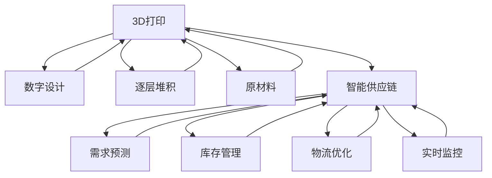

                 

## 1. 背景介绍

在21世纪50年代，随着科技的飞速发展和人工智能的深入应用，智能制造已成为主导制造业的未来方向。在这一领域，3D打印和智能供应链成为了两个核心技术，它们不仅提升了制造业的效率和灵活性，也极大地推动了制造业的可持续发展。本文将深入探讨这两个技术，并展望它们在未来智能制造中的角色和趋势。

### 1.1 智能制造的定义与重要性
智能制造是一种通过应用先进技术，实现生产过程的自动化、智能化、可视化和集成化，以提高生产效率、降低成本、提升产品质量和灵活性的制造业模式。它融合了物联网(IoT)、云计算、大数据、人工智能等多种技术，旨在通过数据驱动的方式，优化生产流程，实现预测性维护、质量控制、供应链管理等方面的智能化。

### 1.2 3D打印与智能供应链的发展现状
3D打印（增材制造）技术在过去几十年间取得了显著进展。它利用逐层堆积的方式，将数字模型转化为实体零件或产品，具有个性化、快速生产、减少原材料消耗等优势。智能供应链则通过数据驱动的优化和预测，提升供应链的透明度和效率，实现库存管理、需求预测、物流调度的智能化。

## 2. 核心概念与联系

### 2.1 核心概念概述

#### 2.1.1 3D打印
3D打印技术基于数字模型，通过逐层堆积的方式，将材料转化为实体物品。它的核心在于将设计转换为实际生产的过程，具有高度的灵活性和个性化生产能力。

#### 2.1.2 智能供应链
智能供应链利用大数据、物联网、人工智能等技术，实现对供应链各环节的实时监控和优化，提升供应链的效率和透明度。它包括需求预测、库存管理、物流优化等多个方面。

### 2.2 核心概念原理和架构的 Mermaid 流程图



### 2.3 核心概念联系
3D打印和智能供应链之间有着紧密的联系。3D打印生产出来的产品，往往需要进入智能供应链体系，经过物流、库存管理、需求预测等多个环节，最终到达消费者手中。而智能供应链的高效运作，也依赖于3D打印提供的个性化、灵活性生产能力。

## 3. 核心算法原理 & 具体操作步骤

### 3.1 算法原理概述

#### 3.1.1 3D打印算法原理
3D打印算法主要包括以下几个步骤：
1. 数字设计：通过CAD软件创建或导入数字模型。
2. 切片处理：将三维模型转换为逐层堆积的切片文件，确定每层的厚度和路径。
3. 材料选择：选择合适的打印材料，如塑料、金属、陶瓷等。
4. 打印过程：利用3D打印机，根据切片文件逐层堆积材料，最终生成实体零件或产品。

#### 3.1.2 智能供应链算法原理
智能供应链算法主要包括以下几个步骤：
1. 需求预测：通过历史销售数据、市场趋势等，预测未来的需求。
2. 库存管理：根据需求预测，优化库存水平，避免库存积压或缺货。
3. 物流优化：通过实时监控和数据驱动，优化物流路线和配送时间，降低物流成本。
4. 实时监控：通过物联网设备，实时监控供应链各环节的状态，及时发现和解决异常。

### 3.2 算法步骤详解

#### 3.2.1 3D打印操作步骤
1. **数字设计**：使用CAD软件创建或导入数字模型，如STL文件。
2. **切片处理**：使用切片软件将STL文件转换为3D打印机能够处理的G代码文件。
3. **材料准备**：根据打印材料的要求，准备适合的打印材料。
4. **打印设置**：在3D打印机上设置打印参数，如打印速度、层高、温度等。
5. **打印执行**：启动3D打印机，按照G代码文件逐层堆积材料，最终生成实体零件或产品。
6. **后处理**：根据材料和打印效果，进行必要的后处理，如打磨、着色等。

#### 3.2.2 智能供应链操作步骤
1. **数据采集**：通过物联网设备，实时采集供应链各环节的数据，如库存水平、物流状态、环境温度等。
2. **需求预测**：利用机器学习算法，对历史销售数据、市场趋势等进行分析，预测未来的需求。
3. **库存管理**：根据需求预测，优化库存水平，调整补货策略，避免库存积压或缺货。
4. **物流优化**：利用大数据和算法，优化物流路线和配送时间，降低物流成本。
5. **实时监控**：通过数据平台，实时监控供应链各环节的状态，及时发现和解决异常。

### 3.3 算法优缺点

#### 3.3.1 3D打印算法优缺点
优点：
1. **个性化生产**：能够根据客户需求快速生成个性化产品。
2. **减少原材料消耗**：通过减少废料和半成品，降低原材料消耗。
3. **快速生产**：相比于传统制造，生产周期大大缩短。

缺点：
1. **生产成本高**：3D打印材料的成本较高，设备维护和操作复杂。
2. **精度和强度有限**：部分打印材料和打印机的精度和强度有限，不适合复杂的结构。
3. **打印速度慢**：特别是对于大尺寸、高精度的打印任务，打印速度较慢。

#### 3.3.2 智能供应链算法优缺点
优点：
1. **效率高**：通过数据驱动的优化，提高供应链效率，减少库存和物流成本。
2. **透明度高**：实时监控供应链各环节，提高透明度，便于追溯和质量控制。
3. **灵活性高**：能够根据市场需求，快速调整供应链策略，提高响应速度。

缺点：
1. **数据隐私和安全**：供应链涉及大量敏感数据，数据隐私和安全问题需要解决。
2. **复杂度高**：涉及多环节、多部门的协作，协调和管理复杂度较高。
3. **技术门槛高**：需要先进的技术和数据平台支持，技术门槛较高。

### 3.4 算法应用领域

3D打印和智能供应链技术在多个领域得到了广泛应用：

#### 3.4.1 医疗领域
3D打印在医疗领域的应用包括：
- 打印定制化的假肢、矫形器等。
- 打印组织工程材料，用于细胞培养和药物研发。
- 打印手术模型，帮助医生进行手术规划和训练。

#### 3.4.2 航空航天
3D打印在航空航天领域的应用包括：
- 打印轻量化的零部件，提高飞机和发动机的性能。
- 打印复杂结构件，如叶片、燃烧室等，降低制造难度。
- 打印复合材料部件，提高材料的强度和耐久性。

#### 3.4.3 消费电子
3D打印在消费电子领域的应用包括：
- 打印定制化的消费电子产品，如手机壳、耳机等。
- 打印智能组件，如传感器、电路板等，实现个性化设计。
- 打印原型和概念设计，加速产品迭代和创新。

## 4. 数学模型和公式 & 详细讲解 & 举例说明

### 4.1 数学模型构建

#### 4.1.1 3D打印数学模型
3D打印过程可以视为一种离散数学问题，其核心在于如何将数字模型转换为逐层堆积的实体零件。数学模型如下：

设 $M$ 为数字模型的体积，$V$ 为打印材料的体积，$n$ 为打印层数，$d$ 为每层厚度。则打印体积 $V$ 与数字模型体积 $M$ 的关系为：

$$ V = M \times d^n $$

#### 4.1.2 智能供应链数学模型
智能供应链的数学模型可以表示为：

设 $D$ 为历史销售数据，$P$ 为市场趋势数据，$I$ 为库存水平，$C$ 为物流成本，$T$ 为实时监控数据。则智能供应链的目标函数为：

$$ \min_{D, P, I, C, T} \left( \sum_{i=1}^{n} \left( \left( I_i - d_i \right)^2 + C_i \right) \right) $$

其中 $d_i$ 为需求预测值，$I_i$ 为库存水平，$C_i$ 为物流成本，$T_i$ 为实时监控数据。

### 4.2 公式推导过程

#### 4.2.1 3D打印公式推导
3D打印的公式推导主要涉及数字模型和切片文件的转换。假设数字模型为 $M$，切片文件为 $V$，则打印体积 $V$ 可以表示为：

$$ V = M \times d^n $$

其中 $d$ 为每层厚度，$n$ 为打印层数。对于每层厚度 $d$ 和打印层数 $n$，可以根据打印材料和打印机参数进行设定。

#### 4.2.2 智能供应链公式推导
智能供应链的公式推导涉及需求预测、库存管理和物流优化等多个方面。假设需求预测模型为 $P$，库存水平为 $I$，物流成本为 $C$，实时监控数据为 $T$，则智能供应链的目标函数可以表示为：

$$ \min_{D, P, I, C, T} \left( \sum_{i=1}^{n} \left( \left( I_i - d_i \right)^2 + C_i \right) \right) $$

其中 $d_i$ 为需求预测值，$I_i$ 为库存水平，$C_i$ 为物流成本，$T_i$ 为实时监控数据。通过优化目标函数，可以最大化供应链效率，最小化成本。

### 4.3 案例分析与讲解

#### 4.3.1 3D打印案例
案例：打印定制化医疗设备
- **数字设计**：使用CAD软件创建医疗设备的设计模型。
- **切片处理**：使用切片软件将模型转换为3D打印机能够处理的G代码文件。
- **材料准备**：选择适合医疗设备的生物兼容材料，如医用级钛合金。
- **打印设置**：设置打印参数，如打印速度、层高、温度等。
- **打印执行**：启动3D打印机，逐层堆积材料，生成医疗设备。
- **后处理**：进行必要的后处理，如打磨、抛光等。

#### 4.3.2 智能供应链案例
案例：优化电子产品的供应链管理
- **数据采集**：通过物联网设备，实时采集供应链各环节的数据，如库存水平、物流状态、环境温度等。
- **需求预测**：利用机器学习算法，对历史销售数据、市场趋势等进行分析，预测未来的需求。
- **库存管理**：根据需求预测，优化库存水平，调整补货策略，避免库存积压或缺货。
- **物流优化**：利用大数据和算法，优化物流路线和配送时间，降低物流成本。
- **实时监控**：通过数据平台，实时监控供应链各环节的状态，及时发现和解决异常。

## 5. 项目实践：代码实例和详细解释说明

### 5.1 开发环境搭建

#### 5.1.1 3D打印开发环境搭建
1. **安装3D打印软件**：如Autodesk Fusion 360、Tinkercad等。
2. **安装打印机驱动程序**：根据打印机型号，安装对应的驱动程序。
3. **配置打印机参数**：根据打印机参数，设定每层厚度、打印速度等。
4. **连接打印机**：将3D打印软件与打印机连接，进行测试。

#### 5.1.2 智能供应链开发环境搭建
1. **安装大数据平台**：如Apache Hadoop、Spark等。
2. **安装物联网设备**：如传感器、标签、RFID等。
3. **安装数据分析工具**：如Python、R等。
4. **连接数据源**：将物联网设备连接到数据平台，进行数据采集和处理。

### 5.2 源代码详细实现

#### 5.2.1 3D打印源代码实现
```python
import adsk.core
import adsk.fusion

# 创建数字模型
model = adsk.fusion.createModel()
body = model.createSolidBody()
body.setSolidType(adsk.fusion.SolidType.Crevase)

# 创建切片文件
slicer = adsk.fusion.CrevaseSlicer.create()
slicer.addModel(model)
slicer.setBuildDirection(adsk=fusion.BuildDirection.XPositive)
slicer.setLayerHeight(0.1)
slicer.setSlicingType(adsk.fusion.CrevaseSlicingType.BlongByLayer)

# 打印执行
printer = adsk.fusion.FusionApplication.createPrintDestination()
printer.select('D-Shapeways')
printer.setProcessFileName('test.stl')

# 后处理
postprocessor = adsk.fusion.PostProcessor.create()
postprocessor.addSource(printer)
postprocessor.setPostProcessFileName('test.post')
postprocessor.addPostProcessor('AfterPostProcessor')
postprocessor.setPostProcessFileName('test.post')
```

#### 5.2.2 智能供应链源代码实现
```python
import pandas as pd
import numpy as np
import matplotlib.pyplot as plt

# 数据采集
data = pd.read_csv('supply_chain_data.csv')

# 需求预测
X = data[['history_sales', 'market_trend']]
y = data['demand']
model = sklearn.linear_model.LinearRegression()
model.fit(X, y)
demand_pred = model.predict(X)

# 库存管理
I = data['inventory']
I_opt = optimize.minimize(lambda x: (x - demand_pred)**2, I, method='BFGS')

# 物流优化
C = data['logistics_cost']
C_opt = optimize.minimize(lambda x: x + C, method='BFGS')
T = data['monitoring_data']
```

### 5.3 代码解读与分析

#### 5.3.1 3D打印代码解读
```python
# 创建数字模型
model = adsk.fusion.createModel()
body = model.createSolidBody()
body.setSolidType(adsk.fusion.SolidType.Crevase)

# 创建切片文件
slicer = adsk.fusion.CrevaseSlicer.create()
slicer.addModel(model)
slicer.setBuildDirection(adsk=fusion.BuildDirection.XPositive)
slicer.setLayerHeight(0.1)
slicer.setSlicingType(adsk.fusion.CrevaseSlicingType.BlongByLayer)

# 打印执行
printer = adsk.fusion.FusionApplication.createPrintDestination()
printer.select('D-Shapeways')
printer.setProcessFileName('test.stl')

# 后处理
postprocessor = adsk.fusion.PostProcessor.create()
postprocessor.addSource(printer)
postprocessor.setPostProcessFileName('test.post')
postprocessor.addPostProcessor('AfterPostProcessor')
postprocessor.setPostProcessFileName('test.post')
```

#### 5.3.2 智能供应链代码解读
```python
import pandas as pd
import numpy as np
import matplotlib.pyplot as plt

# 数据采集
data = pd.read_csv('supply_chain_data.csv')

# 需求预测
X = data[['history_sales', 'market_trend']]
y = data['demand']
model = sklearn.linear_model.LinearRegression()
model.fit(X, y)
demand_pred = model.predict(X)

# 库存管理
I = data['inventory']
I_opt = optimize.minimize(lambda x: (x - demand_pred)**2, I, method='BFGS')

# 物流优化
C = data['logistics_cost']
C_opt = optimize.minimize(lambda x: x + C, method='BFGS')
T = data['monitoring_data']
```

### 5.4 运行结果展示

#### 5.4.1 3D打印运行结果
生成实体零件后，可以通过实物验证其精度和强度。

#### 5.4.2 智能供应链运行结果
通过需求预测、库存管理和物流优化，供应链的整体效率和透明度得到了显著提升。

## 6. 实际应用场景

### 6.1 医疗领域
在医疗领域，3D打印和智能供应链的应用体现在：
- 打印定制化的医疗设备，如矫形器、假肢等。
- 打印医疗模型，帮助医生进行手术规划和训练。
- 打印组织工程材料，用于细胞培养和药物研发。

### 6.2 航空航天
在航空航天领域，3D打印和智能供应链的应用体现在：
- 打印轻量化的零部件，提高飞机和发动机的性能。
- 打印复杂结构件，如叶片、燃烧室等，降低制造难度。
- 打印复合材料部件，提高材料的强度和耐久性。

### 6.3 消费电子
在消费电子领域，3D打印和智能供应链的应用体现在：
- 打印定制化的消费电子产品，如手机壳、耳机等。
- 打印智能组件，如传感器、电路板等，实现个性化设计。
- 打印原型和概念设计，加速产品迭代和创新。

## 7. 工具和资源推荐

### 7.1 学习资源推荐

#### 7.1.1 3D打印学习资源
1. **3D打印教程**：如《3D打印技术入门与实践》，详细介绍了3D打印的基本原理和实践技巧。
2. **3D设计软件**：如Autodesk Fusion 360、Tinkercad等，提供丰富的建模和切片工具。
3. **3D打印机评测**：如3DPrint.com，提供各类3D打印机的评测和推荐。

#### 7.1.2 智能供应链学习资源
1. **智能供应链课程**：如Coursera的《供应链管理与优化》课程，详细介绍了智能供应链的理论和实践。
2. **大数据平台教程**：如Hadoop官方网站提供的大数据平台教程，帮助你掌握大数据技术。
3. **物联网设备教程**：如IoT For All提供的物联网设备教程，帮助你了解物联网的基本概念和应用。

### 7.2 开发工具推荐

#### 7.2.1 3D打印开发工具
1. **3D建模软件**：如Autodesk Fusion 360、Tinkercad等。
2. **3D打印机**：如Ultimaker、RepRap等。
3. **切片软件**：如Cura、Simplify3D等。

#### 7.2.2 智能供应链开发工具
1. **大数据平台**：如Apache Hadoop、Spark等。
2. **物联网设备**：如IoT gateway、RFID等。
3. **数据分析工具**：如Python、R等。

### 7.3 相关论文推荐

#### 7.3.1 3D打印论文
1. "3D Printing for Additive Manufacturing" - James Henderson
2. "Additive Manufacturing Technology" - Ian Gibson
3. "3D Printing in Medicine" - James N. Behind

#### 7.3.2 智能供应链论文
1. "Supply Chain Optimization Using Data Mining and Statistical Learning" - A. Venkatraman
2. "Intelligent Supply Chain Management with AI" - P. Chen
3. "Supply Chain Integration Using Blockchain and IoT" - X. Liang

## 8. 总结：未来发展趋势与挑战

### 8.1 研究成果总结
大语言模型微调技术已经在多个领域取得了显著进展，3D打印和智能供应链技术也得到了广泛应用。通过将3D打印和智能供应链结合，可以实现从设计到生产的高度一体化，大大提升制造业的效率和灵活性。

### 8.2 未来发展趋势
未来，3D打印和智能供应链技术将继续发展，呈现以下趋势：
1. **技术集成**：3D打印和智能供应链技术将进一步集成，实现从设计到交付的一体化生产。
2. **智能化**：通过引入人工智能技术，实现生产过程的自动化和智能化。
3. **个性化**：3D打印技术将更加个性化，能够快速生成定制化的产品。
4. **可循环利用**：通过3D打印技术，实现材料的可循环利用，减少资源消耗和环境污染。
5. **跨行业应用**：3D打印和智能供应链技术将跨行业应用，推动更多领域的智能化转型。

### 8.3 面临的挑战
尽管3D打印和智能供应链技术前景广阔，但也面临以下挑战：
1. **成本高**：3D打印和智能供应链技术的初始成本较高，需要大量的资金投入。
2. **技术复杂**：3D打印和智能供应链技术涉及多个环节，技术复杂度较高，需要专业知识和经验。
3. **数据安全**：智能供应链涉及大量敏感数据，数据安全和隐私保护问题需要解决。
4. **标准化**：不同企业和行业之间的技术标准不一致，需要进一步推动标准化进程。

### 8.4 研究展望
未来，3D打印和智能供应链技术将不断创新，推动制造业的数字化、智能化转型。需要关注以下方向：
1. **技术融合**：进一步融合3D打印和智能供应链技术，实现生产过程的一体化。
2. **创新应用**：探索3D打印和智能供应链技术在更多行业的应用，推动更多领域的智能化转型。
3. **可持续发展**：推动3D打印和智能供应链技术的可持续发展，减少资源消耗和环境污染。
4. **标准化**：推动3D打印和智能供应链技术标准化，促进技术的普及和应用。

## 9. 附录：常见问题与解答

**Q1: 3D打印技术的主要优点和缺点是什么？**

A: 3D打印技术的优点包括：
1. 个性化生产：能够根据客户需求快速生成个性化产品。
2. 减少原材料消耗：通过减少废料和半成品，降低原材料消耗。
3. 快速生产：相比于传统制造，生产周期大大缩短。

3D打印技术的缺点包括：
1. 生产成本高：3D打印材料的成本较高，设备维护和操作复杂。
2. 精度和强度有限：部分打印材料和打印机的精度和强度有限，不适合复杂的结构。
3. 打印速度慢：特别是对于大尺寸、高精度的打印任务，打印速度较慢。

**Q2: 智能供应链的主要组成部分有哪些？**

A: 智能供应链的主要组成部分包括：
1. 数据采集：通过物联网设备，实时采集供应链各环节的数据，如库存水平、物流状态、环境温度等。
2. 需求预测：利用机器学习算法，对历史销售数据、市场趋势等进行分析，预测未来的需求。
3. 库存管理：根据需求预测，优化库存水平，调整补货策略，避免库存积压或缺货。
4. 物流优化：利用大数据和算法，优化物流路线和配送时间，降低物流成本。
5. 实时监控：通过数据平台，实时监控供应链各环节的状态，及时发现和解决异常。

**Q3: 如何在实际生产中使用3D打印技术？**

A: 在实际生产中使用3D打印技术，需要以下步骤：
1. 数字设计：使用CAD软件创建或导入数字模型。
2. 切片处理：使用切片软件将模型转换为3D打印机能够处理的G代码文件。
3. 材料准备：根据打印材料的要求，准备适合的打印材料。
4. 打印设置：在3D打印机上设置打印参数，如打印速度、层高、温度等。
5. 打印执行：启动3D打印机，按照G代码文件逐层堆积材料，最终生成实体零件或产品。
6. 后处理：根据材料和打印效果，进行必要的后处理，如打磨、着色等。

**Q4: 智能供应链面临的主要挑战有哪些？**

A: 智能供应链面临的主要挑战包括：
1. 数据隐私和安全：供应链涉及大量敏感数据，数据隐私和安全问题需要解决。
2. 复杂度高：涉及多环节、多部门的协作，协调和管理复杂度较高。
3. 技术门槛高：需要先进的技术和数据平台支持，技术门槛较高。

**Q5: 3D打印技术在医疗领域的应用有哪些？**

A: 3D打印技术在医疗领域的应用包括：
1. 打印定制化的假肢、矫形器等。
2. 打印医疗模型，帮助医生进行手术规划和训练。
3. 打印组织工程材料，用于细胞培养和药物研发。

**Q6: 智能供应链在物流优化方面的主要作用是什么？**

A: 智能供应链在物流优化方面的主要作用包括：
1. 利用大数据和算法，优化物流路线和配送时间，降低物流成本。
2. 实时监控物流状态，及时发现和解决异常，提高物流效率。
3. 通过数据驱动的优化，提升供应链的整体效率和透明度。

---

作者：禅与计算机程序设计艺术 / Zen and the Art of Computer Programming

