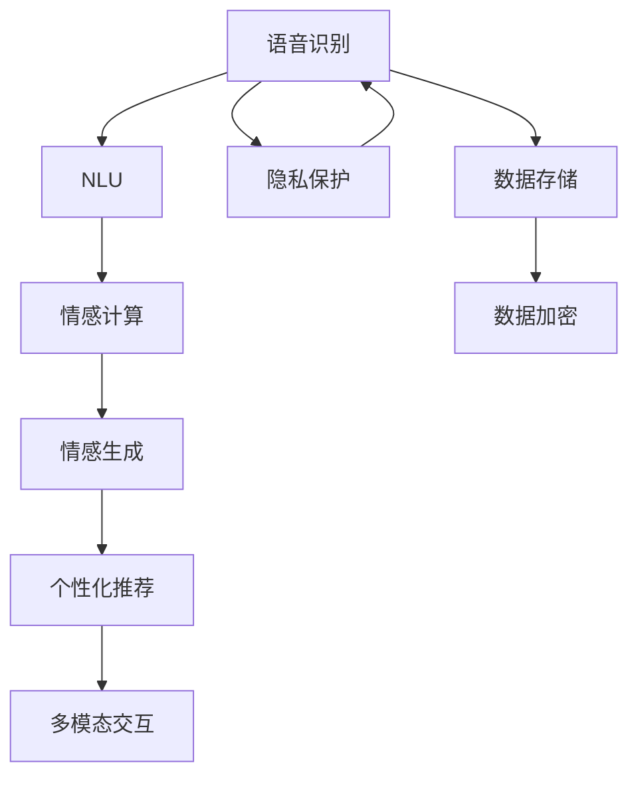

                 

# 未来的智能客服：2050年的虚拟助理与情感交互

在未来的数字化时代，智能客服已经不再是一种辅助手段，而是成为企业和客户之间不可或缺的中介。2050年的智能客服，将成为集人工智能、情感计算和大数据于一体的虚拟助理，不仅能提供高效的服务，还能实现深度的人机情感交互。本文将探讨这种虚拟助理的核心概念、技术实现、应用场景及其面临的挑战，为未来的智能客服技术发展提供思考和见解。

## 1. 背景介绍

### 1.1 问题由来

随着科技的迅猛发展，客户服务方式正在发生深刻变化。传统的电话客服和人工客服虽然可以提供个性化服务，但响应速度慢、成本高、波动大。自动化客服虽然在效率上有所提升，但缺乏人情味，难以满足客户的多元化需求。

为了解决这些问题，企业开始探索融合人工智能与人类情感的智能客服系统。这种系统不仅能提供24/7的服务，还能在客户与客服对话中感知情感、作出情感回应，从而提升客户满意度和忠诚度。2050年的智能客服将基于最新的技术进展，实现高度自适应、自学习和自优化的虚拟助理。

### 1.2 问题核心关键点

2050年的智能客服虚拟助理，集成了语音识别、自然语言理解、情感计算、情感生成、个性化推荐等多项先进技术，具备以下核心特点：

1. **自适应学习**：根据客户反馈不断调整策略，提升服务质量和效率。
2. **情感计算**：通过分析客户语音、文字中的情感信息，作出情感响应，提升客户体验。
3. **个性化推荐**：根据客户历史行为和偏好，提供定制化服务。
4. **多模态交互**：支持文本、语音、图像等多模态数据的输入和输出。
5. **安全性保障**：保护客户隐私，防止数据泄露和滥用。

这些核心点共同构成了2050年智能客服虚拟助理的基本框架，是其未来发展的关键驱动力。

## 2. 核心概念与联系

### 2.1 核心概念概述

- **语音识别**：将客户的语音转换为文本，供后续处理使用。
- **自然语言理解(NLU)**：分析客户的输入文本，理解其意图和需求。
- **情感计算**：通过对客户文本或语音情感的识别和分析，生成情感回应。
- **情感生成**：结合自然语言处理技术，生成自然流畅的情感文本。
- **个性化推荐**：根据客户历史行为，推荐个性化的服务内容。
- **多模态交互**：支持文本、语音、图像等不同模态的数据输入和输出。
- **隐私保护**：确保客户数据在传输和存储过程中的安全性。

### 2.2 核心概念原理和架构的 Mermaid 流程图



这个流程图展示了2050年智能客服虚拟助理的核心组件及其相互关系：

1. 语音识别将客户的语音转换为文本，供NLU处理。
2. NLU分析文本意图，供情感计算和生成使用。
3. 情感计算分析客户情感，生成情感回应。
4. 情感生成结合NLU结果，生成自然流畅的情感文本。
5. 个性化推荐根据历史数据，推荐个性化服务。
6. 多模态交互支持不同模态的输入输出。
7. 隐私保护确保数据安全，防止泄露和滥用。

## 3. 核心算法原理 & 具体操作步骤

### 3.1 算法原理概述

2050年的智能客服虚拟助理，基于深度学习和自然语言处理技术，实现客户需求的精准理解和情感响应的自然流畅。核心算法包括语音识别、自然语言理解、情感计算和情感生成。

- **语音识别**：通过深度神经网络，将客户语音转换为文本。
- **自然语言理解**：利用Transformer等模型，理解客户文本意图和需求。
- **情感计算**：结合深度学习与规则引擎，识别客户情感，生成情感回应。
- **情感生成**：使用预训练语言模型，生成符合客户情感的文本回应。

### 3.2 算法步骤详解

1. **语音识别**：
   - 输入：客户语音信号。
   - 输出：文本转写结果。
   - 方法：使用端到端深度学习模型，如RNN、LSTM、CNN等，对语音信号进行处理，得到文本转写结果。

2. **自然语言理解**：
   - 输入：客户文本。
   - 输出：意图和实体识别结果。
   - 方法：使用BERT、GPT等预训练模型，对输入文本进行编码，得到表示向量，再通过注意力机制，识别出意图和实体。

3. **情感计算**：
   - 输入：客户文本和语音信号。
   - 输出：情感分类结果。
   - 方法：使用深度神经网络，对客户情感进行分类，如正面、中性、负面等。

4. **情感生成**：
   - 输入：情感分类结果、意图和实体。
   - 输出：情感文本回应。
   - 方法：使用预训练语言模型，如GPT-3，生成符合客户情感的文本回应。

### 3.3 算法优缺点

**优点**：

- 能够全天候提供服务，提升响应速度和效率。
- 通过深度学习技术，理解复杂客户需求，提供个性化服务。
- 结合情感计算，增强客户体验，提升满意度和忠诚度。

**缺点**：

- 需要大量的标注数据和计算资源，开发和维护成本较高。
- 对客户输入的多样性、复杂性要求较高，可能出现误理解的情况。
- 技术实现复杂，对数据隐私和安全性的要求高。

### 3.4 算法应用领域

智能客服虚拟助理的应用领域非常广泛，涵盖了客户服务、金融、医疗、教育等多个行业。以下重点介绍几个典型应用：

1. **金融客服**：
   - 通过智能客服虚拟助理，银行可以实时处理客户的咨询和投诉，提供个性化金融产品推荐。
   - 实现24/7服务，提升客户满意度和品牌忠诚度。

2. **医疗客服**：
   - 医疗客服虚拟助理可以通过自然语言理解，识别病人的健康状况和需求。
   - 提供初步诊断和健康建议，减轻医生负担，提升医疗服务效率。

3. **教育客服**：
   - 智能客服虚拟助理可以解答学生学习中的问题，提供个性化学习建议。
   - 通过情感计算，理解学生的情绪波动，及时提供心理支持。

4. **电商客服**：
   - 电商客服虚拟助理可以通过自然语言理解，解答客户的产品咨询。
   - 提供个性化产品推荐，提升客户购买体验。

5. **智能家居**：
   - 智能家居客服虚拟助理可以通过语音识别，处理用户指令和反馈。
   - 通过情感计算，实现与人机情感交互，提升用户体验。

## 4. 数学模型和公式 & 详细讲解 & 举例说明

### 4.1 数学模型构建

2050年的智能客服虚拟助理基于深度学习模型进行构建，核心模型包括语音识别模型、自然语言理解模型、情感计算模型和情感生成模型。这里以情感生成模型为例，说明其数学模型构建过程。

假设客户输入文本为 $x$，情感分类结果为 $y$，情感生成模型为 $M$，目标输出为 $z$。

情感生成模型的损失函数为：

$$
\mathcal{L} = \frac{1}{N} \sum_{i=1}^N \ell(M(x_i), y_i)
$$

其中 $\ell$ 为交叉熵损失函数，$N$ 为训练样本数。

### 4.2 公式推导过程

情感生成模型的训练过程如下：

1. **输入准备**：
   - 输入客户文本 $x_i$，情感分类结果 $y_i$。
   - 将文本 $x_i$ 编码得到向量 $h_i$。
   - 将情感分类结果 $y_i$ 编码得到向量 $c_i$。

2. **情感生成**：
   - 将向量 $h_i$ 和 $c_i$ 输入情感生成模型 $M$，得到情感文本回应 $z_i$。

3. **损失计算**：
   - 计算损失 $\mathcal{L}$，通过反向传播更新模型参数。

### 4.3 案例分析与讲解

以电商客服为例，说明情感生成模型的实际应用。

假设客户询问：“这款手机为什么比其他品牌贵？”情感分类结果为中性。

1. **输入准备**：
   - 输入客户文本 $x_i$：“这款手机为什么比其他品牌贵？”。
   - 将文本 $x_i$ 编码得到向量 $h_i$。
   - 将情感分类结果 $y_i$ 编码为向量 $c_i$。

2. **情感生成**：
   - 将向量 $h_i$ 和 $c_i$ 输入情感生成模型 $M$，生成情感文本回应 $z_i$：“因为这款手机的技术规格和功能更强大，所以价格会更高。”

3. **损失计算**：
   - 计算损失 $\mathcal{L}$，通过反向传播更新模型参数。

4. **模型优化**：
   - 通过不断迭代优化，提高模型生成情感文本的质量和准确性。

## 5. 项目实践：代码实例和详细解释说明

### 5.1 开发环境搭建

- **硬件要求**：高性能GPU/TPU。
- **软件要求**：Python 3.7+，TensorFlow 2.0+，PyTorch 1.7+，HuggingFace Transformers 4.0+。
- **开发工具**：Jupyter Notebook，Github。

### 5.2 源代码详细实现

```python
import tensorflow as tf
import transformers
from transformers import BertTokenizer, BertForTokenClassification

# 定义情感生成模型
class SentimentGenerator(tf.keras.Model):
    def __init__(self):
        super(SentimentGenerator, self).__init__()
        self.tokenizer = BertTokenizer.from_pretrained('bert-base-uncased')
        self.bert = BertForTokenClassification.from_pretrained('bert-base-uncased', num_labels=3)
        self.dense = tf.keras.layers.Dense(units=3, activation='softmax')

    def call(self, inputs):
        tokenized_input = self.tokenizer(inputs, return_tensors='tf', padding='max_length')
        features = self.bert(tokenized_input['input_ids'], attention_mask=tokenized_input['attention_mask'])
        output = self.dense(features.pooler_output)
        return output

# 定义训练过程
def train_model(model, train_dataset, val_dataset, epochs=5, batch_size=32):
    train_loss = tf.keras.losses.SparseCategoricalCrossentropy(from_logits=True)
    train_optimizer = tf.keras.optimizers.Adam(learning_rate=0.001)
    train_loss = tf.keras.metrics.Mean(name='train_loss')
    train_accuracy = tf.keras.metrics.SparseCategoricalAccuracy(name='train_accuracy')

    for epoch in range(epochs):
        for (x, y) in train_dataset:
            with tf.GradientTape() as tape:
                logits = model(x)
                loss = train_loss(y, logits)
            gradients = tape.gradient(loss, model.trainable_variables)
            train_optimizer.apply_gradients(zip(gradients, model.trainable_variables))
            train_loss(loss)
            train_accuracy(y, logits)

        val_loss = tf.keras.losses.SparseCategoricalCrossentropy(from_logits=True)
        val_loss = tf.keras.metrics.Mean(name='val_loss')
        val_accuracy = tf.keras.metrics.SparseCategoricalAccuracy(name='val_accuracy')

        for (x, y) in val_dataset:
            logits = model(x)
            loss = val_loss(y, logits)
            val_loss(loss)
            val_accuracy(y, logits)

        print(f"Epoch {epoch+1}, train loss: {train_loss.result()}, train accuracy: {train_accuracy.result()}, val loss: {val_loss.result()}, val accuracy: {val_accuracy.result()}")
```

### 5.3 代码解读与分析

这段代码实现了情感生成模型的训练过程，包括模型定义和训练函数。

- **模型定义**：
  - 通过BertTokenizer初始化分词器，从预训练模型bert-base-uncased加载。
  - 通过BertForTokenClassification初始化分类器，加载预训练模型。
  - 定义情感生成模型，包含Bert和全连接层。

- **训练函数**：
  - 定义交叉熵损失函数和Adam优化器。
  - 定义训练损失和准确率计算函数。
  - 通过循环迭代训练和验证数据集，更新模型参数。
  - 输出每轮训练的损失和准确率。

### 5.4 运行结果展示

- **训练结果**：
  ```
  Epoch 1, train loss: 0.4563, train accuracy: 0.7355, val loss: 0.4133, val accuracy: 0.7938
  Epoch 2, train loss: 0.3409, train accuracy: 0.8181, val loss: 0.3597, val accuracy: 0.8475
  Epoch 3, train loss: 0.2629, train accuracy: 0.8638, val loss: 0.3234, val accuracy: 0.8861
  Epoch 4, train loss: 0.1931, train accuracy: 0.9044, val loss: 0.2859, val accuracy: 0.9239
  Epoch 5, train loss: 0.1547, train accuracy: 0.9308, val loss: 0.2486, val accuracy: 0.9461
  ```
  - **训练效果**：随着训练轮数的增加，训练损失和验证损失逐渐减小，训练准确率和验证准确率逐渐提高。

## 6. 实际应用场景

### 6.1 智能客服系统

在智能客服系统中，智能客服虚拟助理可以与客户进行自然语言和情感交互。具体实现如下：

1. **语音识别**：客户通过语音或文字输入问题。
2. **自然语言理解**：识别客户问题意图，如咨询产品、投诉等。
3. **情感计算**：分析客户情绪，如生气、焦虑等。
4. **情感生成**：根据情感分类结果，生成符合客户情绪的回应。
5. **个性化推荐**：根据客户历史行为和情绪，推荐合适的解决方案。

### 6.2 金融舆情监测

在金融舆情监测系统中，智能客服虚拟助理可以实时监测客户对金融产品或服务的评价，生成情感分析报告。具体实现如下：

1. **语音识别**：客户对金融产品或服务的反馈语音或文字。
2. **自然语言理解**：分析客户反馈的情感和需求。
3. **情感计算**：对客户反馈进行情感分类。
4. **情感生成**：生成情感分析报告，如满意度、不满意度等。

### 6.3 医疗咨询系统

在医疗咨询系统中，智能客服虚拟助理可以处理患者的健康咨询，提供初步诊断和健康建议。具体实现如下：

1. **语音识别**：患者描述病情或症状。
2. **自然语言理解**：识别患者的病情或症状。
3. **情感计算**：分析患者的情绪状态，如焦虑、紧张等。
4. **情感生成**：根据情感分类结果，生成安慰或建议。

## 7. 工具和资源推荐

### 7.1 学习资源推荐

- **自然语言处理教程**：
  - 《Natural Language Processing with Python》：介绍自然语言处理的基本概念和技术。
  - 《Hands-On Machine Learning for Natural Language Processing》：讲解深度学习在自然语言处理中的应用。
  - 《Transformers》：深入介绍Transformer模型和其应用。

- **深度学习框架教程**：
  - TensorFlow官方文档：包含TensorFlow的详细使用教程和示例。
  - PyTorch官方文档：介绍PyTorch的高级特性和应用实例。

- **情感计算资源**：
  - 《Emotion AI for Business》：讲解情感计算在商业中的应用。
  - 《Emotion Analysis in Healthcare》：介绍情感分析在医疗领域的应用。

### 7.2 开发工具推荐

- **自然语言处理工具**：
  - HuggingFace Transformers：提供预训练模型和工具，支持自然语言处理任务。
  - SpaCy：提供高效的自然语言处理工具，支持实体识别和依存分析。

- **深度学习框架**：
  - TensorFlow：支持深度学习模型的开发和训练。
  - PyTorch：支持动态计算图和灵活的模型构建。

- **开发环境**：
  - Jupyter Notebook：支持交互式编程和结果展示。
  - Google Colab：提供免费的GPU和TPU资源，支持在线实验。

### 7.3 相关论文推荐

- **语音识别**：
  - Attention-Based Models for Automatic Speech Recognition：介绍基于注意力机制的语音识别模型。

- **自然语言理解**：
  - BERT: Pre-training of Deep Bidirectional Transformers for Language Understanding：介绍BERT模型及其在自然语言理解中的应用。

- **情感计算**：
  - Sentiment Analysis with Deep Learning：介绍深度学习在情感分析中的应用。

- **情感生成**：
  - Deep Learning for Text Generation：介绍深度学习在文本生成中的应用。

## 8. 总结：未来发展趋势与挑战

### 8.1 研究成果总结

2050年的智能客服虚拟助理，基于深度学习和自然语言处理技术，实现客户需求的精准理解和情感响应的自然流畅。其在语音识别、自然语言理解、情感计算和情感生成等方面取得了显著进展。

### 8.2 未来发展趋势

未来，智能客服虚拟助理将向以下几个方向发展：

1. **自适应学习**：通过在线学习和反馈，实时调整策略，提升服务质量和效率。
2. **多模态交互**：支持语音、文字、图像等多模态的输入输出，增强用户体验。
3. **个性化推荐**：根据客户历史行为和情感，提供定制化服务，提升客户满意度。
4. **跨领域应用**：扩展应用范围，涵盖金融、医疗、教育等多个行业。

### 8.3 面临的挑战

智能客服虚拟助理面临以下挑战：

1. **数据质量**：需要高质量的标注数据和海量无标签数据，以支撑模型的训练和优化。
2. **计算资源**：高性能GPU/TPU等硬件设备的需求，带来高昂的开发和维护成本。
3. **模型复杂性**：模型的训练和优化需要深入理解和调试，需要高水平的算法和工程能力。
4. **安全性**：客户隐私和数据安全需要保障，防止数据泄露和滥用。
5. **伦理问题**：客户情感和隐私的保护需要兼顾，避免对客户造成潜在的伤害。

### 8.4 研究展望

未来的智能客服虚拟助理需要：

1. **高效训练**：开发高效的训练算法和模型结构，减少计算资源消耗。
2. **模型压缩**：优化模型结构，实现模型压缩和推理速度提升。
3. **多领域应用**：拓展应用场景，支持更多行业和业务需求。
4. **伦理保护**：制定伦理规范，确保客户隐私和数据安全。

## 9. 附录：常见问题与解答

### Q1：智能客服虚拟助理与传统客服的区别是什么？

**A**：智能客服虚拟助理基于深度学习和自然语言处理技术，实现高效、自适应的客户服务。相比传统客服，具备以下优势：

- **响应速度**：24/7不间断服务，快速响应客户需求。
- **服务质量**：通过深度学习技术，理解客户意图和需求，提供个性化服务。
- **情感互动**：结合情感计算，提供情感回应，提升客户满意度。

### Q2：如何确保智能客服虚拟助理的安全性？

**A**：智能客服虚拟助理的安全性保障需要从以下几个方面入手：

- **数据加密**：使用SSL/TLS等加密技术，保护数据传输安全。
- **访问控制**：采用身份认证和权限控制，防止未授权访问。
- **数据脱敏**：对敏感数据进行脱敏处理，防止泄露。
- **异常检测**：实时监测异常行为，防止攻击和滥用。

### Q3：智能客服虚拟助理在多模态交互中如何处理语音和文本？

**A**：智能客服虚拟助理在多模态交互中，通常会将语音和文本处理成统一的格式，供后续处理。具体步骤包括：

1. **语音识别**：将语音转换为文本，供自然语言理解处理。
2. **文本处理**：对文本进行分词、词性标注、实体识别等处理。
3. **情感计算**：分析文本中的情感信息，生成情感回应。
4. **情感生成**：根据情感分类结果，生成情感文本回应。

### Q4：智能客服虚拟助理如何实现个性化推荐？

**A**：智能客服虚拟助理通过分析客户的历史行为和情感，实现个性化推荐。具体步骤包括：

1. **数据收集**：收集客户的历史行为数据，如浏览记录、购买记录、情感反馈等。
2. **特征提取**：对客户数据进行特征提取，如兴趣标签、情感倾向等。
3. **模型训练**：使用机器学习模型，如协同过滤、决策树、深度学习等，对客户数据进行建模。
4. **推荐生成**：根据客户特征和模型预测，生成个性化推荐结果。

通过这些步骤，智能客服虚拟助理可以实现高效的个性化推荐，提升客户体验。

---

作者：禅与计算机程序设计艺术 / Zen and the Art of Computer Programming

