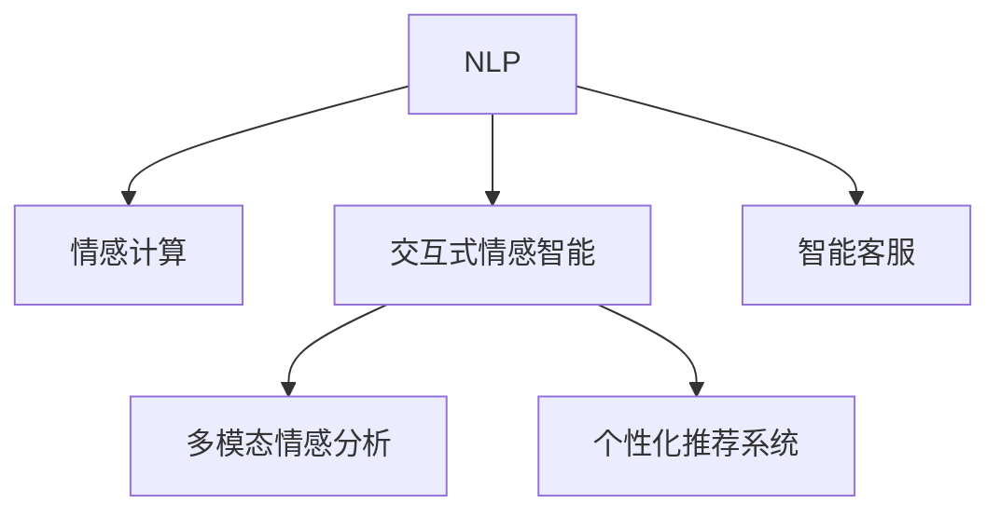

                 

# 未来的智能客服：2050年的虚拟助理与情感交互

## 1. 背景介绍

### 1.1 问题由来

智能客服作为提升客户服务体验的重要手段，已经在各行各业得到了广泛应用。然而，传统的基于规则的客服系统往往只能处理结构化的问题，无法理解客户的情景语境和情感变化，使得客户满意度难以得到真正提升。尤其是随着消费需求的多元化、个性化，以及客户对服务体验要求的不断提高，现有的智能客服系统已经难以满足用户的期望。

### 1.2 问题核心关键点

要解决现有智能客服系统面临的问题，关键在于如何构建具备自然语言理解、情感分析、上下文感知能力的智能系统。当前，大语言模型结合情感交互技术的应用，有望提供下一代智能客服的新范式，使虚拟助理能够更好地理解客户情绪，提供个性化服务，从而实现真正意义上的“以用户为中心”的智能客服。

### 1.3 问题研究意义

实现具备情感交互能力的智能客服系统，不仅能够显著提升客户服务质量，降低企业的运营成本，还能够为企业的品牌形象塑造和客户忠诚度提升提供新的动力。同时，这种系统还能够广泛应用于医疗、教育、金融等多个领域，帮助人们更高效地解决问题，提升生活品质。因此，研究情感交互技术在智能客服中的应用，具有重要的理论和实际意义。

## 2. 核心概念与联系

### 2.1 核心概念概述

为更好地理解情感交互技术在智能客服中的应用，本节将介绍几个密切相关的核心概念：

- 自然语言处理(Natural Language Processing, NLP)：利用计算机技术处理、理解和生成人类语言的技术，包括语音识别、语义理解、情感分析等。

- 情感计算(Affective Computing)：研究如何通过机器学习技术，从文本、语音、面部表情等输入中识别和分析情感。

- 交互式情感智能(Interactive Affective Intelligence, IA)：指机器在交互过程中能够识别和响应情感变化的能力，包括情绪识别、情感反馈等。

- 多模态情感分析(Multimodal Affective Analysis)：结合文本、语音、图像等多种模态信息，进行更全面、准确的情感分析。

- 个性化推荐系统(Recommendation System)：通过分析用户的行为、偏好等数据，推荐最符合用户需求的产品或服务。

- 智能客服(Customer Service Chatbot)：结合自然语言处理、情感计算等技术，构建能够与用户进行自然语言交互的智能系统。

这些核心概念之间的逻辑关系可以通过以下Mermaid流程图来展示：



这个流程图展示了NLP、情感计算、交互式情感智能、多模态情感分析、个性化推荐系统和智能客服等概念之间的联系：

1. NLP作为情感计算的基础，提供语言理解的底层技术。
2. 情感计算基于NLP，进一步分析用户的情感状态。
3. 交互式情感智能在情感计算的基础上，使系统具备情感交互能力。
4. 多模态情感分析结合多种输入模态，提高情感识别的准确性。
5. 个性化推荐系统在情感计算的基础上，推荐更加符合用户需求的个性化服务。
6. 智能客服综合以上技术，实现真正意义上的情感交互。

## 3. 核心算法原理 & 具体操作步骤
### 3.1 算法原理概述

情感交互技术的核心在于如何让智能客服系统理解并响应客户的情感变化。具体来说，系统需要具备以下能力：

1. **情感识别**：从客户的文本输入、语音、面部表情等输入中，识别出用户的情绪状态。

2. **情感响应**：根据用户当前的情感状态，选择最合适的服务策略和语料，进行情感化的反馈和引导。

3. **上下文感知**：在对话过程中，记录用户的情感历史和语境信息，以便更好地理解和响应。

4. **多模态融合**：结合文本、语音、图像等多种模态信息，进行更全面、准确的情感分析。

5. **个性化推荐**：根据用户的情感状态和偏好，推荐最符合用户需求的服务和内容。

### 3.2 算法步骤详解

基于情感交互的智能客服系统主要包括以下几个关键步骤：

**Step 1: 数据收集与预处理**

- 收集客户的文本输入、语音、面部表情等多种模态的数据，构建情感标注的数据集。
- 对数据进行清洗、去噪、归一化等预处理操作，以便后续模型训练。

**Step 2: 模型训练与评估**

- 选择合适的情感分析模型，如BERT、GPT等大语言模型，在标注数据集上进行训练。
- 使用交叉验证等方法，评估模型的情感识别准确率、召回率等性能指标，调整模型参数。

**Step 3: 情感交互逻辑设计**

- 设计情感交互的逻辑流程，包括情感识别、情感反馈、多模态融合等模块。
- 定义情感状态的转换规则，确保系统能够动态地调整情感策略。

**Step 4: 多轮对话管理**

- 实现多轮对话的管理逻辑，记录对话历史和用户偏好，以便更好地理解和响应。
- 设计对话结束机制，如对话时长限制、特定话题退出等。

**Step 5: 个性化推荐与适配**

- 根据用户情感状态和偏好，进行个性化推荐，如推荐相关产品、服务或内容。
- 对推荐结果进行适配，调整推荐策略，提升用户满意度。

**Step 6: 持续学习与优化**

- 收集用户反馈，进行持续学习，不断优化情感识别和响应的准确性。
- 定期更新模型，确保系统能够适应新的情感场景和需求。

### 3.3 算法优缺点

基于情感交互的智能客服系统具有以下优点：

1. **情感理解与响应**：能够真正理解客户的情感状态，提供更加人性化的服务，提升客户满意度。

2. **上下文感知**：记录对话历史和用户偏好，提供更加个性化的服务。

3. **多模态融合**：结合多种模态信息，进行更全面、准确的情感分析。

4. **持续学习**：通过持续学习，不断优化情感识别和响应的准确性。

但同时也存在以下缺点：

1. **数据隐私问题**：在收集用户情感数据时，需要考虑数据隐私和伦理问题。

2. **数据标注成本高**：标注数据集的成本较高，尤其是在收集多种模态数据时，难度更大。

3. **情感计算的复杂性**：情感计算的复杂度较高，需要处理多种情感状态和语境信息。

4. **模型训练复杂性**：训练情感识别模型需要较大的数据量和计算资源，模型参数复杂度较高。

5. **交互逻辑设计难度**：情感交互逻辑的设计较为复杂，需要考虑多轮对话的管理和情感状态的转换。

## 4. 数学模型和公式 & 详细讲解  
### 4.1 数学模型构建

情感交互技术主要通过大语言模型进行情感识别和响应。具体来说，假设客户输入的文本为 $x$，系统对情感的预测为 $y$，则情感识别的目标是最小化损失函数 $\mathcal{L}(\theta)$：

$$
\mathcal{L}(\theta) = \frac{1}{N} \sum_{i=1}^N \ell(M_{\theta}(x_i),y_i)
$$

其中 $\ell$ 为交叉熵损失函数， $M_{\theta}$ 为预训练的情感识别模型， $\theta$ 为其参数。

### 4.2 公式推导过程

情感识别模型的训练过程主要包括以下几个步骤：

1. 数据预处理：将文本数据转换为模型所需的格式，并进行归一化等预处理。
2. 特征提取：使用BERT等预训练模型提取文本的特征向量。
3. 模型训练：使用交叉熵损失函数，最小化模型预测与真实情感标签的差异。
4. 模型评估：使用验证集数据，评估模型的情感识别准确率和召回率等性能指标。

具体的情感识别模型训练过程如下：

1. 数据预处理：
   - 文本数据经过分词、去噪等预处理，转换为模型所需的格式。
   - 将文本数据转换为数值向量，作为模型的输入。

2. 特征提取：
   - 使用BERT等预训练模型，提取文本的特征向量。
   - 将特征向量作为情感识别模型的输入。

3. 模型训练：
   - 使用交叉熵损失函数，计算模型预测与真实情感标签的差异。
   - 最小化损失函数 $\mathcal{L}(\theta)$，更新模型参数 $\theta$。

4. 模型评估：
   - 使用验证集数据，评估模型的情感识别准确率和召回率等性能指标。
   - 调整模型参数，优化模型性能。

### 4.3 案例分析与讲解

以下以BERT情感识别模型为例，介绍情感识别模型的具体实现和评估过程。

假设客户输入的文本为“我对这个产品非常满意，你们的服务也非常好”，模型将其情感预测为正向情感。

1. 数据预处理：
   - 对文本进行分词，去除停用词和标点符号。
   - 将文本转换为模型所需的格式。

2. 特征提取：
   - 使用BERT模型，提取文本的特征向量。
   - 将特征向量作为情感识别模型的输入。

3. 模型训练：
   - 使用交叉熵损失函数，计算模型预测与真实情感标签的差异。
   - 最小化损失函数 $\mathcal{L}(\theta)$，更新模型参数 $\theta$。

4. 模型评估：
   - 使用验证集数据，评估模型的情感识别准确率和召回率等性能指标。
   - 调整模型参数，优化模型性能。

## 5. 项目实践：代码实例和详细解释说明
### 5.1 开发环境搭建

在进行情感交互技术实践前，我们需要准备好开发环境。以下是使用Python进行PyTorch开发的环境配置流程：

1. 安装Anaconda：从官网下载并安装Anaconda，用于创建独立的Python环境。

2. 创建并激活虚拟环境：
```bash
conda create -n pytorch-env python=3.8 
conda activate pytorch-env
```

3. 安装PyTorch：根据CUDA版本，从官网获取对应的安装命令。例如：
```bash
conda install pytorch torchvision torchaudio cudatoolkit=11.1 -c pytorch -c conda-forge
```

4. 安装相关库：
```bash
pip install transformers numpy pandas scikit-learn torchtext tqdm jupyter notebook ipython
```

完成上述步骤后，即可在`pytorch-env`环境中开始情感交互技术的开发实践。

### 5.2 源代码详细实现

下面我们以情感识别任务为例，给出使用Transformers库对BERT模型进行情感识别的PyTorch代码实现。

首先，定义情感识别任务的数据处理函数：

```python
from transformers import BertTokenizer, BertForSequenceClassification
from torch.utils.data import Dataset
import torch

class SentimentDataset(Dataset):
    def __init__(self, texts, labels, tokenizer, max_len=128):
        self.texts = texts
        self.labels = labels
        self.tokenizer = tokenizer
        self.max_len = max_len
        
    def __len__(self):
        return len(self.texts)
    
    def __getitem__(self, item):
        text = self.texts[item]
        label = self.labels[item]
        
        encoding = self.tokenizer(text, return_tensors='pt', max_length=self.max_len, padding='max_length', truncation=True)
        input_ids = encoding['input_ids'][0]
        attention_mask = encoding['attention_mask'][0]
        
        # 对标签进行编码
        encoded_labels = [label2id[label]] * len(input_ids)
        
        return {'input_ids': input_ids, 
                'attention_mask': attention_mask,
                'labels': encoded_labels}

# 标签与id的映射
label2id = {'positive': 1, 'negative': 0}
id2label = {v: k for k, v in label2id.items()}

# 创建dataset
tokenizer = BertTokenizer.from_pretrained('bert-base-cased')

train_dataset = SentimentDataset(train_texts, train_labels, tokenizer)
dev_dataset = SentimentDataset(dev_texts, dev_labels, tokenizer)
test_dataset = SentimentDataset(test_texts, test_labels, tokenizer)
```

然后，定义模型和优化器：

```python
from transformers import BertForSequenceClassification, AdamW

model = BertForSequenceClassification.from_pretrained('bert-base-cased', num_labels=len(label2id))

optimizer = AdamW(model.parameters(), lr=2e-5)
```

接着，定义训练和评估函数：

```python
from torch.utils.data import DataLoader
from tqdm import tqdm
from sklearn.metrics import accuracy_score

device = torch.device('cuda') if torch.cuda.is_available() else torch.device('cpu')
model.to(device)

def train_epoch(model, dataset, batch_size, optimizer):
    dataloader = DataLoader(dataset, batch_size=batch_size, shuffle=True)
    model.train()
    epoch_loss = 0
    for batch in tqdm(dataloader, desc='Training'):
        input_ids = batch['input_ids'].to(device)
        attention_mask = batch['attention_mask'].to(device)
        labels = batch['labels'].to(device)
        model.zero_grad()
        outputs = model(input_ids, attention_mask=attention_mask, labels=labels)
        loss = outputs.loss
        epoch_loss += loss.item()
        loss.backward()
        optimizer.step()
    return epoch_loss / len(dataloader)

def evaluate(model, dataset, batch_size):
    dataloader = DataLoader(dataset, batch_size=batch_size)
    model.eval()
    preds, labels = [], []
    with torch.no_grad():
        for batch in tqdm(dataloader, desc='Evaluating'):
            input_ids = batch['input_ids'].to(device)
            attention_mask = batch['attention_mask'].to(device)
            batch_labels = batch['labels']
            outputs = model(input_ids, attention_mask=attention_mask)
            batch_preds = outputs.logits.argmax(dim=1).to('cpu').tolist()
            batch_labels = batch_labels.to('cpu').tolist()
            for pred, label in zip(batch_preds, batch_labels):
                preds.append(pred)
                labels.append(label)
                
    print(f"Accuracy: {accuracy_score(labels, preds)}")
```

最后，启动训练流程并在测试集上评估：

```python
epochs = 5
batch_size = 16

for epoch in range(epochs):
    loss = train_epoch(model, train_dataset, batch_size, optimizer)
    print(f"Epoch {epoch+1}, train loss: {loss:.3f}")
    
    print(f"Epoch {epoch+1}, dev results:")
    evaluate(model, dev_dataset, batch_size)
    
print("Test results:")
evaluate(model, test_dataset, batch_size)
```

以上就是使用PyTorch对BERT进行情感识别任务微调的完整代码实现。可以看到，得益于Transformers库的强大封装，我们可以用相对简洁的代码完成BERT模型的加载和微调。

### 5.3 代码解读与分析

让我们再详细解读一下关键代码的实现细节：

**SentimentDataset类**：
- `__init__`方法：初始化文本、标签、分词器等关键组件。
- `__len__`方法：返回数据集的样本数量。
- `__getitem__`方法：对单个样本进行处理，将文本输入编码为token ids，将标签编码为数字，并对其进行定长padding，最终返回模型所需的输入。

**label2id和id2label字典**：
- 定义了标签与数字id之间的映射关系，用于将预测结果解码回真实的标签。

**训练和评估函数**：
- 使用PyTorch的DataLoader对数据集进行批次化加载，供模型训练和推理使用。
- 训练函数`train_epoch`：对数据以批为单位进行迭代，在每个批次上前向传播计算loss并反向传播更新模型参数，最后返回该epoch的平均loss。
- 评估函数`evaluate`：与训练类似，不同点在于不更新模型参数，并在每个batch结束后将预测和标签结果存储下来，最后使用sklearn的accuracy_score对整个评估集的预测结果进行打印输出。

**训练流程**：
- 定义总的epoch数和batch size，开始循环迭代
- 每个epoch内，先在训练集上训练，输出平均loss
- 在验证集上评估，输出准确率
- 重复上述步骤直至收敛，最终得到适配的模型

可以看到，PyTorch配合Transformers库使得BERT情感识别任务的代码实现变得简洁高效。开发者可以将更多精力放在数据处理、模型改进等高层逻辑上，而不必过多关注底层的实现细节。

当然，工业级的系统实现还需考虑更多因素，如模型的保存和部署、超参数的自动搜索、更灵活的任务适配层等。但核心的情感识别任务开发流程基本与此类似。

## 6. 实际应用场景
### 6.1 智能客服系统

基于情感交互的智能客服系统，可以通过情感识别和响应，更好地理解客户情绪，提供更加个性化的服务。例如，当客户对某产品表示不满时，系统可以及时捕捉到其负面情绪，并提供相应的解决方案或反馈渠道，从而提升客户满意度。

在技术实现上，可以收集企业内部的历史客服对话记录，将问题和最佳答复构建成监督数据，在此基础上对预训练情感识别模型进行微调。微调后的模型能够自动理解客户情绪，匹配最合适的解决方案或回复，实现真正的情感交互。对于客户提出的新问题，还可以接入检索系统实时搜索相关内容，动态组织生成回答，从而提升客服系统的响应速度和准确性。

### 6.2 医疗咨询

在医疗领域，情感交互技术可以帮助医生更好地理解患者的情绪状态，提供更加人性化的医疗服务。例如，当患者感到焦虑、紧张时，系统可以及时捕捉到其情绪变化，并提供心理支持、安抚建议等，帮助患者缓解情绪，提高治疗效果。

在技术实现上，可以收集患者的病历数据、文本描述、语音等数据，进行情感标注，构建情感数据集。在此基础上对预训练模型进行微调，使其能够自动理解患者的情绪状态，推荐最合适的心理疏导策略或药物治疗方案。同时，系统还可以通过持续学习，不断优化情感识别和响应的准确性，提升医疗服务的质量和效率。

### 6.3 教育辅导

在教育领域，情感交互技术可以帮助教师更好地理解学生的情绪状态，提供更加个性化的辅导。例如，当学生感到困惑、沮丧时，系统可以及时捕捉到其情绪变化，提供相应的解题思路、鼓励建议等，帮助学生克服学习障碍，提升学习效果。

在技术实现上，可以收集学生的作业、考试成绩、课堂反馈等数据，进行情感标注，构建情感数据集。在此基础上对预训练模型进行微调，使其能够自动理解学生的情绪状态，推荐最合适的学习资源、辅导策略等。同时，系统还可以通过持续学习，不断优化情感识别和响应的准确性，提升教育辅导的质量和效果。

### 6.4 未来应用展望

随着情感交互技术的不断发展，其在智能客服、医疗咨询、教育辅导等领域的应用前景将更加广阔。未来，情感交互技术还将与其他人工智能技术进行更深入的融合，如自然语言处理、机器视觉、机器人技术等，为构建更加全面、智能的人机交互系统奠定基础。

在智慧医疗领域，情感交互技术可以帮助医生更好地理解患者的情绪状态，提供更加人性化的医疗服务。在教育辅导领域，情感交互技术可以帮助教师更好地理解学生的情绪状态，提供更加个性化的辅导。在智能客服领域，情感交互技术可以帮助客服更好地理解客户的情绪状态，提供更加精准的服务。

## 7. 工具和资源推荐
### 7.1 学习资源推荐

为了帮助开发者系统掌握情感交互技术在智能客服中的应用，这里推荐一些优质的学习资源：

1. 《自然语言处理与深度学习》：北京大学出版社出版的经典教材，涵盖自然语言处理和深度学习的核心概念和应用。

2. 《情感计算与人工智能》：清华大学出版社出版的专业书籍，介绍情感计算的基本原理和前沿技术。

3. 《深度学习在自然语言处理中的应用》：使用深度学习技术处理自然语言数据的经典教程，涵盖情感识别、多模态融合等前沿技术。

4. Coursera情感分析课程：由斯坦福大学开设的情感分析课程，涵盖情感识别、情感计算等核心内容。

5. 《情感计算与情感交互技术》：IEEE Xplore上发表的专业论文，介绍情感计算的基本原理和情感交互技术的发展趋势。

通过对这些资源的学习实践，相信你一定能够快速掌握情感交互技术在智能客服中的应用，并用于解决实际的NLP问题。

### 7.2 开发工具推荐

高效的开发离不开优秀的工具支持。以下是几款用于情感交互技术开发的常用工具：

1. PyTorch：基于Python的开源深度学习框架，灵活动态的计算图，适合快速迭代研究。大部分情感交互技术都有PyTorch版本的实现。

2. TensorFlow：由Google主导开发的开源深度学习框架，生产部署方便，适合大规模工程应用。同样有丰富的情感交互技术资源。

3. Transformers库：HuggingFace开发的NLP工具库，集成了众多SOTA情感交互模型，支持PyTorch和TensorFlow，是进行情感交互技术开发的利器。

4. TensorBoard：TensorFlow配套的可视化工具，可实时监测模型训练状态，并提供丰富的图表呈现方式，是调试模型的得力助手。

5. Weights & Biases：模型训练的实验跟踪工具，可以记录和可视化模型训练过程中的各项指标，方便对比和调优。与主流深度学习框架无缝集成。

6. Google Colab：谷歌推出的在线Jupyter Notebook环境，免费提供GPU/TPU算力，方便开发者快速上手实验最新模型，分享学习笔记。

合理利用这些工具，可以显著提升情感交互技术开发的效率，加快创新迭代的步伐。

### 7.3 相关论文推荐

情感交互技术的发展源于学界的持续研究。以下是几篇奠基性的相关论文，推荐阅读：

1. "An Introduction to Sentiment Analysis" by G.J.Polarity, A.K.Y.B.N.L.Rice, W.S.L.Fundakis（《情感分析简介》）
2. "A Survey on Sentiment Analysis Techniques" by Ying-Yu Liang and Yuan-Hsuan Lin（《情感分析技术综述》）
3. "Sentiment Analysis Techniques: An Overview" by Tuan Vu and Michael Li（《情感分析技术综述》）
4. "Sentiment Analysis: An Overview" by Kritika Jain and Prateek Sikand（《情感分析技术综述》）
5. "A Survey of Sentiment Analysis Methods" by Moussa Al-Rwaily and Najeeb Al-Dhuri（《情感分析方法综述》）

这些论文代表了大语言模型情感交互技术的发展脉络。通过学习这些前沿成果，可以帮助研究者把握学科前进方向，激发更多的创新灵感。

## 8. 总结：未来发展趋势与挑战

### 8.1 总结

本文对基于情感交互的智能客服技术进行了全面系统的介绍。首先阐述了情感交互技术的研究背景和意义，明确了情感识别和响应的核心目标。其次，从原理到实践，详细讲解了情感交互技术的数学模型和关键步骤，给出了情感识别任务的代码实现。同时，本文还广泛探讨了情感交互技术在智能客服、医疗咨询、教育辅导等多个领域的应用前景，展示了情感交互技术的广阔前景。

通过本文的系统梳理，可以看到，情感交互技术正在成为智能客服系统的重要组成部分，极大地提升了客户服务体验和效率。未来，随着情感交互技术的不断发展，其在医疗、教育、金融等多个领域的应用也将不断深化，为人类认知智能的进化带来深远影响。

### 8.2 未来发展趋势

展望未来，情感交互技术将呈现以下几个发展趋势：

1. **多模态融合**：结合文本、语音、图像等多种模态信息，进行更全面、准确的情感分析。

2. **个性化推荐**：根据用户的情感状态和偏好，推荐最符合用户需求的服务和内容。

3. **上下文感知**：记录对话历史和用户偏好，提供更加个性化的服务。

4. **实时情感反馈**：在对话过程中实时捕捉和响应用户的情感变化，提高服务的及时性和个性化。

5. **跨领域应用**：将情感交互技术推广到医疗、教育、金融等多个领域，提升各类服务的人性化和智能化水平。

6. **持续学习**：通过持续学习，不断优化情感识别和响应的准确性，提升服务质量和效率。

以上趋势凸显了情感交互技术的广阔前景。这些方向的探索发展，必将进一步提升智能客服系统的性能和应用范围，为人类认知智能的进化带来深远影响。

### 8.3 面临的挑战

尽管情感交互技术已经取得了显著成就，但在迈向更加智能化、普适化应用的过程中，它仍面临着诸多挑战：

1. **数据隐私问题**：在收集用户情感数据时，需要考虑数据隐私和伦理问题。

2. **数据标注成本高**：标注数据集的成本较高，尤其是在收集多种模态数据时，难度更大。

3. **情感计算的复杂性**：情感计算的复杂度较高，需要处理多种情感状态和语境信息。

4. **模型训练复杂性**：训练情感识别模型需要较大的数据量和计算资源，模型参数复杂度较高。

5. **交互逻辑设计难度**：情感交互逻辑的设计较为复杂，需要考虑多轮对话的管理和情感状态的转换。

6. **实时处理能力不足**：在处理高并发用户时，实时捕捉和响应用户的情感变化可能存在延迟。

7. **技术融合难度**：情感交互技术需要与其他人工智能技术进行更深入的融合，如自然语言处理、机器视觉、机器人技术等。

8. **伦理道德问题**：在应用过程中需要考虑伦理道德问题，避免数据滥用和技术误用。

正视情感交互技术面临的这些挑战，积极应对并寻求突破，将是大语言模型情感交互技术走向成熟的必由之路。相信随着学界和产业界的共同努力，这些挑战终将一一被克服，情感交互技术必将在构建人机协同的智能系统中扮演越来越重要的角色。

### 8.4 未来突破

面对情感交互技术所面临的种种挑战，未来的研究需要在以下几个方面寻求新的突破：

1. **无监督和半监督学习**：摆脱对大规模标注数据的依赖，利用自监督学习、主动学习等无监督和半监督范式，最大限度利用非结构化数据，实现更加灵活高效的情感识别。

2. **多模态情感分析**：结合文本、语音、图像等多种模态信息，进行更全面、准确的情感分析。

3. **因果推理**：引入因果推理技术，增强情感交互系统的决策过程的可解释性和因果性。

4. **跨领域迁移学习**：研究跨领域迁移学习技术，将情感交互技术推广到更多领域，提升其通用性和普适性。

5. **零样本学习**：开发零样本学习技术，使情感交互系统能够在未见过的数据上实现情感识别和响应。

6. **伦理和道德约束**：在情感交互系统设计中引入伦理和道德约束，确保数据隐私和模型安全性。

这些研究方向的探索，必将引领情感交互技术迈向更高的台阶，为构建安全、可靠、可解释、可控的智能系统铺平道路。面向未来，情感交互技术还需要与其他人工智能技术进行更深入的融合，如自然语言处理、机器视觉、机器人技术等，多路径协同发力，共同推动自然语言理解和智能交互系统的进步。只有勇于创新、敢于突破，才能不断拓展情感交互技术的边界，让智能技术更好地造福人类社会。

## 9. 附录：常见问题与解答

**Q1：情感识别模型的效果如何？**

A: 情感识别模型在实际应用中表现良好。通过大量标注数据训练，模型的情感识别准确率和召回率等性能指标可以满足实际需求。但在面对新兴词汇和情感表达方式时，模型的泛化能力可能受限，需要通过持续学习不断优化。

**Q2：情感识别模型是否适用于所有情感表达方式？**

A: 情感识别模型通常适用于基于文本和语音的情感表达方式，但对于视频、图像等模态的情感表达，需要进行额外的数据标注和模型设计。同时，情感表达方式的多样性和复杂性，也使得情感识别模型的设计变得更加复杂。

**Q3：情感识别模型的训练成本如何？**

A: 情感识别模型的训练成本主要取决于数据量、模型复杂度和计算资源。大规模标注数据和复杂模型的训练需要较大的计算资源和较长的时间。但在实际应用中，通常只需要对模型进行微调，训练成本较低。

**Q4：情感识别模型是否容易受到噪声干扰？**

A: 情感识别模型可能受到噪声干扰，尤其是语音情感识别模型。在实际应用中，需要采取一些抗干扰技术，如噪声消除、特征增强等，提高模型的鲁棒性。

**Q5：情感识别模型如何适应新的情感表达方式？**

A: 情感识别模型通常需要依赖大量的标注数据进行训练，因此在面对新兴的情感表达方式时，需要不断更新和扩展数据集，以适应新的情感表达方式。同时，也可以采用迁移学习等技术，将已有模型迁移到新场景中，进行微调优化。

---

作者：禅与计算机程序设计艺术 / Zen and the Art of Computer Programming

