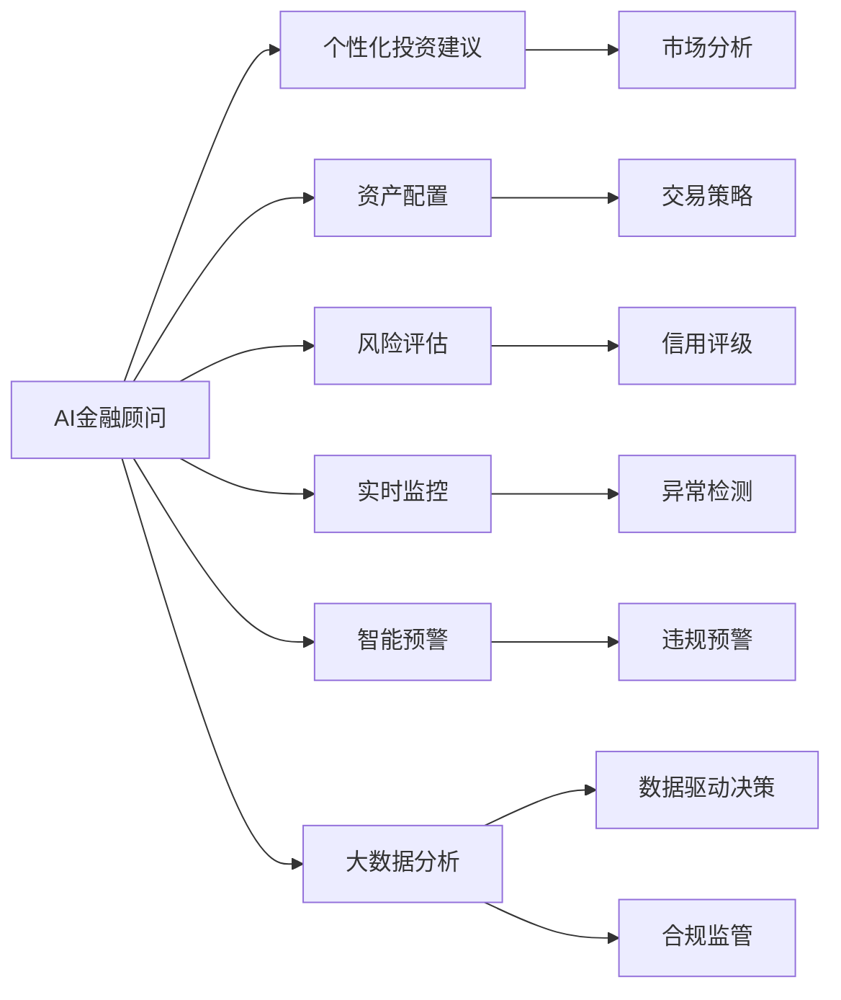

                 

# 未来的智能金融：2050年的AI金融顾问与智能金融监管

在未来的智能金融时代，人工智能（AI）技术将深刻改变金融行业的运营模式和客户体验。本文将探讨2050年的AI金融顾问与智能金融监管，揭示其在金融决策、客户服务、风险管理等方面的创新应用。

## 1. 背景介绍

### 1.1 问题由来

金融行业长期以来一直是人工智能技术应用的先锋。从早期的专家系统到最近深度学习、自然语言处理等技术的广泛应用，AI正逐步改变金融产品的开发、交易、风控等多个环节。

然而，随着金融市场的复杂性和不确定性增加，传统金融业务面临前所未有的挑战。金融监管机构也需要应对监管对象日益复杂化的局面。在这样的背景下，2050年的AI金融顾问和智能金融监管应运而生，旨在通过智能化手段提升金融服务的效率和质量，同时确保金融市场的稳健与安全。

### 1.2 问题核心关键点

AI金融顾问和智能金融监管的关键点包括：

- 自动化和智能化的金融决策：基于AI的金融顾问可以提供个性化的投资建议、风险评估和资产配置，大大提高投资决策的效率和准确性。
- 实时监控和智能预警：智能金融监管能够实时监控市场动态，提前预警潜在的金融风险，提升监管的及时性和准确性。
- 数据驱动的金融决策：AI金融顾问和智能监管系统都依赖于大数据分析，从海量数据中提取有价值的信息，为决策提供支撑。
- 合规性和透明度：智能金融监管能够自动识别和纠正违规行为，提升金融市场的透明度和合规性。

## 2. 核心概念与联系

### 2.1 核心概念概述

为更好地理解2050年AI金融顾问与智能金融监管，本节将介绍几个核心概念：

- **AI金融顾问**：基于机器学习、深度学习等技术，为用户提供个性化的金融投资建议、资产配置、风险评估等服务，旨在提高金融决策的准确性和效率。

- **智能金融监管**：利用AI技术进行实时市场监控、风险预警、违规检测和合规监管，提升金融市场的透明度和安全性。

- **自然语言处理（NLP）**：使AI能够理解和处理人类语言，用于智能客服、智能问答等场景，提高金融服务的客户体验。

- **强化学习**：使AI能够在与环境交互中不断学习，优化策略和决策，用于自动化交易、风险管理等场景。

- **区块链技术**：提供去中心化的数据存储和交易记录，提升金融系统的安全性和透明度。

- **大数据分析**：通过分析海量金融数据，挖掘有价值的信息，辅助决策和监管。

### 2.2 核心概念原理和架构的 Mermaid 流程图



这个流程图展示了2050年AI金融顾问与智能金融监管的核心概念和它们之间的联系：

1. AI金融顾问提供个性化投资建议、资产配置、风险评估等服务，基于市场分析、交易策略和信用评级等信息。
2. 智能金融监管通过实时监控和异常检测，识别潜在的违规行为和风险，实现合规监管。
3. 大数据分析为AI金融顾问和智能监管提供数据支撑，数据驱动决策和合规监管。

## 3. 核心算法原理 & 具体操作步骤

### 3.1 算法原理概述

AI金融顾问和智能金融监管的算法原理主要基于机器学习和强化学习。

- **机器学习**：通过监督学习和非监督学习算法，对金融数据进行分析，提取有价值的信息，用于投资建议、资产配置和风险评估。
- **强化学习**：通过与金融市场环境的交互，AI金融顾问不断优化交易策略，提升投资回报和风险控制能力。

### 3.2 算法步骤详解

#### 3.2.1 数据预处理

数据预处理是AI金融顾问和智能金融监管的首要步骤。需要收集、清洗和标准化金融数据，包括股票、债券、外汇等市场数据，以及客户交易记录、信用评级信息等。

#### 3.2.2 特征工程

特征工程是提取和构建对模型有帮助的特征。例如，提取股票的价格、成交量、市盈率等技术指标，以及客户的年龄、收入、风险偏好等非技术指标。

#### 3.2.3 模型训练

模型训练是使用历史数据训练AI模型。监督学习模型（如回归、分类模型）用于投资建议和风险评估，而强化学习模型用于优化交易策略。

#### 3.2.4 模型评估与优化

模型评估和优化是通过测试集对模型进行评估，并根据评估结果调整模型参数，提高模型的泛化能力和性能。

#### 3.2.5 部署与应用

模型训练完成后，部署到生产环境中，实时处理金融数据，提供投资建议、资产配置、风险评估和智能监管等服务。

### 3.3 算法优缺点

**优点**：

- **自动化和智能化**：AI金融顾问和智能监管能够自动化处理大量数据，提升金融决策的效率和准确性。
- **实时性**：实时监控和预警系统能够及时发现金融市场的异常情况，防止潜在风险。
- **数据驱动**：大数据分析为决策和监管提供有力支持，提高决策的科学性和透明度。

**缺点**：

- **数据质量**：AI金融顾问和智能监管依赖于高质量的数据，数据偏差可能导致模型错误决策。
- **模型复杂性**：模型过于复杂可能导致过拟合，影响模型的泛化能力。
- **伦理和隐私**：AI金融顾问和智能监管涉及大量敏感数据，需要严格遵守数据隐私和安全法规。

### 3.4 算法应用领域

AI金融顾问和智能金融监管的应用领域包括：

- **投资管理**：提供个性化的投资建议、资产配置和风险评估。
- **客户服务**：通过智能客服和智能问答，提升客户体验。
- **风险管理**：实时监控市场动态，提前预警潜在的金融风险。
- **合规监管**：自动识别和纠正违规行为，提升金融市场的透明度和合规性。
- **自动化交易**：通过强化学习优化交易策略，提升交易效率和收益。

## 4. 数学模型和公式 & 详细讲解 & 举例说明

### 4.1 数学模型构建

在2050年的AI金融顾问与智能金融监管中，主要使用以下数学模型：

- **回归模型**：用于预测股票价格、债券收益率等金融指标。
- **分类模型**：用于客户分类、风险评估等任务。
- **强化学习模型**：用于优化交易策略，最大化收益。

### 4.2 公式推导过程

以回归模型为例，假设我们要预测股票价格 $y$，使用线性回归模型：

$$ y = \theta_0 + \theta_1 x_1 + \theta_2 x_2 + \ldots + \theta_n x_n + \epsilon $$

其中，$\theta_0, \theta_1, \ldots, \theta_n$ 为模型参数，$x_1, x_2, \ldots, x_n$ 为输入特征，$\epsilon$ 为误差项。

通过最小化均方误差（MSE）来训练模型：

$$ \min_{\theta} \sum_{i=1}^n (y_i - \hat{y}_i)^2 $$

其中，$\hat{y}_i = \theta_0 + \theta_1 x_{1i} + \theta_2 x_{2i} + \ldots + \theta_n x_{ni}$。

### 4.3 案例分析与讲解

假设我们使用LSTM模型进行股票价格预测。在训练集上，输入特征为近100天的股票收盘价，输出为第101天的收盘价。模型训练后，可以在测试集上进行预测，并计算预测误差。

```python
import pandas as pd
from sklearn.model_selection import train_test_split
from tensorflow.keras.models import Sequential
from tensorflow.keras.layers import LSTM, Dense

# 数据预处理
df = pd.read_csv('stock_prices.csv')
df = df.dropna()
X = df.iloc[:, 0:100].values
y = df.iloc[:, 100].values

# 数据分割
X_train, X_test, y_train, y_test = train_test_split(X, y, test_size=0.2)

# 构建LSTM模型
model = Sequential()
model.add(LSTM(50, return_sequences=True, input_shape=(X_train.shape[1], 1)))
model.add(LSTM(50))
model.add(Dense(1))
model.compile(optimizer='adam', loss='mse')

# 模型训练
model.fit(X_train, y_train, epochs=100, batch_size=32)

# 模型评估
y_pred = model.predict(X_test)
mse = np.mean((y_pred - y_test) ** 2)
print('均方误差:', mse)
```

## 5. 项目实践：代码实例和详细解释说明

### 5.1 开发环境搭建

在开发AI金融顾问与智能金融监管项目时，需要搭建Python开发环境，并配置所需的第三方库和工具：

1. **安装Python**：安装Python 3.8以上版本。
2. **安装必要的库**：使用pip安装TensorFlow、Keras、Pandas等库。
3. **配置开发环境**：使用Jupyter Notebook或PyCharm等IDE进行开发。

### 5.2 源代码详细实现

以下是一个使用TensorFlow构建回归模型的示例代码：

```python
import tensorflow as tf
import pandas as pd
from sklearn.model_selection import train_test_split
from tensorflow.keras.models import Sequential
from tensorflow.keras.layers import LSTM, Dense

# 数据预处理
df = pd.read_csv('stock_prices.csv')
df = df.dropna()
X = df.iloc[:, 0:100].values
y = df.iloc[:, 100].values

# 数据分割
X_train, X_test, y_train, y_test = train_test_split(X, y, test_size=0.2)

# 构建LSTM模型
model = Sequential()
model.add(LSTM(50, return_sequences=True, input_shape=(X_train.shape[1], 1)))
model.add(LSTM(50))
model.add(Dense(1))
model.compile(optimizer='adam', loss='mse')

# 模型训练
model.fit(X_train, y_train, epochs=100, batch_size=32)

# 模型评估
y_pred = model.predict(X_test)
mse = np.mean((y_pred - y_test) ** 2)
print('均方误差:', mse)
```

### 5.3 代码解读与分析

该示例代码展示了使用TensorFlow构建LSTM回归模型的全过程：

- 数据预处理：读取股票价格数据，并去除缺失值。
- 数据分割：将数据集划分为训练集和测试集。
- 模型构建：使用LSTM层构建回归模型，并编译模型。
- 模型训练：在训练集上训练模型，使用Adam优化器和均方误差损失函数。
- 模型评估：在测试集上评估模型，计算均方误差。

## 6. 实际应用场景

### 6.1 智能投顾

智能投顾是AI金融顾问的重要应用之一，通过分析客户的资产状况、风险偏好和市场走势，提供个性化的投资建议和资产配置。例如，某客户希望在一年内获得20%的回报，智能投顾会根据其风险偏好和历史数据，推荐适合的投资组合，并提供实时市场分析和风险预警。

### 6.2 智能客服

智能客服系统通过自然语言处理技术，提供24小时不间断的客户服务。例如，客户可以通过语音或文本与智能客服互动，询问投资建议、账户余额、交易记录等信息。智能客服系统能够理解客户需求，提供准确、及时的回复。

### 6.3 智能监管

智能监管系统通过实时监控和异常检测，自动识别和纠正违规行为，提升金融市场的透明度和合规性。例如，金融交易系统可以实时监控交易行为，检测潜在的洗钱、内幕交易等违规行为，并及时上报监管机构。

### 6.4 未来应用展望

未来，AI金融顾问和智能金融监管将更加智能化和普及化。通过引入更多的先进技术，如强化学习、因果推理、区块链等，实现更加精准、高效的金融决策和监管。智能投顾将提供更加个性化的服务，智能客服将提升客户体验，智能监管将保障金融市场的健康发展。

## 7. 工具和资源推荐

### 7.1 学习资源推荐

- **Coursera《深度学习专项课程》**：涵盖深度学习的基础知识和应用，适合初学者入门。
- **Kaggle竞赛平台**：提供丰富的金融数据集和竞赛任务，提升数据处理和模型构建能力。
- **TensorFlow官方文档**：详细介绍了TensorFlow的使用方法，是深度学习开发必备资源。

### 7.2 开发工具推荐

- **PyCharm**：功能强大的Python开发环境，支持版本控制、调试和测试。
- **Jupyter Notebook**：轻量级开发环境，适合快速原型开发和数据处理。
- **Git和GitHub**：版本控制工具，便于团队协作和代码管理。

### 7.3 相关论文推荐

- **《A Survey on AI-based Financial Risk Management》**：综述了AI在金融风险管理中的应用，涵盖了监督学习、强化学习等多个方面。
- **《Blockchain-based Smart Contracts for Automated Financial Regulation》**：介绍了基于区块链的智能合约在金融监管中的应用。
- **《Deep Learning in Financial Engineering》**：介绍了深度学习在金融工程中的应用，包括股票价格预测、信用评分等。

## 8. 总结：未来发展趋势与挑战

### 8.1 研究成果总结

AI金融顾问和智能金融监管技术在2050年将得到广泛应用，其核心算法和应用场景主要包括：

- **AI金融顾问**：通过个性化投资建议和资产配置，提升投资决策的效率和准确性。
- **智能金融监管**：通过实时监控和异常检测，提升金融市场的透明度和合规性。
- **自然语言处理**：通过智能客服和智能问答，提升客户体验。
- **强化学习**：通过优化交易策略，提高交易效率和收益。

### 8.2 未来发展趋势

未来，AI金融顾问和智能金融监管将呈现以下几个发展趋势：

1. **深度融合**：AI金融顾问和智能金融监管将与其他人工智能技术深度融合，提升金融决策和监管的智能化水平。
2. **隐私保护**：在数据隐私保护方面，将采用去中心化技术，如区块链，确保客户数据的安全性和隐私性。
3. **实时性增强**：通过引入边缘计算、云计算等技术，提升金融服务的实时性，满足客户对实时决策的需求。
4. **伦理和合规性**：在AI应用中引入伦理和合规性约束，确保算法的公平性和透明性。
5. **个性化服务**：通过分析客户的个性化需求，提供更加精准和个性化的金融服务。

### 8.3 面临的挑战

尽管AI金融顾问和智能金融监管技术具有广阔的发展前景，但在实际应用中仍面临诸多挑战：

1. **数据质量**：金融数据存在噪声和偏差，数据质量问题可能导致模型错误决策。
2. **模型复杂性**：模型过于复杂可能导致过拟合，影响模型的泛化能力。
3. **伦理和隐私**：AI金融顾问和智能金融监管涉及大量敏感数据，需要严格遵守数据隐私和安全法规。
4. **监管挑战**：AI金融顾问和智能金融监管需要适应不断变化的监管环境，保证合规性。

### 8.4 研究展望

未来，需要在以下几个方面进行深入研究：

1. **数据清洗与预处理**：研究高效的数据清洗和预处理方法，提高数据质量。
2. **模型优化**：研究参数高效和计算高效的模型，提高模型的泛化能力和实时性。
3. **隐私保护技术**：研究去中心化和区块链技术，保护客户数据隐私。
4. **伦理与合规性**：研究AI应用的伦理和合规性约束，确保算法的公平性和透明性。
5. **多模态融合**：研究多模态数据融合技术，提升金融服务的全面性和准确性。

## 9. 附录：常见问题与解答

**Q1: 什么是AI金融顾问？**

A: AI金融顾问是基于机器学习和深度学习技术，为用户提供个性化的金融投资建议、资产配置和风险评估等服务。

**Q2: 如何构建AI金融顾问模型？**

A: 构建AI金融顾问模型需要收集、清洗和标准化金融数据，选择适合的算法（如回归、分类、强化学习等），并进行模型训练和评估。

**Q3: 智能金融监管的核心技术是什么？**

A: 智能金融监管的核心技术包括自然语言处理、大数据分析和强化学习。

**Q4: 智能金融监管面临哪些挑战？**

A: 智能金融监管面临数据质量、模型复杂性、伦理和隐私保护、监管合规性等挑战。

**Q5: 未来的AI金融顾问将如何发展？**

A: 未来的AI金融顾问将与人工智能技术深度融合，提供更加个性化和智能化的金融服务。

---

作者：禅与计算机程序设计艺术 / Zen and the Art of Computer Programming

