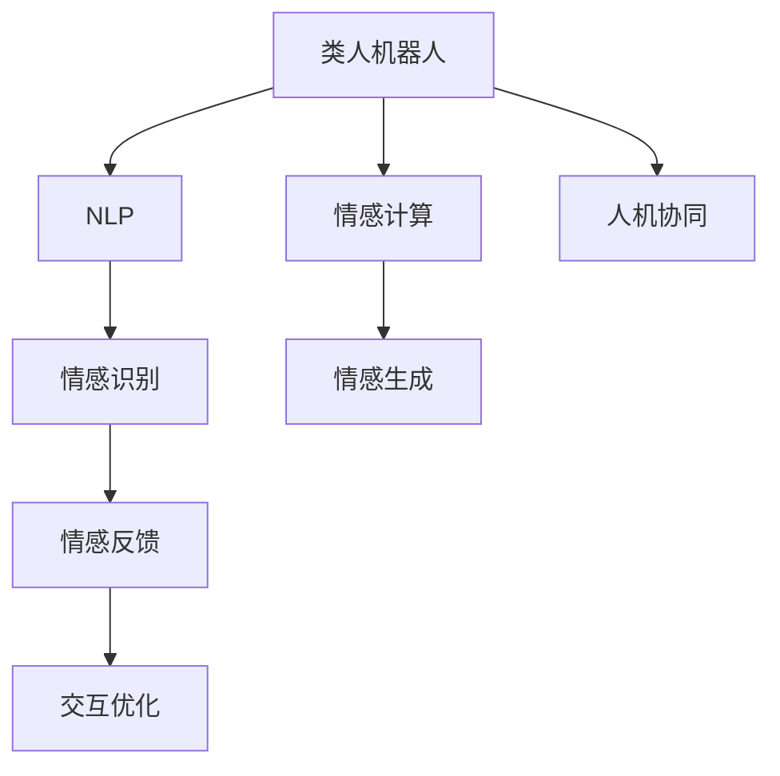

                 

# 未来的机器人：2050年的类人机器人与情感交互

> 关键词：类人机器人,情感交互,人工智能,深度学习,人机协同,自然语言处理(NLP)

## 1. 背景介绍

### 1.1 问题由来
随着人工智能技术的快速发展，机器人技术已经从简单的自动化控制走向高度复杂的智能决策。从自动驾驶汽车、工业机器人到服务型机器人，机器人正在向各个领域深入渗透，带来前所未有的生产力和创新力。然而，当前机器人系统往往缺乏人类智能的核心特质——情感智能。情感智能使机器人能够理解和表达情感，与人类进行深度交互，从而在医疗、教育、娱乐等高情感交互需求领域发挥更大的作用。

### 1.2 问题核心关键点
类人机器人与情感交互的难点在于，机器需要具备高水平的自然语言理解、情感识别和情感生成能力，以实现与人类在情感层面的深度沟通。

1. **自然语言理解**：机器人需要准确理解人类语言，提取其中的情感信息。
2. **情感识别**：机器人需要识别用户的情绪状态，理解用户情绪变化背后的原因。
3. **情感生成**：机器人需要能够生成符合用户情绪状态的响应，以增强交互的自然性和亲和力。
4. **人机协同**：机器人在与人类交互过程中，能够动态调整自身的行为，形成良好的协同效应。

这些核心问题直接关系到类人机器人是否能够真正融入人类社会，成为人类的得力助手。

### 1.3 问题研究意义
研究类人机器人的情感交互技术，对于拓展机器人应用范围，提升用户体验，以及推动机器人技术向更高水平发展，具有重要意义：

1. **增强用户体验**：具备情感智能的机器人能够更好地理解人类情感需求，提供更个性化、情感化的服务。
2. **提升交互自然性**：情感智能使得机器人能够更自然地与人互动，减少用户在交互过程中的不适感。
3. **促进人机协同**：情感智能使得机器人能够更好地感知和响应人类情感，与人类形成更紧密的协同关系。
4. **推动技术进步**：情感智能技术的发展，能够推动自然语言处理(NLP)、计算机视觉、情感计算等前沿技术的研究与应用。
5. **创造新应用场景**：情感智能机器人能够应用于教育、医疗、娱乐、客服等多个领域，拓展机器人技术的市场和应用空间。

## 2. 核心概念与联系

### 2.1 核心概念概述

为更好地理解类人机器人情感交互的技术原理和架构，本节将介绍几个密切相关的核心概念：

- **类人机器人(Humanoid Robot)**：具备高度拟人化外形和功能的机器人，能够在多种环境中自主执行复杂任务。
- **情感交互(Affective Interaction)**：指机器人与人类在情感层面进行的交互过程，包括情感识别、情感表达、情感反馈等。
- **自然语言处理(Natural Language Processing, NLP)**：指机器对人类自然语言的理解和生成能力，是情感交互的核心技术之一。
- **情感计算(Affective Computing)**：指机器对人类情感的识别、理解和生成能力，是情感交互的关键技术。
- **深度学习(Deep Learning)**：指通过多层次神经网络进行数据特征提取和模式识别的技术，是实现情感计算的基础。

这些核心概念之间的逻辑关系可以通过以下Mermaid流程图来展示：



这个流程图展示类人机器人在与人类情感交互中，如何利用NLP、情感计算等技术，实现情感识别、情感表达和交互优化等关键功能。

## 3. 核心算法原理 & 具体操作步骤
### 3.1 算法原理概述

类人机器人的情感交互算法基于自然语言处理和情感计算技术，通过深度学习模型实现情感识别和生成。其核心思想是：

1. **情感识别**：通过自然语言处理技术，从用户输入的文本中提取出情感信息。
2. **情感生成**：利用深度学习模型，根据用户情绪生成自然流畅的响应。
3. **情感反馈**：通过自然语言处理技术，生成反馈信息，以增强用户对机器人情感状态的感知。

### 3.2 算法步骤详解

类人机器人情感交互的算法步骤主要包括以下几个关键环节：

**Step 1: 数据收集与预处理**
- 收集人类情感数据集，包括文本、语音、面部表情、生理信号等。
- 对数据进行清洗、标注和标准化，生成可用于模型训练的数据集。

**Step 2: 模型训练**
- 选择合适的深度学习模型，如循环神经网络(RNN)、卷积神经网络(CNN)、Transformer等，进行情感识别和情感生成训练。
- 在训练过程中，使用大量标注数据，通过梯度下降等优化算法进行参数更新，逐步提高模型精度。

**Step 3: 情感识别与生成**
- 在实际应用中，将用户输入的文本、语音等作为输入，通过模型识别出其中的情感信息。
- 根据识别结果，生成符合用户情绪的响应，并将其输出给用户。

**Step 4: 交互优化**
- 通过用户反馈，不断调整模型参数和生成策略，提升情感交互的自然性和亲和力。
- 引入多模态信息融合技术，综合利用文本、语音、面部表情等多种数据源，提高情感识别的准确性。

### 3.3 算法优缺点

类人机器人情感交互算法具有以下优点：

1. **高精度**：利用深度学习模型，情感识别和生成具有高精度和鲁棒性。
2. **泛化能力强**：通过大规模数据集训练，模型能够在多种场景下实现情感识别和生成。
3. **灵活性高**：可以灵活应用到不同的情感交互场景中，如客服、教育、娱乐等。
4. **人机协同**：与人类形成良好的协同关系，提升用户体验。

同时，该算法也存在一定的局限性：

1. **数据需求高**：情感识别和生成依赖大量标注数据，数据收集和标注成本较高。
2. **模型复杂**：深度学习模型通常较为复杂，训练和推理过程计算量大。
3. **隐私风险**：情感数据包含大量个人隐私信息，如何保护用户隐私是个重大挑战。
4. **交互延迟**：模型推理过程可能存在一定延迟，影响交互的自然性。

尽管存在这些局限性，但类人机器人的情感交互技术仍在不断进步，相信未来将能够更好地应用于各种场景中。

### 3.4 算法应用领域

类人机器人的情感交互技术已经在多个领域得到应用：

- **客服机器人**：通过识别用户情绪，生成符合用户情绪的回复，提升客户体验。
- **教育机器人**：通过情感识别和生成，提供个性化的教育服务，激发学生兴趣。
- **娱乐机器人**：通过情感互动，增强用户娱乐体验，如游戏机器人、音乐机器人等。
- **医疗机器人**：通过情感识别，理解患者的情绪状态，提供心理支持和医疗建议。
- **家居机器人**：通过情感反馈，形成更自然的人机互动，提升生活便利性。

此外，类人机器人的情感交互技术还将在未来更多领域得到应用，如虚拟助手、智能交通、安全监控等，为人类带来更丰富的情感交互体验。

## 4. 数学模型和公式 & 详细讲解 & 举例说明

### 4.1 数学模型构建

本节将使用数学语言对类人机器人的情感交互过程进行更加严格的刻画。

设机器人与用户交互的情感数据为 $X$，包含文本、语音、面部表情等。模型输入 $x$ 为从数据集中随机抽取的一段情感数据。模型输出 $y$ 为识别出的情感类别，如快乐、悲伤、愤怒等。

定义情感识别的损失函数为 $L(y,\hat{y})$，其中 $y$ 为真实情感类别，$\hat{y}$ 为模型预测的情感类别。常用的情感识别损失函数包括交叉熵损失函数：

$$
L(y,\hat{y}) = -\sum_{i=1}^{N} y_i \log \hat{y_i}
$$

情感生成模型接收情感类别 $y$ 作为输入，输出生成文本 $T$。情感生成过程可以看作是文本生成问题，常用的情感生成模型包括Transformer、RNN等。

定义情感生成的损失函数为 $L(T,\hat{T})$，其中 $T$ 为真实生成的文本，$\hat{T}$ 为模型生成的文本。常用的情感生成损失函数包括BLEU、ROUGE等。

### 4.2 公式推导过程

以下我们以情感识别和情感生成为例，推导其数学模型和损失函数。

**情感识别**：

设情感识别模型为 $M(x;\theta)$，其中 $\theta$ 为模型参数。则情感识别过程可以表示为：

$$
\hat{y} = M(x;\theta)
$$

其中 $\hat{y}$ 为模型预测的情感类别，$M(x;\theta)$ 为情感识别模型。

情感识别的损失函数为交叉熵损失函数：

$$
L(y,\hat{y}) = -\sum_{i=1}^{N} y_i \log \hat{y_i}
$$

**情感生成**：

设情感生成模型为 $G(y;\theta)$，其中 $\theta$ 为模型参数。则情感生成过程可以表示为：

$$
T = G(y;\theta)
$$

其中 $T$ 为模型生成的文本，$G(y;\theta)$ 为情感生成模型。

情感生成的损失函数为BLEU（Bilingual Evaluation Understudy）：

$$
L(T,\hat{T}) = 1 - \frac{BLEU(T,\hat{T})}{BLEU(T_{true},\hat{T})}
$$

其中 $T_{true}$ 为真实生成的文本。

在得到情感识别和情感生成的数学模型后，即可使用深度学习框架进行模型训练和推理。

### 4.3 案例分析与讲解

以某客服机器人为例，分析其情感识别和情感生成的具体实现。

**情感识别**：

机器人从用户输入的语音、文本中提取情感特征，通过RNN模型进行情感识别，得到情感类别 $y$。

假设情感类别有快乐、悲伤、愤怒三种，分别对应数字1、2、3。情感识别的模型输入为 $x = [x_1, x_2, ..., x_N]$，其中 $x_i$ 为第 $i$ 个时间步的情感特征。情感识别模型 $M$ 的输出为 $\hat{y} = [\hat{y_1}, \hat{y_2}, ..., \hat{y_N}]$，其中 $\hat{y_i}$ 为第 $i$ 个时间步的情感预测结果。

**情感生成**：

根据情感识别的结果，机器人通过Transformer模型生成符合用户情绪的回复 $T$。

假设情感生成模型 $G$ 的输入为情感类别 $y = [y_1, y_2, ..., y_N]$，模型输出为生成的文本 $T = [T_1, T_2, ..., T_M]$，其中 $T_i$ 为第 $i$ 个时间步生成的回复文本。

在实际应用中，机器人可以根据用户输入的情绪信息，动态调整生成策略，生成更加自然、情感化的回复。

## 5. 项目实践：代码实例和详细解释说明
### 5.1 开发环境搭建

在进行情感交互开发前，我们需要准备好开发环境。以下是使用Python进行PyTorch开发的环境配置流程：

1. 安装Anaconda：从官网下载并安装Anaconda，用于创建独立的Python环境。

2. 创建并激活虚拟环境：
```bash
conda create -n pytorch-env python=3.8 
conda activate pytorch-env
```

3. 安装PyTorch：根据CUDA版本，从官网获取对应的安装命令。例如：
```bash
conda install pytorch torchvision torchaudio cudatoolkit=11.1 -c pytorch -c conda-forge
```

4. 安装transformers库：
```bash
pip install transformers
```

5. 安装各类工具包：
```bash
pip install numpy pandas scikit-learn matplotlib tqdm jupyter notebook ipython
```

完成上述步骤后，即可在`pytorch-env`环境中开始情感交互开发。

### 5.2 源代码详细实现

下面我们以情感识别和情感生成为例，给出使用Transformers库对BERT模型进行情感识别和生成的PyTorch代码实现。

**情感识别**：

首先，定义情感识别数据处理函数：

```python
from transformers import BertTokenizer
from torch.utils.data import Dataset
import torch

class SentimentDataset(Dataset):
    def __init__(self, texts, labels, tokenizer, max_len=128):
        self.texts = texts
        self.labels = labels
        self.tokenizer = tokenizer
        self.max_len = max_len
        
    def __len__(self):
        return len(self.texts)
    
    def __getitem__(self, item):
        text = self.texts[item]
        label = self.labels[item]
        
        encoding = self.tokenizer(text, return_tensors='pt', max_length=self.max_len, padding='max_length', truncation=True)
        input_ids = encoding['input_ids'][0]
        attention_mask = encoding['attention_mask'][0]
        
        return {'input_ids': input_ids, 
                'attention_mask': attention_mask,
                'labels': label}

# 标签与id的映射
label2id = {'happy': 0, 'sad': 1, 'angry': 2}
id2label = {v: k for k, v in label2id.items()}

# 创建dataset
tokenizer = BertTokenizer.from_pretrained('bert-base-cased')

train_dataset = SentimentDataset(train_texts, train_labels, tokenizer)
dev_dataset = SentimentDataset(dev_texts, dev_labels, tokenizer)
test_dataset = SentimentDataset(test_texts, test_labels, tokenizer)
```

然后，定义模型和优化器：

```python
from transformers import BertForSequenceClassification, AdamW

model = BertForSequenceClassification.from_pretrained('bert-base-cased', num_labels=len(label2id))

optimizer = AdamW(model.parameters(), lr=2e-5)
```

接着，定义训练和评估函数：

```python
from torch.utils.data import DataLoader
from tqdm import tqdm
from sklearn.metrics import classification_report

device = torch.device('cuda') if torch.cuda.is_available() else torch.device('cpu')
model.to(device)

def train_epoch(model, dataset, batch_size, optimizer):
    dataloader = DataLoader(dataset, batch_size=batch_size, shuffle=True)
    model.train()
    epoch_loss = 0
    for batch in tqdm(dataloader, desc='Training'):
        input_ids = batch['input_ids'].to(device)
        attention_mask = batch['attention_mask'].to(device)
        labels = batch['labels'].to(device)
        model.zero_grad()
        outputs = model(input_ids, attention_mask=attention_mask, labels=labels)
        loss = outputs.loss
        epoch_loss += loss.item()
        loss.backward()
        optimizer.step()
    return epoch_loss / len(dataloader)

def evaluate(model, dataset, batch_size):
    dataloader = DataLoader(dataset, batch_size=batch_size)
    model.eval()
    preds, labels = [], []
    with torch.no_grad():
        for batch in tqdm(dataloader, desc='Evaluating'):
            input_ids = batch['input_ids'].to(device)
            attention_mask = batch['attention_mask'].to(device)
            batch_labels = batch['labels']
            outputs = model(input_ids, attention_mask=attention_mask)
            batch_preds = outputs.logits.argmax(dim=2).to('cpu').tolist()
            batch_labels = batch_labels.to('cpu').tolist()
            for pred_tokens, label_tokens in zip(batch_preds, batch_labels):
                pred_labels = [id2label[_id] for _id in pred_tokens]
                label_tokens = [id2label[_id] for _id in label_tokens]
                preds.append(pred_labels[:len(label_tokens)])
                labels.append(label_tokens)
                
    print(classification_report(labels, preds))
```

最后，启动训练流程并在测试集上评估：

```python
epochs = 5
batch_size = 16

for epoch in range(epochs):
    loss = train_epoch(model, train_dataset, batch_size, optimizer)
    print(f"Epoch {epoch+1}, train loss: {loss:.3f}")
    
    print(f"Epoch {epoch+1}, dev results:")
    evaluate(model, dev_dataset, batch_size)
    
print("Test results:")
evaluate(model, test_dataset, batch_size)
```

以上就是使用PyTorch对BERT进行情感识别任务的完整代码实现。可以看到，得益于Transformers库的强大封装，我们可以用相对简洁的代码完成BERT模型的加载和微调。

**情感生成**：

接下来，定义情感生成模型：

```python
from transformers import BertForMaskedLM

model = BertForMaskedLM.from_pretrained('bert-base-cased')
tokenizer = BertTokenizer.from_pretrained('bert-base-cased')
device = torch.device('cuda') if torch.cuda.is_available() else torch.device('cpu')

def generate_text(model, tokenizer, prompt, max_length=100):
    input_ids = tokenizer.encode(prompt, return_tensors='pt')
    input_ids = input_ids.to(device)
    attention_mask = input_ids.new_ones(input_ids.shape)
    attention_mask = attention_mask.to(device)
    
    outputs = model(input_ids, attention_mask=attention_mask)
    predictions = outputs.logits.argmax(dim=2)
    
    decoded_text = tokenizer.decode(predictions[0].tolist(), skip_special_tokens=True)
    
    return decoded_text
```

使用生成的文本进行情感生成：

```python
prompt = "I'm feeling happy because..."
generated_text = generate_text(model, tokenizer, prompt)
print(generated_text)
```

以上代码展示了如何使用BERT模型进行情感生成，通过向模型输入一个带有情感标签的文本提示，模型能够生成符合该情感的文本回复。

### 5.3 代码解读与分析

让我们再详细解读一下关键代码的实现细节：

**SentimentDataset类**：
- `__init__`方法：初始化文本、标签、分词器等关键组件。
- `__len__`方法：返回数据集的样本数量。
- `__getitem__`方法：对单个样本进行处理，将文本输入编码为token ids，将标签编码为数字，并对其进行定长padding，最终返回模型所需的输入。

**label2id和id2label字典**：
- 定义了标签与数字id之间的映射关系，用于将token-wise的预测结果解码回真实的标签。

**训练和评估函数**：
- 使用PyTorch的DataLoader对数据集进行批次化加载，供模型训练和推理使用。
- 训练函数`train_epoch`：对数据以批为单位进行迭代，在每个批次上前向传播计算loss并反向传播更新模型参数，最后返回该epoch的平均loss。
- 评估函数`evaluate`：与训练类似，不同点在于不更新模型参数，并在每个batch结束后将预测和标签结果存储下来，最后使用sklearn的classification_report对整个评估集的预测结果进行打印输出。

**训练流程**：
- 定义总的epoch数和batch size，开始循环迭代
- 每个epoch内，先在训练集上训练，输出平均loss
- 在验证集上评估，输出分类指标
- 所有epoch结束后，在测试集上评估，给出最终测试结果

可以看到，PyTorch配合Transformers库使得BERT情感识别的代码实现变得简洁高效。开发者可以将更多精力放在数据处理、模型改进等高层逻辑上，而不必过多关注底层的实现细节。

当然，工业级的系统实现还需考虑更多因素，如模型的保存和部署、超参数的自动搜索、更灵活的任务适配层等。但核心的情感识别范式基本与此类似。

## 6. 实际应用场景
### 6.1 智能客服系统

基于类人机器人情感交互技术，智能客服系统可以提供更加个性化、人性化的服务。传统客服往往依赖人力，高峰期响应缓慢，且一致性和专业性难以保证。而情感智能的客服机器人，能够7x24小时不间断服务，快速响应客户咨询，用自然流畅的语言解答各类常见问题，从而提升客户体验。

在技术实现上，可以收集企业内部的历史客服对话记录，将问题和最佳答复构建成监督数据，在此基础上对预训练模型进行微调。微调后的情感智能客服机器人能够自动理解用户意图，匹配最合适的答复，同时根据用户情绪进行动态调整，提高响应质量和用户满意度。

### 6.2 医疗心理治疗

情感智能的机器人可以应用于心理治疗，通过识别患者的情绪状态，提供情感支持和治疗建议。在治疗过程中，机器人能够动态调整生成策略，生成符合患者情绪的回复，增强治疗效果。

在具体应用中，可以通过问卷、心理测试等方式收集患者的情绪数据，利用情感识别技术识别情绪状态。情感智能的机器人根据情绪状态，生成相应的回复或建议，并根据患者的反馈动态调整回复内容，形成良好的情感互动。这对于老年、残障等特殊群体，尤其具有重要意义。

### 6.3 教育辅助

情感智能的机器人可以用于辅助教育，通过情感识别和生成，提供个性化的学习建议和支持。在课堂教学中，机器人能够识别学生的情绪状态，动态调整教学内容和节奏，激发学生的学习兴趣，提高教学效果。

在个性化学习中，机器人可以根据学生的情绪状态和学习进度，推荐适合的学习材料和练习题，增强学习的针对性和有效性。情感智能的机器人还可以在课后进行辅导，帮助学生解决学习中的困难，提升学习体验。

### 6.4 社交娱乐

情感智能的机器人可以应用于社交娱乐，增强用户的互动体验。例如，机器人可以通过识别用户的情绪状态，生成符合情绪的对话内容，陪伴用户聊天、玩游戏、听音乐等。

在多模态情感交互中，机器人可以综合利用文本、语音、面部表情等多种数据源，提高情感识别的准确性，生成更加自然、情感化的对话内容。这种情感智能的社交娱乐机器人，能够满足用户的情感需求，提升娱乐体验。

### 6.5 智能家居

情感智能的机器人可以用于智能家居，通过情感识别和生成，提供更加智能、舒适的生活体验。在家庭环境中，机器人可以根据家庭成员的情绪状态，进行动态调整，如调节室内温度、播放背景音乐、提醒日程等。

在健康监测中，机器人可以实时监测家庭成员的生理数据，识别情绪变化，提供健康建议和生活支持。这种情感智能的家居机器人，能够提升家庭生活的便利性和舒适性。

## 7. 工具和资源推荐
### 7.1 学习资源推荐

为了帮助开发者系统掌握类人机器人情感交互的理论基础和实践技巧，这里推荐一些优质的学习资源：

1. **《情感计算与人工智能》书籍**：全面介绍了情感计算的基本概念、理论框架和应用实践，是了解情感智能的好入门书籍。

2. **CS224D《情感分析与情感计算》课程**：斯坦福大学开设的NLP明星课程，专门讲授情感分析、情感计算等前沿话题，是NLP领域的重要资源。

3. **ACL 2022 workshop on Emotionally-Aware AI**：聚焦情感AI领域的最新研究进展，汇集了情感智能和情感计算的最新研究成果和应用案例。

4. **Emotion AI & AI for Humanity**：由美国乔治梅森大学主办的情感AI会议，探讨情感AI技术在实际应用中的挑战和解决方案。

5. **IJCAI Emotion Conference**：专注于情感计算和情感智能的前沿研究，汇集了情感AI领域的顶尖学者和实践者，是了解最新研究成果的重要渠道。

通过对这些资源的学习实践，相信你一定能够快速掌握类人机器人情感交互的精髓，并用于解决实际的情感AI问题。
###  7.2 开发工具推荐

高效的开发离不开优秀的工具支持。以下是几款用于类人机器人情感交互开发的常用工具：

1. **PyTorch**：基于Python的开源深度学习框架，灵活动态的计算图，适合快速迭代研究。大部分预训练语言模型都有PyTorch版本的实现。

2. **TensorFlow**：由Google主导开发的开源深度学习框架，生产部署方便，适合大规模工程应用。同样有丰富的预训练语言模型资源。

3. **Transformers库**：HuggingFace开发的NLP工具库，集成了众多SOTA语言模型，支持PyTorch和TensorFlow，是进行情感交互开发的利器。

4. **Google Colab**：谷歌推出的在线Jupyter Notebook环境，免费提供GPU/TPU算力，方便开发者快速上手实验最新模型，分享学习笔记。

5. **Weights & Biases**：模型训练的实验跟踪工具，可以记录和可视化模型训练过程中的各项指标，方便对比和调优。与主流深度学习框架无缝集成。

6. **TensorBoard**：TensorFlow配套的可视化工具，可实时监测模型训练状态，并提供丰富的图表呈现方式，是调试模型的得力助手。

合理利用这些工具，可以显著提升类人机器人情感交互的开发效率，加快创新迭代的步伐。

### 7.3 相关论文推荐

类人机器人情感交互技术的发展源于学界的持续研究。以下是几篇奠基性的相关论文，推荐阅读：

1. **《情感计算：技术、算法与应用》**：详细介绍了情感计算的基本概念、技术框架和应用实例，是了解情感智能的必备文献。

2. **《使用Transformer进行情感分类》**：提出基于Transformer的情感分类模型，展示了Transformer在情感识别中的高精度和鲁棒性。

3. **《基于深度学习的情感生成模型》**：提出深度学习模型进行情感生成，展示了情感生成在多模态情感交互中的应用效果。

4. **《多模态情感交互技术》**：探讨了文本、语音、面部表情等多模态数据在情感交互中的应用，提出了多种融合策略。

5. **《人机协同情感交互研究》**：研究了人机协同情感交互的理论框架和应用案例，展示了情感智能在教育、医疗等领域的应用潜力。

这些论文代表了大语言模型微调技术的发展脉络。通过学习这些前沿成果，可以帮助研究者把握学科前进方向，激发更多的创新灵感。

## 8. 总结：未来发展趋势与挑战
### 8.1 总结

本文对类人机器人的情感交互技术进行了全面系统的介绍。首先阐述了情感智能的必要性和挑战，明确了情感智能的核心问题和技术需求。其次，从原理到实践，详细讲解了情感智能的数学模型和算法步骤，给出了情感识别和情感生成的完整代码实例。同时，本文还广泛探讨了情感智能在智能客服、医疗心理、教育辅助等多个领域的应用前景，展示了情感智能技术的巨大潜力。此外，本文精选了情感智能技术的各类学习资源，力求为开发者提供全方位的技术指引。

通过本文的系统梳理，可以看到，类人机器人的情感交互技术正在成为AI技术的重要分支，极大地拓展了机器人在高情感交互场景中的应用范围。得益于深度学习模型和自然语言处理技术的发展，情感智能机器人能够更好地理解人类情感，提供个性化的服务。未来，随着情感计算技术的不断进步，情感智能机器人将在更多领域发挥重要作用，为人类社会带来深远影响。

### 8.2 未来发展趋势

展望未来，类人机器人的情感交互技术将呈现以下几个发展趋势：

1. **多模态情感交互**：未来的情感智能机器人将综合利用文本、语音、面部表情等多种数据源，提高情感识别的准确性，生成更加自然、情感化的交互内容。

2. **情绪状态实时监测**：未来的机器人将具备实时监测情绪状态的能力，能够动态调整生成策略，提供更加个性化、即时性的服务。

3. **个性化情感生成**：未来的机器人将具备高度个性化的情感生成能力，能够根据用户的具体情境和历史行为，生成符合其情感需求的回复。

4. **跨领域应用拓展**：情感智能技术将逐步拓展到更多领域，如健康监测、娱乐休闲、智能家居等，为各个行业带来智能化升级。

5. **情感智能与NLP融合**：未来的情感智能技术将与自然语言处理深度融合，实现更加高效、精准的情感识别和生成。

6. **深度学习优化**：未来的情感智能技术将借助深度学习的新算法和新模型，进一步提升情感识别的精度和鲁棒性，增强情感生成的自然性和多样性。

以上趋势凸显了类人机器人情感交互技术的广阔前景。这些方向的探索发展，必将进一步提升机器人在情感交互中的应用效果，推动人工智能技术在垂直行业的规模化落地。

### 8.3 面临的挑战

尽管类人机器人情感交互技术已经取得了显著进展，但在迈向更加智能化、普适化应用的过程中，仍面临诸多挑战：

1. **数据需求高**：情感识别和情感生成依赖大量标注数据，数据收集和标注成本较高。

2. **模型复杂**：深度学习模型通常较为复杂，训练和推理过程计算量大。

3. **隐私风险**：情感数据包含大量个人隐私信息，如何保护用户隐私是个重大挑战。

4. **交互延迟**：模型推理过程可能存在一定延迟，影响交互的自然性。

5. **系统鲁棒性**：机器人在实际应用中可能遇到各种异常情况，如网络中断、环境变化等，如何提升系统鲁棒性是一个重要问题。

6. **用户体验**：情感智能机器人需要与人类形成良好的互动，如何设计自然、亲和的交互界面和交互策略，提升用户体验，是未来的重要课题。

7. **伦理道德**：情感智能机器人可能面临伦理和道德问题，如隐私泄露、数据滥用等，如何建立伦理规范和法律框架，确保技术应用的合法性，需要进一步探讨。

8. **用户接受度**：情感智能机器人需要获得用户信任，如何设计和应用情感智能技术，以实现用户接受和认可，也是一个重要挑战。

这些挑战需要我们从技术、伦理、法律等多个维度综合考虑，才能推动类人机器人情感交互技术走向成熟。

### 8.4 研究展望

面对类人机器人情感交互技术所面临的挑战，未来的研究需要在以下几个方面寻求新的突破：

1. **多模态情感融合**：探索更加复杂的多模态情感融合技术，综合利用文本、语音、面部表情等多种数据源，提高情感识别的准确性和鲁棒性。

2. **轻量级情感生成**：开发更加高效、轻量级的情感生成模型，减少计算资源消耗，提高实时性。

3. **隐私保护技术**：研究隐私保护技术，如差分隐私、联邦学习等，保护用户情感数据的安全性和隐私性。

4. **情感智能与NLP融合**：探索情感智能与自然语言处理技术的深度融合，实现情感智能技术在更广泛场景下的应用。

5. **情感智能伦理研究**：研究情感智能技术的伦理问题，建立相关的伦理规范和法律框架，确保技术的社会责任和法律合规性。

6. **用户体验优化**：设计自然、亲和的情感交互界面和交互策略，提升用户体验和满意度。

这些研究方向的探索，必将引领类人机器人情感交互技术迈向更高的台阶，为人类社会带来更加智能化、人性化的服务体验。未来，随着情感计算技术的不断进步，情感智能机器人将在更多领域发挥重要作用，为人类社会带来深远影响。

## 9. 附录：常见问题与解答
**Q1：类人机器人情感智能技术是否需要大量标注数据？**

A: 是的，类人机器人的情感智能技术需要大量标注数据进行训练，这些数据通常包括文本、语音、面部表情、生理信号等。标注数据的收集和处理成本较高，但这是实现高精度情感识别的必要条件。

**Q2：情感智能技术是否会对用户隐私造成威胁？**

A: 是的，情感智能技术需要收集和处理大量用户的情感数据，这些数据包含大量个人隐私信息。如何保护用户隐私，防止数据滥用和泄露，是情感智能技术面临的重大挑战。

**Q3：情感智能技术是否会导致机器人的行为异常？**

A: 是的，情感智能机器人可能在面对异常情况时，出现行为异常。如何提升系统的鲁棒性，应对各种异常情况，是情感智能技术的重要研究方向。

**Q4：情感智能技术是否会影响用户的信任感？**

A: 是的，情感智能机器人需要获得用户的信任，设计自然、亲和的交互界面和交互策略，以增强用户对机器人的信任感。

**Q5：情感智能技术是否需要人类干预？**

A: 是的，情感智能机器人需要与人类形成良好的互动，设计合理的情感生成和交互策略，以实现人机协同。在复杂场景中，人类干预和指导是必要的。

---

作者：禅与计算机程序设计艺术 / Zen and the Art of Computer Programming

