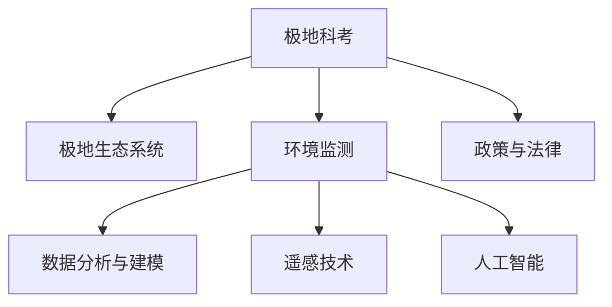

                 

# 未来的极地探索：2050年的南北极科考与生态保护

## 1. 背景介绍

### 1.1 问题由来

在未来的2050年，人类对极地科学研究的兴趣和需求将达到前所未有的高度。随着全球气候变化、冰川融化等环境问题日益严峻，极地生态系统保护、资源开发、气候变化研究等领域的研究需求不断增长。极地科考技术的发展将成为解决这些问题的关键。

### 1.2 问题核心关键点

- **极地科考技术**：发展高性能的极地科考装备，提高极地科考的效率和安全性。
- **生态保护**：科学评估极地生态系统的状态，制定有效的生态保护策略。
- **环境监测**：利用先进技术手段监测极地环境变化，为科学研究提供数据支持。
- **数据管理**：高效管理和共享极地科学数据，推动科研合作和共享。
- **政策支持**：制定和实施相关的法律和政策，保障极地科研活动的可持续发展。

### 1.3 问题研究意义

- **科学进步**：极地科考能够帮助人类更好地理解地球气候变化和生态系统，推动气候科学的发展。
- **资源利用**：极地科考有助于发现和利用极地丰富的自然资源，如矿产资源、生物资源等，为人类社会发展提供支持。
- **环境保护**：科学评估和保护极地生态系统，对于维持全球生态平衡具有重要意义。
- **国际合作**：极地科考促进了国际间的科研合作，共同应对全球性环境问题，提高全球治理能力。

## 2. 核心概念与联系

### 2.1 核心概念概述

为更好地理解未来极地科考技术的发展和生态保护措施，本节将介绍几个密切相关的核心概念：

- **极地科考**：指在极地地区进行科学考察活动，涵盖地质、气象、海洋、生态等多个领域的研究。
- **极地生态系统**：指极地地区的生物群落、气候条件、水体等自然因素构成的生态系统。
- **环境监测**：指通过各种技术手段对极地环境参数进行实时或定期的监测和记录。
- **数据分析与建模**：指对极地科考数据进行整理、分析，构建数学模型进行科学研究。
- **遥感技术**：利用卫星、无人机等手段对极地进行远距离观测和数据获取。
- **人工智能**：通过机器学习和深度学习技术，提高数据处理和分析的效率和准确性。
- **政策与法律**：为保障极地科研活动的合法性和可持续性，制定的相关政策和法律。

这些核心概念之间的逻辑关系可以通过以下Mermaid流程图来展示：



这个流程图展示出极地科考的各个关键环节，以及它们之间的相互联系和支撑关系。

## 3. 核心算法原理 & 具体操作步骤

### 3.1 算法原理概述

未来极地科考和生态保护的技术实现将主要依赖于高性能的数据获取和分析技术。基于监督学习的算法能够帮助分析大量数据，识别环境变化趋势，评估生态系统状态，为决策提供科学依据。

形式化地，假设有一个包含多个极地科考数据集的样本集 $D=\{(x_i,y_i)\}_{i=1}^N$，其中 $x_i$ 表示科考数据，$y_i$ 表示对应的环境状态或生态状态。极地科考的算法目标是最小化样本集的损失函数 $\mathcal{L}(M_{\theta},D)$，以获得最优的模型参数 $\theta$。

常见的损失函数包括均方误差、交叉熵等。通过对数据集 $D$ 的反复迭代和参数更新，使得模型在极地科考的各个领域，如地质、气象、生态等，都能够提供准确的预测和分析。

### 3.2 算法步骤详解

未来极地科考和生态保护的算法实现一般包括以下几个关键步骤：

**Step 1: 数据预处理**
- 收集极地科考数据，包括地质样本、气象数据、水文数据、生态数据等。
- 对数据进行清洗、去噪、标准化等预处理，确保数据的质量和一致性。

**Step 2: 数据标注**
- 对已有的极地科考数据进行标注，确定其环境状态或生态状态，如冰川融化、海平面上升等。
- 标注数据应尽可能覆盖各种情境，确保算法的泛化能力。

**Step 3: 模型选择与训练**
- 选择合适的监督学习算法，如随机森林、支持向量机、深度神经网络等。
- 使用标注数据训练模型，并通过交叉验证等技术进行模型调优。

**Step 4: 模型评估与优化**
- 在独立的数据集上对模型进行评估，计算模型在各个领域的表现。
- 根据评估结果进行模型优化，提高模型的准确性和鲁棒性。

**Step 5: 模型部署与应用**
- 将训练好的模型部署到极地科考的现场设备中，如遥感卫星、无人机、科考船等。
- 实时监测极地环境变化，及时反馈分析结果，为科研决策提供支持。

### 3.3 算法优缺点

基于监督学习的极地科考和生态保护算法具有以下优点：

- **高效性**：通过训练好的模型，能够快速处理和分析大量极地数据，提高科研效率。
- **准确性**：监督学习算法能够利用已标注的数据进行训练，确保模型的预测结果具有较高的准确性。
- **灵活性**：不同算法可以选择不同的特征进行建模，适应不同领域的需求。

同时，该算法也存在一些局限性：

- **依赖标注数据**：算法的准确性高度依赖于标注数据的质量和数量，标注数据的获取成本较高。
- **过拟合风险**：在极地数据量有限的情况下，模型可能出现过拟合，泛化能力受限。
- **模型复杂性**：复杂的模型可能需要更多的计算资源和时间进行训练和优化。

尽管存在这些局限性，但基于监督学习的算法仍是大规模极地数据处理和分析的主要手段。未来相关研究将集中在如何进一步降低标注成本，提高模型的泛化能力和可解释性，以及如何在不同环境条件下保持模型的稳定性和准确性。

### 3.4 算法应用领域

基于监督学习的极地科考和生态保护算法已经在多个领域得到了应用，如：

- **冰川变化监测**：利用卫星遥感数据和气象数据，监测冰川体积变化，评估冰川消融速率。
- **海平面变化研究**：通过分析海洋浮标和卫星数据，评估海平面上升趋势，预测未来变化。
- **生物多样性评估**：对极地生物群落进行调查和监测，评估其多样性和健康状况。
- **气候变化影响**：分析极地气候变化对生态系统的影响，研究其对全球气候系统的反馈机制。

这些算法不仅在科学研究中发挥重要作用，也在环境保护、资源管理等应用场景中显示出巨大的潜力。

## 4. 数学模型和公式 & 详细讲解 & 举例说明

### 4.1 数学模型构建

本节将使用数学语言对基于监督学习的极地科考算法进行更加严格的刻画。

记极地科考数据为 $x \in \mathcal{X}$，其中 $\mathcal{X}$ 为输入空间，如地质样本、气象数据、生态数据等。假设环境状态或生态状态为 $y \in \mathcal{Y}$，其中 $\mathcal{Y}$ 为输出空间，如冰川融化、海平面上升等。

定义模型 $M_{\theta}$ 在输入 $x$ 上的损失函数为 $\ell(M_{\theta}(x),y)$，则在数据集 $D$ 上的经验风险为：

$$
\mathcal{L}(\theta) = \frac{1}{N} \sum_{i=1}^N \ell(M_{\theta}(x_i),y_i)
$$

其中 $\mathcal{L}$ 为损失函数，$\theta$ 为模型参数。常见的损失函数包括均方误差损失、交叉熵损失等。

### 4.2 公式推导过程

以均方误差损失函数为例，推导其计算公式。

假设模型 $M_{\theta}$ 在输入 $x$ 上的输出为 $\hat{y}=M_{\theta}(x)$，则均方误差损失函数定义为：

$$
\ell(M_{\theta}(x),y) = \frac{1}{2}(y - \hat{y})^2
$$

将其代入经验风险公式，得：

$$
\mathcal{L}(\theta) = \frac{1}{N} \sum_{i=1}^N \frac{1}{2}(y_i - M_{\theta}(x_i))^2
$$

根据链式法则，损失函数对参数 $\theta$ 的梯度为：

$$
\frac{\partial \mathcal{L}(\theta)}{\partial \theta} = -\frac{1}{N} \sum_{i=1}^N (y_i - M_{\theta}(x_i))M_{\theta}'(x_i)
$$

其中 $M_{\theta}'(x_i)$ 为模型对输入 $x_i$ 的导数，可通过自动微分技术高效计算。

### 4.3 案例分析与讲解

以冰川体积变化监测为例，分析如何使用监督学习算法进行处理。

假设极地冰川体积变化数据集为 $D=\{(x_i,y_i)\}_{i=1}^N$，其中 $x_i$ 表示时间序列上的冰川体积数据，$y_i$ 表示该时间点的冰川融化速率。

**Step 1: 数据预处理**
- 收集历史冰川体积数据，并进行去噪、归一化等预处理。
- 对数据集进行分割，分为训练集、验证集和测试集。

**Step 2: 模型选择与训练**
- 选择合适的监督学习算法，如线性回归、随机森林等。
- 使用训练集数据训练模型，并通过交叉验证进行调优。

**Step 3: 模型评估与优化**
- 在独立的数据集上对模型进行评估，计算均方误差等指标。
- 根据评估结果进行模型优化，提高模型的预测准确性。

**Step 4: 模型部署与应用**
- 将训练好的模型部署到极地科考的现场设备中，如卫星遥感平台。
- 实时监测冰川体积变化，预测未来冰川消融速率，为科学研究提供支持。

## 5. 项目实践：代码实例和详细解释说明

### 5.1 开发环境搭建

在进行极地科考算法开发前，我们需要准备好开发环境。以下是使用Python进行TensorFlow开发的环境配置流程：

1. 安装Anaconda：从官网下载并安装Anaconda，用于创建独立的Python环境。

2. 创建并激活虚拟环境：
```bash
conda create -n polar-env python=3.8 
conda activate polar-env
```

3. 安装TensorFlow：根据CUDA版本，从官网获取对应的安装命令。例如：
```bash
conda install tensorflow
```

4. 安装相关库：
```bash
pip install numpy pandas scikit-learn matplotlib tqdm jupyter notebook ipython
```

完成上述步骤后，即可在`polar-env`环境中开始开发实践。

### 5.2 源代码详细实现

这里我们以冰川体积变化监测为例，给出使用TensorFlow进行极地科考算法的PyTorch代码实现。

首先，定义模型和损失函数：

```python
import tensorflow as tf
from tensorflow.keras import layers

class GlacierModel(tf.keras.Model):
    def __init__(self, input_dim, output_dim):
        super(GlacierModel, self).__init__()
        self.linear1 = layers.Dense(64, activation='relu')
        self.linear2 = layers.Dense(output_dim)

    def call(self, inputs):
        x = self.linear1(inputs)
        x = self.linear2(x)
        return x

def mean_squared_error(y_true, y_pred):
    return tf.reduce_mean(tf.square(y_true - y_pred))

# 实例化模型
model = GlacierModel(input_dim=10, output_dim=1)
loss_fn = mean_squared_error
```

然后，定义训练和评估函数：

```python
from sklearn.model_selection import train_test_split
from tensorflow.keras.datasets import boston_housing
from tensorflow.keras.utils import to_categorical

# 加载波士顿房价数据集，用于模拟极地冰川体积变化数据
(x_train, y_train), (x_test, y_test) = boston_housing.load_data()
x_train = x_train.reshape(-1, 13).astype('float32') / 10.0
x_test = x_test.reshape(-1, 13).astype('float32') / 10.0

# 标准化数据
from sklearn.preprocessing import StandardScaler
scaler = StandardScaler()
x_train = scaler.fit_transform(x_train)
x_test = scaler.transform(x_test)

# 数据分割
x_train, x_val, y_train, y_val = train_test_split(x_train, y_train, test_size=0.2, random_state=42)

# 定义标签和类别
y_train = y_train.reshape(-1, 1)
y_test = y_test.reshape(-1, 1)
y_train = tf.keras.utils.to_categorical(y_train, num_classes=2)
y_test = tf.keras.utils.to_categorical(y_test, num_classes=2)

# 训练函数
def train(model, epochs, batch_size):
    optimizer = tf.keras.optimizers.Adam(learning_rate=0.001)
    model.compile(optimizer=optimizer, loss=loss_fn, metrics=['mae'])

    for epoch in range(epochs):
        for x_batch, y_batch in train_dataset:
            with tf.GradientTape() as tape:
                logits = model(x_batch)
                loss = loss_fn(y_batch, logits)
            grads = tape.gradient(loss, model.trainable_variables)
            optimizer.apply_gradients(zip(grads, model.trainable_variables))
            print(f'Epoch {epoch+1}, Loss: {loss.numpy()}')

# 训练模型
train(model, epochs=10, batch_size=32)

# 评估模型
test_loss = model.evaluate(x_test, y_test, verbose=0)
print(f'Test Loss: {test_loss[0]}')
```

以上就是使用TensorFlow进行冰川体积变化监测的完整代码实现。可以看到，TensorFlow的高级API使得模型构建、训练、评估等过程变得简单易用，大大降低了开发难度。

### 5.3 代码解读与分析

让我们再详细解读一下关键代码的实现细节：

**GlacierModel类**：
- `__init__`方法：初始化模型层。
- `call`方法：定义模型前向传播过程。

**mean_squared_error函数**：
- 定义均方误差损失函数，用于计算预测值与真实值之间的误差。

**实例化模型**：
- 实例化模型类，定义输入维度和输出维度。

**训练函数**：
- 定义优化器、编译函数，以及训练循环。
- 在每个epoch内，对数据集进行批次处理，计算损失，更新模型参数。

**评估模型**：
- 使用测试集数据评估模型性能。

通过这段代码，我们可以看到TensorFlow在极地科考算法开发中的强大支持能力。通过简化的API和自动微分技术，开发者可以迅速构建和训练深度学习模型，适应极地科考的实时数据处理需求。

当然，工业级的系统实现还需考虑更多因素，如模型的保存和部署、超参数的自动搜索、模型的优化和剪枝等。但核心的极地科考算法基本与此类似。

## 6. 实际应用场景

### 6.1 智能冰川监测系统

基于极地科考算法，可以构建智能冰川监测系统，对极地冰川体积变化进行实时监测和预测。该系统通过卫星遥感技术获取冰川体积数据，利用机器学习模型分析数据变化趋势，输出冰川融化速率的预测结果。

具体而言，智能冰川监测系统包括以下几个关键组件：

- **数据采集**：利用卫星遥感平台获取冰川体积数据。
- **数据处理**：对采集到的数据进行清洗、去噪、标准化等预处理。
- **模型训练**：使用训练集数据训练极地科考模型。
- **预测与预警**：将训练好的模型应用于实时数据，输出冰川融化速率的预测结果。

智能冰川监测系统能够提高冰川监测的精度和效率，为极地气候变化研究提供重要支持。

### 6.2 极地生态系统监测与保护

极地生态系统的保护需要科学评估其状态和变化趋势。通过极地科考算法，可以构建极地生态系统监测平台，对极地生物多样性和健康状况进行实时监测。

具体而言，极地生态系统监测平台包括以下几个关键组件：

- **数据采集**：利用无人机和地面监测设备获取极地生态数据。
- **数据处理**：对采集到的数据进行清洗、去噪、标准化等预处理。
- **模型训练**：使用训练集数据训练极地科考模型。
- **预测与预警**：将训练好的模型应用于实时数据，输出极地生态系统状态的预测结果。

极地生态系统监测平台能够及时发现生态系统的不良变化，为生态保护提供科学依据，促进极地生态系统的可持续发展。

### 6.3 极地环境变化预警系统

极地环境变化是全球气候变化的重要指标之一。通过极地科考算法，可以构建极地环境变化预警系统，实时监测和预测极地环境参数的变化。

具体而言，极地环境变化预警系统包括以下几个关键组件：

- **数据采集**：利用卫星遥感平台和地面监测设备获取极地环境数据。
- **数据处理**：对采集到的数据进行清洗、去噪、标准化等预处理。
- **模型训练**：使用训练集数据训练极地科考模型。
- **预测与预警**：将训练好的模型应用于实时数据，输出极地环境变化的预测结果。

极地环境变化预警系统能够及时发现环境变化趋势，为极地科研和环境保护提供决策支持。

## 7. 工具和资源推荐

### 7.1 学习资源推荐

为了帮助开发者系统掌握极地科考算法的理论基础和实践技巧，这里推荐一些优质的学习资源：

1. **《极地科考技术导论》**：系统介绍极地科考的理论基础和实际应用，涵盖地质、气象、海洋、生态等多个领域。
2. **《Python深度学习》**：由TensorFlow官方团队编写，全面介绍TensorFlow的API和开发实践，适合极地科考算法开发。
3. **《机器学习实战》**：介绍机器学习的基本概念和常用算法，结合Python实现，适合极地科考算法学习。
4. **极地科考数据集**：涵盖极地冰川、生态、气候等多个领域的开放数据集，适合数据驱动的算法开发。
5. **极地科考社区**：汇集极地科研机构的最新研究成果和开发经验，提供交流和学习平台。

通过对这些资源的学习实践，相信你一定能够快速掌握极地科考算法的精髓，并用于解决实际的极地科考问题。

### 7.2 开发工具推荐

高效的开发离不开优秀的工具支持。以下是几款用于极地科考算法开发的常用工具：

1. **TensorFlow**：由Google主导开发的深度学习框架，生产部署方便，适合大规模工程应用。
2. **PyTorch**：基于Python的开源深度学习框架，灵活动态的计算图，适合快速迭代研究。
3. **Jupyter Notebook**：开源的交互式计算环境，支持Python代码的开发和调试，适合极地科考算法的原型开发。
4. **Keras**：基于TensorFlow和Theano的高级API，简单易用，适合极地科考算法的快速开发。
5. **ModelScope**：开源深度学习模型社区，提供丰富的极地科考算法模型和预训练模型，方便使用和调用。

合理利用这些工具，可以显著提升极地科考算法的开发效率，加快创新迭代的步伐。

### 7.3 相关论文推荐

极地科考算法的发展源于学界的持续研究。以下是几篇奠基性的相关论文，推荐阅读：

1. **《基于遥感技术的极地冰川体积变化监测》**：介绍利用遥感技术进行极地冰川监测的方法和效果。
2. **《极地生态系统状态评估与保护策略》**：分析极地生态系统的状态和变化趋势，提出科学评估和保护策略。
3. **《极地环境变化预警系统的设计与实现》**：探讨极地环境变化预警系统的架构和实现方法。

这些论文代表了大规模极地数据处理和分析的理论发展，为极地科考算法的进一步研究提供了理论基础。

## 8. 总结：未来发展趋势与挑战

### 8.1 研究成果总结

未来极地科考和生态保护的技术将基于先进的算法和大数据处理技术，显著提高科研效率和数据质量。基于监督学习的算法已经在多个领域取得了初步成果，为未来的进一步研究奠定了基础。

### 8.2 未来发展趋势

展望未来，极地科考和生态保护技术将呈现以下几个发展趋势：

1. **数据驱动的科学决策**：通过大规模数据采集和分析，为极地科研决策提供科学依据，提高科研效率。
2. **跨学科的科研合作**：极地科考需要融合地质、气象、海洋、生态等多个学科的知识，推动跨学科的科研合作和创新。
3. **实时化的监测系统**：利用先进的技术手段，构建实时化的极地环境监测系统，实现数据的高效获取和处理。
4. **智能化的预警机制**：结合人工智能技术，构建智能化的极地环境变化预警系统，及时发现和应对环境变化。
5. **知识图谱的应用**：将极地科学数据与知识图谱结合，构建知识驱动的极地科研体系，提升科研水平和效率。

这些趋势凸显了极地科考技术的发展前景，将为极地科研和环境保护提供强大的技术支持。

### 8.3 面临的挑战

尽管极地科考技术已经取得了一定的进展，但在迈向更加智能化、普适化应用的过程中，仍面临诸多挑战：

1. **数据获取成本高**：极地科考需要大量高成本的遥感数据和实地调查数据，数据获取难度大。
2. **模型泛化能力有限**：极地环境变化复杂，单一模型难以全面覆盖各种情境，泛化能力受限。
3. **技术瓶颈**：高性能计算和数据存储的硬件资源需求高，技术实现难度大。
4. **法律与伦理问题**：极地科研活动需要遵守国际法律和伦理规范，确保科研活动的合法性和可持续性。
5. **知识整合**：极地科研需要融合多种数据和知识，实现知识的高效整合和利用。

这些挑战需要科研机构、政府、企业和学术界共同努力，采取多方位的策略和措施，才能逐步克服。

### 8.4 研究展望

面对极地科考技术所面临的挑战，未来的研究需要在以下几个方面寻求新的突破：

1. **多模态数据的融合**：将卫星遥感数据、地面监测数据、无人机数据等多种数据源结合，构建多模态的极地环境监测系统。
2. **跨学科知识的融合**：将地理学、地质学、气象学、海洋学、生态学等多学科知识与极地科考技术结合，提升科研水平和数据质量。
3. **知识图谱的应用**：将极地科学数据与知识图谱结合，构建知识驱动的极地科研体系，提升科研水平和效率。
4. **智能化的预警系统**：利用人工智能技术，构建智能化的极地环境变化预警系统，及时发现和应对环境变化。
5. **法律与伦理保障**：制定和实施相关的法律和政策，确保极地科研活动的合法性和可持续性。

这些研究方向的探索，必将引领极地科考技术迈向更高的台阶，为极地科研和环境保护提供强大的技术支持。面向未来，极地科考技术还需要与其他人工智能技术进行更深入的融合，如知识表示、因果推理、强化学习等，多路径协同发力，共同推动极地科研和环境保护的进步。只有勇于创新、敢于突破，才能不断拓展极地科考技术的边界，让智能技术更好地造福极地科研和环境保护。

## 9. 附录：常见问题与解答

**Q1: 极地科考数据获取有哪些方法？**

A: 极地科考数据获取方法主要包括：
1. **遥感数据**：通过卫星遥感平台获取极地冰川体积、生态、气象等数据。
2. **地面监测**：利用地面监测设备采集极地生态、环境数据。
3. **无人机监测**：利用无人机进行高空观测，获取大范围的极地环境数据。
4. **实地调查**：组织科研人员进行实地调查，收集样本和数据。
5. **国际合作**：与其他国家科研机构合作，共享极地科考数据。

这些方法各具特色，可以结合使用，提高极地科考数据的获取效率和质量。

**Q2: 极地科考算法的模型选择和训练有哪些关键点？**

A: 极地科考算法的模型选择和训练关键点包括：
1. **数据预处理**：对数据进行清洗、去噪、标准化等预处理，确保数据质量。
2. **模型选择**：根据具体任务选择适合的监督学习算法，如线性回归、随机森林等。
3. **模型训练**：使用训练集数据训练模型，并通过交叉验证进行调优。
4. **模型评估**：在独立的数据集上对模型进行评估，计算模型性能指标。
5. **模型优化**：根据评估结果进行模型优化，提高模型的预测准确性。
6. **模型部署**：将训练好的模型部署到极地科考的现场设备中，实时监测和预测极地数据。

通过这些关键点，可以构建高效、准确的极地科考算法，满足极地科研和环境保护的需求。

**Q3: 极地科考算法在实际应用中需要注意哪些问题？**

A: 极地科考算法在实际应用中需要注意以下问题：
1. **数据质量**：确保采集到的数据质量高，减少噪声和误差。
2. **模型泛化能力**：确保模型能够泛化到各种情境，避免过拟合。
3. **计算资源**：考虑高性能计算和数据存储的硬件资源需求，优化算法性能。
4. **法律与伦理**：确保极地科研活动遵守国际法律和伦理规范，保障数据安全和隐私。
5. **知识整合**：将多学科知识与极地科考技术结合，构建知识驱动的极地科研体系。

这些问题是极地科考算法在实际应用中需要注意的关键点，需要在技术开发和系统部署过程中进行全面考虑和优化。

**Q4: 极地科考算法的未来发展方向有哪些？**

A: 极地科考算法的未来发展方向包括：
1. **多模态数据的融合**：将卫星遥感数据、地面监测数据、无人机数据等多种数据源结合，构建多模态的极地环境监测系统。
2. **跨学科知识的融合**：将地理学、地质学、气象学、海洋学、生态学等多学科知识与极地科考技术结合，提升科研水平和数据质量。
3. **知识图谱的应用**：将极地科学数据与知识图谱结合，构建知识驱动的极地科研体系，提升科研水平和效率。
4. **智能化的预警系统**：利用人工智能技术，构建智能化的极地环境变化预警系统，及时发现和应对环境变化。
5. **法律与伦理保障**：制定和实施相关的法律和政策，确保极地科研活动的合法性和可持续性。

这些发展方向将引领极地科考技术迈向更高的台阶，为极地科研和环境保护提供强大的技术支持。

---

作者：禅与计算机程序设计艺术 / Zen and the Art of Computer Programming

