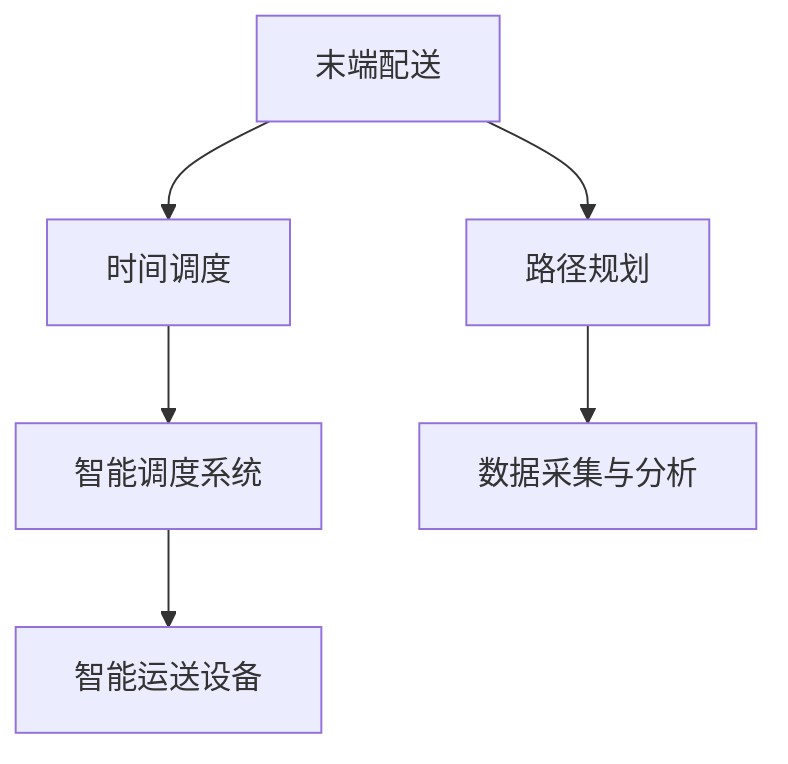

                 

# 末端配送创业：解决最后一公里难题

## 1. 背景介绍

### 1.1 问题由来
随着电子商务的迅猛发展，快递包裹的数量呈爆炸性增长，末端配送面临着巨大的挑战。传统末端配送主要依赖人力，效率低、成本高、可靠性差，已难以满足现代物流行业的需求。为解决末端配送最后一公里的“最后一公里”难题，末端配送创业应运而生，将最新的技术，如物联网、人工智能、无人机等应用到末端配送环节中，旨在提升配送效率，降低成本，保障服务质量。

末端配送创业不仅涉及到技术实现，还涵盖了业务流程的优化、成本管理、客户体验提升等多个层面。本文将从技术角度出发，系统介绍末端配送创业的核心技术体系，分析其主要算法原理，并通过代码实例展示其实现细节，最后对未来的发展方向进行展望。

### 1.2 问题核心关键点
末端配送创业的核心在于整合和应用多种技术手段，通过数据分析、算法优化、智能调度等方法，优化配送流程，提升配送效率。核心关键点包括：

1. **路径规划算法**：如何在多配送点间寻找最优路径，缩短配送时间。
2. **时间调度算法**：如何安排配送员和车辆的调度，确保配送任务按时完成。
3. **智能调度系统**：如何将以上算法集成到智能调度系统中，实时调整配送计划。
4. **智能运送设备**：如无人机、自动驾驶车等，提升配送效率和覆盖范围。
5. **数据采集与分析**：通过实时数据采集与分析，优化配送路线和调度策略。

## 2. 核心概念与联系

### 2.1 核心概念概述

为更好地理解末端配送创业的技术体系，本节将介绍几个密切相关的核心概念：

- **末端配送**：指从仓储到用户手中的最后一公里配送环节。是物流链中的重要组成部分，影响着整个物流的时效性和成本。
- **路径规划算法**：在给定起点和终点的情况下，寻找最优路径的算法，如Dijkstra算法、A*算法等。
- **时间调度算法**：对配送员和车辆进行任务安排，实现最优时间调度的算法，如贪心算法、遗传算法等。
- **智能调度系统**：将路径规划和时间调度算法集成到一个系统，实现动态调整和实时监控。
- **智能运送设备**：利用物联网、AI技术，实现自动驾驶、无人机等智能运送设备，提升配送效率。
- **数据采集与分析**：通过传感器、GPS等手段采集配送过程中的实时数据，进行分析和优化。

这些核心概念之间的逻辑关系可以通过以下Mermaid流程图来展示：



这个流程图展示了末端配送创业的关键技术节点及其相互关系：

1. **路径规划**：在配送起点和终点间寻找最优路径。
2. **时间调度**：对配送员和车辆进行任务安排，确保配送时间最优。
3. **智能调度系统**：集成路径规划和时间调度，实现动态调整。
4. **智能运送设备**：提升配送效率和范围，实现无人化。
5. **数据采集与分析**：实时数据采集与分析，优化配送过程。

这些概念共同构成了末端配送创业的技术框架，为其成功实施提供了坚实的基础。

## 3. 核心算法原理 & 具体操作步骤
### 3.1 算法原理概述

末端配送创业中的核心算法包括路径规划、时间调度等，涉及图论、优化、统计等多个领域。其核心思想是通过算法优化，提升配送效率和准确性，降低配送成本。

以路径规划为例，假设配送起点为$S$，终点为$T$，中间节点为$N$，目标是在节点间寻找一条路径$P$，使得路径总长度最小。这是一个典型的最短路径问题，通常使用Dijkstra算法或A*算法来解决。

### 3.2 算法步骤详解

以下以Dijkstra算法为例，详细讲解路径规划算法的步骤：

1. **初始化**：将所有节点到起点的距离设为无穷大，起点到自身的距离设为0。
2. **选择起点**：从起点开始，将所有相邻节点的距离进行比较，选择距离最小的节点$u$。
3. **更新距离**：将起点到节点$u$的距离设为$d(u)$，并更新与$u$相邻节点的距离。
4. **重复迭代**：重复步骤2和步骤3，直到终点被访问或所有节点均已访问。
5. **生成路径**：根据节点之间的距离，生成从起点到终点的路径。

具体实现步骤如下：

1. 创建一个节点列表，将每个节点到起点的距离设为无穷大，起点到自身的距离设为0。
2. 从起点开始，将所有相邻节点的距离进行比较，选择距离最小的节点$u$。
3. 将起点到节点$u$的距离$d(u)$设为已知距离的最小值，并更新与$u$相邻节点的距离。
4. 重复步骤2和步骤3，直到终点被访问或所有节点均已访问。
5. 根据节点之间的距离，生成从起点到终点的路径。

### 3.3 算法优缺点

Dijkstra算法的主要优点包括：
- 算法简单，易于实现。
- 适用于有向图和无向图。
- 可扩展性强，适用于大规模问题。

其主要缺点包括：
- 只适用于单源最短路径问题。
- 时间复杂度高，对于稠密图，时间复杂度为$O(V^2)$。
- 空间复杂度高，需要存储所有节点和边的信息。

A*算法则是Dijkstra算法的一种改进，利用启发式函数，能够更快找到最优路径，但需要额外计算启发式值，增加了计算复杂度。

### 3.4 算法应用领域

路径规划和时间调度算法广泛应用于物流、交通等领域，助力提高配送效率，优化配送成本。在末端配送创业中，这些算法能够帮助优化配送路线，减少配送时间，提升配送质量，从而实现成本的降低和客户满意度的提升。

此外，这些算法还能够应用于智能调度系统，通过实时数据采集与分析，优化配送计划，提升配送效率。智能运送设备如无人机、自动驾驶车等，也依赖路径规划和时间调度算法，实现高效、可靠的运送。

## 4. 数学模型和公式 & 详细讲解 & 举例说明

### 4.1 数学模型构建

在路径规划问题中，我们可以将配送路线抽象为一个加权图，每个节点表示一个配送点，每条边表示两个节点之间的距离。设节点集合为$V$，边集合为$E$，节点$i$到节点$j$的距离为$d_{ij}$，则路径规划问题可以表示为：

$$
\min \sum_{(i,j) \in P} d_{ij}
$$

其中$P$表示从起点$S$到终点$T$的路径。

### 4.2 公式推导过程

对于Dijkstra算法，设起点为$S$，终点为$T$，节点集合为$V$，边集合为$E$，节点$i$到节点$j$的距离为$d_{ij}$，节点$i$到起点$S$的距离为$d(i)$，则算法步骤如下：

1. 初始化：$d(S)=0$，$d(v)=\infty$，$v \in V \setminus \{S\}$。
2. 选择起点：从起点$S$开始，选择距离起点$S$最近的节点$u$。
3. 更新距离：将起点到节点$u$的距离$d(u)$设为已知距离的最小值，并更新与$u$相邻节点的距离。
4. 重复迭代：重复步骤2和步骤3，直到终点$T$被访问或所有节点均已访问。
5. 生成路径：根据节点之间的距离，生成从起点$S$到终点$T$的路径。

具体推导过程如下：

设$d(v)$表示起点$S$到节点$v$的距离，$N(v)$表示与节点$v$相邻的节点集合。则Dijkstra算法的基本思想为：

$$
d(u) = \min\{d(v) + d_{uv} | v \in N(u)\}
$$

在算法过程中，$d(v)$的值不断更新，直到所有节点的$d(v)$值都被计算出来。

### 4.3 案例分析与讲解

以配送路径规划为例，假设配送起点为$S$，终点为$T$，节点集合为$V=\{S, A, B, C, T\}$，边集合为$E=\{(S,A,1), (A,B,2), (B,C,3), (C,T,4), (S,C,5), (A,T,6), (B,T,7), (C,T,8)\}$，初始距离$d(S)=0$，$d(A)=\infty$，$d(B)=\infty$，$d(C)=\infty$，$d(T)=\infty$。

按照Dijkstra算法步骤计算，结果如下：

- 第1次迭代，选择起点$S$，更新距离$d(A)=1$，$d(B)=\infty$，$d(C)=\infty$，$d(T)=\infty$。
- 第2次迭代，选择节点$A$，更新距离$d(B)=2$，$d(C)=5$，$d(T)=6$。
- 第3次迭代，选择节点$C$，更新距离$d(T)=8$。
- 第4次迭代，选择节点$T$，生成路径$S \rightarrow A \rightarrow T$。

最终结果为，从起点$S$到终点$T$的最短路径为$S \rightarrow A \rightarrow T$，路径总长度为9。

## 5. 项目实践：代码实例和详细解释说明
### 5.1 开发环境搭建

在进行路径规划和智能调度实践前，我们需要准备好开发环境。以下是使用Python进行Dijkstra算法和智能调度系统开发的环境配置流程：

1. 安装Anaconda：从官网下载并安装Anaconda，用于创建独立的Python环境。

2. 创建并激活虚拟环境：
```bash
conda create -n path_planning_env python=3.8 
conda activate path_planning_env
```

3. 安装PyTorch：基于Python的开源深度学习框架，灵活动态的计算图，适合快速迭代研究。
```bash
conda install pytorch torchvision torchaudio cudatoolkit=11.1 -c pytorch -c conda-forge
```

4. 安装NumPy：用于高效数组计算，Python科学计算的核心库。
```bash
pip install numpy
```

5. 安装SciPy：用于科学计算，包括数值优化、信号处理、线性代数等。
```bash
pip install scipy
```

6. 安装Pandas：用于数据处理和分析，方便进行数据清洗和存储。
```bash
pip install pandas
```

完成上述步骤后，即可在`path_planning_env`环境中开始开发实践。

### 5.2 源代码详细实现

以下是使用Python实现Dijkstra算法的代码：

```python
import numpy as np

def dijkstra(graph, start):
    # 初始化距离和标记
    dist = np.zeros(len(graph))
    visited = np.zeros(len(graph), dtype=bool)
    dist[start] = 0
    
    # 迭代计算
    for _ in range(len(graph)-1):
        # 选择距离起点最近的未访问节点
        u = np.argmin(dist[~visited])
        # 更新相邻节点的距离
        for v, w in enumerate(graph[u]):
            if not visited[v] and w > 0:
                new_dist = dist[u] + w
                if new_dist < dist[v]:
                    dist[v] = new_dist
    
    return dist

# 创建图
graph = np.array([[0, 1, 2, 0, 6],
                 [1, 0, 3, 0, 0],
                 [2, 3, 0, 4, 0],
                 [0, 0, 4, 0, 8],
                 [6, 0, 0, 8, 0]])

# 执行Dijkstra算法
result = dijkstra(graph, 0)
print(result)
```

具体实现细节如下：

- 使用NumPy数组表示图，二维数组中每个元素表示两个节点之间的距离。
- 初始化距离和标记，使用NumPy数组表示所有节点的距离和访问状态。
- 在迭代过程中，选择距离起点最近的未访问节点$u$，更新相邻节点的距离$d(v)$。
- 最终返回所有节点的距离数组。

### 5.3 代码解读与分析

Dijkstra算法使用了一种贪心策略，每次选择当前距离起点最近的未访问节点，更新相邻节点的距离。在代码实现中，使用了NumPy数组表示图和距离数组，大幅提高了计算效率。

在实际应用中，还需考虑图的稀疏性、节点个数、计算资源的限制等因素。因此，可能需要对算法进行优化，如使用堆优化、并行计算等。

## 6. 实际应用场景

### 6.1 智能调度系统

智能调度系统是末端配送创业的核心，用于实时监控、优化配送计划，提升配送效率。以城市配送为例，智能调度系统通过实时采集配送路线、车辆位置、配送员状态等数据，进行分析优化，动态调整配送计划。

系统主要由以下几个模块构成：

1. **数据采集模块**：通过传感器、GPS等手段，采集配送过程中的实时数据，如配送员位置、车辆位置、货物状态等。
2. **数据分析模块**：对采集到的数据进行分析，生成配送路径、时间安排等信息。
3. **路径规划模块**：使用路径规划算法，生成最优配送路径。
4. **时间调度模块**：使用时间调度算法，安排配送员和车辆的调度。
5. **可视化模块**：通过可视化界面，实时展示配送进度和状态。

智能调度系统能够帮助配送员和车辆高效地完成配送任务，提升配送效率和客户满意度。

### 6.2 智能运送设备

智能运送设备如无人机、自动驾驶车等，是末端配送创业的重要方向。这些设备能够自动规划路线、避开障碍物，提升配送效率和覆盖范围，降低人力成本。

以无人机配送为例，系统主要由以下几个模块构成：

1. **路径规划模块**：使用路径规划算法，生成无人机飞行的最优路径。
2. **避障模块**：通过传感器实时检测环境，避免障碍物。
3. **飞行控制模块**：控制无人机的飞行速度、高度、方向等参数。
4. **货物管理模块**：保证货物在配送过程中的安全和完整。

智能运送设备能够实现快速、可靠的配送，提升配送效率和灵活性。

### 6.3 数据采集与分析

数据采集与分析是末端配送创业的基础，通过实时数据采集与分析，能够优化配送路线和调度策略，提升配送效率和客户满意度。

以城市配送为例，系统主要由以下几个模块构成：

1. **传感器模块**：通过GPS、温度传感器等，实时采集配送过程中的环境数据。
2. **数据分析模块**：对采集到的数据进行分析，生成配送路径、时间安排等信息。
3. **可视化模块**：通过可视化界面，实时展示配送进度和状态。

数据采集与分析能够帮助配送企业实时掌握配送状态，优化配送计划，提升配送效率。

### 6.4 未来应用展望

随着技术的发展，末端配送创业将迎来更多新的应用场景和挑战。

1. **多模式融合**：未来，末端配送将更加多样化，无人机、自动驾驶车、配送机器人等将共同协作，提升配送效率和覆盖范围。
2. **智能化升级**：利用AI技术，实现配送路径的智能规划、配送任务的自动化调度，提升配送效率和可靠性。
3. **可视化增强**：通过实时数据可视化，帮助管理者实时监控配送状态，优化配送计划。
4. **数据安全保障**：加强数据安全措施，保障配送过程中的数据安全。

未来，末端配送创业将更加智能化、高效化、可视化，为物流行业带来新的变革。

## 7. 工具和资源推荐
### 7.1 学习资源推荐

为帮助开发者系统掌握末端配送创业的核心技术，这里推荐一些优质的学习资源：

1. **《算法导论》**：介绍经典算法和数据结构，是学习算法设计的经典教材。
2. **Coursera《Introduction to Algorithms》**：由MIT教授开设的算法课程，涵盖Dijkstra算法、贪心算法等基础算法。
3. **LeetCode**：提供大量的算法和数据结构练习题，帮助开发者提升算法实现能力。
4. **GitHub**：提供大量的开源项目和代码示例，供开发者学习和参考。
5. **Kaggle**：提供丰富的数据集和比赛，帮助开发者实践和提升数据处理能力。

通过对这些资源的学习实践，相信你一定能够快速掌握末端配送创业的关键算法和技术。

### 7.2 开发工具推荐

高效的开发离不开优秀的工具支持。以下是几款用于末端配送创业开发的常用工具：

1. **Jupyter Notebook**：开源的交互式编程环境，支持Python、R等语言，方便开发者进行算法实验和数据可视化。
2. **PyTorch**：基于Python的开源深度学习框架，灵活动态的计算图，适合快速迭代研究。
3. **NumPy**：用于高效数组计算，Python科学计算的核心库。
4. **SciPy**：用于科学计算，包括数值优化、信号处理、线性代数等。
5. **Pandas**：用于数据处理和分析，方便进行数据清洗和存储。
6. **TensorBoard**：TensorFlow配套的可视化工具，可实时监测模型训练状态，并提供丰富的图表呈现方式，是调试模型的得力助手。
7. **Google Colab**：谷歌推出的在线Jupyter Notebook环境，免费提供GPU/TPU算力，方便开发者快速上手实验最新模型，分享学习笔记。

合理利用这些工具，可以显著提升末端配送创业的开发效率，加快创新迭代的步伐。

### 7.3 相关论文推荐

末端配送创业的发展源于学界的持续研究。以下是几篇奠基性的相关论文，推荐阅读：

1. **A* Search Algorithm**：提出A*算法，通过启发式函数优化路径规划。
2. **Optimization Algorithms**：介绍经典优化算法，如贪心算法、遗传算法等。
3. **Dynamic Programming**：介绍动态规划算法，解决多阶段决策问题。
4. **Machine Learning in Transportation**：介绍机器学习在物流和运输中的应用，包括路径规划和时间调度。
5. **Drones in Logistics**：讨论无人机在物流中的应用，包括路径规划和避障技术。

这些论文代表了大语言模型微调技术的发展脉络。通过学习这些前沿成果，可以帮助研究者把握学科前进方向，激发更多的创新灵感。

## 8. 总结：未来发展趋势与挑战
### 8.1 总结

本文对末端配送创业的核心技术体系进行了全面系统的介绍。首先阐述了末端配送创业的背景和意义，明确了路径规划、时间调度等核心算法在优化配送流程中的重要作用。其次，从原理到实践，详细讲解了Dijkstra算法和时间调度算法的核心思想和实现步骤，并通过代码实例展示其实现细节。最后，本文还对末端配送创业的未来发展方向进行了展望，指出了智能调度系统、智能运送设备、数据采集与分析等关键技术在末端配送中的应用前景。

通过本文的系统梳理，可以看到，末端配送创业的技术体系不断成熟，通过路径规划、时间调度等核心算法，能够显著提升配送效率，降低配送成本，保障配送质量。未来，随着技术的发展和应用场景的拓展，末端配送创业将带来更多新的变革和机遇。

### 8.2 未来发展趋势

展望未来，末端配送创业将呈现以下几个发展趋势：

1. **智能化升级**：利用AI技术，实现配送路径的智能规划、配送任务的自动化调度，提升配送效率和可靠性。
2. **多模式融合**：未来，末端配送将更加多样化，无人机、自动驾驶车、配送机器人等将共同协作，提升配送效率和覆盖范围。
3. **数据安全保障**：加强数据安全措施，保障配送过程中的数据安全。
4. **可视化增强**：通过实时数据可视化，帮助管理者实时监控配送状态，优化配送计划。
5. **低成本化**：通过技术创新和规模效应，降低末端配送的运营成本。

这些趋势将推动末端配送创业向更加智能化、高效化、可视化、安全化的方向发展，为物流行业带来新的变革和机遇。

### 8.3 面临的挑战

尽管末端配送创业已经取得了一定的成果，但在迈向更加智能化、普适化应用的过程中，仍面临诸多挑战：

1. **数据质量问题**：实时数据采集与分析需要高质量的数据支持，但数据源可能存在不完整、不准确等问题。
2. **算法复杂性**：路径规划、时间调度等算法需要考虑多个因素，算法复杂度高，难以在短时间内找到最优解。
3. **技术融合难度**：将多种技术融合到一个系统中，涉及技术栈和数据格式的不一致，增加了系统复杂性。
4. **成本控制问题**：大规模部署智能设备和系统需要较高的投入，成本控制成为重要的挑战。
5. **用户隐私保护**：在数据采集与分析过程中，需要保护用户隐私，防止数据泄露。

这些挑战需要技术开发者、企业管理者等多方共同努力，从数据、算法、工程、管理等多个维度协同发力，才能克服难点，实现末端配送创业的持续发展。

### 8.4 研究展望

面对末端配送创业所面临的挑战，未来的研究需要在以下几个方面寻求新的突破：

1. **数据质量提升**：通过数据清洗、数据增强等技术，提升数据质量和完整性，为路径规划和时间调度提供可靠的数据支持。
2. **算法优化**：研究和应用更加高效、稳健的算法，如启发式算法、动态规划等，提升算法性能和实时性。
3. **技术融合创新**：开发更加智能化的融合技术，如多模式协同调度、自适应路径规划等，实现技术体系的进一步升级。
4. **成本优化**：探索低成本、高效率的解决方案，如共享经济、柔性调度等，降低运营成本。
5. **隐私保护措施**：制定严格的数据隐私保护措施，确保用户数据的安全和隐私。

这些研究方向将为末端配送创业带来新的技术突破和应用前景，进一步推动智能物流的发展。

## 9. 附录：常见问题与解答

**Q1：如何选择合适的路径规划算法？**

A: 选择路径规划算法需要综合考虑多种因素，如图的稠密性、节点数、计算资源等。如果图较为稠密，Dijkstra算法时间复杂度高，不适合大规模问题，可以考虑使用A*算法。如果图较为稀疏，可以使用Dijkstra算法，时间复杂度较低。

**Q2：在路径规划中，如何选择启发式函数？**

A: 启发式函数的选择对A*算法的效率和精度都有重要影响。通常，启发式函数应满足：

1. 低估代价：保证每个节点的估计代价小于等于实际代价。
2. 局部一致性：保证启发式函数在局部范围内正确。

常用的启发式函数包括曼哈顿距离、欧几里得距离、切比雪夫距离等。

**Q3：在智能调度系统中，如何实现实时调整？**

A: 实时调整需要依赖实时数据采集与分析，以及对算法的快速响应能力。可以使用数据流技术，将数据采集与算法计算解耦，提高系统响应速度。同时，可以采用分布式计算框架，如Apache Spark，提高计算效率和容错性。

**Q4：如何优化智能运送设备的路径规划？**

A: 智能运送设备的路径规划需要考虑无人机或自动驾驶车的飞行特性、安全边界、避障策略等。可以使用实时传感器数据进行动态路径规划，如激光雷达、GPS等。同时，可以引入强化学习等技术，实现路径规划的自主优化。

**Q5：在数据采集与分析中，如何保障数据隐私？**

A: 数据隐私保护需要采用多种手段，如数据加密、匿名化处理、访问控制等。可以在数据采集阶段进行隐私保护，如采用差分隐私技术，确保数据采集过程中的隐私保护。同时，在数据分析过程中，需要严格控制数据的访问权限，防止数据泄露。

这些问题的解答，可以帮助开发者更好地理解和应用末端配送创业的关键技术，为实现智能物流提供有力支持。

