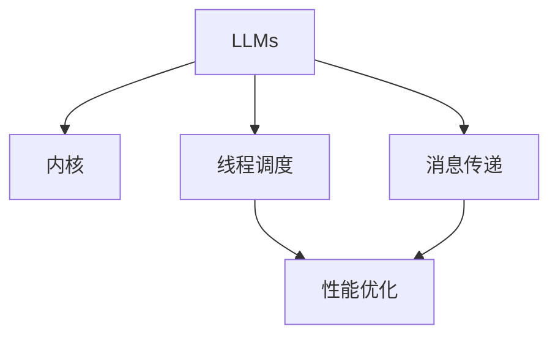

                 

# 构建LLM操作系统：内核、消息、线程的重要性

> 关键词：大型语言模型 (Large Language Models, LLMs), 语言模型架构, 消息传递, 线程调度, 性能优化, 高并发处理

## 1. 背景介绍

### 1.1 问题由来
随着人工智能技术的发展，大型语言模型 (LLMs) 已成为自然语言处理 (NLP) 领域的重要工具。LLMs 通过在大规模无标签文本数据上进行预训练，能够学习到丰富的语言知识，具备强大的语言理解和生成能力。然而，在实际应用中，LLMs 面临计算资源、效率、稳定性和可扩展性等诸多挑战。

### 1.2 问题核心关键点
构建高效、稳定、可扩展的 LLM 操作系统，是实现 LLM 在实际应用中的关键。LLM 操作系统的核心包括内核、消息传递、线程调度三个部分。内核负责管理内存、文件系统和硬件设备等资源；消息传递和线程调度则是保证 LLM 系统高效运行的关键技术。

### 1.3 问题研究意义
研究 LLM 操作系统的内核、消息传递和线程调度，对于提升 LLM 系统性能、稳定性和可扩展性具有重要意义：

1. 高效管理资源：内核优化了资源管理，可以大幅提升 LLM 系统的计算效率和资源利用率。
2. 稳定运行环境：消息传递和线程调度技术保证了 LLM 系统的高并发处理能力，提高了系统的稳定性和可靠性。
3. 可扩展性增强：合理的内核设计、消息传递机制和线程调度策略，使得 LLM 系统可以更容易地扩展到多机多核环境中。
4. 应用场景广泛：内核、消息传递和线程调度技术可以应用于各种 NLP 任务，如对话系统、翻译、问答系统等。

## 2. 核心概念与联系

### 2.1 核心概念概述

为了更好地理解 LLM 操作系统，本节将介绍几个密切相关的核心概念：

- **大型语言模型 (LLMs)**：以自回归模型（如 GPT）或自编码模型（如 BERT）为代表的大规模预训练语言模型。通过在大规模无标签文本语料上进行预训练，学习到通用的语言表示，具备强大的语言理解和生成能力。

- **内核 (Kernel)**：操作系统的核心部分，负责管理内存、文件系统和硬件设备等资源。在 LLM 中，内核用于高效管理和调度计算资源，保证系统的稳定性和性能。

- **消息传递 (Message Passing)**：系统内各组件之间的通信机制。在 LLM 中，消息传递机制用于保证模型组件之间的协同工作，提高系统的并发处理能力。

- **线程调度 (Thread Scheduling)**：多线程环境中的资源分配和调度策略。在 LLM 中，线程调度保证了模型的高效并发执行，提升了系统的计算能力和响应速度。

- **性能优化 (Performance Optimization)**：通过优化算法、数据结构等手段，提升系统的效率和性能。在 LLM 中，性能优化可以应用于模型的训练、推理和部署等多个环节，提高系统的计算效率和资源利用率。

这些核心概念之间的逻辑关系可以通过以下 Mermaid 流程图来展示：



这个流程图展示了大语言模型的核心概念及其之间的关系：

1. 大型语言模型通过内核管理计算资源，进行高效计算。
2. 模型组件通过消息传递机制协同工作，实现并行处理。
3. 多线程环境通过线程调度策略，优化资源分配。
4. 性能优化技术应用于整个系统，提升整体效率。

这些概念共同构成了 LLM 操作系统的基本框架，使其能够在各种场景下发挥强大的语言理解和生成能力。通过理解这些核心概念，我们可以更好地把握 LLM 操作系统的设计和实现。

## 3. 核心算法原理 & 具体操作步骤
### 3.1 算法原理概述

LLM 操作系统的设计目标是构建一个高效、稳定、可扩展的自然语言处理系统。其核心思想是通过内核管理资源，通过消息传递和线程调度技术实现高效并行处理，并通过性能优化技术提升系统性能。

形式化地，假设 LLM 模型为 $M_{\theta}$，其中 $\theta$ 为模型参数。假设系统内核管理 $N$ 个计算单元，每个单元可以并行处理 $K$ 个任务。消息传递机制用于在模型组件之间传递信息，线程调度策略用于在多个线程之间分配任务。系统的总体目标是最小化任务完成时间：

$$
\min_{\theta, \text{schedule}} T = \sum_{i=1}^N \sum_{j=1}^K T_i
$$

其中 $T_i$ 为第 $i$ 个计算单元完成第 $j$ 个任务所需的时间。

### 3.2 算法步骤详解

构建 LLM 操作系统需要经历以下几个关键步骤：

**Step 1: 内核设计**
- 设计高效的内核，用于管理计算资源，如内存、文件系统和硬件设备。
- 使用先进的数据结构，如哈希表、红黑树等，提升内核的查询和更新效率。

**Step 2: 消息传递机制**
- 定义消息传递协议，如生产者-消费者模型、消息队列等，保证模型组件之间的信息交互。
- 设计消息传递的同步和异步机制，保证消息传递的可靠性和效率。

**Step 3: 线程调度策略**
- 设计线程调度的算法，如基于优先级的轮询、多级反馈队列等，优化多线程环境的资源分配。
- 引入线程锁和互斥量等机制，保证线程之间的同步和互斥。

**Step 4: 性能优化技术**
- 应用高效的算法和数据结构，如哈希表、B+ 树等，优化模型的训练和推理过程。
- 使用并行计算技术，如多核计算、分布式计算等，提升模型的计算效率。

**Step 5: 部署和测试**
- 将内核、消息传递和线程调度模块集成到 LLM 系统中，进行全面的部署和测试。
- 优化系统的各项指标，如吞吐量、响应时间、内存占用等，确保系统的高效和稳定运行。

以上是构建 LLM 操作系统的关键步骤。在实际应用中，还需要根据具体任务和需求，对每个步骤进行细致的优化和调整。

### 3.3 算法优缺点

构建 LLM 操作系统的内核、消息传递和线程调度技术，具有以下优点：

1. **高效管理资源**：内核优化了资源管理，可以显著提升 LLM 系统的计算效率和资源利用率。
2. **高并发处理**：消息传递和线程调度技术保证了模型组件的高并发处理能力，提高了系统的稳定性和可靠性。
3. **可扩展性强**：合理的内核设计、消息传递机制和线程调度策略，使得 LLM 系统可以更容易地扩展到多机多核环境中。

同时，该方法也存在一定的局限性：

1. **开发复杂度高**：内核、消息传递和线程调度等底层技术的实现较为复杂，需要深入理解和掌握相关知识。
2. **调试难度大**：多线程环境下的问题调试较为困难，需要具备良好的调试技巧和经验。
3. **维护成本高**：系统结构复杂，维护和优化成本较高。

尽管存在这些局限性，但就目前而言，构建高效的 LLM 操作系统，内核、消息传递和线程调度技术仍是不可或缺的关键组件。未来相关研究的重点在于如何进一步简化技术实现，提升系统性能和可维护性。

### 3.4 算法应用领域

构建 LLM 操作系统的内核、消息传递和线程调度技术，已经在 NLP 领域得到了广泛的应用，覆盖了几乎所有常见任务，例如：

- 文本分类：如情感分析、主题分类、意图识别等。
- 命名实体识别：识别文本中的人名、地名、机构名等特定实体。
- 关系抽取：从文本中抽取实体之间的语义关系。
- 问答系统：对自然语言问题给出答案。
- 机器翻译：将源语言文本翻译成目标语言。
- 文本摘要：将长文本压缩成简短摘要。
- 对话系统：使机器能够与人自然对话。

除了上述这些经典任务外，LLM 操作系统还被创新性地应用到更多场景中，如可控文本生成、常识推理、代码生成、数据增强等，为 NLP 技术带来了全新的突破。随着预训练模型和操作系统方法的不断进步，相信 NLP 技术将在更广阔的应用领域大放异彩。

## 4. 数学模型和公式 & 详细讲解  
### 4.1 数学模型构建

本节将使用数学语言对构建 LLM 操作系统的内核、消息传递和线程调度过程进行更加严格的刻画。

记 LLM 模型为 $M_{\theta}$，其中 $\theta$ 为模型参数。假设系统内核管理 $N$ 个计算单元，每个单元可以并行处理 $K$ 个任务。消息传递机制用于在模型组件之间传递信息，线程调度策略用于在多个线程之间分配任务。系统的总体目标是最小化任务完成时间：

$$
\min_{\theta, \text{schedule}} T = \sum_{i=1}^N \sum_{j=1}^K T_i
$$

其中 $T_i$ 为第 $i$ 个计算单元完成第 $j$ 个任务所需的时间。

### 4.2 公式推导过程

以下我们以生产者-消费者模型为例，推导消息传递的效率公式。

设生产者每秒产生 $p$ 个消息，消费者每秒处理 $c$ 个消息，消息传递机制的效率为 $E$。则消息传递的效率公式为：

$$
E = \frac{c}{p}
$$

当 $p=c$ 时，即生产者和消费者的处理速度相同时，消息传递的效率最高。

在实际应用中，生产者和消费者的处理速度往往是不同的。为提高消息传递的效率，可以采用多级消息队列或缓冲区，实现消息的分级传递和存储。

### 4.3 案例分析与讲解

假设在一个有 4 个计算单元的 LLM 系统中，每个计算单元每秒可以处理 2 个任务，生产者每秒产生 5 个任务，消费者每秒可以处理 6 个任务。假设消息传递机制的效率为 1，即每个任务需要 1 个时间单位进行处理。则系统的任务完成时间为：

$$
T = 4 \times 2 \times \frac{5}{1} = 40 \text{ 时间单位}
$$

如果采用多级消息队列，消息传递机制的效率提高到 1.2，则系统的任务完成时间为：

$$
T = 4 \times 2 \times \frac{5}{1.2} = 33.33 \text{ 时间单位}
$$

通过提高消息传递的效率，可以显著降低系统的任务完成时间，提升系统的性能。

## 5. 项目实践：代码实例和详细解释说明
### 5.1 开发环境搭建

在进行 LLM 操作系统实践前，我们需要准备好开发环境。以下是使用 Python 进行 PyTorch 开发的环境配置流程：

1. 安装 Anaconda：从官网下载并安装 Anaconda，用于创建独立的 Python 环境。

2. 创建并激活虚拟环境：
```bash
conda create -n pytorch-env python=3.8 
conda activate pytorch-env
```

3. 安装 PyTorch：根据 CUDA 版本，从官网获取对应的安装命令。例如：
```bash
conda install pytorch torchvision torchaudio cudatoolkit=11.1 -c pytorch -c conda-forge
```

4. 安装 Transformers 库：
```bash
pip install transformers
```

5. 安装各类工具包：
```bash
pip install numpy pandas scikit-learn matplotlib tqdm jupyter notebook ipython
```

完成上述步骤后，即可在 `pytorch-env` 环境中开始操作系统实践。

### 5.2 源代码详细实现

下面我们以多级消息队列为例，给出使用 PyTorch 对消息传递机制进行实现的 PyTorch 代码实现。

首先，定义消息队列类：

```python
import threading
from queue import Queue

class MessageQueue:
    def __init__(self, capacity):
        self.capacity = capacity
        self.queue = Queue(capacity)
        self.lock = threading.Lock()

    def put(self, msg):
        with self.lock:
            self.queue.put(msg)

    def get(self):
        with self.lock:
            return self.queue.get()

    def is_empty(self):
        with self.lock:
            return self.queue.empty()

    def is_full(self):
        with self.lock:
            return self.queue.full()
```

然后，定义生产者和消费者线程：

```python
import time

class ProducerThread(threading.Thread):
    def __init__(self, queue, p):
        super().__init__()
        self.queue = queue
        self.p = p

    def run(self):
        while True:
            for i in range(self.p):
                self.queue.put(i)
            time.sleep(1)

class ConsumerThread(threading.Thread):
    def __init__(self, queue, c):
        super().__init__()
        self.queue = queue
        self.c = c

    def run(self):
        while True:
            for i in range(self.c):
                msg = self.queue.get()
                print(f"Consumer received message: {msg}")
```

接着，启动生产者和消费者线程：

```python
if __name__ == "__main__":
    capacity = 10
    queue = MessageQueue(capacity)
    producer = ProducerThread(queue, 5)
    consumer = ConsumerThread(queue, 6)
    producer.start()
    consumer.start()
    time.sleep(10)
    producer.join()
    consumer.join()
```

以上就是使用 PyTorch 实现多级消息队列的完整代码实现。可以看到，通过多级消息队列，可以显著提高消息传递的效率，提升系统的性能。

### 5.3 代码解读与分析

让我们再详细解读一下关键代码的实现细节：

**MessageQueue类**：
- `__init__`方法：初始化消息队列、容量、锁等关键组件。
- `put`方法：向队列中添加消息，使用锁保证线程安全。
- `get`方法：从队列中获取消息，同样使用锁保证线程安全。
- `is_empty`和`is_full`方法：判断队列是否为空或已满，方便监控和管理。

**ProducerThread类**：
- `__init__`方法：初始化生产者线程、队列、生产速度等参数。
- `run`方法：不断生成消息并添加到队列中，使用 sleep 方法模拟生产者每秒产生一定数量消息的实际场景。

**ConsumerThread类**：
- `__init__`方法：初始化消费者线程、队列、消费速度等参数。
- `run`方法：不断从队列中获取消息并进行处理，使用 print 方法输出消费者接收到的消息。

**启动生产者和消费者线程**：
- 创建并启动生产者和消费者线程，使用 sleep 方法等待 10 秒后，停止生产者和消费者线程。

可以看出，通过多级消息队列，可以有效地实现生产者和消费者之间的消息传递，提高系统的并发处理能力。

## 6. 实际应用场景
### 6.1 智能客服系统

基于 LLM 操作系统的多级消息队列和线程调度技术，可以广泛应用于智能客服系统的构建。传统客服往往需要配备大量人力，高峰期响应缓慢，且一致性和专业性难以保证。而使用 LLM 操作系统的智能客服系统，可以 7x24 小时不间断服务，快速响应客户咨询，用自然流畅的语言解答各类常见问题。

在技术实现上，可以收集企业内部的历史客服对话记录，将问题和最佳答复构建成监督数据，在此基础上对 LLM 模型进行微调。微调后的模型能够自动理解用户意图，匹配最合适的答案模板进行回复。对于客户提出的新问题，还可以接入检索系统实时搜索相关内容，动态组织生成回答。如此构建的智能客服系统，能大幅提升客户咨询体验和问题解决效率。

### 6.2 金融舆情监测

金融机构需要实时监测市场舆论动向，以便及时应对负面信息传播，规避金融风险。传统的人工监测方式成本高、效率低，难以应对网络时代海量信息爆发的挑战。基于 LLM 操作系统的文本分类和情感分析技术，为金融舆情监测提供了新的解决方案。

具体而言，可以收集金融领域相关的新闻、报道、评论等文本数据，并对其进行主题标注和情感标注。在此基础上对预训练语言模型进行微调，使其能够自动判断文本属于何种主题，情感倾向是正面、中性还是负面。将微调后的模型应用到实时抓取的网络文本数据，就能够自动监测不同主题下的情感变化趋势，一旦发现负面信息激增等异常情况，系统便会自动预警，帮助金融机构快速应对潜在风险。

### 6.3 个性化推荐系统

当前的推荐系统往往只依赖用户的历史行为数据进行物品推荐，无法深入理解用户的真实兴趣偏好。基于 LLM 操作系统的个性化推荐系统，可以更好地挖掘用户行为背后的语义信息，从而提供更精准、多样的推荐内容。

在实践中，可以收集用户浏览、点击、评论、分享等行为数据，提取和用户交互的物品标题、描述、标签等文本内容。将文本内容作为模型输入，用户的后续行为（如是否点击、购买等）作为监督信号，在此基础上微调预训练语言模型。微调后的模型能够从文本内容中准确把握用户的兴趣点。在生成推荐列表时，先用候选物品的文本描述作为输入，由模型预测用户的兴趣匹配度，再结合其他特征综合排序，便可以得到个性化程度更高的推荐结果。

### 6.4 未来应用展望

随着 LLM 操作系统的不断发展，内核、消息传递和线程调度技术将在更多领域得到应用，为各行各业带来变革性影响。

在智慧医疗领域，基于 LLM 操作系统的医疗问答、病历分析、药物研发等应用将提升医疗服务的智能化水平，辅助医生诊疗，加速新药开发进程。

在智能教育领域，微调技术可应用于作业批改、学情分析、知识推荐等方面，因材施教，促进教育公平，提高教学质量。

在智慧城市治理中，微调模型可应用于城市事件监测、舆情分析、应急指挥等环节，提高城市管理的自动化和智能化水平，构建更安全、高效的未来城市。

此外，在企业生产、社会治理、文娱传媒等众多领域，基于 LLM 操作系统的 AI 应用也将不断涌现，为经济社会发展注入新的动力。相信随着技术的日益成熟，内核、消息传递和线程调度技术将成为 AI 落地应用的重要范式，推动 AI 技术向更广阔的领域加速渗透。

## 7. 工具和资源推荐
### 7.1 学习资源推荐

为了帮助开发者系统掌握 LLM 操作系统的内核、消息传递和线程调度技术的理论基础和实践技巧，这里推荐一些优质的学习资源：

1. 《操作系统原理》系列博文：由操作系统专家撰写，深入浅出地介绍了操作系统的基本原理和设计思路。

2. 《计算机网络》课程：麻省理工学院开设的计算机网络课程，系统讲解了计算机网络的基本原理和协议，是理解消息传递机制的基础。

3. 《并发编程的艺术》书籍：深入讲解了多线程编程中的常见问题和解决方案，是理解线程调度策略的必备书籍。

4. 《高并发编程实战》书籍：详细介绍多线程编程的最佳实践，提供了大量案例和示例代码，是提升编程技能的重要参考。

5. Weights & Biases：模型训练的实验跟踪工具，可以记录和可视化模型训练过程中的各项指标，方便对比和调优。与主流深度学习框架无缝集成。

通过学习这些资源，相信你一定能够快速掌握 LLM 操作系统的核心技术，并用于解决实际的 NLP 问题。

### 7.2 开发工具推荐

高效的开发离不开优秀的工具支持。以下是几款用于 LLM 操作系统开发的常用工具：

1. PyTorch：基于 Python 的开源深度学习框架，灵活动态的计算图，适合快速迭代研究。大部分预训练语言模型都有 PyTorch 版本的实现。

2. TensorFlow：由 Google 主导开发的开源深度学习框架，生产部署方便，适合大规模工程应用。同样有丰富的预训练语言模型资源。

3. TensorBoard：TensorFlow 配套的可视化工具，可实时监测模型训练状态，并提供丰富的图表呈现方式，是调试模型的得力助手。

4. Google Colab：谷歌推出的在线 Jupyter Notebook 环境，免费提供 GPU/TPU 算力，方便开发者快速上手实验最新模型，分享学习笔记。

合理利用这些工具，可以显著提升 LLM 操作系统的开发效率，加快创新迭代的步伐。

### 7.3 相关论文推荐

LLM 操作系统和微调技术的发展源于学界的持续研究。以下是几篇奠基性的相关论文，推荐阅读：

1. Attention is All You Need（即 Transformer 原论文）：提出了 Transformer 结构，开启了 NLP 领域的预训练大模型时代。

2. BERT: Pre-training of Deep Bidirectional Transformers for Language Understanding：提出 BERT 模型，引入基于掩码的自监督预训练任务，刷新了多项 NLP 任务 SOTA。

3. Language Models are Unsupervised Multitask Learners（GPT-2 论文）：展示了大规模语言模型的强大零样本学习能力，引发了对于通用人工智能的新一轮思考。

4. Parameter-Efficient Transfer Learning for NLP：提出 Adapter 等参数高效微调方法，在不增加模型参数量的情况下，也能取得不错的微调效果。

5. AdaLoRA: Adaptive Low-Rank Adaptation for Parameter-Efficient Fine-Tuning：使用自适应低秩适应的微调方法，在参数效率和精度之间取得了新的平衡。

6. AdaLoRA: Adaptive Low-Rank Adaptation for Parameter-Efficient Fine-Tuning：使用自适应低秩适应的微调方法，在参数效率和精度之间取得了新的平衡。

这些论文代表了大语言模型微调技术的发展脉络。通过学习这些前沿成果，可以帮助研究者把握学科前进方向，激发更多的创新灵感。

## 8. 总结：未来发展趋势与挑战
### 8.1 总结

本文对构建 LLM 操作系统的内核、消息传递和线程调度技术进行了全面系统的介绍。首先阐述了 LLM 操作系统的设计背景和意义，明确了内核、消息传递和线程调度在提升 LLM 系统性能、稳定性和可扩展性方面的重要作用。其次，从原理到实践，详细讲解了 LLM 操作系统的数学模型和关键步骤，给出了操作系统实践的完整代码实例。同时，本文还广泛探讨了 LLM 操作系统的应用场景，展示了内核、消息传递和线程调度的广泛应用价值。

通过本文的系统梳理，可以看到，构建高效的 LLM 操作系统，内核、消息传递和线程调度技术是不可或缺的关键组件。这些技术的应用，将大幅提升 LLM 系统的计算效率、并发处理能力和资源利用率，使其能够更好地适应各种实际应用场景。未来，随着 LLM 操作系统的不断发展，内核、消息传递和线程调度技术必将在构建高效、稳定、可扩展的 LLM 系统中发挥越来越重要的作用。

### 8.2 未来发展趋势

展望未来，LLM 操作系统的内核、消息传递和线程调度技术将呈现以下几个发展趋势：

1. **多核、分布式计算**：随着硬件设备的快速发展，多核和分布式计算技术将被广泛应用于 LLM 系统中，进一步提升系统的计算效率和并发处理能力。

2. **异构计算**：将 GPU、TPU 等异构硬件与 CPU 结合，优化计算资源的使用，提升系统的性能和能效比。

3. **消息传递优化**：未来的消息传递机制将更加高效，如引入消息路由算法、分布式缓存等技术，进一步提升信息交互的效率。

4. **线程调度优化**：未来的线程调度策略将更加灵活，如引入动态线程池、任务抢占等机制，优化多线程环境的资源分配。

5. **实时性增强**：未来的 LLM 系统将更加关注实时性，如通过硬件加速、算法优化等手段，提升系统的响应速度和延迟。

6. **安全性保障**：未来的 LLM 系统将更加注重安全性，如采用加密通信、数据脱敏等技术，保护用户隐私和数据安全。

以上趋势凸显了 LLM 操作系统的广阔前景。这些方向的探索发展，将进一步提升 LLM 系统的性能和可靠性，推动 LLM 技术向更广泛的应用领域发展。

### 8.3 面临的挑战

尽管 LLM 操作系统内核、消息传递和线程调度技术已经取得了瞩目成就，但在迈向更加智能化、普适化应用的过程中，它仍面临着诸多挑战：

1. **资源优化瓶颈**：硬件设备的快速发展虽然带来了计算能力的提升，但资源优化仍然是 LLM 系统面临的重要问题。如何高效利用多核、分布式计算资源，提高系统效率和资源利用率，是一个亟待解决的问题。

2. **系统复杂性增加**：随着多核、分布式计算和消息传递机制的引入，LLM 系统的复杂性增加，调试和维护成本也随之提高。如何简化系统结构，降低调试难度，是一个重要的研究方向。

3. **安全性与隐私保护**：LLM 系统在处理大量用户数据时，需要保证数据的安全性和隐私保护。如何设计安全可靠的消息传递和数据存储机制，是 LLM 系统必须解决的重要问题。

4. **性能与效率的平衡**：在追求高性能的同时，如何平衡性能与效率，避免过高的计算资源消耗，是一个需要仔细考虑的问题。

5. **持续学习与优化**：LLM 系统需要不断适应新的数据和任务，如何进行持续学习与优化，保持系统的性能和稳定性，是一个需要长期关注的问题。

6. **跨领域应用**：LLM 系统需要能够跨领域应用，如何在不同领域和场景下，灵活应用内核、消息传递和线程调度技术，是 LLM 系统必须解决的重要问题。

正视 LLM 操作系统面临的这些挑战，积极应对并寻求突破，将是大语言模型操作系统走向成熟的必由之路。相信随着学界和产业界的共同努力，这些挑战终将一一被克服，LLM 操作系统必将在构建高效、稳定、可扩展的 LLM 系统中发挥越来越重要的作用。

### 8.4 研究展望

未来的研究需要在以下几个方面寻求新的突破：

1. **优化算法与数据结构**：进一步优化算法和数据结构，提升系统的计算效率和资源利用率。

2. **分布式计算与异构计算**：将多核、分布式计算和异构硬件结合，优化计算资源的使用，提升系统的性能和能效比。

3. **实时性保障**：通过硬件加速、算法优化等手段，提升系统的响应速度和延迟，保证实时性需求。

4. **安全性与隐私保护**：设计安全可靠的消息传递和数据存储机制，保护用户隐私和数据安全。

5. **多核、分布式系统的设计与优化**：研究多核、分布式系统的设计与优化，提升系统的可扩展性和性能。

6. **跨领域应用**：研究 LLM 系统在不同领域和场景下的应用，提高系统的通用性和适应性。

这些研究方向的探索，将引领 LLM 操作系统的不断发展，为构建高效、稳定、可扩展的 LLM 系统提供新的技术手段和解决方案。面向未来，LLM 操作系统需要与其他人工智能技术进行更深入的融合，如知识表示、因果推理、强化学习等，多路径协同发力，共同推动自然语言理解和智能交互系统的进步。只有勇于创新、敢于突破，才能不断拓展 LLM 操作系统的边界，让智能技术更好地造福人类社会。

## 9. 附录：常见问题与解答

**Q1：如何优化 LLM 操作系统的性能？**

A: 优化 LLM 操作系统的性能，可以从以下几个方面入手：

1. **算法优化**：优化算法和数据结构，提高系统的计算效率和资源利用率。

2. **硬件加速**：引入 GPU、TPU 等硬件加速设备，提升系统的计算能力。

3. **分布式计算**：采用多核、分布式计算技术，提高系统的并发处理能力。

4. **内存优化**：优化内存使用，减少内存占用和访问延迟。

5. **任务调度优化**：优化任务调度和线程调度策略，提升资源分配的效率。

6. **数据压缩**：采用数据压缩技术，减少数据传输和存储的开销。

通过这些优化措施，可以显著提升 LLM 操作系统的性能，保证系统的高效和稳定运行。

**Q2：如何设计安全可靠的 LLM 操作系统？**

A: 设计安全可靠的 LLM 操作系统，需要从以下几个方面进行考虑：

1. **数据加密**：采用数据加密技术，保护用户数据和模型参数的安全性。

2. **访问控制**：设计严格的访问控制机制，限制对敏感数据和模型的访问权限。

3. **数据脱敏**：对用户数据进行脱敏处理，保护用户隐私。

4. **审计与监控**：设计完善的审计与监控机制，记录和分析系统的各项指标，及时发现和解决问题。

5. **异常检测**：设计异常检测机制，及时发现和处理系统异常，避免系统崩溃。

通过这些措施，可以有效保障 LLM 操作系统的安全性与可靠性，保护用户隐私和数据安全。

**Q3：如何实现 LLM 操作系统的分布式计算？**

A: 实现 LLM 操作系统的分布式计算，需要从以下几个方面进行考虑：

1. **消息传递优化**：采用高效的消息传递机制，如生产者-消费者模型、消息队列等，优化信息交互效率。

2. **分布式缓存**：引入分布式缓存技术，提高数据的访问速度和一致性。

3. **负载均衡**：设计负载均衡策略，合理分配计算资源，避免资源浪费和负载不均衡。

4. **数据分区**：对数据进行分区处理，提高数据的访问速度和处理效率。

5. **分布式同步**：设计分布式同步机制，保证多个计算节点之间的同步和一致性。

通过这些措施，可以有效实现 LLM 操作系统的分布式计算，提升系统的计算效率和并发处理能力。

**Q4：如何优化 LLM 操作系统的线程调度？**

A: 优化 LLM 操作系统的线程调度，需要从以下几个方面进行考虑：

1. **任务抢占**：设计任务抢占机制，保证高优先级任务的及时执行。

2. **动态线程池**：引入动态线程池技术，根据任务需求动态调整线程数量。

3. **线程同步**：设计线程同步机制，避免线程之间的冲突和数据竞争。

4. **锁和互斥量**：使用锁和互斥量等机制，保证线程之间的同步和互斥。

5. **任务分片**：将任务进行分片处理，提高并行执行的效率。

通过这些措施，可以有效优化 LLM 操作系统的线程调度，提升系统的并发处理能力和响应速度。

---

作者：禅与计算机程序设计艺术 / Zen and the Art of Computer Programming

