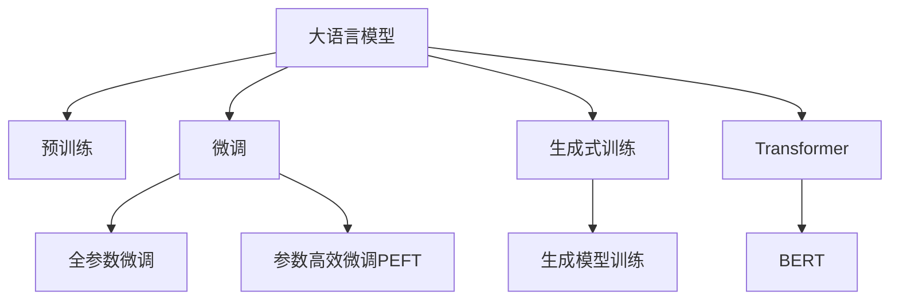

                 

# 构建Storyteller AI大语言模型：从基础到ChatGPT级应用

> 关键词：大语言模型,微调,ChatGPT,生成式AI,Transformer,BERT,自监督学习,预训练,Transformer,深度学习,自然语言处理

## 1. 背景介绍

### 1.1 问题由来
在人工智能技术迅速发展的今天，自然语言处理（NLP）已成为AI领域的重要分支。其中，大语言模型（Large Language Models, LLMs）因其卓越的文本生成和理解能力，正在逐步改变人们与计算机互动的方式。OpenAI的ChatGPT模型便是这一领域的代表，它能够生成流畅、有逻辑性的文本，并应对各种复杂问题，显著提升了人机交互的质量。

然而，构建如ChatGPT这样先进的语言模型，不仅仅是调参和调整超参数那么简单。它涉及对大语言模型架构的深刻理解，以及如何通过微调（Fine-Tuning）和生成式训练（Generative Training）来优化模型的过程。本文将详细介绍如何从基础到大规模应用，构建一个类似于ChatGPT级别的Storyteller AI大语言模型。

### 1.2 问题核心关键点
构建一个高质量的Storyteller AI大语言模型，需要解决以下几个核心问题：

1. 选择合适的语言模型架构，如Transformer、BERT等。
2. 进行有效的预训练，构建语言模型的通用知识库。
3. 设计合理的微调方法，提升模型在特定任务上的表现。
4. 使用生成式训练，优化模型的生成能力和连贯性。
5. 平衡模型的复杂度和性能，确保其高效性和可扩展性。

本文档将围绕这些关键点，系统地介绍大语言模型的构建过程，并通过实际项目案例，展现如何构建一个功能强大的Storyteller AI大语言模型。

## 2. 核心概念与联系

### 2.1 核心概念概述

在深入探讨构建Storyteller AI大语言模型之前，我们需要理解几个核心概念：

- **大语言模型（Large Language Models, LLMs）**：如GPT、BERT等，是利用深度学习技术训练的，能够理解和生成自然语言的大规模神经网络模型。
- **微调（Fine-Tuning）**：在大规模预训练模型的基础上，通过特定任务的数据集进行训练，以提升模型在特定任务上的表现。
- **生成式训练（Generative Training）**：通过给模型提供输入文本，引导模型生成符合特定条件的输出文本，训练模型生成连贯、上下文相关的语言。
- **Transformer**：一种用于深度学习序列数据处理的模型，以其高效性、并行计算能力和长距离依赖建模能力著称。
- **BERT**：一种基于双向Transformer的预训练语言模型，通过遮掩语言模型（Masked Language Modeling, MLM）和下一句预测（Next Sentence Prediction, NSP）任务进行预训练。

这些核心概念之间的逻辑关系可以通过以下Mermaid流程图来展示：



这个流程图展示了大语言模型的核心概念及其之间的关系：

1. 大语言模型通过预训练获得基础能力。
2. 微调是对预训练模型进行任务特定的优化，可以分为全参数微调和参数高效微调（PEFT）。
3. 生成式训练用于优化模型的生成能力和连贯性。
4. Transformer和BERT是大语言模型的主要架构，前者用于编码器，后者用于预训练。

这些概念共同构成了大语言模型的学习和应用框架，使得模型能够理解和生成自然语言，适应各种任务。

## 3. 核心算法原理 & 具体操作步骤
### 3.1 算法原理概述

构建Storyteller AI大语言模型的过程主要包括以下几个步骤：

1. **选择合适的语言模型架构**：如Transformer，它是一种基于自注意力机制的神经网络架构，能够高效地处理长距离依赖。
2. **预训练**：在大量无标签文本数据上进行自监督学习，构建语言模型的通用知识库。
3. **微调**：使用特定任务的数据集进行有监督学习，提升模型在特定任务上的表现。
4. **生成式训练**：通过给模型提供输入文本，引导模型生成符合特定条件的输出文本，优化模型的生成能力和连贯性。

### 3.2 算法步骤详解

#### 3.2.1 预训练

预训练是构建大语言模型的基础步骤，其目标是通过无监督学习，构建一个通用的语言表示。预训练的方法有多种，以下是BERT模型的预训练过程：

1. **输入数据准备**：收集大规模无标签的文本数据，并将其分成长度适当的句子或段落。
2. **预训练任务设计**：设计两个任务，即遮掩语言模型（MLM）和下一句预测（NSP）。MLM是指通过随机遮掩部分单词，让模型预测被遮掩单词，学习上下文关系；NSP是指让模型判断两个句子是否为连续，以学习句子间的关系。
3. **模型训练**：使用预训练任务对模型进行训练，通常使用GPU或TPU进行加速计算。

#### 3.2.2 微调

微调是在预训练模型的基础上，通过特定任务的数据集进行有监督学习，以提升模型在特定任务上的表现。以下是一个基于微调的示例：

1. **任务定义**：明确需要微调的任务，如文本分类、命名实体识别等。
2. **数据集准备**：收集特定任务的数据集，并进行标注，确保数据集质量。
3. **模型初始化**：加载预训练模型，作为微调的起点。
4. **模型适配**：在预训练模型的基础上，添加任务适配层，如线性分类器、注意力机制等。
5. **模型训练**：使用微调数据集对模型进行训练，以优化模型在特定任务上的表现。
6. **模型评估**：在验证集上评估模型性能，根据评估结果调整模型参数和超参数。

#### 3.2.3 生成式训练

生成式训练的目标是通过给模型提供输入文本，引导模型生成符合特定条件的输出文本，训练模型生成连贯、上下文相关的语言。以下是一个生成式训练的示例：

1. **输入文本设计**：设计有意义的输入文本，以引导模型生成连贯的输出文本。
2. **模型训练**：在生成式训练任务上对模型进行训练，通常使用前向传播和反向传播算法。
3. **输出文本评估**：对生成的文本进行评估，如语言流畅度、上下文相关性等，根据评估结果调整模型参数。

### 3.3 算法优缺点

构建Storyteller AI大语言模型的方法有以下优点：

1. **高效性**：使用预训练模型作为起点，可以减少从头训练的计算成本和时间。
2. **泛化能力**：预训练模型通过学习大规模文本数据，具备较强的泛化能力，可以在不同任务上表现良好。
3. **可扩展性**：微调和生成式训练方法灵活，可以在不同任务上进行调整和优化。

同时，这种方法也存在一些缺点：

1. **数据依赖**：预训练和微调过程依赖于大规模高质量数据，数据收集和标注成本较高。
2. **模型复杂性**：大语言模型通常具有复杂结构，训练和推理所需资源较多。
3. **过拟合风险**：在大规模预训练和微调过程中，容易发生过拟合，需要谨慎选择学习率和正则化策略。

### 3.4 算法应用领域

构建Storyteller AI大语言模型的方法在多个领域得到了广泛应用，以下是几个典型的应用场景：

1. **自然语言处理（NLP）**：如文本分类、命名实体识别、信息抽取等。微调模型可以在特定任务上实现较好的效果。
2. **机器翻译**：通过微调和生成式训练，构建高效准确的翻译系统。
3. **对话系统**：如智能客服、聊天机器人等。微调和生成式训练使得对话系统能够生成自然流畅的回答。
4. **内容生成**：如文章生成、文本摘要、故事创作等。生成式训练可以帮助模型生成高质量的内容。
5. **数据增强**：通过生成式训练，生成更多的训练数据，提升模型的泛化能力。

这些应用场景展示了大语言模型在构建智能系统的广泛潜力，相信随着技术的不断进步，其应用范围将会更加广泛。

## 4. 数学模型和公式 & 详细讲解 & 举例说明

### 4.1 数学模型构建

构建Storyteller AI大语言模型的数学模型主要包括预训练和微调两个部分。

**预训练模型**：以BERT为例，预训练模型通过遮掩语言模型（MLM）和下一句预测（NSP）任务进行训练。假设输入文本为 $X$，遮掩后的文本为 $X'$，预测被遮掩单词的概率为 $P(y|X')$。

**微调模型**：假设微调任务为文本分类，输入文本为 $X$，模型输出为 $y$，模型损失函数为 $L(y, \hat{y})$。

### 4.2 公式推导过程

#### 4.2.1 预训练模型公式

BERT模型的预训练目标函数为：

$$
\mathcal{L}_{BERT} = -\frac{1}{N}\sum_{i=1}^N \left( \mathcal{L}_{MLM} + \mathcal{L}_{NSP} \right)
$$

其中，$\mathcal{L}_{MLM}$ 和 $\mathcal{L}_{NSP}$ 分别为遮掩语言模型和下一句预测任务的损失函数。

#### 4.2.2 微调模型公式

微调模型的目标函数为：

$$
\mathcal{L}_{Fine-Tune} = -\frac{1}{N}\sum_{i=1}^N \mathcal{L}(y, \hat{y})
$$

其中，$\mathcal{L}$ 为微调任务的损失函数，如交叉熵损失函数。

### 4.3 案例分析与讲解

以命名实体识别（Named Entity Recognition, NER）为例，分析微调过程。假设输入文本为 $X$，标签为 $y$，模型输出为 $\hat{y}$。

1. **数据准备**：收集标注好的NER数据集，将文本和标签作为输入和输出，进行微调训练。
2. **模型适配**：在预训练模型的基础上，添加线性分类器和注意力机制，用于输出实体类型。
3. **模型训练**：使用微调数据集对模型进行训练，优化模型参数。
4. **模型评估**：在验证集上评估模型性能，根据评估结果调整模型参数。

## 5. 项目实践：代码实例和详细解释说明

### 5.1 开发环境搭建

在搭建开发环境之前，需要安装必要的软件和库。以下是Python环境下安装这些软件和库的步骤：

1. **安装Python**：从官网下载并安装Python，选择合适版本的Python进行安装。
2. **安装PyTorch**：使用pip安装PyTorch，以确保支持深度学习任务。
3. **安装TensorFlow**：如果需要使用TensorFlow进行开发，可以同时安装TensorFlow。
4. **安装Transformers**：使用pip安装Transformers库，以支持使用预训练模型进行微调。
5. **安装其他依赖库**：如numpy、pandas、scikit-learn等，以支持数据处理和模型评估。

完成以上步骤后，即可在Python环境下进行大语言模型的开发。

### 5.2 源代码详细实现

以下是一个基于BERT模型进行NER微调的Python代码实现：

```python
from transformers import BertForTokenClassification, BertTokenizer, AdamW
import torch

# 初始化BERT模型和tokenizer
model = BertForTokenClassification.from_pretrained('bert-base-cased', num_labels=NUM_LABELS)
tokenizer = BertTokenizer.from_pretrained('bert-base-cased')

# 准备微调数据集
train_data, dev_data, test_data = preprocess_data(train_texts, train_tags, dev_texts, dev_tags, test_texts, test_tags)

# 定义微调超参数
lr = 2e-5
max_epochs = 5
batch_size = 16

# 定义优化器
optimizer = AdamW(model.parameters(), lr=lr)

# 训练模型
for epoch in range(max_epochs):
    train_loss = train_epoch(model, train_data, optimizer, batch_size)
    dev_loss = evaluate(model, dev_data, batch_size)
    print(f'Epoch {epoch+1}, train loss: {train_loss:.3f}, dev loss: {dev_loss:.3f}')

# 在测试集上评估模型
test_loss = evaluate(model, test_data, batch_size)
print(f'Test loss: {test_loss:.3f}')
```

### 5.3 代码解读与分析

以上代码展示了使用PyTorch和Transformers库对BERT模型进行NER微调的基本流程。具体分析如下：

1. **模型初始化**：使用 `BertForTokenClassification.from_pretrained` 方法加载预训练的BERT模型，并根据任务需求设置标签数量。
2. **数据预处理**：定义数据预处理函数，将原始文本和标签转换为模型可以接受的格式。
3. **超参数设置**：定义学习率、迭代次数和批次大小等超参数，以控制模型训练过程。
4. **优化器选择**：使用AdamW优化器，并设置学习率，以优化模型参数。
5. **训练和评估**：在训练集上进行前向传播和反向传播，计算损失函数并更新模型参数。在验证集上评估模型性能，并在测试集上评估模型最终性能。

### 5.4 运行结果展示

运行上述代码后，将在控制台上输出每个epoch的训练和验证损失，并在测试集上输出最终损失。通过分析这些损失数据，可以评估模型的性能，并进行必要的调整。

## 6. 实际应用场景

### 6.1 智能客服系统

基于大语言模型的智能客服系统可以通过微调和生成式训练，实现自动回复和对话生成。具体应用场景如下：

1. **数据收集**：收集历史客服对话记录，将问题和最佳答复作为训练数据。
2. **预训练模型选择**：选择适合生成式任务的预训练模型，如GPT系列模型。
3. **微调和生成式训练**：在预训练模型的基础上，使用客服对话数据进行微调和生成式训练，生成自然流畅的客服回答。
4. **部署与集成**：将微调后的模型集成到客服系统中，实现实时客服对话。

### 6.2 金融舆情监测

在金融领域，舆情监测系统可以通过微调和生成式训练，实现实时舆情分析。具体应用场景如下：

1. **数据收集**：收集金融领域相关的新闻、报道、评论等文本数据，并进行标注。
2. **预训练模型选择**：选择适合文本分类任务的预训练模型，如BERT。
3. **微调和生成式训练**：在预训练模型的基础上，使用标注数据进行微调和生成式训练，实时分析舆情趋势。
4. **系统集成**：将微调后的模型集成到舆情监测系统中，实现实时监测和预警。

### 6.3 个性化推荐系统

个性化推荐系统可以通过微调和生成式训练，实现精准推荐。具体应用场景如下：

1. **数据收集**：收集用户浏览、点击、评论、分享等行为数据，并提取相关文本内容。
2. **预训练模型选择**：选择适合生成式任务的预训练模型，如GPT系列模型。
3. **微调和生成式训练**：在预训练模型的基础上，使用用户行为数据进行微调和生成式训练，生成推荐列表。
4. **系统集成**：将微调后的模型集成到推荐系统中，实现个性化推荐。

### 6.4 未来应用展望

未来，大语言模型将在更多领域得到应用，为各行各业带来变革性影响：

1. **医疗领域**：基于大语言模型的智能诊疗系统可以通过微调和生成式训练，实现智能诊断和治疗建议。
2. **教育领域**：智能教育系统可以通过微调和生成式训练，实现个性化教学和智能辅导。
3. **智慧城市**：智慧城市管理系统可以通过微调和生成式训练，实现智能决策和实时响应。
4. **娱乐产业**：基于大语言模型的自动生成系统可以通过生成式训练，创作电影剧本、音乐、游戏等内容。

## 7. 工具和资源推荐

### 7.1 学习资源推荐

为了帮助开发者系统掌握大语言模型的构建和微调技术，以下是一些优质的学习资源：

1. **《深度学习》课程**：斯坦福大学开设的深度学习课程，涵盖深度学习的基础理论和实际应用。
2. **《自然语言处理》书籍**：李航教授的《统计自然语言处理》，介绍了自然语言处理的理论和实践。
3. **HuggingFace官方文档**：提供丰富的预训练模型和微调样例，是学习大语言模型的必备资源。
4. **CS224N课程**：斯坦福大学开设的自然语言处理课程，提供丰富的讲义和作业。
5. **Transformers库官方文档**：提供详细的API文档和使用示例，帮助开发者快速上手。

### 7.2 开发工具推荐

为了提高大语言模型的构建和微调效率，以下是一些常用的开发工具：

1. **PyTorch**：Python深度学习框架，提供灵活的动态计算图和高效的模型训练功能。
2. **TensorFlow**：Google开发的深度学习框架，提供静态计算图和分布式训练支持。
3. **Jupyter Notebook**：开源的交互式编程环境，支持代码编写、数据可视化等。
4. **TensorBoard**：TensorFlow的可视化工具，可以实时监控模型训练状态和性能。
5. **Weights & Biases**：模型训练的实验跟踪工具，记录和可视化模型训练过程。

### 7.3 相关论文推荐

大语言模型和微调技术的发展离不开学术界的持续研究。以下是几篇奠基性的相关论文，推荐阅读：

1. **Attention is All You Need**：Transformer原论文，提出自注意力机制，开启了深度学习序列数据处理的新纪元。
2. **BERT: Pre-training of Deep Bidirectional Transformers for Language Understanding**：BERT模型的预训练方法和应用，刷新了多项NLP任务SOTA。
3. **GPT-2: Language Models are Unsupervised Multitask Learners**：展示了大规模语言模型的零样本学习能力，引发了对于通用人工智能的新一轮思考。
4. **Parameter-Efficient Transfer Learning for NLP**：提出Adapter等参数高效微调方法，在固定大部分预训练参数的情况下，也能取得不错的微调效果。
5. **A Survey of Generative Conversational Agents**：介绍基于大语言模型的对话系统，详细讨论了模型架构和微调方法。

这些论文代表了当前大语言模型和微调技术的研究水平，可以帮助研究者把握学科前进方向，激发更多的创新灵感。

## 8. 总结：未来发展趋势与挑战

### 8.1 总结

本文对构建Storyteller AI大语言模型的方法进行了全面系统的介绍。首先，阐述了微调在拓展预训练模型应用、提升下游任务性能方面的独特价值。其次，从原理到实践，详细讲解了微调的数学原理和关键步骤，给出了微调任务开发的完整代码实例。同时，本文还广泛探讨了微调方法在智能客服、金融舆情、个性化推荐等多个行业领域的应用前景，展示了微调范式的巨大潜力。

### 8.2 未来发展趋势

展望未来，大语言模型微调技术将呈现以下几个发展趋势：

1. **模型规模持续增大**：随着算力成本的下降和数据规模的扩张，预训练语言模型的参数量还将持续增长。超大规模语言模型蕴含的丰富语言知识，有望支撑更加复杂多变的下游任务微调。
2. **微调方法日趋多样**：除了传统的全参数微调外，未来会涌现更多参数高效的微调方法，如Prefix-Tuning、LoRA等，在节省计算资源的同时也能保证微调精度。
3. **持续学习成为常态**：随着数据分布的不断变化，微调模型也需要持续学习新知识以保持性能。如何在不遗忘原有知识的同时，高效吸收新样本信息，将成为重要的研究课题。
4. **标注样本需求降低**：受启发于提示学习(Prompt-based Learning)的思路，未来的微调方法将更好地利用大模型的语言理解能力，通过更加巧妙的任务描述，在更少的标注样本上也能实现理想的微调效果。
5. **多模态微调崛起**：当前的微调主要聚焦于纯文本数据，未来会进一步拓展到图像、视频、语音等多模态数据微调。多模态信息的融合，将显著提升语言模型对现实世界的理解和建模能力。
6. **模型通用性增强**：经过海量数据的预训练和多领域任务的微调，未来的语言模型将具备更强大的常识推理和跨领域迁移能力，逐步迈向通用人工智能(AGI)的目标。

这些趋势凸显了大语言模型微调技术的广阔前景。这些方向的探索发展，必将进一步提升NLP系统的性能和应用范围，为人类认知智能的进化带来深远影响。

### 8.3 面临的挑战

尽管大语言模型微调技术已经取得了瞩目成就，但在迈向更加智能化、普适化应用的过程中，它仍面临着诸多挑战：

1. **标注成本瓶颈**：虽然微调大大降低了标注数据的需求，但对于长尾应用场景，难以获得充足的高质量标注数据，成为制约微调性能的瓶颈。
2. **模型鲁棒性不足**：当前微调模型面对域外数据时，泛化性能往往大打折扣。对于测试样本的微小扰动，微调模型的预测也容易发生波动。
3. **推理效率有待提高**：大规模语言模型虽然精度高，但在实际部署时往往面临推理速度慢、内存占用大等效率问题。
4. **可解释性亟需加强**：当前微调模型更像是"黑盒"系统，难以解释其内部工作机制和决策逻辑。
5. **安全性有待保障**：预训练语言模型难免会学习到有偏见、有害的信息，通过微调传递到下游任务，产生误导性、歧视性的输出。
6. **知识整合能力不足**：现有的微调模型往往局限于任务内数据，难以灵活吸收和运用更广泛的先验知识。

正视微调面临的这些挑战，积极应对并寻求突破，将是大语言模型微调走向成熟的必由之路。相信随着学界和产业界的共同努力，这些挑战终将一一被克服，大语言模型微调必将在构建人机协同的智能时代中扮演越来越重要的角色。

### 8.4 研究展望

面向未来，大语言模型微调技术的研究可以从以下几个方向进行突破：

1. **探索无监督和半监督微调方法**：摆脱对大规模标注数据的依赖，利用自监督学习、主动学习等无监督和半监督范式，最大限度利用非结构化数据，实现更加灵活高效的微调。
2. **研究参数高效和计算高效的微调范式**：开发更加参数高效的微调方法，在固定大部分预训练参数的同时，只更新极少量的任务相关参数。同时优化微调模型的计算图，减少前向传播和反向传播的资源消耗，实现更加轻量级、实时性的部署。
3. **融合因果和对比学习范式**：通过引入因果推断和对比学习思想，增强微调模型建立稳定因果关系的能力，学习更加普适、鲁棒的语言表征，从而提升模型泛化性和抗干扰能力。
4. **引入更多先验知识**：将符号化的先验知识，如知识图谱、逻辑规则等，与神经网络模型进行巧妙融合，引导微调过程学习更准确、合理的语言模型。同时加强不同模态数据的整合，实现视觉、语音等多模态信息与文本信息的协同建模。
5. **结合因果分析和博弈论工具**：将因果分析方法引入微调模型，识别出模型决策的关键特征，增强输出解释的因果性和逻辑性。借助博弈论工具刻画人机交互过程，主动探索并规避模型的脆弱点，提高系统稳定性。
6. **纳入伦理道德约束**：在模型训练目标中引入伦理导向的评估指标，过滤和惩罚有偏见、有害的输出倾向。同时加强人工干预和审核，建立模型行为的监管机制，确保输出符合人类价值观和伦理道德。

这些研究方向将引领大语言模型微调技术迈向更高的台阶，为构建安全、可靠、可解释、可控的智能系统铺平道路。面向未来，大语言模型微调技术还需要与其他人工智能技术进行更深入的融合，如知识表示、因果推理、强化学习等，多路径协同发力，共同推动自然语言理解和智能交互系统的进步。只有勇于创新、敢于突破，才能不断拓展语言模型的边界，让智能技术更好地造福人类社会。

## 9. 附录：常见问题与解答

**Q1: 什么是大语言模型？**

A: 大语言模型是指基于深度学习技术训练的，能够理解和生成自然语言的神经网络模型。其参数量通常以亿计，具备强大的语言表示能力和生成能力。

**Q2: 大语言模型的预训练和微调有什么区别？**

A: 预训练是指在大规模无标签数据上，通过自监督学习任务训练模型的过程。微调是指在预训练模型的基础上，使用特定任务的数据集进行有监督学习，以提升模型在特定任务上的表现。

**Q3: 构建Storyteller AI大语言模型需要哪些步骤？**

A: 构建Storyteller AI大语言模型需要以下步骤：
1. 选择合适的语言模型架构。
2. 进行预训练，构建通用语言表示。
3. 设计微调任务和数据集，训练模型。
4. 进行生成式训练，优化模型生成能力。
5. 在实际应用场景中测试和优化模型。

**Q4: 如何选择合适的微调任务？**

A: 选择合适的微调任务需要考虑任务的重要性和数据质量。优先选择对业务影响大的任务，并确保数据集质量。同时，根据任务特点选择合适的预训练模型和生成式训练方法。

**Q5: 大语言模型在实际应用中需要注意哪些问题？**

A: 在实际应用中，需要注意以下问题：
1. 数据隐私和安全。确保用户数据的安全性，避免数据泄露。
2. 模型公平性和公正性。避免模型学习到有偏见、有害的信息。
3. 模型的实时性和稳定性。确保模型在生产环境中的稳定性和高效性。
4. 模型的可解释性和透明性。提供模型决策的解释和透明性，增强用户信任。

通过对这些问题的探讨和解决，可以构建一个高效、安全、公平、可靠的故事讲述大语言模型。

