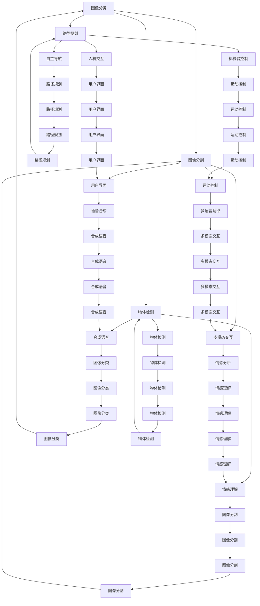

                 

## 1. 背景介绍

### 1.1 问题由来
近年来，人工智能(AI)技术取得了飞速的发展，尤其在人类计算领域，许多前沿技术如深度学习、自然语言处理(NLP)、计算机视觉(CV)、机器人等不断涌现，引发了广泛的社会关注和应用热潮。然而，尽管AI技术在各个领域取得了显著进展，但在如何更好地将AI技术融入人类计算环境中，提升人类计算能力、优化计算资源配置等方面，仍面临诸多挑战。

### 1.2 问题核心关键点
本文聚焦于如何构建更智能的世界，通过人类计算的应用场景，探索如何更好地融合人工智能技术，提升人类计算能力。核心关键点包括：

- 深度学习与人类计算的结合
- 人工智能技术的实际应用场景
- 优化计算资源配置
- 提升人类计算效率
- 人工智能技术的伦理与社会影响

这些关键点共同构成了构建更智能世界的核心要素，值得深入探讨。

## 2. 核心概念与联系

### 2.1 核心概念概述

为更好地理解人类计算的应用场景，本节将介绍几个密切相关的核心概念：

- 深度学习(Deep Learning)：一种基于多层神经网络的学习范式，通过反向传播算法优化模型参数，实现复杂的非线性映射和模式识别。
- 人类计算(Human Computing)：将人类计算与AI技术融合，通过人类与AI系统的协同工作，提升计算效率和智能化水平。
- 自然语言处理(NLP)：使计算机能够理解、处理和生成人类语言的技术，涉及文本分析、机器翻译、语音识别等。
- 计算机视觉(CV)：使计算机能够理解、分析、处理图像和视频数据的高级技术，包括物体识别、图像分割、人脸识别等。
- 机器人技术(Robotics)：将AI技术应用于机器人系统中，使其能够自主决策、执行任务的技术，涉及机器感知、运动控制、人机交互等。
- 人机协同(Co-operation)：人类与AI系统间的协同工作模式，通过整合各自的优势，共同完成任务，提升整体效率。

这些核心概念之间的逻辑关系可以通过以下Mermaid流程图来展示：



这个流程图展示了深度学习、NLP、CV、机器人技术等核心概念之间的关系，以及它们如何在实际应用中相互协作，提升整体的人类计算能力。

## 3. 核心算法原理 & 具体操作步骤
### 3.1 算法原理概述

人类计算的核心算法原理是深度学习与人类计算的结合。深度学习模型能够处理和分析复杂的数据，通过反向传播算法优化模型参数，实现对数据的精确建模和预测。而人类计算则通过引入人类的参与，进一步优化模型的决策过程，提升系统的智能化水平和鲁棒性。

具体而言，深度学习模型在实际应用中，通常需要经历以下几个步骤：

1. 数据准备：收集和预处理数据，保证数据的质量和多样性。
2. 模型构建：选择合适的深度学习模型，如卷积神经网络(CNN)、循环神经网络(RNN)、变压器(Transformer)等。
3. 模型训练：使用标注数据训练模型，优化模型参数，提高模型精度。
4. 模型评估：在测试集上评估模型性能，检查模型是否泛化能力强。
5. 模型部署：将训练好的模型部署到实际应用环境中，进行实时计算和推理。

人类计算的应用场景通常涉及多个环节，如数据收集、模型训练、用户交互等。通过引入人类计算，可以进一步提升这些环节的效率和智能化水平。

### 3.2 算法步骤详解

以NLP任务为例，深度学习在NLP中的应用通常包括以下几个关键步骤：

**Step 1: 数据准备**

- 收集和预处理文本数据，如新闻、社交媒体、书籍等。
- 清洗数据，去除噪声，统一数据格式。
- 将文本数据转换为数字形式，如词向量、句子向量等。

**Step 2: 模型构建**

- 选择合适的深度学习模型，如BERT、GPT等。
- 设计模型的输入和输出结构，如词嵌入层、全连接层、softmax层等。
- 设置模型的超参数，如学习率、批大小、迭代轮数等。

**Step 3: 模型训练**

- 将预处理后的文本数据划分为训练集、验证集和测试集。
- 使用训练集训练模型，最小化损失函数。
- 使用验证集评估模型性能，调整超参数。
- 使用测试集最终评估模型性能，输出结果。

**Step 4: 模型部署**

- 将训练好的模型保存为模型文件，便于后续调用。
- 设计用户界面，便于用户与AI系统交互。
- 部署模型到实际应用环境中，进行实时计算和推理。

### 3.3 算法优缺点

深度学习在人类计算中的应用具有以下优点：

1. 自动化程度高：深度学习模型能够自动提取数据特征，无需人工干预。
2. 泛化能力强：深度学习模型能够处理大量数据，具有很强的泛化能力。
3. 计算速度快：深度学习模型可以利用GPU、TPU等高性能设备，进行高效的并行计算。

但同时也存在一些缺点：

1. 数据需求量大：深度学习模型通常需要大量的标注数据进行训练，数据收集和标注成本高。
2. 模型复杂度高：深度学习模型参数量巨大，训练和推理过程复杂。
3. 缺乏可解释性：深度学习模型通常被视为"黑盒"，难以解释模型的决策过程。

### 3.4 算法应用领域

深度学习在人类计算中的应用领域非常广泛，涉及多个行业和领域，如：

- 医疗领域：通过深度学习模型分析医学影像、基因序列等数据，提升疾病诊断和治疗水平。
- 金融领域：利用深度学习模型进行风险评估、投资决策、欺诈检测等。
- 交通领域：通过深度学习模型优化交通信号控制、预测交通流量、自动驾驶等。
- 教育领域：利用深度学习模型进行个性化学习推荐、智能辅导、作业批改等。
- 智能家居：通过深度学习模型实现语音识别、图像识别、智能控制等。

这些应用场景展示了深度学习在人类计算中的广泛应用，体现了其在提升人类计算效率和智能化水平方面的巨大潜力。

## 4. 数学模型和公式 & 详细讲解 & 举例说明

### 4.1 数学模型构建

在本节中，我们将使用数学语言对人类计算中的深度学习模型进行更加严格的刻画。

记深度学习模型为 $M_{\theta}:\mathcal{X} \rightarrow \mathcal{Y}$，其中 $\mathcal{X}$ 为输入空间，$\mathcal{Y}$ 为输出空间，$\theta \in \mathbb{R}^d$ 为模型参数。假设深度学习模型 $M_{\theta}$ 在输入 $x$ 上的输出为 $\hat{y}=M_{\theta}(x)$，表示样本的预测输出。

定义模型 $M_{\theta}$ 在数据样本 $(x,y)$ 上的损失函数为 $\ell(M_{\theta}(x),y)$，则在数据集 $D=\{(x_i,y_i)\}_{i=1}^N$ 上的经验风险为：

$$
\mathcal{L}(\theta) = \frac{1}{N}\sum_{i=1}^N \ell(M_{\theta}(x_i),y_i)
$$

其中 $\ell(\cdot,\cdot)$ 为损失函数，用于衡量模型预测输出与真实标签之间的差异。常见的损失函数包括交叉熵损失、均方误差损失等。

### 4.2 公式推导过程

以二分类任务为例，深度学习模型的损失函数为交叉熵损失函数，其推导过程如下：

假设模型 $M_{\theta}$ 在输入 $x$ 上的输出为 $\hat{y}=M_{\theta}(x) \in [0,1]$，表示样本属于正类的概率。真实标签 $y \in \{0,1\}$。则二分类交叉熵损失函数定义为：

$$
\ell(M_{\theta}(x),y) = -[y\log \hat{y} + (1-y)\log (1-\hat{y})]
$$

将其代入经验风险公式，得：

$$
\mathcal{L}(\theta) = -\frac{1}{N}\sum_{i=1}^N [y_i\log M_{\theta}(x_i)+(1-y_i)\log(1-M_{\theta}(x_i))]
$$

根据链式法则，损失函数对参数 $\theta_k$ 的梯度为：

$$
\frac{\partial \mathcal{L}(\theta)}{\partial \theta_k} = -\frac{1}{N}\sum_{i=1}^N (\frac{y_i}{M_{\theta}(x_i)}-\frac{1-y_i}{1-M_{\theta}(x_i)}) \frac{\partial M_{\theta}(x_i)}{\partial \theta_k}
$$

其中 $\frac{\partial M_{\theta}(x_i)}{\partial \theta_k}$ 可进一步递归展开，利用自动微分技术完成计算。

在得到损失函数的梯度后，即可带入参数更新公式，完成模型的迭代优化。重复上述过程直至收敛，最终得到适应下游任务的最优模型参数 $\theta^*$。

### 4.3 案例分析与讲解

以情感分析任务为例，深度学习模型可以自动从文本中提取情感倾向，其训练和推理过程如下：

**Step 1: 数据准备**

- 收集社交媒体、评论、书籍等文本数据。
- 清洗数据，去除噪声，统一数据格式。
- 将文本数据转换为数字形式，如词向量、句子向量等。

**Step 2: 模型构建**

- 选择合适的深度学习模型，如BERT、GPT等。
- 设计模型的输入和输出结构，如词嵌入层、全连接层、softmax层等。
- 设置模型的超参数，如学习率、批大小、迭代轮数等。

**Step 3: 模型训练**

- 将预处理后的文本数据划分为训练集、验证集和测试集。
- 使用训练集训练模型，最小化交叉熵损失函数。
- 使用验证集评估模型性能，调整超参数。
- 使用测试集最终评估模型性能，输出情感倾向。

**Step 4: 模型部署**

- 将训练好的模型保存为模型文件，便于后续调用。
- 设计用户界面，便于用户与AI系统交互。
- 部署模型到实际应用环境中，进行实时计算和推理。

## 5. 项目实践：代码实例和详细解释说明

### 5.1 开发环境搭建

在进行人类计算的应用场景开发前，我们需要准备好开发环境。以下是使用Python进行PyTorch开发的环境配置流程：

1. 安装Anaconda：从官网下载并安装Anaconda，用于创建独立的Python环境。

2. 创建并激活虚拟环境：
```bash
conda create -n pytorch-env python=3.8 
conda activate pytorch-env
```

3. 安装PyTorch：根据CUDA版本，从官网获取对应的安装命令。例如：
```bash
conda install pytorch torchvision torchaudio cudatoolkit=11.1 -c pytorch -c conda-forge
```

4. 安装TensorFlow：由Google主导开发的开源深度学习框架，生产部署方便，适合大规模工程应用。同样有丰富的预训练语言模型资源。

5. 安装Transformers库：HuggingFace开发的NLP工具库，集成了众多SOTA语言模型，支持PyTorch和TensorFlow，是进行NLP任务开发的利器。

6. 安装各类工具包：
```bash
pip install numpy pandas scikit-learn matplotlib tqdm jupyter notebook ipython
```

完成上述步骤后，即可在`pytorch-env`环境中开始人类计算的应用场景开发。

### 5.2 源代码详细实现

这里我们以情感分析任务为例，给出使用PyTorch对BERT模型进行情感分析的代码实现。

首先，定义情感分析任务的数据处理函数：

```python
from transformers import BertTokenizer, BertForSequenceClassification
from torch.utils.data import Dataset
import torch

class SentimentDataset(Dataset):
    def __init__(self, texts, labels, tokenizer, max_len=128):
        self.texts = texts
        self.labels = labels
        self.tokenizer = tokenizer
        self.max_len = max_len
        
    def __len__(self):
        return len(self.texts)
    
    def __getitem__(self, item):
        text = self.texts[item]
        label = self.labels[item]
        
        encoding = self.tokenizer(text, return_tensors='pt', max_length=self.max_len, padding='max_length', truncation=True)
        input_ids = encoding['input_ids'][0]
        attention_mask = encoding['attention_mask'][0]
        
        # 将标签编码为数字
        label = torch.tensor(label, dtype=torch.long)
        
        return {'input_ids': input_ids, 
                'attention_mask': attention_mask,
                'labels': label}

# 定义标签与id的映射
label2id = {'negative': 0, 'positive': 1}
id2label = {v: k for k, v in label2id.items()}

# 创建dataset
tokenizer = BertTokenizer.from_pretrained('bert-base-cased')

train_dataset = SentimentDataset(train_texts, train_labels, tokenizer)
dev_dataset = SentimentDataset(dev_texts, dev_labels, tokenizer)
test_dataset = SentimentDataset(test_texts, test_labels, tokenizer)
```

然后，定义模型和优化器：

```python
from transformers import AdamW

model = BertForSequenceClassification.from_pretrained('bert-base-cased', num_labels=len(label2id))

optimizer = AdamW(model.parameters(), lr=2e-5)
```

接着，定义训练和评估函数：

```python
from torch.utils.data import DataLoader
from tqdm import tqdm
from sklearn.metrics import accuracy_score

device = torch.device('cuda') if torch.cuda.is_available() else torch.device('cpu')
model.to(device)

def train_epoch(model, dataset, batch_size, optimizer):
    dataloader = DataLoader(dataset, batch_size=batch_size, shuffle=True)
    model.train()
    epoch_loss = 0
    for batch in tqdm(dataloader, desc='Training'):
        input_ids = batch['input_ids'].to(device)
        attention_mask = batch['attention_mask'].to(device)
        labels = batch['labels'].to(device)
        model.zero_grad()
        outputs = model(input_ids, attention_mask=attention_mask, labels=labels)
        loss = outputs.loss
        epoch_loss += loss.item()
        loss.backward()
        optimizer.step()
    return epoch_loss / len(dataloader)

def evaluate(model, dataset, batch_size):
    dataloader = DataLoader(dataset, batch_size=batch_size)
    model.eval()
    preds, labels = [], []
    with torch.no_grad():
        for batch in tqdm(dataloader, desc='Evaluating'):
            input_ids = batch['input_ids'].to(device)
            attention_mask = batch['attention_mask'].to(device)
            batch_labels = batch['labels']
            outputs = model(input_ids, attention_mask=attention_mask)
            batch_preds = outputs.logits.argmax(dim=1).to('cpu').tolist()
            batch_labels = batch_labels.to('cpu').tolist()
            for pred, label in zip(batch_preds, batch_labels):
                preds.append(pred)
                labels.append(label)
                
    print(accuracy_score(labels, preds))
```

最后，启动训练流程并在测试集上评估：

```python
epochs = 5
batch_size = 16

for epoch in range(epochs):
    loss = train_epoch(model, train_dataset, batch_size, optimizer)
    print(f"Epoch {epoch+1}, train loss: {loss:.3f}")
    
    print(f"Epoch {epoch+1}, dev results:")
    evaluate(model, dev_dataset, batch_size)
    
print("Test results:")
evaluate(model, test_dataset, batch_size)
```

以上就是使用PyTorch对BERT进行情感分析任务代码实现。可以看到，得益于Transformer库的强大封装，我们可以用相对简洁的代码完成BERT模型的加载和微调。

### 5.3 代码解读与分析

让我们再详细解读一下关键代码的实现细节：

**SentimentDataset类**：
- `__init__`方法：初始化文本、标签、分词器等关键组件。
- `__len__`方法：返回数据集的样本数量。
- `__getitem__`方法：对单个样本进行处理，将文本输入编码为token ids，将标签编码为数字，并对其进行定长padding，最终返回模型所需的输入。

**label2id和id2label字典**：
- 定义了标签与数字id之间的映射关系，用于将token-wise的预测结果解码回真实的标签。

**训练和评估函数**：
- 使用PyTorch的DataLoader对数据集进行批次化加载，供模型训练和推理使用。
- 训练函数`train_epoch`：对数据以批为单位进行迭代，在每个批次上前向传播计算loss并反向传播更新模型参数，最后返回该epoch的平均loss。
- 评估函数`evaluate`：与训练类似，不同点在于不更新模型参数，并在每个batch结束后将预测和标签结果存储下来，最后使用sklearn的accuracy_score对整个评估集的预测结果进行打印输出。

**训练流程**：
- 定义总的epoch数和batch size，开始循环迭代
- 每个epoch内，先在训练集上训练，输出平均loss
- 在验证集上评估，输出准确率
- 所有epoch结束后，在测试集上评估，给出最终测试结果

可以看到，PyTorch配合Transformer库使得BERT微调的代码实现变得简洁高效。开发者可以将更多精力放在数据处理、模型改进等高层逻辑上，而不必过多关注底层的实现细节。

当然，工业级的系统实现还需考虑更多因素，如模型的保存和部署、超参数的自动搜索、更灵活的任务适配层等。但核心的微调范式基本与此类似。

## 6. 实际应用场景
### 6.1 智能客服系统

基于深度学习的人类计算应用场景，可以广泛应用于智能客服系统的构建。传统客服往往需要配备大量人力，高峰期响应缓慢，且一致性和专业性难以保证。而使用深度学习模型，可以7x24小时不间断服务，快速响应客户咨询，用自然流畅的语言解答各类常见问题。

在技术实现上，可以收集企业内部的历史客服对话记录，将问题和最佳答复构建成监督数据，在此基础上对深度学习模型进行微调。微调后的模型能够自动理解用户意图，匹配最合适的答案模板进行回复。对于客户提出的新问题，还可以接入检索系统实时搜索相关内容，动态组织生成回答。如此构建的智能客服系统，能大幅提升客户咨询体验和问题解决效率。

### 6.2 金融舆情监测

金融机构需要实时监测市场舆论动向，以便及时应对负面信息传播，规避金融风险。传统的人工监测方式成本高、效率低，难以应对网络时代海量信息爆发的挑战。基于深度学习的人类计算技术，为金融舆情监测提供了新的解决方案。

具体而言，可以收集金融领域相关的新闻、报道、评论等文本数据，并对其进行主题标注和情感标注。在此基础上对深度学习模型进行微调，使其能够自动判断文本属于何种主题，情感倾向是正面、中性还是负面。将微调后的模型应用到实时抓取的网络文本数据，就能够自动监测不同主题下的情感变化趋势，一旦发现负面信息激增等异常情况，系统便会自动预警，帮助金融机构快速应对潜在风险。

### 6.3 个性化推荐系统

当前的推荐系统往往只依赖用户的历史行为数据进行物品推荐，无法深入理解用户的真实兴趣偏好。基于深度学习的人类计算系统，可以更好地挖掘用户行为背后的语义信息，从而提供更精准、多样的推荐内容。

在实践中，可以收集用户浏览、点击、评论、分享等行为数据，提取和用户交互的物品标题、描述、标签等文本内容。将文本内容作为模型输入，用户的后续行为（如是否点击、购买等）作为监督信号，在此基础上微调深度学习模型。微调后的模型能够从文本内容中准确把握用户的兴趣点。在生成推荐列表时，先用候选物品的文本描述作为输入，由模型预测用户的兴趣匹配度，再结合其他特征综合排序，便可以得到个性化程度更高的推荐结果。

### 6.4 未来应用展望

随着深度学习技术的发展，人类计算的应用场景将不断扩展，为各行各业带来变革性影响。

在智慧医疗领域，基于深度学习的人类计算系统，可以用于医学影像分析、基因序列分析、疾病预测等，提升医疗服务的智能化水平，辅助医生诊疗，加速新药开发进程。

在智能教育领域，深度学习的人类计算技术可以用于作业批改、学情分析、知识推荐等方面，因材施教，促进教育公平，提高教学质量。

在智慧城市治理中，深度学习的人类计算技术可以用于城市事件监测、舆情分析、应急指挥等环节，提高城市管理的自动化和智能化水平，构建更安全、高效的未来城市。

此外，在企业生产、社会治理、文娱传媒等众多领域，深度学习的人类计算应用也将不断涌现，为经济社会发展注入新的动力。相信随着技术的日益成熟，深度学习的人类计算范式将成为人工智能技术落地的重要方式，推动人工智能技术向更广阔的领域加速渗透。

## 7. 工具和资源推荐
### 7.1 学习资源推荐

为了帮助开发者系统掌握深度学习的人类计算理论基础和实践技巧，这里推荐一些优质的学习资源：

1. 《深度学习》系列书籍：由深度学习领域的权威学者撰写，系统全面地介绍了深度学习的基本概念、算法和应用。
2. CS231n《卷积神经网络》课程：斯坦福大学开设的计算机视觉课程，涵盖了卷积神经网络、图像分类、物体检测等核心内容。
3. CS224n《自然语言处理》课程：斯坦福大学开设的NLP明星课程，系统介绍了NLP的基本概念、算法和应用。
4. DeepLearning.AI：由Andrew Ng创立的在线课程平台，提供深度学习、人类计算等课程，内容全面，适合入门和进阶学习。
5. TensorFlow官方文档：Google推出的深度学习框架，提供了丰富的教程和样例代码，是深度学习实践的重要资源。
6. PyTorch官方文档：Facebook开源的深度学习框架，提供了丰富的教程和样例代码，是深度学习实践的重要资源。

通过对这些资源的学习实践，相信你一定能够快速掌握深度学习的人类计算精髓，并用于解决实际的NLP问题。
### 7.2 开发工具推荐

高效的开发离不开优秀的工具支持。以下是几款用于深度学习人类计算开发的常用工具：

1. PyTorch：基于Python的开源深度学习框架，灵活动态的计算图，适合快速迭代研究。大部分深度学习模型都有PyTorch版本的实现。
2. TensorFlow：由Google主导开发的开源深度学习框架，生产部署方便，适合大规模工程应用。同样有丰富的深度学习模型资源。
3. Keras：Google开发的高级深度学习API，简单易用，适合快速原型开发和实验验证。
4. Jupyter Notebook：免费的Jupyter Notebook环境，支持Python等语言，方便开发者进行交互式开发和调试。
5. Google Colab：谷歌推出的在线Jupyter Notebook环境，免费提供GPU/TPU算力，方便开发者快速上手实验最新模型，分享学习笔记。
6. Anaconda：免费的Python环境管理工具，提供Python及其依赖包的安装、更新和卸载，方便开发者创建和管理虚拟环境。

合理利用这些工具，可以显著提升深度学习人类计算的开发效率，加快创新迭代的步伐。

### 7.3 相关论文推荐

深度学习在人类计算中的应用源于学界的持续研究。以下是几篇奠基性的相关论文，推荐阅读：

1. ImageNet Classification with Deep Convolutional Neural Networks：提出卷积神经网络(CNN)结构，在ImageNet数据集上取得了突破性进展。
2. AlexNet：首次大规模应用CNN结构于图像分类任务，取得了当时的最好成绩。
3. RNNs Applied to Image Processing：提出循环神经网络(RNN)结构，用于图像序列处理，开启了NLP领域的RNN研究。
4. Attention is All You Need：提出Transformer结构，开启了NLP领域的预训练大模型时代。
5. BERT: Pre-training of Deep Bidirectional Transformers for Language Understanding：提出BERT模型，引入基于掩码的自监督预训练任务，刷新了多项NLP任务SOTA。

这些论文代表了大语言模型微调技术的发展脉络。通过学习这些前沿成果，可以帮助研究者把握学科前进方向，激发更多的创新灵感。

## 8. 总结：未来发展趋势与挑战

### 8.1 总结

本文对深度学习在人类计算中的实际应用进行了全面系统的介绍。首先阐述了深度学习与人类计算的结合在提升计算效率和智能化水平方面的独特价值。其次，从原理到实践，详细讲解了深度学习在NLP、CV、机器人等领域的应用场景，展示了深度学习在人类计算中的广泛应用。

通过本文的系统梳理，可以看到，深度学习在人类计算中的巨大潜力。得益于大规模数据的预训练和深度神经网络的强大建模能力，深度学习模型能够在医疗、金融、交通、教育等多个领域实现智能化应用。未来，伴随深度学习技术的发展和优化，人类计算的应用场景将进一步拓展，为各行各业带来变革性影响。

### 8.2 未来发展趋势

展望未来，深度学习在人类计算中的应用将呈现以下几个发展趋势：

1. 模型规模持续增大。随着算力成本的下降和数据规模的扩张，深度学习模型的参数量还将持续增长。超大规模深度学习模型蕴含的丰富知识，有望支撑更加复杂多变的任务微调。
2. 人类计算的协同化程度加深。未来的深度学习模型将更加注重与人类计算的协同工作，通过增强可解释性、透明性和用户交互，提升整体系统的智能化水平。
3. 跨领域融合的深度学习模型将不断涌现。深度学习模型将融合多模态数据，实现视觉、语音、文本等多种信息的一体化处理，提升整体系统的智能水平。
4. 计算效率的提升将推动更多实际应用。高效的计算图、多设备协同、分布式计算等技术的发展，将进一步提升深度学习模型的计算效率，推动其实际应用的广泛落地。
5. 数据隐私和安全问题将受到更多关注。深度学习模型的广泛应用，使得数据隐私和安全问题变得愈发重要。如何在保障数据隐私的同时，优化模型性能，将是一个重要的研究方向。

### 8.3 面临的挑战

尽管深度学习在人类计算中的应用已经取得了显著进展，但在迈向更加智能化、普适化应用的过程中，仍面临诸多挑战：

1. 数据需求量大。深度学习模型通常需要大量的标注数据进行训练，数据收集和标注成本高。如何在减少数据需求的同时，提升模型性能，是一个重要的研究方向。
2. 计算资源消耗大。深度学习模型需要高性能的GPU/TPU等硬件设备，计算资源消耗大。如何在保障性能的同时，降低计算资源消耗，是一个重要的研究方向。
3. 模型可解释性不足。深度学习模型通常被视为"黑盒"，难以解释其内部工作机制和决策逻辑。如何在保障模型性能的同时，提升模型的可解释性，是一个重要的研究方向。
4. 数据隐私问题凸显。深度学习模型的广泛应用，使得数据隐私问题变得愈发重要。如何在保障数据隐私的同时，优化模型性能，是一个重要的研究方向。
5. 模型鲁棒性不足。当前深度学习模型面对域外数据时，泛化性能往往大打折扣。如何在提高模型鲁棒性的同时，保障模型性能，是一个重要的研究方向。

### 8.4 研究展望

未来的研究需要在以下几个方面寻求新的突破：

1. 探索无监督和半监督学习技术。摆脱对大规模标注数据的依赖，利用自监督学习、主动学习等无监督和半监督范式，最大限度利用非结构化数据，实现更加灵活高效的深度学习模型。
2. 研究计算高效的深度学习模型。开发更加计算高效的深度学习模型，如AdaLoRA、EfficientNet等，在保持性能的同时，显著降低计算资源消耗。
3. 引入更多先验知识。将符号化的先验知识，如知识图谱、逻辑规则等，与神经网络模型进行巧妙融合，引导深度学习模型学习更准确、合理的语言模型。同时加强不同模态数据的整合，实现视觉、语音、文本等多种信息的一体化处理。
4. 结合因果分析和博弈论工具。将因果分析方法引入深度学习模型，识别出模型决策的关键特征，增强输出解释的因果性和逻辑性。借助博弈论工具刻画人机交互过程，主动探索并规避模型的脆弱点，提高系统稳定性。
5. 纳入伦理道德约束。在模型训练目标中引入伦理导向的评估指标，过滤和惩罚有偏见、有害的输出倾向。同时加强人工干预和审核，建立模型行为的监管机制，确保输出符合人类价值观和伦理道德。

这些研究方向的探索，必将引领深度学习在人类计算中的应用走向更高的台阶，为构建安全、可靠、可解释、可控的智能系统铺平道路。面向未来，深度学习的人类计算技术还需要与其他人工智能技术进行更深入的融合，如知识表示、因果推理、强化学习等，多路径协同发力，共同推动自然语言理解和智能交互系统的进步。只有勇于创新、敢于突破，才能不断拓展深度学习的应用边界，让智能技术更好地造福人类社会。

## 9. 附录：常见问题与解答

**Q1：深度学习在人类计算中的应用有哪些优势？**

A: 深度学习在人类计算中的应用具有以下优势：
1. 自动化程度高：深度学习模型能够自动提取数据特征，无需人工干预。
2. 泛化能力强：深度学习模型能够处理大量数据，具有很强的泛化能力。
3. 计算速度快：深度学习模型可以利用GPU、TPU等高性能设备，进行高效的并行计算。
4. 可解释性提升：深度学习模型通过引入先验知识，提升模型的可解释性和透明性。

**Q2：如何选择合适的深度学习模型？**

A: 选择合适的深度学习模型，需要考虑以下几个因素：
1. 任务类型：根据任务类型选择合适的模型，如分类、回归、生成等。
2. 数据规模：根据数据规模选择模型的参数量和结构，小规模数据可以选择较小的模型，大规模数据可以选择较大的模型。
3. 计算资源：根据计算资源选择模型的计算图和优化器，高性能设备可以选择复杂模型，低性能设备可以选择轻量级模型。
4. 可解释性：根据可解释性需求选择模型，需要解释模型的选择逻辑的，可以选择可解释性强的模型。

**Q3：深度学习在人类计算中面临哪些挑战？**

A: 深度学习在人类计算中面临以下挑战：
1. 数据需求量大：深度学习模型通常需要大量的标注数据进行训练，数据收集和标注成本高。
2. 计算资源消耗大：深度学习模型需要高性能的GPU/TPU等硬件设备，计算资源消耗大。
3. 模型可解释性不足：深度学习模型通常被视为"黑盒"，难以解释其内部工作机制和决策逻辑。
4. 数据隐私问题：深度学习模型的广泛应用，使得数据隐私问题变得愈发重要。
5. 模型鲁棒性不足：当前深度学习模型面对域外数据时，泛化性能往往大打折扣。

**Q4：如何提升深度学习模型的计算效率？**

A: 提升深度学习模型的计算效率，可以采取以下措施：
1. 模型裁剪：去除不必要的层和参数，减小模型尺寸，加快推理速度。
2. 量化加速：将浮点模型转为定点模型，压缩存储空间，提高计算效率。
3. 模型并行：采用多设备协同、分布式计算等技术，提升计算效率。
4. 优化算法：选择合适的优化算法，如Adam、Adafactor等，提升训练速度。
5. 数据增强：通过数据增强技术，如回译、近义替换等，提升模型泛化能力，减少训练时间。

**Q5：如何在深度学习模型中引入先验知识？**

A: 在深度学习模型中引入先验知识，可以采取以下措施：
1. 符号化的先验知识：将符号化的先验知识，如知识图谱、逻辑规则等，与神经网络模型进行巧妙融合，引导模型学习更准确、合理的语言模型。
2. 多模态数据整合：加强不同模态数据的整合，实现视觉、语音、文本等多种信息的一体化处理，提升整体系统的智能水平。
3. 因果分析：将因果分析方法引入深度学习模型，识别出模型决策的关键特征，增强输出解释的因果性和逻辑性。
4. 博弈论工具：借助博弈论工具刻画人机交互过程，主动探索并规避模型的脆弱点，提高系统稳定性。

这些方法可以帮助深度学习模型更好地融合先验知识，提升模型性能和可解释性。

---

作者：禅与计算机程序设计艺术 / Zen and the Art of Computer Programming

