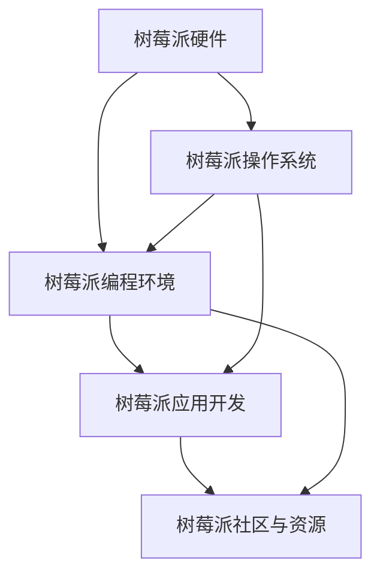

                 

# 树莓派开发：从入门到精通

## 1. 背景介绍

### 1.1 问题由来
树莓派（Raspberry Pi），一款专为教育与创新而设计的开源硬件，以其低成本、强大的性能、良好的扩展性、丰富的资源支持，迅速成为全球电子爱好者、教育工作者和初创企业不可或缺的开发平台。树莓派拥有从入门到专业级的多种型号，满足了不同层次的需求。

### 1.2 问题核心关键点
树莓派开发的核心理念在于“硬件+软件”协同设计，用户可以借助硬件平台进行各类软硬件开发与实验。初学者可以从树莓派的基础硬件和软件环境入手，逐步掌握树莓派的开发技能，并在实验与实践中不断深入学习。本文将围绕树莓派的硬件及软件配置、编程语言、应用开发等核心概念，为读者提供一套从入门到精通的树莓派开发指南。

### 1.3 问题研究意义
掌握树莓派开发技能，对于提升电子硬件编程能力、推动创新创业项目、普及电子科技知识具有重要意义。树莓派的应用范围广泛，包括智能家居、物联网、嵌入式系统、教育科技等诸多领域，是连接硬件和软件的桥梁。树莓派开发的应用前景广阔，深入研究树莓派开发技术，可以加速人工智能、物联网、智能制造等新兴技术的应用落地。

## 2. 核心概念与联系

### 2.1 核心概念概述

为更好地理解树莓派开发，本节将介绍几个密切相关的核心概念：

- **树莓派硬件**：包括多种型号的树莓派主板，支持多种IO接口，如USB、HDMI、GPIO等，具有硬件加速、通用串行总线等功能。
- **树莓派操作系统**：如Debian、Raspberry Pi OS等，支持多种编程语言和开发环境。
- **树莓派编程环境**：IDE、文本编辑器、编译器等工具，支持多种语言如Python、C/C++、Java等。
- **树莓派应用开发**：从驱动编写、设备操作到用户交互、服务端开发等，涵盖软硬件开发的各个层面。
- **树莓派社区与资源**：丰富的开发文档、教程、论坛、库包等，提供从入门到高级的多种学习路径。

这些核心概念之间的逻辑关系可以通过以下Mermaid流程图来展示：



这个流程图展示了几大核心概念及其之间的关系：

1. 树莓派硬件是树莓派开发的基础，为操作系统的运行提供物理平台。
2. 树莓派操作系统提供了软件运行环境，支持编程工具的安装和应用开发。
3. 树莓派编程环境提供了开发所需的工具，如IDE、编译器等。
4. 树莓派应用开发是实际应用的具体实现，包括硬件驱动、设备控制、用户交互等。
5. 树莓派社区与资源提供了学习与交流的平台，助力开发者成长。

这些概念共同构成了树莓派开发的完整框架，使开发者能够在树莓派平台上实现各类软硬件开发需求。

## 3. 核心算法原理 & 具体操作步骤

### 3.1 算法原理概述

树莓派开发的核心在于将树莓派硬件与软件结合，实现各种应用功能。从算法原理的角度，树莓派开发主要包括：

- **硬件抽象**：将树莓派硬件转换为软件层面的抽象模型，如设备树、驱动程序等。
- **软件编程**：在树莓派操作系统上，通过编译器、IDE等工具，对特定应用进行编程实现。
- **应用集成**：将编程结果集成到树莓派系统中，实现硬件与软件的协同工作。

### 3.2 算法步骤详解

树莓派开发的一般步骤包括：

1. **硬件配置与安装**：选择合适的树莓派硬件，安装对应的操作系统，连接外围设备如显示器、键盘、鼠标等。

2. **软件开发环境搭建**：安装必要的编程工具，如Python、C/C++编译器、IDE等，配置开发环境。

3. **编写与测试代码**：根据需求编写程序，进行单元测试、集成测试，确保程序正确无误。

4. **部署与调试**：将程序部署到树莓派系统中，通过日志、工具等手段进行调试，优化性能。

5. **应用集成与优化**：将程序集成到实际应用中，进行性能优化，确保稳定运行。

6. **文档编写与维护**：编写详细的文档，记录开发过程中的关键决策、问题解决、调试记录，方便后续维护与迭代。

### 3.3 算法优缺点

树莓派开发具有以下优点：

- **易入门**：树莓派硬件简单，操作系统易于上手，编程语言灵活，适合初学者快速入门。
- **资源丰富**：社区提供了丰富的文档、教程、库包等资源，有助于快速学习和解决问题。
- **应用广泛**：树莓派广泛应用于智能家居、物联网、教育科技等领域，有大量应用案例可供参考。

同时，树莓派开发也存在一些局限性：

- **性能限制**：树莓派硬件性能有限，不适合进行高性能计算、大数据处理等任务。
- **扩展性不足**：部分树莓派型号扩展性较差，不支持一些高阶硬件接口。
- **稳定性有待提升**：树莓派硬件易受环境因素影响，需要特别注意事项和措施。

### 3.4 算法应用领域

树莓派开发的应用领域广泛，以下是几个典型应用场景：

- **智能家居**：开发智能控制、远程监控等应用，如智能灯光、安全监控等。
- **物联网**：开发传感器、通信、数据处理等模块，实现远程控制和数据分析。
- **嵌入式开发**：开发嵌入式应用，如消费电子产品、工业设备、交通系统等。
- **教育科技**：开发互动教学、实验设备等，如虚拟实验室、智能教室等。
- **科学实验**：开发科学研究工具，如数据分析、图像处理、信号采集等。

以上领域仅仅是树莓派开发应用的一部分，随着树莓派硬件和技术的不断发展，未来在更多领域都会有新的应用。

## 4. 数学模型和公式 & 详细讲解 & 举例说明

### 4.1 数学模型构建

树莓派开发涉及的数学模型主要包括以下几个方面：

- **算法模型**：如树莓派操作系统调度算法、网络协议、数据结构等。
- **控制模型**：如电机控制、信号处理、传感器数据融合等。
- **优化模型**：如系统性能优化、能源管理等。

本节以树莓派控制电机为例，讲解如何建立和实现控制模型。

### 4.2 公式推导过程

树莓派控制电机通常涉及以下几个关键步骤：

1. **电机驱动模块的硬件连接**：连接树莓派的GPIO与电机驱动器。
2. **树莓派程序编写**：编写电机控制程序，实现电机的启动、停止、速度控制等。
3. **电机反馈采集**：采集电机的反馈信号，如转速、位置等。

以树莓派控制直流电机为例，推导电机控制程序的核心代码：

```python
import RPi.GPIO as GPIO
import time

# 初始化GPIO，设置引脚模式
GPIO.setmode(GPIO.BOARD)
GPIO.setup(4, GPIO.OUT)

# 电机控制程序
while True:
    GPIO.output(4, GPIO.LOW)  # 启动电机
    time.sleep(1)
    GPIO.output(4, GPIO.HIGH)  # 停止电机
    time.sleep(1)
```

### 4.3 案例分析与讲解

树莓派控制电机是树莓派开发中常见的应用场景，本例主要展示树莓派与电机驱动器的硬件连接、电机控制程序编写和电机反馈采集等步骤。

**硬件连接**：树莓派通过GPIO连接到电机驱动器，需要确保引脚连接正确。

**电机控制程序编写**：编写树莓派控制电机程序，设置电机引脚，通过GPIO输出控制信号，实现电机启动和停止。

**电机反馈采集**：通过传感器采集电机的转速和位置，实时监控电机状态。

## 5. 项目实践：代码实例和详细解释说明

### 5.1 开发环境搭建

进行树莓派开发，首先需要准备好开发环境，包括树莓派硬件和软件环境。

**树莓派硬件**：选购适合自身需求的树莓派硬件，连接外围设备。

**软件环境**：安装树莓派操作系统，如Debian、Raspberry Pi OS等，设置网络、用户等配置。

**开发工具**：安装Python、C/C++编译器、IDE等工具，配置开发环境。

### 5.2 源代码详细实现

以树莓派控制电机为例，展示树莓派程序开发流程。

1. **电机驱动模块的硬件连接**：连接树莓派的GPIO与电机驱动器。

2. **树莓派程序编写**：编写电机控制程序，实现电机的启动、停止、速度控制等。

3. **电机反馈采集**：采集电机的反馈信号，如转速、位置等。

4. **程序测试与调试**：编写测试程序，进行电机控制程序测试和调试。

5. **程序集成与优化**：将电机控制程序集成到树莓派系统中，进行性能优化。

### 5.3 代码解读与分析

**硬件连接**：树莓派通过GPIO连接到电机驱动器，需要确保引脚连接正确。

**电机控制程序编写**：编写树莓派控制电机程序，设置电机引脚，通过GPIO输出控制信号，实现电机启动和停止。

**电机反馈采集**：通过传感器采集电机的转速和位置，实时监控电机状态。

**程序测试与调试**：编写测试程序，进行电机控制程序测试和调试，确保程序正确无误。

**程序集成与优化**：将电机控制程序集成到树莓派系统中，进行性能优化，确保稳定运行。

### 5.4 运行结果展示

树莓派电机控制程序的运行结果如下：

1. 树莓派连接电机驱动器，成功控制电机启动和停止。
2. 树莓派程序成功采集电机的转速和位置信息，实时监控电机状态。
3. 树莓派电机控制程序在树莓派系统中稳定运行，实现了预期功能。

## 6. 实际应用场景

### 6.1 智能家居

树莓派在智能家居领域有着广泛的应用，可以开发智能控制、远程监控等应用。例如，开发智能灯光、智能门锁、智能温控器等设备，实现语音控制、手机远程控制、场景自动控制等功能。

### 6.2 物联网

树莓派可用于开发物联网应用，实现传感器、通信、数据处理等功能。例如，开发智能传感器、智能穿戴设备、智能家居控制系统等，实现远程数据采集、数据分析和智能决策。

### 6.3 嵌入式开发

树莓派可用于嵌入式开发，实现各类嵌入式应用。例如，开发消费电子产品、工业设备、交通系统等，实现数据采集、图像处理、信号采集等功能。

### 6.4 教育科技

树莓派可用于开发教育科技应用，实现互动教学、实验设备等功能。例如，开发虚拟实验室、智能教室、机器人控制器等，提供互动实验、科学实验、编程教学等功能。

### 6.5 科学实验

树莓派可用于开发科学研究工具，实现数据分析、图像处理、信号采集等功能。例如，开发图像识别系统、信号采集系统、数据处理系统等，进行科学实验和数据分析。

## 7. 工具和资源推荐

### 7.1 学习资源推荐

为帮助开发者系统掌握树莓派开发技能，这里推荐一些优质的学习资源：

1. **《树莓派开发指南》**：系统讲解树莓派的硬件、软件和编程环境，适合树莓派入门开发者阅读。

2. **《树莓派编程实践》**：深入介绍树莓派的开发实践，包括硬件连接、编程技巧、应用开发等，适合中高级开发者学习。

3. **树莓派官方文档**：详细介绍了树莓派的硬件、软件、开发环境等，是树莓派开发的重要参考。

4. **树莓派社区论坛**：汇聚了全球树莓派开发者的经验与讨论，提供了丰富的学习资源和技术支持。

5. **树莓派开源项目**：如树莓派操作系统、树莓派编程框架等，提供了丰富的开发库和工具，方便开发者快速开发。

### 7.2 开发工具推荐

高效的工具是树莓派开发的重要保障，以下是几款常用的开发工具：

1. **Python**：树莓派支持的多种编程语言，简单易用，灵活性强。

2. **树莓派IDE**：如PyCharm、IDLE等，提供了开发环境、调试工具等。

3. **树莓派编译器**：如GCC、CLion等，支持C/C++程序的编译和调试。

4. **树莓派库包管理器**：如APT、Pi Package Manager等，方便安装和管理树莓派软件包。

5. **树莓派仿真工具**：如QEMU、Virtual TreePi等，方便树莓派程序在模拟器上测试与调试。

### 7.3 相关论文推荐

树莓派开发涉及的技术领域广泛，以下是几篇有代表性的相关论文，推荐阅读：

1. **《树莓派操作系统设计》**：介绍了树莓派操作系统的设计与实现，提供了树莓派操作系统的底层理解。

2. **《树莓派嵌入式系统开发》**：介绍了树莓派嵌入式系统的开发实践，提供了树莓派嵌入式系统开发的全流程。

3. **《树莓派智能家居应用》**：介绍了树莓派在智能家居中的应用案例，提供了智能家居开发的具体实现方法。

4. **《树莓派物联网应用开发》**：介绍了树莓派在物联网中的应用案例，提供了物联网开发的具体实现方法。

5. **《树莓派教育科技应用开发》**：介绍了树莓派在教育科技中的应用案例，提供了教育科技开发的具体实现方法。

## 8. 总结：未来发展趋势与挑战

### 8.1 总结

本文对树莓派开发进行了全面系统的介绍。从树莓派的硬件与软件配置、编程语言、应用开发等方面，系统讲解了树莓派开发的各个环节。树莓派开发具有易入门、资源丰富、应用广泛等优点，但也存在硬件性能有限、扩展性不足等局限性。树莓派开发的应用领域广泛，涵盖智能家居、物联网、嵌入式开发、教育科技、科学实验等。

通过本文的系统梳理，可以看到，树莓派开发技能对于提升电子硬件编程能力、推动创新创业项目、普及电子科技知识具有重要意义。树莓派的应用前景广阔，随着硬件和技术的不断发展，未来在更多领域都会有新的应用。

### 8.2 未来发展趋势

展望未来，树莓派开发将呈现以下几个发展趋势：

1. **硬件性能提升**：树莓派硬件性能不断提升，支持更多高级功能，如高精度传感器、高速通信等，满足更高层次的开发需求。

2. **软件生态丰富**：树莓派操作系统和开发工具不断完善，提供更多库包和工具，支持更多编程语言和开发环境。

3. **应用场景扩展**：树莓派开发将进一步扩展到智能制造、智能农业、智慧交通等领域，推动更多领域的创新和变革。

4. **教育普及深入**：树莓派作为教育工具，将被更多学校和教育机构采用，培养更多电子科技人才。

5. **社区生态繁荣**：树莓派社区将更加活跃，提供更多学习资源和技术支持，促进开发者交流与合作。

以上趋势凸显了树莓派开发技术的广阔前景，为树莓派应用的广泛普及和深入开发提供了坚实的基础。

### 8.3 面临的挑战

尽管树莓派开发技术已经取得了显著进步，但在迈向更加智能化、普适化应用的过程中，仍面临诸多挑战：

1. **硬件性能瓶颈**：树莓派硬件性能有限，难以支持高性能计算和大数据处理等任务。

2. **软件生态不足**：部分树莓派型号软件生态不够完善，缺少必要的开发库和工具。

3. **系统稳定性问题**：树莓派硬件易受环境因素影响，系统稳定性需进一步提升。

4. **开发者门槛高**：树莓派开发涉及硬件、软件、编程等多个环节，初学者入门门槛较高。

5. **应用落地困难**：树莓派开发的应用场景需与具体业务场景结合，开发者需具备较强的业务理解和实际应用能力。

6. **资源支持不足**：树莓派开发资源相对有限，需开发者自行寻找和学习。

正视树莓派开发面临的这些挑战，积极应对并寻求突破，将有助于树莓派开发技术的成熟和普及。

### 8.4 研究展望

面对树莓派开发所面临的挑战，未来的研究需要在以下几个方面寻求新的突破：

1. **硬件性能优化**：开发新的树莓派硬件，提升硬件性能和扩展性，支持更多高级功能。

2. **软件生态完善**：完善树莓派操作系统和开发工具，提供更多库包和工具，支持更多编程语言和开发环境。

3. **系统稳定性提升**：提升树莓派硬件的稳定性和可靠性，优化系统设计，确保稳定运行。

4. **开发者门槛降低**：开发易于使用的开发工具和教程，降低开发者入门门槛，推动树莓派开发技术的普及。

5. **应用落地支持**：开发树莓派开发模板和框架，提供应用落地的具体方案和技术支持。

6. **资源支持增强**：建立更多的树莓派开发者社区和技术支持平台，提供更多的资源和学习机会。

这些研究方向的探索，将有助于树莓派开发技术的持续发展和广泛应用，为电子科技教育、创新创业项目、科学研究和产业化提供更强的技术支持。

## 9. 附录：常见问题与解答

**Q1：树莓派硬件和软件如何选择？**

A: 树莓派硬件和软件的选择应根据实际需求和技术水平来决定。初学者可以选择树莓派 Pi Zero W 等入门型号，而中高级开发者可以选择树莓派 Pi 3、Pi 4等高性能型号。选择操作系统时，建议选择最新的稳定版，如 Raspberry Pi OS。

**Q2：树莓派开发是否需要掌握硬件知识？**

A: 树莓派开发需要掌握一定的硬件知识，了解树莓派硬件的基本原理和接口连接。初学者可以从树莓派操作系统的硬件配置和外围设备开始学习，逐步深入硬件编程。

**Q3：树莓派编程语言有哪些？**

A: 树莓派支持的编程语言包括 Python、C/C++、Java、JavaScript 等。Python 是最常用的编程语言，因其简单易用，适合初学者入门。C/C++ 适合进行底层硬件编程和系统开发。Java 适合开发跨平台应用和网络应用。

**Q4：树莓派开发有哪些应用场景？**

A: 树莓派开发的应用场景广泛，包括智能家居、物联网、嵌入式开发、教育科技、科学实验等。开发人员应根据具体需求和兴趣，选择相应的应用场景进行开发。

**Q5：树莓派社区资源有哪些？**

A: 树莓派社区资源丰富，包括官方文档、开发者论坛、开源项目等。开发者可以通过树莓派官方网站和社区论坛获取更多学习资源和技术支持。

---

作者：禅与计算机程序设计艺术 / Zen and the Art of Computer Programming

