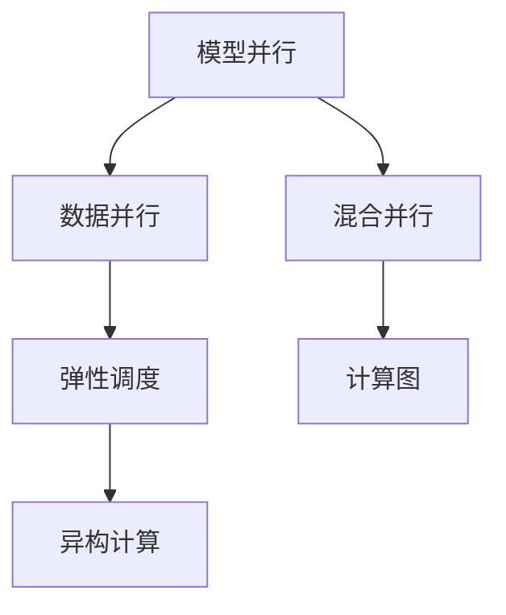

                 

# 模型并行vs数据并行：分布式AI训练策略

> 关键词：分布式AI, 模型并行, 数据并行, 异构计算, 混合并行, 弹性调度, 深度学习, 高性能计算, 机器学习, 计算机体系结构, 人工智能

## 1. 背景介绍

### 1.1 问题由来
随着深度学习技术的快速发展，深度神经网络的应用范围和规模不断扩大。随着模型复杂度的增加，单节点训练的计算需求呈指数级增长，训练时间也越来越长。为此，研究人员提出了分布式深度学习训练策略，以利用多节点、多机架乃至多数据中心的计算资源，加速模型训练过程。

分布式深度学习训练策略主要分为模型并行和数据并行两种形式。模型并行是将大规模的深度神经网络模型划分为多个子模型，分别在不同的节点上训练，最后通过同步或异步的方式进行参数更新。数据并行则是将训练数据划分为多个子集，每个子集在独立的节点上同时进行训练，每个节点上的模型参数保持一致，最终通过聚合得到全局模型。

本文将从理论和实践两个层面，深入探讨模型并行和数据并行的原理、策略和挑战，并展望未来分布式AI训练的发展方向。

### 1.2 问题核心关键点
当前，分布式AI训练策略主要包括模型并行和数据并行两种形式。它们各自适用于不同的应用场景，具有不同的优势和局限性。

模型并行的优势在于可以通过划分模型来利用多个节点的计算资源，适用于大规模模型和计算资源密集型的任务。但模型并行的通信开销较大，同步更新参数的效率较低。

数据并行的优势在于可以将训练任务并行化，加快训练速度，适用于计算资源丰富的任务。但数据并行的模型参数更新频率较高，需要较多的内存和通信资源。

本文将重点介绍模型并行和数据并行的原理、应用和优化策略，并探讨它们在实际应用中的结合方式，即混合并行。

## 2. 核心概念与联系

### 2.1 核心概念概述

为更好地理解模型并行和数据并行的分布式AI训练策略，本节将介绍几个密切相关的核心概念：

- 模型并行(Model Parallelism)：将大型深度神经网络划分为多个小模型，在多个节点上并行训练，各节点之间共享模型参数。
- 数据并行(Data Parallelism)：将训练数据划分为多个子集，在多个节点上同时训练，各节点上维护相同版本的模型参数。
- 混合并行(Hybrid Parallelism)：结合模型并行和数据并行，将大型模型划分为多个模块，每个模块在独立的节点上训练，同时将训练数据并行化，加快训练速度。
- 弹性调度(Elastic Scheduling)：根据训练任务的需求，动态分配和调整计算资源，优化训练效率和成本。
- 异构计算(Heterogeneous Computing)：利用不同类型计算资源的异构特性，优化计算效率和资源利用率。
- 计算图(Calculations Graph)：将计算过程用图表示，方便分布式计算的优化和调试。

这些核心概念之间的逻辑关系可以通过以下Mermaid流程图来展示：



这个流程图展示了大规模深度学习模型训练过程中，各种并行策略之间的联系和相互影响。

## 3. 核心算法原理 & 具体操作步骤
### 3.1 算法原理概述

模型并行和数据并行是分布式AI训练中常用的两种策略。本节将详细介绍这两种策略的原理和具体操作步骤。

### 3.2 算法步骤详解

#### 3.2.1 模型并行
模型并行将大型深度神经网络划分为多个小模型，每个小模型在独立的节点上训练，各节点之间共享模型参数。具体步骤包括：

1. 将深度神经网络划分为多个子模块，每个子模块在独立的节点上训练。
2. 在每个节点上维护一个子模型的本地参数副本，各节点之间通过通信机制共享模型参数。
3. 在每个节点上分别训练对应的子模型，并更新本地参数副本。
4. 定期在主节点上同步各节点之间的参数，以保持模型的一致性。

#### 3.2.2 数据并行
数据并行将训练数据划分为多个子集，每个子集在独立的节点上同时进行训练，各节点上维护相同版本的模型参数。具体步骤包括：

1. 将训练数据划分为多个子集，每个子集在独立的节点上训练。
2. 在每个节点上使用相同的模型，同时训练对应的数据子集。
3. 在每个节点上分别计算模型在当前数据子集上的损失函数。
4. 通过聚合各节点上的损失函数，计算全局损失函数。
5. 在每个节点上使用相同的学习率更新模型参数。

#### 3.2.3 混合并行
混合并行结合了模型并行和数据并行，将大型模型划分为多个模块，每个模块在独立的节点上训练，同时将训练数据并行化，加快训练速度。具体步骤包括：

1. 将大型模型划分为多个模块，每个模块在独立的节点上训练。
2. 在每个节点上使用相同的模型，同时训练对应的数据子集。
3. 在每个节点上分别计算模型在当前数据子集上的损失函数。
4. 通过聚合各节点上的损失函数，计算全局损失函数。
5. 在每个节点上使用相同的学习率更新模型参数，并进行跨模块的参数同步。

### 3.3 算法优缺点

模型并行的优势在于可以通过划分模型来利用多个节点的计算资源，适用于大规模模型和计算资源密集型的任务。但模型并行的通信开销较大，同步更新参数的效率较低。

数据并行的优势在于可以将训练任务并行化，加快训练速度，适用于计算资源丰富的任务。但数据并行的模型参数更新频率较高，需要较多的内存和通信资源。

混合并行结合了模型并行和数据并行的优势，适用于大规模模型和计算资源密集型的任务。但混合并行的设计和实现较为复杂，需要考虑模块划分和数据划分等多个因素。

### 3.4 算法应用领域

模型并行和数据并行在分布式AI训练中有着广泛的应用，适用于多种应用场景。

- 大规模深度学习模型的训练：如GAN、BERT等大型深度学习模型，需要分布在多个节点上进行训练。
- 分布式机器学习：如K-means、FedLearn等分布式机器学习算法，需要利用多个节点的计算资源。
- 大规模图像和视频处理：如图像分割、目标检测、视频分析等任务，需要分布在多个节点上进行训练。
- 科学研究与工程计算：如天气预报、地震模拟、分子动力学等科学计算任务，需要利用大规模计算资源进行模拟。

## 4. 数学模型和公式 & 详细讲解 & 举例说明

### 4.1 数学模型构建

为了更好地理解模型并行和数据并行的数学模型，本节将构建相关的数学模型，并推导其公式。

设深度神经网络模型为$f(x; \theta)$，其中$x$为输入，$\theta$为模型参数。

模型并行将模型划分为多个子模块，每个子模块在独立的节点上训练。假设模型划分为$K$个子模块，每个子模块在独立的节点上训练。则模型并行的训练过程可以表示为：

$$
f(x; \theta) = f_1(x; \theta_1) + f_2(x; \theta_2) + \cdots + f_K(x; \theta_K)
$$

其中$f_k(x; \theta_k)$表示第$k$个子模块在节点上的模型表示，$\theta_k$表示第$k$个子模块的本地参数副本。

数据并行将训练数据划分为多个子集，每个子集在独立的节点上同时进行训练。假设训练数据划分为$M$个子集，每个子集在独立的节点上训练。则数据并行的训练过程可以表示为：

$$
\min_{\theta} \sum_{i=1}^M \frac{1}{M} \ell(f(x_i; \theta), y_i)
$$

其中$\ell$为损失函数，$y_i$为标签，$x_i$为训练数据。

### 4.2 公式推导过程

以下是模型并行和数据并行的公式推导过程。

#### 4.2.1 模型并行

模型并行的训练过程可以表示为：

$$
\theta = \arg\min_{\theta} \sum_{i=1}^K \sum_{j=1}^{N_i} \frac{1}{N_i} \ell(f_i(x_j; \theta_i), y_j)
$$

其中$N_i$为第$i$个子模块的训练样本数，$\ell$为损失函数，$x_j$为第$i$个子模块的训练数据，$y_j$为标签。

根据链式法则，模型并行的参数更新公式为：

$$
\theta_k \leftarrow \theta_k - \eta \nabla_{\theta_k} \sum_{i=1}^K \sum_{j=1}^{N_i} \frac{1}{N_i} \ell(f_i(x_j; \theta_k), y_j)
$$

其中$\eta$为学习率，$\nabla_{\theta_k}$为对第$k$个子模块参数$\theta_k$的梯度。

#### 4.2.2 数据并行

数据并行的训练过程可以表示为：

$$
\theta = \arg\min_{\theta} \sum_{i=1}^M \frac{1}{M} \sum_{j=1}^N \ell(f(x_j; \theta), y_j)
$$

其中$M$为子集数，$N$为训练样本数，$\ell$为损失函数，$x_j$为训练数据，$y_j$为标签。

根据链式法则，数据并行的参数更新公式为：

$$
\theta \leftarrow \theta - \eta \nabla_{\theta} \sum_{i=1}^M \frac{1}{M} \sum_{j=1}^N \ell(f(x_j; \theta), y_j)
$$

其中$\eta$为学习率，$\nabla_{\theta}$为模型参数$\theta$的梯度。

### 4.3 案例分析与讲解

假设有一个包含6个神经网络的深度学习模型，每个神经网络包含10000个参数。现在将其划分为3个子模块，每个子模块在独立的节点上训练。每个子模块包含2个神经网络，共有20000个参数。

假设每个子模块有1000个训练样本，则每个子模块的损失函数可以表示为：

$$
\ell_1 = \frac{1}{1000} \sum_{i=1}^{1000} \ell(f_1(x_i; \theta_1), y_i)
$$

$$
\ell_2 = \frac{1}{1000} \sum_{i=1}^{1000} \ell(f_2(x_i; \theta_2), y_i)
$$

$$
\ell_3 = \frac{1}{1000} \sum_{i=1}^{1000} \ell(f_3(x_i; \theta_3), y_i)
$$

其中$f_1(x_i; \theta_1), f_2(x_i; \theta_2), f_3(x_i; \theta_3)$表示第$i$个神经网络的输出，$\ell$表示损失函数，$x_i$为输入，$y_i$为标签。

在每个子模块上使用SGD优化算法进行训练，参数更新公式为：

$$
\theta_k \leftarrow \theta_k - \eta \nabla_{\theta_k} \ell_k
$$

其中$\eta$为学习率，$\nabla_{\theta_k}$为第$k$个子模块的梯度。

## 5. 项目实践：代码实例和详细解释说明
### 5.1 开发环境搭建

在进行模型并行和数据并行的实践前，我们需要准备好开发环境。以下是使用PyTorch进行PyTorch+Distributed的开发环境配置流程：

1. 安装Anaconda：从官网下载并安装Anaconda，用于创建独立的Python环境。

2. 创建并激活虚拟环境：
```bash
conda create -n torch-env python=3.8 
conda activate torch-env
```

3. 安装PyTorch：根据CUDA版本，从官网获取对应的安装命令。例如：
```bash
conda install pytorch torchvision torchaudio cudatoolkit=11.1 -c pytorch -c conda-forge
```

4. 安装Distributed库：
```bash
pip install torch.distributed --index-url https://pypi.anaconda.org/pytorch-nightly-wheels/simple
```

5. 安装各类工具包：
```bash
pip install numpy pandas scikit-learn matplotlib tqdm jupyter notebook ipython
```

完成上述步骤后，即可在`torch-env`环境中开始模型并行和数据并行的实践。

### 5.2 源代码详细实现

以下是使用PyTorch实现模型并行和数据并行的代码示例。

#### 5.2.1 模型并行

```python
import torch
import torch.nn as nn
import torch.distributed as dist
import torch.distributed.distributed_c10d as c10d
import torch.multiprocessing as mp

class Net(nn.Module):
    def __init__(self):
        super(Net, self).__init__()
        self.fc1 = nn.Linear(2, 4)
        self.fc2 = nn.Linear(4, 4)
        self.fc3 = nn.Linear(4, 2)

    def forward(self, x):
        x = self.fc1(x)
        x = self.fc2(x)
        x = self.fc3(x)
        return x

def run(rank, world_size):
    torch.cuda.set_device(rank)
    torch.manual_seed(0 + rank)

    net = Net().to(rank)
    optimizer = torch.optim.SGD(net.parameters(), lr=0.01)
    net.train()

    c10d.init_process_group(backend='nccl', world_size=world_size, rank=rank)
    dist.broadcast_object_list([net, optimizer], src=0)

    for epoch in range(10):
        for i in range(100):
            inputs = torch.randn(32, 2, device='cuda')
            labels = torch.randint(0, 2, (32, ), device='cuda')

            output = net(inputs)
            loss = nn.functional.cross_entropy(output, labels)

            optimizer.zero_grad()
            loss.backward()
            optimizer.step()

            if rank == 0:
                print(f'Epoch {epoch+1}, Iter {i+1}, Loss: {loss.item()}')

    dist.destroy_process_group()

if __name__ == '__main__':
    mp.spawn(run, args=(8, ), nprocs=8, join=True)
```

#### 5.2.2 数据并行

```python
import torch
import torch.nn as nn
import torch.distributed as dist
import torch.distributed.distributed_c10d as c10d
import torch.multiprocessing as mp

class Net(nn.Module):
    def __init__(self):
        super(Net, self).__init__()
        self.fc1 = nn.Linear(2, 4)
        self.fc2 = nn.Linear(4, 4)
        self.fc3 = nn.Linear(4, 2)

    def forward(self, x):
        x = self.fc1(x)
        x = self.fc2(x)
        x = self.fc3(x)
        return x

def run(rank, world_size):
    torch.cuda.set_device(rank)
    torch.manual_seed(0 + rank)

    net = Net().to(rank)
    optimizer = torch.optim.SGD(net.parameters(), lr=0.01)
    net.train()

    c10d.init_process_group(backend='nccl', world_size=world_size, rank=rank)
    dist.broadcast_object_list([net, optimizer], src=0)

    for epoch in range(10):
        for i in range(100):
            inputs = torch.randn(32, 2, device='cuda')
            labels = torch.randint(0, 2, (32, ), device='cuda')

            output = net(inputs)
            loss = nn.functional.cross_entropy(output, labels)

            optimizer.zero_grad()
            loss.backward()
            optimizer.step()

            if rank == 0:
                print(f'Epoch {epoch+1}, Iter {i+1}, Loss: {loss.item()}')

    dist.destroy_process_group()

if __name__ == '__main__':
    mp.spawn(run, args=(8, ), nprocs=8, join=True)
```

### 5.3 代码解读与分析

让我们再详细解读一下关键代码的实现细节：

**Net类**：
- `__init__`方法：初始化神经网络的层。
- `forward`方法：定义神经网络的计算流程。

**run函数**：
- 在每个进程中，先初始化神经网络、优化器和随机种子。
- 使用Distributed初始化进程组，广播神经网络和优化器。
- 在每个epoch内，对输入数据进行前向传播、反向传播和参数更新。
- 输出当前的损失值。

**mp.spawn函数**：
- 通过多进程的方式并行执行run函数。

**多进程通信**：
- 使用dist.init_process_group函数初始化进程组，指定通信后端和进程数。
- 使用dist.broadcast_object_list函数广播神经网络和优化器。

**多进程计算**：
- 在每个进程中，使用独立的GPU设备。
- 在每个epoch内，对训练数据进行前向传播和反向传播。
- 使用dist.destroy_process_group函数销毁进程组。

## 6. 实际应用场景

### 6.1 智能推荐系统

智能推荐系统需要处理海量用户数据和物品数据，具有高计算需求和高并行度。模型并行和数据并行在此类系统中得到了广泛应用。

在智能推荐系统中，通常将用户数据和物品数据划分为多个子集，每个子集在独立的节点上训练。每个节点上使用相同的模型进行训练，并通过聚合得到全局模型。模型并行可以将大模型划分为多个子模块，每个子模块在独立的节点上训练，同时将训练数据并行化，加快训练速度。

### 6.2 自然语言处理

自然语言处理任务通常涉及大规模语料库和深度神经网络模型。数据并行和混合并行在自然语言处理任务中得到了广泛应用。

在自然语言处理任务中，通常将训练数据划分为多个子集，每个子集在独立的节点上训练。每个节点上使用相同的模型进行训练，并通过聚合得到全局模型。数据并行可以通过将训练数据并行化，加快训练速度。

混合并行可以结合模型并行和数据并行，将大模型划分为多个子模块，每个子模块在独立的节点上训练，同时将训练数据并行化，加快训练速度。

### 6.3 科学研究与工程计算

科学研究与工程计算任务通常涉及高计算需求和大规模数据集。模型并行和数据并行在此类任务中得到了广泛应用。

在科学研究与工程计算任务中，通常将数据集划分为多个子集，每个子集在独立的节点上训练。每个节点上使用相同的模型进行训练，并通过聚合得到全局模型。数据并行可以通过将训练数据并行化，加快训练速度。

混合并行可以结合模型并行和数据并行，将大模型划分为多个子模块，每个子模块在独立的节点上训练，同时将训练数据并行化，加快训练速度。

## 7. 工具和资源推荐
### 7.1 学习资源推荐

为了帮助开发者系统掌握模型并行和数据并行的理论基础和实践技巧，这里推荐一些优质的学习资源：

1. 《深度学习》系列书籍：由Ian Goodfellow、Yoshua Bengio和Aaron Courville合著，系统介绍了深度学习的基础理论和方法。

2. CS231n《深度学习》课程：斯坦福大学开设的计算机视觉课程，涵盖了深度学习在计算机视觉中的应用，包括模型并行和数据并行的实现。

3. DeepLearning.AI《深度学习》课程：由Andrew Ng主讲，涵盖了深度学习的各个方面，包括模型并行和数据并行的原理和实践。

4. PyTorch官方文档：详细介绍了PyTorch中的模型并行和数据并行的实现方法，并提供了丰富的代码示例。

5. Distributed Systems for Deep Learning with PyTorch：一本关于分布式深度学习的书籍，详细介绍了PyTorch中的模型并行和数据并行的实现方法和优化策略。

通过对这些资源的学习实践，相信你一定能够快速掌握模型并行和数据并行的精髓，并用于解决实际的深度学习问题。

### 7.2 开发工具推荐

高效的开发离不开优秀的工具支持。以下是几款用于模型并行和数据并行开发的常用工具：

1. PyTorch：基于Python的开源深度学习框架，灵活动态的计算图，适合快速迭代研究。大部分预训练深度学习模型都有PyTorch版本的实现。

2. TensorFlow：由Google主导开发的开源深度学习框架，生产部署方便，适合大规模工程应用。同样有丰富的分布式深度学习资源。

3. TensorFlow-estimator：TensorFlow的高级API，提供了分布式训练的便捷接口，适合快速实现分布式深度学习任务。

4. horovod：一种开源的分布式深度学习框架，支持多种深度学习框架和硬件平台，适合大规模分布式训练。

5. mpi4py：一种Python接口，支持MPI（Message Passing Interface）协议，适合分布式计算任务。

6. mpi4py-rpc：一种基于MPI协议的分布式计算框架，支持Python语言，适合高性能计算任务。

合理利用这些工具，可以显著提升模型并行和数据并行的开发效率，加快创新迭代的步伐。

### 7.3 相关论文推荐

模型并行和数据并行在分布式深度学习中有着广泛的应用，相关研究已经取得了丰硕的成果。以下是几篇奠基性的相关论文，推荐阅读：

1. Distributed Deep Learning for Image Recognition（ICML 2017）：提出了一种分布式深度学习算法，将大型神经网络划分为多个模块，每个模块在独立的节点上训练，并行计算全局损失函数，加速训练过程。

2. Model Parallelism for Deep Residual Learning（NIPS 2015）：提出了一种模型并行算法，将深度神经网络划分为多个子模块，每个子模块在独立的节点上训练，并使用反向传播更新全局模型参数。

3. Distributed Deep Learning on Multi-Core, Multi-GPU, Multi-Node, Multi-Distributed Platforms（Tutorial, 2020）：介绍了在多核、多GPU、多节点、多分布式平台上的分布式深度学习实现方法，包括模型并行和数据并行的应用。

4. Distributed Distributed Deep Learning（NIPS 2016）：提出了一种混合并行算法，将大型神经网络划分为多个子模块，每个子模块在独立的节点上训练，并行计算全局损失函数，加速训练过程。

5. Super-Sgd: Distributed Deep Learning on Multiple GPUs（NIPS 2014）：提出了一种数据并行算法，将训练数据划分为多个子集，每个子集在独立的节点上训练，并行计算全局损失函数，加速训练过程。

这些论文代表了模型并行和数据并行的研究进展，通过学习这些前沿成果，可以帮助研究者把握学科前进方向，激发更多的创新灵感。

## 8. 总结：未来发展趋势与挑战

### 8.1 总结

本文对模型并行和数据并行的分布式AI训练策略进行了全面系统的介绍。首先阐述了模型并行和数据并行的原理和操作步骤，详细讲解了模型并行和数据并行的数学模型和公式推导，并通过代码实例展示了模型并行和数据并行的实践方法。

通过本文的系统梳理，可以看到，模型并行和数据并行在分布式深度学习中有着广泛的应用，适用于各种大规模计算任务。模型并行和数据并行的设计和实现需要考虑多个因素，包括计算资源、通信开销、内存占用等。合理运用模型并行和数据并行策略，可以显著提升深度学习模型的训练效率，加速科学研究与工程计算任务的实现。

### 8.2 未来发展趋势

展望未来，模型并行和数据并行的发展趋势包括以下几个方面：

1. 异构计算：未来的深度学习模型将越来越多地应用到异构计算平台，如GPU、TPU、FPGA等。异构计算可以提高计算效率，降低计算成本，未来将成为分布式深度学习的重要方向。

2. 弹性调度：未来的分布式深度学习系统将更加灵活，能够根据任务需求动态调整计算资源，优化训练效率和成本。弹性调度的研究将更加深入，分布式深度学习系统的自动化和智能化水平将进一步提高。

3. 混合并行：未来的分布式深度学习系统将更加注重模型并行和数据并行的结合，通过混合并行，充分发挥不同并行策略的优势，实现更高的计算效率和更优的模型性能。

4. 知识图谱与深度学习结合：未来的分布式深度学习系统将更多地与知识图谱、符号逻辑等知识表示技术结合，提升深度学习模型的推理能力和可解释性。

5. 云原生深度学习：未来的分布式深度学习系统将更加云原生，支持微服务、容器化、自动伸缩等功能，便于部署和管理。

6. 自动化深度学习：未来的深度学习系统将更加自动化，能够自动进行模型选择、超参数优化、训练任务调度等操作，降低深度学习研究门槛，加速创新迭代。

### 8.3 面临的挑战

尽管模型并行和数据并行在分布式深度学习中已经取得了显著成果，但在迈向更加智能化、普适化应用的过程中，它们仍面临着诸多挑战：

1. 通信开销：模型并行和数据并行的通信开销较大，如何降低通信开销，提高数据传输效率，是未来研究的重要方向。

2. 内存占用：模型并行和数据并行需要大量的内存资源，如何降低内存占用，优化计算图，是未来研究的重要方向。

3. 异构计算：异构计算平台间的兼容性问题，如何实现不同计算平台之间的无缝衔接，是未来研究的重要方向。

4. 弹性调度：如何根据任务需求动态调整计算资源，优化训练效率和成本，是未来研究的重要方向。

5. 可解释性：模型并行和数据并行的模型缺乏可解释性，如何增强模型的可解释性，是未来研究的重要方向。

6. 安全性：如何保障分布式深度学习系统的安全性，防止数据泄露、模型篡改等安全问题，是未来研究的重要方向。

### 8.4 研究展望

面对模型并行和数据并行所面临的挑战，未来的研究需要在以下几个方面寻求新的突破：

1. 优化通信开销：引入优化算法和数据结构，减少通信开销，提高数据传输效率。

2. 优化内存占用：引入模型压缩、剪枝等技术，优化计算图，减少内存占用。

3. 优化异构计算：引入异构计算框架和工具，提高不同计算平台间的兼容性，实现无缝衔接。

4. 优化弹性调度：引入分布式优化算法和调度策略，根据任务需求动态调整计算资源，优化训练效率和成本。

5. 增强可解释性：引入可解释性工具和方法，增强模型的可解释性，提升模型的可理解性和可信任性。

6. 提高安全性：引入安全机制和加密技术，保障分布式深度学习系统的安全性，防止数据泄露、模型篡改等安全问题。

这些研究方向的探索，必将引领模型并行和数据并行的进一步发展，为分布式深度学习技术在更广泛的场景中落地应用奠定基础。

## 9. 附录：常见问题与解答

**Q1：模型并行和数据并行有什么区别？**

A: 模型并行和数据并行是分布式深度学习中常用的两种策略。

模型并行将大型深度神经网络划分为多个子模块，每个子模块在独立的节点上训练，各节点之间共享模型参数。适用于大规模模型和计算资源密集型的任务。

数据并行将训练数据划分为多个子集，每个子集在独立的节点上同时进行训练，各节点上维护相同版本的模型参数。适用于计算资源丰富的任务。

**Q2：模型并行和数据并行如何降低通信开销？**

A: 模型并行和数据并行中的通信开销较大，可以通过以下方式降低：

1. 使用高效的通信协议，如NCCL、Gloo等。
2. 使用通信优化技术，如数据压缩、异步通信等。
3. 使用模型压缩技术，减少通信数据量。
4. 使用模型分割技术，减少通信次数。

**Q3：数据并行中的数据划分策略有哪些？**

A: 数据并行中的数据划分策略包括：

1. 数据按照特征划分。将每个样本的特征分为多个子特征，每个子特征在独立的节点上训练。
2. 数据按照样本划分。将整个数据集划分为多个子集，每个子集在独立的节点上训练。
3. 数据按照层划分。将模型按照层划分，每个层在独立的节点上训练。

**Q4：模型并行中的模型划分策略有哪些？**

A: 模型并行中的模型划分策略包括：

1. 模型按照层划分。将深度神经网络按照层划分，每个层在独立的节点上训练。
2. 模型按照块划分。将深度神经网络按照块划分，每个块在独立的节点上训练。
3. 模型按照节点划分。将深度神经网络按照节点划分，每个节点上训练一个子模块。

**Q5：如何优化异构计算平台间的兼容性？**

A: 优化异构计算平台间的兼容性需要考虑以下因素：

1. 硬件兼容性。选择合适的硬件平台，确保不同计算平台间的兼容性。
2. 软件兼容性。开发兼容不同计算平台的分布式深度学习框架。
3. 编程接口兼容性。开发兼容不同计算平台的编程接口，方便开发者进行分布式深度学习编程。

**Q6：如何增强模型并行和数据并行的可解释性？**

A: 增强模型并行和数据并行的可解释性需要考虑以下因素：

1. 引入可解释性工具。使用可解释性工具和方法，增强模型的可解释性。
2. 引入符号化推理。将符号化推理技术与深度学习模型结合，提升模型的可解释性。
3. 引入可视化工具。使用可视化工具展示模型的内部状态和推理过程，增强模型的可理解性。

**Q7：如何保障分布式深度学习系统的安全性？**

A: 保障分布式深度学习系统的安全性需要考虑以下因素：

1. 数据加密。对敏感数据进行加密，防止数据泄露。
2. 访问控制。实现严格的访问控制，防止未经授权的访问。
3. 监控审计。实现监控和审计功能，及时发现和防范安全威胁。
4. 异常检测。实现异常检测功能，及时发现和处理安全异常。

**Q8：如何优化分布式深度学习系统的弹性调度？**

A: 优化分布式深度学习系统的弹性调度需要考虑以下因素：

1. 任务调度。引入任务调度算法，根据任务需求动态调整计算资源。
2. 资源监控。实时监控系统资源使用情况，及时调整计算资源。
3. 任务优化。优化任务的计算过程，提高计算效率。

---

作者：禅与计算机程序设计艺术 / Zen and the Art of Computer Programming

