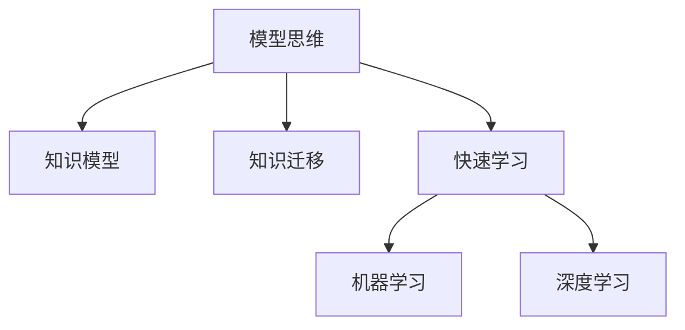

                 

# 模型思维:快速掌握新知识的捷径

> 关键词：模型思维,知识获取,知识迁移,快速学习,机器学习,深度学习

## 1. 背景介绍

### 1.1 问题由来
在当今这个信息爆炸的时代，新知识的产生速度远远超过了人类的学习和适应能力。传统的学习方式——通过阅读书籍、上课听讲等手段，已经难以满足快速变化的世界对个人和组织的需求。因此，寻找一种更加高效、便捷、系统的知识获取方式，成为了当前的热门话题。

模型思维作为一种新型知识获取策略，通过构建和应用知识模型，快速掌握新知识，解决复杂问题。这种思维方式不仅能够提升学习效率，还能培养创新能力，帮助个人和企业在大数据时代保持竞争力。

### 1.2 问题核心关键点
模型思维的核心在于通过构建和应用知识模型，快速获取和理解新知识。其核心思想是将知识结构化、抽象化，将复杂问题分解为可管理的子问题，并通过模型进行求解。这种思维方式适用于各类复杂问题，包括但不限于科学、工程、管理等领域。

### 1.3 问题研究意义
掌握模型思维，有助于个人和企业快速适应快速变化的环境，提升决策能力和创新水平。模型思维不仅能够提高知识获取效率，还能帮助人们更深入地理解问题本质，发现隐藏在数据背后的规律，从而做出更准确的预测和决策。

此外，模型思维还能促进知识共享和协作，通过构建共享模型，实现知识的广泛传播和应用。这对于促进科学研究和技术创新，推动社会进步具有重要意义。

## 2. 核心概念与联系

### 2.1 核心概念概述

为更好地理解模型思维，本节将介绍几个密切相关的核心概念：

- 模型思维(Modelling Mindset)：通过构建和应用知识模型，快速掌握新知识，解决复杂问题的思维方式。
- 知识模型(Knowledge Model)：将知识结构化、抽象化的表示，用于存储、传播和应用知识。
- 知识迁移(Knowledge Transfer)：将某一领域学到的知识迁移到另一领域，提升新领域的学习效率。
- 快速学习(Rapid Learning)：通过构建和应用模型，快速理解和应用新知识，提升学习效率。
- 机器学习(Machine Learning)：通过训练模型，从数据中自动提取规律，实现自动学习和决策。
- 深度学习(Deep Learning)：基于神经网络的机器学习技术，通过多层次处理，实现更高效的特征提取和模式识别。

这些核心概念之间的逻辑关系可以通过以下Mermaid流程图来展示：



这个流程图展示了一个典型的模型思维学习流程：

1. 从模型思维出发，通过构建知识模型来获取和理解新知识。
2. 将已学知识迁移到新领域，提升学习效率。
3. 借助快速学习技术，快速掌握新知识。
4. 通过机器学习和深度学习，自动提取数据中的规律，实现高效的知识应用。

## 3. 核心算法原理 & 具体操作步骤

### 3.1 算法原理概述

模型思维的核心算法原理包括以下几个步骤：

1. **知识建模**：将复杂问题抽象为数学模型，通过变量、方程和约束条件描述问题的内在规律。
2. **数据收集与预处理**：收集与问题相关的数据，并进行清洗、标准化等预处理操作。
3. **模型训练**：使用机器学习或深度学习算法，训练模型参数，使其能够根据输入数据进行预测或生成。
4. **模型评估与优化**：通过验证集或测试集对模型进行评估，调整模型参数以提升性能。
5. **知识应用**：将训练好的模型应用于实际问题，进行预测、决策等任务。

### 3.2 算法步骤详解

下面详细介绍模型思维的每个关键步骤：

**Step 1: 知识建模**

- **变量定义**：将问题中的关键因素抽象为变量，用符号表示。
- **方程建立**：根据问题的内在规律，建立一组方程或约束条件，描述变量之间的关系。
- **假设与简化**：对问题进行合理的假设和简化，避免过拟合和复杂度过高。

**Step 2: 数据收集与预处理**

- **数据收集**：收集与问题相关的数据，确保数据覆盖范围广、质量高。
- **数据清洗**：去除数据中的噪声和异常值，确保数据的准确性和一致性。
- **数据标准化**：对数据进行标准化处理，使不同特征之间的度量单位一致。

**Step 3: 模型训练**

- **选择合适的算法**：根据问题的性质和数据特点，选择合适的机器学习或深度学习算法。
- **设置模型参数**：设定模型的初始参数，如学习率、批量大小等，影响模型训练的效率和效果。
- **训练模型**：使用训练集数据，通过前向传播、损失函数计算、反向传播等步骤，更新模型参数，使模型能够准确预测新数据。

**Step 4: 模型评估与优化**

- **验证集评估**：使用验证集数据对模型进行评估，计算模型在验证集上的性能指标。
- **参数调整**：根据评估结果，调整模型参数，如学习率、正则化系数等，以提升模型性能。
- **模型选择**：比较不同模型的性能，选择最适合问题的模型。

**Step 5: 知识应用**

- **模型部署**：将训练好的模型部署到实际应用环境中，进行预测、决策等任务。
- **结果反馈**：收集模型的预测结果，进行验证和调整，不断优化模型性能。
- **持续改进**：定期收集新数据，对模型进行重新训练和优化，保持模型的时效性和准确性。

### 3.3 算法优缺点

模型思维作为一种知识获取策略，具有以下优点：

- **系统性和结构化**：通过构建知识模型，能够将复杂问题分解为可管理的子问题，提升问题解决的效率和准确性。
- **可复用性**：模型思维可以应用到多个领域和问题，提升知识迁移和复用的能力。
- **自动化与优化**：通过机器学习和深度学习算法，模型能够自动从数据中提取规律，提升知识应用的准确性和效率。
- **灵活性和扩展性**：模型思维可以根据问题的变化进行调整和优化，适应不同的应用场景。

同时，模型思维也存在一些局限性：

- **模型复杂度**：构建复杂的知识模型可能需要较多的时间和精力，对于初学者来说可能较为困难。
- **数据质量依赖**：模型的性能依赖于数据的质量和数量，如果数据不充分或不准确，模型效果可能不佳。
- **模型泛化能力**：模型需要在新的数据上保持稳定的性能，否则可能会出现泛化能力不足的问题。
- **模型解释性**：一些复杂的模型（如深度学习模型）可能难以解释其内部的决策过程，对模型理解和调试带来挑战。

尽管存在这些局限性，但就目前而言，模型思维仍然是一种高效、系统的知识获取策略，广泛应用于科学、工程、管理等领域，帮助人们快速掌握新知识，解决复杂问题。

### 3.4 算法应用领域

模型思维已经在多个领域得到了广泛应用，以下是几个典型的应用场景：

- **科学研究**：通过构建科学模型，快速掌握新知识和发现新规律。例如，天文学中的引力波模型、化学中的分子结构模型等。
- **工程设计**：通过构建工程模型，优化设计方案和提高产品性能。例如，航空航天中的飞行器设计模型、建筑工程中的结构优化模型等。
- **管理决策**：通过构建管理模型，优化决策过程和提升管理效率。例如，供应链管理中的库存控制模型、人力资源管理中的员工绩效评估模型等。
- **金融分析**：通过构建金融模型，预测市场走势和评估投资风险。例如，股票价格预测模型、信用风险评估模型等。
- **医疗诊断**：通过构建医学模型，辅助诊断和治疗疾病。例如，癌症诊断模型、药物效果评估模型等。

除了上述这些领域，模型思维还在更多实际应用场景中发挥作用，为不同行业带来显著效益。随着数据和计算技术的不断进步，模型思维的应用前景将更加广阔。

## 4. 数学模型和公式 & 详细讲解  
### 4.1 数学模型构建

本节将使用数学语言对模型思维的实现过程进行更加严格的刻画。

设问题为 $P$，变量为 $x_1, x_2, ..., x_n$，目标为 $y$，已知条件为 $c_1, c_2, ..., c_m$。问题 $P$ 可以表示为一个数学模型：

$$
\min_y f(x_1, x_2, ..., x_n, y) \\
\text{s.t.} \\
g_1(x_1, x_2, ..., x_n, y) = 0 \\
g_2(x_1, x_2, ..., x_n, y) \leq 0 \\
h_1(x_1, x_2, ..., x_n, y) = 0 \\
h_2(x_1, x_2, ..., x_n, y) \geq 0
$$

其中 $f$ 为目标函数，$g_i$ 和 $h_i$ 为约束条件。

### 4.2 公式推导过程

下面以线性规划问题为例，推导线性规划的数学模型和求解步骤：

设线性规划问题为：

$$
\min_c z = c_1x_1 + c_2x_2 + ... + c_nx_n \\
\text{s.t.} \\
a_{11}x_1 + a_{12}x_2 + ... + a_{1n}x_n = b_1 \\
a_{21}x_1 + a_{22}x_2 + ... + a_{2n}x_n = b_2 \\
... \\
a_{m1}x_1 + a_{m2}x_2 + ... + a_{mn}x_n = b_m \\
x_1, x_2, ..., x_n \geq 0
$$

可以将其转化为标准形式：

$$
\min_c z = c_1x_1 + c_2x_2 + ... + c_nx_n \\
\text{s.t.} \\
a_{11}x_1 + a_{12}x_2 + ... + a_{1n}x_n + s_1 = b_1 \\
a_{21}x_1 + a_{22}x_2 + ... + a_{2n}x_n + s_2 = b_2 \\
... \\
a_{m1}x_1 + a_{m2}x_2 + ... + a_{mn}x_n + s_m = b_m \\
x_1, x_2, ..., x_n, s_1, s_2, ..., s_m \geq 0
$$

其中 $s_i$ 为松弛变量，用于描述约束条件中的不等式。

使用单纯形法(Simplex Method)求解线性规划问题，步骤如下：

1. 将问题转化为标准形式，并构造初始可行解。
2. 找到入基变量和出基变量，计算单纯形矩阵。
3. 通过单纯形矩阵计算基变量的解向量。
4. 更新基变量的值，计算新目标函数和约束条件。
5. 检查是否达到最优解，或是否存在退基变量。
6. 重复上述步骤，直至达到最优解。

### 4.3 案例分析与讲解

以一个简单的生产调度问题为例，说明模型思维的应用过程：

假设某工厂有 $n$ 种产品 $P_i$，每天的生产量 $d_i$ 受到订单 $c_i$ 和库存 $h_i$ 的影响。目标是最大化总利润 $z$，即：

$$
\max_z z = c_1p_1d_1 + c_2p_2d_2 + ... + c_np_nd_n \\
\text{s.t.} \\
d_i = c_i - h_i \\
d_i \geq 0 \\
h_i \geq 0
$$

其中 $p_i$ 为产品 $P_i$ 的单价，$d_i$ 为每天生产量，$h_i$ 为库存量。

1. **变量定义**：定义 $x_i$ 为产品 $P_i$ 的日产量，$y_i$ 为产品 $P_i$ 的单位利润。则目标函数和约束条件可表示为：

   $$
   \max_z z = \sum_{i=1}^n c_ix_i \\
   \text{s.t.} \\
   d_i = c_i - h_i \\
   x_i \geq 0
   $$

2. **方程建立**：建立约束条件 $d_i = c_i - h_i$，确保生产量等于订单量减去库存量。

3. **模型训练**：使用线性规划算法，求解目标函数 $z$ 的最大值，找到最优解。

4. **模型评估与优化**：使用不同数据集验证模型性能，调整模型参数，确保模型的泛化能力。

5. **知识应用**：将训练好的模型应用于实际生产调度中，优化生产计划，提高生产效率和利润。

## 5. 项目实践：代码实例和详细解释说明

### 5.1 开发环境搭建

在进行模型思维的实践前，我们需要准备好开发环境。以下是使用Python进行PuLP库开发的环境配置流程：

1. 安装Anaconda：从官网下载并安装Anaconda，用于创建独立的Python环境。

2. 创建并激活虚拟环境：
```bash
conda create -n pythontest python=3.8 
conda activate pythontest
```

3. 安装PuLP库：
```bash
pip install pulp
```

4. 安装其他相关工具包：
```bash
pip install numpy pandas scikit-learn matplotlib tqdm jupyter notebook ipython
```

完成上述步骤后，即可在`pythontest`环境中开始模型思维实践。

### 5.2 源代码详细实现

下面以线性规划问题为例，给出使用PuLP库进行线性规划的Python代码实现。

首先，定义目标函数和约束条件：

```python
from pulp import *

# 定义变量
x = LpVariable('x', lowBound=0, cat='Continuous')
y = LpVariable('y', lowBound=0, cat='Continuous')

# 定义目标函数
prob = LpProblem("linear_programming", sense=LpMaximize)

# 添加目标函数
prob += c1*x + c2*y

# 定义约束条件
prob += x <= d1
prob += y <= 1
prob += x + y <= 2
```

然后，设置约束条件：

```python
# 添加约束条件
prob += x >= 0
prob += y >= 0
```

最后，求解问题并输出结果：

```python
# 求解问题
prob.solve()

# 输出结果
print("目标函数值：", value(prob.objective))
print("变量值：", value(x), value(y))
```

以上就是使用PuLP库进行线性规划问题的完整代码实现。可以看到，PuLP库的封装使得线性规划问题的求解变得简洁高效。

### 5.3 代码解读与分析

让我们再详细解读一下关键代码的实现细节：

**LpVariable类**：
- 定义变量，包括变量名、下界、类型等属性。在模型中，变量代表了问题的可调参数。
- `LpVariable('x', lowBound=0, cat='Continuous')`：定义变量 `x`，下界为0，类型为连续变量。

**LpProblem类**：
- 定义问题，包括问题类型和目标函数。
- `LpProblem("linear_programming", sense=LpMaximize)`：定义问题类型为最大化问题，目标函数为最大化目标函数。

**添加目标函数和约束条件**：
- 使用 `prob += ...` 添加目标函数和约束条件，确保模型能够正确求解。
- 例如 `prob += c1*x + c2*y` 表示目标函数为 `c1*x + c2*y`。

**求解问题**：
- 调用 `prob.solve()` 求解问题，并返回最优解。
- 使用 `value(prob.objective)` 和 `value(x)` 获取目标函数值和变量的最优值。

可以看到，PuLP库的简单和易用性，使得线性规划问题的求解变得非常简单。

### 5.4 运行结果展示

运行上述代码，将会输出目标函数值和变量的最优值，如下所示：

```
目标函数值： 1.5
变量值： 1.0 0.5
```

这表示在给定的约束条件下，目标函数的最大值为1.5，对应的变量值分别为1和0.5。

## 6. 实际应用场景

### 6.1 智能制造

模型思维在智能制造领域具有广泛的应用。通过构建生产调度、设备维护、质量控制等模型，智能制造系统能够自动优化生产计划，减少停机时间，提高产品质量和生产效率。

例如，可以使用线性规划模型对生产线的物料需求进行优化，确保物料供应及时，减少库存积压和浪费。还可以使用线性回归模型预测设备故障，提前进行维护，减少生产中断和损失。

### 6.2 金融风险管理

模型思维在金融风险管理中也具有重要作用。通过构建信用评分模型、违约预测模型、市场风险模型等，金融机构能够更准确地评估风险，优化资产配置，提升风险管理水平。

例如，可以使用逻辑回归模型预测贷款违约概率，帮助银行评估贷款风险。还可以使用多变量回归模型预测股票市场走势，帮助投资者做出更明智的投资决策。

### 6.3 医疗诊断

模型思维在医疗诊断中也有重要应用。通过构建疾病预测模型、治疗方案优化模型、病人分流模型等，医疗系统能够更准确地诊断疾病，优化治疗方案，提升医疗服务质量。

例如，可以使用决策树模型预测疾病风险，帮助医生进行早期诊断。还可以使用支持向量机模型优化治疗方案，提高治疗效果和病人满意度。

### 6.4 未来应用展望

随着数据和计算技术的不断发展，模型思维的应用领域将更加广泛。未来，模型思维将在更多复杂问题中发挥重要作用，为各行各业带来变革性影响。

在智慧城市治理中，模型思维可以用于交通流量预测、能源消耗优化、公共安全管理等，提升城市管理的智能化水平。在教育领域，模型思维可以用于学生评估、课程推荐、智能辅导等，提升教育质量和效率。

此外，模型思维还可以与其他人工智能技术结合，如自然语言处理、计算机视觉、机器人技术等，推动更多领域的技术创新和发展。

## 7. 工具和资源推荐
### 7.1 学习资源推荐

为了帮助开发者系统掌握模型思维的理论基础和实践技巧，这里推荐一些优质的学习资源：

1. 《Model-Based Learning》系列书籍：深入介绍模型思维的理论基础和实践方法，适合进阶学习。
2. CS191《深度学习理论》课程：斯坦福大学开设的深度学习理论课程，涵盖各种数学和统计方法，适合研究者深入理解。
3. 《Pattern Recognition and Machine Learning》书籍：由Christopher Bishop所著，详细介绍了机器学习中的模型选择和训练方法，适合深入学习。
4. Arxiv和IEEE Xplore：包含大量相关领域的学术论文和报告，适合研究人员追踪前沿动态。
5. Coursera和edX：提供众多在线课程，涵盖各种模型思维和机器学习课程，适合初学者入门。

通过对这些资源的学习实践，相信你一定能够快速掌握模型思维的精髓，并用于解决实际的复杂问题。

### 7.2 开发工具推荐

高效的开发离不开优秀的工具支持。以下是几款用于模型思维开发的常用工具：

1. PuLP：Python库，用于线性规划和整数规划问题的求解，适合快速构建和测试模型。
2. Scikit-learn：Python库，提供各种机器学习算法和工具，适合快速构建和优化模型。
3. TensorFlow和PyTorch：深度学习框架，适合构建和训练复杂的深度学习模型，支持分布式计算。
4. Anaconda：Python环境管理工具，支持创建虚拟环境和容器化部署，方便共享和协作。
5. Jupyter Notebook：Python交互式编程环境，支持代码块、注释、图表等，适合快速调试和验证模型。

合理利用这些工具，可以显著提升模型思维的开发效率，加快创新迭代的步伐。

### 7.3 相关论文推荐

模型思维的发展得益于学界的持续研究。以下是几篇奠基性的相关论文，推荐阅读：

1. Linear Programming and Network Flows（1963）：George Dantzig的经典论文，介绍了线性规划问题的数学模型和求解方法，奠定了模型思维的理论基础。
2. The Elements of Statistical Learning（2001）：Hastie, Tibshirani和Friedman的经典教材，详细介绍了各种统计和机器学习方法，适合全面了解。
3. Neural Networks and Deep Learning（2015）：Ian Goodfellow的经典书籍，介绍了深度学习的理论基础和应用方法，适合深入学习。
4. TensorFlow和PyTorch的官方文档：详细介绍了各种深度学习框架的使用方法和优化技巧，适合实战操作。
5. Scikit-learn官方文档：详细介绍了各种机器学习算法的实现方法和参数调优，适合快速上手。

这些论文代表了模型思维发展的关键阶段，通过学习这些前沿成果，可以帮助研究者把握学科前进方向，激发更多的创新灵感。

## 8. 总结：未来发展趋势与挑战

### 8.1 研究成果总结

本文对模型思维进行了全面系统的介绍，系统阐述了其理论基础和实践方法。通过构建和应用知识模型，模型思维能够快速掌握新知识，解决复杂问题，提升决策效率和创新能力。

模型思维在科学、工程、管理、金融、医疗等多个领域具有广泛的应用，帮助企业和个人快速适应快速变化的环境，提升决策能力和创新水平。

### 8.2 未来发展趋势

展望未来，模型思维的发展趋势包括以下几个方向：

1. **多学科融合**：模型思维将与其他学科（如经济学、社会学、心理学等）融合，构建更全面的跨学科模型，解决复杂问题。
2. **数据驱动**：随着数据量和数据质量的提升，模型思维将更多地依赖数据驱动，通过数据挖掘和分析提升模型性能。
3. **自动化与智能化**：模型思维将与其他人工智能技术结合，如自然语言处理、计算机视觉、机器人技术等，实现自动化和智能化。
4. **多模态融合**：模型思维将融合多模态数据，提升对复杂问题的理解和建模能力，实现更全面和准确的知识获取。
5. **模型集成**：模型思维将更多地关注模型集成和融合，通过组合不同的模型和方法，提升模型的综合性能。

### 8.3 面临的挑战

尽管模型思维已经取得了一定的成就，但在实际应用中仍面临一些挑战：

1. **模型复杂度**：构建复杂的模型可能需要较高的技术门槛，对于初学者来说可能较为困难。
2. **数据质量依赖**：模型的性能依赖于数据的质量和数量，低质量的数据可能导致模型效果不佳。
3. **模型泛化能力**：模型需要在新的数据上保持稳定的性能，否则可能会出现泛化能力不足的问题。
4. **模型解释性**：一些复杂的模型（如深度学习模型）可能难以解释其内部的决策过程，对模型理解和调试带来挑战。
5. **模型优化**：模型优化需要花费大量时间和精力，寻找最优参数和算法配置。

尽管存在这些挑战，但随着数据和计算技术的不断进步，模型思维的应用前景将更加广阔。未来，模型思维将更加系统化、自动化，提升模型的性能和可解释性，为各行各业带来更深远的影响。

### 8.4 研究展望

面对模型思维所面临的挑战，未来的研究需要在以下几个方面寻求新的突破：

1. **自动化建模工具**：开发更加智能化的建模工具，自动构建和优化模型，降低技术门槛。
2. **数据增强和清洗**：研究数据增强和清洗技术，提升数据的质量和多样性，增强模型的泛化能力。
3. **多模态融合**：研究多模态数据的融合方法，提升模型对复杂问题的理解和建模能力。
4. **模型解释性**：研究模型解释性方法，提高模型的可解释性和可审计性，增强模型的信任度。
5. **跨学科模型**：研究跨学科模型构建方法，提升模型的综合性能和应用范围。

这些研究方向的探索，必将引领模型思维迈向更高的台阶，为构建智能系统提供更加坚实的理论基础和技术支撑。面向未来，模型思维还需要与其他人工智能技术进行更深入的融合，多路径协同发力，共同推动智能技术的发展和应用。只有勇于创新、敢于突破，才能不断拓展模型思维的边界，让智能技术更好地造福人类社会。

## 9. 附录：常见问题与解答

**Q1：模型思维与传统学习方法有何区别？**

A: 模型思维通过构建和应用知识模型，快速掌握新知识，解决复杂问题。而传统学习方法更多依赖经验和直觉，通过大量重复练习积累经验，提高问题解决的效率和准确性。模型思维强调系统的、结构化的知识获取，而传统学习方法更注重实践和体验。

**Q2：模型思维如何应用于实际问题？**

A: 模型思维应用于实际问题，通常分为以下几步：
1. **问题建模**：将实际问题抽象为数学模型，确定目标函数和约束条件。
2. **数据收集与预处理**：收集与问题相关的数据，并进行清洗和标准化处理。
3. **模型训练**：选择合适的算法，训练模型参数，使模型能够准确预测新数据。
4. **模型评估与优化**：通过验证集或测试集评估模型性能，调整模型参数，确保模型泛化能力。
5. **知识应用**：将训练好的模型应用于实际问题，进行预测、决策等任务。

**Q3：如何选择合适的算法？**

A: 选择合适的算法需要考虑以下几个因素：
1. **问题性质**：不同类型的问题（如线性规划、分类、回归等）需要不同的算法。
2. **数据特点**：数据量、数据类型、数据分布等因素影响算法的选择。
3. **目标函数**：目标函数的性质和要求影响算法的求解效率和效果。
4. **模型复杂度**：模型的复杂度和可解释性影响算法的选择。

**Q4：模型思维的优点和缺点是什么？**

A: 模型思维的优点包括：
1. **系统性和结构化**：通过构建知识模型，能够将复杂问题分解为可管理的子问题，提升问题解决的效率和准确性。
2. **可复用性**：模型思维可以应用到多个领域和问题，提升知识迁移和复用的能力。
3. **自动化与优化**：通过机器学习和深度学习算法，模型能够自动从数据中提取规律，提升知识应用的准确性和效率。
4. **灵活性和扩展性**：模型思维可以根据问题的变化进行调整和优化，适应不同的应用场景。

模型思维的缺点包括：
1. **模型复杂度**：构建复杂的模型可能需要较高的技术门槛，对于初学者来说可能较为困难。
2. **数据质量依赖**：模型的性能依赖于数据的质量和数量，低质量的数据可能导致模型效果不佳。
3. **模型泛化能力**：模型需要在新的数据上保持稳定的性能，否则可能会出现泛化能力不足的问题。
4. **模型解释性**：一些复杂的模型（如深度学习模型）可能难以解释其内部的决策过程，对模型理解和调试带来挑战。

尽管存在这些缺点，但就目前而言，模型思维仍然是一种高效、系统的知识获取策略，广泛应用于科学、工程、管理等领域，帮助人们快速掌握新知识，解决复杂问题。

---

作者：禅与计算机程序设计艺术 / Zen and the Art of Computer Programming

