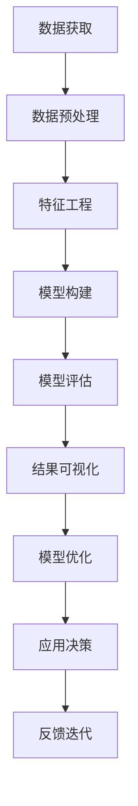

                 

# 模型思维:管理者认知复杂世界的捷径

> 关键词：模型思维,认知复杂性,管理者决策,复杂系统,数据驱动决策

## 1. 背景介绍

### 1.1 问题由来
在信息爆炸的今天，管理者面临的决策环境日益复杂。从全球供应链的动态变化到区域市场的销售预测，从人口统计的深度分析到客户行为的精准刻画，各类数据和信息源源不断地涌入决策者的视野。如何从海量数据中提取有价值的信息，制定出科学合理的决策，是每个管理者都面临的挑战。

传统决策方式通常基于经验、直觉和拍脑门式的判断。但这种模式在数据时代显得力不从心。管理者需要一种更为系统和科学的决策方法，以应对快速变化的商业环境。模型思维作为一种量化、数据驱动的决策工具，正在受到越来越多的关注。

### 1.2 问题核心关键点
模型思维，简而言之，是通过建立数学或统计模型，利用数据和算法对现实世界进行抽象和模拟，以辅助决策。其核心在于：

- **数据的获取与预处理**：模型思维依赖于高质量的数据，需对数据进行清洗、标准化和特征工程。
- **模型的构建与验证**：根据决策目标选择合适的模型，并通过交叉验证和模型评估等手段，确保模型的准确性和可靠性。
- **结果的应用与迭代**：将模型预测结果转化为实际决策，并根据实际效果持续优化模型。

本文将从模型构建、模型应用、模型优化等多个方面，全面探讨模型思维在管理决策中的应用，帮助管理者提升决策质量，应对复杂的商业环境。

## 2. 核心概念与联系

### 2.1 核心概念概述

为更好地理解模型思维，本节将介绍几个核心概念及其相互关联：

- **模型思维**：通过建立数学或统计模型，利用数据和算法对现实世界进行抽象和模拟，以辅助决策。
- **数据驱动决策**：基于数据和统计模型的决策方式，强调量化分析和证据支撑。
- **模型评估**：通过交叉验证、A/B测试等手段，评估模型的性能和稳健性，确保模型的适用性。
- **特征工程**：对原始数据进行处理，提取、选择和构造特征，提升模型的表现力。
- **数据可视化**：通过图表、仪表盘等工具，直观展示数据和模型结果，增强决策的可视化理解和可信度。
- **模型优化**：通过参数调整、模型融合等方法，优化模型预测结果，提高决策的准确性和可靠性。

这些概念共同构成了模型思维的基本框架，帮助管理者在复杂多变的环境中做出科学合理的决策。

### 2.2 核心概念原理和架构的 Mermaid 流程图



这个流程图展示了模型思维的基本流程：

1. 从各类数据源获取数据。
2. 对数据进行预处理和特征工程，提取有价值的信息。
3. 选择适当的模型进行构建和训练。
4. 通过交叉验证、A/B测试等手段评估模型效果。
5. 利用数据可视化工具展示模型结果。
6. 根据实际效果进行模型优化和迭代。
7. 最终将模型预测转化为具体决策，并根据反馈进行进一步的迭代优化。

## 3. 核心算法原理 & 具体操作步骤

### 3.1 算法原理概述

模型思维的核心算法原理，主要涉及数据的预处理、特征提取、模型训练和结果解释四个方面。简述如下：

- **数据预处理**：清洗、标准化、归一化等操作，确保数据质量。
- **特征提取**：利用主成分分析(PCA)、线性判别分析(LDA)等方法，从原始数据中提取最具代表性、区分度的特征。
- **模型训练**：通过回归、分类、聚类等算法，建立反映数据分布的模型。
- **结果解释**：通过回归系数、分类误差率、聚类中心等指标，解释模型预测结果。

### 3.2 算法步骤详解

基于模型思维的决策过程，通常包括以下关键步骤：

**Step 1: 数据获取与预处理**
- 收集与决策目标相关的各类数据，如市场调研数据、销售记录、客户反馈等。
- 对数据进行清洗、去重、处理缺失值等预处理操作，确保数据质量。
- 进行数据标准化、归一化等操作，统一数据尺度。

**Step 2: 特征提取与选择**
- 利用特征工程技术，从原始数据中提取最具代表性的特征。
- 通过主成分分析(PCA)、线性判别分析(LDA)等降维技术，减少特征维度，提升模型计算效率。
- 选择对决策目标影响最大的特征，进行模型构建。

**Step 3: 模型构建与训练**
- 根据决策目标选择合适的模型，如线性回归、逻辑回归、决策树、随机森林、神经网络等。
- 利用训练数据对模型进行训练，通过交叉验证和网格搜索等手段，选择最优的模型参数。
- 使用测试数据集对模型进行评估，确保模型泛化性能。

**Step 4: 结果解释与应用**
- 将模型预测结果与实际数据进行对比，解释模型预测的合理性。
- 结合领域知识，对模型结果进行解释，生成决策建议。
- 根据实际效果进行模型优化，并应用到实际决策中。

**Step 5: 反馈与迭代**
- 收集模型应用的实际效果和反馈，持续优化模型。
- 根据新数据的出现，对模型进行重新训练和优化，保持决策的有效性。

### 3.3 算法优缺点

模型思维作为一种量化决策工具，具有以下优点：
- **决策科学性**：通过数据和算法，减少主观偏见，提高决策的客观性和科学性。
- **预测精度高**：利用历史数据训练的模型，能够对未来情况进行较为准确的预测。
- **可视化强**：模型结果可通过图表直观展示，增强决策的可理解性和可视化理解。

同时，模型思维也存在一些缺点：
- **数据质量依赖高**：模型性能高度依赖于数据质量，数据偏差可能导致模型预测偏差。
- **计算复杂度高**：构建复杂模型，尤其是深度学习模型，计算和存储成本较高。
- **模型复杂性高**：过度复杂的模型可能过拟合，影响泛化性能。
- **模型解读困难**：某些复杂模型（如深度神经网络），其内部工作机制难以直观解释。

### 3.4 算法应用领域

模型思维在各个管理决策领域均有广泛应用，主要涵盖以下几个方面：

- **市场分析与预测**：通过模型分析市场趋势、消费者行为、销售数据等，预测未来市场变化，辅助制定营销策略。
- **风险管理与控制**：利用模型评估信用风险、操作风险、流动性风险等，制定风险控制措施。
- **运营优化与决策**：通过模型优化供应链管理、库存管理、生产计划等，提高运营效率。
- **人力资源管理**：利用模型预测人才流失、招聘效果、员工绩效等，优化人力资源策略。
- **财务分析与规划**：通过模型分析财务报表、预测财务指标、评估投资项目，制定财务策略。

## 4. 数学模型和公式 & 详细讲解 & 举例说明

### 4.1 数学模型构建

在模型思维的决策过程中，构建数学模型是非常重要的一环。下面以线性回归模型为例，详细讲解数学模型的构建过程。

假设我们有一组数据集 $D=\{(x_i,y_i)\}_{i=1}^n$，其中 $x_i$ 为自变量，$y_i$ 为因变量。我们希望通过构建线性回归模型，拟合一条直线，使得模型预测值与真实值尽可能接近。设模型为：

$$ y=\beta_0 + \beta_1 x + \epsilon $$

其中 $\beta_0$ 和 $\beta_1$ 为模型参数，$\epsilon$ 为误差项。模型的目标是找到最优的 $\beta_0$ 和 $\beta_1$，使得预测值 $y'$ 与真实值 $y$ 的误差最小化。

### 4.2 公式推导过程

线性回归模型的参数估计，通常采用最小二乘法（Least Squares Method）进行求解。推导过程如下：

1. 定义残差平方和（Residual Sum of Squares, RSS）：
$$ RSS=\sum_{i=1}^n (y_i - y'_i)^2 $$

其中 $y'_i$ 为模型预测值。

2. 求解 $\beta_0$ 和 $\beta_1$，使得 RSS 最小化：
$$ \min_{\beta_0,\beta_1} RSS $$

3. 利用梯度下降等优化算法，求解上述最优化问题：
$$ \nabla_{\beta_0} RSS = -2\sum_{i=1}^n (y_i - y'_i) $$
$$ \nabla_{\beta_1} RSS = -2\sum_{i=1}^n x_i(y_i - y'_i) $$

通过求解上述梯度方程，可以得到最优参数 $\beta_0$ 和 $\beta_1$，从而构建出线性回归模型。

### 4.3 案例分析与讲解

假设我们有一组关于销售额和广告投入的数据，希望通过线性回归模型预测未来的销售额。

```python
import numpy as np
from sklearn.linear_model import LinearRegression
import matplotlib.pyplot as plt

# 创建数据集
x = np.array([1, 2, 3, 4, 5, 6, 7, 8, 9, 10])
y = np.array([15, 21, 25, 30, 33, 36, 39, 42, 45, 48])

# 构建线性回归模型
model = LinearRegression()
model.fit(x.reshape(-1, 1), y)

# 预测未来销售额
x_future = np.array([11, 12, 13, 14, 15])
y_future = model.predict(x_future.reshape(-1, 1))

# 绘制散点图和拟合线
plt.scatter(x, y, color='blue', label='Data Points')
plt.plot(x_future, y_future, color='red', label='Predicted Sales')
plt.xlabel('Time')
plt.ylabel('Sales')
plt.legend()
plt.show()
```

通过上述代码，我们可以构建一个线性回归模型，并利用模型预测未来销售额。结果表明，模型能够较好地拟合数据，预测结果与真实值相差不大。

## 5. 项目实践：代码实例和详细解释说明

### 5.1 开发环境搭建

在进行模型思维的实践前，我们需要准备好开发环境。以下是使用Python进行Scikit-Learn库开发的环境配置流程：

1. 安装Anaconda：从官网下载并安装Anaconda，用于创建独立的Python环境。

2. 创建并激活虚拟环境：
```bash
conda create -n model-env python=3.8 
conda activate model-env
```

3. 安装Scikit-Learn：
```bash
pip install scikit-learn
```

4. 安装各类工具包：
```bash
pip install pandas numpy matplotlib seaborn sklearn
```

完成上述步骤后，即可在`model-env`环境中开始模型思维的实践。

### 5.2 源代码详细实现

这里我们以线性回归模型为例，给出使用Scikit-Learn库进行数据建模的PyTorch代码实现。

首先，定义线性回归模型的数据处理函数：

```python
from sklearn.linear_model import LinearRegression
import numpy as np

# 创建数据集
x = np.array([1, 2, 3, 4, 5, 6, 7, 8, 9, 10])
y = np.array([15, 21, 25, 30, 33, 36, 39, 42, 45, 48])

# 构建线性回归模型
model = LinearRegression()
model.fit(x.reshape(-1, 1), y)

# 预测未来销售额
x_future = np.array([11, 12, 13, 14, 15])
y_future = model.predict(x_future.reshape(-1, 1))

# 输出模型参数和预测结果
print(f'Intercept: {model.intercept_}')
print(f'Coefficient: {model.coef_[0]}')
print(f'Prediction: {y_future.tolist()}')
```

然后，定义模型评估函数：

```python
from sklearn.metrics import r2_score, mean_squared_error

# 定义评估函数
def evaluate_model(model, x, y, x_future):
    y_pred = model.predict(x_future.reshape(-1, 1))
    r2 = r2_score(y, y_pred)
    mse = mean_squared_error(y, y_pred)
    print(f'R^2 Score: {r2:.2f}')
    print(f'Mean Squared Error: {mse:.2f}')
    print(f'Actual: {y.tolist()}, Predicted: {y_pred.tolist()}')
```

最后，启动模型训练和评估流程：

```python
# 训练模型
model = LinearRegression()
model.fit(x.reshape(-1, 1), y)

# 评估模型
evaluate_model(model, x, y, x_future)
```

以上就是使用Scikit-Learn库进行线性回归模型训练和评估的完整代码实现。可以看到，Scikit-Learn库的封装使得模型构建和评估变得非常简单高效。

### 5.3 代码解读与分析

让我们再详细解读一下关键代码的实现细节：

**数据处理函数**：
- `np.array`：将数据转换为NumPy数组，方便后续处理。
- `.reshape(-1, 1)`：将一维数组转换为二维数组，符合Scikit-Learn库的要求。
- `model.fit`：利用训练数据对模型进行拟合训练。
- `y_future`：使用训练好的模型，对未来数据进行预测。

**模型评估函数**：
- `r2_score`：计算决定系数（R^2 Score），衡量模型的拟合程度。
- `mean_squared_error`：计算均方误差（Mean Squared Error），衡量模型的预测误差。
- `y_pred`：利用模型对未来数据进行预测。
- `print`：输出评估结果和模型预测结果。

**训练和评估流程**：
- `model = LinearRegression()`：创建线性回归模型实例。
- `model.fit(x.reshape(-1, 1), y)`：利用训练数据对模型进行拟合训练。
- `evaluate_model(model, x, y, x_future)`：对模型进行评估，并输出结果。

## 6. 实际应用场景

### 6.1 智能推荐系统

模型思维在智能推荐系统中的应用，可以有效提升推荐效果和用户体验。通过构建用户行为、商品属性、社交关系等模型的组合，可以实现个性化推荐。

具体而言，可以构建用户画像模型，分析用户的历史行为、兴趣偏好、社交关系等，结合商品属性、评分数据等特征，构建推荐模型。利用模型进行实时预测和推荐，可以显著提升推荐的个性化程度和准确性。

### 6.2 风险管理

在金融领域，风险管理是核心业务之一。通过构建信用评分模型、风险评估模型等，可以识别高风险客户，制定相应的风险控制策略。

利用历史数据，构建信用评分模型，如Logistic回归模型、决策树模型等，预测客户的违约概率。利用风险评估模型，如线性判别分析模型（LDA），识别潜在风险因素，制定风险管理措施。

### 6.3 供应链优化

供应链管理是企业运营的核心环节。通过构建库存管理模型、需求预测模型等，可以实现供应链的高效运作和成本优化。

利用历史销售数据，构建需求预测模型，如ARIMA模型、季节性自回归模型等，预测未来的市场需求。利用库存管理模型，如线性规划模型，优化库存水平，减少资金占用和库存成本。

### 6.4 未来应用展望

随着模型思维的不断发展，其在管理决策中的应用前景广阔。未来可能的发展趋势包括：

1. **深度学习模型的应用**：深度学习模型，如神经网络、卷积神经网络等，可以处理更复杂的数据结构，提升模型的表现力。
2. **多模型融合**：通过组合多个模型，利用不同模型的优势，提升预测的准确性和鲁棒性。
3. **实时化处理**：利用实时数据处理技术，如流式计算、增量学习等，提升模型应用的实时性和灵活性。
4. **自动化决策**：构建自动化决策系统，将模型预测结果直接转化为决策指令，减少人工干预。
5. **跨领域应用**：将模型思维应用于更多领域，如医疗、制造、物流等，解决实际问题，推动行业创新。

## 7. 工具和资源推荐

### 7.1 学习资源推荐

为了帮助管理者掌握模型思维，这里推荐一些优质的学习资源：

1. 《模型思维导论》系列书籍：全面介绍了模型思维的基本概念、理论框架和应用案例。
2. Coursera《数据科学导论》课程：由斯坦福大学开设的入门级课程，系统讲解数据科学的基本方法和工具。
3. Kaggle竞赛平台：通过实际数据集竞赛，锻炼模型构建和分析能力。
4. 《Python数据科学手册》：详细介绍了Python在数据科学中的应用，包括数据处理、模型构建等。
5. 《数据科学实战》：基于实际案例，展示数据科学在各行业中的应用，帮助管理者理解模型思维的实际价值。

通过对这些资源的学习，管理者可以系统掌握模型思维的理论和实践方法，提升决策科学性。

### 7.2 开发工具推荐

模型思维的实现离不开优秀的工具支持。以下是几款常用的开发工具：

1. Jupyter Notebook：支持Python和R等语言，可视化的编写和执行代码，方便调试和交流。
2. R语言：专注于统计分析和数据可视化，提供了丰富的模型构建和评估库。
3. Tableau：数据可视化的领先工具，可以将复杂数据转化为直观图表，帮助管理者理解数据和模型结果。
4. RStudio：基于R语言的开发环境，提供便捷的代码编写和调试工具。
5. Python IDEs：如PyCharm、Jupyter Lab等，提供高效的数据分析和模型构建功能。

合理利用这些工具，可以显著提升模型思维的开发效率，快速实现决策模型。

### 7.3 相关论文推荐

模型思维的快速发展离不开学界的持续研究。以下是几篇奠基性的相关论文，推荐阅读：

1. 《线性回归模型理论与应用》：介绍了线性回归模型的基本原理和应用场景。
2. 《支持向量机：理论与算法》：详细讲解了支持向量机的理论基础和优化算法。
3. 《深度学习：理论和实践》：介绍深度学习的基本理论和实践方法，涵盖神经网络、卷积神经网络等模型。
4. 《多模型融合：理论与实践》：探讨多模型融合的方法和优势，提升预测的准确性和鲁棒性。
5. 《实时数据处理：理论与实践》：介绍实时数据处理的理论基础和实现方法，支持模型思维的实时化应用。

这些论文代表了大数据和机器学习的发展脉络，帮助管理者掌握前沿理论和应用技术。

## 8. 总结：未来发展趋势与挑战

### 8.1 总结

本文对模型思维在管理决策中的应用进行了全面系统的介绍。首先阐述了模型思维在复杂管理决策环境中的重要性，明确了模型思维作为数据驱动决策工具的独特价值。其次，从模型构建、模型应用、模型优化等多个方面，详细讲解了模型思维的基本流程和方法，提供了丰富的代码实现和案例分析。同时，本文还探讨了模型思维在各行业领域的应用前景，展示了模型思维的广阔应用前景。

通过本文的系统梳理，可以看到，模型思维作为一种量化决策工具，正在成为管理决策的重要手段，极大地提升了决策的科学性和精确性。未来，伴随数据技术和算法方法的持续演进，模型思维必将在更多领域得到广泛应用，推动管理决策的科学化和智能化。

### 8.2 未来发展趋势

展望未来，模型思维的发展趋势如下：

1. **深度学习模型的普及**：深度学习模型具有强大的表达能力和自适应性，能够处理更复杂的数据结构和任务。未来，深度学习模型将在更多场景下被广泛应用。
2. **多模型融合技术**：通过组合多个模型，利用不同模型的优势，提升预测的准确性和鲁棒性。
3. **实时数据处理技术**：利用实时数据处理技术，提升模型思维的实时性和灵活性。
4. **自动化决策系统**：构建自动化决策系统，减少人工干预，提升决策效率和精度。
5. **跨领域应用**：将模型思维应用于更多领域，推动行业创新和进步。

这些趋势凸显了模型思维的广阔前景，为管理者在复杂多变的商业环境中制定科学决策提供了更多可能。

### 8.3 面临的挑战

尽管模型思维在管理决策中的应用前景广阔，但在实际应用中仍面临诸多挑战：

1. **数据质量问题**：数据质量是模型思维成功的基础，但现实中常常面临数据缺失、数据偏差等问题。如何提升数据质量，获取高质量的数据源，是模型思维应用的前提。
2. **模型复杂性**：复杂的模型通常具有较高的计算复杂度和存储成本，影响模型应用的可行性。如何简化模型结构，降低计算成本，是模型思维面临的重要挑战。
3. **模型解释性**：某些复杂模型（如深度神经网络），其内部工作机制难以直观解释。如何增强模型的解释性，提高决策的透明度，是模型思维应用的难点。
4. **应用场景限制**：模型思维的应用范围受限于数据和模型的可用性，某些领域或任务可能难以直接应用。如何拓展模型思维的应用场景，是模型思维应用的挑战之一。
5. **技术更新迅速**：模型思维涉及多种技术和算法，技术更新迅速，管理者需不断学习新方法和工具，保持技术领先。

正视模型思维面临的这些挑战，积极应对并寻求突破，将有助于模型思维在实际决策中发挥更大的作用。

### 8.4 研究展望

未来的研究需要在以下几个方面寻求新的突破：

1. **多领域模型的融合**：将不同领域的模型和知识进行有机融合，构建综合性模型，提升决策的全面性和科学性。
2. **自动化模型构建**：利用自动化工具和算法，简化模型构建和优化过程，提高模型应用的效率和效果。
3. **模型解释性增强**：通过模型可视化、可解释性方法等，提升模型的解释性，增强决策的可信度和透明度。
4. **实时数据处理技术**：研究实时数据处理算法和技术，支持模型思维的实时化应用。
5. **跨领域模型应用**：将模型思维应用于更多领域，推动各行业的创新和进步。

这些研究方向的探索，将有助于模型思维在实际决策中发挥更大的作用，推动管理决策的科学化和智能化。

## 9. 附录：常见问题与解答

**Q1：模型思维是否适用于所有管理决策问题？**

A: 模型思维适用于大多数管理决策问题，尤其是那些涉及大量数据和复杂逻辑的场景。但对于一些需要高度直觉和创意的决策，模型思维可能无法完全替代人的判断。

**Q2：如何构建高效的模型思维流程？**

A: 高效的模型思维流程需要具备以下几个要素：
1. 明确决策目标：明确决策的短期和长期目标，确定模型需要解决的问题。
2. 收集和清洗数据：获取高质量的数据，进行清洗和标准化处理。
3. 选择合适的模型：根据决策目标和数据特点，选择适合的模型。
4. 训练和评估模型：利用训练数据对模型进行训练，通过交叉验证和评估指标对模型进行评估。
5. 解释和应用模型：结合领域知识和数据特点，解释模型预测结果，转化为实际决策。
6. 反馈与优化：收集模型应用的实际效果和反馈，持续优化模型和流程。

**Q3：模型思维在应用中需要注意哪些问题？**

A: 模型思维在应用中需要注意以下几个问题：
1. 数据质量问题：确保数据质量，避免数据偏差和缺失。
2. 模型复杂性：简化模型结构，降低计算成本和存储成本。
3. 模型解释性：增强模型的解释性，提升决策的可信度和透明度。
4. 模型应用场景：结合实际应用场景，选择合适的模型和评估指标。
5. 模型更新和维护：持续更新和维护模型，保持模型应用的有效性。

通过充分考虑这些问题，可以最大限度地发挥模型思维在管理决策中的应用价值。

---

作者：禅与计算机程序设计艺术 / Zen and the Art of Computer Programming

