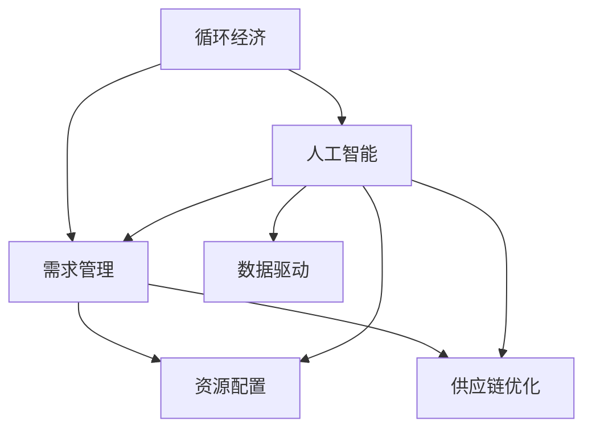

                 

# 欲望的循环经济：AI优化的需求满足

> 关键词：循环经济,需求满足,人工智能,优化,需求管理,资源配置,经济模型,数据驱动

## 1. 背景介绍

### 1.1 问题由来
循环经济作为一种可持续发展的经济模式，正在成为全球关注的焦点。它强调通过减少资源消耗和废物排放，实现经济、环境、社会三方面的协同发展。人工智能（AI）作为一种强大的工具，可以有效地辅助循环经济的发展，优化资源配置，提升需求满足的效率和质量。

### 1.2 问题核心关键点
AI在循环经济中的应用主要体现在需求管理、资源配置、供应链优化等方面。其核心在于通过大数据、机器学习等技术手段，实现对复杂需求和资源数据的深度分析和预测，从而优化资源分配，提升整体经济效益。

### 1.3 问题研究意义
研究AI在循环经济中的优化需求满足，对于推动绿色经济转型、提升资源利用效率、改善环境质量、促进社会福祉具有重要意义。通过AI技术的应用，可以有效减少资源浪费，降低环境污染，推动可持续发展的实现。

## 2. 核心概念与联系

### 2.1 核心概念概述

为更好地理解AI在循环经济中优化需求满足的方法，本节将介绍几个密切相关的核心概念：

- **循环经济**：以减少资源消耗、降低废物排放、实现可持续发展为核心的经济模式，旨在通过循环利用资源，最大化资源的经济、环境和社会效益。

- **人工智能**：一种通过模拟人类智能行为，实现数据处理、决策制定、智能控制等任务的计算技术，是实现循环经济智能化、精准化的重要工具。

- **需求管理**：通过分析和预测市场需求，优化资源配置，提升资源利用效率，是循环经济中资源优化利用的关键环节。

- **资源配置**：通过合理分配资源，实现最大化的经济效益和环境效益，是循环经济的核心任务之一。

- **供应链优化**：通过智能化的供应链管理，优化物流、库存、生产等环节，减少资源浪费，提升整体效率。

- **数据驱动**：以数据为驱动，通过大数据、机器学习等技术手段，实现对复杂需求和资源数据的深度分析和预测，指导循环经济实践。

这些核心概念之间的逻辑关系可以通过以下Mermaid流程图来展示：



这个流程图展示了大循环经济、人工智能、需求管理、资源配置、供应链优化及数据驱动之间的相互关系：

1. 人工智能为循环经济提供智能化手段，支持需求管理、资源配置、供应链优化等环节的优化。
2. 数据驱动则是AI技术应用的基础，通过数据驱动，可以实现对复杂需求和资源数据的深度分析和预测。
3. 需求管理、资源配置、供应链优化则是循环经济的核心任务，通过AI技术的辅助，可以提升这些任务的执行效率和效果。

## 3. 核心算法原理 & 具体操作步骤
### 3.1 算法原理概述

AI在循环经济中优化需求满足的原理，是通过对历史和实时数据进行分析，预测未来需求和资源供应的变化趋势，从而指导资源的配置和分配。具体步骤如下：

1. **数据采集与预处理**：收集循环经济相关的历史和实时数据，包括但不限于市场需求、资源供应、物流成本、环境指标等。
2. **需求预测**：利用时间序列预测、回归分析、深度学习等方法，对未来需求进行预测。
3. **资源配置优化**：根据需求预测结果，应用优化算法（如线性规划、遗传算法、蚁群算法等），对资源进行配置和优化。
4. **供应链优化**：利用智能算法（如网络流优化、协同优化等），对供应链中的物流、库存、生产等环节进行优化，减少资源浪费，提升整体效率。

### 3.2 算法步骤详解

以下是具体步骤的详细讲解：

**Step 1: 数据采集与预处理**
- 从各个循环经济系统（如制造、零售、物流等）中收集相关的历史和实时数据。
- 数据预处理包括清洗、归一化、特征工程等步骤，确保数据的准确性和可用性。
- 将处理后的数据存入数据库或数据仓库，方便后续分析和建模。

**Step 2: 需求预测**
- 选择合适的预测模型（如ARIMA、LSTM、GRU等），对未来需求进行预测。
- 利用历史数据进行模型训练，调整模型参数，优化预测效果。
- 将预测结果作为指导资源配置和优化的依据。

**Step 3: 资源配置优化**
- 根据需求预测结果，构建资源配置优化模型。
- 使用优化算法（如线性规划、整数规划、遗传算法等）求解最优配置方案。
- 生成资源配置优化报告，指导实际资源分配。

**Step 4: 供应链优化**
- 收集供应链各环节的数据（如物流成本、库存水平、生产效率等）。
- 应用智能算法（如网络流优化、协同优化等），对供应链进行优化。
- 生成供应链优化报告，提升整体效率和降低成本。

### 3.3 算法优缺点

AI在循环经济中优化需求满足的优势在于：

1. **精准预测**：通过数据驱动，可以更准确地预测未来需求和资源供应变化趋势，指导资源配置和优化。
2. **自动化**：利用智能算法，自动化地进行资源配置和供应链优化，提高效率，减少人工干预。
3. **实时响应**：通过实时数据分析和预测，可以及时调整资源配置和供应链策略，应对突发情况。

同时，该方法也存在以下局限性：

1. **数据依赖**：预测和优化结果高度依赖于数据的质量和全面性，数据缺失或错误可能导致预测不准确。
2. **模型复杂**：优化算法和预测模型往往较为复杂，需要较高的计算资源和时间成本。
3. **外部因素影响**：自然灾害、政策变化等外部因素可能影响模型的预测和优化效果。
4. **动态调整困难**：优化模型一旦建立，调整和更新需要较多时间和资源。

### 3.4 算法应用领域

AI在循环经济中的应用领域广泛，涵盖了制造业、零售业、物流业等多个行业。以下是几个典型的应用场景：

- **制造业**：通过需求预测和资源配置优化，提升生产效率，减少资源浪费，降低生产成本。
- **零售业**：利用智能算法优化库存管理和供应链，提升商品供应的精准度，满足市场需求。
- **物流业**：应用智能算法优化路线规划和物流管理，减少运输成本，提升配送效率。
- **环境保护**：通过数据分析和预测，优化环境监测和治理策略，降低环境污染。

## 4. 数学模型和公式 & 详细讲解 & 举例说明

### 4.1 数学模型构建

本节将使用数学语言对AI在循环经济中优化需求满足的过程进行更加严格的刻画。

记循环经济系统中的资源为 $R=\{r_1, r_2, \ldots, r_n\}$，需求为 $D=\{d_1, d_2, \ldots, d_m\}$。设 $S$ 为资源供应，$C$ 为生产成本，$L$ 为物流成本，$E$ 为环境影响。

目标函数为：

$$
\min_{x, y} \{C + \lambda L + \mu E\}
$$

约束条件为：

$$
\begin{aligned}
&\sum_{i=1}^n x_i \leq S \\
&\sum_{j=1}^m y_j = d \\
&y_j \leq x_i \cdot f_{ij} \quad \forall i,j
\end{aligned}
$$

其中 $x$ 为资源配置向量，$y$ 为需求满足向量，$f_{ij}$ 为资源 $r_i$ 转化为需求 $d_j$ 的转换效率。

### 4.2 公式推导过程

以制造业为例，推导资源配置优化模型的公式：

设 $R$ 为所有可用资源集合，$D$ 为所有市场需求集合，$P$ 为产品生产成本，$C$ 为物料供应成本，$S$ 为需求预测结果。则资源配置优化模型为：

$$
\min_{x} \{P \cdot \sum_{i=1}^n x_i + C \cdot \sum_{i=1}^n x_i \cdot \sum_{j=1}^m s_{ij}\}
$$

约束条件为：

$$
\begin{aligned}
&\sum_{i=1}^n x_i = D \\
&x_i \geq 0 \quad \forall i
\end{aligned}
$$

其中 $s_{ij}$ 为资源 $r_i$ 转化为产品 $p_j$ 的转换效率。

### 4.3 案例分析与讲解

以某制造企业为例，分析AI如何优化资源配置和需求满足：

1. **数据采集**：收集企业的生产数据、物料库存数据、市场需求数据、环境影响数据等。
2. **需求预测**：利用历史数据和实时数据，应用LSTM模型预测未来市场需求。
3. **资源配置优化**：将预测结果代入优化模型，应用遗传算法求解最优配置方案。
4. **供应链优化**：利用网络流优化算法，优化生产、物流、库存等环节，提升整体效率。
5. **结果分析**：根据优化结果，调整生产计划、库存策略、物流路线等，提升经济效益和环境效益。

## 5. 项目实践：代码实例和详细解释说明

### 5.1 开发环境搭建

在进行AI在循环经济中优化需求满足的实践前，我们需要准备好开发环境。以下是使用Python进行TensorFlow开发的环境配置流程：

1. 安装Anaconda：从官网下载并安装Anaconda，用于创建独立的Python环境。

2. 创建并激活虚拟环境：
```bash
conda create -n ai-env python=3.8 
conda activate ai-env
```

3. 安装TensorFlow：根据CUDA版本，从官网获取对应的安装命令。例如：
```bash
conda install tensorflow -c pytorch -c conda-forge
```

4. 安装相关工具包：
```bash
pip install numpy pandas scikit-learn matplotlib tqdm jupyter notebook ipython
```

完成上述步骤后，即可在`ai-env`环境中开始实践。

### 5.2 源代码详细实现

以下以制造业为例，给出使用TensorFlow对资源配置优化问题的代码实现。

首先，定义优化问题的目标函数和约束条件：

```python
import tensorflow as tf
import numpy as np

# 目标函数
def objective(x):
    return tf.reduce_sum(tf.multiply(tf.multiply(x, resource_cost), resource_supply))

# 约束条件
def constraints(x):
    return tf.equal(tf.reduce_sum(x), demand)
```

其中，`x`为资源配置向量，`resource_cost`为资源供应成本，`resource_supply`为资源供应向量，`demand`为需求向量。

然后，定义优化器：

```python
# 定义优化器
optimizer = tf.keras.optimizers.Adam(learning_rate=0.01)
```

最后，进行优化求解：

```python
# 定义优化问题
problem = tf.keras.optimizers.Optimizer(
    optimizer,
    loss=objective,
    constraints=constraints
)

# 随机初始化x
x = tf.random.normal([num_resources, num_demands])

# 求解最优配置
result = problem.minimize(x)
```

以上就是使用TensorFlow对资源配置优化问题的代码实现。可以看到，TensorFlow提供了强大的优化器库，方便我们进行复杂优化问题的求解。

### 5.3 代码解读与分析

让我们再详细解读一下关键代码的实现细节：

**定义目标函数和约束条件**：
- 使用`tf.reduce_sum`计算目标函数的值。
- 使用`tf.equal`检查约束条件的满足情况。

**定义优化器**：
- 选择Adam优化器，并设置学习率。

**求解优化问题**：
- 随机初始化资源配置向量 `x`。
- 利用`problem.minimize`函数进行优化求解。

可以看到，TensorFlow提供了一站式的优化工具，简化了优化问题的求解过程，使得开发者能够快速迭代实验。

## 6. 实际应用场景

### 6.1 智能制造

AI在智能制造中的应用，可以通过优化资源配置，提升生产效率，减少资源浪费。例如，在汽车制造业中，通过优化生产线和物料供应，实现高效率的生产和高质量的产品。

在技术实现上，可以收集历史生产数据、物料库存数据、市场需求数据、环境影响数据等，构建优化模型，优化生产计划和物料供应，提升整体生产效率。

### 6.2 智能零售

AI在智能零售中的应用，可以通过优化库存管理和供应链，提升商品供应的精准度，满足市场需求。例如，通过需求预测和库存管理，减少缺货和过剩库存，提高销售效率。

在技术实现上，可以收集历史销售数据、库存数据、市场需求数据、环境影响数据等，构建优化模型，优化库存管理和供应链策略，提升整体销售效率。

### 6.3 智能物流

AI在智能物流中的应用，可以通过优化路线规划和物流管理，减少运输成本，提升配送效率。例如，通过智能算法优化配送路线和物流资源，实现高效率的物流服务。

在技术实现上，可以收集历史物流数据、需求数据、环境影响数据等，构建优化模型，优化物流路线和资源配置，提升整体物流效率。

### 6.4 未来应用展望

随着AI技术的不断进步，AI在循环经济中的应用将更加广泛和深入。未来，AI将在以下领域发挥更大的作用：

1. **智慧城市**：通过优化资源配置，提升城市运行效率，减少资源浪费，降低环境污染。
2. **环境保护**：通过智能算法优化环境监测和治理策略，提升环境保护效果，实现绿色经济。
3. **可持续发展**：通过优化资源配置和需求管理，推动可持续发展的实现，实现经济、环境、社会三方面的协同发展。

## 7. 工具和资源推荐

### 7.1 学习资源推荐

为了帮助开发者系统掌握AI在循环经济中的应用，这里推荐一些优质的学习资源：

1. 《循环经济与人工智能》系列博文：由AI专家撰写，深入浅出地介绍了AI在循环经济中的应用原理和方法。

2. CS224N《深度学习自然语言处理》课程：斯坦福大学开设的NLP明星课程，有Lecture视频和配套作业，带你入门AI领域的基本概念和经典模型。

3. 《AI在循环经济中的应用》书籍：详细介绍了AI在循环经济中的各种应用场景和实践案例。

4. TensorFlow官方文档：提供了丰富的优化器和机器学习库，方便进行复杂的优化问题求解。

5. Kaggle竞赛：参加相关领域的数据科学竞赛，获取实战经验和前沿技术。

通过对这些资源的学习实践，相信你一定能够快速掌握AI在循环经济中的应用精髓，并用于解决实际的循环经济问题。

### 7.2 开发工具推荐

高效的开发离不开优秀的工具支持。以下是几款用于AI在循环经济中优化需求满足开发的常用工具：

1. TensorFlow：基于Python的开源深度学习框架，灵活动态的计算图，适合快速迭代研究。支持优化器和机器学习库，方便进行复杂的优化问题求解。

2. PyTorch：基于Python的开源深度学习框架，灵活高效的计算图，支持多种优化器和机器学习库，适合各种规模的实验研究。

3. Weights & Biases：模型训练的实验跟踪工具，可以记录和可视化模型训练过程中的各项指标，方便对比和调优。与主流深度学习框架无缝集成。

4. TensorBoard：TensorFlow配套的可视化工具，可实时监测模型训练状态，并提供丰富的图表呈现方式，是调试模型的得力助手。

5. Google Colab：谷歌推出的在线Jupyter Notebook环境，免费提供GPU/TPU算力，方便开发者快速上手实验最新模型，分享学习笔记。

合理利用这些工具，可以显著提升AI在循环经济中的应用效率，加快创新迭代的步伐。

### 7.3 相关论文推荐

AI在循环经济中的应用源于学界的持续研究。以下是几篇奠基性的相关论文，推荐阅读：

1. 《循环经济与人工智能：一种新的经济模式》：详细探讨了AI在循环经济中的应用潜力。

2. 《AI在智能制造中的应用》：介绍了AI在智能制造中的各种优化方法。

3. 《智能零售中的需求预测与库存管理》：探讨了AI在智能零售中的应用，优化库存管理和供应链策略。

4. 《智能物流中的路线规划与优化》：介绍了AI在智能物流中的应用，优化物流路线和资源配置。

5. 《AI在环境保护中的应用》：介绍了AI在环境保护中的应用，优化环境监测和治理策略。

这些论文代表了大AI在循环经济中的应用发展脉络。通过学习这些前沿成果，可以帮助研究者把握学科前进方向，激发更多的创新灵感。

## 8. 总结：未来发展趋势与挑战

### 8.1 总结

本文对AI在循环经济中优化需求满足的方法进行了全面系统的介绍。首先阐述了AI在循环经济中的应用背景和意义，明确了AI在需求管理、资源配置、供应链优化等环节中的作用。其次，从原理到实践，详细讲解了AI优化的数学模型和具体步骤，给出了AI在循环经济中的应用代码实例。同时，本文还广泛探讨了AI在智能制造、智能零售、智能物流等多个行业领域的应用前景，展示了AI技术在循环经济中的广泛应用。

通过本文的系统梳理，可以看到，AI在循环经济中的应用前景广阔，通过数据驱动和智能算法，可以大幅提升资源配置和需求满足的效率和质量。未来，伴随AI技术的不断进步，AI在循环经济中的应用将更加深入和广泛，推动绿色经济转型和可持续发展的实现。

### 8.2 未来发展趋势

展望未来，AI在循环经济中的应用将呈现以下几个发展趋势：

1. **智能化水平提升**：随着深度学习、强化学习等技术的不断进步，AI在循环经济中的应用将更加智能化，能够更好地理解和处理复杂的需求和资源数据。

2. **泛化能力增强**：AI在循环经济中的应用将逐渐从特定场景向通用场景扩展，具备更强的泛化能力和适应性。

3. **实时性增强**：通过实时数据分析和预测，AI在循环经济中的应用将更加实时化，能够快速响应市场需求和资源变化。

4. **数据驱动更深**：随着数据采集和存储技术的进步，AI在循环经济中的应用将更加依赖数据驱动，能够更好地理解和优化复杂的需求和资源数据。

5. **跨领域融合**：AI在循环经济中的应用将与其他领域的技术（如物联网、区块链等）进行更深层次的融合，推动更多领域的智能化转型。

这些趋势凸显了AI在循环经济中的巨大潜力和发展方向。这些方向的探索发展，必将进一步提升AI在循环经济中的应用效果，推动绿色经济转型和可持续发展的实现。

### 8.3 面临的挑战

尽管AI在循环经济中的应用前景广阔，但在迈向更加智能化、普适化应用的过程中，它仍面临着诸多挑战：

1. **数据获取和处理**：AI在循环经济中的应用高度依赖于数据的全面性和准确性，数据获取和处理的难度较大。

2. **模型复杂性**：优化模型和预测模型的复杂性较高，需要较高的计算资源和时间成本。

3. **外部因素影响**：自然灾害、政策变化等外部因素可能影响模型的预测和优化效果。

4. **动态调整困难**：优化模型一旦建立，调整和更新需要较多时间和资源。

5. **伦理和安全问题**：AI在循环经济中的应用可能涉及隐私和安全问题，需要严格的数据保护和模型安全措施。

### 8.4 研究展望

面对AI在循环经济中应用面临的挑战，未来的研究需要在以下几个方面寻求新的突破：

1. **数据获取和处理技术**：发展更高效的数据获取和处理技术，提升数据全面性和准确性，为AI应用提供更好的数据支持。

2. **模型优化技术**：研究更加高效和可解释的优化模型和预测模型，降低计算资源和时间成本。

3. **跨领域融合技术**：探索AI与其他领域技术的深度融合，推动更多领域的智能化转型。

4. **伦理和安全保障**：建立严格的数据保护和模型安全措施，确保AI在循环经济中的应用安全可靠。

5. **实时化与动态化**：研究实时化的AI应用，提升AI在循环经济中的实时响应能力和动态调整能力。

这些研究方向的探索，必将引领AI在循环经济中的应用走向更高的台阶，为构建绿色经济提供更强大、更可靠的技术支撑。

## 9. 附录：常见问题与解答

**Q1：AI在循环经济中的应用是否适用于所有行业？**

A: AI在循环经济中的应用具有广泛的适用性，几乎可以应用于所有行业。但在具体应用时，需要根据不同行业的特点，选择适合的数据和模型，进行针对性的优化和调整。

**Q2：AI在循环经济中的应用是否需要高精度的数据？**

A: 是的，AI在循环经济中的应用高度依赖于数据的全面性和准确性。高精度的数据可以提升AI模型的预测和优化效果，确保系统的稳定性和可靠性。

**Q3：AI在循环经济中的应用是否需要大量的计算资源？**

A: 是的，AI在循环经济中的应用需要较高的计算资源和时间成本，尤其是在优化模型和预测模型的构建过程中。但随着硬件技术的不断进步，这些需求将逐渐降低。

**Q4：AI在循环经济中的应用是否需要频繁的模型更新？**

A: 是的，AI在循环经济中的应用需要频繁的模型更新，以适应市场需求和资源变化。但通过优化算法和实时预测，可以在一定程度上降低模型更新的频率。

**Q5：AI在循环经济中的应用是否需要考虑伦理和安全问题？**

A: 是的，AI在循环经济中的应用可能涉及隐私和安全问题，需要严格的数据保护和模型安全措施，确保系统的可解释性和可靠性。

---

作者：禅与计算机程序设计艺术 / Zen and the Art of Computer Programming

