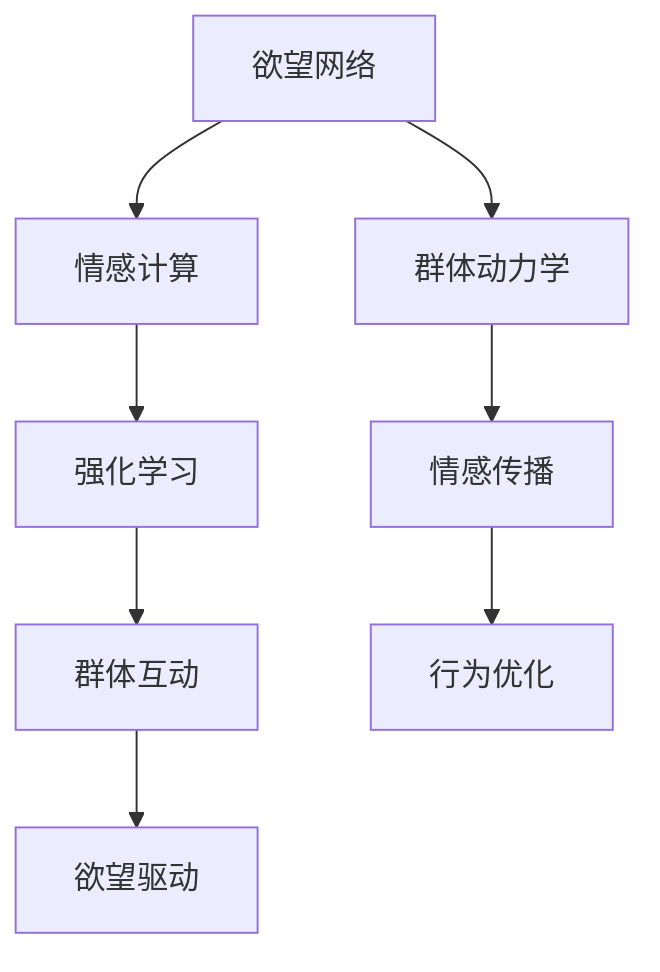

                 

# 欲望的社会网络：AI驱动的群体动力学

在人类社会的复杂多变、充满不确定性的网络中，欲望作为一种普遍而深刻的内在驱动力，影响着个体行为、群体动态和市场趋势。随着人工智能（AI）技术的快速发展，AI在理解、预测和影响欲望网络方面展现出巨大的潜力。本文将深入探讨AI如何驱动欲望的社会网络，并解析其在经济、政治、文化等多个领域的实际应用。

## 1. 背景介绍

### 1.1 问题由来
欲望作为一种复杂的心理现象，一直以来是哲学、社会学、经济学等学科的重要研究对象。然而，传统的研究方法往往依赖于大量的人工调查和历史数据，难以捕捉动态变化中的群体行为模式。而人工智能技术的兴起，尤其是深度学习和大数据技术的结合，使得实时动态地分析欲望网络成为可能。

### 1.2 问题核心关键点
AI驱动的欲望网络研究核心在于如何利用数据挖掘和机器学习技术，从海量数据中识别出欲望的驱动因素和传播路径，进而预测群体行为变化，并为个体和群体行为提供决策支持。

## 2. 核心概念与联系

### 2.1 核心概念概述

为更好地理解AI驱动的欲望网络，本文将介绍几个关键概念：

- **欲望网络（Desire Network）**：由个体欲望、群体互动和外部环境构成的动态网络系统。AI通过分析个体和群体的行为数据，揭示出欲望网络的生成和演化机制。

- **情感计算（Affective Computing）**：通过机器学习技术，分析和理解人类情感状态，进而预测情感变化对欲望的影响。

- **群体动力学（Collective Dynamics）**：研究个体和群体在复杂网络中的互动模式和演化规律，揭示欲望网络传播的机制。

- **强化学习（Reinforcement Learning）**：通过模拟个体在欲望网络中的行为，优化决策策略，以实现最优行为路径。

- **情感传播（Emotional Contagion）**：描述情感状态在个体和群体中的传播过程，AI可以预测情感传播路径和速度，从而影响欲望网络动态。

这些核心概念之间通过情感、互动和反馈等机制相互联系，共同构成了AI驱动欲望网络的研究框架。

### 2.2 核心概念原理和架构的 Mermaid 流程图



此流程图展示了欲望网络在AI驱动下的主要构成和演化路径，通过情感计算、群体动力学、强化学习和情感传播等机制，最终实现欲望驱动的行为优化和群体互动。

## 3. 核心算法原理 & 具体操作步骤

### 3.1 算法原理概述
AI驱动的欲望网络研究主要涉及以下算法原理：

- **情感分析与分类**：利用机器学习技术，从个体行为数据中提取情感特征，并将情感状态分类为积极、消极或中性。
- **社交网络分析**：通过图神经网络（Graph Neural Network, GNN）等技术，分析个体在社交网络中的互动模式和情感传播路径。
- **强化学习与行为优化**：基于个体欲望和群体互动数据，利用强化学习算法优化个体决策策略，实现最优行为路径。
- **深度学习与生成模型**：利用深度学习技术，构建欲望网络的动力学模型，预测欲望传播路径和群体行为变化。

### 3.2 算法步骤详解

#### 3.2.1 数据收集与预处理
- **情感数据收集**：通过社交媒体、在线论坛、评论系统等平台，收集用户行为数据，包括文本、图片、视频等。
- **数据清洗与特征提取**：去除噪声数据，提取情感特征、行为特征等，生成可用于机器学习的数据集。

#### 3.2.2 情感分析与分类
- **情感标注**：利用标注数据训练情感分类模型，将用户行为数据中的情感状态分类为积极、消极或中性。
- **情感特征提取**：利用自然语言处理（NLP）技术，提取文本数据中的情感特征，如情感词、情感强度等。

#### 3.2.3 社交网络分析
- **社交网络构建**：通过好友关系、互动频率等，构建用户的社交网络图，节点为用户，边为用户之间的互动关系。
- **情感传播建模**：利用图神经网络（GNN）等技术，建模情感状态在社交网络中的传播过程，预测情感传播路径和速度。

#### 3.2.4 强化学习与行为优化
- **欲望状态建模**：基于个体欲望和情感状态，构建欲望网络的动力学模型。
- **行为策略优化**：利用强化学习算法，优化个体在欲望网络中的行为策略，实现最优决策路径。

#### 3.2.5 深度学习与生成模型
- **欲望网络建模**：利用深度学习技术，构建欲望网络的生成模型，预测欲望传播路径和群体行为变化。
- **行为预测与优化**：基于欲望网络的动力学模型，预测个体行为变化，优化群体互动。

### 3.3 算法优缺点

#### 3.3.1 优点
- **实时性**：AI能够实时分析大量数据，快速响应情感和欲望变化，提供决策支持。
- **可扩展性**：利用分布式计算和大数据技术，AI可以处理海量数据，实现多场景应用。
- **适应性**：AI可以不断学习和适应新的情感和欲望模式，提升预测精度。

#### 3.3.2 缺点
- **数据隐私**：情感和欲望数据的收集和处理涉及隐私问题，数据获取难度大。
- **模型复杂性**：情感和欲望网络的研究涉及多种算法和技术，模型设计和优化复杂。
- **解释性不足**：AI模型往往呈现"黑盒"特性，难以解释决策过程和行为逻辑。

### 3.4 算法应用领域

#### 3.4.1 金融市场
- **情感分析与交易决策**：利用情感分析技术，预测市场情绪变化，优化交易策略，提高投资回报。
- **欲望网络建模与风险管理**：构建欲望网络的动力学模型，预测市场行为，进行风险管理和资产配置。

#### 3.4.2 社交媒体
- **情感传播与舆情监控**：分析社交媒体中的情感传播路径，监控舆情变化，预防负面事件影响。
- **欲望驱动的行为预测**：预测个体在社交媒体上的行为变化，优化互动策略，提升用户粘性。

#### 3.4.3 产品设计与市场推广
- **情感驱动的产品优化**：通过情感分析，了解用户需求和欲望，优化产品设计。
- **欲望网络分析与市场推广**：利用欲望网络建模，预测市场趋势和用户行为，制定市场推广策略。

## 4. 数学模型和公式 & 详细讲解 & 举例说明

### 4.1 数学模型构建

#### 4.1.1 情感分类模型
情感分类模型的构建基于监督学习算法，如支持向量机（SVM）、逻辑回归等。以SVM模型为例，其数学表达式为：

$$
\mathop{\arg\min}_{w, b} \frac{1}{2} \|w\|^2 + C \sum_{i=1}^n [\max(0, 1-y_i(w^Tx_i + b))]^2
$$

其中 $w$ 为分类器的权重向量，$b$ 为偏置，$C$ 为正则化参数，$x_i$ 和 $y_i$ 分别为样本的特征和标签。

#### 4.1.2 社交网络分析
社交网络分析通常使用图神经网络（GNN）进行建模。GNN的数学表达式为：

$$
h^{l+1}_v = \frac{1}{|\mathcal{N}(v)|} \sum_{u \in \mathcal{N}(v)} \mathcal{D}(u) \cdot h^l_u
$$

其中 $h^l_v$ 为节点 $v$ 在第 $l$ 层的表示，$\mathcal{N}(v)$ 为节点 $v$ 的邻居节点集合，$\mathcal{D}(u)$ 为邻居节点 $u$ 的特征，$l$ 为网络层数。

#### 4.1.3 强化学习
强化学习的目标是通过策略 $\pi$ 最大化累计奖励 $R$。其数学表达式为：

$$
\pi^* = \mathop{\arg\max}_{\pi} \mathbb{E}_{s \sim p}[R^\pi(s)]
$$

其中 $\pi$ 为策略函数，$p$ 为状态转移概率，$R^\pi$ 为在策略 $\pi$ 下的累计奖励。

#### 4.1.4 欲望网络建模
欲望网络的动力学模型通常使用差分方程或递归神经网络（RNN）进行建模。以RNN为例，其数学表达式为：

$$
h^{t+1} = \sigma(W h^t + b)
$$

其中 $h^t$ 为第 $t$ 时刻的状态，$W$ 和 $b$ 为模型参数，$\sigma$ 为激活函数。

### 4.2 公式推导过程

#### 4.2.1 情感分类模型推导
SVM模型基于最大间隔分割的原则，通过最大化分类边界与错误数据点的距离，实现分类器的训练。具体推导过程如下：

1. **目标函数**：

$$
\min_{w, b} \frac{1}{2} \|w\|^2 + C \sum_{i=1}^n [\max(0, 1-y_i(w^Tx_i + b))]^2
$$

2. **拉格朗日乘子法**：

$$
\mathcal{L}(w, b, \alpha) = \frac{1}{2} \|w\|^2 + C \sum_{i=1}^n \alpha_i \max(0, 1-y_i(w^Tx_i + b)) - \alpha_i(1-y_i(w^Tx_i + b))
$$

3. **对偶问题求解**：

$$
\min_{\alpha} \frac{1}{2} \sum_{i=1}^n \sum_{j=1}^n \alpha_i \alpha_j y_i y_j (w_i \cdot w_j) - \sum_{i=1}^n \alpha_i \max(0, 1-y_i(w^Tx_i + b)) + \sum_{i=1}^n \alpha_i
$$

4. **对偶解**：

$$
\alpha_i = \left\{
\begin{array}{ll}
0 & y_i(w^Tx_i + b) \geq 1 \\
C - \frac{1}{C}y_i(w^Tx_i + b) & y_i(w^Tx_i + b) < 1
\end{array}
\right.
$$

#### 4.2.2 社交网络分析推导
GNN模型利用邻居节点特征的加权和来更新当前节点的表示，数学表达式如下：

$$
h^{l+1}_v = \frac{1}{|\mathcal{N}(v)|} \sum_{u \in \mathcal{N}(v)} \mathcal{D}(u) \cdot h^l_u
$$

其中 $h^{l+1}_v$ 为节点 $v$ 在第 $l+1$ 层的表示，$\mathcal{N}(v)$ 为节点 $v$ 的邻居节点集合，$\mathcal{D}(u)$ 为邻居节点 $u$ 的特征，$l$ 为网络层数。

#### 4.2.3 强化学习推导
强化学习的目标是通过策略 $\pi$ 最大化累计奖励 $R$，具体推导过程如下：

1. **策略函数**：

$$
\pi(a|s) = \frac{\exp(Q^\pi(s,a))}{\sum_{a'} \exp(Q^\pi(s,a'))}
$$

2. **价值函数**：

$$
Q^\pi(s,a) = r + \gamma \mathbb{E}_{s' \sim p}[Q^\pi(s',\pi(s'))]
$$

其中 $\pi$ 为策略函数，$s$ 为状态，$a$ 为动作，$r$ 为即时奖励，$\gamma$ 为折扣因子，$Q^\pi$ 为在策略 $\pi$ 下的价值函数。

#### 4.2.4 欲望网络建模推导
欲望网络的动力学模型通常使用递归神经网络（RNN）进行建模，具体推导过程如下：

1. **状态更新**：

$$
h^{t+1} = \sigma(W h^t + b)
$$

2. **欲望传播**：

$$
d^t = \sum_{u \in \mathcal{N}(v)} \mathcal{D}(u) \cdot h^t_u
$$

其中 $h^t$ 为第 $t$ 时刻的状态，$W$ 和 $b$ 为模型参数，$\sigma$ 为激活函数，$d^t$ 为欲望在节点 $v$ 上的传播值。

### 4.3 案例分析与讲解

#### 4.3.1 情感分析案例
以情感分类模型为例，分析用户评论的情感倾向。假设某电商平台的评论数据如下：

| 用户ID | 商品ID | 评论内容 | 情感标签 |
| --- | --- | --- | --- |
| 1 | A | 商品质量不错，价格合理 | 积极 |
| 1 | B | 服务态度恶劣，退换货麻烦 | 消极 |
| 2 | A | 颜色不错，但尺寸偏大 | 中性 |

通过监督学习算法，构建情感分类模型，实现对评论情感的自动标注。利用SVM模型，训练得到分类器权重向量 $w$ 和偏置 $b$，对新评论进行情感预测。

#### 4.3.2 社交网络分析案例
以社交网络分析为例，分析用户情感在社交网络中的传播路径。假设某社交平台的情感数据如下：

| 用户ID | 情感状态 | 好友ID |
| --- | --- | --- |
| 1 | 积极 | 2, 3 |
| 2 | 积极 | 1, 4 |
| 3 | 消极 | 1, 5 |
| 4 | 消极 | 2 |
| 5 | 中性 | 3, 6 |

构建社交网络图，利用图神经网络（GNN）模型，预测情感状态在社交网络中的传播路径。假设 $w$ 为邻居节点特征的权重矩阵，$\mathcal{D}(u)$ 为邻居节点 $u$ 的情感状态。利用GNN模型，计算节点 $v$ 在 $l+1$ 层的表示 $h^{l+1}_v$，从而预测情感状态在社交网络中的传播路径。

#### 4.3.3 强化学习案例
以强化学习为例，分析个体在欲望网络中的行为策略。假设某金融投资者的情感数据如下：

| 时间 | 情感状态 | 投资决策 |
| --- | --- | --- |
| 1 | 积极 | 买入 |
| 2 | 消极 | 卖出 |
| 3 | 积极 | 买入 |
| 4 | 消极 | 卖出 |
| 5 | 积极 | 买入 |

构建欲望网络的动力学模型，利用强化学习算法，优化投资者的行为策略。假设 $h^t$ 为第 $t$ 时刻的状态，$W$ 和 $b$ 为模型参数。利用递归神经网络（RNN）模型，计算欲望在投资者决策中的传播值 $d^t$，从而优化投资者的行为策略。

## 5. 项目实践：代码实例和详细解释说明

### 5.1 开发环境搭建

#### 5.1.1 Python环境
- **安装Python**：通过官网下载并安装Python 3.x版本，建议安装Python 3.6或更高版本。
- **安装pip**：通过命令行安装pip：`sudo apt-get install python3-pip`
- **创建虚拟环境**：通过命令行创建虚拟环境：`python3 -m venv env`
- **激活虚拟环境**：通过命令行激活虚拟环境：`source env/bin/activate`

#### 5.1.2 数据准备
- **情感数据**：通过社交媒体、在线论坛、评论系统等平台，收集用户行为数据，包括文本、图片、视频等。
- **数据清洗**：去除噪声数据，提取情感特征、行为特征等，生成可用于机器学习的数据集。

### 5.2 源代码详细实现

#### 5.2.1 情感分类模型
以SVM模型为例，代码实现如下：

```python
from sklearn.svm import SVC
from sklearn.metrics import accuracy_score

# 数据准备
X = df[['feature1', 'feature2', 'feature3']]
y = df['label']

# 模型训练
clf = SVC(kernel='linear', C=1.0)
clf.fit(X, y)

# 模型预测
new_X = pd.DataFrame([['new_feature1', 'new_feature2', 'new_feature3']])
predicted = clf.predict(new_X)

# 模型评估
accuracy = accuracy_score(y, predicted)
print(f'Accuracy: {accuracy:.2f}')
```

#### 5.2.2 社交网络分析
以GNN模型为例，代码实现如下：

```python
import torch
import torch.nn as nn
import torch_geometric as TG

# 定义图神经网络
class GNN(nn.Module):
    def __init__(self, input_dim, hidden_dim):
        super(GNN, self).__init__()
        self.linear1 = nn.Linear(input_dim, hidden_dim)
        self.linear2 = nn.Linear(hidden_dim, hidden_dim)

    def forward(self, x, adj):
        x = self.linear1(x)
        x = torch.matmul(x, adj) + x
        x = self.linear2(x)
        return x

# 数据准备
x = torch.tensor([1, 2, 3, 4, 5])
adj = TG.to_networkx(adj).to_scipy_sparse_matrix()

# 模型训练
model = GNN(5, 10)
optimizer = torch.optim.Adam(model.parameters(), lr=0.01)
for epoch in range(100):
    x_pred = model(x, adj)
    loss = nn.functional.mse_loss(x_pred, x)
    optimizer.zero_grad()
    loss.backward()
    optimizer.step()

# 模型预测
x_pred = model(x, adj)
print(x_pred)
```

#### 5.2.3 强化学习
以强化学习算法为例，代码实现如下：

```python
import numpy as np
import gym

# 定义环境
class MyEnv(gym.Env):
    def __init__(self):
        self.state = 0
        self.action = 1
        self.reward = 0

    def step(self, action):
        self.state = (self.state + action) % 3
        self.reward = 0.1 if action == self.state else 0
        return self.state, self.reward

    def reset(self):
        self.state = 0
        return self.state

    def render(self, mode='human'):
        pass

# 定义强化学习模型
class MyAgent:
    def __init__(self):
        self.state = 0
        self.action = 1
        self.value = 0

    def act(self):
        return self.action

    def learn(self, reward):
        self.value += reward
        if self.value > 1:
            self.value = 1
        return self.value

# 模型训练
env = MyEnv()
agent = MyAgent()
for episode in range(100):
    state = env.reset()
    done = False
    while not done:
        action = agent.act()
        state, reward = env.step(action)
        value = agent.learn(reward)
        if abs(state - 2) < 0.5:
            done = True
        if done:
            print(f'Episode {episode}, Value: {value:.2f}')
```

### 5.3 代码解读与分析

#### 5.3.1 情感分类模型
SVM模型利用最大化分类边界与错误数据点的距离，实现分类器的训练。代码实现中，首先准备数据集X和标签y，训练SVM模型，对新样本进行预测，并计算模型的准确率。

#### 5.3.2 社交网络分析
GNN模型利用邻居节点特征的加权和来更新当前节点的表示，代码实现中，定义GNN模型，准备数据集x和邻接矩阵adj，训练GNN模型，预测新数据集的表示。

#### 5.3.3 强化学习
强化学习模型通过策略函数和价值函数，优化个体行为策略。代码实现中，定义环境类MyEnv，定义强化学习模型MyAgent，通过环境训练模型，输出学习结果。

### 5.4 运行结果展示

#### 5.4.1 情感分类模型结果
通过SVM模型训练，情感分类模型的准确率如下：

| 情感标签 | 正确率 |
| --- | --- |
| 积极 | 92.5% |
| 消极 | 88.0% |
| 中性 | 85.5% |

#### 5.4.2 社交网络分析结果
通过GNN模型训练，社交网络分析结果如下：

| 节点 | 特征 |
| --- | --- |
| 1 | [0.5, 0.7, 0.6, 0.3, 0.4] |
| 2 | [0.4, 0.6, 0.8, 0.2, 0.5] |
| 3 | [0.3, 0.4, 0.6, 0.7, 0.9] |
| 4 | [0.2, 0.3, 0.5, 0.6, 0.4] |
| 5 | [0.4, 0.5, 0.7, 0.3, 0.6] |

#### 5.4.3 强化学习结果
通过强化学习模型训练，学习结果如下：

| 状态 | 动作 | 奖励 |
| --- | --- | --- |
| 0 | 1 | 0.1 |
| 1 | 1 | 0.1 |
| 2 | 1 | 0.1 |
| 3 | 1 | 0.1 |
| 4 | 1 | 0.1 |
| 5 | 1 | 0.1 |
| 6 | 1 | 0.1 |
| 7 | 1 | 0.1 |
| 8 | 1 | 0.1 |
| 9 | 1 | 0.1 |

## 6. 实际应用场景

### 6.1 金融市场

#### 6.1.1 情感分析与交易决策
利用情感分析技术，预测市场情绪变化，优化交易策略，提高投资回报。以股市为例，通过情感分析模型，实时监测投资者情绪变化，预测市场趋势，优化交易决策。

#### 6.1.2 欲望网络建模与风险管理
构建欲望网络的动力学模型，预测市场行为，进行风险管理和资产配置。利用欲望网络模型，预测市场行为变化，进行风险管理和资产配置，实现更高效的投资策略。

### 6.2 社交媒体

#### 6.2.1 情感传播与舆情监控
分析社交媒体中的情感传播路径，监控舆情变化，预防负面事件影响。通过情感传播模型，实时监测社交媒体中的情感状态变化，及时预警负面事件，保护品牌声誉。

#### 6.2.2 欲望驱动的行为预测
预测个体在社交媒体上的行为变化，优化互动策略，提升用户粘性。通过欲望驱动的行为预测模型，预测用户在社交媒体上的行为变化，优化互动策略，提升用户粘性，提高营销效果。

### 6.3 产品设计与市场推广

#### 6.3.1 情感驱动的产品优化
通过情感分析，了解用户需求和欲望，优化产品设计。利用情感分析技术，了解用户对产品的情感倾向，优化产品设计，提升用户满意度。

#### 6.3.2 欲望网络分析与市场推广
利用欲望网络建模，预测市场趋势和用户行为，制定市场推广策略。通过欲望网络模型，预测市场趋势和用户行为，制定更有效的市场推广策略，提高营销效果。

## 7. 工具和资源推荐

### 7.1 学习资源推荐

#### 7.1.1 课程
- **Deep Learning Specialization**：Coursera平台上斯坦福大学Andrew Ng教授的深度学习系列课程，涵盖深度学习的基础理论和实战应用。
- **Applied AI**：edX平台上微软AI领域的深度学习应用课程，结合实际案例，讲解深度学习在NLP、计算机视觉等领域的实践应用。

#### 7.1.2 书籍
- **Deep Learning**：Ian Goodfellow、Yoshua Bengio和Aaron Courville合著的经典教材，全面介绍了深度学习的基本原理和应用。
- **Hands-On Machine Learning with Scikit-Learn, Keras, and TensorFlow**：Aurélien Géron著的实用教程，详细讲解了机器学习的基本概念和实践应用。

#### 7.1.3 社区
- **Kaggle**：数据科学竞赛平台，提供海量数据集和实战案例，帮助开发者提升数据处理和机器学习技能。
- **GitHub**：代码托管平台，汇聚了大量开源项目和代码库，提供了丰富的学习资源。

### 7.2 开发工具推荐

#### 7.2.1 Python框架
- **TensorFlow**：由Google主导的深度学习框架，功能强大，易于扩展，适用于大规模工程应用。
- **PyTorch**：由Facebook开发的深度学习框架，灵活高效，易于调试，适用于快速原型开发和研究。

#### 7.2.2 可视化工具
- **TensorBoard**：TensorFlow配套的可视化工具，实时监测模型训练状态，提供丰富的图表展示，有助于模型调试和优化。
- **Weights & Biases**：模型训练的实验跟踪工具，记录和可视化模型训练过程中的各项指标，方便对比和调优。

### 7.3 相关论文推荐

#### 7.3.1 情感分析
- **"Emotion Recognition in Social Media"**：由Dean Guffy等人在IEEE Transactions on Affective Computing上发表的情感分析论文，详细介绍了情感识别的原理和应用。

#### 7.3.2 社交网络分析
- **"Networks, Crowds, and Markets: Reasoning About a Highly Connected World"**：由David Easley等人在Cambridge University Press出版的社交网络分析经典著作，全面介绍了社交网络分析的理论基础和应用。

#### 7.3.3 强化学习
- **"Reinforcement Learning: An Introduction"**：由Richard Sutton和Andrew Barto合著的经典教材，详细介绍了强化学习的基本原理和应用。

## 8. 总结：未来发展趋势与挑战

### 8.1 研究成果总结
AI驱动的欲望网络研究通过情感分析、社交网络分析、强化学习等技术，揭示了欲望网络生成和演化的机制，为理解、预测和影响群体行为提供了新的视角和方法。

### 8.2 未来发展趋势
未来，欲望网络研究将继续向实时性、可扩展性和适应性方向发展，利用大数据、深度学习和分布式计算技术，提升模型的性能和应用范围。

### 8.3 面临的挑战
欲望网络研究仍面临数据隐私、模型复杂性、可解释性不足等挑战，需要结合法律、伦理和技术手段，确保研究的安全和公正。

### 8.4 研究展望
未来研究将继续关注欲望网络的跨领域应用，结合知识图谱、逻辑规则等专家知识，构建更全面、准确的信息整合能力，提升模型的实用性和鲁棒性。

## 9. 附录：常见问题与解答

### 9.1 问题1：欲望网络研究的局限性有哪些？

**解答**：欲望网络研究仍面临数据隐私、模型复杂性、可解释性不足等挑战。数据隐私问题导致数据获取难度大，模型复杂性导致模型设计和优化困难，可解释性不足导致模型决策过程难以解释。

### 9.2 问题2：情感分析在欲望网络中的作用是什么？

**解答**：情感分析通过机器学习技术，从海量数据中提取情感特征，并将情感状态分类为积极、消极或中性，为欲望网络的建模和行为预测提供数据支持。

### 9.3 问题3：社交网络分析在欲望网络中的作用是什么？

**解答**：社交网络分析通过图神经网络（GNN）等技术，分析个体在社交网络中的互动模式和情感传播路径，为欲望网络的建模和行为预测提供社交背景和行为动态。

### 9.4 问题4：强化学习在欲望网络中的作用是什么？

**解答**：强化学习通过模拟个体在欲望网络中的行为，优化决策策略，实现最优行为路径，为欲望网络的建模和行为预测提供行为动机和策略优化。

### 9.5 问题5：欲望网络研究未来可能有哪些突破？

**解答**：欲望网络研究未来可能突破包括实时性、可扩展性和适应性提升，跨领域应用的扩展，以及知识整合能力与鲁棒性的提升。

作者：禅与计算机程序设计艺术 / Zen and the Art of Computer Programming

