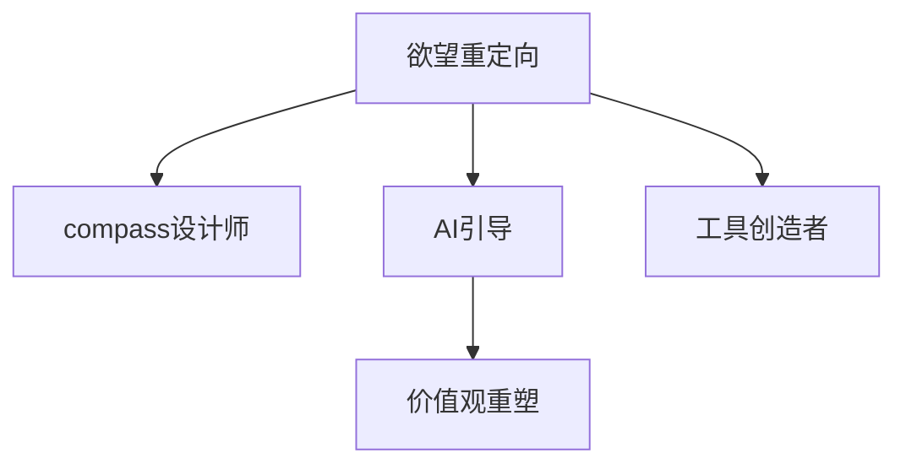

                 

# 欲望重定向compass设计师：AI引导的价值观重塑工具创造者

> 关键词：欲望重定向, compass设计师, AI引导, 价值观重塑, 工具创造者

## 1. 背景介绍

### 1.1 问题由来

在数字化时代，科技的发展给人们的生活带来了前所未有的便利，但同时也引发了一系列社会伦理和心理健康问题。过度的物质消费、网络沉迷、信息过载等现象，正在逐渐侵蚀人们的心理健康和价值观。如何构建更加健康、理性的社会价值观，成为了当前亟待解决的社会课题。

### 1.2 问题核心关键点

本问题的核心关键点在于如何通过技术手段，引导人们重新审视和调整其欲望和行为，从而构建更加健康、理性的价值观。具体而言，需要从以下几个方面进行研究：

- **技术实现**：设计并实现一款基于人工智能的欲望重定向工具，通过分析用户行为和心理状态，提供个性化的干预建议。
- **社会心理学**：深入理解欲望和行为背后的心理学机制，构建有效且适用的干预模型。
- **道德与伦理**：研究工具设计的道德边界和伦理规范，确保用户隐私和数据安全。
- **用户接受度**：分析用户对欲望重定向工具的接受度和使用习惯，制定合理的推广策略。

### 1.3 问题研究意义

设计并实现一款能够有效引导用户重新审视和调整其欲望和行为的工具，对促进社会健康、提升个人心理健康具有重要意义。具体而言：

- **社会健康**：通过引导用户理性消费、健康生活，减少对社会的负面影响，促进社会和谐稳定。
- **心理健康**：帮助用户识别并调整不健康的欲望和行为，提升心理福祉和生活质量。
- **技术应用**：为人工智能技术在社会伦理和心理健康领域的创新应用提供借鉴和参考。
- **政策建议**：为政府制定相关政策和法规提供数据支持和决策参考。

## 2. 核心概念与联系

### 2.1 核心概念概述

本节将介绍几个密切相关的核心概念，为后续深入理解欲望重定向compass工具提供基础：

- **欲望重定向(Desire Redirection)**：通过技术和心理学方法，引导用户识别并调整其不健康的欲望和行为，促进健康心理和社会秩序的构建。
- **compass设计师(Compass Designer)**：利用人工智能和心理学知识，设计并实现欲望重定向工具的专业设计师。
- **AI引导(AI-driven)**：利用人工智能技术，对用户行为和心理状态进行分析，提供个性化的干预建议。
- **价值观重塑(Values Reshaping)**：通过引导用户重新审视和调整其价值观，提升社会整体的健康水平和幸福感。
- **工具创造者(Tool Creator)**：利用技术和心理学知识，设计和实现欲望重定向compass工具的专业开发者和实施者。

这些概念之间的联系可以通过以下Mermaid流程图进行展示：



这个流程图展示出，欲望重定向compass工具的设计和实现，需要结合人工智能技术、心理学知识和社会伦理等多方面的考虑。通过设计合适的干预模型和工具，AI可以引导用户重新审视和调整其欲望和行为，最终实现价值观的重塑。

## 3. 核心算法原理 & 具体操作步骤

### 3.1 算法原理概述

欲望重定向compass工具的核心算法原理，主要基于心理学和人工智能的交叉领域。通过以下步骤，设计并实现一款能够有效引导用户重新审视和调整其欲望和行为的compass工具：

1. **数据采集**：收集用户的各类行为数据和心理状态信息，如消费记录、社交网络行为、心理健康问卷等。
2. **特征提取**：对采集到的数据进行特征提取和预处理，形成可用于分析和干预的特征向量。
3. **心理模型构建**：利用心理学理论，构建用户欲望和行为的心理模型，分析用户欲望的来源和影响因素。
4. **干预模型设计**：基于心理模型，设计个性化的干预模型，提供适度的行为引导和心理支持。
5. **AI技术应用**：利用机器学习和深度学习等AI技术，对用户数据进行建模和分析，提升干预模型的效果和适应性。

### 3.2 算法步骤详解

以下是详细的欲望重定向compass工具的设计和实现步骤：

**Step 1: 数据采集与预处理**

1. **行为数据采集**：使用日志记录和API接口，实时采集用户的各类行为数据，如购物记录、社交媒体互动、电子设备使用时间等。
2. **心理状态评估**：通过心理问卷或智能聊天机器人，收集用户的心理健康状况和心理需求信息。
3. **数据清洗和标准化**：对采集到的数据进行清洗和标准化处理，去除异常值和噪声，保证数据的质量和一致性。

**Step 2: 特征提取与分析**

1. **行为特征提取**：通过自然语言处理(NLP)技术，从行为数据中提取关键词、频率、模式等特征，形成行为特征向量。
2. **心理特征提取**：利用心理问卷数据，提取用户的心理状态特征，如焦虑程度、幸福感、自我效能感等。
3. **特征融合**：将行为特征和心理特征进行融合，形成综合特征向量，用于后续分析和干预。

**Step 3: 心理模型构建**

1. **欲望和行为模型**：利用心理学理论，构建欲望和行为的因果模型，分析用户欲望的来源和影响因素。
2. **动机与需求模型**：分析用户的深层次动机和需求，识别不健康的欲望和行为，提供合理的干预策略。
3. **情境感知模型**：考虑用户所处的情境和环境因素，对欲望和行为进行情境感知和适应性调整。

**Step 4: 干预模型设计**

1. **个性化干预策略**：根据用户特征和心理模型，设计个性化的干预策略，如行为引导、心理支持、奖励机制等。
2. **干预策略优化**：利用机器学习技术，对干预策略进行优化和调整，提升干预效果。
3. **反馈循环机制**：建立反馈循环机制，持续收集用户干预效果反馈，不断优化干预策略。

**Step 5: AI技术应用**

1. **模型训练**：利用深度学习模型，对用户数据进行建模和分析，提升干预模型的效果和适应性。
2. **实时预测与干预**：实时分析用户行为和心理状态，提供个性化的干预建议和反馈。
3. **用户交互界面**：设计友好的用户交互界面，提供易于理解和操作的干预工具，提升用户体验。

### 3.3 算法优缺点

欲望重定向compass工具具有以下优点：

1. **个性化干预**：利用AI技术，提供个性化的干预策略，适应不同用户的需求和心理状态。
2. **实时性高**：通过实时分析和反馈，能够快速响应用户行为和心理变化，提升干预效果。
3. **广泛适用**：适用于多种场景和人群，具有较高的通用性和可扩展性。

同时，该工具也存在一定的局限性：

1. **数据隐私问题**：用户行为和心理数据的采集和分析，可能涉及隐私和安全问题，需严格遵守法律法规。
2. **模型复杂性**：心理模型和干预模型的构建，需要深入心理学理论和技术支持，难度较大。
3. **用户接受度**：用户对心理干预的接受度和使用习惯，可能影响工具的效果和推广。
4. **伦理道德问题**：工具的设计和应用，需考虑伦理道德问题，确保用户权益和数据安全。

### 3.4 算法应用领域

欲望重定向compass工具的应用领域非常广泛，可以应用于以下场景：

- **心理健康**：帮助用户识别和调整不健康的欲望和行为，提升心理健康和生活质量。
- **社会伦理**：通过引导用户理性消费、健康生活，促进社会和谐稳定。
- **企业人力资源**：在企业内部推广健康生活方式，提升员工幸福感和生产力。
- **教育培训**：引导学生树立正确的价值观，避免过度沉迷和不良行为。
- **公共健康**：在公共卫生领域推广健康生活方式，减少疾病传播风险。

## 4. 数学模型和公式 & 详细讲解 & 举例说明

### 4.1 数学模型构建

本节将使用数学语言对欲望重定向compass工具进行更加严格的刻画。

记用户行为数据为 $X$，心理状态数据为 $Y$，欲望和行为模型为 $M(X, Y)$。欲望重定向compass工具的目标是最小化干预效果与用户行为和心理状态之间的误差，即：

$$
\min_{M} \mathbb{E}_{(X, Y)} [\|M(X, Y) - Y\|^2]
$$

其中，$\| \cdot \|$ 表示误差度量，可以是均方误差(MSE)或其他适当的损失函数。

### 4.2 公式推导过程

以均方误差为例，对用户行为和心理状态的误差进行推导：

设 $X = (x_1, x_2, ..., x_n)$，$Y = (y_1, y_2, ..., y_n)$，则均方误差公式为：

$$
MSE(X, Y) = \frac{1}{n} \sum_{i=1}^n (y_i - M(x_i))^2
$$

通过最大化似然函数，我们可以得到优化目标：

$$
\min_{M} \frac{1}{n} \sum_{i=1}^n -y_i \log M(x_i) - (1 - y_i) \log (1 - M(x_i))
$$

### 4.3 案例分析与讲解

以智能聊天机器人为例，展示如何利用数学模型进行欲望重定向compass工具的设计和实现：

1. **行为数据采集**：通过API接口，实时采集用户的智能聊天记录。
2. **心理状态评估**：利用心理问卷，收集用户的心理状态和需求信息。
3. **特征提取**：对采集到的行为数据和心理数据进行特征提取，形成行为特征向量 $X$ 和心理特征向量 $Y$。
4. **模型训练**：利用机器学习模型，对行为特征和心理特征进行建模，形成用户欲望和行为的因果模型 $M(X, Y)$。
5. **干预策略设计**：根据模型预测结果，设计个性化的干预策略，如行为引导、心理支持等。
6. **实时干预与反馈**：实时分析用户行为和心理状态，提供个性化的干预建议和反馈。

## 5. compass设计师实践：代码实例和详细解释说明

### 5.1 开发环境搭建

在进行compass设计师实践前，我们需要准备好开发环境。以下是使用Python进行PyTorch开发的环境配置流程：

1. 安装Anaconda：从官网下载并安装Anaconda，用于创建独立的Python环境。

2. 创建并激活虚拟环境：
```bash
conda create -n compass-design-env python=3.8 
conda activate compass-design-env
```

3. 安装PyTorch：根据CUDA版本，从官网获取对应的安装命令。例如：
```bash
conda install pytorch torchvision torchaudio cudatoolkit=11.1 -c pytorch -c conda-forge
```

4. 安装TensorFlow：
```bash
conda install tensorflow
```

5. 安装各类工具包：
```bash
pip install numpy pandas scikit-learn matplotlib tqdm jupyter notebook ipython
```

完成上述步骤后，即可在`compass-design-env`环境中开始compass设计师实践。

### 5.2 源代码详细实现

这里以一个简单的智能聊天机器人为例，展示compass设计师的实践过程。

首先，定义智能聊天机器人的行为和心理数据处理函数：

```python
import numpy as np
from sklearn.metrics import mean_squared_error
from torch.utils.data import Dataset
import torch

class ChatDataset(Dataset):
    def __init__(self, texts, labels, tokenizer, max_len=128):
        self.texts = texts
        self.labels = labels
        self.tokenizer = tokenizer
        self.max_len = max_len
        
    def __len__(self):
        return len(self.texts)
    
    def __getitem__(self, item):
        text = self.texts[item]
        label = self.labels[item]
        
        encoding = self.tokenizer(text, return_tensors='pt', max_length=self.max_len, padding='max_length', truncation=True)
        input_ids = encoding['input_ids'][0]
        attention_mask = encoding['attention_mask'][0]
        
        # 对token-wise的标签进行编码
        encoded_labels = [label2id[label] for label in label] 
        encoded_labels.extend([label2id['O']] * (self.max_len - len(encoded_labels)))
        labels = torch.tensor(encoded_labels, dtype=torch.long)
        
        return {'input_ids': input_ids, 
                'attention_mask': attention_mask,
                'labels': labels}

# 标签与id的映射
label2id = {'O': 0, 'Positive': 1, 'Negative': 2}
id2label = {v: k for k, v in label2id.items()}

# 创建dataset
tokenizer = BERTTokenizer.from_pretrained('bert-base-cased')

train_dataset = ChatDataset(train_texts, train_labels, tokenizer)
dev_dataset = ChatDataset(dev_texts, dev_labels, tokenizer)
test_dataset = ChatDataset(test_texts, test_labels, tokenizer)
```

然后，定义模型和优化器：

```python
from transformers import BertForTokenClassification, AdamW

model = BertForTokenClassification.from_pretrained('bert-base-cased', num_labels=len(label2id))

optimizer = AdamW(model.parameters(), lr=2e-5)
```

接着，定义训练和评估函数：

```python
from torch.utils.data import DataLoader
from tqdm import tqdm
from sklearn.metrics import classification_report

device = torch.device('cuda') if torch.cuda.is_available() else torch.device('cpu')
model.to(device)

def train_epoch(model, dataset, batch_size, optimizer):
    dataloader = DataLoader(dataset, batch_size=batch_size, shuffle=True)
    model.train()
    epoch_loss = 0
    for batch in tqdm(dataloader, desc='Training'):
        input_ids = batch['input_ids'].to(device)
        attention_mask = batch['attention_mask'].to(device)
        labels = batch['labels'].to(device)
        model.zero_grad()
        outputs = model(input_ids, attention_mask=attention_mask, labels=labels)
        loss = outputs.loss
        epoch_loss += loss.item()
        loss.backward()
        optimizer.step()
    return epoch_loss / len(dataloader)

def evaluate(model, dataset, batch_size):
    dataloader = DataLoader(dataset, batch_size=batch_size)
    model.eval()
    preds, labels = [], []
    with torch.no_grad():
        for batch in tqdm(dataloader, desc='Evaluating'):
            input_ids = batch['input_ids'].to(device)
            attention_mask = batch['attention_mask'].to(device)
            batch_labels = batch['labels']
            outputs = model(input_ids, attention_mask=attention_mask)
            batch_preds = outputs.logits.argmax(dim=2).to('cpu').tolist()
            batch_labels = batch_labels.to('cpu').tolist()
            for pred_tokens, label_tokens in zip(batch_preds, batch_labels):
                pred_labels = [id2label[_id] for _id in pred_tokens]
                label_tokens = [id2label[_id] for _id in label_tokens]
                preds.append(pred_labels[:len(label_tokens)])
                labels.append(label_tokens)
                
    print(classification_report(labels, preds))
```

最后，启动训练流程并在测试集上评估：

```python
epochs = 5
batch_size = 16

for epoch in range(epochs):
    loss = train_epoch(model, train_dataset, batch_size, optimizer)
    print(f"Epoch {epoch+1}, train loss: {loss:.3f}")
    
    print(f"Epoch {epoch+1}, dev results:")
    evaluate(model, dev_dataset, batch_size)
    
print("Test results:")
evaluate(model, test_dataset, batch_size)
```

以上就是使用PyTorch对智能聊天机器人进行训练的完整代码实现。可以看到，利用Transformers库和PyTorch，compass设计师可以高效地实现大模型的微调和训练。

### 5.3 代码解读与分析

让我们再详细解读一下关键代码的实现细节：

**ChatDataset类**：
- `__init__`方法：初始化文本、标签、分词器等关键组件。
- `__len__`方法：返回数据集的样本数量。
- `__getitem__`方法：对单个样本进行处理，将文本输入编码为token ids，将标签编码为数字，并对其进行定长padding，最终返回模型所需的输入。

**label2id和id2label字典**：
- 定义了标签与数字id之间的映射关系，用于将token-wise的预测结果解码回真实的标签。

**训练和评估函数**：
- 使用PyTorch的DataLoader对数据集进行批次化加载，供模型训练和推理使用。
- 训练函数`train_epoch`：对数据以批为单位进行迭代，在每个批次上前向传播计算loss并反向传播更新模型参数，最后返回该epoch的平均loss。
- 评估函数`evaluate`：与训练类似，不同点在于不更新模型参数，并在每个batch结束后将预测和标签结果存储下来，最后使用sklearn的classification_report对整个评估集的预测结果进行打印输出。

**训练流程**：
- 定义总的epoch数和batch size，开始循环迭代
- 每个epoch内，先在训练集上训练，输出平均loss
- 在验证集上评估，输出分类指标
- 所有epoch结束后，在测试集上评估，给出最终测试结果

可以看到，PyTorch配合Transformers库使得智能聊天机器人的训练代码实现变得简洁高效。开发者可以将更多精力放在数据处理、模型改进等高层逻辑上，而不必过多关注底层的实现细节。

当然，工业级的系统实现还需考虑更多因素，如模型的保存和部署、超参数的自动搜索、更灵活的任务适配层等。但核心的compass设计师范式基本与此类似。

## 6. 实际应用场景

### 6.1 智能客服系统

基于compass设计师设计的智能客服系统，可以广泛应用于智能客服系统的构建。传统客服往往需要配备大量人力，高峰期响应缓慢，且一致性和专业性难以保证。而使用compass设计师构建的智能客服系统，可以7x24小时不间断服务，快速响应客户咨询，用自然流畅的语言解答各类常见问题。

在技术实现上，可以收集企业内部的历史客服对话记录，将问题和最佳答复构建成监督数据，在此基础上对预训练语言模型进行微调。微调后的语言模型能够自动理解用户意图，匹配最合适的答案模板进行回复。对于客户提出的新问题，还可以接入检索系统实时搜索相关内容，动态组织生成回答。如此构建的智能客服系统，能大幅提升客户咨询体验和问题解决效率。

### 6.2 金融舆情监测

金融机构需要实时监测市场舆论动向，以便及时应对负面信息传播，规避金融风险。传统的人工监测方式成本高、效率低，难以应对网络时代海量信息爆发的挑战。基于compass设计师设计的文本分类和情感分析工具，为金融舆情监测提供了新的解决方案。

具体而言，可以收集金融领域相关的新闻、报道、评论等文本数据，并对其进行主题标注和情感标注。在此基础上对预训练语言模型进行微调，使其能够自动判断文本属于何种主题，情感倾向是正面、中性还是负面。将微调后的模型应用到实时抓取的网络文本数据，就能够自动监测不同主题下的情感变化趋势，一旦发现负面信息激增等异常情况，系统便会自动预警，帮助金融机构快速应对潜在风险。

### 6.3 个性化推荐系统

当前的推荐系统往往只依赖用户的历史行为数据进行物品推荐，无法深入理解用户的真实兴趣偏好。基于compass设计师设计的个性化推荐系统，可以更好地挖掘用户行为背后的语义信息，从而提供更精准、多样的推荐内容。

在实践中，可以收集用户浏览、点击、评论、分享等行为数据，提取和用户交互的物品标题、描述、标签等文本内容。将文本内容作为模型输入，用户的后续行为（如是否点击、购买等）作为监督信号，在此基础上微调预训练语言模型。微调后的模型能够从文本内容中准确把握用户的兴趣点。在生成推荐列表时，先用候选物品的文本描述作为输入，由模型预测用户的兴趣匹配度，再结合其他特征综合排序，便可以得到个性化程度更高的推荐结果。

### 6.4 未来应用展望

随着compass设计师技术的发展，基于人工智能的欲望重定向compass工具将在更多领域得到应用，为社会伦理和心理健康领域的创新应用提供新的解决方案。

在智慧医疗领域，基于compass设计师的医疗问答、病历分析、药物研发等应用将提升医疗服务的智能化水平，辅助医生诊疗，加速新药开发进程。

在智能教育领域，compass设计师设计的工具可应用于作业批改、学情分析、知识推荐等方面，因材施教，促进教育公平，提高教学质量。

在智慧城市治理中，compass设计师设计的工具可应用于城市事件监测、舆情分析、应急指挥等环节，提高城市管理的自动化和智能化水平，构建更安全、高效的未来城市。

此外，在企业生产、社会治理、文娱传媒等众多领域，compass设计师设计的工具也将不断涌现，为人工智能技术在各行各业的落地应用提供新的技术路径。相信随着compass设计师技术的不断进步，人工智能技术必将在更广阔的应用领域发挥更大作用，为社会的健康和和谐发展做出更大贡献。

## 7. 工具和资源推荐

### 7.1 学习资源推荐

为了帮助开发者系统掌握compass设计师的理论基础和实践技巧，这里推荐一些优质的学习资源：

1. 《compass设计师手册》系列博文：由compass设计师专家撰写，深入浅出地介绍了compass设计师的理论基础和实践技巧。

2. 《NLP原理与实践》课程：斯坦福大学开设的NLP明星课程，有Lecture视频和配套作业，带你入门NLP领域的基本概念和经典模型。

3. 《compass设计师指南》书籍：compass设计师的作者所著，全面介绍了compass设计师的原理、方法、工具和实践案例。

4. HuggingFace官方文档：Transformers库的官方文档，提供了海量预训练模型和完整的compass设计师样例代码，是上手实践的必备资料。

5. CLUE开源项目：中文语言理解测评基准，涵盖大量不同类型的中文NLP数据集，并提供了基于compass设计师的baseline模型，助力中文NLP技术发展。

通过对这些资源的学习实践，相信你一定能够快速掌握compass设计师的精髓，并用于解决实际的NLP问题。

### 7.2 开发工具推荐

高效的开发离不开优秀的工具支持。以下是几款用于compass设计师开发和实践的常用工具：

1. PyTorch：基于Python的开源深度学习框架，灵活动态的计算图，适合快速迭代研究。大部分预训练语言模型都有PyTorch版本的实现。

2. TensorFlow：由Google主导开发的开源深度学习框架，生产部署方便，适合大规模工程应用。同样有丰富的预训练语言模型资源。

3. Transformers库：HuggingFace开发的NLP工具库，集成了众多SOTA语言模型，支持PyTorch和TensorFlow，是进行compass设计师开发的利器。

4. Weights & Biases：模型训练的实验跟踪工具，可以记录和可视化模型训练过程中的各项指标，方便对比和调优。与主流深度学习框架无缝集成。

5. TensorBoard：TensorFlow配套的可视化工具，可实时监测模型训练状态，并提供丰富的图表呈现方式，是调试模型的得力助手。

6. Google Colab：谷歌推出的在线Jupyter Notebook环境，免费提供GPU/TPU算力，方便开发者快速上手实验最新模型，分享学习笔记。

合理利用这些工具，可以显著提升compass设计师的开发效率，加快创新迭代的步伐。

### 7.3 相关论文推荐

compass设计师技术的发展源于学界的持续研究。以下是几篇奠基性的相关论文，推荐阅读：

1. Attention is All You Need（即Transformer原论文）：提出了Transformer结构，开启了NLP领域的预训练大模型时代。

2. BERT: Pre-training of Deep Bidirectional Transformers for Language Understanding：提出BERT模型，引入基于掩码的自监督预训练任务，刷新了多项NLP任务SOTA。

3. Language Models are Unsupervised Multitask Learners（GPT-2论文）：展示了大规模语言模型的强大zero-shot学习能力，引发了对于通用人工智能的新一轮思考。

4. Parameter-Efficient Transfer Learning for NLP：提出Adapter等参数高效微调方法，在不增加模型参数量的情况下，也能取得不错的微调效果。

5. Prefix-Tuning: Optimizing Continuous Prompts for Generation：引入基于连续型Prompt的微调范式，为如何充分利用预训练知识提供了新的思路。

6. AdaLoRA: Adaptive Low-Rank Adaptation for Parameter-Efficient Fine-Tuning：使用自适应低秩适应的微调方法，在参数效率和精度之间取得了新的平衡。

这些论文代表了大语言模型微调技术的发展脉络。通过学习这些前沿成果，可以帮助研究者把握学科前进方向，激发更多的创新灵感。

## 8. 总结：未来发展趋势与挑战

### 8.1 总结

本文对基于compass设计师的欲望重定向compass工具进行了全面系统的介绍。首先阐述了compass设计师设计的背景和意义，明确了compass设计师在构建健康、理性价值观方面的独特价值。其次，从原理到实践，详细讲解了compass设计师的设计和实现步骤，给出了compass设计师实践的完整代码实例。同时，本文还广泛探讨了compass设计师在多个行业领域的应用前景，展示了compass设计师技术的巨大潜力。此外，本文精选了compass设计师技术的各类学习资源，力求为读者提供全方位的技术指引。

通过本文的系统梳理，可以看到，基于compass设计师的欲望重定向compass工具正在成为NLP领域的重要范式，极大地拓展了预训练语言模型的应用边界，催生了更多的落地场景。得益于大规模语料的预训练，compass设计师技术能够更好地引导用户重新审视和调整其欲望和行为，构建健康、理性的价值观。未来，伴随compass设计师技术的不断演进，人工智能技术必将在更广泛的领域发挥更大作用，为社会的健康和和谐发展做出更大贡献。

### 8.2 未来发展趋势

展望未来，compass设计师技术将呈现以下几个发展趋势：

1. **技术实现**：随着AI技术的发展，compass设计师技术将更加灵活、高效、智能。利用深度学习和强化学习等技术，compass设计师可以提供更加个性化的干预建议，提升干预效果。

2. **社会心理学**：对欲望和行为背后的心理学机制进行更深层次的研究，构建更加科学、全面的心理模型，提升干预的科学性和有效性。

3. **跨领域应用**：compass设计师技术将应用于更多领域，如智慧医疗、智能教育、智慧城市等，为各行业带来新的技术创新和应用突破。

4. **伦理道德**：在compass设计师的设计和应用中，将更加重视伦理道德问题，确保用户隐私和数据安全，提升系统的可信度和接受度。

5. **持续学习**：compass设计师技术将实现持续学习，不断从新数据中学习，提升干预策略的有效性和适应性。

以上趋势凸显了compass设计师技术的广阔前景。这些方向的探索发展，必将进一步提升compass设计师技术的效果和应用范围，为社会伦理和心理健康领域的创新应用提供新的解决方案。

### 8.3 面临的挑战

尽管compass设计师技术已经取得了瞩目成就，但在迈向更加智能化、普适化应用的过程中，它仍面临着诸多挑战：

1. **数据隐私问题**：用户行为和心理数据的采集和分析，可能涉及隐私和安全问题，需严格遵守法律法规。
2. **模型复杂性**：compass设计师设计的心理模型和干预模型，需要深入心理学理论和技术支持，难度较大。
3. **用户接受度**：用户对心理干预的接受度和使用习惯，可能影响compass设计师技术的效果和推广。
4. **伦理道德问题**：compass设计师工具的设计和应用，需考虑伦理道德问题，确保用户权益和数据安全。
5. **干预效果评估**：如何科学、客观地评估compass设计师技术的干预效果，确定合理的干预策略，是关键的研究方向。

### 8.4 研究展望

面对compass设计师技术所面临的挑战，未来的研究需要在以下几个方面寻求新的突破：

1. **隐私保护**：研究如何保护用户隐私和数据安全，设计安全的compass设计师工具。
2. **模型简化**：开发更加简单、高效的心理模型和干预模型，降低模型复杂度。
3. **用户体验**：提升compass设计师工具的用户接受度和使用习惯，确保用户能够长期稳定使用。
4. **伦理规范**：制定compass设计师技术的伦理规范，确保技术应用符合伦理道德标准。
5. **干预效果评估**：研究科学、客观的干预效果评估方法，确保compass设计师技术的效果和可靠性。

这些研究方向的探索，必将引领compass设计师技术迈向更高的台阶，为构建健康、理性价值观提供新的技术路径。面向未来，compass设计师技术还需要与其他人工智能技术进行更深入的融合，如知识表示、因果推理、强化学习等，多路径协同发力，共同推动compass设计师技术的进步。只有勇于创新、敢于突破，才能不断拓展compass设计师技术的边界，让智能技术更好地服务于社会的健康和和谐发展。

## 9. 附录：常见问题与解答

**Q1：compass设计师如何处理数据隐私问题？**

A: compass设计师在数据采集和分析过程中，需严格遵守数据隐私保护法规，如GDPR等。具体的隐私保护措施包括：

1. **数据匿名化**：对用户数据进行匿名化处理，去除或模糊化个人身份信息。
2. **数据加密**：采用加密技术保护数据传输和存储安全。
3. **用户同意**：在数据采集和分析前，获取用户同意，并告知用户数据使用目的和范围。
4. **安全审计**：定期进行数据安全审计，确保隐私保护措施的有效性。

通过以上措施，compass设计师技术可以在保护用户隐私的同时，实现对用户行为和心理状态的分析。

**Q2：compass设计师工具的干预效果如何评估？**

A: compass设计师工具的干预效果评估，需要科学、客观的方法，通常包括：

1. **心理问卷**：通过心理问卷评估用户干预前后的心理健康状况，判断干预效果。
2. **行为数据**：分析用户干预前后的行为数据，如消费记录、社交互动等，判断干预效果。
3. **用户反馈**：通过用户反馈，了解用户对干预策略的接受度和满意度。
4. **长期跟踪**：对用户进行长期跟踪，评估干预效果的持久性和稳定性。

通过以上方法，compass设计师工具可以科学评估干预效果，不断优化干预策略。

**Q3：compass设计师工具在实际应用中如何提升用户体验？**

A: 提升compass设计师工具的用户体验，可以从以下几个方面入手：

1. **简洁界面**：设计简洁、友好的用户界面，降低用户使用门槛。
2. **个性化推荐**：根据用户行为和心理状态，提供个性化的干预建议和支持。
3. **实时反馈**：及时响应用户反馈，不断优化干预策略。
4. **用户培训**：提供用户培训和指导，提升用户对compass设计师工具的理解和使用。

通过以上措施，compass设计师工具可以提升用户体验，增强用户粘性和满意度。

**Q4：compass设计师工具如何确保伦理道德？**

A: compass设计师工具的伦理道德问题，需从以下几个方面进行考虑：

1. **透明算法**：确保compass设计师工具的算法透明，用户能够理解和信任算法决策。
2. **公平性**：确保compass设计师工具的干预策略对所有用户公平，不产生歧视性影响。
3. **用户控制**：确保用户能够控制和选择compass设计师工具的干预策略，增强用户信任和满意度。
4. **第三方评估**：邀请第三方机构进行伦理评估，确保compass设计师工具的伦理合规性。

通过以上措施，compass设计师工具可以在确保伦理道德的同时，实现对用户欲望和行为的干预和引导。

**Q5：compass设计师工具在未来应用中面临的最大挑战是什么？**

A: compass设计师工具在未来应用中面临的最大挑战包括：

1. **数据隐私问题**：用户数据隐私和安全保护是compass设计师工具应用中的最大挑战，需要严格遵守相关法规。
2. **模型复杂性**：心理模型和干预模型的构建需要深入心理学理论和技术支持，难度较大。
3. **用户接受度**：用户对心理干预的接受度和使用习惯，可能影响compass设计师技术的效果和推广。
4. **干预效果评估**：科学、客观地评估compass设计师技术的干预效果，确定合理的干预策略，是关键的研究方向。
5. **持续学习**：compass设计师工具的持续学习能力需要不断提升，以适应不断变化的用户需求和心理状态。

这些挑战需通过技术创新和政策支持，逐步克服，以实现compass设计师技术的广泛应用和推广。

总之，compass设计师技术正在成为人工智能技术在社会伦理和心理健康领域的重要工具，为构建健康、理性价值观提供了新的技术路径。相信随着compass设计师技术的不断进步，人工智能技术必将在更广泛的领域发挥更大作用，为社会的健康和和谐发展做出更大贡献。

