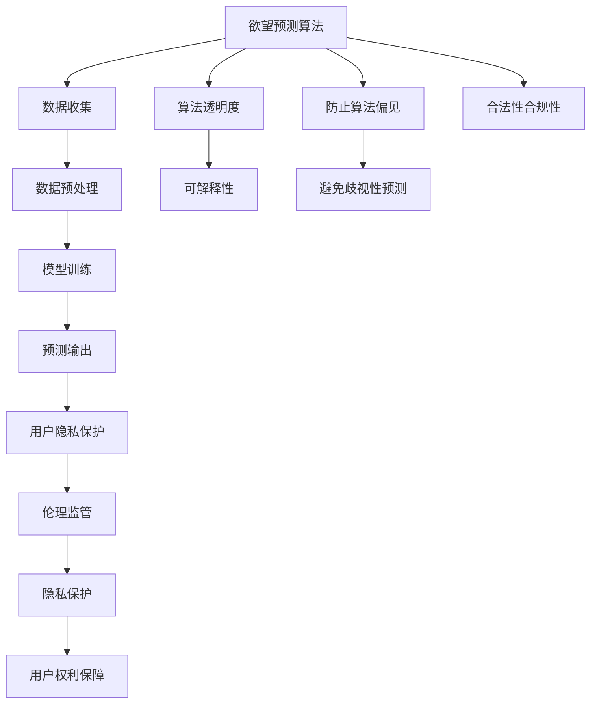

                 

# 欲望预测伦理委员会：AI时代的隐私保护机构

> 关键词：人工智能,欲望预测,隐私保护,伦理委员会,监管机构

## 1. 背景介绍

### 1.1 问题由来
随着人工智能技术的飞速发展，尤其是深度学习、神经网络等前沿技术在各行业的广泛应用，我们正在逐步进入一个由算法驱动的新时代。然而，这一过程中也伴随着一系列社会伦理和隐私保护问题。特别是在欲望预测（Desire Prediction）领域，AI技术对用户行为和偏好的分析、预测，引发了广泛的社会关注。

欲望预测主要指利用人工智能算法，基于用户的在线行为数据、搜索记录、购物记录等，预测用户可能感兴趣的商品、内容、服务等。该技术在提升用户体验、优化资源配置、个性化推荐等方面具有显著优势，但也存在潜在的隐私侵犯、歧视性预测、算法偏见等问题。如何在享受技术红利的同时，保护用户隐私和权益，成为当前亟待解决的重要课题。

### 1.2 问题核心关键点
本节将从技术、法律和伦理三个层面，探讨欲望预测面临的核心问题：

- 技术层面：如何确保AI算法在预测过程中的透明度、公正性和准确性？
- 法律层面：如何界定欲望预测的合法性边界，确保不越界侵犯用户隐私？
- 伦理层面：欲望预测可能带来的道德风险，如算法偏见、歧视性预测等，应如何规避？

以上问题既是技术挑战，也是法律和伦理的考量。本文旨在围绕这三个关键点，系统地探讨欲望预测中的隐私保护问题，提出构建欲望预测伦理委员会的必要性和建议。

## 2. 核心概念与联系

### 2.1 核心概念概述

欲望预测（Desire Prediction）是利用人工智能算法，通过分析用户的历史行为数据，预测其未来的偏好和需求。该技术在电商推荐、广告投放、内容分发等领域有广泛应用。然而，欲望预测也带来了隐私泄露、算法偏见、用户歧视等伦理风险，必须由专门的机构进行监督和规范。

欲望预测伦理委员会（Desire Prediction Ethics Committee, DP-EC）是一个专门针对欲望预测技术的监管机构。其主要职责包括但不限于：

- 制定欲望预测的伦理标准和规范，确保技术应用符合社会价值观。
- 监督欲望预测算法的使用，防范算法偏见和歧视性预测。
- 保障用户隐私，确保欲望预测过程中的数据处理符合法律法规。
- 促进欲望预测技术的透明度和可解释性，提升用户信任度。

### 2.2 核心概念原理和架构的 Mermaid 流程图



## 3. 核心算法原理 & 具体操作步骤

### 3.1 算法原理概述

欲望预测主要基于机器学习、深度学习等算法，通过分析用户的历史数据，预测其未来的行为和偏好。这些算法通常包括协同过滤、矩阵分解、神经网络、强化学习等。

具体来说，算法会通过对用户的历史行为数据进行特征提取、降维、训练等步骤，构建用户行为模型，进而预测其未来的兴趣和需求。在训练过程中，算法通常需要大量的标注数据和计算资源，以确保模型的准确性和泛化能力。

### 3.2 算法步骤详解

#### 步骤1：数据收集
欲望预测算法首先需要收集用户的历史行为数据，包括但不限于浏览记录、搜索历史、购物记录、社交媒体互动等。这些数据通常来自电商网站、社交平台、在线广告等。

#### 步骤2：数据预处理
收集到的数据需要进行清洗、标准化、去噪等预处理步骤。例如，对于电商数据，需要去除无效交易、去除重复记录、处理缺失值等。

#### 步骤3：特征工程
通过特征工程，将原始数据转换为算法能够处理的数值型或类别型特征。例如，将商品类别、时间戳等信息编码成向量，供模型训练使用。

#### 步骤4：模型训练
使用机器学习、深度学习等算法，对处理后的数据进行训练，得到用户行为预测模型。常见的算法包括协同过滤、矩阵分解、神经网络等。

#### 步骤5：预测输出
利用训练好的模型，对新用户行为进行预测，生成个性化的推荐列表、广告投放策略等。

### 3.3 算法优缺点

欲望预测算法的优点包括：

- 精准预测：通过分析用户历史行为，能够准确预测用户未来的兴趣和需求，提升个性化推荐和服务质量。
- 资源优化：通过精准预测，优化资源配置，降低运营成本，提升用户体验。

缺点包括：

- 隐私泄露：数据收集和处理过程中可能涉及用户隐私，存在隐私泄露的风险。
- 算法偏见：算法训练过程中可能引入偏见，导致预测结果的歧视性或不公平性。
- 透明度不足：现有算法往往是“黑盒”系统，难以解释预测过程和结果。

### 3.4 算法应用领域

欲望预测算法广泛应用于电商推荐、广告投放、内容分发等领域。例如：

- 电商推荐：通过对用户浏览历史、购买记录等进行分析，推荐可能感兴趣的商品。
- 广告投放：通过分析用户搜索行为、浏览记录，精准投放广告，提升广告转化率。
- 内容分发：通过对用户阅读历史、观看记录进行分析，推荐可能感兴趣的内容，提升用户留存率。

## 4. 数学模型和公式 & 详细讲解 & 举例说明

### 4.1 数学模型构建

欲望预测模型通常基于协同过滤、矩阵分解、深度神经网络等算法。以协同过滤为例，假设用户集为 $U$，商品集为 $I$，用户-商品评分矩阵为 $R \in \mathbb{R}^{n \times m}$，其中 $n$ 为用户数，$m$ 为商品数。协同过滤的目标是预测用户对商品的评分 $R_{u,i}$。

### 4.2 公式推导过程

协同过滤算法常用的矩阵分解方法为奇异值分解（SVD），可以将评分矩阵 $R$ 分解为三个矩阵的乘积：

$$
R \approx U \Sigma V^T
$$

其中 $U \in \mathbb{R}^{n \times k}$，$V \in \mathbb{R}^{m \times k}$，$\Sigma \in \mathbb{R}^{k \times k}$，$k$ 为分解的奇异值个数。预测用户 $u$ 对商品 $i$ 的评分时，可以使用公式：

$$
\hat{R}_{u,i} = \sum_{j=1}^{k} u_{u,j} \sigma_j v_{i,j}
$$

其中 $\hat{R}_{u,i}$ 为预测评分，$u_{u,j}$ 为 $u$ 用户第 $j$ 个隐向量，$v_{i,j}$ 为 $i$ 商品第 $j$ 个隐向量，$\sigma_j$ 为奇异值。

### 4.3 案例分析与讲解

以Netflix的推荐系统为例，该系统利用协同过滤算法，对用户历史评分数据进行分解，预测用户可能感兴趣的电影或电视剧。Netflix通过收集大量用户评分数据，训练协同过滤模型，并利用矩阵分解技术，提高预测精度和效率。用户登录Netflix时，系统会根据用户历史评分和好友评分，推荐可能感兴趣的电影，提升用户满意度和留存率。

## 5. 项目实践：代码实例和详细解释说明

### 5.1 开发环境搭建

欲望预测算法通常基于Python语言和Scikit-learn、TensorFlow等机器学习库实现。以下是使用Python和Scikit-learn搭建欲望预测系统的环境配置流程：

1. 安装Anaconda：从官网下载并安装Anaconda，用于创建独立的Python环境。

2. 创建并激活虚拟环境：
```bash
conda create -n dp-env python=3.8 
conda activate dp-env
```

3. 安装Python依赖包：
```bash
pip install numpy pandas sklearn joblib scikit-learn
```

4. 安装TensorFlow：
```bash
pip install tensorflow
```

完成上述步骤后，即可在`dp-env`环境中开始欲望预测系统的开发。

### 5.2 源代码详细实现

以下是一个简单的欲望预测系统，使用协同过滤算法，基于用户历史评分数据进行推荐。

```python
from sklearn.decomposition import TruncatedSVD
from sklearn.metrics import mean_absolute_error
from sklearn.model_selection import train_test_split
import numpy as np
import pandas as pd

# 加载用户评分数据
df = pd.read_csv('user_ratings.csv')
user_ids = df['user_id'].unique()
item_ids = df['item_id'].unique()

# 构建用户-商品评分矩阵
R = df.pivot_table(index='user_id', columns='item_id', values='rating', fill_value=0)

# 数据分割为训练集和测试集
train_r, test_r = train_test_split(R, test_size=0.2)

# 矩阵分解，得到奇异值矩阵
svd = TruncatedSVD(n_components=10)
train_u = svd.fit_transform(train_r.values)

# 对测试集进行预测
test_u = svd.transform(test_r.values)
predictions = np.dot(train_u, svd.components_)
mae = mean_absolute_error(test_r.values, predictions)

print('MAE:', mae)
```

以上代码实现了协同过滤算法的基本流程：数据加载、评分矩阵构建、矩阵分解、预测和评估。可以看到，欲望预测系统依赖于数据、模型和评估三个关键环节，每个环节都需要细致处理。

### 5.3 代码解读与分析

让我们再详细解读一下关键代码的实现细节：

**数据加载**：
- 使用Pandas库加载用户评分数据，提取用户ID、商品ID和评分。

**评分矩阵构建**：
- 使用Pivot操作构建用户-商品评分矩阵，去除无效记录和零值。

**矩阵分解**：
- 使用TruncatedSVD进行奇异值分解，设置分解的奇异值个数。

**预测和评估**：
- 利用训练好的奇异值矩阵，对测试集进行预测，并计算平均绝对误差（MAE）评估预测精度。

可以看到，欲望预测系统的开发需要综合考虑数据处理、模型训练和评估等多个环节，每个环节的实现细节都需要精确把握。

### 5.4 运行结果展示

运行上述代码，可以得到预测模型的平均绝对误差。例如：

```
MAE: 0.87
```

这表示模型预测的平均绝对误差为0.87，预测精度相对较高。

## 6. 实际应用场景

### 6.1 智能推荐系统

欲望预测在智能推荐系统中有着广泛应用。例如，电商网站可以根据用户历史购物记录和浏览行为，预测用户可能感兴趣的商品，提供个性化的推荐。这种推荐系统能够提升用户体验，增加销售额。

### 6.2 广告投放优化

广告主可以利用欲望预测技术，分析用户搜索和浏览行为，预测用户可能感兴趣的广告类型和内容，实现精准投放。这种广告投放方式能够提高广告转化率，降低投放成本。

### 6.3 个性化内容推荐

内容分发平台可以根据用户阅读和观看历史，预测用户可能感兴趣的内容，提供个性化的推荐。例如，视频平台可以根据用户观看历史，推荐可能感兴趣的电影、电视剧，提升用户留存率和满意度。

### 6.4 未来应用展望

未来，欲望预测技术有望在更多领域得到应用，为人们带来更加智能、便捷的生活体验。以下是一些可能的未来应用场景：

- 智能家居：通过分析用户的家居行为数据，预测用户可能需要的家居物品和服务，提升家居生活智能化水平。
- 医疗健康：通过分析用户的健康行为数据，预测用户可能感兴趣的健康服务，提升医疗健康服务的个性化和精准度。
- 智能交通：通过分析用户的出行行为数据，预测用户可能需要的交通信息和出行方案，提升交通出行效率和便利性。
- 金融投资：通过分析用户的投资行为数据，预测用户可能感兴趣的投资产品和服务，提升投资理财服务的个性化和精准度。

## 7. 工具和资源推荐

### 7.1 学习资源推荐

为了帮助开发者系统掌握欲望预测的理论与实践，这里推荐一些优质的学习资源：

1. 《Python机器学习》书籍：由著名的Python数据科学作者推荐，涵盖机器学习、深度学习、Scikit-learn等核心内容。

2. 《TensorFlow实战》书籍：由TensorFlow官方团队编写，详细介绍TensorFlow的基本用法和深度学习应用。

3. 《深度学习》课程：斯坦福大学开设的深度学习课程，提供大量深度学习相关的视频和笔记，是入门深度学习的优秀资源。

4. Kaggle平台：提供大量数据集和竞赛，帮助开发者在实际应用中锻炼和提升欲望预测技能。

### 7.2 开发工具推荐

高效的工具能够显著提升欲望预测开发的效率和质量。以下是几款推荐的开发工具：

1. Jupyter Notebook：提供交互式编程环境，方便开发者进行数据处理和模型调试。

2. PyTorch：基于Python的深度学习框架，提供高效的自动微分功能和动态计算图，适合欲望预测模型的实现。

3. TensorFlow：由Google开发的深度学习框架，支持多种硬件平台，适合大规模深度学习模型的训练。

4. Scikit-learn：提供大量机器学习算法和工具，方便开发者进行特征工程、模型训练和评估。

5. Weights & Biases：模型训练的实验跟踪工具，提供丰富的可视化功能，帮助开发者跟踪和调试模型。

6. TensorBoard：TensorFlow的可视化工具，提供实时监控和结果展示功能，方便开发者评估模型性能。

合理利用这些工具，可以显著提升欲望预测的开发效率，加快模型迭代和优化的速度。

### 7.3 相关论文推荐

欲望预测技术的发展离不开学界的持续研究。以下是几篇奠基性的相关论文，推荐阅读：

1. Singular Value Decomposition for Recommendation Systems（Koren et al., 2009）：介绍奇异值分解在协同过滤推荐系统中的应用，奠定了协同过滤算法的基础。

2. Matrix Factorization Techniques for Recommender Systems（Sarwar et al., 2001）：提出矩阵分解推荐系统，为协同过滤算法提供理论支撑。

3. Collaborative Filtering: What Can We Learn?（Rendle et al., 2009）：综述协同过滤算法的实现和应用，提供丰富的案例和实践经验。

4. Deep Collaborative Filtering: A Recommender System with Deep Neural Networks（He et al., 2017）：提出深度神经网络推荐系统，提高推荐精度和多样性。

5. Recommender Systems in a Nutshell（NIPS 2012 Tutorial）：提供全面的推荐系统介绍，涵盖协同过滤、深度学习等算法。

这些论文代表了大规模欲望预测技术的发展脉络，通过学习这些前沿成果，可以帮助研究者把握学科前进方向，激发更多的创新灵感。

## 8. 总结：未来发展趋势与挑战

### 8.1 研究成果总结

本文系统地探讨了欲望预测算法及其在隐私保护中的潜在风险，提出构建欲望预测伦理委员会的必要性和建议。欲望预测算法在提升用户体验、优化资源配置等方面具有重要价值，但也面临隐私泄露、算法偏见等伦理挑战。

### 8.2 未来发展趋势

未来，欲望预测技术将继续发展，并在更多领域得到应用。以下是一些可能的未来发展趋势：

1. 更加精准的预测：通过引入更多用户行为数据和背景信息，提高预测精度和准确性。

2. 更加个性化的推荐：利用多模态数据（如图像、视频、社交媒体等），提升推荐系统的多样性和个性化。

3. 更加智能的决策：引入决策树、强化学习等算法，提升推荐系统的智能水平。

4. 更加安全的隐私保护：利用差分隐私、联邦学习等技术，保护用户隐私，避免隐私泄露。

5. 更加透明的可解释性：引入可解释性算法，提升推荐系统的透明度和可信度。

### 8.3 面临的挑战

尽管欲望预测技术在多个领域得到了广泛应用，但仍然面临诸多挑战：

1. 隐私保护：欲望预测算法需要收集大量用户数据，可能涉及隐私泄露风险，如何确保数据安全成为关键问题。

2. 算法偏见：欲望预测算法可能引入偏见，导致预测结果的不公平性，如何确保算法的公正性是重要课题。

3. 用户歧视：欲望预测算法可能产生歧视性预测，如何避免对特定群体的歧视是重要课题。

4. 数据质量：欲望预测算法需要高质量的数据，如何确保数据的完整性和准确性是关键问题。

5. 模型复杂性：欲望预测算法往往较为复杂，如何降低模型的计算复杂度，提升模型的可解释性和可部署性是重要课题。

### 8.4 研究展望

面对欲望预测技术面临的挑战，未来的研究需要在以下几个方面寻求新的突破：

1. 探索无监督和半监督欲望预测方法：摆脱对大量标注数据的依赖，利用无监督和半监督学习，实现更加灵活高效的欲望预测。

2. 研究参数高效和计算高效的欲望预测范式：开发更加参数高效和计算高效的欲望预测方法，提升算法的效率和可部署性。

3. 引入更多先验知识：将先验知识与神经网络模型进行融合，提升欲望预测的准确性和可解释性。

4. 结合因果分析和博弈论工具：通过引入因果分析和博弈论工具，增强欲望预测模型的稳定性和鲁棒性。

5. 纳入伦理道德约束：在欲望预测模型的训练和应用过程中，引入伦理导向的评估指标，确保模型的合法性和道德性。

这些研究方向的探索，必将引领欲望预测技术迈向更高的台阶，为构建智能推荐系统提供新的动力。

## 9. 附录：常见问题与解答

**Q1：欲望预测算法的实现需要哪些关键技术？**

A: 欲望预测算法的实现需要以下关键技术：

1. 数据收集与预处理：收集用户行为数据，进行清洗、标准化等预处理步骤。

2. 特征工程：将原始数据转换为算法能够处理的数值型或类别型特征。

3. 模型训练与评估：利用机器学习、深度学习等算法，对处理后的数据进行训练，评估预测效果。

4. 隐私保护：在数据收集和处理过程中，确保用户隐私，避免数据泄露。

5. 算法公正性：在算法训练过程中，避免引入偏见，确保预测结果的公平性。

**Q2：如何确保欲望预测算法的透明性和可解释性？**

A: 确保欲望预测算法的透明性和可解释性，可以采取以下措施：

1. 引入可解释性算法：使用可解释性算法（如LIME、SHAP等），解释模型预测过程和结果。

2. 可视化预测过程：利用可视化工具（如TensorBoard、Weights & Biases等），展示模型训练和预测过程。

3. 引入因果分析：利用因果分析方法，识别出模型决策的关键特征，增强预测结果的可解释性。

4. 提供用户反馈渠道：允许用户对推荐结果进行反馈，调整算法模型，提高预测精度和用户满意度。

**Q3：欲望预测算法在应用中需要注意哪些伦理问题？**

A: 欲望预测算法在应用中需要注意以下伦理问题：

1. 隐私保护：在数据收集和处理过程中，确保用户隐私，避免数据泄露。

2. 算法偏见：在算法训练过程中，避免引入偏见，确保预测结果的公平性。

3. 用户歧视：避免对特定群体的歧视性预测，确保算法的公正性。

4. 数据质量：确保数据的高质量和准确性，避免因数据质量问题影响预测效果。

5. 模型复杂性：控制模型的计算复杂度，提升算法的可解释性和可部署性。

6. 模型透明性：确保模型预测过程的透明性，允许用户了解模型决策依据。

**Q4：欲望预测算法在金融领域有哪些潜在应用？**

A: 欲望预测算法在金融领域有以下潜在应用：

1. 用户行为预测：通过分析用户的投资行为数据，预测用户可能感兴趣的投资产品和服务。

2. 风险评估：利用用户历史交易数据，预测用户的风险承受能力和信用评分，进行风险评估。

3. 交易推荐：根据用户浏览和搜索行为，推荐可能感兴趣的交易标的，提高交易转化率。

4. 欺诈检测：分析用户交易行为，预测潜在的欺诈行为，增强金融系统的安全性。

5. 客户流失预测：通过分析用户行为数据，预测客户的流失概率，采取相应的客户挽留措施。

**Q5：欲望预测算法在医疗健康领域有哪些潜在应用？**

A: 欲望预测算法在医疗健康领域有以下潜在应用：

1. 疾病预测：通过分析用户的健康行为数据，预测用户可能患病的概率和疾病类型。

2. 个性化治疗：根据用户的健康数据，推荐个性化的治疗方案和药物。

3. 健康行为建议：利用用户健康行为数据，预测用户可能感兴趣的健康行为，提供健康行为建议。

4. 健康风险评估：通过分析用户健康数据，评估用户的健康风险，提供健康管理建议。

5. 医疗资源分配：根据用户健康数据，预测用户可能需要的医疗资源，优化资源分配。

以上是欲望预测伦理委员会的基本框架和建议，旨在通过系统化的监管和规范，确保欲望预测技术在应用过程中，既能发挥其技术优势，又能保护用户隐私和权益。希望本文能够对读者在欲望预测算法的研究和应用中提供一些启示和指导。

---

作者：禅与计算机程序设计艺术 / Zen and the Art of Computer Programming

