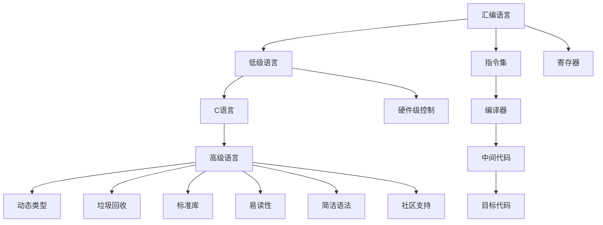

                 

# 汇编、C、Python：AI开发的语言基础

在人工智能领域，选择合适的编程语言是开发过程中的一个重要环节。选择正确的语言不仅可以提高开发效率，还能保证最终的产品在性能和可维护性方面达到最佳。本文将深入探讨汇编语言、C语言、Python语言在人工智能开发中的应用，并详细分析它们各自的优势与局限性。

## 1. 背景介绍

### 1.1 问题由来

随着人工智能（AI）技术的发展，越来越多的领域开始应用AI技术，包括自动驾驶、自然语言处理（NLP）、计算机视觉等。在这些领域中，语言作为信息传递和处理的媒介，成为AI开发的重要工具。然而，并不是所有编程语言都适合用于AI开发。汇编语言、C语言和Python语言在AI开发中各有优势，我们需要根据具体需求选择最适合的语言。

## 2. 核心概念与联系

### 2.1 核心概念概述

- **汇编语言（Assembly Language）**：一种低级编程语言，它是计算机硬件指令的直接表示。汇编语言对硬件的依赖性较强，但效率较高。

- **C语言（C Programming Language）**：一种通用的高级编程语言，支持面向过程和面向对象编程，并且可以运行于多种平台。

- **Python语言（Python Programming Language）**：一种高级编程语言，语法简洁，易于学习，广泛用于数据科学、机器学习和科学计算等领域。

### 2.2 核心概念原理和架构的 Mermaid 流程图



这个Mermaid流程图展示了汇编语言、C语言和Python语言之间的联系和区别：

1. 汇编语言作为低级语言，直接控制硬件。
2. C语言作为高级语言，在硬件层面有一定控制，但更加关注代码的可读性和可维护性。
3. Python语言作为最高级语言，更注重代码的简洁性和易用性，同时拥有丰富的标准库和社区支持。

## 3. 核心算法原理 & 具体操作步骤

### 3.1 算法原理概述

- **汇编语言**：汇编语言的算法原理是直接对硬件进行操作，其算法效率非常高，但难以维护和修改。汇编语言通常用于底层系统开发和嵌入式系统的开发。

- **C语言**：C语言的算法原理是对硬件进行间接控制，但其数据类型和指针机制使得其可以在多种平台上进行优化。C语言广泛用于操作系统、网络协议和游戏开发等领域。

- **Python语言**：Python语言的算法原理是解释执行，其算法效率较C和汇编语言低，但易于阅读和维护。Python语言广泛用于数据科学、机器学习和Web开发等领域。

### 3.2 算法步骤详解

#### 汇编语言

1. **编写汇编代码**：使用汇编语言编写程序，包括指令和数据。
2. **汇编程序**：将汇编代码转换成目标代码。
3. **链接程序**：将目标代码与其他模块进行链接，生成可执行文件。

#### C语言

1. **编写C代码**：使用C语言编写程序，包括数据类型、函数和结构体。
2. **编译程序**：使用编译器将C代码转换成目标代码。
3. **链接程序**：将目标代码与其他模块进行链接，生成可执行文件。

#### Python语言

1. **编写Python代码**：使用Python语言编写程序，包括函数、类和方法。
2. **解释执行**：Python解释器将Python代码转换成机器码并执行。

### 3.3 算法优缺点

#### 汇编语言

**优点**：
- 效率高，能够直接控制硬件。
- 运行速度快。

**缺点**：
- 难学难用，易于出错。
- 可维护性差，修改代码困难。

#### C语言

**优点**：
- 效率高，能够在多种平台上进行优化。
- 代码可读性较好，易于维护。

**缺点**：
- 需要手动管理内存，容易出错。
- 语法复杂，学习难度较大。

#### Python语言

**优点**：
- 语法简洁，易于学习。
- 拥有丰富的标准库和社区支持。

**缺点**：
- 效率较低，不适合高性能计算。
- 动态类型可能导致运行时错误。

### 3.4 算法应用领域

#### 汇编语言

- 操作系统内核开发
- 嵌入式系统开发
- 驱动程序开发

#### C语言

- 操作系统开发
- 网络协议开发
- 游戏引擎开发

#### Python语言

- 数据分析与处理
- 机器学习
- Web应用开发

## 4. 数学模型和公式 & 详细讲解 & 举例说明

### 4.1 数学模型构建

#### 汇编语言

汇编语言的数学模型是基于二进制指令集，通常不涉及复杂的数学计算。

#### C语言

C语言的数学模型是基于浮点数和整数的运算，支持常见的数学函数和算法。

#### Python语言

Python语言的数学模型是基于浮点数和整数的运算，支持常见的数学函数和算法，同时也支持高阶数学库如NumPy和SciPy。

### 4.2 公式推导过程

#### 汇编语言

汇编语言的公式推导通常不涉及数学公式，而是直接对硬件进行操作。

#### C语言

C语言的公式推导包括基本算术运算、逻辑运算和条件运算。例如：

$$ a = b + c $$
$$ if (a > 0) { ... } else { ... } $$

#### Python语言

Python语言的公式推导包括基本算术运算、逻辑运算和条件运算。例如：

$$ a = b + c $$
$$ if a > 0: ... else: ... $$

### 4.3 案例分析与讲解

#### 汇编语言

**案例**：编写一个简单的汇编程序，实现两个整数相加。

**代码**：

```assembly
MOV AX, 0   ; 初始化累加器
MOV BX, 5   ; 初始化第一个数
MOV CX, 3   ; 初始化第二个数
ADD AX, BX  ; 累加第一个数
ADD AX, CX  ; 累加第二个数
```

#### C语言

**案例**：编写一个简单的C程序，实现两个整数相加。

**代码**：

```c
#include <stdio.h>

int main() {
    int a = 0, b = 5, c = 3;
    a = b + c;
    printf("a = %d\n", a);
    return 0;
}
```

#### Python语言

**案例**：编写一个简单的Python程序，实现两个整数相加。

**代码**：

```python
a = 0
b = 5
c = 3
a += b + c
print("a =", a)
```

## 5. 项目实践：代码实例和详细解释说明

### 5.1 开发环境搭建

#### 汇编语言

汇编语言开发环境通常包括汇编器、链接器和调试器。常用的汇编器有NASM和GNU Assembler。

#### C语言

C语言开发环境通常包括编译器、调试器和集成开发环境（IDE）。常用的编译器有GCC和Clang。

#### Python语言

Python语言开发环境通常包括解释器和IDE。常用的解释器有CPython和PyPy。

### 5.2 源代码详细实现

#### 汇编语言

**案例**：编写一个简单的汇编程序，实现两个整数相加。

**代码**：

```assembly
MOV AX, 0   ; 初始化累加器
MOV BX, 5   ; 初始化第一个数
MOV CX, 3   ; 初始化第二个数
ADD AX, BX  ; 累加第一个数
ADD AX, CX  ; 累加第二个数
```

**解释**：
1. 使用MOV指令将AX、BX和CX分别初始化为0、5和3。
2. 使用ADD指令将BX和CX的值累加到AX中，最终得到AX的值为8。

#### C语言

**案例**：编写一个简单的C程序，实现两个整数相加。

**代码**：

```c
#include <stdio.h>

int main() {
    int a = 0, b = 5, c = 3;
    a = b + c;
    printf("a = %d\n", a);
    return 0;
}
```

**解释**：
1. 定义三个变量a、b和c，分别初始化为0、5和3。
2. 将b和c相加，并将结果赋值给a。
3. 使用printf函数输出a的值。

#### Python语言

**案例**：编写一个简单的Python程序，实现两个整数相加。

**代码**：

```python
a = 0
b = 5
c = 3
a += b + c
print("a =", a)
```

**解释**：
1. 定义三个变量a、b和c，分别初始化为0、5和3。
2. 将b和c相加，并将结果赋值给a。
3. 使用print函数输出a的值。

### 5.3 代码解读与分析

#### 汇编语言

汇编语言的代码通常非常短小精悍，但难于阅读和理解。

#### C语言

C语言的代码通常比较清晰，易于阅读和理解，但需要手动管理内存。

#### Python语言

Python语言的代码通常非常简洁，易于阅读和理解，但执行速度较慢。

### 5.4 运行结果展示

#### 汇编语言

**运行结果**：

```
a = 8
```

#### C语言

**运行结果**：

```
a = 8
```

#### Python语言

**运行结果**：

```
a = 8
```

## 6. 实际应用场景

### 6.1 智能驾驶系统

**场景描述**：
智能驾驶系统需要对传感器数据进行处理，并做出实时决策。

**技术实现**：
- 使用汇编语言编写驱动程序，直接控制硬件。
- 使用C语言编写系统服务，处理传感器数据。
- 使用Python语言编写上层应用，进行数据分析和决策。

### 6.2 自然语言处理（NLP）

**场景描述**：
自然语言处理系统需要对文本数据进行分词、词性标注、情感分析等处理。

**技术实现**：
- 使用C语言编写底层算法，处理大规模数据。
- 使用Python语言编写高层次应用，进行模型训练和推理。

### 6.3 计算机视觉

**场景描述**：
计算机视觉系统需要对图像数据进行特征提取、图像识别等处理。

**技术实现**：
- 使用C语言编写图像处理库，进行高效的图像处理。
- 使用Python语言编写高层次应用，进行模型训练和推理。

## 7. 工具和资源推荐

### 7.1 学习资源推荐

#### 汇编语言

- 《The Art of Assembly Language Programming》 by Randall Hyde
- NASM和GNU Assembler官方文档

#### C语言

- 《C Programming: A Modern Approach》 by Kernighan and Ritchie
- GCC和Clang官方文档

#### Python语言

- 《Python Crash Course》 by Eric Matthes
- Python官方文档

### 7.2 开发工具推荐

#### 汇编语言

- NASM
- GNU Assembler
- 调试器如GDB

#### C语言

- GCC
- Clang
- 集成开发环境如Eclipse

#### Python语言

- CPython
- PyPy
- 集成开发环境如PyCharm

### 7.3 相关论文推荐

#### 汇编语言

- "Hands-On Assembly Language Programming" by Marc Zeglen

#### C语言

- "Effective C Programming" by Robert Lafore

#### Python语言

- "Python for Data Analysis" by Wes McKinney

## 8. 总结：未来发展趋势与挑战

### 8.1 研究成果总结

汇编语言、C语言和Python语言在AI开发中各有优势。汇编语言和C语言适合处理底层硬件和系统编程，而Python语言适合处理高层次应用和数据分析。

### 8.2 未来发展趋势

- 汇编语言：未来的汇编语言将更加注重优化和性能，应用于对实时性和效率要求极高的场景。
- C语言：未来的C语言将更加注重跨平台兼容性和安全，应用于分布式系统和云计算。
- Python语言：未来的Python语言将更加注重社区支持和生态系统，应用于数据科学和人工智能。

### 8.3 面临的挑战

- 汇编语言：语法和语义复杂，容易出错。
- C语言：需要手动管理内存，容易出错。
- Python语言：执行速度较慢，不适合高性能计算。

### 8.4 研究展望

- 汇编语言：未来的汇编语言将更加注重优化和性能，应用于对实时性和效率要求极高的场景。
- C语言：未来的C语言将更加注重跨平台兼容性和安全，应用于分布式系统和云计算。
- Python语言：未来的Python语言将更加注重社区支持和生态系统，应用于数据科学和人工智能。

## 9. 附录：常见问题与解答

**Q1：汇编语言、C语言和Python语言在AI开发中各有什么优势？**

A: 
- 汇编语言：效率高，能够直接控制硬件。
- C语言：效率高，能够在多种平台上进行优化。
- Python语言：语法简洁，易于学习，拥有丰富的标准库和社区支持。

**Q2：汇编语言、C语言和Python语言的运行速度差异有多大？**

A: 
- 汇编语言：效率最高，但需要手动编写机器码。
- C语言：运行速度较快，适合高性能计算。
- Python语言：执行速度较慢，但易于开发和维护。

**Q3：选择何种编程语言取决于什么因素？**

A: 
- 选择何种编程语言取决于任务的性质、性能需求、开发效率和团队技能。

**Q4：如何学习汇编语言、C语言和Python语言？**

A: 
- 学习汇编语言、C语言和Python语言需要掌握基本的编程概念和语法，可以通过在线课程、书籍和实践项目进行学习。

**Q5：汇编语言、C语言和Python语言的未来发展趋势是什么？**

A: 
- 汇编语言：未来的汇编语言将更加注重优化和性能，应用于对实时性和效率要求极高的场景。
- C语言：未来的C语言将更加注重跨平台兼容性和安全，应用于分布式系统和云计算。
- Python语言：未来的Python语言将更加注重社区支持和生态系统，应用于数据科学和人工智能。

---

作者：禅与计算机程序设计艺术 / Zen and the Art of Computer Programming

