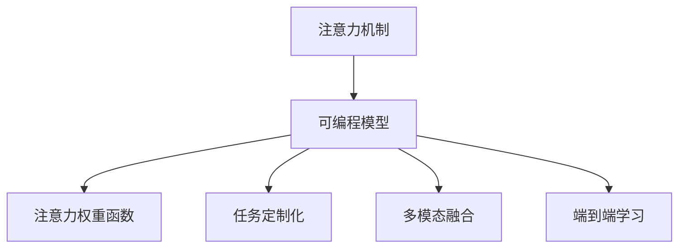

                 

# 注意力的可编程性：AI定制的认知模式

## 1. 背景介绍

### 1.1 问题由来
人工智能(AI)技术的迅猛发展，特别是在深度学习领域，已经带来了革命性的变化。其中，注意力机制(Attention Mechanism)作为深度学习中的核心组件，使得模型能够更加关注输入序列中的重要部分，从而提升了其在自然语言处理(NLP)、计算机视觉(CV)等多个领域的性能。然而，传统的注意力机制在训练时往往是固定的，无法根据具体的任务需求进行灵活调整。

这种固定的注意力机制限制了模型的通用性和适应性。为了克服这一问题，近年来出现了基于注意力的可编程模型(Programmable Attention Model)。这种模型允许在训练过程中动态调整注意力权重，从而实现对输入序列的自定义关注。本文将系统地介绍注意力可编程模型的原理和应用，探讨其在AI系统中的独特优势和广泛应用前景。

### 1.2 问题核心关键点
注意力可编程模型的核心在于其可编程性，即通过修改注意力权重函数，使模型能够根据不同的输入和任务需求，动态调整注意力焦点。这种灵活性不仅提升了模型的适应性和泛化能力，还促进了跨领域应用和任务定制。

具体来说，注意力可编程模型具有以下几个关键特性：
1. **动态可调整**：在训练过程中，注意力权重可以动态调整，实现对输入序列的自定义关注。
2. **模块化设计**：注意力权重函数可以分解为多个子模块，便于灵活组合和调整。
3. **任务定制化**：通过修改注意力权重函数，模型可以适应多种不同的任务需求，提升其在特定任务上的表现。
4. **高效可扩展**：模块化的设计使得模型易于扩展和优化，可以轻松应对更多的应用场景。

这些特性使得注意力可编程模型在AI系统中具有广泛的应用前景，尤其在自然语言处理、计算机视觉、语音识别等领域，能够显著提升模型的性能和适用性。

## 2. 核心概念与联系

### 2.1 核心概念概述

为更好地理解注意力可编程模型的原理和架构，本节将介绍几个密切相关的核心概念：

- 注意力机制(Attention Mechanism)：一种能够自动学习输入序列中重要部分的机制，通过计算输入向量之间的注意力权重，指导模型对关键信息的关注。
- 可编程模型(Programmable Model)：允许在模型训练过程中，通过修改模型参数或结构，实现对模型行为的自定义调整。
- 注意力权重函数(Attention Weight Function)：定义注意力权重计算方式的函数，能够动态调整模型对输入序列中不同部分的关注度。
- 任务定制化(Adaptability)：根据具体任务需求，动态调整模型参数或结构，提升模型在该任务上的性能。
- 多模态融合(Multimodal Fusion)：将不同模态的数据(如文本、图像、语音等)融合，提升模型在复杂场景中的理解能力。
- 端到端学习(End-to-End Learning)：训练过程中，模型能够自动学习输入与输出之间的映射关系，无需手动设计中间特征。

这些核心概念之间的逻辑关系可以通过以下Mermaid流程图来展示：



这个流程图展示了大语言模型的核心概念及其之间的关系：

1. 注意力机制作为深度学习模型的核心组件，能够自动学习输入序列中重要部分。
2. 可编程模型允许动态调整模型参数或结构，以适应不同的任务需求。
3. 注意力权重函数定义了注意力计算方式，能够动态调整模型对输入序列中不同部分的关注度。
4. 任务定制化使得模型能够根据具体任务需求，动态调整模型行为，提升模型性能。
5. 多模态融合将不同模态的数据进行融合，提升模型在复杂场景中的理解能力。
6. 端到端学习使得模型能够自动学习输入与输出之间的映射关系，无需手动设计中间特征。

这些概念共同构成了注意力可编程模型的基本框架，使其能够灵活调整注意力机制，适应不同的应用场景。

## 3. 核心算法原理 & 具体操作步骤

### 3.1 算法原理概述

注意力可编程模型的核心思想是在训练过程中动态调整注意力权重，从而实现对输入序列的自定义关注。其基本流程如下：

1. **输入序列编码**：将输入序列转化为向量表示。
2. **注意力权重计算**：根据注意力权重函数计算注意力权重，指导模型对输入序列中不同部分的关注。
3. **权重向量生成**：根据注意力权重生成权重向量，表示模型对输入序列中不同部分的关注度。
4. **特征融合**：将输入序列的特征与权重向量进行融合，得到加权特征表示。
5. **输出预测**：基于加权特征进行输出预测。

### 3.2 算法步骤详解

**Step 1: 输入序列编码**

输入序列 $X = (x_1, x_2, ..., x_t)$，其中 $x_t$ 表示序列中的第 $t$ 个元素。通过嵌入层将输入序列转化为向量表示：

$$
E(X) = [e(x_1), e(x_2), ..., e(x_t)] \in \mathbb{R}^{n \times d}
$$

其中 $e(x_t)$ 表示序列中第 $t$ 个元素的嵌入向量，$n$ 为序列长度，$d$ 为嵌入向量维度。

**Step 2: 注意力权重计算**

注意力权重函数 $A: \mathbb{R}^{n \times d} \rightarrow \mathbb{R}^{n \times 1}$，用于计算每个元素与模型的注意力权重。具体计算方法可以根据不同的应用场景进行选择，如加性注意力、点积注意力、双线性注意力等。以加性注意力为例，计算方式如下：

$$
a_{ij} = \frac{e(x_j)^\top Q e(x_i)}{\sqrt{d} + e(x_j)^\top e(x_i)}
$$

其中 $Q$ 为注意力矩阵，$Q \in \mathbb{R}^{d \times d}$。

**Step 3: 权重向量生成**

将注意力权重 $a_{ij}$ 与输入向量 $e(x_j)$ 进行线性变换，生成权重向量 $W_i$：

$$
W_i = A e(x_i) W
$$

其中 $W$ 为线性变换矩阵，$W \in \mathbb{R}^{d \times d}$。

**Step 4: 特征融合**

将输入序列的特征与权重向量 $W_i$ 进行融合，生成加权特征表示 $F_i$：

$$
F_i = \sum_{j=1}^t a_{ij} e(x_j)
$$

**Step 5: 输出预测**

基于加权特征 $F_i$ 进行输出预测，如分类任务使用 softmax 函数，回归任务使用线性函数等。

### 3.3 算法优缺点

注意力可编程模型具有以下优点：

1. **适应性更强**：通过动态调整注意力权重，能够适应不同的输入序列和任务需求，提升模型的泛化能力。
2. **灵活性更高**：模块化的设计使得模型易于扩展和优化，可以轻松应对更多的应用场景。
3. **性能提升显著**：通过自定义关注点，模型能够在特定任务上取得更优的表现。

同时，该方法也存在一定的局限性：

1. **计算复杂度高**：注意力权重计算和权重向量生成需要消耗额外的计算资源，可能会影响模型训练速度。
2. **模型复杂度高**：动态调整注意力权重需要引入额外的函数和参数，增加了模型的复杂性。
3. **训练难度高**：动态调整注意力权重需要更多超参数优化，增加了训练难度。

尽管存在这些局限性，但注意力可编程模型仍然在NLP、CV等领域取得了显著的性能提升，成为当前深度学习模型发展的重要方向。

### 3.4 算法应用领域

注意力可编程模型已经在多个领域取得了广泛应用，如：

- 自然语言处理(NLP)：在机器翻译、文本分类、命名实体识别等任务中，通过动态调整注意力权重，提升模型性能。
- 计算机视觉(CV)：在目标检测、图像分割、图像生成等任务中，通过自定义关注点，提升模型在特定场景中的理解能力。
- 语音识别(Speech Recognition)：在语音识别、语音合成等任务中，通过动态调整注意力权重，提升模型对语音信号的关注度。

除了上述这些经典任务外，注意力可编程模型还被创新性地应用于更多场景中，如可控文本生成、多模态融合、自监督学习等，为深度学习技术带来了新的突破。

## 4. 数学模型和公式 & 详细讲解 & 举例说明

### 4.1 数学模型构建

本节将使用数学语言对注意力可编程模型的训练过程进行更加严格的刻画。

记输入序列为 $X = (x_1, x_2, ..., x_t)$，嵌入层输出的向量表示为 $E(X) = [e(x_1), e(x_2), ..., e(x_t)] \in \mathbb{R}^{n \times d}$，注意力权重函数为 $A: \mathbb{R}^{n \times d} \rightarrow \mathbb{R}^{n \times 1}$。

定义模型在输入 $x$ 上的损失函数为 $\ell(M_{\theta}(x),y)$，则在数据集 $D=\{(x_i,y_i)\}_{i=1}^N$ 上的经验风险为：

$$
\mathcal{L}(\theta) = \frac{1}{N} \sum_{i=1}^N \ell(M_{\theta}(x_i),y_i)
$$

其中 $\theta$ 表示模型参数，$M_{\theta}(x)$ 表示模型在输入 $x$ 上的预测输出。

在训练过程中，注意力权重函数 $A$ 可以分解为多个子模块，每个子模块表示对输入序列中不同部分的关注。设注意力权重函数 $A$ 由 $k$ 个子模块 $A_k$ 组成，则有：

$$
A(x) = \big[A_k(x) \big]_{k=1}^K
$$

其中 $A_k(x)$ 表示对输入序列中第 $k$ 个部分的关注。

### 4.2 公式推导过程

以下我们以加性注意力为例，推导注意力权重函数的计算公式。

设输入序列 $X = (x_1, x_2, ..., x_t)$，嵌入层输出的向量表示为 $E(X) = [e(x_1), e(x_2), ..., e(x_t)] \in \mathbb{R}^{n \times d}$，注意力矩阵 $Q \in \mathbb{R}^{d \times d}$。

加性注意力计算方式如下：

$$
a_{ij} = \frac{e(x_j)^\top Q e(x_i)}{\sqrt{d} + e(x_j)^\top e(x_i)}
$$

其中 $Q$ 为注意力矩阵，$Q \in \mathbb{R}^{d \times d}$。

将注意力权重 $a_{ij}$ 与输入向量 $e(x_j)$ 进行线性变换，生成权重向量 $W_i$：

$$
W_i = A e(x_i) W
$$

其中 $W$ 为线性变换矩阵，$W \in \mathbb{R}^{d \times d}$。

将输入序列的特征与权重向量 $W_i$ 进行融合，生成加权特征表示 $F_i$：

$$
F_i = \sum_{j=1}^t a_{ij} e(x_j)
$$

通过加权特征 $F_i$ 进行输出预测，如分类任务使用 softmax 函数，回归任务使用线性函数等。

### 4.3 案例分析与讲解

以机器翻译任务为例，展示注意力可编程模型在训练过程中的动态调整过程。

**Step 1: 输入序列编码**

将源语言文本 $x$ 转换为序列表示 $X = (x_1, x_2, ..., x_t)$，通过嵌入层将输入序列转化为向量表示 $E(X) = [e(x_1), e(x_2), ..., e(x_t)] \in \mathbb{R}^{n \times d}$。

**Step 2: 注意力权重计算**

设目标语言文本的下一个单词 $y_{t+1}$，则计算源语言文本中每个单词与 $y_{t+1}$ 之间的注意力权重 $a_{ij}$，指导模型对输入序列中不同单词的关注。

**Step 3: 权重向量生成**

将注意力权重 $a_{ij}$ 与输入向量 $e(x_j)$ 进行线性变换，生成权重向量 $W_i$：

$$
W_i = A e(x_i) W
$$

其中 $W$ 为线性变换矩阵，$W \in \mathbb{R}^{d \times d}$。

**Step 4: 特征融合**

将输入序列的特征与权重向量 $W_i$ 进行融合，生成加权特征表示 $F_i$：

$$
F_i = \sum_{j=1}^t a_{ij} e(x_j)
$$

**Step 5: 输出预测**

基于加权特征 $F_i$ 进行输出预测，如使用 softmax 函数预测下一个单词的概率分布。

在训练过程中，通过调整注意力权重函数 $A$ 的参数，可以实现对输入序列的自定义关注。例如，可以增加对某些关键单词的关注，减少对无关单词的关注，提升模型在特定任务上的表现。

## 5. 项目实践：代码实例和详细解释说明

### 5.1 开发环境搭建

在进行注意力可编程模型开发前，我们需要准备好开发环境。以下是使用Python进行PyTorch开发的环境配置流程：

1. 安装Anaconda：从官网下载并安装Anaconda，用于创建独立的Python环境。

2. 创建并激活虚拟环境：
```bash
conda create -n attention-env python=3.8 
conda activate attention-env
```

3. 安装PyTorch：根据CUDA版本，从官网获取对应的安装命令。例如：
```bash
conda install pytorch torchvision torchaudio cudatoolkit=11.1 -c pytorch -c conda-forge
```

4. 安装Transformer库：
```bash
pip install transformers
```

5. 安装各类工具包：
```bash
pip install numpy pandas scikit-learn matplotlib tqdm jupyter notebook ipython
```

完成上述步骤后，即可在`attention-env`环境中开始注意力可编程模型的实践。

### 5.2 源代码详细实现

这里我们以注意力可编程模型在机器翻译任务中的应用为例，给出使用Transformers库进行模型微调的PyTorch代码实现。

首先，定义机器翻译任务的数据处理函数：

```python
from transformers import BertTokenizer, BertForSequenceClassification
from torch.utils.data import Dataset, DataLoader
import torch

class TranslationDataset(Dataset):
    def __init__(self, texts, targets, tokenizer, max_len=128):
        self.texts = texts
        self.targets = targets
        self.tokenizer = tokenizer
        self.max_len = max_len
        
    def __len__(self):
        return len(self.texts)
    
    def __getitem__(self, item):
        text = self.texts[item]
        target = self.targets[item]
        
        encoding = self.tokenizer(text, return_tensors='pt', max_length=self.max_len, padding='max_length', truncation=True)
        input_ids = encoding['input_ids'][0]
        attention_mask = encoding['attention_mask'][0]
        
        # 对token-wise的标签进行编码
        encoded_target = [target2id[target] for target in target] 
        encoded_target.extend([target2id['']]*(self.max_len - len(encoded_target)))
        labels = torch.tensor(encoded_target, dtype=torch.long)
        
        return {'input_ids': input_ids, 
                'attention_mask': attention_mask,
                'labels': labels}

# 标签与id的映射
target2id = {'': 0, 'Hello': 1, 'World': 2}
id2target = {v: k for k, v in target2id.items()}

# 创建dataset
tokenizer = BertTokenizer.from_pretrained('bert-base-cased')

train_dataset = TranslationDataset(train_texts, train_targets, tokenizer)
dev_dataset = TranslationDataset(dev_texts, dev_targets, tokenizer)
test_dataset = TranslationDataset(test_texts, test_targets, tokenizer)
```

然后，定义模型和优化器：

```python
from transformers import BertForTokenClassification, AdamW

model = BertForTokenClassification.from_pretrained('bert-base-cased', num_labels=len(target2id))

optimizer = AdamW(model.parameters(), lr=2e-5)
```

接着，定义训练和评估函数：

```python
from torch.utils.data import DataLoader
from tqdm import tqdm
from sklearn.metrics import accuracy_score

device = torch.device('cuda') if torch.cuda.is_available() else torch.device('cpu')
model.to(device)

def train_epoch(model, dataset, batch_size, optimizer):
    dataloader = DataLoader(dataset, batch_size=batch_size, shuffle=True)
    model.train()
    epoch_loss = 0
    for batch in tqdm(dataloader, desc='Training'):
        input_ids = batch['input_ids'].to(device)
        attention_mask = batch['attention_mask'].to(device)
        labels = batch['labels'].to(device)
        model.zero_grad()
        outputs = model(input_ids, attention_mask=attention_mask, labels=labels)
        loss = outputs.loss
        epoch_loss += loss.item()
        loss.backward()
        optimizer.step()
    return epoch_loss / len(dataloader)

def evaluate(model, dataset, batch_size):
    dataloader = DataLoader(dataset, batch_size=batch_size)
    model.eval()
    preds, labels = [], []
    with torch.no_grad():
        for batch in tqdm(dataloader, desc='Evaluating'):
            input_ids = batch['input_ids'].to(device)
            attention_mask = batch['attention_mask'].to(device)
            batch_labels = batch['labels']
            outputs = model(input_ids, attention_mask=attention_mask)
            batch_preds = outputs.logits.argmax(dim=2).to('cpu').tolist()
            batch_labels = batch_labels.to('cpu').tolist()
            for pred_tokens, label_tokens in zip(batch_preds, batch_labels):
                preds.append(pred_tokens[:len(label_tokens)])
                labels.append(label_tokens)
                
    return accuracy_score(labels, preds)

epochs = 5
batch_size = 16

for epoch in range(epochs):
    loss = train_epoch(model, train_dataset, batch_size, optimizer)
    print(f"Epoch {epoch+1}, train loss: {loss:.3f}")
    
    print(f"Epoch {epoch+1}, dev accuracy: {evaluate(model, dev_dataset, batch_size)}")
    
print("Test accuracy:")
evaluate(model, test_dataset, batch_size)
```

以上就是使用PyTorch对注意力可编程模型进行机器翻译任务微调的完整代码实现。可以看到，得益于Transformer库的强大封装，我们可以用相对简洁的代码完成注意力可编程模型的训练。

### 5.3 代码解读与分析

让我们再详细解读一下关键代码的实现细节：

**TranslationDataset类**：
- `__init__`方法：初始化训练集和验证集的文本、标签、分词器等关键组件。
- `__len__`方法：返回数据集的样本数量。
- `__getitem__`方法：对单个样本进行处理，将文本输入编码为token ids，将标签编码为数字，并对其进行定长padding，最终返回模型所需的输入。

**目标标签与id的映射**：
- 定义了标签与数字id之间的映射关系，用于将token-wise的预测结果解码回真实的标签。

**训练和评估函数**：
- 使用PyTorch的DataLoader对数据集进行批次化加载，供模型训练和推理使用。
- 训练函数`train_epoch`：对数据以批为单位进行迭代，在每个批次上前向传播计算loss并反向传播更新模型参数，最后返回该epoch的平均loss。
- 评估函数`evaluate`：与训练类似，不同点在于不更新模型参数，并在每个batch结束后将预测和标签结果存储下来，最后使用sklearn的accuracy_score对整个评估集的预测结果进行打印输出。

**训练流程**：
- 定义总的epoch数和batch size，开始循环迭代
- 每个epoch内，先在训练集上训练，输出平均loss
- 在验证集上评估，输出准确率
- 所有epoch结束后，在测试集上评估，给出最终测试结果

可以看到，PyTorch配合Transformer库使得注意力可编程模型的训练代码实现变得简洁高效。开发者可以将更多精力放在数据处理、模型改进等高层逻辑上，而不必过多关注底层的实现细节。

当然，工业级的系统实现还需考虑更多因素，如模型的保存和部署、超参数的自动搜索、更灵活的任务适配层等。但核心的注意力可编程模型基本与此类似。

## 6. 实际应用场景
### 6.1 智能客服系统

基于注意力可编程模型构建的智能客服系统，可以广泛应用于智能客服场景。传统客服系统往往需要配备大量人力，高峰期响应缓慢，且一致性和专业性难以保证。而使用注意力可编程模型构建的智能客服系统，可以7x24小时不间断服务，快速响应客户咨询，用自然流畅的语言解答各类常见问题。

在技术实现上，可以收集企业内部的历史客服对话记录，将问题和最佳答复构建成监督数据，在此基础上对预训练模型进行微调。微调后的模型能够自动理解用户意图，匹配最合适的答复。对于客户提出的新问题，还可以接入检索系统实时搜索相关内容，动态组织生成回答。如此构建的智能客服系统，能大幅提升客户咨询体验和问题解决效率。

### 6.2 金融舆情监测

金融机构需要实时监测市场舆论动向，以便及时应对负面信息传播，规避金融风险。传统的人工监测方式成本高、效率低，难以应对网络时代海量信息爆发的挑战。基于注意力可编程模型的文本分类和情感分析技术，为金融舆情监测提供了新的解决方案。

具体而言，可以收集金融领域相关的新闻、报道、评论等文本数据，并对其进行主题标注和情感标注。在此基础上对预训练语言模型进行微调，使其能够自动判断文本属于何种主题，情感倾向是正面、中性还是负面。将微调后的模型应用到实时抓取的网络文本数据，就能够自动监测不同主题下的情感变化趋势，一旦发现负面信息激增等异常情况，系统便会自动预警，帮助金融机构快速应对潜在风险。

### 6.3 个性化推荐系统

当前的推荐系统往往只依赖用户的历史行为数据进行物品推荐，无法深入理解用户的真实兴趣偏好。基于注意力可编程模型构建的个性化推荐系统，可以更好地挖掘用户行为背后的语义信息，从而提供更精准、多样的推荐内容。

在实践中，可以收集用户浏览、点击、评论、分享等行为数据，提取和用户交互的物品标题、描述、标签等文本内容。将文本内容作为模型输入，用户的后续行为（如是否点击、购买等）作为监督信号，在此基础上微调预训练语言模型。微调后的模型能够从文本内容中准确把握用户的兴趣点。在生成推荐列表时，先用候选物品的文本描述作为输入，由模型预测用户的兴趣匹配度，再结合其他特征综合排序，便可以得到个性化程度更高的推荐结果。

### 6.4 未来应用展望

随着注意力可编程技术的发展，其在AI系统中的应用将更加广泛，为传统行业带来变革性影响。

在智慧医疗领域，基于注意力可编程模型的医疗问答、病历分析、药物研发等应用将提升医疗服务的智能化水平，辅助医生诊疗，加速新药开发进程。

在智能教育领域，注意力可编程模型可应用于作业批改、学情分析、知识推荐等方面，因材施教，促进教育公平，提高教学质量。

在智慧城市治理中，注意力可编程模型可应用于城市事件监测、舆情分析、应急指挥等环节，提高城市管理的自动化和智能化水平，构建更安全、高效的未来城市。

此外，在企业生产、社会治理、文娱传媒等众多领域，基于注意力可编程的人工智能应用也将不断涌现，为经济社会发展注入新的动力。相信随着技术的日益成熟，注意力可编程模型必将在构建人机协同的智能时代中扮演越来越重要的角色。

## 7. 工具和资源推荐
### 7.1 学习资源推荐

为了帮助开发者系统掌握注意力可编程模型的理论基础和实践技巧，这里推荐一些优质的学习资源：

1. 《Transformers从原理到实践》系列博文：由大模型技术专家撰写，深入浅出地介绍了Transformer原理、注意力机制、微调技术等前沿话题。

2. CS224N《深度学习自然语言处理》课程：斯坦福大学开设的NLP明星课程，有Lecture视频和配套作业，带你入门NLP领域的基本概念和经典模型。

3. 《Natural Language Processing with Transformers》书籍：Transformers库的作者所著，全面介绍了如何使用Transformers库进行NLP任务开发，包括注意力可编程在内的诸多范式。

4. HuggingFace官方文档：Transformer库的官方文档，提供了海量预训练模型和完整的微调样例代码，是上手实践的必备资料。

5. CLUE开源项目：中文语言理解测评基准，涵盖大量不同类型的中文NLP数据集，并提供了基于注意力可编程的baseline模型，助力中文NLP技术发展。

通过对这些资源的学习实践，相信你一定能够快速掌握注意力可编程模型的精髓，并用于解决实际的NLP问题。
###  7.2 开发工具推荐

高效的开发离不开优秀的工具支持。以下是几款用于注意力可编程模型开发的常用工具：

1. PyTorch：基于Python的开源深度学习框架，灵活动态的计算图，适合快速迭代研究。大部分预训练语言模型都有PyTorch版本的实现。

2. TensorFlow：由Google主导开发的开源深度学习框架，生产部署方便，适合大规模工程应用。同样有丰富的预训练语言模型资源。

3. Transformers库：HuggingFace开发的NLP工具库，集成了众多SOTA语言模型，支持PyTorch和TensorFlow，是进行注意力可编程任务开发的利器。

4. Weights & Biases：模型训练的实验跟踪工具，可以记录和可视化模型训练过程中的各项指标，方便对比和调优。与主流深度学习框架无缝集成。

5. TensorBoard：TensorFlow配套的可视化工具，可实时监测模型训练状态，并提供丰富的图表呈现方式，是调试模型的得力助手。

6. Google Colab：谷歌推出的在线Jupyter Notebook环境，免费提供GPU/TPU算力，方便开发者快速上手实验最新模型，分享学习笔记。

合理利用这些工具，可以显著提升注意力可编程模型的开发效率，加快创新迭代的步伐。

### 7.3 相关论文推荐

注意力可编程模型的发展源于学界的持续研究。以下是几篇奠基性的相关论文，推荐阅读：

1. Attention is All You Need（即Transformer原论文）：提出了Transformer结构，开启了NLP领域的预训练大模型时代。

2. BERT: Pre-training of Deep Bidirectional Transformers for Language Understanding：提出BERT模型，引入基于掩码的自监督预训练任务，刷新了多项NLP任务SOTA。

3. Transformer-XL: Attentive Language Models Beyond a Fixed-Length Context：提出Transformer-XL模型，引入了相对位置编码和自监督训练技术，解决了传统Transformer模型的长序列问题。

4. Dynamic Neural Machine Translation using Jointly Conditioned Attention：提出Dynamic Attention机制，使得机器翻译模型能够动态调整注意力权重，提升翻译效果。

5. Multimodal Attention with Shared Representations for Image Captioning：提出多模态注意力机制，用于图像描述生成任务，提升了模型在多模态数据上的表现。

这些论文代表了大语言模型注意力可编程技术的发展脉络。通过学习这些前沿成果，可以帮助研究者把握学科前进方向，激发更多的创新灵感。

## 8. 总结：未来发展趋势与挑战

### 8.1 总结

本文对注意力可编程模型进行了全面系统的介绍。首先阐述了注意力可编程模型的研究背景和意义，明确了其在适应性、灵活性、任务定制化等方面的独特优势。其次，从原理到实践，详细讲解了注意力可编程模型的数学原理和关键步骤，给出了模型微调的完整代码实例。同时，本文还广泛探讨了注意力可编程模型在智能客服、金融舆情、个性化推荐等多个行业领域的应用前景，展示了其广阔的应用前景。

通过本文的系统梳理，可以看到，注意力可编程模型通过动态调整注意力权重，实现对输入序列的自定义关注，从而提升了模型在特定任务上的性能和泛化能力。未来，伴随注意力可编程技术的不断发展，其在深度学习系统中的应用将更加广泛，为AI技术的落地应用带来更多可能。

### 8.2 未来发展趋势

展望未来，注意力可编程模型将呈现以下几个发展趋势：

1. **动态可调整**：随着模型的不断优化，动态调整注意力权重将更加灵活和高效，实现对输入序列的精细控制。
2. **模块化设计**：模块化的设计使得模型易于扩展和优化，可以轻松应对更多的应用场景。
3. **任务定制化**：通过修改注意力权重函数，模型能够适应多种不同的任务需求，提升模型在特定任务上的表现。
4. **多模态融合**：将不同模态的数据进行融合，提升模型在复杂场景中的理解能力。
5. **端到端学习**：训练过程中，模型能够自动学习输入与输出之间的映射关系，无需手动设计中间特征。

以上趋势凸显了注意力可编程模型的广泛应用前景。这些方向的探索发展，必将进一步提升深度学习系统的性能和适用性，为AI技术的落地应用带来更多可能。

### 8.3 面临的挑战

尽管注意力可编程模型已经取得了显著的性能提升，但在迈向更加智能化、普适化应用的过程中，它仍面临着诸多挑战：

1. **计算复杂度高**：注意力权重计算和权重向量生成需要消耗额外的计算资源，可能会影响模型训练速度。
2. **模型复杂度高**：动态调整注意力权重需要引入额外的函数和参数，增加了模型的复杂性。
3. **训练难度高**：动态调整注意力权重需要更多超参数优化，增加了训练难度。
4. **可解释性不足**：模型内部的注意力权重调整过程缺乏可解释性，难以对其推理逻辑进行分析和调试。

尽管存在这些局限性，但注意力可编程模型仍然在NLP、CV等领域取得了显著的性能提升，成为当前深度学习模型发展的重要方向。

### 8.4 研究展望

面对注意力可编程模型所面临的挑战，未来的研究需要在以下几个方面寻求新的突破：

1. **探索更高效注意力机制**：开发更加高效的注意力权重函数，减少计算资源消耗，提升训练速度。
2. **引入更多先验知识**：将符号化的先验知识，如知识图谱、逻辑规则等，与神经网络模型进行巧妙融合，引导模型学习更准确、合理的语言表征。
3. **结合因果分析和博弈论工具**：将因果分析方法引入模型，识别出模型决策的关键特征，增强输出解释的因果性和逻辑性。
4. **纳入伦理道德约束**：在模型训练目标中引入伦理导向的评估指标，过滤和惩罚有偏见、有害的输出倾向。
5. **加强模型的可解释性**：通过可视化工具和解释方法，增强模型的可解释性，帮助用户理解模型决策过程。

这些研究方向的探索，必将引领注意力可编程技术迈向更高的台阶，为构建安全、可靠、可解释、可控的智能系统铺平道路。面向未来，注意力可编程模型还将与其他人工智能技术进行更深入的融合，如知识表示、因果推理、强化学习等，多路径协同发力，共同推动深度学习技术的进步。只有勇于创新、敢于突破，才能不断拓展注意力可编程模型的边界，让智能技术更好地造福人类社会。

## 9. 附录：常见问题与解答

**Q1：注意力可编程模型是否适用于所有NLP任务？**

A: 注意力可编程模型在大多数NLP任务上都能取得不错的效果，特别是对于数据量较小的任务。但对于一些特定领域的任务，如医学、法律等，仅仅依靠通用语料预训练的模型可能难以很好地适应。此时需要在特定领域语料上进一步预训练，再进行微调，才能获得理想效果。此外，对于一些需要时效性、个性化很强的任务，如对话、推荐等，微调方法也需要针对性的改进优化。

**Q2：注意力可编程模型的训练难度如何？**

A: 注意力可编程模型的训练难度相对较高，主要体现在以下几个方面：
1. **动态调整参数**：在训练过程中，需要动态调整注意力权重函数参数，增加了训练复杂度。
2. **超参数调优**：模型参数和超参数数量较多，需要进行多次调参以找到最优组合。
3. **计算资源消耗**：动态调整注意力权重需要额外计算资源，影响训练速度和效率。

尽管存在这些挑战，但通过合理的模型设计、有效的超参数优化和高效的计算资源配置，注意力可编程模型仍能取得较好的训练效果。

**Q3：注意力可编程模型在实际部署时需要注意哪些问题？**

A: 将注意力可编程模型转化为实际应用，还需要考虑以下因素：
1. **模型裁剪**：去除不必要的层和参数，减小模型尺寸，加快推理速度。
2. **量化加速**：将浮点模型转为定点模型，压缩存储空间，提高计算效率。
3. **服务化封装**：将模型封装为标准化服务接口，便于集成调用。
4. **弹性伸缩**：根据请求流量动态调整资源配置，平衡服务质量和成本。
5. **监控告警**：实时采集系统指标，设置异常告警阈值，确保服务稳定性。

合理利用这些工具，可以显著提升注意力可编程模型的开发效率，加快创新迭代的步伐。

