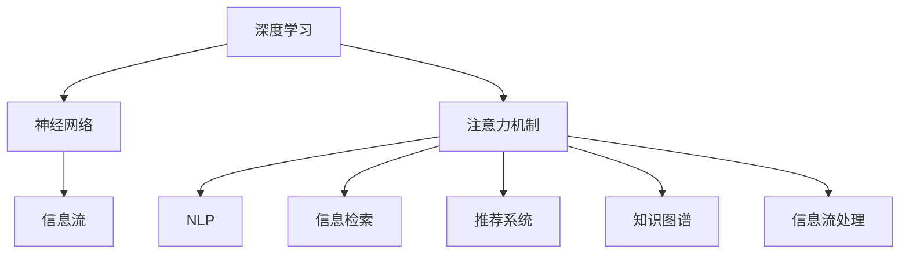

                 

# 注意力的生态系统：AI时代的信息流

> 关键词：注意力, 深度学习, 神经网络, 自然语言处理(NLP), 信息检索, 推荐系统, 知识图谱, 信息流, 机器学习

## 1. 背景介绍

### 1.1 问题由来

在当前信息爆炸的AI时代，如何高效处理和利用海量信息，成为决定人工智能技术落地应用的重要一环。注意力机制（Attention Mechanism）作为一种基于深度学习的机制，广泛应用于各种AI模型中，以增强信息处理和决策能力。本研究旨在通过深入分析注意力机制的生态系统，探讨其在信息流处理中的关键作用，为构建智能信息流系统提供理论和技术指导。

### 1.2 问题核心关键点

注意力机制在深度学习中扮演了重要角色，其核心原理在于：在处理序列数据时，通过动态地计算并分配权重，将模型聚焦于关键特征或上下文信息，从而提高模型的精准性和效率。这一机制广泛应用于自然语言处理(NLP)、信息检索、推荐系统等多个领域，成为构建智能信息流系统的关键技术之一。

本文将从注意力机制的基本原理出发，通过丰富的案例和实际应用，详细探讨其在信息流处理中的具体应用，并提出未来发展的方向和挑战。

## 2. 核心概念与联系

### 2.1 核心概念概述

为更好地理解注意力机制，本节将介绍几个密切相关的核心概念：

- 深度学习（Deep Learning）：一种基于神经网络的学习方法，通过多层次的非线性映射，实现从原始数据中自动学习特征表示。
- 注意力机制（Attention Mechanism）：一种机制，用于动态地对序列数据中的不同位置分配不同权重，从而捕捉序列中关键的局部和全局信息。
- 神经网络（Neural Network）：由多个神经元组成的计算模型，用于模拟人脑的信息处理和决策过程。
- 自然语言处理（NLP）：涉及计算机和人类语言之间交互的技术，包括文本分类、机器翻译、情感分析、问答系统等。
- 信息检索（Information Retrieval）：从大量数据中检索相关信息的技术，如搜索引擎、推荐系统等。
- 推荐系统（Recommender System）：根据用户的历史行为和偏好，自动推荐感兴趣的信息或商品的技术。
- 知识图谱（Knowledge Graph）：以图形结构表示实体及其关系的知识库，用于提升模型的语义理解和推理能力。
- 信息流（Information Stream）：指连续动态的信息流，其典型代表是社交媒体、新闻网站等。

这些概念之间的逻辑关系可以通过以下Mermaid流程图来展示：



这个流程图展示了大语言模型的核心概念及其之间的关系：

1. 深度学习提供了神经网络这一计算模型。
2. 神经网络中应用了注意力机制，使得模型能动态地关注输入数据中的关键特征。
3. 注意力机制广泛应用于NLP、信息检索、推荐系统等多个领域，用于提升模型的性能。
4. 信息流处理需要上述技术支持，使得信息流系统能够智能地检索、推荐、生成信息。

## 3. 核心算法原理 & 具体操作步骤
### 3.1 算法原理概述

注意力机制的本质是利用动态权重对输入数据的不同部分赋予不同的重要性。在深度学习中，注意力机制可以通过软注意力（Soft Attention）或硬注意力（Hard Attention）实现，但软注意力更加常见。软注意力的计算公式通常为：

$$
\alpha_i = \frac{\exp(e_i^T W)}{\sum_{j=1}^N \exp(e_j^T W)}
$$

其中 $e_i$ 为每个位置的信息向量，$W$ 为注意力权重矩阵，$\alpha_i$ 为该位置的信息权重。注意力机制的目标是通过这一公式计算得到每个位置的重要性，使得模型能够将更多注意力集中在关键信息上。

### 3.2 算法步骤详解

基于注意力机制的深度学习模型一般包括以下几个步骤：

**Step 1: 准备数据集**
- 收集并预处理训练数据集，包含文本、图像、音频等多种类型。
- 使用向量表示方法，如词向量、图像卷积等，将数据转换为模型可以处理的形式。

**Step 2: 初始化模型参数**
- 初始化模型参数，包括神经网络权重和注意力权重矩阵等。

**Step 3: 计算注意力权重**
- 通过计算每一步的注意力权重，将模型聚焦于当前位置的关键特征。

**Step 4: 更新信息表示**
- 根据注意力权重，更新每个位置的信息表示，使其反映当前上下文信息。

**Step 5: 输出预测结果**
- 将信息表示输入到输出层，得到最终的预测结果，如分类标签、生成文本等。

**Step 6: 反向传播更新参数**
- 通过反向传播算法，计算模型预测与实际结果之间的误差，并更新模型参数以减少误差。

### 3.3 算法优缺点

注意力机制在深度学习中具有以下优点：
1. 提升模型性能。通过动态权重，增强模型捕捉序列中重要信息的精确性和效率。
2. 增强模型鲁棒性。不同数据来源的信息权重不同，有助于减少噪声干扰。
3. 适应性强。可应用于多种类型的数据，如文本、图像、音频等。
4. 可解释性强。注意力权重可以直观展示模型聚焦的关键信息，便于理解模型决策过程。

同时，注意力机制也存在一些局限性：
1. 计算复杂度高。随着输入序列长度的增加，计算复杂度呈指数级增长。
2. 资源消耗大。需大量内存和计算资源进行权重计算。
3. 对抗样本易受攻击。模型可能对输入数据的微小扰动敏感，影响决策结果。
4. 信息偏差。由于模型设计，可能更偏向关注某些信息，忽视其他重要特征。

### 3.4 算法应用领域

注意力机制在多个领域中得到了广泛应用，具体如下：

- 自然语言处理（NLP）：在机器翻译、文本分类、情感分析、问答系统等任务中，通过注意力机制提升模型对上下文信息的捕捉能力。
- 图像处理：在目标检测、图像分割、图像生成等任务中，通过注意力机制捕捉图像中关键的区域和特征。
- 语音识别：在语音转文本、说话人识别、情感识别等任务中，通过注意力机制捕捉语音信号中的关键特征。
- 推荐系统：在商品推荐、内容推荐、广告推荐等任务中，通过注意力机制捕捉用户行为中的关键特征。
- 信息检索：在搜索引擎、文本检索、问答系统等任务中，通过注意力机制优化信息检索算法。

## 4. 数学模型和公式 & 详细讲解  
### 4.1 数学模型构建

在深度学习中，注意力机制的计算模型通常包括两部分：编码器（Encoder）和解码器（Decoder）。编码器将输入数据转换为一系列高维向量，解码器根据这些向量生成输出。注意力机制用于计算编码器和解码器之间的连接权重。

编码器输出序列为 $H=\{h_1, h_2, \cdots, h_T\}$，解码器输出序列为 $O=\{o_1, o_2, \cdots, o_T\}$，注意力权重为 $\alpha=\{\alpha_1, \alpha_2, \cdots, \alpha_T\}$。注意力机制的数学模型如下：

$$
\alpha_i = \frac{\exp(\sum_{j=1}^T e_{ij}W_e)}{\sum_{j=1}^T \exp(\sum_{j=1}^T e_{ij}W_e)}
$$

其中 $e_{ij}$ 为编码器和解码器之间的注意力计算公式，$W_e$ 为注意力权重矩阵。

### 4.2 公式推导过程

以机器翻译任务为例，推导注意力机制的计算公式。机器翻译任务的目标是将源语言句子 $x=\{x_1, x_2, \cdots, x_T\}$ 翻译为目标语言句子 $y=\{y_1, y_2, \cdots, y_T\}$。设源语言向量表示为 $E=\{e_1, e_2, \cdots, e_T\}$，目标语言向量表示为 $O=\{o_1, o_2, \cdots, o_T\}$。注意力权重 $\alpha$ 的计算公式如下：

$$
\alpha_i = \frac{\exp(\sum_{j=1}^T e_{ij}W_e)}{\sum_{j=1}^T \exp(\sum_{j=1}^T e_{ij}W_e)}
$$

其中 $e_{ij} = \langle E_j, O_i \rangle$，$\langle \cdot, \cdot \rangle$ 表示向量点乘。

通过计算注意力权重，模型能够动态地关注源语言句子中的关键位置，从而更好地捕捉源语言的语义信息。最后，将注意力权重应用于源语言向量，得到解码器输入 $h_i=\sum_{j=1}^T \alpha_j E_j$，进一步生成目标语言输出 $o_i=softmax(W_o [h_i; O_{<i}])$，其中 $W_o$ 为输出权重矩阵，$O_{<i}$ 表示解码器前 $i$ 个位置的向量表示。

### 4.3 案例分析与讲解

以BERT模型的注意力机制为例，分析其工作原理和效果。BERT模型是一种预训练语言模型，通过在无标签数据上学习语言表示，提升模型的泛化能力。BERT模型中的注意力机制包括自注意力（Self-Attention）和交叉注意力（Cross-Attention）两种，用于捕捉文本序列中的局部和全局信息。

自注意力机制用于计算文本序列中每个位置的注意力权重，计算公式如下：

$$
\alpha_{ij} = \frac{\exp(\frac{W_s (Q_i K_j^T)}{\sqrt{d_k}})}{\sum_{j=1}^N \exp(\frac{W_s (Q_i K_j^T)}{\sqrt{d_k}})}
$$

其中 $Q_i$ 和 $K_j$ 分别为查询向量和关键向量，$W_s$ 为缩放因子，$d_k$ 为向量维度。

交叉注意力机制用于计算文本序列与外部信息之间的注意力权重，计算公式如下：

$$
\alpha_{ij} = \frac{\exp(\frac{W_c (Q_i K_j^T)}{\sqrt{d_k}})}{\sum_{j=1}^N \exp(\frac{W_c (Q_i K_j^T)}{\sqrt{d_k}})}
$$

其中 $W_c$ 为外部信息与文本之间的注意力计算权重。

通过这两个机制，BERT模型能够灵活地捕捉文本序列中的局部和全局信息，显著提升模型在各种NLP任务上的性能。

## 5. 项目实践：代码实例和详细解释说明
### 5.1 开发环境搭建

在进行注意力机制的实践前，我们需要准备好开发环境。以下是使用Python进行TensorFlow和Keras框架的开发环境配置流程：

1. 安装Anaconda：从官网下载并安装Anaconda，用于创建独立的Python环境。

2. 创建并激活虚拟环境：
```bash
conda create -n tf-env python=3.7
conda activate tf-env
```

3. 安装TensorFlow：
```bash
pip install tensorflow==2.6
```

4. 安装Keras：
```bash
pip install keras==2.6.0
```

5. 安装各类工具包：
```bash
pip install numpy pandas scikit-learn matplotlib tqdm jupyter notebook ipython
```

完成上述步骤后，即可在`tf-env`环境中开始注意力机制的实践。

### 5.2 源代码详细实现

这里我们以机器翻译任务为例，给出使用Keras框架实现注意力机制的代码实现。

首先，定义注意力机制的计算函数：

```python
from tensorflow.keras import backend as K
import tensorflow as tf

def self_attention(inputs):
    # 计算查询向量、关键向量和向量差值
    q = K.dot(inputs, tf.keras.layers.Dense(64)(inputs))
    k = K.dot(inputs, tf.keras.layers.Dense(64)(inputs))
    v = K.dot(inputs, tf.keras.layers.Dense(64)(inputs))

    # 计算注意力权重
    scores = K.sum(K * K, axis=1)
    attention_weights = K.softmax(scores)

    # 计算注意力向量
    attention_vector = K.dot(attention_weights, v)

    # 返回注意力向量
    return attention_vector
```

然后，定义模型和优化器：

```python
from tensorflow.keras import Sequential
from tensorflow.keras.layers import Dense, LSTM

# 定义模型结构
model = Sequential([
    tf.keras.layers.Embedding(input_dim=10000, output_dim=64),
    tf.keras.layers.LSTM(64),
    self_attention,
    tf.keras.layers.Dense(64),
    tf.keras.layers.Dense(1, activation='sigmoid')
])

# 定义优化器和损失函数
optimizer = tf.keras.optimizers.Adam()
loss = 'binary_crossentropy'

# 编译模型
model.compile(optimizer=optimizer, loss=loss, metrics=['accuracy'])
```

接着，定义训练和评估函数：

```python
from tensorflow.keras.preprocessing.sequence import pad_sequences
from tensorflow.keras.datasets import imdb

# 加载IMDB电影评论数据集
(x_train, y_train), (x_test, y_test) = imdb.load_data(num_words=10000)

# 将文本转换为向量表示
x_train = pad_sequences(x_train, maxlen=128)
x_test = pad_sequences(x_test, maxlen=128)

# 定义训练和评估函数
def train_epoch(model, x, y, batch_size):
    model.fit(x, y, batch_size=batch_size, epochs=1, verbose=0)

def evaluate(model, x, y, batch_size):
    loss, accuracy = model.evaluate(x, y, batch_size=batch_size, verbose=0)
    return loss, accuracy
```

最后，启动训练流程并在测试集上评估：

```python
# 定义批次大小
batch_size = 64

# 训练模型
train_epoch(model, x_train, y_train, batch_size)

# 在测试集上评估模型
loss, accuracy = evaluate(model, x_test, y_test, batch_size)
print(f'Test Loss: {loss:.4f}')
print(f'Test Accuracy: {accuracy:.4f}')
```

以上就是使用TensorFlow和Keras实现注意力机制的完整代码实现。可以看到，通过定义注意力计算函数，我们可以将注意力机制灵活应用到各种深度学习模型中，实现动态地关注输入数据中的关键信息。

### 5.3 代码解读与分析

让我们再详细解读一下关键代码的实现细节：

**self_attention函数**：
- 计算查询向量、关键向量和向量差值。
- 计算注意力权重，使用softmax函数规范化。
- 计算注意力向量，将其作为输出。

**模型结构**：
- 定义输入层和LSTM层，将输入序列转换为高维向量。
- 调用自定义的自注意力函数，计算向量表示。
- 定义输出层，生成二分类预测结果。

**优化器和损失函数**：
- 使用Adam优化器进行模型训练，损失函数为二分类交叉熵。

**训练和评估函数**：
- 使用pad_sequences将输入序列转换为统一长度。
- 加载IMDB电影评论数据集，并将其转换为模型可以处理的向量表示。
- 定义训练函数，使用模型fit方法进行训练。
- 定义评估函数，计算模型在测试集上的损失和准确率。

**训练和评估流程**：
- 设置批次大小为64。
- 在训练集上训练模型，输出训练结果。
- 在测试集上评估模型，输出评估结果。

可以看到，通过使用TensorFlow和Keras，我们可以方便地实现注意力机制，并将其应用于各种深度学习模型中。开发者可以将更多精力放在模型设计和调参上，而不必过多关注底层实现细节。

当然，工业级的系统实现还需考虑更多因素，如模型的保存和部署、超参数的自动搜索、更灵活的任务适配层等。但核心的注意力计算流程基本与此类似。

## 6. 实际应用场景
### 6.1 智能客服系统

基于注意力机制的深度学习模型可以应用于智能客服系统的构建。智能客服系统通过理解用户输入的自然语言，自动回复用户的问题，提供高效的服务体验。

在技术实现上，可以收集企业内部的历史客服对话记录，将问题和最佳答复构建成监督数据，在此基础上对预训练模型进行微调。微调后的模型能够自动理解用户意图，匹配最合适的答案模板进行回复。对于客户提出的新问题，还可以接入检索系统实时搜索相关内容，动态组织生成回答。如此构建的智能客服系统，能大幅提升客户咨询体验和问题解决效率。

### 6.2 金融舆情监测

金融机构需要实时监测市场舆论动向，以便及时应对负面信息传播，规避金融风险。传统的人工监测方式成本高、效率低，难以应对网络时代海量信息爆发的挑战。基于注意力机制的文本分类和情感分析技术，为金融舆情监测提供了新的解决方案。

具体而言，可以收集金融领域相关的新闻、报道、评论等文本数据，并对其进行主题标注和情感标注。在此基础上对预训练语言模型进行微调，使其能够自动判断文本属于何种主题，情感倾向是正面、中性还是负面。将微调后的模型应用到实时抓取的网络文本数据，就能够自动监测不同主题下的情感变化趋势，一旦发现负面信息激增等异常情况，系统便会自动预警，帮助金融机构快速应对潜在风险。

### 6.3 个性化推荐系统

当前的推荐系统往往只依赖用户的历史行为数据进行物品推荐，无法深入理解用户的真实兴趣偏好。基于注意力机制的推荐系统可以更好地挖掘用户行为背后的语义信息，从而提供更精准、多样的推荐内容。

在实践中，可以收集用户浏览、点击、评论、分享等行为数据，提取和用户交互的物品标题、描述、标签等文本内容。将文本内容作为模型输入，用户的后续行为（如是否点击、购买等）作为监督信号，在此基础上微调预训练语言模型。微调后的模型能够从文本内容中准确把握用户的兴趣点。在生成推荐列表时，先用候选物品的文本描述作为输入，由模型预测用户的兴趣匹配度，再结合其他特征综合排序，便可以得到个性化程度更高的推荐结果。

### 6.4 未来应用展望

随着注意力机制和深度学习技术的不断发展，其在信息流处理中的应用将越来越广泛。未来，我们预计注意力机制在以下几个方面将有重大突破：

1. 更高效的信息检索。通过增强模型对序列中的关键信息的捕捉能力，提高信息检索的准确性和效率。

2. 更精准的推荐系统。通过动态地关注用户行为中的关键特征，提高推荐系统的个性化和多样性。

3. 更智能的信息生成。通过注意力机制捕捉文本序列中的重要信息，生成更加连贯和有逻辑的信息流。

4. 更稳健的信息流处理。通过引入因果推断、对比学习等思想，增强模型的稳定性和鲁棒性。

5. 更广泛的多模态应用。将注意力机制应用于视觉、语音、文本等多种模态的信息处理中，实现更全面、更准确的信息流生成和处理。

总之，随着注意力机制在深度学习中的不断演进，其在信息流处理中的应用将变得更加多样和强大，为构建更加智能、高效的信息流系统提供强有力的技术支持。

## 7. 工具和资源推荐
### 7.1 学习资源推荐

为了帮助开发者系统掌握注意力机制的理论基础和实践技巧，这里推荐一些优质的学习资源：

1. 《深度学习》（Ian Goodfellow, Yoshua Bengio, Aaron Courville 著）：深度学习领域的经典教材，全面介绍深度学习的基本概念和算法，包括注意力机制。

2. 《Python深度学习》（Francois Chollet 著）：Keras框架的开发者撰写，专注于深度学习的实践技巧，涵盖注意力机制等前沿话题。

3. Coursera《深度学习专项课程》：斯坦福大学和DeepLearning.AI共同开设的深度学习专项课程，包括注意力机制等核心内容。

4 TensorFlow官方文档：TensorFlow的官方文档，提供丰富的模型实现和应用示例，适合初学者快速上手。

5 Keras官方文档：Keras的官方文档，涵盖各种深度学习模型的实现和优化技巧，包括注意力机制。

通过对这些资源的学习实践，相信你一定能够快速掌握注意力机制的精髓，并用于解决实际的NLP问题。

### 7.2 开发工具推荐

高效的开发离不开优秀的工具支持。以下是几款用于注意力机制开发的常用工具：

1. TensorFlow：由Google主导开发的开源深度学习框架，生产部署方便，适合大规模工程应用。

2. Keras：Keras框架，基于TensorFlow，提供高层次的API，易于上手。

3. PyTorch：基于Python的开源深度学习框架，灵活动态的计算图，适合快速迭代研究。

4. Weights & Biases：模型训练的实验跟踪工具，可以记录和可视化模型训练过程中的各项指标，方便对比和调优。

5. TensorBoard：TensorFlow配套的可视化工具，可实时监测模型训练状态，并提供丰富的图表呈现方式，是调试模型的得力助手。

6. Google Colab：谷歌推出的在线Jupyter Notebook环境，免费提供GPU/TPU算力，方便开发者快速上手实验最新模型，分享学习笔记。

合理利用这些工具，可以显著提升注意力机制的开发效率，加快创新迭代的步伐。

### 7.3 相关论文推荐

注意力机制在深度学习中具有重要的研究价值，以下是几篇奠基性的相关论文，推荐阅读：

1. Attention is All You Need（即Transformer原论文）：提出了Transformer结构，开启了深度学习领域的注意力时代。

2. Transformer-XL: Attentive Language Models：提出Transformer-XL模型，增强了注意力机制在长序列上的处理能力。

3. GPT-3: Language Models are Unsupervised Multitask Learners：展示了大规模语言模型的强大zero-shot学习能力，引发了对于深度学习通用性的新一轮思考。

4 Self-Attention with Positional Encoding for Sequence Prediction：提出自注意力机制，用于序列预测任务，提升了模型的泛化能力。

5 Multi-Head Attention with Variable Query, Key, Value Sizes：提出多头注意力机制，用于增强模型对不同信息源的捕捉能力。

这些论文代表了大注意力机制的研究进展，通过学习这些前沿成果，可以帮助研究者把握学科前进方向，激发更多的创新灵感。

## 8. 总结：未来发展趋势与挑战

### 8.1 总结

本文对注意力机制在大规模信息流处理中的核心作用进行了深入分析，探讨了其在深度学习中的基本原理和具体操作，并通过丰富的案例和实际应用，详细阐述了注意力机制在信息流处理中的具体应用。

通过本文的系统梳理，可以看到，注意力机制在深度学习中扮演了重要角色，通过动态地关注输入数据中的关键信息，显著提升了模型的泛化能力和决策效率。在实际应用中，通过灵活地应用注意力机制，可以构建智能客服、金融舆情监测、个性化推荐系统等多种智能信息流系统，极大地提升了信息处理的效率和效果。

### 8.2 未来发展趋势

展望未来，注意力机制在信息流处理中的应用将呈现以下几个发展趋势：

1. 模型规模持续增大。随着算力成本的下降和数据规模的扩张，预训练语言模型的参数量还将持续增长，增强模型的泛化能力和表示能力。

2. 多模态注意力机制。将注意力机制应用于视觉、语音、文本等多种模态的信息处理中，实现更全面、更准确的信息流生成和处理。

3. 动态注意力机制。引入动态注意力机制，根据输入数据的动态变化，实时调整注意力权重，提升模型的灵活性和适应性。

4. 可解释性增强。通过可视化注意力权重，增强模型的可解释性，提升模型的可信度和可控性。

5. 稳健性提升。引入对抗训练、正则化等技术，增强模型的鲁棒性和稳定性。

6. 零样本学习能力的提升。通过零样本学习能力的提升，增强模型的泛化能力和决策效率。

### 8.3 面临的挑战

尽管注意力机制在信息流处理中取得了显著进展，但在迈向更加智能化、普适化应用的过程中，它仍面临诸多挑战：

1. 标注成本瓶颈。虽然注意力机制减少了对标注数据的依赖，但部分任务仍需要大量标注数据进行微调，标注成本较高。

2. 计算复杂度高。随着输入序列长度的增加，计算复杂度呈指数级增长，对计算资源的需求较高。

3. 对抗样本易受攻击。模型可能对输入数据的微小扰动敏感，影响决策结果。

4. 信息偏差。由于模型设计，可能更偏向关注某些信息，忽视其他重要特征。

5. 可解释性有待加强。注意力权重可以直观展示模型聚焦的关键信息，但对于复杂任务，仍需增强模型的可解释性。

6. 安全性和隐私保护。注意力机制在处理敏感信息时，需要注意数据隐私和安全问题。

### 8.4 研究展望

为了应对这些挑战，未来的研究需要在以下几个方面寻求新的突破：

1. 探索无监督和半监督注意力机制。摆脱对大规模标注数据的依赖，利用自监督学习、主动学习等无监督和半监督范式，最大限度利用非结构化数据，实现更加灵活高效的注意力计算。

2. 研究参数高效和计算高效的注意力范式。开发更加参数高效的注意力方法，在固定大部分预训练参数的同时，只更新极少量的任务相关参数。同时优化注意力计算图的资源消耗，实现更加轻量级、实时性的部署。

3. 引入因果推断和对比学习。通过引入因果推断和对比学习思想，增强模型的稳定性和泛化能力，学习更加普适、鲁棒的语言表征。

4. 结合符号化的知识图谱。将符号化的先验知识，如知识图谱、逻辑规则等，与神经网络模型进行巧妙融合，引导注意力机制学习更准确、合理的语言模型。

5. 加强对抗样本的鲁棒性。通过引入对抗样本生成和对抗训练，增强模型的鲁棒性和安全性。

6. 开发解释性更强的注意力机制。通过引入可视化、解释性增强等技术，增强模型的可解释性，提升模型的可信度和可控性。

这些研究方向将引领注意力机制迈向更高的台阶，为构建更加智能、高效的信息流系统提供强有力的技术支持。面向未来，我们需要在模型设计、算法优化、应用场景等多方面协同发力，共同推动注意力机制在信息流处理中的深入研究和应用。

## 9. 附录：常见问题与解答

**Q1：注意力机制和前馈神经网络（Feedforward Neural Network）的区别是什么？**

A: 前馈神经网络是一种基本的神经网络结构，通过一系列线性变换和激活函数对输入数据进行处理。而注意力机制是一种在深度学习中用于动态关注输入数据中关键信息的机制，通过计算注意力权重，使模型能够动态地关注输入数据中的关键部分，从而提升模型的决策效果。

**Q2：注意力机制在生成对抗网络（GANs）中的应用有哪些？**

A: 注意力机制可以用于生成对抗网络（GANs）中的判别器和生成器。在判别器中，通过注意力机制对输入图像中的关键区域进行聚焦，增强模型对图像细节的捕捉能力；在生成器中，通过注意力机制对噪声向量中的关键部分进行关注，提高生成图像的质量和多样性。

**Q3：注意力机制是否适用于图像处理任务？**

A: 注意力机制在图像处理任务中也有广泛应用。例如，在目标检测任务中，通过计算特征图的注意力权重，增强模型对感兴趣区域的关注，提高检测的准确性和效率；在图像分割任务中，通过计算像素间的注意力权重，将图像分割成多个区域，并对每个区域进行分类或生成。

**Q4：注意力机制在推荐系统中的应用有哪些？**

A: 在推荐系统中，注意力机制可以用于计算用户和物品之间的相似度。通过计算注意力权重，模型可以动态地关注用户历史行为中的关键信息，如浏览、点击、评价等，从而提高推荐系统的个性化和多样性。

**Q5：注意力机制在NLP中的应用有哪些？**

A: 在NLP任务中，注意力机制可以用于机器翻译、文本分类、情感分析、问答系统等任务。通过计算注意力权重，模型可以动态地关注输入序列中的关键部分，从而提高模型的决策效果和准确性。

总之，注意力机制在深度学习中具有广泛的应用前景，能够显著提升模型的决策效果和泛化能力，是构建智能信息流系统的关键技术之一。通过深入理解和灵活应用注意力机制，我们能够开发出更加智能、高效、可靠的信息处理系统，推动人工智能技术的进一步发展。

---

作者：禅与计算机程序设计艺术 / Zen and the Art of Computer Programming

