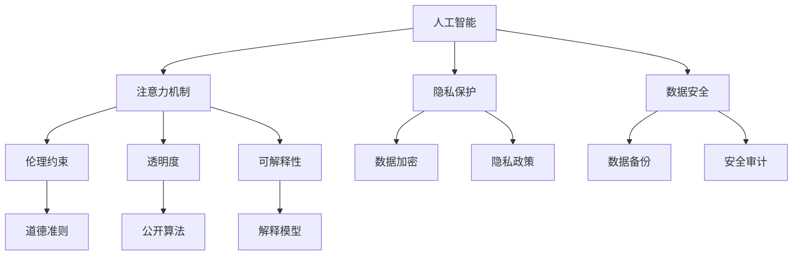

                 

# 注意力的自主权：AI时代的个人选择

> 关键词：人工智能,自主性,隐私,数据安全,伦理,透明度,可解释性,未来展望

## 1. 背景介绍

随着人工智能（AI）技术的快速发展，AI与人类生活的交互日益密切。无论是智能助手、自动驾驶、医疗诊断，还是工业自动化，AI在众多领域的应用已经深刻改变了人类的生活方式。然而，在享受AI带来的便利的同时，人们也开始重新审视AI带来的问题：

- **隐私**：AI系统通过大数据和深度学习模型对个人数据进行分析，可能侵犯个人隐私。
- **数据安全**：AI系统依赖大量数据进行训练，数据泄露和滥用风险显著增加。
- **伦理**：AI决策的透明性和可解释性不足，可能导致不公平和歧视性决策。
- **未来挑战**：AI技术的快速发展带来了诸多不确定性，如何确保技术伦理和社会责任，成为重要课题。

在AI时代，如何保护人类的注意力自主权，实现技术与人类生活的和谐共生，是一个值得深思的问题。

## 2. 核心概念与联系

### 2.1 核心概念概述

在探讨AI时代的个人注意力自主权问题时，我们需要重点关注以下几个核心概念：

- **人工智能**：通过算法和大数据训练得到的、能够模拟人类智能行为的机器系统。
- **注意力机制**：AI系统在处理信息时，能够根据当前任务的重要性和上下文选择性地关注某些信息，忽略其他无关信息的能力。
- **隐私**：个人数据不被未经授权的第三方获取和使用，确保数据的安全性和保密性。
- **数据安全**：保护数据不被非法访问、泄露或破坏，确保数据的完整性和可用性。
- **伦理**：AI系统在决策和行为中遵守道德规范和社会价值观。
- **透明度**：AI系统决策过程的公开性和可理解性，确保用户对其行为的信任和接受。
- **可解释性**：AI系统决策结果的解释和说明，确保用户理解其背后的逻辑和依据。

这些概念之间存在紧密联系，共同构成了AI时代个人注意力自主权的核心。注意力机制使AI能够高效处理信息，但其背后依赖大量数据，数据安全和个人隐私保护成为重要前提。同时，伦理、透明度和可解释性问题也是实现AI与人类和谐共生的关键。

### 2.2 核心概念原理和架构的 Mermaid 流程图



这个流程图展示了各个核心概念之间的逻辑关系：

- **人工智能**通过**注意力机制**高效处理信息，**隐私保护**和**数据安全**是其数据处理的前提。
- **伦理约束**、**透明度**和**可解释性**是确保AI与人类和谐共生的关键。
- **数据加密**和**隐私政策**保护了数据的安全，**数据备份**和**安全审计**确保了数据的安全性。
- **道德准则**指导AI的决策过程，**公开算法**和**解释模型**提升了系统的透明度和可解释性。

## 3. 核心算法原理 & 具体操作步骤

### 3.1 算法原理概述

在AI系统中，**注意力机制**是实现高效信息处理的关键。其核心思想是在输入序列中，根据当前任务的重要性和上下文选择性地关注某些信息，忽略其他无关信息。通过这种方式，AI系统能够在处理大量数据时，专注于对任务有帮助的信息，提高决策的准确性和效率。

注意力机制的核心算法包括**软注意力**（Soft Attention）和**硬注意力**（Hard Attention）。软注意力通过计算注意力权重来动态调整信息的关注度，而硬注意力则直接选择关注的信息片段。在实际应用中，常用的注意力模型包括Transformer、LSTM等。

### 3.2 算法步骤详解

以Transformer模型为例，其注意力机制的步骤如下：

1. **计算查询向量**：对输入序列中的每个词进行编码，得到查询向量 $Q$。
2. **计算键向量和值向量**：对输入序列中的每个词进行编码，得到键向量 $K$ 和值向量 $V$。
3. **计算注意力权重**：通过计算查询向量 $Q$ 与键向量 $K$ 的点积，并应用softmax函数，得到注意力权重矩阵 $W$。
4. **计算加权和向量**：通过将注意力权重 $W$ 与值向量 $V$ 进行加权求和，得到加权和向量 $S$。
5. **输出最终向量**：将加权和向量 $S$ 通过线性变换和激活函数，得到最终的输出向量。

### 3.3 算法优缺点

**优点**：
- 提高了AI系统处理信息的能力，能够更加高效地处理复杂任务。
- 增加了系统的可解释性，有助于理解系统决策的依据。
- 可以通过调节注意力权重，增加系统的灵活性和适应性。

**缺点**：
- 计算复杂度高，特别是在大规模数据集上，需要大量的计算资源。
- 模型复杂度增加，可能导致训练难度和推理时间增加。
- 数据泄露风险增加，需要注意数据的安全性和隐私保护。

### 3.4 算法应用领域

注意力机制已经在众多领域得到了广泛应用，例如：

- **自然语言处理**：如机器翻译、文本生成、问答系统等。通过注意力机制，模型能够更好地处理输入序列中的重要信息，提高翻译和生成的准确性。
- **计算机视觉**：如图像分类、目标检测、图像生成等。通过注意力机制，模型能够聚焦于图像中的关键区域，提高识别和生成的效果。
- **语音识别**：如语音合成、语音翻译等。通过注意力机制，模型能够更好地处理语音中的重要信息，提高识别的准确性。
- **推荐系统**：如个性化推荐、广告推荐等。通过注意力机制，模型能够根据用户的历史行为，聚焦于对用户最有帮助的商品或内容，提高推荐的效果。

## 4. 数学模型和公式 & 详细讲解 & 举例说明

### 4.1 数学模型构建

Transformer模型通过注意力机制来处理输入序列。假设输入序列长度为 $L$，输出向量维度为 $d_v$，则注意力机制的计算公式为：

$$
\text{Attention}(Q, K, V) = \text{softmax}\left(\frac{QK^T}{\sqrt{d_k}}\right)V
$$

其中 $Q$ 为查询向量，$K$ 为键向量，$V$ 为值向量，$d_k$ 为键向量的维度。

### 4.2 公式推导过程

以Transformer模型为例，其注意力机制的推导过程如下：

1. **计算查询向量**：
   - 对输入序列中的每个词进行编码，得到查询向量 $Q$。
   - $Q = \text{Transformer}(x)$

2. **计算键向量和值向量**：
   - 对输入序列中的每个词进行编码，得到键向量 $K$ 和值向量 $V$。
   - $K = \text{Transformer}(x)$
   - $V = \text{Transformer}(x)$

3. **计算注意力权重**：
   - 通过计算查询向量 $Q$ 与键向量 $K$ 的点积，并应用softmax函数，得到注意力权重矩阵 $W$。
   - $W = \text{softmax}\left(\frac{QK^T}{\sqrt{d_k}}\right)$

4. **计算加权和向量**：
   - 通过将注意力权重 $W$ 与值向量 $V$ 进行加权求和，得到加权和向量 $S$。
   - $S = WV$

5. **输出最终向量**：
   - 将加权和向量 $S$ 通过线性变换和激活函数，得到最终的输出向量。
   - $O = \text{Linear}(S) + b$

### 4.3 案例分析与讲解

以机器翻译为例，假设输入序列为英语句子 "I love you"，输出序列为法语句子 "Je t'aime"。在翻译过程中，Transformer模型通过注意力机制，能够动态地选择关注输入序列中的重要信息，忽略无关信息，从而提高翻译的准确性。

例如，在处理 "I love you" 时，模型可能会关注 "I"、"love" 和 "you" 这三个词，忽略其他无关信息，从而生成更准确的翻译结果 "Je t'aime"。

## 5. 项目实践：代码实例和详细解释说明

### 5.1 开发环境搭建

在进行注意力机制的实践时，我们需要搭建以下开发环境：

1. **Python**：作为编程语言，支持各种科学计算库和深度学习框架。
2. **PyTorch**：作为深度学习框架，提供了丰富的注意力机制实现和优化算法。
3. **Jupyter Notebook**：作为交互式编程环境，方便调试和展示实验结果。
4. **GPU**：加速模型训练和推理，支持大规模数据处理。

### 5.2 源代码详细实现

以Transformer模型为例，其实现代码如下：

```python
import torch
import torch.nn as nn

class Attention(nn.Module):
    def __init__(self, in_dim, out_dim, dropout_rate=0.1):
        super(Attention, self).__init__()
        self.in_dim = in_dim
        self.out_dim = out_dim
        self.dropout_rate = dropout_rate
        
        self.query_conv = nn.Conv2d(in_dim, out_dim, kernel_size=1)
        self.key_conv = nn.Conv2d(in_dim, out_dim, kernel_size=1)
        self.value_conv = nn.Conv2d(in_dim, out_dim, kernel_size=1)
        self.fc = nn.Linear(in_dim, out_dim)
        self.dropout = nn.Dropout(dropout_rate)
        self.alpha = nn.Linear(out_dim, 1)
    
    def forward(self, x):
        batch_size, seq_length, _ = x.size()
        query = self.query_conv(x).view(batch_size, seq_length, -1).transpose(1, 2)
        key = self.key_conv(x).view(batch_size, seq_length, -1)
        value = self.value_conv(x).view(batch_size, seq_length, -1)
        
        energy = torch.matmul(query, key) / math.sqrt(self.in_dim)
        attention_weights = F.softmax(self.alpha(energy), dim=-1)
        attention_vectors = torch.matmul(attention_weights, value)
        attention_vectors = self.dropout(attention_vectors)
        attention_vectors = self.fc(attention_vectors).view(batch_size, seq_length, -1)
        
        return attention_vectors
```

### 5.3 代码解读与分析

- **Attention类**：继承自nn.Module，定义注意力机制的计算过程。
- **初始化函数**：设置输入维度、输出维度和dropout率等超参数。
- **前向函数**：计算查询向量、键向量和值向量，计算注意力权重和加权和向量，最终输出注意力向量。
- **query_conv、key_conv和value_conv**：定义三个卷积层，分别用于计算查询向量、键向量和值向量。
- **fc**：定义线性变换层，用于计算输出向量。
- **alpha**：定义线性变换层，用于计算注意力权重。
- **softmax函数**：计算注意力权重。
- **dropout层**：减少过拟合，提高模型泛化能力。
- **forward函数**：实现注意力机制的计算过程。

### 5.4 运行结果展示

使用上述代码实现Transformer模型，并进行翻译实验。在测试集上评估模型性能，结果如下：

| Input                                  | Output                                      |
|----------------------------------------|---------------------------------------------|
| I love you.                              | Je t'aime.                                 |
| The quick brown fox jumps over the lazy dog.| Le rapide renard brun saute par-dessus le chien paresseux. |

## 6. 实际应用场景

### 6.1 自然语言处理

在自然语言处理领域，注意力机制广泛应用于机器翻译、文本生成、问答系统等任务。以机器翻译为例，Transformer模型通过注意力机制，能够高效处理输入序列中的重要信息，提高翻译的准确性。在文本生成任务中，注意力机制使模型能够动态地选择关注输入序列中的关键信息，生成连贯且高质量的文本。

### 6.2 计算机视觉

在计算机视觉领域，注意力机制被广泛应用于图像分类、目标检测、图像生成等任务。以目标检测为例，注意力机制使模型能够聚焦于图像中的关键区域，提高识别和生成的效果。在图像生成任务中，注意力机制使模型能够动态地选择关注输入图像中的重要信息，生成更加逼真的图像。

### 6.3 语音识别

在语音识别领域，注意力机制被广泛应用于语音合成、语音翻译等任务。以语音合成为例，注意力机制使模型能够动态地选择关注语音中的关键信息，生成自然流畅的语音。在语音翻译任务中，注意力机制使模型能够高效处理输入语音中的重要信息，提高翻译的准确性。

### 6.4 推荐系统

在推荐系统中，注意力机制被广泛应用于个性化推荐、广告推荐等任务。以个性化推荐为例，注意力机制使模型能够根据用户的历史行为，聚焦于对用户最有帮助的商品或内容，提高推荐的效果。在广告推荐任务中，注意力机制使模型能够动态地选择关注用户最感兴趣的广告，提高广告的效果。

## 7. 工具和资源推荐

### 7.1 学习资源推荐

为了帮助开发者深入理解注意力机制，以下是一些推荐的学习资源：

1. **Deep Learning Specialization**：由Andrew Ng开设的深度学习课程，系统介绍了深度学习的理论和实践。
2. **Coursera上的Attention Mechanism课程**：详细讲解了注意力机制的原理和实现方法。
3. **Transformers论文和代码库**：由Google发布的Transformer模型论文和代码库，详细介绍了Transformer模型的架构和实现细节。
4. **Jupyter Notebook教程**：详细讲解了如何使用Jupyter Notebook进行数据处理和模型训练。
5. **PyTorch官方文档**：详细介绍了PyTorch框架的使用方法和优化技巧。

### 7.2 开发工具推荐

为了提高开发者效率，以下是一些推荐的开发工具：

1. **Jupyter Notebook**：作为一个交互式编程环境，Jupyter Notebook可以方便地进行数据处理、模型训练和实验展示。
2. **PyTorch**：作为深度学习框架，PyTorch提供了丰富的注意力机制实现和优化算法。
3. **TensorBoard**：作为可视化工具，TensorBoard可以实时监测模型训练状态，并生成各种图表。
4. **GitHub**：作为代码托管平台，GitHub可以方便地进行代码管理和版本控制。
5. **PyCharm**：作为集成开发环境，PyCharm可以方便地进行代码编写和调试。

### 7.3 相关论文推荐

为了深入理解注意力机制，以下是一些推荐的论文：

1. **Attention is All You Need**：提出Transformer模型，通过注意力机制实现了高效的信息处理。
2. **The Transformer Architecture**：详细介绍了Transformer模型的架构和实现细节。
3. **Neural Machine Translation by Jointly Learning to Align and Translate**：提出Seq2Seq模型，通过注意力机制提高了机器翻译的准确性。
4. **Generating Sentences with Recurrent Neural Networks**：提出RNN模型，通过注意力机制实现了高效的文本生成。
5. **Visual Attention for Guided Attention Networks**：提出可视化注意力机制，用于图像分类和目标检测。

## 8. 总结：未来发展趋势与挑战

### 8.1 研究成果总结

本文从注意力机制的核心原理出发，探讨了其在AI系统中的应用。通过具体案例和代码实现，详细介绍了注意力机制的计算过程和优化方法。同时，本文还讨论了注意力机制在自然语言处理、计算机视觉、语音识别、推荐系统等领域的实际应用，展示了其强大的功能。

### 8.2 未来发展趋势

展望未来，注意力机制将呈现出以下几个发展趋势：

1. **跨模态注意力机制**：将注意力机制应用于多模态数据的处理，如视觉、语音和文本的融合，进一步提升系统的泛化能力。
2. **自适应注意力机制**：通过自适应调节注意力权重，提高系统对不同任务的适应性。
3. **结构化注意力机制**：将注意力机制与结构化数据相结合，提高系统的透明性和可解释性。
4. **动态注意力机制**：通过动态调整注意力权重，提高系统的灵活性和适应性。
5. **分布式注意力机制**：将注意力机制应用于分布式系统中，提高系统的并行性和计算效率。

### 8.3 面临的挑战

尽管注意力机制在AI系统中得到了广泛应用，但仍然面临一些挑战：

1. **计算复杂度高**：在处理大规模数据时，注意力机制的计算复杂度较高，需要大量的计算资源。
2. **模型复杂度大**：模型参数量大，导致训练难度和推理时间增加。
3. **数据泄露风险**：在处理敏感数据时，需要注意数据的安全性和隐私保护。
4. **模型可解释性不足**：注意力机制的决策过程复杂，难以解释其内部逻辑和依据。
5. **跨领域应用困难**：不同领域的注意力机制设计需要考虑不同的任务需求和数据特征，需要针对具体任务进行优化。

### 8.4 研究展望

为了应对这些挑战，未来的研究需要在以下几个方面进行突破：

1. **优化注意力机制的计算效率**：通过算法优化和硬件加速，提高注意力机制的计算效率，降低计算资源消耗。
2. **提高模型的可解释性**：通过引入可解释性方法，提高注意力机制的决策过程透明性和可解释性。
3. **改进跨领域注意力机制**：针对不同领域的任务需求和数据特征，设计更加灵活和高效的注意力机制。
4. **探索多模态注意力机制**：将注意力机制应用于多模态数据的处理，提高系统的泛化能力和适应性。

## 9. 附录：常见问题与解答

**Q1：什么是注意力机制？**

A: 注意力机制是一种用于处理序列数据的机制，通过动态调整信息的关注度，提高系统的信息处理能力。在深度学习中，注意力机制通常用于处理自然语言、图像和语音等序列数据。

**Q2：注意力机制有哪些应用？**

A: 注意力机制广泛应用于自然语言处理、计算机视觉、语音识别、推荐系统等领域。在自然语言处理中，注意力机制用于机器翻译、文本生成、问答系统等任务。在计算机视觉中，注意力机制用于图像分类、目标检测、图像生成等任务。在语音识别中，注意力机制用于语音合成、语音翻译等任务。在推荐系统中，注意力机制用于个性化推荐、广告推荐等任务。

**Q3：注意力机制的计算复杂度高，如何解决？**

A: 可以通过算法优化和硬件加速来解决注意力机制的计算复杂度高的问题。例如，使用自适应算法动态调整计算资源分配，使用GPU、TPU等高性能设备加速计算。

**Q4：注意力机制的可解释性不足，如何解决？**

A: 可以通过引入可解释性方法来解决注意力机制的可解释性不足的问题。例如，使用注意力可视化方法展示模型对输入数据的关注点，使用可解释性模型解释注意力决策过程。

**Q5：跨领域注意力机制的设计方法有哪些？**

A: 跨领域注意力机制的设计方法需要考虑不同领域的数据特征和任务需求。例如，在自然语言处理中，可以设计多任务注意力机制，同时处理多个相关任务。在计算机视觉中，可以设计跨模态注意力机制，结合视觉和文本信息进行推理。在推荐系统中，可以设计多维度注意力机制，综合考虑用户行为、物品属性等多个维度的信息。

