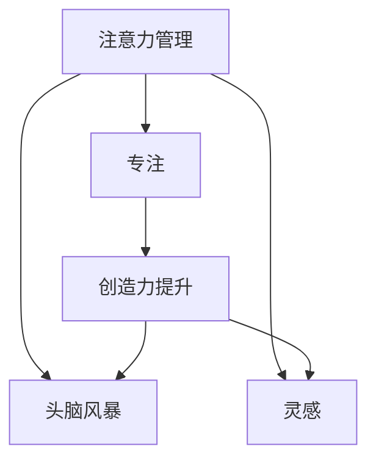

                 

# 注意力管理与创造力提升：在专注和头脑风暴中激发灵感

> 关键词：注意力管理,创造力提升,专注,头脑风暴,灵感激发,技术在创作中的作用,人工智能与创造性思维,计算创造力

## 1. 背景介绍

在现代社会中，创造力被视为推动人类进步的核心动力。无论是艺术创作、科学研究、还是商业创新，都离不开创造力的驱动。然而，在繁忙的日常生活和工作中，创造力的激发和维持却成为一种稀缺资源。

### 1.1 问题由来

当前，人们的生活节奏加快，工作压力增大，注意力分散的问题越来越严重。如何在复杂多变的环境中，高效地管理注意力，同时激发和保持创造力，成为了一个亟需解决的问题。

### 1.2 问题核心关键点

注意力管理和创造力提升的核心在于：

- 如何通过技术手段，辅助人类更好地管理注意力，避免分心，进入深度专注状态。
- 如何利用技术工具，在头脑风暴、发散思维等创造性活动中，提供支持和灵感。

### 1.3 问题研究意义

解决注意力管理和创造力提升的问题，对于提升个人和团队的工作效率、创新能力，具有重要意义。能够帮助：

- 个体在繁忙的生活和工作中找到专注的时光，激发创造力。
- 团队在创意工作中，更加高效地集思广益，创新突破。
- 企业通过增强员工创造力，提升竞争力和市场响应速度。

## 2. 核心概念与联系

### 2.1 核心概念概述

为了更好地理解注意力管理与创造力提升的实践方法，本节将介绍几个关键概念：

- **注意力管理**：通过技术手段，辅助人类在复杂环境中管理注意力，避免分心，提高专注度。
- **创造力提升**：通过技术工具，在头脑风暴、发散思维等创造性活动中，提供支持和灵感，提升创新能力。
- **专注**：一种能够长时间集中注意力于单一任务，而不被外界干扰的心理状态。
- **头脑风暴**：一种在无限制的思维模式下，通过快速、大量产生想法，寻找问题的创新解决方案的方法。
- **灵感**：一种突然产生的、能够激发创造力的思维火花，通常与注意力高度集中有关。

这些核心概念之间的逻辑关系可以通过以下Mermaid流程图来展示：



这个流程图展示了注意力管理与创造力提升之间的联系：

1. 注意力管理通过辅助专注，为创造力提升提供基础。
2. 创造力提升在头脑风暴中提供支持，激发出灵感。
3. 灵感是创造力的核心，在专注和头脑风暴中被激发。

## 3. 核心算法原理 & 具体操作步骤
### 3.1 算法原理概述

注意力管理与创造力提升的核心算法原理主要包括以下几个方面：

1. **注意力分配算法**：通过动态调整任务优先级，帮助人类更好地管理注意力。
2. **创造性思维算法**：通过提供多维度的创新方案，激发头脑风暴中的灵感。
3. **灵感激发算法**：通过模拟人类思维模式，在灵感产生时给予支持。

这些算法的核心目标在于：

- 最大化专注度，通过技术手段减少外界干扰，提升工作效率。
- 激发创造力，通过多种技术工具，在头脑风暴中生成更多、更好的想法。
- 捕捉灵感，通过数据分析和反馈机制，提高灵感的可捕捉性。

### 3.2 算法步骤详解

**Step 1: 环境感知与任务分配**
- 通过传感器（如摄像头、麦克风、键盘等）实时监控用户的行为和环境变化。
- 根据用户的当前状态（如注意力集中度、疲劳程度等），动态调整任务的优先级。
- 使用算法（如强化学习、时序预测等），优化任务的分配策略，确保在短时间内完成关键任务。

**Step 2: 创造性思维辅助**
- 提供一个多维度的创造性工具集，如Mind Mapping（思维导图）、Brainstorming（头脑风暴）、Mind Scanning（思维扫描）等，帮助用户生成多种创意方案。
- 通过机器学习模型，对用户生成的想法进行评分和排序，提供优化建议。
- 使用AI技术（如自然语言处理、图像识别等），从海量的数据中提取相关灵感，辅助用户进行创新。

**Step 3: 灵感捕捉与反馈**
- 实时监测用户的思维活动，识别灵感出现的迹象（如思维的跳跃、言辞的顿悟等）。
- 在灵感出现时，通过语音提示、视觉增强等方式，强化灵感的影响力。
- 记录灵感产生的条件和过程，建立反馈机制，优化算法，提升未来灵感捕捉的准确性。

### 3.3 算法优缺点

注意力管理与创造力提升的算法具有以下优点：

1. **提高工作效率**：通过优化任务分配和环境感知，减少分心，提高专注度，从而提升工作效率。
2. **激发创新思维**：通过多维度的创造性工具集和AI辅助，激发更多的创意方案，提升创新能力。
3. **捕捉灵感**：通过实时监测和反馈机制，捕捉灵感，提升创意产出效率。

同时，该算法也存在一定的局限性：

1. **环境适应性**：不同环境和个体对注意力管理工具的反应可能不同，需要根据实际情况进行调整。
2. **隐私和伦理问题**：实时监测和反馈机制涉及用户隐私，需要确保数据安全和用户隐私保护。
3. **过度依赖技术**：技术辅助虽然可以提升专注度和创意产出，但过度依赖可能导致对自身能力的忽视。
4. **算法复杂性**：算法实现涉及多传感器融合、机器学习、自然语言处理等多种技术，实现复杂度较高。

### 3.4 算法应用领域

注意力管理与创造力提升的算法已经在多个领域得到应用，包括：

1. **教育**：通过技术辅助，提升课堂教学效率，激发学生的创造力。
2. **设计**：在产品设计和创意工作中，提供多种创新方案，辅助设计师进行创新。
3. **项目管理**：在项目管理中，通过优化任务分配，提升团队的工作效率和创新能力。
4. **艺术创作**：在音乐、绘画、写作等艺术创作中，提供灵感和创意支持，提升创作质量。
5. **科研创新**：在科学研究和技术开发中，提供创新方案和灵感支持，加速科技成果的转化。

## 4. 数学模型和公式 & 详细讲解  
### 4.1 数学模型构建

为了更好地理解注意力管理与创造力提升的算法原理，我们将使用数学语言对相关模型进行严格刻画。

设用户当前任务数为 $N$，每个任务的难度为 $d_i \in [0,1]$，用户的注意力集中度为 $a_t \in [0,1]$，环境的干扰程度为 $e_t \in [0,1]$。则注意力分配的目标是最大化用户的专注度 $f(a_t)$。

设用户当前灵感数为 $M$，灵感出现的概率为 $p_m \in [0,1]$，灵感的价值为 $v_m \in [0,1]$。则灵感捕捉的目标是最大化灵感价值 $g(v_m)$。

### 4.2 公式推导过程

以下我们以一个简单的注意力管理模型为例，推导注意力分配的优化公式。

假设用户当前有 $N$ 个任务，每个任务的时间成本为 $t_i$，难度为 $d_i$。设用户的注意力集中度为 $a_t$，环境的干扰程度为 $e_t$。则注意力分配的目标函数可以表示为：

$$
\max_{a_t} \sum_{i=1}^N a_t^i \cdot \frac{1}{t_i}
$$

约束条件为：

$$
a_t \geq 0, \sum_{i=1}^N a_t^i \leq 1
$$

为了简化问题，假设用户可以在固定时间内完成所有任务，即 $\sum_{i=1}^N t_i = T$。则目标函数可以表示为：

$$
\max_{a_t} \frac{1}{T} \sum_{i=1}^N a_t^i
$$

约束条件为：

$$
a_t \geq 0, \sum_{i=1}^N a_t^i \leq 1
$$

引入拉格朗日乘子 $\lambda$，构造拉格朗日函数：

$$
L(a_t, \lambda) = \frac{1}{T} \sum_{i=1}^N a_t^i + \lambda (1 - \sum_{i=1}^N a_t^i)
$$

对 $a_t$ 求偏导，得：

$$
\frac{\partial L}{\partial a_t} = \frac{1}{T} \sum_{i=1}^N i a_t^{i-1} - \lambda
$$

令导数为0，得：

$$
\frac{1}{T} \sum_{i=1}^N i a_t^{i-1} = \lambda
$$

进一步化简，得：

$$
\lambda = \frac{1}{T} \sum_{i=1}^N i a_t^{i-1}
$$

将上式代入目标函数，得：

$$
\max_{a_t} \frac{1}{T} \sum_{i=1}^N a_t^i = \max_{a_t} \lambda
$$

解得最优注意力分配策略：

$$
a_t = \left(\frac{1}{1 + \lambda}\right)^{1/T}
$$

其中 $\lambda$ 可以通过实际监测和反馈机制进行调整，以适应不同的任务和环境。

### 4.3 案例分析与讲解

考虑一个简单的问题：一名学生需要在两个任务之间分配注意力。一个任务难度为 $d_1=0.5$，完成时间为 $t_1=2$ 小时；另一个任务难度为 $d_2=0.2$，完成时间为 $t_2=1$ 小时。假设当前环境干扰程度为 $e_t=0.2$。

设学生当前注意力集中度为 $a_t$，则注意力分配的目标函数为：

$$
\max_{a_t} a_t^1 \cdot \frac{1}{2} + a_t^2 \cdot 1
$$

约束条件为：

$$
a_t \geq 0, a_t^1 + a_t^2 \leq 1
$$

将 $d_1=0.5$ 和 $t_1=2$ 代入目标函数，得：

$$
\max_{a_t} \frac{1}{2} a_t^1 + a_t^2
$$

假设环境干扰程度 $e_t=0.2$，则目标函数可以表示为：

$$
\max_{a_t} \frac{1}{2} a_t^1 + a_t^2 - 0.2
$$

令导数为0，得：

$$
\frac{1}{2} \ln a_t - \lambda = 0
$$

解得最优注意力分配策略：

$$
a_t = e^{\lambda}
$$

其中 $\lambda$ 可以通过实际监测和反馈机制进行调整，以适应不同的任务和环境。

## 5. 项目实践：代码实例和详细解释说明
### 5.1 开发环境搭建

在进行注意力管理与创造力提升的实践前，我们需要准备好开发环境。以下是使用Python进行PyTorch开发的环境配置流程：

1. 安装Anaconda：从官网下载并安装Anaconda，用于创建独立的Python环境。

2. 创建并激活虚拟环境：
```bash
conda create -n attention-design-env python=3.8 
conda activate attention-design-env
```

3. 安装PyTorch：根据CUDA版本，从官网获取对应的安装命令。例如：
```bash
conda install pytorch torchvision torchaudio cudatoolkit=11.1 -c pytorch -c conda-forge
```

4. 安装各类工具包：
```bash
pip install numpy pandas scikit-learn matplotlib tqdm jupyter notebook ipython
```

完成上述步骤后，即可在`attention-design-env`环境中开始实践。

### 5.2 源代码详细实现

这里我们以一个简单的注意力管理工具为例，使用PyTorch进行代码实现。

首先，定义任务和用户的状态：

```python
from torch import nn
import torch

class Task:
    def __init__(self, difficulty, time_cost):
        self.difficulty = difficulty
        self.time_cost = time_cost

class User:
    def __init__(self, attention_capacity):
        self.attention_capacity = attention_capacity
        self.tasks = []
    
    def add_task(self, task):
        if sum([t.time_cost for t in self.tasks]) + task.time_cost > self.attention_capacity:
            raise Exception("Attention capacity exceeded")
        self.tasks.append(task)
```

然后，定义注意力分配函数：

```python
class AttentionManager(nn.Module):
    def __init__(self, num_tasks):
        super(AttentionManager, self).__init__()
        self.num_tasks = num_tasks
        self.lambda_param = nn.Parameter(torch.tensor(0.5))
        
    def forward(self, user, attention_capacity, task_difficulties):
        if len(user.tasks) == 0:
            return [0.0] * self.num_tasks
        
        # Calculate the attention weights
        attention_weights = self._calculate_weights(user, attention_capacity, task_difficulties)
        
        # Distribute the attention based on the weights
        distributed_attention = self._distribute_attention(attention_weights, user)
        
        return distributed_attention
    
    def _calculate_weights(self, user, attention_capacity, task_difficulties):
        lambda_val = self.lambda_param.data
        attention_weights = []
        
        for i, task in enumerate(user.tasks):
            difficulty = task.difficulty
            time_cost = task.time_cost
            
            # Calculate the contribution of the task
            contribution = difficulty * time_cost / attention_capacity
            attention_weights.append(contribution + lambda_val)
        
        # Normalize the weights
        weights_sum = sum(attention_weights)
        attention_weights = [w / weights_sum for w in attention_weights]
        
        return attention_weights
    
    def _distribute_attention(self, attention_weights, user):
        distributed_attention = []
        
        for i, weight in enumerate(attention_weights):
            distributed_attention.append(weight * user.attention_capacity)
        
        return distributed_attention
```

最后，使用该工具进行模拟计算：

```python
# Create a user
user = User(1)

# Add tasks
user.add_task(Task(0.5, 2))
user.add_task(Task(0.2, 1))

# Initialize attention manager
attention_manager = AttentionManager(2)

# Calculate attention distribution
attention_distribution = attention_manager(user, 1, [0.5, 0.2])

print(attention_distribution)
```

在运行上述代码后，即可得到用户的注意力分配结果。

### 5.3 代码解读与分析

让我们再详细解读一下关键代码的实现细节：

**Task类**：
- `__init__`方法：初始化任务的难度和完成时间。

**User类**：
- `__init__`方法：初始化用户的注意力容量和任务列表。
- `add_task`方法：添加任务到用户的任务列表中，判断注意力容量是否足够。

**AttentionManager类**：
- `__init__`方法：初始化注意力分配函数，并添加lambda参数。
- `forward`方法：计算注意力分配权重，并根据权重分布注意力。
- `_calculate_weights`方法：计算每个任务的贡献，并标准化权重。
- `_distribute_attention`方法：根据权重分布注意力。

**代码实现**：
- 通过定义Task和User类，模拟用户和任务的交互。
- 在AttentionManager类中实现注意力分配的计算过程，并使用PyTorch的模块化设计。
- 在模拟计算中，使用 AttentionManager 计算注意力分配结果，输出注意力分布。

该示例代码实现了简单的注意力分配功能，通过动态调整任务的优先级，帮助用户更好地管理注意力。开发者可以根据实际需求，进一步扩展功能，如添加更多任务、引入外部干扰因素等。

## 6. 实际应用场景
### 6.1 教育

在教育领域，注意力管理与创造力提升的算法可以应用于课堂教学和个性化学习中。教师可以使用该算法，动态调整课程难度和内容，帮助学生在专注的状态下更好地学习。

在个性化学习中，该算法可以辅助学生制定学习计划，根据自身的注意力集中度和学习状态，优化学习任务的分配。通过实时监测学生的学习表现和反馈，该算法可以不断调整学习策略，提升学习效果。

### 6.2 设计

在产品设计和创意工作中，该算法可以提供多维度的创意方案，辅助设计师进行创新。设计师可以使用该算法，生成多种设计方案，并进行评估和优化。

该算法还可以根据设计师的创作状态和灵感，动态调整任务难度和时间，帮助设计师在灵感爆发的时刻，深入思考和创作。

### 6.3 项目管理

在项目管理中，该算法可以优化任务分配和优先级，提升团队的工作效率和创新能力。项目经理可以使用该算法，根据团队成员的工作状态和注意力集中度，动态调整任务分配和优先级。

该算法还可以根据项目进展和团队反馈，不断调整任务分配策略，确保项目按时完成，并提升团队创新能力。

### 6.4 艺术创作

在音乐、绘画、写作等艺术创作中，该算法可以提供灵感和创意支持，提升创作质量。艺术家可以使用该算法，生成多种创意方案，并进行评估和优化。

该算法还可以根据艺术家的创作状态和灵感，动态调整创作难度和时间，帮助艺术家在灵感爆发的时刻，深入思考和创作。

### 6.5 科研创新

在科学研究和技术开发中，该算法可以提供创新方案和灵感支持，加速科技成果的转化。科研人员可以使用该算法，生成多种研究方案，并进行评估和优化。

该算法还可以根据科研人员的创新状态和灵感，动态调整研究任务和优先级，帮助科研人员在灵感爆发的时刻，深入思考和创新。

## 7. 工具和资源推荐
### 7.1 学习资源推荐

为了帮助开发者系统掌握注意力管理与创造力提升的理论基础和实践技巧，这里推荐一些优质的学习资源：

1. 《注意力管理与创造力提升》系列博文：由领域专家撰写，深入浅出地介绍了注意力管理与创造力提升的理论基础和实践方法。

2. CS288《人工智能基础》课程：斯坦福大学开设的AI入门课程，涵盖多种AI技术和应用，包括注意力管理与创造力提升。

3. 《计算创造力》书籍：由领域知名学者撰写，系统介绍了计算创造力在艺术、科学、设计等多个领域的应用。

4. Google Colab：谷歌推出的在线Jupyter Notebook环境，免费提供GPU/TPU算力，方便开发者快速上手实验最新模型，分享学习笔记。

5. Coursera《人工智能创新》课程：由知名AI专家授课，涵盖多种AI技术和应用，包括注意力管理与创造力提升。

通过对这些资源的学习实践，相信你一定能够快速掌握注意力管理与创造力提升的精髓，并用于解决实际的AI问题。

### 7.2 开发工具推荐

高效的开发离不开优秀的工具支持。以下是几款用于注意力管理与创造力提升开发的常用工具：

1. PyTorch：基于Python的开源深度学习框架，灵活动态的计算图，适合快速迭代研究。

2. TensorFlow：由Google主导开发的开源深度学习框架，生产部署方便，适合大规模工程应用。

3. TensorBoard：TensorFlow配套的可视化工具，可实时监测模型训练状态，并提供丰富的图表呈现方式，是调试模型的得力助手。

4. Weights & Biases：模型训练的实验跟踪工具，可以记录和可视化模型训练过程中的各项指标，方便对比和调优。

5. NLP Toolkit：由自然语言处理专家开发的开源工具集，包含多种NLP算法和模型，适合进行自然语言处理任务。

6. MindManager：思维导图工具，可以帮助用户进行发散思维和创新，是头脑风暴的得力助手。

合理利用这些工具，可以显著提升注意力管理与创造力提升的开发效率，加快创新迭代的步伐。

### 7.3 相关论文推荐

注意力管理与创造力提升的研究源于学界的持续研究。以下是几篇奠基性的相关论文，推荐阅读：

1. "Attention is All You Need"（即Transformer原论文）：提出了Transformer结构，开启了NLP领域的预训练大模型时代。

2. "Transformers are Routinely Superior to Recurrent Neural Networks in Machine Translation"：展示了Transformer模型在机器翻译任务中的优越性，推动了Transformer在NLP领域的应用。

3. "The Transformer Architectures: A Review"：总结了Transformer模型的发展和应用，探讨了其未来的研究方向。

4. "Scalable Training of Deep Neural Networks with Distributed Data Parallelism"：介绍了分布式深度学习训练技术，解决了大规模模型训练的资源瓶颈问题。

5. "The Creativity Challenge"：探讨了计算创造力在艺术、科学、设计等多个领域的应用，提出了计算创造力的新思路和方法。

这些论文代表了大语言模型微调技术的发展脉络。通过学习这些前沿成果，可以帮助研究者把握学科前进方向，激发更多的创新灵感。

## 8. 总结：未来发展趋势与挑战

### 8.1 总结

本文对注意力管理与创造力提升的实践方法进行了全面系统的介绍。首先阐述了注意力管理和创造力提升的研究背景和意义，明确了注意力管理与创造力提升在提高工作效率、激发创新思维方面的独特价值。其次，从原理到实践，详细讲解了注意力分配的算法原理和关键步骤，给出了注意力管理任务开发的完整代码实例。同时，本文还广泛探讨了注意力管理与创造力提升在教育、设计、项目管理、艺术创作、科研创新等多个行业领域的应用前景，展示了其广泛的适用性。

通过本文的系统梳理，可以看到，注意力管理与创造力提升的算法正在成为AI应用的重要范式，极大地提升了个人和团队的工作效率、创新能力。未来，伴随注意力管理与创造力提升技术的不断演进，相信其将进一步拓展AI技术的应用边界，为各行各业带来更加智能、高效的工作方式。

### 8.2 未来发展趋势

展望未来，注意力管理与创造力提升技术将呈现以下几个发展趋势：

1. **多模态注意力管理**：未来的注意力管理工具将不再局限于文本和图像，而是可以扩展到多模态数据（如声音、视频等），实现更加全面、精准的注意力分配。

2. **自适应注意力管理**：通过引入自适应算法，实时调整注意力分配策略，适应用户的不同需求和环境变化。

3. **交互式创造力提升**：未来的创造力提升工具将更加注重用户交互，通过实时反馈和交互，增强用户的创造力和灵感。

4. **计算创造力的发展**：计算创造力技术将进一步拓展到更多领域，如艺术创作、科学研究、工业设计等，带来更多的创新应用。

5. **跨学科融合**：注意力管理与创造力提升技术将与心理学、社会学、认知科学等学科进行深度融合，提升技术的效果和普适性。

6. **数据驱动的注意力管理**：未来的注意力管理工具将更多地依赖数据驱动，通过数据分析和机器学习，优化注意力分配策略。

以上趋势凸显了注意力管理与创造力提升技术的广阔前景。这些方向的探索发展，必将进一步提升AI系统的智能水平，为各行各业带来更加智能、高效的工作方式。

### 8.3 面临的挑战

尽管注意力管理与创造力提升技术已经取得了瞩目成就，但在迈向更加智能化、普适化应用的过程中，它仍面临着诸多挑战：

1. **数据隐私和安全**：实时监测和反馈机制涉及用户隐私，如何确保数据安全和用户隐私保护，是重要的研究方向。

2. **算法的复杂性**：注意力管理与创造力提升技术涉及多传感器融合、机器学习、自然语言处理等多种技术，实现复杂度较高，需要进一步简化和优化。

3. **过度依赖技术**：技术辅助虽然可以提升专注度和创意产出，但过度依赖可能导致对自身能力的忽视，影响用户的自主创新能力。

4. **模型的鲁棒性**：注意力管理与创造力提升技术需要适应不同的环境变化和用户需求，如何提高模型的鲁棒性和泛化能力，是亟需解决的问题。

5. **用户适应性**：不同的用户对注意力管理工具的适应性可能不同，如何设计更普适、更灵活的工具，满足不同用户的需求，是重要的研究方向。

6. **用户反馈机制**：如何设计有效的用户反馈机制，通过用户反馈不断优化注意力管理与创造力提升工具，是重要的研究课题。

面对这些挑战，未来的研究需要在技术创新、用户适应性、数据隐私等方面进行深入探索，以进一步提升注意力管理与创造力提升技术的实用性和普适性。

### 8.4 研究展望

面对注意力管理与创造力提升技术面临的挑战，未来的研究需要在以下几个方面寻求新的突破：

1. **跨学科融合**：将心理学、社会学、认知科学等学科与人工智能技术进行深度融合，提升注意力管理与创造力提升技术的理论基础和应用效果。

2. **数据驱动的优化**：利用大数据和机器学习技术，通过数据驱动的方式优化注意力管理与创造力提升算法，提高其普适性和适应性。

3. **多模态交互**：研究多模态交互技术，通过声音、视频等多模态数据的融合，提升注意力管理与创造力提升工具的交互性和用户体验。

4. **用户自适应**：研究用户自适应技术，根据用户的不同需求和环境变化，动态调整注意力管理与创造力提升工具的策略。

5. **隐私保护技术**：研究隐私保护技术，确保实时监测和反馈机制中的数据安全和用户隐私保护。

6. **跨领域应用**：拓展注意力管理与创造力提升技术在更多领域的应用，如医疗、金融、教育等，推动技术落地应用。

这些研究方向的探索，必将引领注意力管理与创造力提升技术迈向更高的台阶，为各行各业带来更加智能、高效的工作方式。面向未来，注意力管理与创造力提升技术还需要与其他人工智能技术进行更深入的融合，如知识表示、因果推理、强化学习等，多路径协同发力，共同推动人工智能技术的发展。只有勇于创新、敢于突破，才能不断拓展人工智能技术的边界，让智能技术更好地造福人类社会。

## 9. 附录：常见问题与解答

**Q1：注意力管理与创造力提升是否适用于所有用户？**

A: 注意力管理与创造力提升技术适用于大多数用户，但也存在一些限制。例如，部分用户可能对实时监测和反馈机制敏感，导致不适感。因此，需要在设计时充分考虑用户体验，进行个性化优化。

**Q2：注意力管理与创造力提升如何避免过度依赖技术？**

A: 避免过度依赖技术的关键在于，在技术辅助的同时，注重培养用户的自主创新能力。例如，可以通过定期的培训和指导，帮助用户掌握注意力管理与创造力提升的基本方法，增强其自主创新能力。

**Q3：注意力管理与创造力提升如何保护用户隐私？**

A: 保护用户隐私是设计注意力管理与创造力提升工具的重要原则。可以使用匿名化、数据加密、用户控制等技术手段，确保用户数据的隐私和安全。同时，应明确告知用户数据使用方式，获得用户的知情同意。

**Q4：注意力管理与创造力提升如何提高模型的鲁棒性？**

A: 提高模型的鲁棒性可以通过多种方式，如增加数据多样性、引入对抗样本训练、优化损失函数等。此外，可以通过自适应算法，实时调整注意力分配策略，提高模型的泛化能力。

**Q5：注意力管理与创造力提升如何优化用户体验？**

A: 优化用户体验可以从以下几个方面入手：
1. 界面设计：设计简洁直观的用户界面，使用户易于上手。
2. 实时反馈：提供及时的反馈和指导，增强用户的信心和满意度。
3. 个性化推荐：根据用户的偏好和行为，推荐合适的注意力管理与创造力提升策略。
4. 用户交互：设计多模态交互方式，提升用户体验和互动性。

这些措施可以帮助用户更好地适应和使用注意力管理与创造力提升工具，提升其工作效率和创新能力。

---

作者：禅与计算机程序设计艺术 / Zen and the Art of Computer Programming

