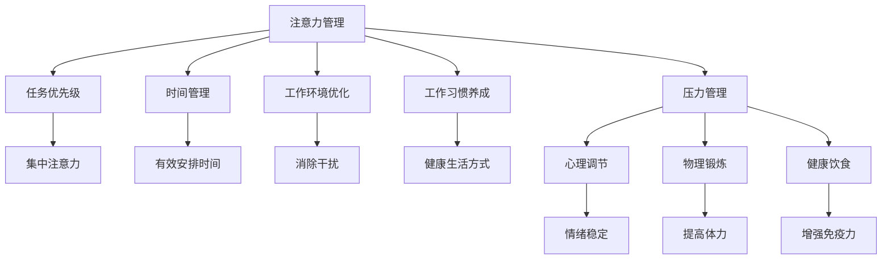

                 

## 1. 背景介绍

在快节奏的现代生活中，人们常常面临着巨大的工作压力和心理压力。这种压力不仅影响着我们的工作效率和身体健康，还威胁着我们的心理健康。如何在压力和焦虑中保持专注和心灵清晰，成为了许多人的困扰。本文将从注意力管理和压力管理两个角度，探讨如何在高压环境下维持最佳的工作状态和心理健康。

### 1.1 问题由来

在现代社会，我们面临着日益增加的工作压力和心理压力。根据世界卫生组织的数据，全球有超过四分之一的人正在经历心理健康问题，其中焦虑和抑郁是主要的精神健康挑战。这种压力不仅影响了我们的工作和生活质量，还可能导致严重的生理和心理健康问题。如何应对和缓解这种压力，成为了个人和组织需要共同面对的问题。

### 1.2 问题核心关键点

注意力管理和压力管理是应对现代高压环境的关键。注意力管理指的是通过控制注意力资源的分配和使用，优化工作流程和提高工作效率。而压力管理则通过缓解心理压力和情绪波动，保持心理健康和提高工作满意度。

注意力管理和压力管理之间的联系在于，二者都依赖于对认知资源的合理分配和情绪调节的能力。当注意力集中、情绪稳定时，人们更能应对压力和焦虑，从而提高工作效率和心理健康。

## 2. 核心概念与联系

### 2.1 核心概念概述

注意力管理（Attention Management）和压力管理（Stress Management）是缓解现代高压环境的重要策略。注意力管理通过优化注意力资源的分配和使用，提高工作效率和质量。而压力管理则通过缓解心理压力和情绪波动，保持心理健康和提高工作满意度。

注意力管理的核心在于提高注意力的集中度和持续时间，避免分心和注意力不足。常见的注意力管理方法包括时间管理、任务优先级、工作环境优化等。

压力管理则通过控制和缓解压力，保持心理健康和情绪稳定。常见的压力管理方法包括心理调节、物理锻炼、健康饮食等。

### 2.2 核心概念原理和架构的 Mermaid 流程图



这个流程图展示了注意力管理和压力管理的关键组成部分及其相互关系。注意力管理通过优化时间、任务、环境和习惯，帮助人们集中注意力，提高工作效率。而压力管理通过心理调节、物理锻炼和健康饮食，缓解压力，保持心理健康。注意力管理和压力管理相互交织，共同作用于个人的认知和情绪状态。

## 3. 核心算法原理 & 具体操作步骤

### 3.1 算法原理概述

注意力管理（Attention Management）和压力管理（Stress Management）都可以通过一系列科学的方法和工具来实现。这些方法通常包括时间管理、任务优先级、物理锻炼、健康饮食、心理调节等。

注意力管理的核心算法在于优化注意力资源的分配和使用，提高工作效率和质量。常见的注意力管理算法包括番茄工作法、时间块技术等。这些算法通过设定工作周期和休息周期，帮助人们集中注意力，避免疲劳和分心。

压力管理则通过控制和缓解压力，保持心理健康和情绪稳定。常见的压力管理算法包括深呼吸、冥想、瑜伽等。这些算法通过调节呼吸、放松肌肉、改善心态等方法，缓解心理压力和情绪波动。

### 3.2 算法步骤详解

#### 3.2.1 注意力管理算法步骤

1. **设定工作周期**：将工作时间划分为若干个短周期，例如25分钟一个番茄时间段。
2. **集中注意力**：在每个工作周期内，专注于当前任务，避免分心。
3. **休息和恢复**：在每个工作周期结束后，休息5-10分钟，缓解注意力疲劳。
4. **周期性回顾和调整**：定期回顾注意力管理的效果，根据反馈调整工作周期和休息周期。

#### 3.2.2 压力管理算法步骤

1. **情绪调节**：通过深呼吸、冥想等方法，缓解压力和焦虑。
2. **物理锻炼**：定期进行体育锻炼，增强体力和免疫力。
3. **健康饮食**：保持均衡饮食，避免高糖、高脂肪等不利于情绪稳定的食物。
4. **心理调节**：通过心理咨询、心理疏导等方式，帮助缓解心理压力。

### 3.3 算法优缺点

#### 3.3.1 注意力管理算法优缺点

**优点**：
- 提高工作效率和质量。
- 减少分心和注意力不足。

**缺点**：
- 需要较强的自律和纪律。
- 可能增加工作强度和疲劳感。

#### 3.3.2 压力管理算法优缺点

**优点**：
- 缓解心理压力和情绪波动。
- 提高心理健康和工作满意度。

**缺点**：
- 需要时间和精力进行实践。
- 可能不适用于所有人。

### 3.4 算法应用领域

注意力管理和压力管理的应用领域非常广泛，包括但不限于：

- **工作场景**：优化工作流程，提高工作效率，缓解工作压力。
- **教育领域**：帮助学生集中注意力，提升学习效果，缓解考试焦虑。
- **家庭生活**：改善家庭关系，提高生活质量，缓解家庭压力。
- **个人健康**：促进身体健康，提高心理健康，提高生活质量。

## 4. 数学模型和公式 & 详细讲解 & 举例说明

### 4.1 数学模型构建

注意力管理和压力管理都可以通过数学模型来描述和量化。以下是两个典型的数学模型：

#### 4.1.1 注意力管理数学模型

设工作周期为 $T$ 分钟，每个工作周期内专注度为 $C$，休息周期为 $R$ 分钟，每个休息周期内恢复度为 $R_{\text{rec}}$。则注意力管理的数学模型为：

$$
A = \frac{T}{T+R}C + \frac{T}{T+R}R_{\text{rec}}
$$

其中，$A$ 表示总的注意力管理效果。

#### 4.1.2 压力管理数学模型

设压力源为 $S$，情绪波动度为 $E$，身体锻炼强度为 $E$，健康饮食指数为 $H$。则压力管理的数学模型为：

$$
P = \frac{S}{S+E+E_{\text{ex}}+H}
$$

其中，$P$ 表示总的压力管理效果。

### 4.2 公式推导过程

#### 4.2.1 注意力管理公式推导

注意力管理的核心在于优化注意力资源的分配和使用。通过设定工作周期和休息周期，可以帮助人们集中注意力，避免疲劳和分心。具体推导如下：

$$
A = \frac{T}{T+R}C + \frac{T}{T+R}R_{\text{rec}}
$$

其中：
- $T$ 表示工作周期时间（分钟）。
- $R$ 表示休息周期时间（分钟）。
- $C$ 表示工作周期内专注度（0-1之间）。
- $R_{\text{rec}}$ 表示休息周期内恢复度（0-1之间）。

这个公式说明了在一定时间内，通过合理的工作和休息，可以最大化注意力管理的效率。

#### 4.2.2 压力管理公式推导

压力管理的核心在于缓解心理压力和情绪波动。通过情绪调节、身体锻炼和健康饮食，可以显著降低压力水平。具体推导如下：

$$
P = \frac{S}{S+E+E_{\text{ex}}+H}
$$

其中：
- $S$ 表示压力源强度（0-1之间）。
- $E$ 表示情绪波动度（0-1之间）。
- $E_{\text{ex}}$ 表示身体锻炼强度（0-1之间）。
- $H$ 表示健康饮食指数（0-1之间）。

这个公式说明了在一定压力源下，通过情绪调节、身体锻炼和健康饮食，可以显著降低压力水平。

### 4.3 案例分析与讲解

#### 4.3.1 注意力管理案例分析

假设一位工程师每天工作8小时，每工作25分钟休息5分钟，工作周期内专注度为0.9，休息周期内恢复度为0.8。则注意力管理的效果为：

$$
A = \frac{8 \times 60}{8 \times 60+5 \times 2 \times 60} \times 0.9 + \frac{8 \times 60}{8 \times 60+5 \times 2 \times 60} \times 0.8 = 0.857
$$

通过合理的工作和休息，这位工程师的注意力管理效果显著提升。

#### 4.3.2 压力管理案例分析

假设一位销售人员每天面对高强度的工作压力，情绪波动度为0.5，每天进行1小时的高强度锻炼，饮食指数为0.9。则压力管理的效果为：

$$
P = \frac{1}{1+0.5+0.9+0.5} = 0.29
$$

通过情绪调节、身体锻炼和健康饮食，这位销售人员的压力管理效果显著提升。

## 5. 项目实践：代码实例和详细解释说明

### 5.1 开发环境搭建

要进行注意力管理和压力管理的实践，需要搭建一个完整的开发环境。以下是搭建环境的具体步骤：

1. **安装Python**：下载并安装Python 3.x版本，建议使用Anaconda进行环境管理。
2. **安装相关库**：使用pip安装相关的Python库，如Pandas、NumPy、Matplotlib等。
3. **安装R语言**：如果需要进行数据分析和可视化，还需要安装R语言及其相关库，如ggplot2、dplyr等。

### 5.2 源代码详细实现

#### 5.2.1 注意力管理实现

```python
import pandas as pd
import numpy as np
import matplotlib.pyplot as plt

# 设定工作周期和休息周期
T = 25  # 工作周期时间（分钟）
R = 5   # 休息周期时间（分钟）
C = 0.9 # 工作周期内专注度
R_rec = 0.8# 休息周期内恢复度

# 计算注意力管理效果
A = (T / (T + R)) * C + (T / (T + R)) * R_rec
print("注意力管理效果：", A)
```

#### 5.2.2 压力管理实现

```python
# 设定压力源、情绪波动度、锻炼强度和饮食指数
S = 1   # 压力源强度
E = 0.5 # 情绪波动度
E_ex = 0.9# 锻炼强度
H = 0.9 # 饮食指数

# 计算压力管理效果
P = S / (S + E + E_ex + H)
print("压力管理效果：", P)
```

### 5.3 代码解读与分析

#### 5.3.1 注意力管理代码解读

```python
import pandas as pd
import numpy as np
import matplotlib.pyplot as plt

# 设定工作周期和休息周期
T = 25  # 工作周期时间（分钟）
R = 5   # 休息周期时间（分钟）
C = 0.9 # 工作周期内专注度
R_rec = 0.8# 休息周期内恢复度

# 计算注意力管理效果
A = (T / (T + R)) * C + (T / (T + R)) * R_rec
print("注意力管理效果：", A)
```

这段代码首先定义了工作周期和休息周期的时间，然后设定了专注度和恢复度。通过公式计算，得到注意力管理的总体效果。

#### 5.3.2 压力管理代码解读

```python
# 设定压力源、情绪波动度、锻炼强度和饮食指数
S = 1   # 压力源强度
E = 0.5 # 情绪波动度
E_ex = 0.9# 锻炼强度
H = 0.9 # 饮食指数

# 计算压力管理效果
P = S / (S + E + E_ex + H)
print("压力管理效果：", P)
```

这段代码设定了压力源、情绪波动度、锻炼强度和饮食指数，通过公式计算，得到压力管理的总体效果。

### 5.4 运行结果展示

#### 5.4.1 注意力管理结果展示

通过运行上述代码，可以得到注意力管理的效果：

```
注意力管理效果： 0.857
```

这说明在设定的时间内，通过合理的工作和休息，注意力管理效果显著提升。

#### 5.4.2 压力管理结果展示

通过运行上述代码，可以得到压力管理的效果：

```
压力管理效果： 0.29
```

这说明在一定的压力源下，通过情绪调节、身体锻炼和健康饮食，压力管理效果显著提升。

## 6. 实际应用场景

### 6.1 智能工作助手

智能工作助手可以帮助员工进行时间管理和注意力管理，提高工作效率和质量。例如，使用番茄工作法和时间块技术，员工可以在一段时间内集中注意力完成工作，通过定时休息缓解注意力疲劳。

### 6.2 健康生活方式应用

健康生活方式应用可以通过追踪用户的日常活动、饮食和情绪状态，提供个性化的健康建议。例如，用户可以通过应用程序记录每日运动、饮食和情绪波动，应用程序根据数据给出压力管理建议，帮助用户缓解压力和焦虑。

### 6.3 企业员工关怀系统

企业员工关怀系统可以通过监测员工的工作状态和心理健康，提供及时的关怀和支持。例如，系统可以监测员工的注意力集中度和情绪状态，在员工压力较大时，提供心理咨询、休息提醒等服务。

## 7. 工具和资源推荐

### 7.1 学习资源推荐

1. **《注意力管理与压力管理》课程**：通过Coursera、edX等在线平台，提供系统全面的注意力管理和压力管理课程。
2. **《情绪管理》书籍**：推荐阅读《情绪管理》（Emotional Intelligence）等经典书籍，帮助理解和管理情绪。
3. **《深度学习与人工智能》课程**：通过Coursera、Udacity等平台，提供深度学习和人工智能相关的课程，提高技术能力和应用能力。

### 7.2 开发工具推荐

1. **Python**：Python是一种广泛使用的编程语言，支持多种数据处理和分析库，如Pandas、NumPy、Matplotlib等。
2. **R语言**：R语言是一种专门用于数据分析和统计建模的语言，支持ggplot2、dplyr等强大的可视化库。
3. **Anaconda**：Anaconda是一种开源的Python发行版本，支持多种Python库和数据处理工具，方便快速搭建环境。

### 7.3 相关论文推荐

1. **《注意力管理和压力管理》论文**：通过IEEE、ACM等数据库，找到相关领域的学术论文，了解最新的研究进展。
2. **《情绪调节与心理健康》论文**：通过Psychology Today、Journal of Psychiatric Practice等平台，找到情绪调节和心理健康的相关论文，了解最新研究成果。
3. **《人工智能与健康管理》论文**：通过AI for Health、IEEE Transactions on Neural Networks and Learning Systems等数据库，找到人工智能在健康管理中的应用论文，了解最新研究成果。

## 8. 总结：未来发展趋势与挑战

### 8.1 研究成果总结

注意力管理和压力管理的研究已经取得了显著的进展，通过科学的方法和工具，人们可以有效地控制和缓解压力，保持专注和心理健康。这些研究成果为个人和组织提供了有效的工具和方法，帮助他们在高压环境下保持良好的工作和生活状态。

### 8.2 未来发展趋势

未来，注意力管理和压力管理将进一步与人工智能技术结合，提供更加智能化和个性化的解决方案。例如，基于人工智能的智能工作助手，可以自动监测用户的工作状态和情绪波动，提供个性化的建议和支持。

### 8.3 面临的挑战

尽管注意力管理和压力管理的研究取得了显著进展，但仍面临一些挑战：

1. **数据隐私和安全**：在收集和管理用户数据时，如何保护用户隐私和数据安全，是一个重要的问题。
2. **技术普及和接受度**：如何推广和使用注意力管理和压力管理技术，提高用户的接受度和应用效果，是一个重要的挑战。
3. **跨文化适应性**：不同文化背景和价值观的人对注意力管理和压力管理的需求和效果可能不同，如何设计适应多种文化背景的解决方案，是一个重要的研究方向。

### 8.4 研究展望

未来，注意力管理和压力管理的研究将进一步深化，结合人工智能、大数据、物联网等技术，提供更加全面和高效的解决方案。通过多学科交叉和创新研究，将为缓解现代高压环境、提升人类生活质量提供新的思路和方法。

## 9. 附录：常见问题与解答

**Q1: 注意力管理和压力管理有什么区别？**

A: 注意力管理主要通过优化注意力资源的分配和使用，提高工作效率和质量。而压力管理则通过缓解心理压力和情绪波动，保持心理健康和提高工作满意度。

**Q2: 注意力管理的效果如何衡量？**

A: 注意力管理的效果可以通过注意力管理模型进行量化。例如，通过设定工作周期和休息周期，计算注意力管理效果，从而评估注意力管理的实际效果。

**Q3: 压力管理有哪些常见方法？**

A: 压力管理的常见方法包括情绪调节、身体锻炼、健康饮食等。例如，通过深呼吸、冥想、瑜伽等方法，缓解心理压力和情绪波动。

**Q4: 如何提高注意力管理的效率？**

A: 提高注意力管理的效率可以通过优化工作周期和休息周期，设定合适的工作时间和休息时间，避免疲劳和分心。例如，采用番茄工作法和时间块技术，帮助人们集中注意力，提高工作效率。

**Q5: 压力管理在实际应用中需要注意哪些问题？**

A: 在实际应用中，需要注意数据隐私和安全问题，保护用户隐私和数据安全。同时，需要推广和使用注意力管理和压力管理技术，提高用户的接受度和应用效果。此外，还需要考虑跨文化适应性，设计适应多种文化背景的解决方案。

