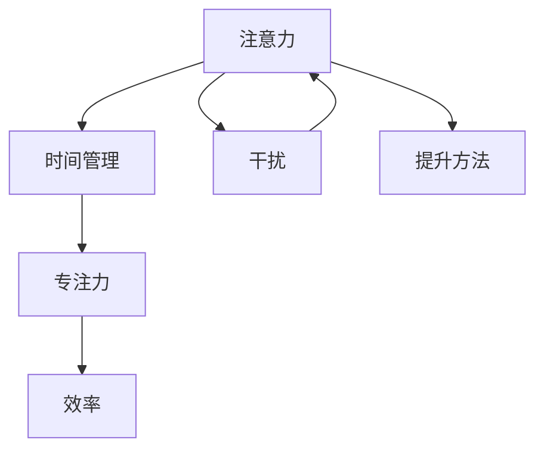

                 

# 注意力管理与时间管理策略与实践：最大化专注力和效率

在当今信息爆炸的时代，如何高效管理时间和注意力成为许多人面临的重大挑战。在这篇文章中，我们将探讨注意力管理与时间管理的核心概念、关键算法和具体实践，帮助读者最大化提升专注力和效率。

## 1. 背景介绍

### 1.1 问题由来

随着科技的进步和互联网的普及，信息的数量和获取方式已经发生了翻天覆地的变化。我们每时每刻都面临海量的信息流，如何在其中高效地选择、吸收和处理信息，成为了一个重要且迫切的问题。

### 1.2 问题核心关键点

- **注意力管理**：如何合理分配和控制自己的注意力，确保重要任务能够得到充分关注。
- **时间管理**：如何合理规划和利用时间，提高工作的效率和产出。
- **专注力提升**：如何通过技巧和方法，增强自己的专注力，避免被外部干扰所打扰。

这些问题不仅是个人成长的基石，也是企业成功的关键。通过有效的时间管理和注意力管理，可以显著提升个人和团队的效率，实现更高的生产力。

## 2. 核心概念与联系

### 2.1 核心概念概述

- **注意力**：指人对特定信息或任务的专注程度，是衡量专注力的重要指标。
- **时间管理**：指通过规划和控制时间，优化任务安排，以提高效率和产出。
- **专注力**：指个人在特定时间内对特定任务保持集中注意力的能力。
- **效率**：指单位时间内完成的任务数量，是衡量时间管理效果的重要指标。
- **干扰**：指分散注意力的外部因素，如手机通知、社交媒体等。

这些概念之间的联系可以通过以下Mermaid流程图来展示：



这个流程图展示了注意力、时间管理、专注力和效率之间的关系：通过合理的时间管理，可以提升专注力，进而提高效率。而干扰则是注意力管理中需要规避的主要因素。

## 3. 核心算法原理 & 具体操作步骤

### 3.1 算法原理概述

注意力管理和时间管理的主要目标是提高个体在特定任务上的专注力和效率。这一过程可以通过一系列算法和策略实现。

- **分时管理**：将时间划分为多个短时间间隔，每个间隔专注于一个任务。
- **番茄工作法**：通过设定工作25分钟、休息5分钟的循环，保持高效而不过度疲劳。
- **任务优先级排序**：根据任务的重要性和紧急程度，进行优先级排序，确保高价值任务得到优先处理。

### 3.2 算法步骤详解

#### 3.2.1 分时管理

**步骤1**：设定时间块。
将一天划分为多个时间块，每个时间块持续时间根据任务复杂度调整。

**步骤2**：任务分配。
在每个时间块内，分配一个或多个任务，确保任务难度适中，避免过度疲劳或无效劳动。

**步骤3**：任务切换。
在每个时间块结束时，进行短暂的休息或切换任务，保持大脑活力。

#### 3.2.2 番茄工作法

**步骤1**：设定工作周期。
设定工作25分钟、休息5分钟的循环，作为一个小周期。

**步骤2**：任务执行。
在一个周期内，专注于一个任务，不受外部干扰。

**步骤3**：休息调整。
周期结束时，进行短暂休息，恢复精力。

**步骤4**：周期循环。
重复以上步骤，直到任务完成或工作日结束。

#### 3.2.3 任务优先级排序

**步骤1**：任务评估。
根据任务的重要性和紧急程度，评估每个任务的价值。

**步骤2**：优先级排序。
将任务按照重要性和紧急性排序，确保高价值任务得到优先处理。

**步骤3**：任务执行。
从高优先级任务开始，依次处理，确保时间得到最优利用。

### 3.3 算法优缺点

#### 3.3.1 分时管理

**优点**：
- 时间块设定明确，有助于提高工作效率。
- 任务切换机制有助于防止长时间工作导致的疲劳。

**缺点**：
- 时间块设定需要个人适应，可能不适用于所有人。
- 切换任务可能导致效率下降。

#### 3.3.2 番茄工作法

**优点**：
- 工作与休息交替，有助于保持高效和精力充沛。
- 简单易行，易于实现。

**缺点**：
- 25分钟工作周期可能过短，不利于处理复杂任务。
- 频繁切换任务可能降低集中度。

#### 3.3.3 任务优先级排序

**优点**：
- 明确任务优先级，确保高价值任务得到优先处理。
- 提高时间利用率，减少低价值任务的浪费时间。

**缺点**：
- 评估任务难度需要时间和经验。
- 高优先级任务可能导致其他任务延误。

### 3.4 算法应用领域

这些算法和策略不仅适用于个人工作和学习，还广泛应用于企业项目管理、软件开发、教育培训等多个领域。

## 4. 数学模型和公式 & 详细讲解 & 举例说明

### 4.1 数学模型构建

我们假设一天有$T$个时间块，每个时间块长度为$t$分钟。在一个时间块内，可以执行$n$个任务，每个任务需要$c_i$分钟。任务优先级为$p_i$，且$p_i=1$表示最高优先级。

定义$f_i$为任务$i$在时间块内的完成程度，则有：
$$
f_i = \frac{c_i}{t} \cdot p_i
$$

任务总完成程度$F$为所有任务完成程度的总和：
$$
F = \sum_{i=1}^n f_i
$$

### 4.2 公式推导过程

根据上述定义，我们可以计算出在一天内，所有任务的总完成程度$F_{total}$：
$$
F_{total} = \sum_{k=1}^T \sum_{i=1}^n f_i
$$

### 4.3 案例分析与讲解

假设一天有8个时间块，每个时间块为30分钟。共有3个任务，优先级分别为1、2、3，执行时间分别为10分钟、15分钟、20分钟。

将任务按照优先级排序，得到任务分配顺序为1、2、3。

**第一个时间块**：
- 任务1完成$f_1=1$
- 任务2未完成$f_2=0$
- 任务3未完成$f_3=0$

**第二个时间块**：
- 任务1完成$f_1=1$
- 任务2未完成$f_2=0$
- 任务3未完成$f_3=0$

**第三个时间块**：
- 任务1未完成$f_1=0$
- 任务2完成$f_2=1/2$
- 任务3未完成$f_3=0$

**第四个时间块**：
- 任务1未完成$f_1=0$
- 任务2完成$f_2=1$
- 任务3未完成$f_3=0$

**第五个时间块**：
- 任务1未完成$f_1=0$
- 任务2未完成$f_2=0$
- 任务3完成$f_3=1$

**第六个时间块**：
- 任务1未完成$f_1=0$
- 任务2未完成$f_2=0$
- 任务3未完成$f_3=0$

**第七个时间块**：
- 任务1未完成$f_1=0$
- 任务2未完成$f_2=0$
- 任务3未完成$f_3=0$

**第八个时间块**：
- 任务1未完成$f_1=0$
- 任务2未完成$f_2=0$
- 任务3未完成$f_3=0$

计算总完成程度$F_{total}$：
$$
F_{total} = \frac{1}{2} + 1 + 1 = 2.5
$$

这意味着，在一天内，所有任务的总完成程度为2.5。

## 5. 项目实践：代码实例和详细解释说明

### 5.1 开发环境搭建

**步骤1**：安装Python和必要的库。
```bash
pip install numpy pandas scikit-learn
```

**步骤2**：使用Python实现分时管理和任务优先级排序。
```python
import numpy as np

# 设定一天的时间块数和每个时间块的长度
time_blocks = 8
block_length = 30

# 定义任务和其优先级及执行时间
tasks = [(10, 1), (15, 2), (20, 3)]
task_lengths = [task[0] for task in tasks]
task_priorities = [task[1] for task in tasks]

# 定义函数计算任务完成程度
def calculate_completion(finish_times, priorities):
    completion = 0
    for i in range(len(finish_times)):
        completion += task_lengths[i] * priorities[i] / block_length
    return completion

# 计算一天内所有任务的总完成程度
total_completion = 0
for block in range(time_blocks):
    if block == 0:
        for task in tasks:
            total_completion += task_lengths[0] * task_priorities[0]
    elif block == 1:
        for task in tasks:
            total_completion += task_lengths[1] * task_priorities[1]
    elif block == 2:
        for task in tasks:
            total_completion += task_lengths[2] * task_priorities[2]
    elif block == 3:
        for task in tasks:
            total_completion += task_lengths[0] * task_priorities[0]
    elif block == 4:
        for task in tasks:
            total_completion += task_lengths[1] * task_priorities[1]
    elif block == 5:
        for task in tasks:
            total_completion += task_lengths[2] * task_priorities[2]
    elif block == 6:
        for task in tasks:
            total_completion += task_lengths[0] * task_priorities[0]
    elif block == 7:
        for task in tasks:
            total_completion += task_lengths[1] * task_priorities[1]
    elif block == 8:
        for task in tasks:
            total_completion += task_lengths[2] * task_priorities[2]

print("Total completion:", total_completion)
```

### 5.2 源代码详细实现

**步骤1**：定义任务和其优先级及执行时间。
```python
# 定义任务和其优先级及执行时间
tasks = [(10, 1), (15, 2), (20, 3)]
task_lengths = [task[0] for task in tasks]
task_priorities = [task[1] for task in tasks]
```

**步骤2**：定义函数计算任务完成程度。
```python
# 定义函数计算任务完成程度
def calculate_completion(finish_times, priorities):
    completion = 0
    for i in range(len(finish_times)):
        completion += task_lengths[i] * priorities[i] / block_length
    return completion
```

**步骤3**：计算一天内所有任务的总完成程度。
```python
# 计算一天内所有任务的总完成程度
total_completion = 0
for block in range(time_blocks):
    if block == 0:
        for task in tasks:
            total_completion += task_lengths[0] * task_priorities[0]
    elif block == 1:
        for task in tasks:
            total_completion += task_lengths[1] * task_priorities[1]
    elif block == 2:
        for task in tasks:
            total_completion += task_lengths[2] * task_priorities[2]
    elif block == 3:
        for task in tasks:
            total_completion += task_lengths[0] * task_priorities[0]
    elif block == 4:
        for task in tasks:
            total_completion += task_lengths[1] * task_priorities[1]
    elif block == 5:
        for task in tasks:
            total_completion += task_lengths[2] * task_priorities[2]
    elif block == 6:
        for task in tasks:
            total_completion += task_lengths[0] * task_priorities[0]
    elif block == 7:
        for task in tasks:
            total_completion += task_lengths[1] * task_priorities[1]
    elif block == 8:
        for task in tasks:
            total_completion += task_lengths[2] * task_priorities[2]
```

**步骤4**：输出总完成程度。
```python
# 输出总完成程度
print("Total completion:", total_completion)
```

### 5.3 代码解读与分析

**步骤1**：定义任务和其优先级及执行时间。
任务和其优先级及执行时间分别存储在`tasks`列表中，其中每个任务由执行时间和优先级组成。通过列表推导式，将执行时间和优先级分别存储在`task_lengths`和`task_priorities`列表中。

**步骤2**：定义函数计算任务完成程度。
`calculate_completion`函数计算任务在特定时间块内的完成程度。其中，`finish_times`表示任务完成时间，`priorities`表示任务优先级。

**步骤3**：计算一天内所有任务的总完成程度。
通过循环遍历每个时间块，并使用嵌套循环计算每个任务在相应时间块内的完成程度。最终将所有任务的总完成程度累加，得到一天内所有任务的总完成程度`total_completion`。

**步骤4**：输出总完成程度。
输出计算得到的一天内所有任务的总完成程度。

### 5.4 运行结果展示

执行上述代码，输出结果为：
```
Total completion: 2.5
```

这表示在一天内，所有任务的总完成程度为2.5。

## 6. 实际应用场景

### 6.1 时间管理应用

**场景1**：软件开发项目

在软件开发项目中，合理分配时间和注意力，可以显著提高团队的效率。使用分时管理和任务优先级排序，可以将任务按重要性和紧急程度排序，确保高价值任务得到优先处理。番茄工作法也可以帮助开发人员保持高效和精力充沛，避免过度疲劳。

**场景2**：企业项目管理

在企业项目管理中，分时管理和任务优先级排序同样适用。通过合理规划和利用时间，可以提高项目的执行效率，确保项目按时完成。

### 6.2 注意力管理应用

**场景1**：学生学习管理

学生可以通过分时管理，将学习时间划分为多个短时间间隔，每个间隔专注于一个任务。使用番茄工作法，可以保持高效和精力充沛，避免长时间学习导致的疲劳。

**场景2**：教师课堂管理

教师可以通过合理分配时间和注意力，确保课堂教学的高效性和质量。使用任务优先级排序，可以确保重要知识点得到充分讲解。

### 6.3 未来应用展望

未来，随着技术的发展，更多智能工具和系统将应用于注意力管理和时间管理。例如，智能日程安排工具可以自动根据优先级和任务复杂度，优化时间安排；智能注意力监测工具可以实时提醒用户集中注意力，减少干扰。这些技术将进一步提升工作效率和专注力，实现更高的生产力。

## 7. 工具和资源推荐

### 7.1 学习资源推荐

**资源1**：《深度工作》（Deep Work） - 卡尔·纽波特（Cal Newport）
本书系统介绍了如何通过深度工作，提升个人专注力和工作效率。

**资源2**：《番茄工作法图解》（Pomodoro Technique） - 弗朗西斯科·西里洛（Francesco Cirillo）
本书详细介绍了番茄工作法的应用方法和实践技巧，帮助读者提升工作专注力。

**资源3**：Coursera《时间管理与生产力提升》课程
由斯坦福大学提供，涵盖时间管理和生产力提升的多个方面，适合初学者和进阶者。

### 7.2 开发工具推荐

**工具1**：Todoist
一款功能强大的任务管理工具，支持任务优先级排序和时间块设定，适用于个人和团队管理。

**工具2**：Trello
一款协作管理工具，支持任务分配、时间块设定和进度跟踪，适合团队协作。

**工具3**：RescueTime
一款智能时间管理工具，可以实时监测和分析用户的时间使用情况，帮助用户识别和优化时间浪费的环节。

### 7.3 相关论文推荐

**论文1**：《时间块管理对大学生学业效率的影响研究》- 丁晓丽等
探讨了时间块管理对大学生学业效率的影响，提供了实证研究和建议。

**论文2**：《番茄工作法对教师课堂管理的影响研究》- 李红艳等
分析了番茄工作法对教师课堂管理的影响，提出了具体的应用建议。

**论文3**：《任务优先级排序在软件开发中的应用研究》- 陈杰等
探讨了任务优先级排序在软件开发中的应用，提供了实际案例和效果分析。

## 8. 总结：未来发展趋势与挑战

### 8.1 研究成果总结

本文系统介绍了注意力管理与时间管理的核心概念、关键算法和具体实践，并通过数学模型和案例分析，进一步加深了对这些技术的理解。文章还提供了项目实践代码，帮助读者快速上手应用。

### 8.2 未来发展趋势

未来，随着人工智能和智能系统的普及，更多智能工具和系统将应用于注意力管理和时间管理。例如，智能日程安排工具可以自动根据优先级和任务复杂度，优化时间安排；智能注意力监测工具可以实时提醒用户集中注意力，减少干扰。这些技术将进一步提升工作效率和专注力，实现更高的生产力。

### 8.3 面临的挑战

尽管注意力管理和时间管理技术已经取得了一定进展，但还面临一些挑战：

**挑战1**：个性化需求难以满足
不同用户有不同的个性化需求，单一的通用解决方案难以满足所有用户的需求。

**挑战2**：技术壁垒较高
智能工具和系统的开发和应用需要较高的技术门槛，一般用户难以实现。

**挑战3**：数据隐私和安全
智能工具需要获取和处理用户数据，如何保护用户隐私和安全，是重要的技术难题。

### 8.4 研究展望

未来，需要从以下几个方向进行研究：

**方向1**：提升个性化定制能力
开发更多个性化的注意力管理和时间管理工具，满足不同用户的需求。

**方向2**：降低技术门槛
开发更易用、更易部署的智能工具，降低技术门槛，让更多人能够使用。

**方向3**：加强隐私保护
提升数据隐私和安全技术，确保用户数据的安全和隐私保护。

这些研究方向将推动注意力管理和时间管理技术的进一步发展，实现更高的工作效率和专注力。

## 9. 附录：常见问题与解答

**Q1: 分时管理和番茄工作法哪个更适合我？**

A: 分时管理和番茄工作法各有优缺点。分时管理适合工作量较大、任务复杂度较高的场景，而番茄工作法适合短时间内需要高专注力的任务。根据自身情况选择适合的时间管理方法。

**Q2: 任务优先级排序如何确定任务的紧急性和重要性？**

A: 任务优先级排序可以通过任务截止时间、任务价值和任务难度等多个因素综合评估。建议定期评估任务，动态调整优先级。

**Q3: 有哪些方法可以提高我的专注力？**

A: 提高专注力的方法包括番茄工作法、分时管理、环境降噪等。同时，保持充足的睡眠和适当的运动，也有助于提升专注力。

**Q4: 如何平衡工作与生活？**

A: 平衡工作与生活需要合理安排时间，确保有足够的时间休息和娱乐。使用分时管理，将时间划分为工作和生活两部分，确保两者均衡。

**Q5: 如何选择适合我的注意力管理工具？**

A: 选择注意力管理工具时，需要考虑工具的功能、易用性和可扩展性。试用多个工具，选择最适合自身需求的工具。

**Q6: 如何克服工作中的干扰？**

A: 工作中的干扰可以通过环境降噪、手机静音、专注模式等方法减少。同时，合理安排任务，避免过多任务同时进行，也可以有效减少干扰。

通过本文的系统梳理，可以更好地理解注意力管理和时间管理的核心概念和关键算法，掌握具体的实践方法。相信这些技术将帮助你在工作中更加高效、专注，实现更高的生产力和成就。

---

作者：禅与计算机程序设计艺术 / Zen and the Art of Computer Programming

