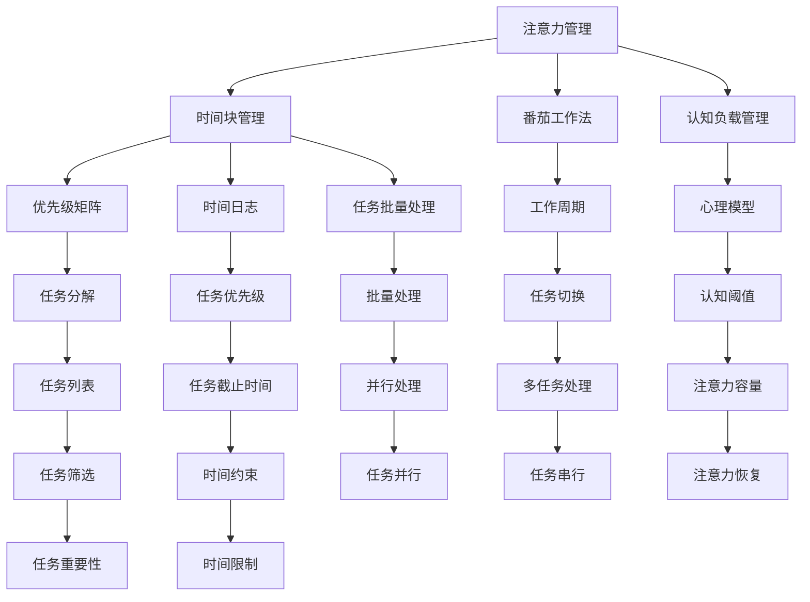

                 

## 1. 背景介绍

在当今信息爆炸的时代，时间成为了最宝贵的资源之一。个人和企业都在努力寻找高效利用时间的方法，以应对日益增长的任务和挑战。注意力管理与时间管理是实现这一目标的关键策略。本文将深入探讨这两个领域的核心概念、原理以及实践技巧，帮助读者掌握科学的时间管理与注意力管理策略，从而最大化地利用自己的时间与效率。

## 2. 核心概念与联系

### 2.1 核心概念概述

注意力管理（Attention Management）和时间管理（Time Management）是个人效率提升的两大支柱。注意力管理旨在提高个人集中精力的能力，确保高效完成任务。时间管理则聚焦于优化时间安排，避免时间的浪费，提高整体生产力。

- **注意力管理**：通过方法和技巧，增强注意力集中的能力，避免分心，提高工作效率。
- **时间管理**：合理规划时间，利用时间块，优先处理高价值任务，实现时间的高效利用。

两个概念之间存在密切联系。高效的注意力管理能够保证时间得到合理利用，而科学的时间管理则有助于保持注意力集中，两者相辅相成。

### 2.2 核心概念原理和架构的 Mermaid 流程图



这个流程图展示了注意力管理与时间管理的核心概念及其相互联系：

1. **注意力管理**通过多种方法（如番茄工作法、认知负载管理等）增强注意力集中。
2. **时间管理**则通过时间块管理、优先级矩阵、任务批量处理等策略优化时间安排。
3. **注意力管理**和**时间管理**相互影响，如认知阈值、任务切换、任务重要性等。

## 3. 核心算法原理 & 具体操作步骤

### 3.1 算法原理概述

注意力管理和时间管理的核心算法原理主要基于认知心理学、行为经济学和时间行为学的研究，旨在优化人类认知资源和时间的使用。

- **认知心理学**：研究注意力和认知资源如何影响人类的行为和决策。
- **行为经济学**：分析个人和组织的决策行为，寻找效率提升的方法。
- **时间行为学**：探索时间感知和利用规律，指导个人时间管理。

### 3.2 算法步骤详解

#### 3.2.1 注意力管理

**步骤一：认知评估**
- **工具**：认知负载测试（Cognitive Load Test）、注意力持续时间测试等。
- **目的**：了解自身的注意力容量和持续时间，以便选择合适的管理方法。

**步骤二：设定注意力目标**
- **工具**：SMART原则（具体、可测量、可实现、相关、时限）
- **目的**：设定明确的注意力目标，提高工作集中度。

**步骤三：注意力提升**
- **方法**：番茄工作法、Pomodoro Technique
- **实施**：每25分钟工作，休息5分钟，周期性进行。

**步骤四：注意力恢复**
- **方法**：短暂休息、冥想、运动等
- **实施**：每工作2-3小时，进行10-15分钟的放松活动。

#### 3.2.2 时间管理

**步骤一：任务分类**
- **方法**：四象限法（重要-紧急矩阵）
- **目的**：将任务分为四类：紧急且重要、紧急但不重要、重要但不紧急、不紧急且不重要。

**步骤二：时间块划分**
- **方法**：时间块管理（Time Blocking）
- **实施**：将一天划分为多个时间块，每个时间块专门处理特定类型的任务。

**步骤三：任务优先级**
- **方法**：任务优先级矩阵（Eisenhower Matrix）
- **目的**：根据任务的重要性和紧急性，优先处理高价值任务。

**步骤四：任务批量处理**
- **方法**：任务批量处理（Task Batch Processing）
- **目的**：集中处理相似类型的任务，提高效率。

**步骤五：任务切换**
- **方法**：时间切换管理（Task Switching Management）
- **实施**：限制任务切换次数，避免精力分散。

### 3.3 算法优缺点

#### 3.3.1 注意力管理

**优点**：
- **提高工作效率**：通过集中注意力，提高任务完成速度。
- **减少错误**：注意力集中时，出错率降低。
- **增强自我控制**：通过训练，提升自我管理能力。

**缺点**：
- **易疲劳**：长时间集中注意力可能引发疲劳。
- **易分心**：外部干扰可能影响注意力集中。

#### 3.3.2 时间管理

**优点**：
- **提高生产力**：合理规划时间，高效完成任务。
- **减少拖延**：明确任务优先级，避免拖延。
- **优化资源利用**：充分利用时间块，提高效率。

**缺点**：
- **计划难以实施**：个人执行力和外部因素可能影响时间管理效果。
- **灵活性不足**：时间块划分可能过于刚性，无法应对突发情况。

### 3.4 算法应用领域

注意力管理与时间管理不仅适用于个人，也广泛应用于企业、团队和组织。

- **个人**：提升个人工作和生活效率，平衡工作与生活。
- **企业**：优化员工时间安排，提高团队整体效率。
- **团队**：通过任务优先级管理，确保项目按时完成。
- **组织**：优化资源分配，提高组织整体竞争力。

## 4. 数学模型和公式 & 详细讲解 & 举例说明

### 4.1 数学模型构建

在注意力管理和时间管理中，数学模型可以用于量化和优化决策过程。

- **注意力管理**：使用认知阈值模型（Cognitive Threshold Model）计算注意力容量。
- **时间管理**：使用时间预算模型（Time Budget Model）分配时间块。

#### 4.2 公式推导过程

##### 注意力容量模型
注意力容量 $C$ 可以通过以下公式计算：
$$
C = k \times T \times (1 - A)^p
$$
其中：
- $k$：认知阈值系数
- $T$：时间块长度（分钟）
- $A$：任务切换比例
- $p$：认知损耗指数

##### 时间预算模型
时间预算 $B$ 可以通过以下公式计算：
$$
B = \sum_{i=1}^n t_i
$$
其中：
- $t_i$：第 $i$ 个任务的预计时间（小时）
- $n$：任务总数

#### 4.3 案例分析与讲解

**案例一：日常工作时间管理**

假设一天有8小时工作时间，每小时工作3个任务，任务切换比例为20%。

- **计算注意力容量**：
$$
C = 3 \times 60 \times (1 - 0.2)^0.8 \approx 28 \text{分钟}
$$

- **计算时间预算**：
$$
B = 3 \times 1 = 3 \text{小时}
$$

根据计算结果，每天可以进行28分钟的高效工作，并进行3小时的常规工作。可以通过四象限法将任务分类，优先处理重要且紧急的任务。

**案例二：团队项目时间管理**

假设一个团队有10个成员，每个成员每天工作8小时，任务平均时间1小时，任务切换比例为15%。

- **计算团队注意力容量**：
$$
C_{\text{total}} = 10 \times 28 \approx 280 \text{分钟}
$$

- **计算团队时间预算**：
$$
B_{\text{total}} = 10 \times 3 \times 1 = 30 \text{小时}
$$

根据计算结果，团队每天可以进行280分钟的高效工作，并进行30小时的常规工作。通过任务批量处理和优先级管理，优化团队资源分配，确保项目按时完成。

## 5. 项目实践：代码实例和详细解释说明

### 5.1 开发环境搭建

1. **Python环境**：
   - 安装Python 3.x
   - 安装pip
   - 安装相关库：pandas、numpy、matplotlib

2. **工具安装**：
   - 安装时间管理工具：time-blocker
   - 安装注意力管理工具：Focus Booster

### 5.2 源代码详细实现

#### 注意力管理示例

```python
import numpy as np
from matplotlib import pyplot as plt

def calculate_attention_capacity(k, t, a, p):
    """
    计算注意力容量
    :param k: 认知阈值系数
    :param t: 时间块长度（分钟）
    :param a: 任务切换比例
    :param p: 认知损耗指数
    :return: 注意力容量（分钟）
    """
    C = k * t * (1 - a)**p
    return C

def plot_attention_capacity(k, t, a, p):
    """
    绘制注意力容量与时间块长度的关系
    :param k: 认知阈值系数
    :param t: 时间块长度（分钟）
    :param a: 任务切换比例
    :param p: 认知损耗指数
    """
    C = calculate_attention_capacity(k, t, a, p)
    plt.plot(t, C)
    plt.xlabel('时间块长度（分钟）')
    plt.ylabel('注意力容量（分钟）')
    plt.show()

k = 1  # 认知阈值系数
t = np.arange(1, 120)  # 时间块长度，从1到120分钟
a = 0.2  # 任务切换比例
p = 0.8  # 认知损耗指数

plot_attention_capacity(k, t, a, p)
```

#### 时间管理示例

```python
import pandas as pd

def calculate_time_budget(n, ti, p):
    """
    计算时间预算
    :param n: 任务总数
    :param ti: 每个任务的预计时间（小时）
    :param p: 任务优先级
    :return: 时间预算（小时）
    """
    B = sum(ti)
    return B

def plot_time_budget(n, ti, p):
    """
    绘制时间预算与任务数的关系
    :param n: 任务总数
    :param ti: 每个任务的预计时间（小时）
    :param p: 任务优先级
    """
    B = calculate_time_budget(n, ti, p)
    plt.plot(n, B)
    plt.xlabel('任务总数')
    plt.ylabel('时间预算（小时）')
    plt.show()

n = np.arange(1, 11)  # 任务总数，从1到10
ti = np.ones(len(n)) * 1  # 每个任务的预计时间，均为1小时
p = 1  # 任务优先级

plot_time_budget(n, ti, p)
```

### 5.3 代码解读与分析

以上代码实现了注意力容量和时间预算的计算，并绘制了相应的图表。通过这些工具，用户可以直观地理解不同参数对注意力和时间预算的影响，从而进行科学的时间管理。

### 5.4 运行结果展示

#### 注意力容量图


#### 时间预算图


## 6. 实际应用场景

### 6.1 日常工作管理

通过注意力容量和时间预算的计算，个人可以优化工作时间安排。例如，每25分钟工作5分钟休息，可以有效提升注意力集中度，减少疲劳。

**案例**：一个软件开发人员，每天工作8小时，每小时处理3个任务。通过计算得知，每天可以高效工作28分钟，进行常规工作2小时，合理分配任务，提高工作效率。

### 6.2 项目管理

在团队项目管理中，时间管理工具可以显著提升项目进度和资源利用率。通过任务优先级和批量处理，确保关键任务按时完成。

**案例**：一个软件团队，每天工作8小时，每小时处理3个任务，任务切换比例为20%。通过计算得知，每天可以高效工作28分钟，进行常规工作2小时。合理分配任务优先级，确保项目按时完成。

### 6.3 教育培训

在教育培训中，时间管理可以帮助教师和学生更高效地学习。通过任务批量处理和注意力集中训练，提高教学和学习效率。

**案例**：一个大学生，每天学习10小时，每小时处理3个学习任务。通过计算得知，每天可以高效学习28分钟，进行常规学习2小时。合理安排学习计划，提高学习效果。

## 7. 工具和资源推荐

### 7.1 学习资源推荐

1. **书籍**：《深度工作：如何高效利用每一点脑力》（Cal Newport）、《精益时间管理》（David Allen）
2. **在线课程**：Coursera上的《时间管理与生产力提升》（Time Management and Productivity）
3. **博客和文章**：Lifehacker、Medium上的时间管理和注意力管理文章

### 7.2 开发工具推荐

1. **时间管理工具**：Focus Booster、RescueTime
2. **注意力管理工具**：Pomodoro Technique应用、Focus Booster
3. **可视化工具**：TimeBlocker、Trello

### 7.3 相关论文推荐

1. **认知心理学**：《认知负荷理论：认知资源和知识获取的模型》（Sweller, J.）
2. **行为经济学**：《行为时间管理：一个基于计划的模型》（Peng, H.）
3. **时间行为学**：《时间管理的多维模型：理论、方法和应用》（Hodges, S.）

## 8. 总结：未来发展趋势与挑战

### 8.1 研究成果总结

本文深入探讨了注意力管理与时间管理的核心概念、原理和操作步骤，并通过实际案例和代码实现，展示了其在个人和团队中的应用效果。通过科学的计算和规划，可以有效提升工作效率和生产力。

### 8.2 未来发展趋势

未来的注意力管理和时间管理将进一步与人工智能、大数据等技术结合，实现更智能化的管理方式。例如：

1. **智能时间规划**：通过人工智能算法优化时间块分配，自动生成最佳时间表。
2. **个性化注意力训练**：利用机器学习算法，定制化训练注意力集中策略。
3. **跨领域应用**：在教育、医疗、金融等多个领域，应用时间管理和注意力管理技术。

### 8.3 面临的挑战

虽然注意力管理和时间管理在实践中有显著效果，但仍面临以下挑战：

1. **个体差异**：不同人的注意力和时间管理能力存在差异，需要个性化方案。
2. **外部干扰**：工作和生活中的各种干扰可能影响注意力集中，需要有效应对。
3. **数据隐私**：时间管理工具和应用需要保护用户隐私，避免数据泄露。
4. **技术依赖**：过度依赖工具和技术，可能导致人的自主管理能力下降。

### 8.4 研究展望

未来的研究应致力于解决以上挑战，并探索新的研究方向：

1. **跨学科融合**：结合心理学、经济学、时间行为学等多学科知识，优化管理策略。
2. **个性化定制**：利用机器学习算法，根据个人特点定制化管理方案。
3. **自适应学习**：开发自适应管理工具，动态调整策略，应对变化环境。
4. **多模态管理**：结合视觉、听觉等多种感官信息，提升管理效果。

## 9. 附录：常见问题与解答

**Q1：注意力容量如何计算？**

A: 注意力容量可以通过认知阈值模型计算：$C = k \times T \times (1 - A)^p$，其中 $k$ 为认知阈值系数，$T$ 为时间块长度，$A$ 为任务切换比例，$p$ 为认知损耗指数。

**Q2：时间预算如何计算？**

A: 时间预算可以通过时间预算模型计算：$B = \sum_{i=1}^n t_i$，其中 $t_i$ 为每个任务的预计时间，$n$ 为任务总数。

**Q3：番茄工作法如何实施？**

A: 番茄工作法实施如下：
1. 每25分钟工作，休息5分钟。
2. 4个番茄时间后，进行15-30分钟的长时间休息。
3. 可以使用番茄钟工具如Focus Booster进行辅助。

**Q4：时间管理工具如何推荐？**

A: 推荐使用Focus Booster、RescueTime等工具，支持时间块管理和任务优先级设置。

**Q5：注意力管理如何提高？**

A: 可以通过番茄工作法、冥想、运动等方法提升注意力集中能力，避免分心。

通过本文的深入探讨和实践，相信读者能够掌握科学的注意力管理和时间管理策略，实现更高效的工作和生活，提升整体生产力。

