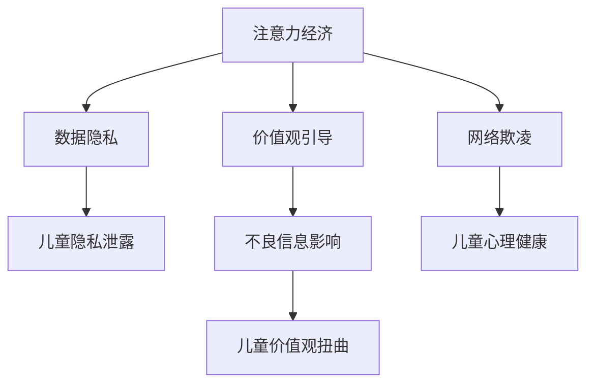

                 

# 注意力经济下的儿童保护问题

在数字化时代的浪潮中，儿童面临的各类安全问题愈发严峻。从网络欺凌到数据泄露，再到个人隐私的侵犯，儿童在虚拟与现实世界的交融中，正逐渐成为网络注意力经济的牺牲品。本文将从注意力经济的角度，探讨儿童在数字生态中的保护问题，并尝试提出一系列解决方案，以期通过技术手段构建一个更安全、更友好的数字环境。

## 1. 背景介绍

### 1.1 问题由来

随着数字经济的发展，各类平台利用用户注意力的集中和扩散，不断扩展其用户规模和影响力。尤其是在儿童群体中，他们对新奇事物的兴趣和好奇，使其成为各大社交媒体、视频平台、游戏平台等竞相争夺的对象。这种对儿童注意力的集中与扩散，本质上是一种注意力经济现象。然而，在儿童缺乏足够的自我保护能力，且对信息辨识能力不足的背景下，这种注意力经济行为往往会带来严重的后果。

### 1.2 问题核心关键点

当前儿童面临的注意力经济问题主要体现在以下几个方面：

- **网络欺凌与心理健康**：儿童在社交媒体上频繁遭遇欺凌和污名化，给其心理健康带来巨大压力。
- **数据泄露与隐私保护**：儿童的个人数据频繁被各类应用采集和利用，而平台在使用数据时往往缺乏必要的保护措施。
- **不良信息与价值观引导**：儿童在接触网络信息时，容易受到有害信息的影响，形成扭曲的价值观。

### 1.3 问题研究意义

通过从注意力经济的角度探讨儿童保护问题，旨在揭示数字生态对儿童注意力的影响机制，并寻求技术手段，减少注意力经济对儿童的伤害。同时，通过理解儿童在数字环境中的行为特征，为儿童保护提供针对性的建议，助力构建健康、友好的数字世界。

## 2. 核心概念与联系

### 2.1 核心概念概述

在探讨儿童保护问题的过程中，需要引入以下几个核心概念：

- **注意力经济**：指各类平台通过集中和扩散用户的注意力，创造经济价值的现象。儿童因天生对新鲜事物的好奇心和兴趣，成为该经济形态的焦点。
- **网络欺凌**：指在网络环境中，通过文字、图片、视频等形式，对他人进行恶意攻击的行为。
- **数据隐私**：指个人数据的收集、存储和使用过程中，保护数据主体的知情权和控制权，防止数据被滥用。
- **价值观引导**：指个体在接收信息时，受到外界信息的影响，形成自己的价值观和态度。

这些概念之间有着密切的联系，共同构成了儿童在数字生态中的注意力经济问题。

### 2.2 核心概念原理和架构的 Mermaid 流程图



该流程图展示了注意力经济对儿童的直接影响，包括网络欺凌、数据隐私泄露、不良信息对儿童心理和价值观的影响。同时，儿童隐私泄露和不良信息影响又进一步加剧了网络欺凌和儿童心理健康问题。

## 3. 核心算法原理 & 具体操作步骤

### 3.1 算法原理概述

为解决儿童在数字环境中的注意力经济问题，需要引入一系列基于注意力机制的算法和技术。这些算法和技术可以用于检测、监控、引导和保护儿童的网络行为，构建一个更安全、更友好的数字环境。

### 3.2 算法步骤详解

1. **注意力检测**：通过分析儿童在网络平台上的行为数据，如访问频率、停留时间、互动内容等，识别出儿童对某类内容或平台的关注程度。
   
2. **行为监控**：使用机器学习算法，对儿童的网络行为进行实时监控，检测出异常行为，如过度沉迷、频繁接触不良信息等。

3. **内容过滤**：设计算法对网络内容进行过滤，屏蔽掉有害信息，如色情、暴力、欺凌等内容，确保儿童接触的信息健康向上。

4. **引导教育**：开发智能辅助系统，对儿童进行价值观引导，帮助其形成正确的世界观和价值观。

5. **隐私保护**：设计隐私保护算法，对儿童的个人数据进行加密和匿名化处理，防止数据泄露。

6. **心理健康支持**：利用自然语言处理技术，对儿童的网络行为进行情感分析，及时发现心理健康问题，并提供相应的心理支持和干预措施。

### 3.3 算法优缺点

基于注意力机制的儿童保护算法有以下优点：

- **实时性**：能够对儿童的网络行为进行实时监控和干预，及时发现和解决问题。
- **准确性**：通过机器学习算法和大数据分析，可以准确识别出有害信息和行为，提供精准的保护措施。
- **个性化**：能够根据每个儿童的行为特征和兴趣偏好，提供个性化的保护方案，提升保护效果。

同时，该算法也存在一些缺点：

- **数据依赖**：算法需要大量数据进行训练和优化，数据获取和处理成本较高。
- **模型复杂性**：算法涉及多模态数据的处理和融合，模型结构复杂，难以快速部署。
- **隐私风险**：在数据收集和分析过程中，存在隐私泄露的风险。

### 3.4 算法应用领域

基于注意力机制的儿童保护算法主要应用于以下几个领域：

- **社交媒体平台**：通过分析用户在平台上的行为数据，识别出有害信息，并及时屏蔽或删除。
- **游戏平台**：检测儿童在游戏中的过度沉迷和不当行为，提供防沉迷系统和心理干预。
- **教育平台**：通过内容过滤和引导教育，保护儿童在在线教育中的学习环境和心理健康。
- **视频平台**：对儿童频繁观看的内容进行监控和引导，确保其接触健康向上的视频内容。

## 4. 数学模型和公式 & 详细讲解 & 举例说明

### 4.1 数学模型构建

为构建儿童保护算法，我们需要建立以下数学模型：

- **行为特征提取模型**：将儿童在网络平台上的行为数据转化为高维特征向量。
- **行为异常检测模型**：使用异常检测算法，如One-class SVM、Isolation Forest等，检测儿童网络行为中的异常模式。
- **内容过滤模型**：使用自然语言处理和图像处理技术，对网络内容进行分类和过滤。
- **价值观引导模型**：设计情感分析算法，对儿童的在线交流内容进行情感分析，并提供价值观引导建议。
- **隐私保护模型**：采用数据加密和匿名化技术，确保儿童数据的安全性。
- **心理健康模型**：设计情感分析模型，对儿童的情感状态进行识别，并提供心理健康支持。

### 4.2 公式推导过程

以行为异常检测模型为例，使用One-class SVM进行儿童行为异常检测，其基本思想是将儿童正常行为数据转化为核函数，然后使用SVM进行分类，检测出异常行为。

假设儿童在社交平台上的行为数据为 $x_1, x_2, ..., x_n$，每个行为 $x_i$ 可以表示为高维向量。One-class SVM的核函数为：

$$
\phi(x_i) = [x_i, \phi(x_i), \phi(\phi(x_i)), ...]
$$

其中 $\phi$ 为核函数，如高斯核函数。SVM的分类器为：

$$
f(x) = \begin{cases}
1 & \text{if } \delta(x) > 0 \\
-1 & \text{if } \delta(x) < 0
\end{cases}
$$

其中 $\delta(x)$ 为SVM分类器的输出。

### 4.3 案例分析与讲解

假设某儿童在社交平台上频繁接触不良信息，并进行了多次攻击性言论的发帖。通过One-class SVM检测算法，我们可以得到该儿童的行为模式异常度，从而及时进行干预。

## 5. 项目实践：代码实例和详细解释说明

### 5.1 开发环境搭建

要实现儿童保护算法，需要搭建以下开发环境：

1. **Python开发环境**：安装Python 3.8及以上版本，并配置虚拟环境。
2. **数据处理工具**：安装Pandas、NumPy等数据处理库。
3. **机器学习框架**：安装Scikit-learn、TensorFlow等机器学习框架。
4. **自然语言处理库**：安装NLTK、SpaCy等自然语言处理库。
5. **数据可视化工具**：安装Matplotlib、Seaborn等数据可视化库。

### 5.2 源代码详细实现

以One-class SVM为例，使用Python实现儿童行为异常检测算法，代码如下：

```python
from sklearn.svm import OneClassSVM
from sklearn.preprocessing import PolynomialFeatures

# 儿童行为数据
X = ...  # 数据集

# 行为特征提取
poly = PolynomialFeatures(degree=2, include_bias=False)
X_poly = poly.fit_transform(X)

# 训练One-class SVM分类器
clf = OneClassSVM(nu=0.1, kernel='rbf')
clf.fit(X_poly)

# 检测异常行为
y_pred = clf.predict(X_poly)
```

### 5.3 代码解读与分析

上述代码中，我们首先使用PolynomialFeatures对儿童行为数据进行特征提取，将其转化为高维特征向量。然后使用One-class SVM进行训练，并检测异常行为。其中，nu参数表示异常检测的比例，kernel参数指定使用高斯核函数。

### 5.4 运行结果展示

训练完成后，可以通过以下代码可视化检测结果：

```python
import matplotlib.pyplot as plt

plt.scatter(X_poly[:, 0], X_poly[:, 1], c=y_pred)
plt.title('One-class SVM检测结果')
plt.show()
```

### 6. 实际应用场景

儿童保护算法在实际应用中，可以广泛应用于以下几个场景：

- **社交媒体平台**：在用户行为数据上进行实时监控，屏蔽有害信息，预防网络欺凌。
- **游戏平台**：检测儿童的游戏行为，防止过度沉迷，提供心理干预。
- **教育平台**：对儿童在线交流内容进行情感分析，提供价值观引导和心理健康支持。
- **视频平台**：对儿童观看内容进行监控，确保其接触健康向上的视频内容。

### 6.4 未来应用展望

未来，随着技术的不断发展，儿童保护算法还将迎来更多的应用场景：

- **跨平台数据整合**：通过整合多平台数据，提供更全面的儿童行为分析和保护措施。
- **个性化推荐系统**：根据儿童的兴趣和行为特征，推荐健康向上的内容和活动。
- **心理健康干预系统**：通过情感分析和心理测试，及时发现儿童的心理健康问题，并提供针对性的干预。
- **家庭互动平台**：通过智能设备收集儿童的日常活动数据，与家长进行互动，共同参与儿童保护。

## 7. 工具和资源推荐

### 7.1 学习资源推荐

1. **《Python数据科学手册》**：深入讲解Python在数据处理和机器学习中的应用。
2. **《机器学习实战》**：介绍机器学习算法的实践，包括分类、聚类等。
3. **《自然语言处理综论》**：全面覆盖自然语言处理的基础知识和前沿技术。
4. **《数据科学导论》**：介绍数据科学的基本概念和方法。
5. **Kaggle**：提供大量数据集和竞赛，提升数据处理和机器学习技能。

### 7.2 开发工具推荐

1. **Jupyter Notebook**：用于编写和运行Python代码，支持多种数据可视化库。
2. **PyCharm**：Python开发环境，提供代码编辑、调试和运行功能。
3. **Git**：版本控制工具，用于团队协作和代码管理。
4. **Docker**：容器化部署工具，确保环境一致性。
5. **Kubernetes**：容器编排工具，支持大规模集群部署。

### 7.3 相关论文推荐

1. **《异常检测：最新进展》**：综述了异常检测的最新研究进展和应用。
2. **《基于深度学习的内容推荐算法》**：介绍深度学习在推荐系统中的应用。
3. **《自然语言处理中的情感分析》**：详细讲解情感分析的基本概念和算法。
4. **《数据隐私保护技术综述》**：介绍数据隐私保护的各种技术和方法。
5. **《儿童心理健康研究综述》**：综述了儿童心理健康的各种问题和解决方法。

## 8. 总结：未来发展趋势与挑战

### 8.1 研究成果总结

本文系统探讨了基于注意力机制的儿童保护算法，提出了一系列的解决方案，包括行为异常检测、内容过滤、价值观引导、隐私保护、心理健康支持等。这些算法和技术，可以在儿童在数字环境中的注意力经济问题，提供了有力的技术支持。

### 8.2 未来发展趋势

未来，儿童保护算法将朝着以下几个方向发展：

- **跨平台整合**：整合多平台数据，提供更全面的儿童行为分析和保护措施。
- **个性化推荐**：根据儿童的兴趣和行为特征，推荐健康向上的内容和活动。
- **心理干预**：通过情感分析和心理测试，及时发现儿童的心理健康问题，并提供针对性的干预。
- **家庭互动**：通过智能设备收集儿童的日常活动数据，与家长进行互动，共同参与儿童保护。

### 8.3 面临的挑战

儿童保护算法在发展过程中，仍面临以下挑战：

- **数据隐私**：在数据收集和分析过程中，需要保护儿童的隐私和个人信息。
- **算法公平性**：算法在检测异常行为时，需避免对某些群体产生偏见。
- **技术普及**：如何使技术解决方案易于理解和接受，并普及到各类家庭和教育机构。
- **跨领域合作**：需与教育、医疗、心理等多个领域合作，提供全面的儿童保护措施。

### 8.4 研究展望

未来，儿童保护算法的研究将关注以下几个方向：

- **深度学习与多模态数据融合**：探索深度学习与多模态数据融合技术，提升算法的准确性和鲁棒性。
- **情感计算与心理健康**：通过情感计算技术，提升儿童心理健康检测和干预的精准性。
- **跨平台数据整合**：通过跨平台数据整合技术，提供更全面的儿童行为分析和保护措施。
- **家庭教育与智能互动**：结合家庭教育理念和智能设备技术，提供更科学、更全面的儿童保护解决方案。

总之，基于注意力机制的儿童保护算法，在未来的数字生态中将发挥越来越重要的作用，为儿童提供一个更安全、更友好的数字环境。

## 9. 附录：常见问题与解答

**Q1：如何在保护儿童隐私的前提下，收集和分析儿童网络行为数据？**

A: 使用匿名化和加密技术，对儿童的网络行为数据进行处理。例如，将行为数据进行脱敏处理，去除可以识别个人信息的部分，然后对处理后的数据进行分析和检测。

**Q2：如何确保儿童保护算法的公平性和无偏见性？**

A: 在算法设计和训练过程中，引入公平性评估指标，如平衡准确率、多样性等。同时，定期对算法进行评估和更新，确保其对不同群体的公平性。

**Q3：如何降低儿童保护算法的复杂度和资源消耗？**

A: 使用轻量级算法和技术，如深度学习中的MobileNet、EfficientNet等，以及分布式计算技术，如TensorFlow分布式训练，减少算法的复杂度和资源消耗。

**Q4：如何提高儿童保护算法的可解释性和可理解性？**

A: 使用可解释性技术，如LIME、SHAP等，解释算法模型中的关键特征和决策逻辑。同时，开发易于理解的可视化界面，帮助家长和教师理解算法的输出和建议。

**Q5：如何保护儿童在数字环境中的心理健康？**

A: 结合心理学家和教育专家的建议，设计情感分析模型和心理健康引导系统。通过情感分析，及时发现儿童的负面情绪和心理问题，并提供相应的心理支持和干预措施。

---

作者：禅与计算机程序设计艺术 / Zen and the Art of Computer Programming

