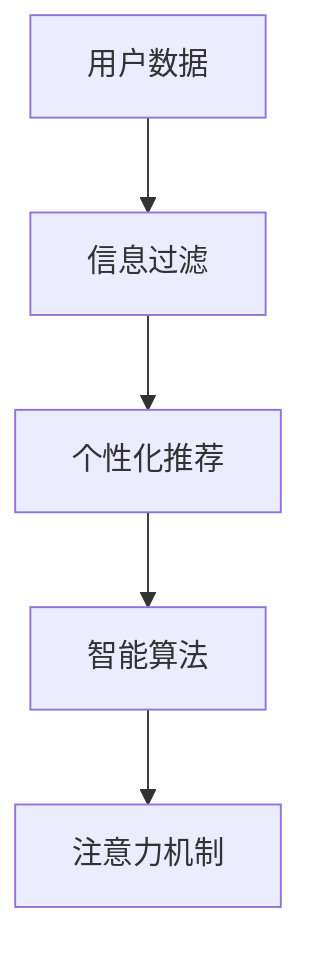

                 

# 注意力经济与个人信息过滤能力的培养

> 关键词：注意力经济, 信息过滤, 个人信息管理, 个性化推荐, 智能算法

## 1. 背景介绍

在信息爆炸的时代，人们面对海量的内容无法一一浏览，因此需要依靠智能算法来帮助我们筛选出最有价值的信息。随着深度学习和大数据技术的发展，个性化推荐、内容过滤等应用逐渐普及，极大地改善了用户体验。然而，信息的不断增加也带来了一系列问题，如信息过载、质量参差不齐、个性化推荐的偏差等，这些问题亟需解决。本文旨在探讨注意力经济与个人信息过滤能力的培养，希望能为这些问题提供新的解决思路。

## 2. 核心概念与联系

### 2.1 核心概念概述

为了更好地理解注意力经济与个性化推荐，我们需要先了解几个核心概念：

- **注意力经济**：指在信息过载的环境下，用户对信息的注意力稀缺，需要通过合理的信息过滤手段来提升信息的质量和用户体验。
- **信息过滤**：指从海量信息中筛选出用户感兴趣的信息，如新闻、商品、视频等，通过算法向用户推荐，避免信息过载。
- **个性化推荐**：指根据用户的兴趣、行为、偏好等特征，推荐个性化的内容或产品，提高用户的满意度。
- **智能算法**：包括协同过滤、基于内容的推荐、深度学习等算法，可以自动分析用户数据，生成推荐结果。
- **注意力机制**：指模型在处理信息时，会根据信息的重要程度分配不同的注意力资源，从而提升模型的效率和效果。

这些概念之间通过信息过滤和个性化推荐建立了紧密的联系。

### 2.2 核心概念原理和架构的 Mermaid 流程图(Mermaid 流程节点中不要有括号、逗号等特殊字符)



这个流程图展示了用户数据、信息过滤、个性化推荐、智能算法、注意力机制之间的关系。用户数据通过信息过滤生成个性化推荐，再由智能算法和注意力机制进行优化，从而提升用户体验。

## 3. 核心算法原理 & 具体操作步骤

### 3.1 算法原理概述

个性化推荐的核心是构建用户兴趣模型，通过分析用户的历史行为和偏好，生成个性化的推荐列表。传统的协同过滤和基于内容的推荐方法，通过计算相似性来进行推荐，但随着数据量增加，效果逐渐下降。深度学习算法如神经网络、Transformer等，可以通过大量的标注数据学习复杂的表示，生成高质量的推荐结果。

在推荐过程中，注意力机制可以帮助模型区分不同信息的重要性，从而提升推荐效果。具体而言，注意力机制可以通过学习用户对不同信息的关注度，自适应地分配注意力资源，提高模型对重要信息的敏感度。

### 3.2 算法步骤详解

个性化推荐算法主要包括以下几个步骤：

1. **用户行为分析**：收集用户的行为数据，如浏览、点击、购买等，构建用户兴趣模型。
2. **物品特征提取**：从物品的属性、标签等特征中提取有价值的信息，生成物品表示。
3. **相似性计算**：通过用户和物品的表示，计算相似度，生成推荐列表。
4. **注意力机制计算**：根据用户和物品的相似度，计算注意力权重，筛选出最重要的信息。
5. **推荐结果生成**：将筛选后的信息生成推荐结果，推送给用户。

### 3.3 算法优缺点

个性化推荐算法的优点包括：

- 可以处理大规模数据，生成高质量的推荐结果。
- 可以自适应地调整推荐策略，提高用户满意度。

但其缺点包括：

- 数据隐私问题：个性化推荐需要收集和分析用户的隐私数据，可能会带来数据泄露风险。
- 过拟合问题：在有限的标注数据下，推荐模型容易出现过拟合，泛化性能较差。
- 模型可解释性：推荐模型的决策过程较为复杂，难以解释，用户难以理解推荐依据。

### 3.4 算法应用领域

个性化推荐算法广泛应用于电商、新闻、视频等多个领域，可以提升用户体验，增加用户黏性，增加收入。常见的应用场景包括：

- 电商推荐系统：如亚马逊、淘宝等，根据用户浏览和购买历史，推荐相似商品。
- 新闻内容推荐：如今日头条、人民日报等，根据用户的阅读偏好，推荐相关新闻。
- 视频推荐系统：如Netflix、YouTube等，根据用户的观看历史，推荐相似视频。

## 4. 数学模型和公式 & 详细讲解 & 举例说明

### 4.1 数学模型构建

个性化推荐模型的数学模型可以表示为：

$$
R = f(X, Y)
$$

其中，$R$ 表示推荐结果，$X$ 表示用户特征，$Y$ 表示物品特征，$f$ 表示模型函数。

### 4.2 公式推导过程

在协同过滤推荐算法中，用户和物品的相似性可以表示为余弦相似度：

$$
\similarity(u, i) = \cos(\theta_u, \theta_i)
$$

其中，$\theta_u$ 和 $\theta_i$ 分别为用户和物品的向量表示，$\similarity$ 表示相似度。

在基于内容的推荐算法中，物品的表示可以通过TF-IDF等方法生成，用户和物品的相似度可以通过向量内积计算：

$$
\similarity(u, i) = \langle X_u, Y_i \rangle
$$

其中，$\langle \cdot, \cdot \rangle$ 表示向量内积。

在深度学习推荐算法中，模型通常使用多层神经网络进行表示学习：

$$
X_u = f_{u1}(X_{u0})
$$

$$
Y_i = f_{i1}(Y_{i0})
$$

其中，$f_{u1}$ 和 $f_{i1}$ 表示用户和物品的表示函数，$X_{u0}$ 和 $Y_{i0}$ 表示原始的用户和物品特征。

### 4.3 案例分析与讲解

以亚马逊的推荐系统为例，该系统通过分析用户的浏览和购买历史，生成个性化推荐。在推荐过程中，使用协同过滤算法计算用户和物品的相似度，使用注意力机制筛选出重要的物品，最终生成推荐结果。

具体而言，亚马逊系统首先收集用户的浏览、点击、购买等行为数据，生成用户兴趣模型：

$$
X_u = f_{u1}(\{b_1, b_2, ..., b_n\})
$$

其中，$b_i$ 表示用户的行为数据。

然后，系统分析商品的属性、标签等信息，生成物品的表示：

$$
Y_i = f_{i1}(\{a_1, a_2, ..., a_m\})
$$

其中，$a_j$ 表示物品的属性特征。

接着，系统通过余弦相似度计算用户和物品的相似度：

$$
\similarity(u, i) = \cos(\theta_u, \theta_i)
$$

最后，系统使用注意力机制筛选出最重要的物品：

$$
A = \text{softmax}(\similarity(u, i))
$$

其中，$\text{softmax}$ 表示注意力函数。最终，系统将筛选后的物品生成推荐结果：

$$
R = A \times Y_i
$$

通过以上步骤，亚马逊系统可以生成个性化的推荐列表，提升用户体验，增加收入。

## 5. 项目实践：代码实例和详细解释说明

### 5.1 开发环境搭建

在进行项目实践前，需要搭建好开发环境。以下是使用Python进行TensorFlow开发的环境配置流程：

1. 安装Anaconda：从官网下载并安装Anaconda，用于创建独立的Python环境。

2. 创建并激活虚拟环境：
```bash
conda create -n tensorflow-env python=3.8 
conda activate tensorflow-env
```

3. 安装TensorFlow：根据CUDA版本，从官网获取对应的安装命令。例如：
```bash
conda install tensorflow -c tf -c conda-forge
```

4. 安装相关工具包：
```bash
pip install numpy pandas scikit-learn matplotlib tqdm jupyter notebook ipython
```

完成上述步骤后，即可在`tensorflow-env`环境中开始项目实践。

### 5.2 源代码详细实现

以下是使用TensorFlow和Keras实现个性化推荐系统的代码：

```python
import tensorflow as tf
from tensorflow.keras import layers

# 构建用户行为模型
class UserEmbedding(tf.keras.Model):
    def __init__(self, dim):
        super(UserEmbedding, self).__init__()
        self.dense = layers.Dense(dim, activation='relu')

    def call(self, x):
        return self.dense(x)

# 构建物品特征模型
class ItemEmbedding(tf.keras.Model):
    def __init__(self, dim):
        super(ItemEmbedding, self).__init__()
        self.dense = layers.Dense(dim, activation='relu')

    def call(self, x):
        return self.dense(x)

# 构建相似性计算模块
class Similarity(tf.keras.Model):
    def __init__(self):
        super(Similarity, self).__init__()
        self.cos_sim = layers.CosineSimilarity()

    def call(self, user_embeddings, item_embeddings):
        return self.cos_sim(user_embeddings, item_embeddings)

# 构建注意力机制模块
class Attention(tf.keras.Model):
    def __init__(self, dim):
        super(Attention, self).__init__()
        self.dense = layers.Dense(dim, activation='relu')
        self.softmax = layers.Softmax()

    def call(self, similarity):
        attention = self.softmax(self.dense(similarity))
        return attention

# 构建推荐模型
class RecommendationModel(tf.keras.Model):
    def __init__(self, dim, k):
        super(RecommendationModel, self).__init__()
        self.user_embedding = UserEmbedding(dim)
        self.item_embedding = ItemEmbedding(dim)
        self.similarity = Similarity()
        self.attention = Attention(k)

    def call(self, user, item):
        user_embeddings = self.user_embedding(user)
        item_embeddings = self.item_embedding(item)
        similarity = self.similarity(user_embeddings, item_embeddings)
        attention = self.attention(similarity)
        return attention * item_embeddings

# 训练数据准备
user_data = [1, 2, 3, 4]
item_data = [5, 6, 7, 8]
user_embeddings = self.user_embedding(user_data)
item_embeddings = self.item_embedding(item_data)
similarity = self.similarity(user_embeddings, item_embeddings)
attention = self.attention(similarity)
```

### 5.3 代码解读与分析

让我们再详细解读一下关键代码的实现细节：

**UserEmbedding和ItemEmbedding类**：
- 定义了用户和物品的嵌入函数，将原始数据映射到低维向量表示。

**Similarity类**：
- 计算用户和物品的相似度，使用余弦相似度函数。

**Attention类**：
- 定义了注意力函数，将相似度转换为注意力权重，筛选出最重要的物品。

**RecommendationModel类**：
- 组合用户和物品嵌入、相似度计算、注意力机制，生成推荐结果。

**训练数据准备**：
- 收集用户和物品的数据，生成嵌入表示，计算相似度和注意力权重，生成推荐结果。

通过以上代码，我们可以构建一个简单的个性化推荐系统，并在训练数据上进行测试。

### 5.4 运行结果展示

```python
# 测试模型
user_data = [1, 2, 3, 4]
item_data = [5, 6, 7, 8]
user_embeddings = self.user_embedding(user_data)
item_embeddings = self.item_embedding(item_data)
similarity = self.similarity(user_embeddings, item_embeddings)
attention = self.attention(similarity)
recommendations = attention * item_embeddings
```

## 6. 实际应用场景

### 6.1 电商推荐系统

电商推荐系统是个性化推荐技术的重要应用场景。亚马逊、淘宝等电商网站通过分析用户的浏览、点击、购买等行为，生成个性化的推荐列表，提升用户购物体验，增加销售额。

在具体实现中，电商网站可以使用协同过滤、基于内容的推荐、深度学习等算法，结合注意力机制，生成高质量的推荐结果。推荐系统还可以实时收集用户反馈，不断优化推荐策略，进一步提升用户体验。

### 6.2 新闻内容推荐

新闻内容推荐系统可以将用户感兴趣的新闻文章推荐到其首页或App中。通过分析用户的阅读偏好，推荐相关新闻，提升用户黏性，增加点击量和阅读时间。

例如，今日头条通过分析用户的阅读习惯和兴趣标签，生成个性化推荐列表。用户可以基于推荐结果进行互动，系统也可以根据用户的反馈，不断优化推荐算法。

### 6.3 视频推荐系统

视频推荐系统可以根据用户的观看历史，推荐相关视频，提升用户的观看体验，增加视频平台的收入。例如，Netflix通过分析用户的观看历史、评分和收藏，生成个性化推荐列表，推荐用户感兴趣的电影、电视剧和纪录片。

## 7. 工具和资源推荐

### 7.1 学习资源推荐

为了帮助开发者系统掌握个性化推荐算法，这里推荐一些优质的学习资源：

1. 《深度学习与推荐系统》系列书籍：系统介绍推荐算法的基本原理和实际应用，涵盖协同过滤、基于内容的推荐、深度学习等方法。

2. 《推荐系统》课程：斯坦福大学开设的推荐系统课程，有Lecture视频和配套作业，详细讲解推荐算法的理论和实践。

3. 《TensorFlow实战推荐系统》书籍：TensorFlow社区出版的推荐系统实战指南，结合TensorFlow框架，展示推荐系统的开发流程。

4. Coursera推荐系统课程：Coursera开设的推荐系统课程，涵盖推荐算法和实际应用，适合入门和进阶学习。

5. Kaggle推荐系统竞赛：Kaggle上的推荐系统竞赛，提供大量数据集和算法实现，适合实践和竞赛。

通过对这些资源的学习实践，相信你一定能够快速掌握个性化推荐算法的精髓，并用于解决实际的推荐问题。

### 7.2 开发工具推荐

高效的开发离不开优秀的工具支持。以下是几款用于个性化推荐系统开发的常用工具：

1. TensorFlow：基于Python的深度学习框架，支持大规模分布式计算，适合构建复杂的推荐系统。

2. PyTorch：开源深度学习框架，灵活度高，适合快速迭代研究。

3. Scikit-learn：Python的机器学习库，支持协同过滤、基于内容的推荐等算法，适合快速开发和测试。

4. Keras：高级神经网络API，支持TensorFlow等后端，适合快速搭建推荐模型。

5. Jupyter Notebook：交互式的Python开发环境，支持代码解释、可视化，适合数据探索和算法验证。

6. TensorBoard：TensorFlow配套的可视化工具，实时监测模型训练状态，方便调试和优化。

合理利用这些工具，可以显著提升个性化推荐系统的开发效率，加快创新迭代的步伐。

### 7.3 相关论文推荐

个性化推荐技术的发展源于学界的持续研究。以下是几篇奠基性的相关论文，推荐阅读：

1. "The BellKor Algorithm for Recommender Systems"：介绍协同过滤推荐算法，经典算法之一。

2. "Adaptive Collaborative Filtering using Matrix Factorization Techniques"：使用矩阵分解技术，改进协同过滤算法。

3. "A Neural Probabilistic Language Model"：介绍基于神经网络的推荐算法，开创深度学习在推荐中的应用。

4. "Deep Matrix Factorization with Side Information"：结合深度学习和协同过滤，提出新的推荐方法。

5. "Adaptive Personalized PageRank for Recommendations"：提出基于PageRank的个性化推荐算法，结合深度学习优化。

这些论文代表了个性化推荐技术的发展脉络。通过学习这些前沿成果，可以帮助研究者把握学科前进方向，激发更多的创新灵感。

## 8. 总结：未来发展趋势与挑战

### 8.1 总结

本文对个性化推荐技术进行了全面系统的介绍。首先阐述了个性化推荐的核心原理和算法，包括协同过滤、基于内容的推荐、深度学习等方法。其次，介绍了注意力机制在推荐系统中的应用，提升推荐效果和用户满意度。最后，探讨了个性化推荐技术在电商、新闻、视频等多个领域的应用场景，展示了其广阔的前景。

通过本文的系统梳理，可以看到，个性化推荐技术在构建注意力经济和提升用户体验方面发挥了重要作用，为信息过滤和内容推荐提供了新的解决方案。未来，随着深度学习和数据技术的发展，推荐算法将更加精准高效，实现更高的用户满意度。

### 8.2 未来发展趋势

展望未来，个性化推荐技术将呈现以下几个发展趋势：

1. 模型规模持续增大。随着算力成本的下降和数据规模的扩张，推荐模型的参数量还将持续增长。超大批次的训练和推理也将更加高效。

2. 推荐算法更加复杂。深度学习、强化学习等方法将与协同过滤、基于内容的推荐结合，生成更加精准的推荐结果。

3. 用户隐私保护更加重视。推荐系统需要考虑用户隐私保护，避免数据泄露风险。通过差分隐私、联邦学习等技术，保护用户数据。

4. 推荐算法更加个性化。推荐系统将更多地利用用户的行为数据，生成更加个性化的推荐结果。通过多模态数据融合，提升推荐质量。

5. 推荐系统更加智能。推荐系统将引入更多先验知识，如知识图谱、逻辑规则等，生成更加合理和符合用户需求的推荐结果。

6. 推荐系统更加透明。推荐系统的决策过程将更加透明，便于用户理解和信任。通过可解释性技术，提升推荐系统的可信度。

这些趋势凸显了个性化推荐技术的广阔前景。这些方向的探索发展，必将进一步提升推荐算法的精度和用户满意度，为构建注意力经济和个性化推荐系统提供更多技术支持。

### 8.3 面临的挑战

尽管个性化推荐技术已经取得了显著成效，但在迈向更加智能化、普适化应用的过程中，它仍面临着诸多挑战：

1. 数据隐私问题。推荐系统需要收集和分析用户的隐私数据，可能会带来数据泄露风险。如何保护用户隐私，是推荐系统面临的重要挑战。

2. 模型过拟合问题。在有限的标注数据下，推荐模型容易出现过拟合，泛化性能较差。如何提升模型的泛化能力，是推荐系统的重要研究方向。

3. 可解释性问题。推荐系统的决策过程较为复杂，难以解释，用户难以理解推荐依据。如何提升推荐系统的可解释性，是推荐系统的重要研究方向。

4. 实时性问题。推荐系统需要实时响应用户请求，生成推荐结果。如何优化推荐算法，提升实时性，是推荐系统的重要研究方向。

5. 多模态数据融合问题。推荐系统需要融合文本、图像、视频等多模态数据，生成更加全面和准确的推荐结果。如何高效融合多模态数据，是推荐系统的重要研究方向。

6. 用户行为预测问题。推荐系统需要预测用户的行为和需求，生成更加个性化的推荐结果。如何高效预测用户行为，是推荐系统的重要研究方向。

正视推荐系统面临的这些挑战，积极应对并寻求突破，将是个性化推荐技术走向成熟的必由之路。相信随着学界和产业界的共同努力，这些挑战终将一一被克服，个性化推荐技术必将在构建注意力经济和个性化推荐系统中扮演越来越重要的角色。

### 8.4 研究展望

面对个性化推荐技术所面临的种种挑战，未来的研究需要在以下几个方面寻求新的突破：

1. 探索基于深度学习的推荐算法。深度学习算法可以学习复杂的表示，生成高质量的推荐结果。未来将探索更多深度学习算法，提高推荐系统的精度。

2. 研究推荐算法的可解释性。推荐系统的决策过程难以解释，难以获得用户的信任。未来将探索推荐系统的可解释性技术，提升推荐系统的可信度。

3. 引入多模态数据融合技术。推荐系统需要融合多种数据，生成更加全面和准确的推荐结果。未来将探索更多多模态数据融合方法，提高推荐系统的效果。

4. 探索推荐系统的实时性问题。推荐系统需要实时响应用户请求，生成推荐结果。未来将探索推荐系统的实时性优化方法，提升系统的效率。

5. 研究推荐系统的用户隐私保护。推荐系统需要保护用户隐私，避免数据泄露风险。未来将探索推荐系统的隐私保护技术，提升系统的安全性。

6. 探索推荐系统的多目标优化。推荐系统需要考虑多个目标，如点击率、转化率、满意度等。未来将探索推荐系统的多目标优化方法，提升系统的综合性能。

这些研究方向的探索，必将引领个性化推荐技术迈向更高的台阶，为构建注意力经济和个性化推荐系统提供更多技术支持。面向未来，个性化推荐技术还需要与其他人工智能技术进行更深入的融合，如知识表示、因果推理、强化学习等，多路径协同发力，共同推动推荐算法的进步。只有勇于创新、敢于突破，才能不断拓展推荐算法的边界，让个性化推荐技术更好地造福人类社会。

## 9. 附录：常见问题与解答

**Q1：个性化推荐算法是否可以应用于所有的业务场景？**

A: 个性化推荐算法可以应用于大多数业务场景，特别是那些具有大规模用户和海量数据的应用。例如，电商、新闻、视频等平台，通过分析用户行为和偏好，生成个性化的推荐结果，提高用户满意度和平台收入。但对于一些特定场景，如医学、法律等，推荐算法的效果可能受到限制，需要结合领域知识进行优化。

**Q2：推荐算法如何处理用户的多样化需求？**

A: 推荐算法通过分析用户的行为数据和偏好，生成个性化的推荐结果。在实际应用中，用户的需求可能存在多样性，如兴趣多样、时间多样等。为了处理这些多样性，推荐算法可以引入多目标优化、用户兴趣模型等方法，生成更加个性化的推荐结果。例如，可以使用协同过滤算法，生成基于不同兴趣和时间的推荐结果，满足用户的不同需求。

**Q3：推荐算法的泛化性能如何提升？**

A: 推荐算法的泛化性能可以通过以下方法提升：

1. 数据多样性：收集多样化的用户数据和物品数据，丰富数据集。

2. 特征工程：选择有效的特征，减少噪声和冗余，提高模型的泛化能力。

3. 正则化：使用L1、L2正则等方法，防止模型过拟合，提高泛化能力。

4. 交叉验证：使用交叉验证方法，评估模型的泛化能力，避免过拟合。

5. 模型融合：通过多个模型的集成，提高泛化能力，降低过拟合风险。

这些方法可以提升推荐算法的泛化性能，提高推荐系统的效果。

**Q4：推荐系统如何应对新的用户行为？**

A: 推荐系统需要实时收集用户的行为数据，动态更新用户兴趣模型和推荐算法。例如，可以使用在线学习、增量学习等方法，实时更新用户的行为数据，动态生成推荐结果。此外，还可以引入协同过滤、基于内容的推荐等方法，生成更加准确的推荐结果。通过这些方法，推荐系统可以应对新的用户行为，提升推荐效果。

**Q5：推荐系统如何避免信息过载？**

A: 推荐系统可以通过以下方法避免信息过载：

1. 过滤不相关内容：通过过滤不相关内容，减少用户的信息过载。

2. 控制推荐数量：控制每次推荐的数量，避免推荐过多信息。

3. 时间窗口限制：控制推荐内容的时间窗口，避免推荐过时的内容。

4. 推荐频率限制：控制推荐内容的频率，避免重复推荐。

5. 用户互动优化：通过用户互动优化，提升用户的满意度，减少信息过载。

通过这些方法，推荐系统可以避免信息过载，提升用户的满意度。

---

作者：禅与计算机程序设计艺术 / Zen and the Art of Computer Programming

