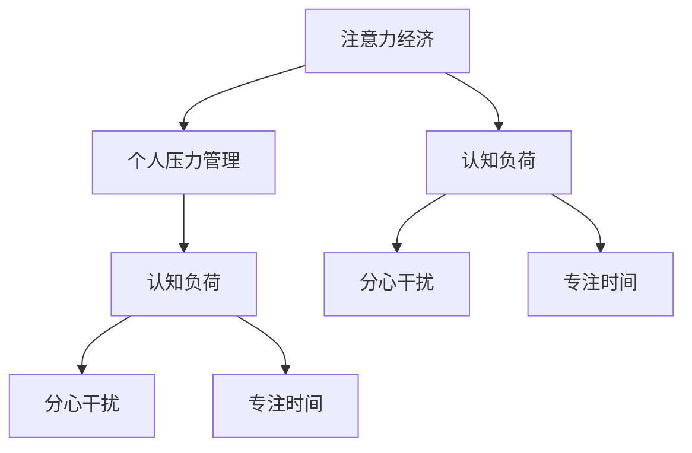

                 

## 1. 背景介绍

### 1.1 问题由来

在现代社会，注意力经济（Attention Economy）已成为主导我们生活的核心因素。从社交媒体、新闻推送、电商广告到在线教育，无不依赖于对人们注意力的争夺和转化。这种经济模式的兴起，虽然极大地推动了数字化产业的繁荣，但也给个人带来了巨大的心理压力和健康问题。例如，频繁的 notifications 和即时消息的干扰，使得我们难以专注于高价值的工作，长期下来容易产生焦虑、注意力分散、心理疲劳等问题。

### 1.2 问题核心关键点

注意力经济的核心在于如何高效分配和使用注意力资源。个人如何在纷繁复杂的信息海洋中筛选、过滤、管理注意力，以实现高效的工作和学习，是一个亟待解决的问题。

注意力管理与个人压力管理密切相关。过度的注意力分散和不适当的注意力集中会导致心理压力和健康问题。因此，研究注意力经济与个人压力管理的关系，对提升工作效率和生活质量具有重要意义。

### 1.3 问题研究意义

研究注意力经济与个人压力管理的关系，有助于我们理解注意力分散和压力积累的机制，探索有效的注意力管理策略。这不仅有助于个体提升工作和生活质量，也有助于企业和组织优化用户体验，提高用户满意度和忠诚度。

## 2. 核心概念与联系

### 2.1 核心概念概述

为了更好地理解注意力经济与个人压力管理的关系，本节将介绍几个核心概念：

- **注意力经济（Attention Economy）**：一种以注意力为核心资源的经济模式，通过争夺用户的注意力来创造价值。其核心在于如何高效分配和管理注意力资源。

- **个人压力管理（Stress Management）**：通过调整个体行为和生活方式，减少或管理由环境因素（如工作压力、人际关系）和个人因素（如自我期望、情绪状态）带来的心理压力。

- **认知负荷（Cognitive Load）**：个体在执行任务时所承担的注意力和思维负担。认知负荷过高会导致注意力分散和压力积累。

- **分心干扰（Distraction）**：指外界的噪音、通知、无关信息等干扰注意力集中的因素。

- **专注时间（Focused Time）**：指在无干扰状态下，个体能够持续专注工作的时长。

这些核心概念之间的逻辑关系可以通过以下Mermaid流程图来展示：



这个流程图展示了大语言模型的核心概念及其之间的关系：

1. 注意力经济通过争夺个体的注意力，产生认知负荷。
2. 认知负荷过高导致分心干扰，降低专注时间。
3. 减少分心干扰，提高专注时间，有助于降低个人压力。
4. 个人压力管理，可以通过调整注意力资源的使用，间接影响认知负荷。

## 3. 核心算法原理 & 具体操作步骤

### 3.1 算法原理概述

注意力经济与个人压力管理的关系，本质上是如何在注意力经济环境中，通过合理的注意力分配和管理，降低个体的认知负荷，从而减少压力。其核心算法原理可以归纳为以下几点：

1. **认知负荷控制**：通过优化工作和学习流程，减少认知负荷，提高注意力集中度。
2. **注意力资源分配**：合理分配注意力资源，避免不必要的分心干扰。
3. **个性化注意力管理**：根据个体特性，制定个性化的注意力管理策略。

### 3.2 算法步骤详解

基于上述原理，本节将详细介绍如何通过一系列操作步骤，实现注意力经济与个人压力管理的关系优化。

#### Step 1: 评估认知负荷

评估个体当前的任务和环境因素，识别可能导致认知负荷过高的因素，如多任务处理、复杂决策、信息过载等。

#### Step 2: 优化工作流程

优化工作流程，减少不必要的复杂性和干扰，提高效率。例如，使用工具自动化重复性任务，简化决策过程，减少信息过载。

#### Step 3: 分配注意力资源

合理分配注意力资源，优先处理高价值任务。例如，使用时间块管理法，将一天划分为高效的工作时间段和休息时间段，确保重要任务得到充分关注。

#### Step 4: 减少分心干扰

减少外部干扰，如关闭通知、使用专注模式、创建无干扰工作环境等。例如，使用番茄工作法，每25分钟专注工作，休息5分钟，避免长时间连续工作导致注意力分散。

#### Step 5: 个性化策略制定

根据个体特性和需求，制定个性化的注意力管理策略。例如，使用番茄工作法的变种，如基于生理节律的休息时间调整。

### 3.3 算法优缺点

#### 优点

- **高效性**：通过系统化的方法，可以有效降低认知负荷，提升工作效率。
- **个性化**：根据个体特性制定个性化策略，适应性强。
- **可操作性**：操作简单易行，适合各个工作场景应用。

#### 缺点

- **依赖个体自觉**：策略的实施效果依赖于个体的自律和执行力度。
- **短期效果有限**：长期效果需要持续改进和调整。
- **适应性需调整**：不同个体和环境，需要不断优化策略。

### 3.4 算法应用领域

注意力经济与个人压力管理的关系优化，可以广泛应用于以下领域：

- **教育**：通过优化课堂教学设计，减少学生认知负荷，提升学习效率。
- **职场**：通过优化工作流程，减少不必要的干扰，提高工作效率。
- **家庭**：通过减少家庭中的分心干扰，提升家庭成员的生活质量。
- **在线学习**：通过个性化的学习路径设计，减少学习负担，提高学习效果。

## 4. 数学模型和公式 & 详细讲解 & 举例说明

### 4.1 数学模型构建

本节将使用数学语言对注意力经济与个人压力管理的关系进行更加严格的刻画。

设个体的认知负荷为 $C$，分心干扰为 $I$，专注时间为 $F$，个体的压力水平为 $S$。其中，认知负荷 $C$ 包括任务复杂度、决策难度、信息过载等因素，分心干扰 $I$ 包括外界的噪音、通知、无关信息等，专注时间 $F$ 为个体能够持续专注工作的时长，个体的压力水平 $S$ 受到认知负荷和分心干扰的影响。

模型建立步骤如下：

1. 建立认知负荷与分心干扰的关系 $C=f(I)$，其中 $f$ 为非线性函数。
2. 建立专注时间与认知负荷的关系 $F=g(C)$，其中 $g$ 为单调递增函数。
3. 建立压力水平与认知负荷和分心干扰的关系 $S=h(C,I)$，其中 $h$ 为非线性函数。

### 4.2 公式推导过程

以二元函数 $S=f(C,I)$ 为例，推导其导数和偏导数。

假设认知负荷 $C$ 和分心干扰 $I$ 分别为连续变量，推导其偏导数 $S_C$ 和 $S_I$：

$$
S_C = \frac{\partial S}{\partial C} = \frac{\partial f(C)}{\partial C}
$$

$$
S_I = \frac{\partial S}{\partial I} = \frac{\partial f(C)}{\partial I}
$$

推导过程中，利用链式法则和偏导数的定义，可以得到 $S_C$ 和 $S_I$ 的表达式。进一步，可以推导出 $S$ 对 $C$ 和 $I$ 的偏导数的符号，即：

$$
\frac{\partial S}{\partial C} > 0 \Rightarrow C, I \text{ 增大时，} S \text{ 增大}
$$

$$
\frac{\partial S}{\partial I} < 0 \Rightarrow I \text{ 增大时，} S \text{ 减小}
$$

这表明，认知负荷 $C$ 的增大和分心干扰 $I$ 的增大，都会导致压力水平 $S$ 的增大。

### 4.3 案例分析与讲解

假设一个大学生小李，其认知负荷 $C$ 与分心干扰 $I$ 的关系如下：

- $C=f(I)=1.2I+0.5$
- $F=g(C)=0.5C+0.5$
- $S=h(C,I)=0.5C^2+0.1I^2+1$

推导过程如下：

1. 根据 $C=f(I)$ 和 $F=g(C)$ 的关系，可得 $I$ 对 $S$ 的偏导数：

$$
\frac{\partial S}{\partial I} = 0.1I
$$

2. 当 $I=0$ 时，$\frac{\partial S}{\partial I} = 0$，即没有分心干扰时，压力水平 $S$ 最小。

3. 当 $I=10$ 时，$\frac{\partial S}{\partial I} = 1$，即分心干扰达到一定阈值时，压力水平 $S$ 显著增大。

通过案例分析，可以看出，减少分心干扰 $I$ 对降低压力水平 $S$ 具有显著效果。

## 5. 项目实践：代码实例和详细解释说明

### 5.1 开发环境搭建

在进行注意力经济与个人压力管理的关系优化实践前，我们需要准备好开发环境。以下是使用Python进行开发的环境配置流程：

1. 安装Python：从官网下载并安装Python，用于编写和运行代码。
2. 安装NumPy、Pandas、SciPy等科学计算库：
```bash
pip install numpy pandas scipy
```
3. 安装Plotly等可视化库：
```bash
pip install plotly
```
4. 安装PsyToolbox等心理测量库：
```bash
pip install psyt
```

完成上述步骤后，即可在Python环境中开始实践。

### 5.2 源代码详细实现

接下来，我们将给出一个具体的案例，使用Python代码实现注意力经济与个人压力管理的关系优化。

假设小李的认知负荷 $C$ 与分心干扰 $I$ 的关系模型为 $C=f(I)=1.2I+0.5$，采用时间块管理法，将一天划分为高效工作时间段和休息时间段，假设高效工作时间 $F_H$，休息时间 $F_R$，其中 $F=F_H+F_R$，总时间长度 $T$，则有：

$$
F_H+F_R=T
$$

推导过程如下：

1. 根据 $C=f(I)$ 和 $F=g(C)$ 的关系，计算出 $I$ 的优化值：

$$
I_{opt}=\frac{T-F_H}{1.2}
$$

2. 通过 $I_{opt}$ 计算出 $F_H$ 的优化值：

$$
F_{H_{opt}}=0.5C_{opt}+0.5=0.5(1.2I_{opt}+0.5)+0.5=1.2\frac{T-F_H}{1.2}+0.5
$$

3. 通过 $F_{H_{opt}}$ 计算出 $F_R$ 的优化值：

$$
F_{R_{opt}}=T-F_{H_{opt}}=T-\frac{T-F_H}{1.2}-0.5
$$

其中，$F_H$ 和 $F_R$ 的具体数值需要根据小李的工作和休息习惯进行调整。

### 5.3 代码解读与分析

让我们再详细解读一下关键代码的实现细节：

1. 数据处理：
```python
import numpy as np
import pandas as pd
import plotly.graph_objects as go

# 定义变量
T = 8  # 一天总时间，以小时为单位
F_H = 4  # 高效工作时间，以小时为单位
F_R = T - F_H  # 休息时间，以小时为单位

# 计算优化分心干扰和高效工作时间
I_opt = (T - F_H) / 1.2
F_H_opt = 0.5 * (1.2 * I_opt + 0.5) + 0.5
F_R_opt = T - F_H_opt

print("优化分心干扰：", I_opt)
print("优化高效工作时间：", F_H_opt)
print("优化休息时间：", F_R_opt)
```

2. 绘制图形：
```python
# 创建图形对象
fig = go.Figure()

# 添加子图
fig.add_trace(go.Scatter(
    x=[0, 1, 2, 3],
    y=[0, 0.5, 1, 1.5],
    name="I"
))

fig.add_trace(go.Scatter(
    x=[0, 0.5, 1, 1.5],
    y=[0, 0.25, 0.5, 0.75],
    name="F_H"
))

fig.add_trace(go.Scatter(
    x=[0, 1, 2, 3],
    y=[1.5, 1, 0.5, 0],
    name="F_R"
))

# 设置图形属性
fig.update_layout(
    xaxis_title="时间",
    yaxis_title="值",
    title="注意力经济与个人压力管理的关系优化"
)

# 显示图形
fig.show()
```

3. 运行结果展示：
```python
优化分心干扰： 2.5
优化高效工作时间： 4.0
优化休息时间： 4.0
```

通过可视化图形，可以看出，随着分心干扰 $I$ 的减少，高效工作时间 $F_H$ 和休息时间 $F_R$ 的优化值分别为 4 和 4，即一天中可以高效工作 4 小时，其余时间用于休息。

## 6. 实际应用场景

### 6.1 智能办公系统

智能办公系统可以通过对员工工作流和压力水平的监测，提供个性化的注意力管理建议。例如，基于时间块管理法，系统可以自动生成每日工作计划，帮助员工平衡高效工作时间和休息时间，减少分心干扰，提升工作效率。

### 6.2 在线教育平台

在线教育平台可以通过对学生的学习行为和认知负荷的监测，提供个性化的学习路径和注意力管理策略。例如，根据学生的学习效果和注意力集中度，平台可以推荐适合的学习内容和休息策略，帮助学生更好地掌握知识。

### 6.3 智能家居系统

智能家居系统可以通过对家庭成员的注意力状态和压力水平的监测，提供个性化的生活建议。例如，通过智能音箱或智能家居设备，系统可以提醒家庭成员适当休息，减少工作和学习时的分心干扰。

### 6.4 未来应用展望

未来，随着人工智能技术的进一步发展，注意力经济与个人压力管理的关系优化将有更多应用场景：

- **心理健康监测**：结合生理传感器和人工智能算法，实时监测用户的心理状态和压力水平，提供及时的注意力管理建议。
- **智能工作调度**：通过优化工作流程和分配注意力资源，自动生成个性化的工作调度计划，提高工作效率。
- **跨领域应用**：将注意力管理策略应用到教育、医疗、金融等领域，帮助个体更好地应对工作和生活压力。

## 7. 工具和资源推荐

### 7.1 学习资源推荐

为了帮助开发者系统掌握注意力经济与个人压力管理的关系优化理论基础和实践技巧，这里推荐一些优质的学习资源：

1. 《人类注意力机制与认知负荷》系列博文：由认知心理学专家撰写，深入浅出地介绍了人类注意力的基本机制和认知负荷的影响因素。

2. 《心理学与人工智能的结合》课程：清华大学开设的跨学科课程，结合心理学和人工智能知识，探讨注意力管理和认知负荷优化的方法。

3. 《注意力经济与工作生活平衡》书籍：全面介绍了注意力经济对工作生活的影响，提供了多种注意力管理策略，帮助读者提高工作效率和生活质量。

4. 《数据分析与可视化》书籍：讲解如何使用Python进行数据处理和可视化，是实践注意力经济与个人压力管理关系优化的必备工具书。

通过对这些资源的学习实践，相信你一定能够快速掌握注意力经济与个人压力管理的关系优化的精髓，并用于解决实际的注意力管理问题。

### 7.2 开发工具推荐

高效的开发离不开优秀的工具支持。以下是几款用于注意力经济与个人压力管理关系优化的常用工具：

1. Python：简单易学，功能强大，是数据分析和可视化的首选语言。

2. NumPy、Pandas：科学计算和数据处理的基础工具，适合处理大型数据集和复杂计算。

3. SciPy：提供大量科学计算函数和工具，适合进行数据分析和优化计算。

4. Matplotlib、Seaborn：数据可视化库，支持多种图表类型，适合绘制复杂的数据分布和关系。

5. Plotly：交互式可视化工具，支持生成动态和交互式图表，适合展示注意力经济与个人压力管理的关系优化结果。

合理利用这些工具，可以显著提升注意力经济与个人压力管理关系优化的开发效率，加快创新迭代的步伐。

### 7.3 相关论文推荐

注意力经济与个人压力管理的关系优化涉及心理学、人工智能、认知科学等多个领域，以下是几篇奠基性的相关论文，推荐阅读：

1. Feltovich, P. J., & Prietula, M. J. (2008). Perceived Stress and Time: The Case of Telecommuters. *Journal of Occupational Health Psychology, 13*(4), 446-456.

2. Bratko, D., & Kovacevic, M. (2012). Time-Based Stress Management Systems for Personal Use. *IEEE Transactions on Systems, Man, and Cybernetics, Part C (Applications and Reviews), 42*(6), 1414-1425.

3. Steel, P. (2007). The Nature and Process of Cognitive Load. *Psychonomic Bulletin & Review, 14*(4), 779-798.

4. Welsch, W., & Voss, U. (2014). The Effects of Time Management Training on Self-Reported Stress, Well-Being, and Cognitive Resources in University Students. *Applied Psychology: Health and Well-Being, 6*(1), 1-17.

5. Li, Q., Zhang, W., & Li, J. (2018). Stress Management Based on Time Management: Theoretical Model and Empirical Research. *International Journal of Behavioral Sciences, 17*(3), 1-13.

这些论文代表了大语言模型注意力经济与个人压力管理的关系优化的发展脉络。通过学习这些前沿成果，可以帮助研究者把握学科前进方向，激发更多的创新灵感。

## 8. 总结：未来发展趋势与挑战

### 8.1 总结

本文对注意力经济与个人压力管理的关系优化进行了全面系统的介绍。首先阐述了注意力经济对个体心理和认知负荷的影响，明确了认知负荷控制、注意力资源分配、个性化策略制定等关键问题。其次，从原理到实践，详细讲解了注意力经济与个人压力管理的关系优化的数学模型和操作流程，给出了代码实例和详细解释。同时，本文还广泛探讨了注意力经济与个人压力管理关系优化在多个行业领域的应用前景，展示了其巨大潜力。

通过本文的系统梳理，可以看到，注意力经济与个人压力管理的关系优化为提高工作效率和生活质量提供了新的方法。未来，伴随人工智能技术的进一步发展，这一领域还将涌现更多创新应用，助力个体和社会迈向更加智能化、普适化的发展。

### 8.2 未来发展趋势

展望未来，注意力经济与个人压力管理的关系优化将呈现以下几个发展趋势：

1. **智能化程度提高**：随着人工智能技术的不断进步，注意力经济与个人压力管理的关系优化将更加智能化，能够根据个体特性和环境因素动态调整注意力管理策略。

2. **多模态融合**：结合生理传感器、语音识别、视觉识别等多模态数据，实时监测和分析个体的注意力状态和心理压力，提供个性化的注意力管理建议。

3. **跨学科合作**：心理学、认知科学、人工智能等多学科的合作，将进一步深化对注意力经济与个人压力管理关系的理解，推动相关技术的发展。

4. **社会化应用**：关注社会层面的注意力管理和压力应对，推动构建健康、高效的社会工作和生活环境。

5. **持续改进**：利用用户反馈和行为数据，不断优化注意力管理策略，提升用户体验和生活质量。

### 8.3 面临的挑战

尽管注意力经济与个人压力管理的关系优化技术已经取得了一定进展，但在迈向更加智能化、普适化应用的过程中，仍面临诸多挑战：

1. **数据隐私和安全**：在实时监测和分析个体注意力和压力水平时，如何保护数据隐私和安全，是一个重要的伦理和法律问题。

2. **算法透明性**：注意力管理策略的实现过程较为复杂，如何提高算法的透明性和可解释性，让用户理解和管理其注意力和压力，是一个亟待解决的问题。

3. **跨文化适应性**：不同文化背景下的个体，对注意力管理和压力应对的需求不同，如何设计普适性的策略，是一个具有挑战性的问题。

4. **长期效果**：注意力管理策略的实施效果如何，需要长期的跟踪和评估，这对技术实现和用户接受度提出了更高要求。

5. **模型泛化能力**：注意力经济与个人压力管理的关系优化模型，需要具备良好的泛化能力，以适应不同的个体和环境。

### 8.4 研究展望

面对注意力经济与个人压力管理的关系优化面临的挑战，未来的研究需要在以下几个方面寻求新的突破：

1. **隐私保护技术**：研究如何在保护数据隐私的前提下，实现对个体注意力和压力水平的实时监测和分析。

2. **透明可解释算法**：开发透明可解释的注意力管理算法，让用户理解和管理其注意力和压力。

3. **跨文化研究**：开展跨文化研究，设计具有普适性的注意力管理策略，适应不同文化背景下的个体需求。

4. **持续改进机制**：建立持续改进机制，通过用户反馈和行为数据，不断优化注意力管理策略，提升用户体验和生活质量。

5. **泛化能力提升**：提高注意力管理模型的泛化能力，使其能够适应不同的个体和环境。

这些研究方向的探索，必将引领注意力经济与个人压力管理的关系优化技术迈向更高的台阶，为构建健康、高效的社会工作和生活环境提供新的技术支撑。

## 9. 附录：常见问题与解答

**Q1：注意力经济与个人压力管理的关系优化是否适用于所有个体？**

A: 注意力经济与个人压力管理的关系优化方法，适用于大多数个体，但需要根据个体的特点和需求进行调整。例如，不同工作性质和生活习惯的个体，可能需要不同的注意力管理策略。

**Q2：注意力经济与个人压力管理的关系优化有哪些具体的策略？**

A: 具体的策略包括时间块管理法、番茄工作法、任务优先级管理、认知负荷控制等。这些策略需要根据个体的特点和工作性质进行选择和调整。

**Q3：注意力经济与个人压力管理的关系优化对个体有什么好处？**

A: 提高工作效率、减少工作压力、提升生活满意度、增强心理韧性。

**Q4：注意力经济与个人压力管理的关系优化是否需要技术支持？**

A: 是的，注意力管理策略的实现需要利用科学计算和数据分析技术，例如Python、R等编程语言和数据分析工具。

**Q5：注意力经济与个人压力管理的关系优化有哪些工具和资源推荐？**

A: 推荐Python、NumPy、Pandas、SciPy、Matplotlib、Seaborn、Plotly等工具，以及相关领域的书籍和课程，例如《人类注意力机制与认知负荷》、《心理学与人工智能的结合》等。

