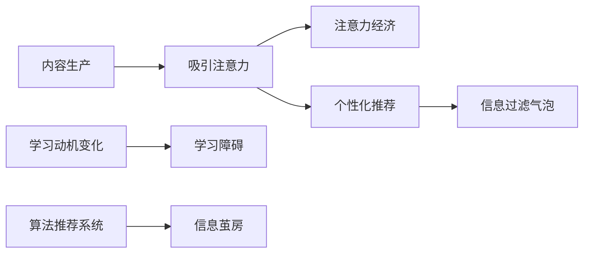

                 

# 注意力经济与个人学习动机的变化

## 1. 背景介绍

在数字化信息时代，注意力成为了一种稀缺资源。内容生产者为了吸引用户的注意力，不断提升内容的吸引力，逐渐形成了以用户注意力为中心的“注意力经济”。这种经济形态对个人学习动机产生了深远的影响，重塑了信息获取与处理的方式。

### 1.1 数字时代信息泛滥

数字时代的到来，使信息生成和传播的方式发生了根本变化。借助互联网技术，信息的生成和传播变得更加高效和广泛。网页、博客、视频、音频、图片等形式的内容，几乎无处不在，用户可以随时随地获取和分享信息。这种信息泛滥的局面，使用户在获取知识时面临更大的挑战。

### 1.2 注意力成为稀缺资源

尽管信息总量不断增加，但用户的注意力资源是有限的。在面对海量信息时，如何吸引和保持用户的注意力，成为了内容生产者需要解决的首要问题。逐渐地，注意力开始被视为一种稀缺资源，而内容生产者的目标也从简单的信息传播，转变为“注意力争夺”。

## 2. 核心概念与联系

### 2.1 核心概念概述

1. **注意力经济**：指在数字化信息时代，信息生产者为了吸引用户注意力而进行的竞争。内容生产者通过创造有趣、有用的内容，吸引用户关注，从而实现商业价值的变现。

2. **个人学习动机**：指个体在获取知识、提升技能、满足好奇心等方面的内在驱动。学习动机在数字时代面临新的挑战，需要与注意力经济环境相适应，才能更好地实现个人成长。

3. **信息过滤气泡**：指在互联网时代，用户往往只接触到与其兴趣和已有观点一致的信息，导致信息视野狭窄。这种现象导致用户难以获取多样化的知识，限制了其学习动机和能力。

4. **算法推荐系统**：指利用机器学习算法对用户行为进行分析，预测其兴趣，从而向用户推荐相关内容的技术。算法推荐系统对用户学习动机的影响，在于它能够在短时间内集中用户的注意力，但也可能导致信息茧房。

### 2.2 核心概念原理和架构的 Mermaid 流程图



这个流程图展示了核心概念之间的逻辑关系：

1. 内容生产者通过吸引用户注意力，形成了注意力经济。
2. 个性化推荐系统进一步强化了注意力争夺。
3. 信息过滤气泡和算法推荐系统限制了用户的信息视野。
4. 学习动机在信息过载和注意力争夺的环境中发生变化，面临新的挑战。

## 3. 核心算法原理 & 具体操作步骤

### 3.1 算法原理概述

注意力经济和个性化推荐系统的核心算法，通常基于协同过滤、内容过滤和深度学习等技术。其中，深度学习算法如协同嵌入（Collaborative Filtering）、矩阵分解（Matrix Factorization）和神经网络等，已经成为推荐系统的主流算法。

在信息过滤气泡和注意力争夺的背景下，个人学习动机发生变化。用户更加倾向于选择与已有观点一致的信息，导致信息视野狭窄，学习动机和能力受到限制。同时，内容生产者为了争夺用户注意力，设计更加吸引眼球的标题、图片和视频等，这些内容虽然能够迅速吸引用户，但往往缺乏深度和质量。

### 3.2 算法步骤详解

1. **数据采集与处理**：收集用户的浏览记录、搜索历史、评分等数据，提取用户特征和内容特征。

2. **模型训练**：使用协同嵌入、矩阵分解等方法，训练推荐模型，预测用户对特定内容的兴趣。

3. **内容推荐**：根据模型预测，向用户推荐相关内容。个性化推荐系统通常会不断优化模型，提高推荐准确性和用户体验。

4. **用户反馈收集**：收集用户对推荐内容的反馈，如点击率、停留时间等，用于优化推荐模型。

5. **学习动机分析**：通过分析用户行为数据，了解用户的学习动机和兴趣变化，为其提供更加个性化的学习资源。

### 3.3 算法优缺点

#### 优点：

1. **提高信息获取效率**：个性化推荐系统通过智能筛选，将相关内容推荐给用户，提高了用户获取信息的效率。

2. **满足用户兴趣需求**：推荐系统能够快速定位用户感兴趣的内容，提高用户的满意度和留存率。

3. **促进内容多样性**：推荐算法不仅考虑用户的已有兴趣，还推荐新内容，拓宽了用户的知识视野。

#### 缺点：

1. **信息过滤气泡**：个性化推荐可能导致用户只接触到与已有观点一致的信息，导致信息视野狭窄，限制了学习动机和能力。

2. **注意力分散**：推荐系统使用户面对大量信息，导致注意力分散，难以深入学习。

3. **算法偏见**：推荐算法可能存在偏见，导致推荐内容的不公平和错误，影响用户体验。

### 3.4 算法应用领域

个性化推荐算法广泛应用于电子商务、新闻媒体、社交网络、视频平台等多个领域。例如：

1. **电子商务**：淘宝、京东等电商平台通过个性化推荐，提升用户购买转化率。

2. **新闻媒体**：今日头条等新闻应用通过推荐算法，为用户提供个性化新闻内容。

3. **社交网络**：微博、微信等社交平台，通过推荐算法，增加用户粘性。

4. **视频平台**：Netflix、YouTube等视频平台，通过推荐系统，提供个性化的视频内容推荐。

## 4. 数学模型和公式 & 详细讲解

### 4.1 数学模型构建

推荐系统常用的数学模型包括协同嵌入模型和神经网络模型。协同嵌入模型基于用户-项目评分矩阵，通过矩阵分解等方法，预测用户对项目的评分。神经网络模型则通过多层神经网络，学习用户和项目之间的复杂关系。

#### 协同嵌入模型

协同嵌入模型使用矩阵分解方法，将用户和项目评分矩阵分解为两个低维向量矩阵，通过预测用户对项目的评分来推荐相关项目。

设用户集合为 $U$，项目集合为 $V$，用户-项目评分矩阵为 $R$，其中 $R_{ui}$ 表示用户 $u$ 对项目 $i$ 的评分。协同嵌入模型将 $R$ 分解为两个低维向量矩阵 $P$ 和 $Q$，其中 $P \in \mathbb{R}^{m \times n}$，$Q \in \mathbb{R}^{n \times m}$，$m$ 和 $n$ 分别为用户和项目的特征维度。

$$
P = \hat{R}Q^T
$$

$$
R \approx P \hat{R}Q^T
$$

通过预测用户对项目的评分，可以推荐相关项目。推荐算法通常使用 $R$ 中评分最高的 $K$ 个项目，作为用户的推荐列表。

#### 神经网络模型

神经网络模型通常使用多层感知机（MLP）、卷积神经网络（CNN）等模型。其中，MLP 模型使用全连接神经网络，学习用户和项目的特征表示。神经网络模型通过训练神经网络，学习用户和项目之间的复杂关系，从而进行推荐。

设用户和项目的特征向量分别为 $u$ 和 $v$，用户对项目 $i$ 的评分 $r$ 可以表示为：

$$
r = \sigma(W^{(1)}u + b^{(1)})\sigma(W^{(2)}v + b^{(2)})
$$

其中 $\sigma$ 为激活函数，$W^{(1)}$ 和 $W^{(2)}$ 分别为神经网络的第一层和第二层的权重矩阵，$b^{(1)}$ 和 $b^{(2)}$ 分别为偏置项。

### 4.2 公式推导过程

协同嵌入模型和神经网络模型的推导过程相对复杂，涉及矩阵分解、梯度下降等技术，在此不再详细展开。推荐系统通过优化这些模型，最大化预测准确率，从而提高推荐效果。

### 4.3 案例分析与讲解

#### 案例一：协同嵌入模型

假设有一用户集合 $U$，项目集合 $V$，用户-项目评分矩阵 $R$。使用协同嵌入模型进行推荐时，首先对 $R$ 进行矩阵分解：

$$
R = P \hat{R}Q^T
$$

其中 $P \in \mathbb{R}^{m \times n}$，$Q \in \mathbb{R}^{n \times m}$，$m$ 和 $n$ 分别为用户和项目的特征维度。

假设用户 $u$ 对项目 $i$ 的评分 $R_{ui}$，则协同嵌入模型的预测评分 $\hat{r}_{ui}$ 为：

$$
\hat{r}_{ui} = P_{ui} \hat{R}_{i:}Q^T_{:u}
$$

其中 $P_{ui}$ 为 $P$ 矩阵中用户 $u$ 对应的行向量，$Q^T_{:u}$ 为 $Q$ 矩阵中用户 $u$ 对应的列向量，$\hat{R}_{i:}$ 为 $R$ 矩阵中项目 $i$ 对应的列向量。

通过预测评分 $\hat{r}_{ui}$，可以推荐与用户 $u$ 对项目 $i$ 评分最高的 $K$ 个项目，作为用户的推荐列表。

#### 案例二：神经网络模型

假设使用三层感知机模型进行推荐，用户 $u$ 对项目 $i$ 的评分 $r$ 可以表示为：

$$
r = \sigma(W^{(1)}u + b^{(1)})\sigma(W^{(2)}v + b^{(2)})
$$

其中 $\sigma$ 为激活函数，$W^{(1)}$ 和 $W^{(2)}$ 分别为神经网络的第一层和第二层的权重矩阵，$b^{(1)}$ 和 $b^{(2)}$ 分别为偏置项。

### 4.4 案例分析与讲解

假设使用三层感知机模型进行推荐，用户 $u$ 对项目 $i$ 的评分 $r$ 可以表示为：

$$
r = \sigma(W^{(1)}u + b^{(1)})\sigma(W^{(2)}v + b^{(2)})
$$

其中 $\sigma$ 为激活函数，$W^{(1)}$ 和 $W^{(2)}$ 分别为神经网络的第一层和第二层的权重矩阵，$b^{(1)}$ 和 $b^{(2)}$ 分别为偏置项。

通过训练神经网络，可以预测用户对项目的评分，从而进行推荐。

## 5. 项目实践：代码实例和详细解释说明

### 5.1 开发环境搭建

在实践推荐系统时，我们需要准备开发环境。以下是使用Python进行TensorFlow开发的环境配置流程：

1. 安装Anaconda：从官网下载并安装Anaconda，用于创建独立的Python环境。

2. 创建并激活虚拟环境：
```bash
conda create -n tf-env python=3.8 
conda activate tf-env
```

3. 安装TensorFlow：根据CUDA版本，从官网获取对应的安装命令。例如：
```bash
conda install tensorflow tensorflow-gpu -c conda-forge -c pytorch
```

4. 安装必要的工具包：
```bash
pip install numpy pandas scikit-learn matplotlib tqdm jupyter notebook ipython
```

完成上述步骤后，即可在`tf-env`环境中开始推荐系统的开发。

### 5.2 源代码详细实现

下面我们以协同嵌入模型为例，给出使用TensorFlow实现推荐系统的PyTorch代码实现。

```python
import tensorflow as tf
from tensorflow.keras.layers import Input, Embedding, Dot
from tensorflow.keras.models import Model

# 定义输入层
user_input = Input(shape=(num_users,))
item_input = Input(shape=(num_items,))

# 定义用户和项目的嵌入层
user_embedding = Embedding(num_users, embedding_dim)(user_input)
item_embedding = Embedding(num_items, embedding_dim)(item_input)

# 定义评分预测层
dot_product = Dot(axes=[2, 1])([user_embedding, item_embedding])
predictions = tf.keras.layers.Dense(1, activation='sigmoid')(dot_product)

# 定义模型
model = Model(inputs=[user_input, item_input], outputs=predictions)

# 编译模型
model.compile(optimizer='adam', loss='binary_crossentropy', metrics=['accuracy'])

# 训练模型
model.fit(x_train, y_train, epochs=num_epochs, batch_size=batch_size, validation_data=(x_val, y_val))
```

### 5.3 代码解读与分析

让我们再详细解读一下关键代码的实现细节：

**Input层**：定义了用户和项目的输入层，分别对应用户ID和项目ID。

**Embedding层**：定义了用户和项目的嵌入层，将ID序列转换为稠密向量，从而进行评分预测。

**Dot层**：计算用户和项目嵌入的点积，生成评分预测。

**Dense层**：定义了评分预测层的全连接层，使用sigmoid激活函数进行评分预测。

**Model层**：定义了整个推荐模型的结构，包括输入层、嵌入层、评分预测层等。

**compile方法**：编译模型，选择优化器和损失函数，并指定评估指标。

**fit方法**：训练模型，使用训练集进行模型训练，并在验证集上进行模型评估。

## 6. 实际应用场景

### 6.1 电子商务

个性化推荐在电子商务中的应用非常广泛。亚马逊、京东等电商平台通过推荐算法，为用户推荐商品，提高用户的购物体验和转化率。推荐算法能够根据用户的浏览历史和购买记录，推荐相关的商品，帮助用户快速找到所需商品。

### 6.2 新闻媒体

新闻媒体如今日头条、腾讯新闻等，通过推荐算法为用户推荐新闻，提高用户的阅读体验和平台黏性。推荐算法能够根据用户的阅读习惯和兴趣，推荐相关的新闻内容，帮助用户获取更有价值的信息。

### 6.3 社交网络

社交网络如微博、微信等，通过推荐算法为用户推荐内容，增加用户粘性。推荐算法能够根据用户的社交行为和兴趣，推荐相关的内容，帮助用户获取更多有趣的信息。

### 6.4 视频平台

视频平台如Netflix、YouTube等，通过推荐算法为用户推荐视频内容，提高用户的观看体验和平台黏性。推荐算法能够根据用户的观看历史和评分，推荐相关的视频内容，帮助用户发现更多喜欢的视频。

## 7. 工具和资源推荐

### 7.1 学习资源推荐

为了帮助开发者系统掌握推荐系统的理论基础和实践技巧，这里推荐一些优质的学习资源：

1. 《推荐系统实战》系列博文：由大模型技术专家撰写，深入浅出地介绍了推荐系统的基本原理和实际应用。

2. Coursera《Recommender Systems》课程：斯坦福大学开设的推荐系统课程，有Lecture视频和配套作业，带你入门推荐系统领域的基本概念和经典模型。

3. 《推荐系统：构建用户个性化推荐引擎》书籍：推荐系统领域的经典教材，全面介绍了推荐系统的发展历程、模型算法和工程实践。

4. Arxiv预印本库：收录了大量关于推荐系统的最新研究成果，可供学习和参考。

5. 推荐系统开源项目：开源社区提供的推荐系统代码和案例，可快速上手实践。

通过对这些资源的学习实践，相信你一定能够快速掌握推荐系统的精髓，并用于解决实际的推荐问题。

### 7.2 开发工具推荐

高效的开发离不开优秀的工具支持。以下是几款用于推荐系统开发的常用工具：

1. TensorFlow：由Google主导开发的深度学习框架，生产部署方便，适合大规模工程应用。推荐系统的主流算法都有TensorFlow的版本实现。

2. PyTorch：基于Python的开源深度学习框架，灵活动态的计算图，适合快速迭代研究。推荐系统的一些经典算法也有PyTorch的实现。

3. Keras：基于TensorFlow和Theano等深度学习框架的高层API，提供简单易用的接口，适合快速原型开发。

4. Scikit-learn：Python数据科学库，提供各种常用的机器学习算法，包括协同过滤、矩阵分解等推荐算法。

5. Weights & Biases：模型训练的实验跟踪工具，可以记录和可视化模型训练过程中的各项指标，方便对比和调优。与主流深度学习框架无缝集成。

6. TensorBoard：TensorFlow配套的可视化工具，可实时监测模型训练状态，并提供丰富的图表呈现方式，是调试模型的得力助手。

合理利用这些工具，可以显著提升推荐系统的开发效率，加快创新迭代的步伐。

### 7.3 相关论文推荐

推荐系统的发展源于学界的持续研究。以下是几篇奠基性的相关论文，推荐阅读：

1. BPR：Bayesian Personalized Ranking from Pairwise Data，提出了协同嵌入模型的基本思想。

2. Matrix Factorization Techniques for Recommender Systems，介绍了矩阵分解算法的原理和应用。

3. Deep Collaborative Filtering，研究了深度神经网络在推荐系统中的应用。

4. AutoRec：Deep Learning for Recommender Systems，提出了一种基于自动编码器的推荐算法。

5. Neural Network Recommendation with Adaptive Sampling，研究了深度神经网络在推荐系统中的采样策略。

这些论文代表了大模型微调技术的发展脉络。通过学习这些前沿成果，可以帮助研究者把握学科前进方向，激发更多的创新灵感。

## 8. 总结：未来发展趋势与挑战

### 8.1 总结

本文对基于协同嵌入和神经网络等技术的推荐系统进行了全面系统的介绍。首先阐述了推荐系统在数字时代的重要性，强调了用户注意力和信息过滤气泡的影响。其次，从原理到实践，详细讲解了协同嵌入和神经网络等核心算法的原理和操作步骤，给出了推荐系统的完整代码实现。同时，本文还广泛探讨了推荐系统在电子商务、新闻媒体、社交网络等多个行业领域的应用前景，展示了推荐范式的巨大潜力。此外，本文精选了推荐系统的各类学习资源，力求为读者提供全方位的技术指引。

通过本文的系统梳理，可以看到，推荐系统正在成为互联网经济的重要组成部分，极大地提升了信息获取和利用的效率。推荐系统的发展，推动了个性化服务的普及，改变了用户的消费习惯和行为模式，对社会经济产生了深远影响。

### 8.2 未来发展趋势

展望未来，推荐系统技术将呈现以下几个发展趋势：

1. **推荐算法的智能化**：未来的推荐算法将更加智能化，能够根据用户的多样化需求和实时行为，动态调整推荐策略，实现更精准的个性化推荐。

2. **推荐系统的个性化**：推荐系统将更加个性化，根据用户的兴趣和行为变化，实时更新推荐内容，提升用户的满意度。

3. **推荐系统的社会化**：推荐系统将融入社会化因素，考虑用户之间的社会关系和互动行为，实现更全面、多维度的推荐。

4. **推荐系统的可解释性**：推荐系统将更加可解释，使用户能够理解推荐结果的生成逻辑，增强系统的信任度和透明度。

5. **推荐系统的安全性**：推荐系统将更加安全，保障用户数据的隐私和安全，防止数据滥用和恶意攻击。

### 8.3 面临的挑战

尽管推荐系统已经取得了显著成就，但在迈向更加智能化、个性化应用的过程中，它仍面临着诸多挑战：

1. **数据隐私和公平性**：推荐系统需要处理大量用户数据，如何保护用户隐私，避免数据滥用，是重要的挑战。同时，推荐算法可能存在偏见，导致推荐结果的不公平。

2. **计算资源消耗**：推荐系统通常需要计算大量的矩阵运算和神经网络前向传播，对计算资源的需求较高，如何提高算法效率和模型压缩，是亟需解决的问题。

3. **算法复杂度**：推荐算法的复杂度较高，如何简化算法模型，降低计算复杂度，是提高推荐系统实用性的关键。

4. **算法鲁棒性**：推荐算法在面对异常数据和噪声时，容易出现性能下降或崩溃，如何提高算法的鲁棒性，是保证系统稳定性的重要方向。

5. **实时性要求**：推荐系统需要实时响应用户行为，如何在保证推荐效果的同时，提高系统的实时性，是提高用户体验的关键。

### 8.4 研究展望

未来的研究需要在以下几个方面寻求新的突破：

1. **基于用户行为的数据分析**：进一步研究用户行为数据，挖掘更多的用户特征和行为模式，提高推荐系统的准确性和个性化水平。

2. **推荐算法的多样化**：研究更多种类的推荐算法，如基于图的推荐、多任务学习等，拓展推荐系统的应用范围。

3. **推荐系统的可解释性**：研究推荐系统的可解释性，提高系统的透明度和可信度，帮助用户理解推荐结果的生成逻辑。

4. **推荐系统的安全性**：研究推荐系统的安全性，保障用户数据的隐私和安全，防止数据滥用和恶意攻击。

5. **推荐系统的社会化因素**：研究推荐系统的社会化因素，考虑用户之间的社会关系和互动行为，实现更全面、多维度的推荐。

6. **推荐系统的跨领域应用**：研究推荐系统在跨领域场景中的应用，如跨媒体推荐、跨场景推荐等，拓展推荐系统的应用边界。

这些研究方向的探索，将进一步推动推荐系统技术的发展，为互联网经济和社会生活带来更多的智能化、个性化和创新性。

## 9. 附录：常见问题与解答

**Q1：推荐系统中的协同嵌入模型和神经网络模型有何区别？**

A: 协同嵌入模型基于用户-项目评分矩阵的矩阵分解，通过矩阵乘法计算用户对项目的评分。而神经网络模型则通过多层神经网络，学习用户和项目的特征表示，使用神经网络的前向传播和反向传播算法进行评分预测。协同嵌入模型通常用于评分稀疏且数据量较大的场景，而神经网络模型则适用于评分密集且数据量较小的场景。

**Q2：如何提高推荐系统的推荐效果？**

A: 提高推荐系统的推荐效果需要从多个方面进行优化：

1. 数据预处理：清洗数据、填充缺失值、标准化等，提高数据的准确性和一致性。

2. 特征工程：提取有意义的特征，提高特征的表达能力。

3. 模型选择：选择合适的推荐算法，根据数据特点和应用场景进行选择。

4. 超参数调优：通过网格搜索或贝叶斯优化等方法，调整模型的超参数，提高模型性能。

5. 实时学习：通过在线学习算法，实时更新模型，适应用户行为的变化。

6. 多模型融合：通过模型融合算法，结合多个模型的输出，提高推荐效果。

**Q3：推荐系统中的信息过滤气泡有何影响？**

A: 信息过滤气泡对推荐系统的影响主要体现在以下几个方面：

1. 信息视野狭窄：用户只接触到与已有观点一致的信息，导致信息视野狭窄，无法获取多样化的知识。

2. 学习动机受限：由于信息视野狭窄，用户难以发现新知识，导致学习动机受限，难以实现自我提升。

3. 决策偏颇：信息过滤气泡可能导致用户只接受与自己观点一致的信息，从而影响决策的客观性和合理性。

4. 推荐多样性下降：信息过滤气泡导致推荐系统提供的推荐内容趋同，无法满足用户的个性化需求。

因此，在推荐系统的设计中，需要考虑如何缓解信息过滤气泡的影响，增加推荐内容的多样性，提高用户的满意度和学习动机。

**Q4：推荐系统如何处理噪声数据？**

A: 推荐系统中的噪声数据可能会对推荐效果产生负面影响，因此需要进行有效的噪声处理。常用的方法包括：

1. 数据清洗：通过数据清洗技术，去除数据中的噪声和异常值。

2. 去重和去冗余：通过去重和去冗余技术，减少噪声数据对模型的干扰。

3. 特征选择：选择与噪声数据无关的特征，提高模型的鲁棒性。

4. 噪声注入：通过噪声注入技术，模拟真实场景中的噪声，提高模型的泛化能力。

5. 鲁棒性优化：通过优化推荐算法，提高算法的鲁棒性，减少噪声对推荐结果的影响。

通过以上方法，可以有效处理噪声数据，提高推荐系统的推荐效果。

**Q5：推荐系统中的用户特征和项目特征是如何定义的？**

A: 推荐系统中的用户特征和项目特征通常通过以下方式定义：

1. 用户特征：用户的ID、年龄、性别、职业等基本信息，用户的浏览历史、评分历史、互动行为等行为特征。

2. 项目特征：项目的ID、标题、描述、标签等基本信息，项目的评分、评价、互动行为等行为特征。

用户特征和项目特征通常通过向量化表示，使用Embedding层将ID序列转换为稠密向量。同时，用户特征和项目特征还可以通过组合和融合，进一步提高推荐效果。

**Q6：推荐系统中的数据稀疏性如何处理？**

A: 推荐系统中的数据稀疏性是一个常见的问题。为了处理数据稀疏性，常用的方法包括：

1. 矩阵分解：通过矩阵分解技术，将稀疏矩阵分解为低维矩阵，提高稀疏矩阵的计算效率。

2. 协同嵌入：通过协同嵌入技术，利用用户-项目评分矩阵的矩阵分解，提高模型的泛化能力。

3. K近邻算法：通过K近邻算法，寻找用户和项目的相似用户和项目，提高推荐效果。

4. 数据增强：通过数据增强技术，生成更多的用户-项目评分数据，缓解数据稀疏性的问题。

5. 稀疏矩阵压缩：通过稀疏矩阵压缩技术，减少数据的存储和计算开销。

这些方法可以有效地处理推荐系统中的数据稀疏性，提高推荐系统的推荐效果。

**Q7：推荐系统中的模型评估指标有哪些？**

A: 推荐系统中的模型评估指标通常包括：

1. 准确率（Accuracy）：推荐结果与真实结果相匹配的比例。

2. 精确率（Precision）：推荐结果中真实正例的比例。

3. 召回率（Recall）：真实正例在推荐结果中的比例。

4 F1值（F1-Score）：精确率和召回率的调和平均数。

5. NDCG（Normalized Discounted Cumulative Gain）：评估推荐排序的质量，排序越靠前的推荐结果获得更高的权重。

6. HR（Hit Rate）：推荐结果中与真实结果匹配的比例。

通过这些评估指标，可以全面衡量推荐系统的推荐效果，进行模型调优和优化。

总之，推荐系统在数字时代具有重要的应用价值，对用户信息获取、购物体验、阅读体验等方面产生了深远影响。通过对推荐系统的深入学习和研究，可以更好地掌握推荐系统的技术实现和应用策略，提升推荐系统的推荐效果和用户体验。希望本文对您的学习和实践有所帮助。

---

作者：禅与计算机程序设计艺术 / Zen and the Art of Computer Programming

