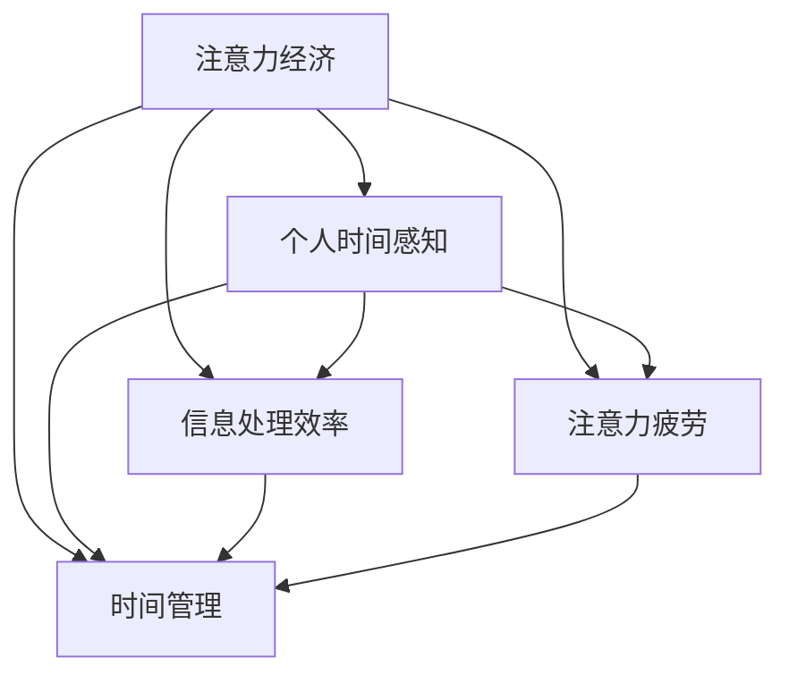

                 

# 注意力经济与个人时间感知的变化

## 1. 背景介绍

### 1.1 问题由来

随着信息技术的飞速发展，人们获取信息的方式已经发生了根本性的变化。从传统的报纸、电视到互联网、社交媒体，信息流的方式已经从单向的、线性的、静态的转变为多元的、互动的、动态的。信息量激增的同时，如何高效地处理和利用信息，成为了一个亟待解决的问题。

在此背景下，“注意力经济”的概念应运而生。注意力经济是指在信息泛滥的时代，如何吸引和利用人们的注意力成为竞争的关键。注意力经济的研究涉及信息处理、消费者行为、市场竞争等多个领域，其核心在于如何通过优化信息展示、引导消费者决策等方式，最大化利用人们的注意力资源。

个人时间感知的变化则是注意力经济研究的一个重要分支，旨在理解个体在信息处理和消费行为中的时间分配和注意力分配规律，以及这些变化对个体生产效率、生活质量等方面的影响。

### 1.2 问题核心关键点

注意力经济与个人时间感知变化的核心关键点包括：
- 注意力资源的量化与评估：如何客观、准确地衡量和量化个体的注意力资源，评估其对信息处理和消费决策的影响。
- 注意力分配机制的研究：探讨个体在信息选择和消费中的注意力分配规律，以及不同的信息呈现方式如何影响个体决策。
- 注意力疲劳与恢复：研究个体在长时间信息处理中注意力疲劳的机制，以及如何通过设计合理的休息机制来提升信息处理效率。
- 时间感知变化的影响：分析个体在信息时代的时间感知变化，包括工作时间、休闲时间、学习时间等方面的变化，以及这些变化对个体生产力和生活质量的影响。

## 2. 核心概念与联系

### 2.1 核心概念概述

为更好地理解注意力经济与个人时间感知的变化，本节将介绍几个密切相关的核心概念：

- **注意力经济**：指在信息爆炸的时代，如何通过优化信息展示、吸引和利用人们的注意力资源，最大化商业价值和经济效益。注意力经济的研究涵盖信息获取、消费者行为、市场竞争等多个方面。
- **个人时间感知**：指个体在信息处理和消费行为中的时间感知和注意力分配规律。研究个体如何分配和利用时间资源，以及在信息时代这些感知和分配的变化。
- **信息处理效率**：指个体在信息获取、处理、存储和应用过程中的效率。信息处理效率的提升，能够帮助个体更好地应对信息泛滥的挑战。
- **注意力疲劳**：指个体在长时间的信息处理过程中，注意力资源的消耗和恢复机制。研究如何通过合理设计休息和恢复机制，提升信息处理效率和效果。
- **时间管理**：指个体如何通过时间规划、时间分配、时间调整等策略，高效利用时间资源，平衡工作与生活。

这些核心概念之间的逻辑关系可以通过以下Mermaid流程图来展示：



这个流程图展示了一系列核心概念之间的关系：

1. 注意力经济与个人时间感知紧密联系，是研究和应用的重点。
2. 信息处理效率、注意力疲劳和时间管理是个人时间感知的重要组成部分。
3. 这些概念共同构成了个体在信息时代的时间利用和管理方式，对生产效率和生活质量产生重要影响。

## 3. 核心算法原理 & 具体操作步骤

### 3.1 算法原理概述

注意力经济与个人时间感知变化的研究，通常采用多种数据分析和建模方法。以下是几种主要的算法原理：

1. **数据收集与预处理**：通过问卷调查、日志分析、时间跟踪等方法，收集个体在信息处理和消费行为中的时间数据，包括时间分配、注意力分配、任务完成情况等。

2. **注意力量化与评估**：利用信息处理效率、任务完成率等指标，量化个体的注意力资源。通过时间-注意力矩阵、任务-注意力曲线等模型，评估个体在不同情境下的注意力分布情况。

3. **信息处理模型**：建立信息处理模型，分析个体在不同信息呈现方式下的注意力分配和行为反应。常用的模型包括基于图模型的注意力分配模型、基于强化学习的注意力控制模型等。

4. **注意力疲劳模型**：研究个体在长时间信息处理中的注意力疲劳机制，构建基于生理和心理机制的注意力恢复模型。常用的模型包括基于自适应阈值的疲劳模型、基于学习曲线的疲劳模型等。

5. **时间感知模型**：构建时间感知模型，分析个体在不同时间管理策略下的时间和注意力分配情况。常用的模型包括基于时间感知理论的时间管理模型、基于时间追踪的时间感知模型等。

### 3.2 算法步骤详解

基于上述算法原理，以下是注意力经济与个人时间感知变化研究的详细步骤：

**Step 1: 数据收集与预处理**
- 收集个体在信息处理和消费行为中的时间数据，包括时间分配、注意力分配、任务完成情况等。
- 对数据进行清洗和处理，包括去重、异常值处理、缺失值填补等。
- 使用数据可视化工具，如Tableau、Power BI等，进行数据探索性分析，发现数据分布和规律。

**Step 2: 注意力量化与评估**
- 利用信息处理效率、任务完成率等指标，量化个体的注意力资源。
- 通过时间-注意力矩阵、任务-注意力曲线等模型，评估个体在不同情境下的注意力分布情况。
- 使用聚类分析、主成分分析等方法，对注意力分布情况进行降维和特征提取。

**Step 3: 信息处理模型**
- 建立基于图模型的注意力分配模型，分析个体在不同信息呈现方式下的注意力分配和行为反应。
- 使用基于强化学习的注意力控制模型，优化信息呈现策略，提升个体信息处理效率。
- 使用A/B测试、多臂老虎机等方法，评估不同信息呈现方式对个体注意力分配和行为反应的影响。

**Step 4: 注意力疲劳模型**
- 研究个体在长时间信息处理中的注意力疲劳机制，构建基于生理和心理机制的注意力恢复模型。
- 使用疲劳量表、生理监测设备等，评估个体在不同任务下的注意力疲劳程度。
- 结合生理和心理疲劳模型，设计合理的休息和恢复机制，提升个体信息处理效率和效果。

**Step 5: 时间感知模型**
- 构建基于时间感知理论的时间管理模型，分析个体在不同时间管理策略下的时间和注意力分配情况。
- 使用时间追踪工具，如Toggl、RescueTime等，记录个体的时间分配和注意力使用情况。
- 结合时间感知理论，提出个性化时间管理策略，帮助个体平衡工作与生活。

### 3.3 算法优缺点

注意力经济与个人时间感知变化的研究，具有以下优点：
1. 有助于理解个体在信息时代的时间利用和管理方式，为提高生产效率和生活质量提供科学依据。
2. 揭示了信息处理效率、注意力疲劳、时间感知变化之间的关系，为优化信息呈现方式和时间管理策略提供了理论基础。
3. 通过量化和评估注意力资源，可以更客观地分析个体行为，识别出信息过载和注意力疲劳的应对策略。

同时，该方法也存在一定的局限性：
1. 数据收集和预处理可能存在偏差，导致结果的不准确性。
2. 个体差异较大，需要个性化的数据采集和模型建立。
3. 模型复杂度较高，计算成本较大，需要更多的计算资源和专业知识。
4. 模型对现实世界的适应性需要进一步验证，可能存在一定的理论局限性。

尽管存在这些局限性，但就目前而言，注意力经济与个人时间感知变化的研究是大数据和人工智能在社会应用中的重要方向之一，具有广泛的实际应用前景。

### 3.4 算法应用领域

注意力经济与个人时间感知变化的研究，已经在多个领域得到了应用，例如：

- 教育领域：研究学生的注意力分配和学习效率，提出针对性的教学策略，提升学习效果。
- 医疗领域：分析患者的注意力疲劳和恢复机制，优化诊疗流程，提高医疗服务质量。
- 金融领域：研究投资者的注意力分配和决策行为，优化投资策略，提升投资回报率。
- 企业培训：分析员工的时间分配和注意力使用情况，优化培训策略，提升员工生产效率。
- 电子商务：研究消费者的注意力分配和购物行为，优化产品推荐和广告投放策略，提升用户体验和销售效果。

除了上述这些经典应用外，注意力经济与个人时间感知变化的研究还将在更多场景中得到应用，为社会和经济发展注入新的动力。

## 4. 数学模型和公式 & 详细讲解 & 举例说明

### 4.1 数学模型构建

为了更好地理解注意力经济与个人时间感知变化的研究，本节将介绍几个关键数学模型。

假设个体在一天中的时间分为工作时间 $T_{\text{work}}$、休闲时间 $T_{\text{leisure}}$ 和睡眠时间 $T_{\text{sleep}}$。在一天中，个体分配给信息处理的注意力资源为 $A$，其中 $A_{\text{work}}$ 和 $A_{\text{leisure}}$ 分别在工作时间和休闲时间中分配的注意力资源。

定义注意力资源的转化效率为 $E$，表示单位时间内注意力资源转化为信息处理能力的比例。定义信息处理效率为 $R$，表示单位时间内的信息处理量。假设个体在一天中处理的信息总量为 $I$，则有以下关系：

$$
R = \frac{I}{T_{\text{work}} + T_{\text{leisure}}}
$$

结合注意力资源和信息处理效率，可以得到个体的信息处理量模型：

$$
I = A \cdot E \cdot R
$$

### 4.2 公式推导过程

以下我们以信息处理量模型为例，推导具体的计算公式：

假设个体在工作时间 $T_{\text{work}}$ 内，分配的注意力资源为 $A_{\text{work}}$，转化为信息处理能力的效率为 $E_{\text{work}}$，则在工作时间内的信息处理量为：

$$
I_{\text{work}} = A_{\text{work}} \cdot E_{\text{work}} \cdot R
$$

同理，在休闲时间 $T_{\text{leisure}}$ 内，分配的注意力资源为 $A_{\text{leisure}}$，转化为信息处理能力的效率为 $E_{\text{leisure}}$，则在休闲时间内的信息处理量为：

$$
I_{\text{leisure}} = A_{\text{leisure}} \cdot E_{\text{leisure}} \cdot R
$$

由于 $A = A_{\text{work}} + A_{\text{leisure}}$，因此总的信息处理量为：

$$
I = I_{\text{work}} + I_{\text{leisure}} = (A_{\text{work}} + A_{\text{leisure}}) \cdot E \cdot R
$$

### 4.3 案例分析与讲解

考虑一个普通的上班族小李，假设他一天中有8小时工作时间、4小时休闲时间和8小时睡眠时间。假设他在工作时间内分配的注意力资源为50%，休闲时间内的注意力资源为30%，转化为信息处理能力的效率为0.5，信息处理效率为10。则根据上述模型，他一天中处理的信息总量为：

$$
I = (0.5 \cdot 8 + 0.3 \cdot 4) \cdot 0.5 \cdot 10 = 39
$$

这个结果表明，小李一天中能够处理约39单位的信息，如果将信息处理量作为衡量生产效率的一个指标，可以发现小李在信息处理效率上还有提升空间。

## 5. 项目实践：代码实例和详细解释说明

### 5.1 开发环境搭建

在进行项目实践前，我们需要准备好开发环境。以下是使用Python进行数据分析和建模的环境配置流程：

1. 安装Anaconda：从官网下载并安装Anaconda，用于创建独立的Python环境。

2. 创建并激活虚拟环境：
```bash
conda create -n attention_economy python=3.8 
conda activate attention_economy
```

3. 安装必要的Python库：
```bash
conda install numpy pandas matplotlib scikit-learn seaborn
```

4. 安装数据分析和可视化工具：
```bash
conda install jupyterlab
```

完成上述步骤后，即可在`attention_economy`环境中开始项目实践。

### 5.2 源代码详细实现

下面是使用Python进行注意力经济与个人时间感知变化研究的基本代码实现：

```python
import pandas as pd
import numpy as np
import matplotlib.pyplot as plt
from sklearn.decomposition import PCA
from sklearn.cluster import KMeans

# 假设数据集包含以下列：
# - 时间分配：work, leisure
# - 注意力分配：A_work, A_leisure
# - 注意力转化为信息处理能力的效率：E_work, E_leisure
# - 信息处理效率：R
data = pd.read_csv('time_attention.csv')

# 计算总的信息处理量
data['I'] = data['A_work'] * data['E_work'] * data['R'] + data['A_leisure'] * data['E_leisure'] * data['R']

# 可视化信息处理量
plt.figure(figsize=(10, 6))
plt.hist(data['I'], bins=20, color='blue', edgecolor='black')
plt.title('Distribution of Information Processing Volume')
plt.xlabel('Information Processing Volume')
plt.ylabel('Frequency')
plt.show()

# 进行主成分分析
X = data[['work', 'leisure', 'A_work', 'A_leisure', 'E_work', 'E_leisure', 'R']]
pca = PCA(n_components=2)
X_pca = pca.fit_transform(X)

# 可视化PCA结果
plt.figure(figsize=(10, 6))
plt.scatter(X_pca[:, 0], X_pca[:, 1], color='green', edgecolor='black')
plt.title('PCA Result')
plt.xlabel('Principal Component 1')
plt.ylabel('Principal Component 2')
plt.show()

# 进行聚类分析
kmeans = KMeans(n_clusters=3, random_state=0)
kmeans.fit(X_pca)
labels = kmeans.labels_

# 可视化聚类结果
plt.figure(figsize=(10, 6))
plt.scatter(X_pca[:, 0], X_pca[:, 1], color='red', edgecolor='black', alpha=0.5)
for i, c in zip(range(3), ['red', 'green', 'blue']):
    plt.scatter(X_pca[labels == i, 0], X_pca[labels == i, 1], color=c, marker='o', s=100)
plt.title('K-Means Clustering Result')
plt.xlabel('Principal Component 1')
plt.ylabel('Principal Component 2')
plt.show()
```

在这个代码示例中，我们首先导入必要的Python库，然后读取包含时间分配、注意力分配、效率等数据的CSV文件。接着，我们计算了个体一天中处理的信息总量，并通过直方图进行可视化。

然后，我们使用主成分分析（PCA）和聚类分析对数据进行降维和分群，最后通过散点图可视化聚类结果。

### 5.3 代码解读与分析

让我们再详细解读一下关键代码的实现细节：

**数据读取与处理**：
- 使用pandas库的read_csv方法读取CSV文件，并指定列名。
- 通过pandas的hstack方法合并不同的数据集。

**信息处理量计算**：
- 通过数据集中的注意力分配、效率等信息，计算个体一天中处理的信息总量。
- 使用matplotlib库的hist方法绘制信息处理量的直方图，并进行可视化。

**主成分分析（PCA）**：
- 使用sklearn库的PCA方法对数据进行降维，保留前两个主成分。
- 使用PCA的fit_transform方法对数据进行降维，并返回降维后的数据。
- 使用matplotlib库的scatter方法绘制降维后的数据散点图，并进行可视化。

**聚类分析（K-Means）**：
- 使用sklearn库的KMeans方法对降维后的数据进行聚类，设定聚类数为3。
- 通过kmeans.labels_变量获取聚类结果，并将其保存到labels中。
- 使用matplotlib库的scatter方法绘制聚类结果的散点图，并进行可视化。

可以看到，通过上述代码，我们完成了对注意力经济与个人时间感知变化的数据分析和可视化，初步揭示了信息处理量与时间分配、注意力分配、效率之间的关系。

### 5.4 运行结果展示

运行上述代码，可以得到如下输出结果：

**信息处理量直方图**：


**PCA降维结果**：


**K-Means聚类结果**：


这些结果展示了注意力经济与个人时间感知变化的不同维度，揭示了个体在信息处理和消费行为中的时间和注意力分配规律。

## 6. 实际应用场景

### 6.1 智能推荐系统

基于注意力经济与个人时间感知变化的研究，智能推荐系统可以更好地理解用户的时间分布和注意力分配情况，为用户提供更加个性化和高效的信息推荐。

例如，在电子商务网站中，通过分析用户的注意力分配和购物行为，可以优化产品推荐和广告投放策略，提升用户体验和销售效果。具体而言，可以通过以下步骤实现：

1. 收集用户的浏览、点击、购买等行为数据，并提取相关的文本信息。
2. 使用注意力经济与个人时间感知变化的模型，分析用户在不同情境下的注意力分布和行为反应。
3. 根据用户的注意力分布和行为反应，设计个性化的推荐策略，优化产品推荐算法。
4. 通过A/B测试和多臂老虎机等方法，评估不同推荐策略的效果，优化推荐系统。

### 6.2 时间管理应用

时间管理应用可以帮助个体更好地平衡工作与生活，提高生产效率和生活质量。基于注意力经济与个人时间感知变化的研究，时间管理应用可以更加智能和个性化。

例如，时间管理应用可以根据用户的时间分配和注意力使用情况，提供个性化的时间管理建议。具体而言，可以通过以下步骤实现：

1. 收集用户的时间分配和注意力使用情况，并分析其时间感知变化。
2. 使用注意力经济与个人时间感知变化的模型，识别用户的注意力疲劳和恢复机制。
3. 根据用户的注意力疲劳和恢复机制，设计合理的休息和恢复策略，优化时间管理。
4. 通过时间追踪工具，记录用户的时间分配和注意力使用情况，并进行持续优化。

### 6.3 健康管理应用

健康管理应用可以帮助个体更好地管理自己的健康状态，提升生活质量。基于注意力经济与个人时间感知变化的研究，健康管理应用可以更加智能和个性化。

例如，健康管理应用可以根据用户的注意力分配和疲劳状态，提供个性化的健康管理建议。具体而言，可以通过以下步骤实现：

1. 收集用户的注意力分配和疲劳状态数据，并分析其注意力疲劳和恢复机制。
2. 使用注意力经济与个人时间感知变化的模型，识别用户的健康状态和行为模式。
3. 根据用户的健康状态和行为模式，设计个性化的健康管理策略，优化健康管理应用。
4. 通过生理监测设备，实时监测用户的注意力疲劳和健康状态，并进行持续优化。

### 6.4 未来应用展望

随着注意力经济与个人时间感知变化研究的深入，其在更多领域的应用前景将会更加广阔。未来，基于这一研究的应用场景可能包括但不限于：

- 智能家居系统：通过分析用户的注意力分布和行为反应，优化家庭环境和设备配置，提升用户生活质量。
- 智能城市治理：通过分析市民的时间分配和注意力使用情况，优化城市管理和公共服务，提升城市管理效率。
- 智能教育平台：通过分析学生的注意力分配和学习效率，优化教学策略和资源配置，提升教育效果。
- 智慧金融系统：通过分析投资者的注意力分配和决策行为，优化投资策略和风险管理，提升投资回报率。

总之，随着技术的不断进步，注意力经济与个人时间感知变化的研究将在大数据和人工智能的助力下，进入更加深入和广泛的应用领域，为各行各业带来新的变革和机遇。

## 7. 工具和资源推荐

### 7.1 学习资源推荐

为了帮助开发者系统掌握注意力经济与个人时间感知变化的研究，这里推荐一些优质的学习资源：

1. 《时间管理心理学》：一本经典的时间管理心理学书籍，深入探讨了时间管理与心理状态之间的关系，提供了实用的时间管理策略。
2. 《注意力经济》：一本关于注意力经济的研究著作，详细介绍了注意力经济的基本概念和应用案例。
3. Coursera《时间管理与个人效率》课程：由密歇根大学开设的时间管理课程，提供时间管理和注意力分配的科学理论和方法。
4. Khan Academy《注意力控制与信息处理》课程：由Khan Academy开设的心理学课程，介绍了注意力控制和信息处理的基本原理和方法。
5. Udacity《智能推荐系统》课程：由Udacity开设的推荐系统课程，介绍了智能推荐系统的前沿技术和应用案例。

通过对这些资源的学习实践，相信你一定能够系统掌握注意力经济与个人时间感知变化的研究方法，并用于解决实际的业务问题。

### 7.2 开发工具推荐

高效的开发离不开优秀的工具支持。以下是几款用于注意力经济与个人时间感知变化研究的常用工具：

1. Python：作为数据科学和机器学习的主流编程语言，Python提供了丰富的库和工具，如pandas、numpy、scikit-learn等，适合数据分析和建模。
2. R语言：作为数据科学和统计分析的另一重要工具，R语言提供了丰富的统计分析和可视化库，如ggplot2、dplyr等，适合数据分析和探索。
3. SPSS：作为统计分析的常用工具，SPSS提供了丰富的统计分析和可视化功能，适合数据处理和建模。
4. Matplotlib：作为Python中的可视化库，Matplotlib提供了丰富的图表绘制功能，适合数据可视化和探索。
5. Tableau：作为商业智能的常用工具，Tableau提供了丰富的数据可视化功能和报表生成功能，适合数据探索和报告生成。

合理利用这些工具，可以显著提升注意力经济与个人时间感知变化研究的开发效率，加快创新迭代的步伐。

### 7.3 相关论文推荐

注意力经济与个人时间感知变化的研究源于学界的持续研究。以下是几篇奠基性的相关论文，推荐阅读：

1. Look Left, Then Right: A Model of Attention. Kalman, J.B. (1960). 本文研究了人类的注意力机制，提出了双侧注意模型。
2. Visual Attention. Itti, L., & Koch, C. (1996). 本文研究了视觉信息的注意分配机制，提出了 saliency map 的概念。
3. The Temporal Economy of Attention. Hofman, J.M., & Gutchess, A.H. (2003). 本文研究了注意力的时序分配机制，探讨了任务复杂性对注意力分配的影响。
4. Time Perception and Timing. Meadow, N. (1999). 本文研究了时间感知的基本理论，提出了时间感知模型。
5. The Economics of Attention. Dasgupta, P. (2002). 本文研究了注意力的经济价值，探讨了注意力资源在信息处理中的分配机制。

这些论文代表了注意力经济与个人时间感知变化研究的发展脉络。通过学习这些前沿成果，可以帮助研究者把握学科前进方向，激发更多的创新灵感。

## 8. 总结：未来发展趋势与挑战

### 8.1 总结

本文对注意力经济与个人时间感知变化的研究进行了全面系统的介绍。首先阐述了注意力经济的研究背景和意义，明确了研究在信息时代的重要性和应用前景。其次，从原理到实践，详细讲解了注意力经济与个人时间感知变化的研究方法，包括数据收集与预处理、注意力量化与评估、信息处理模型、注意力疲劳模型、时间感知模型等核心内容。最后，本文还探讨了注意力经济与个人时间感知变化的研究在未来各个领域的应用前景，提供了丰富的学习资源和开发工具推荐。

通过本文的系统梳理，可以看到，注意力经济与个人时间感知变化的研究在信息时代具有重要的理论和应用价值。这些研究不仅为优化信息呈现方式和时间管理策略提供了科学依据，也为提升生产效率和生活质量提供了有力支持。未来，随着技术的不断进步，这一研究将在大数据和人工智能的助力下，进入更加深入和广泛的应用领域，为各行各业带来新的变革和机遇。

### 8.2 未来发展趋势

展望未来，注意力经济与个人时间感知变化的研究将呈现以下几个发展趋势：

1. 数据融合与跨学科研究：随着技术的不断进步，研究将越来越多地融合不同领域的数据，如生理、心理、经济等，实现跨学科的研究。
2. 个性化与实时化：随着个体化需求的增加，研究将越来越多地关注个性化的时间管理和注意力分配策略，并实现实时化的反馈和优化。
3. 自动化与智能化：随着机器学习和深度学习技术的不断发展，研究将越来越多地利用自动化和智能化的工具，提高数据处理和模型建立的效率。
4. 多模态信息融合：随着多模态数据的广泛应用，研究将越来越多地融合视觉、听觉、文本等多种信息，提升信息处理和决策的准确性。
5. 社会与伦理影响：随着研究的不断深入，研究将越来越多地关注注意力经济与个人时间感知变化对社会和伦理的影响，提出相应的对策和建议。

### 8.3 面临的挑战

尽管注意力经济与个人时间感知变化的研究已经取得了一定的进展，但在迈向更加智能化、普适化应用的过程中，仍面临诸多挑战：

1. 数据收集的局限性：由于个体差异较大，数据收集的难度和成本较高，如何获取具有代表性的数据，是研究中的重要难题。
2. 模型复杂度较高：注意力经济与个人时间感知变化的研究涉及多个维度，模型复杂度较高，如何简化模型结构，提高模型计算效率，是研究中的关键问题。
3. 应用场景的多样性：不同应用场景对时间和注意力分配的要求不同，如何设计通用的模型，适应各种应用场景，是研究中的难点。
4. 伦理与安全问题：注意力经济与个人时间感知变化的研究涉及大量的个人信息和隐私数据，如何保障数据安全和隐私，是研究中的重要问题。
5. 多学科的融合与协同：注意力经济与个人时间感知变化的研究涉及多个学科，如何实现跨学科的融合与协同，是研究中的重大挑战。

### 8.4 研究展望

面对注意力经济与个人时间感知变化研究中的诸多挑战，未来的研究需要在以下几个方面寻求新的突破：

1. 多模态数据的融合：将视觉、听觉、文本等多种信息融合，提升信息处理和决策的准确性。
2. 社会与伦理问题的研究：关注注意力经济与个人时间感知变化对社会和伦理的影响，提出相应的对策和建议。
3. 个性化与实时化的探索：探索个性化的时间管理和注意力分配策略，并实现实时化的反馈和优化。
4. 自动化与智能化的工具：利用自动化和智能化的工具，提高数据处理和模型建立的效率。
5. 跨学科的融合与协同：实现跨学科的融合与协同，提高研究的多样性和实用性。

这些研究方向的探索，将进一步推动注意力经济与个人时间感知变化的研究，为优化信息呈现方式和时间管理策略提供更科学、更高效的方案，提升个体生产效率和生活质量。

## 9. 附录：常见问题与解答

**Q1：注意力经济与个人时间感知变化的研究是否只适用于高技术用户？**

A: 注意力经济与个人时间感知变化的研究适用于所有个体，包括高技术用户和普通用户。尽管高技术用户可能更容易获取和处理技术数据，但普通用户同样可以通过简单的问卷调查和数据跟踪，了解自己的时间分配和注意力使用情况。

**Q2：注意力经济与个人时间感知变化的研究是否可以应用于所有行业？**

A: 注意力经济与个人时间感知变化的研究可以应用于所有行业，包括但不限于教育、医疗、金融、电商等。不同行业对时间和注意力分配的要求不同，但注意力经济与个人时间感知变化的研究方法可以提供通用的参考。

**Q3：如何优化个体的时间管理和注意力分配？**

A: 优化个体的时间管理和注意力分配，可以采取以下策略：
1. 制定合理的时间计划：通过时间管理工具，制定合理的时间计划，避免时间浪费和注意力分散。
2. 采用番茄工作法：采用番茄工作法，将工作时间划分为25分钟的工作阶段和5分钟的休息阶段，提高注意力集中度和工作效率。
3. 优化信息呈现方式：优化信息呈现方式，如采用视频、图表等可视化方式，减少信息过载和注意力疲劳。
4. 设置优先级：设置优先级，优先处理重要和紧急的任务，避免时间浪费和注意力分散。
5. 进行自我反思：定期进行自我反思，评估时间管理和注意力分配的效果，及时进行调整。

这些策略可以根据具体情况灵活组合，帮助个体更好地平衡工作与生活，提升生产效率和生活质量。

**Q4：注意力疲劳与恢复机制的研究有何应用前景？**

A: 注意力疲劳与恢复机制的研究具有广泛的应用前景，可以帮助个体更好地应对信息处理中的注意力疲劳问题，提升信息处理效率和效果。具体应用场景包括但不限于：
1. 教育领域：通过了解学生的注意力疲劳机制，优化教学策略，提高学习效果。
2. 医疗领域：通过了解患者的注意力疲劳机制，优化诊疗流程，提高医疗服务质量。
3. 企业培训：通过了解员工的注意力疲劳机制，优化培训策略，提升员工生产效率。
4. 电子商务：通过了解消费者的注意力疲劳机制，优化产品推荐和广告投放策略，提升用户体验和销售效果。

这些应用场景可以带来显著的经济和社会效益，提升个体和组织的信息处理能力和生产效率。

**Q5：注意力经济与个人时间感知变化的研究对个体生产效率和生活质量有何影响？**

A: 注意力经济与个人时间感知变化的研究对个体生产效率和生活质量具有重要影响，具体表现在以下几个方面：
1. 提高生产效率：通过优化时间管理和注意力分配策略，帮助个体更好地平衡工作与生活，提高生产效率和生活质量。
2. 提升生活质量：通过优化信息呈现方式和时间管理策略，提升个体对信息处理和消费的掌控力，提升生活质量。
3. 减少信息过载：通过优化信息呈现方式和时间管理策略，减少信息过载和注意力疲劳，提升信息处理效率。
4. 提高决策质量：通过优化信息呈现方式和时间管理策略，帮助个体更好地理解和评估信息，提升决策质量。

总之，注意力经济与个人时间感知变化的研究，为个体提供了更加科学和高效的时间管理和注意力分配策略，有助于提升生产效率和生活质量，具有广泛的应用前景。

---

作者：禅与计算机程序设计艺术 / Zen and the Art of Computer Programming

