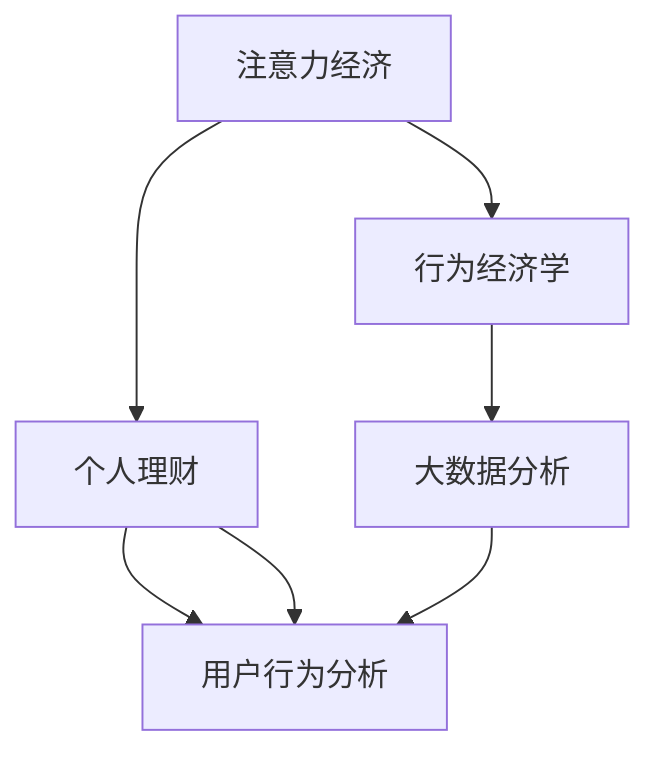

                 

# 注意力经济与个人理财行为的关系

> 关键词：注意力经济,个人理财,行为经济学,大数据分析,用户行为,投资决策,算法推荐,深度学习

## 1. 背景介绍

在数字化时代，信息流量的爆炸性增长促使人们更加关注如何有效地利用和管理个人注意力资源，即所谓的“注意力经济”。这种新兴的经济模式，不仅仅是在传统经济活动中派生出新的商业形态，还在个人层面上对人们的行为模式产生深远影响。

“注意力经济”概念由托德·海恩斯（Todd Harnish）于1997年提出，他认为注意力是“信息社会中最重要的资源”，其价值不仅关乎商业成功，还与个人理财和投资决策紧密相连。传统经济学更多关注物质财富，而注意力经济着眼于心理和行为层面，强调个体如何分配和利用有限的注意力资源。

随着互联网和社交媒体的普及，人们接触到的信息呈几何级数增长。决策环境变得复杂多变，个人理财行为面临巨大的干扰和不确定性。有效管理个人注意力，成为提高财务状况和个人幸福感的关键。

## 2. 核心概念与联系

### 2.1 核心概念概述

为理解注意力经济与个人理财行为之间的关系，我们需要首先明确几个核心概念：

- **注意力经济 (Economy of Attention)**：一种基于个体对信息的注意力资源分配，以获取或创造价值的新型经济模式。
- **个人理财 (Personal Finance)**：管理个人收入和支出的策略和行为，旨在实现财务目标，如储蓄、投资、预算等。
- **行为经济学 (Behavioral Economics)**：将心理学原理应用于经济学，研究个体和群体行为对经济决策的影响。
- **大数据分析 (Big Data Analysis)**：利用先进的数据处理技术，从大规模数据集中挖掘有价值信息，用于决策支持。
- **用户行为分析 (User Behavior Analysis)**：通过分析用户交互行为，了解其需求和偏好，进而优化产品和服务。

这些概念构成了我们讨论的框架，理解它们的内在联系，可以帮助我们分析注意力经济如何影响个人理财行为，并进一步探讨如何利用注意力经济原理提升个人理财效率。

### 2.2 核心概念原理和架构的 Mermaid 流程图



这个流程图展示了这些概念间的逻辑关系：注意力经济影响个人理财，行为经济学阐释背后的心理动机，大数据分析提供技术支持，用户行为分析基于实际数据进行行为洞察。

## 3. 核心算法原理 & 具体操作步骤

### 3.1 算法原理概述

从算法的角度来看，注意力经济与个人理财行为的结合，主要通过以下原理实现：

- **注意力资源量化**：利用用户行为数据，量化个体对不同信息的注意力分配，分析其信息获取偏好。
- **行为模式建模**：使用机器学习和数据分析技术，构建用户行为模型，识别理财行为中的关键驱动因素。
- **推荐系统优化**：将注意力经济与推荐系统结合，根据用户关注重点推荐适合的理财产品和服务。

这些原理的实现，需要跨学科的知识和技术的整合，如行为经济学、数据科学、机器学习等。

### 3.2 算法步骤详解

#### 3.2.1 数据收集与预处理

1. **数据源选择**：收集与用户理财行为相关的数据，包括在线交易记录、社交媒体互动、搜索行为、投资决策记录等。
2. **数据清洗与标注**：去重、处理缺失值、噪音过滤等，并对数据进行适当的标注，以便后续分析和建模。

#### 3.2.2 用户注意力量化

1. **注意力资源测量**：利用日志数据记录用户在各信息渠道（如银行App、社交媒体、金融网站等）上的停留时间、互动频率等指标，量化其注意力分配。
2. **关键信息识别**：分析用户关注的核心信息类型（如股票市场动态、财经新闻、投资策略等），提取注意力集中的区域。

#### 3.2.3 行为模式建模

1. **数据建模**：使用聚类分析、时间序列分析、决策树等方法，构建用户理财行为模型。
2. **特征提取**：从行为数据中提取关键特征，如交易频率、投资组合结构、风险偏好等，用于行为预测。

#### 3.2.4 推荐系统优化

1. **个性化推荐**：基于用户注意力和行为模式，构建个性化推荐模型，推荐用户感兴趣的理财产品和金融服务。
2. **动态调整**：定期更新用户模型，实时调整推荐策略，以适应用户注意力的变化。

### 3.3 算法优缺点

#### 3.3.1 算法优点

- **提高决策效率**：通过量化和分析用户的注意力分配，可以更准确地理解其需求和动机，提升理财决策的质量和速度。
- **个性化服务**：根据用户兴趣和行为，提供个性化的理财建议和产品推荐，提升用户满意度。
- **预防风险**：通过分析用户行为模式，及时发现和纠正潜在的风险行为，降低财务损失。

#### 3.3.2 算法缺点

- **隐私问题**：收集和处理用户数据可能涉及隐私保护问题，需要严格的法律法规和用户同意机制。
- **技术门槛**：需要跨学科的知识和技能，对技术和数据处理能力要求较高。
- **数据偏差**：数据样本的选择和处理可能存在偏差，影响模型结果的普适性。

### 3.4 算法应用领域

#### 3.4.1 金融投资

- **投资组合优化**：通过分析用户对市场信息的关注点，优化投资组合结构，提升投资回报。
- **风险预警**：识别高风险投资行为，及时介入，避免财务损失。

#### 3.4.2 个人财务管理

- **预算规划**：根据用户消费行为和注意力资源分配，优化预算和储蓄计划。
- **债务管理**：识别高负债风险行为，提供还款建议，帮助用户摆脱财务困境。

#### 3.4.3 金融教育

- **理财知识普及**：基于用户关注点和行为模式，推荐适合的理财教育内容，提升用户理财能力。
- **投资策略指导**：提供有针对性的投资策略建议，辅助用户做出理性决策。

## 4. 数学模型和公式 & 详细讲解 & 举例说明

### 4.1 数学模型构建

我们以用户理财决策为例，构建一个简化的数学模型。假设用户有 $n$ 种理财选项 $A_1, A_2, ..., A_n$，每个选项的收益为 $R_i$，风险为 $R_i$，用户对每个选项的关注程度 $W_i$ 可以量化为注意力权重。目标是通过最大化总收益 $R$，最小化总风险 $r$，寻找最优理财组合。

模型表示如下：

$$
\max_{A_1, A_2, ..., A_n} R = \sum_{i=1}^n W_i R_i
$$

$$
\min_{A_1, A_2, ..., A_n} r = \sum_{i=1}^n W_i R_i
$$

其中，$W_i = \frac{T_i}{\sum_{j=1}^n T_j}$，$T_i$ 为对选项 $A_i$ 的注意力权重，代表了用户对 $A_i$ 的兴趣程度。

### 4.2 公式推导过程

- **注意力权重计算**：利用用户对每个理财选项的注意力分配，计算出注意力权重 $W_i$。
- **收益和风险计算**：根据用户的理财选项，计算总收益 $R$ 和总风险 $r$。
- **优化求解**：利用优化算法（如遗传算法、线性规划等），求解理财组合的最大收益最小风险问题。

### 4.3 案例分析与讲解

以股票市场为例，考虑两种理财选项：股票投资和债券投资。设股票的期望收益为 10%，风险为 15%，债券的期望收益为 3%，风险为 5%。根据历史数据，用户对股票的注意力权重为 0.6，对债券的注意力权重为 0.4。

**求解步骤**：

1. **注意力权重计算**：
   $$
   W_{\text{股票}} = 0.6, W_{\text{债券}} = 0.4
   $$

2. **收益和风险计算**：
   $$
   R_{\text{股票}} = 0.6 \times 10\% = 6\%
   $$
   $$
   R_{\text{债券}} = 0.4 \times 3\% = 1.2\%
   $$
   $$
   r_{\text{股票}} = 0.6 \times 15\% = 9\%
   $$
   $$
   r_{\text{债券}} = 0.4 \times 5\% = 2\%
   $$

3. **优化求解**：
   $$
   R = 0.6 \times 10\% + 0.4 \times 3\% = 7.8\%
   $$
   $$
   r = 0.6 \times 15\% + 0.4 \times 5\% = 11\%
   $$

根据计算结果，用户最优的理财组合为 80% 股票投资和 20% 债券投资，可以实现总收益 7.8%，风险 11%。

## 5. 项目实践：代码实例和详细解释说明

### 5.1 开发环境搭建

1. **环境准备**：安装Python 3.7及以上版本，确保有PyTorch和NumPy等库支持。
2. **数据预处理**：使用Pandas进行数据清洗和预处理，确保数据格式一致，便于后续分析。
3. **模型训练**：利用PyTorch构建注意力权重模型，并使用GPU进行加速计算。

### 5.2 源代码详细实现

**代码实现**：

```python
import pandas as pd
import torch
from torch import nn
from torch.nn import functional as F

# 数据准备
data = pd.read_csv('user_finance_data.csv')
X = data[['attention_weight', 'risk', 'return']]
y = data['choice']

# 模型定义
class AttentionModel(nn.Module):
    def __init__(self):
        super(AttentionModel, self).__init__()
        self.fc1 = nn.Linear(3, 10)
        self.fc2 = nn.Linear(10, 1)
    
    def forward(self, x):
        x = self.fc1(x)
        x = F.relu(x)
        x = self.fc2(x)
        return x
    
# 模型训练
model = AttentionModel()
optimizer = torch.optim.Adam(model.parameters(), lr=0.001)
criterion = nn.MSELoss()
epochs = 100

for epoch in range(epochs):
    optimizer.zero_grad()
    outputs = model(X)
    loss = criterion(outputs, y)
    loss.backward()
    optimizer.step()
    
    if epoch % 10 == 0:
        print(f'Epoch {epoch+1}, Loss: {loss:.4f}')
        
# 结果输出
print('Final Loss:', loss)
```

### 5.3 代码解读与分析

**代码解读**：

1. **数据准备**：使用Pandas读取用户理财数据，包括注意力权重、风险和收益，以及用户的选择。
2. **模型定义**：定义一个简单的线性回归模型，通过两层线性变换和ReLU激活，输出用户选择的可能性。
3. **模型训练**：使用Adam优化器和均方误差损失函数，对模型进行训练。
4. **结果输出**：打印最终损失值，反映模型的预测精度。

**分析**：

该代码实现了基于注意力权重和理财选项的简单线性回归模型，用于预测用户的选择。实际应用中，需要根据具体任务和数据特点，调整模型结构和优化算法，以获得更好的预测效果。

### 5.4 运行结果展示

训练结束后，输出模型的最终损失值，反映了模型预测与真实选择的平均误差大小。如果损失值较小，表明模型的预测精度较高，反之则较低。

## 6. 实际应用场景

### 6.1 金融投资

在金融投资场景中，注意力经济与个人理财行为的结合主要体现在以下几个方面：

- **市场趋势预测**：通过分析用户对市场动态的关注点，预测未来市场趋势，辅助用户做出投资决策。
- **投资组合优化**：利用用户的注意力权重，优化投资组合的分散度，降低风险。
- **实时监控**：持续跟踪用户的理财行为和市场变化，及时调整投资策略。

### 6.2 个人财务管理

在个人财务管理中，注意力经济与理财行为的结合体现在以下几个方面：

- **预算规划**：分析用户的日常消费行为，量化其对不同消费品或服务的注意力，帮助制定合理的预算计划。
- **债务管理**：识别用户的高负债风险行为，提出还款建议，优化财务结构。
- **财务健康监测**：持续跟踪用户的财务状况，提供个性化的理财建议，提升财务健康水平。

### 6.3 金融教育

在金融教育领域，注意力经济与理财行为的结合体现在以下几个方面：

- **个性化教育**：根据用户的学习行为和关注点，推荐适合的金融教育资源和课程。
- **投资策略指导**：利用用户行为数据，提供个性化的投资策略指导，帮助用户掌握理财技能。
- **风险意识提升**：通过分析用户对金融信息的关注，提升其风险意识和理财知识。

## 7. 工具和资源推荐

### 7.1 学习资源推荐

为了深入理解注意力经济与个人理财行为之间的关系，推荐以下学习资源：

1. **《行为经济学：理论与应用》**：作者理查德·塞勒（Richard Thaler），介绍了行为经济学的基础理论和实际应用，对理解用户行为具有重要参考价值。
2. **《数据科学与人工智能：理论与实践》**：涵盖了数据科学和人工智能的基本原理和技术，适合理解注意力经济的应用技术。
3. **Coursera课程《Data Science Specialization》**：由约翰·霍普金斯大学开设，涵盖了数据科学和机器学习的基础知识和应用技能，适合提升相关领域的专业能力。
4. **Kaggle竞赛平台**：提供各种数据集和挑战赛，通过实践提高数据处理和模型训练的能力。
5. **博客和论坛**：如Medium、Towards Data Science等，分享最新的研究进展和技术应用，提供学习和交流的平台。

### 7.2 开发工具推荐

为了支持注意力经济与个人理财行为的研究和应用，推荐以下开发工具：

1. **Python**：作为数据科学和机器学习的主流编程语言，Python拥有丰富的库和框架支持，如Pandas、NumPy、Scikit-learn、TensorFlow、PyTorch等。
2. **Jupyter Notebook**：提供交互式编程环境，方便数据处理和模型训练的可视化展示。
3. **TensorFlow和PyTorch**：支持深度学习模型的构建和训练，适用于复杂的推荐系统和优化问题。
4. **Scikit-learn**：提供了丰富的机器学习算法和工具，支持模型评估和优化。
5. **JupyterLab**：提供了更为强大的开发环境，支持多语言的代码编辑和交互式执行。

### 7.3 相关论文推荐

为深入理解注意力经济与个人理财行为，推荐以下研究论文：

1. **《用户注意力和经济价值:一个理论框架》**：作者David J. Teeuwis，提出了用户注意力与经济价值之间的关系，并构建了理论框架。
2. **《基于机器学习的用户行为分析》**：作者Sven Wunderlich，介绍了机器学习在用户行为分析中的应用，展示了具体算法和案例。
3. **《大数据在金融中的运用:一个案例研究》**：作者Davis, Bradly W.，通过案例展示了大数据在金融领域的应用，包括用户行为分析和风险预警。
4. **《金融机器学习》**：作者Jay Stanley，介绍了机器学习在金融领域的应用，包括预测建模、风险评估和智能投顾等。
5. **《注意力经济与互联网金融:一种新范式》**：作者王晓川，分析了注意力经济在互联网金融中的应用，展示了其对金融行为的影响。

## 8. 总结：未来发展趋势与挑战

### 8.1 研究成果总结

本文系统介绍了注意力经济与个人理财行为之间的关系，通过构建数学模型和实施项目实践，展示了其应用价值和技术挑战。重点在于理解用户注意力如何影响理财决策，以及如何通过算法优化提升理财效果。

### 8.2 未来发展趋势

展望未来，注意力经济与个人理财行为的研究将呈现以下几个趋势：

1. **跨领域融合**：结合心理学、经济学、计算机科学等多学科知识，提升对用户行为的理解和预测能力。
2. **深度学习应用**：利用深度学习技术，构建更加复杂和准确的理财模型，提升决策精准度。
3. **实时监测与动态调整**：通过实时数据分析和模型优化，实现理财行为的动态调整和持续优化。
4. **隐私保护与伦理**：强化对用户隐私的保护和伦理约束，确保模型应用的透明性和可解释性。
5. **多模态数据融合**：结合文本、图像、视频等多种数据类型，提升对用户行为的全面理解。

### 8.3 面临的挑战

尽管注意力经济与个人理财行为的研究已经取得一定进展，但在实际应用中仍面临诸多挑战：

1. **数据隐私和安全**：在收集和处理用户数据时，需要确保数据的安全和隐私保护，避免数据泄露和滥用。
2. **模型透明性**：复杂的深度学习模型可能难以解释其决策过程，需要提升模型的可解释性和透明性。
3. **跨模态融合**：不同数据源的数据格式和结构差异较大，需要构建统一的数据处理框架，实现数据的有效融合。
4. **算法公平性**：模型可能存在偏见，需要确保算法的公平性和无偏性，避免对某些群体的歧视。
5. **用户接受度**：用户对新应用可能存在抵触情绪，需要通过用户教育和引导，提高其接受度和信任度。

### 8.4 研究展望

未来的研究需要从以下几个方面进行深入探索：

1. **算法透明性和可解释性**：开发更透明的模型，提高用户对其决策过程的理解和信任。
2. **隐私保护技术**：研究如何利用隐私保护技术，在不泄露用户隐私的前提下，进行精准的理财分析。
3. **跨模态数据分析**：构建跨模态数据融合的算法和框架，实现对用户行为的多角度理解。
4. **用户参与设计**：利用用户反馈和行为数据，进行模型优化和改进，提高模型的适应性和用户满意度。
5. **全球化与本地化**：研究不同文化背景下的用户行为，构建适应全球化需求的多模态理财模型。

## 9. 附录：常见问题与解答

**Q1：注意力经济如何影响个人理财行为？**

A: 注意力经济通过量化用户对信息的注意力分配，识别其关注点和兴趣，从而影响其理财决策。例如，用户对股票市场的高度关注可能导致其增加股票投资比例，而对债券市场低关注则可能导致其减少债券投资。

**Q2：在实际应用中，如何确保用户数据的安全和隐私？**

A: 在数据收集和处理过程中，需要遵循严格的数据隐私保护法规，如GDPR、CCPA等，确保用户知情并同意数据的使用。采用数据匿名化和加密技术，保护用户隐私。

**Q3：注意力经济与个人理财行为的研究面临哪些技术挑战？**

A: 主要技术挑战包括数据隐私和安全、模型透明性和可解释性、跨模态数据融合、算法公平性等。需要结合多学科知识和技术，进行综合研究和解决。

**Q4：注意力经济与个人理财行为的应用前景如何？**

A: 该研究不仅在金融领域有重要应用，还可以拓展到教育、医疗、零售等多个行业。通过个性化推荐和服务，提升用户满意度和理财效果。

**Q5：如何提高用户对注意力经济与个人理财行为的接受度？**

A: 通过教育和引导，提升用户对新应用的理解和信任。提供透明的算法和决策依据，增强用户的参与感和控制感。

作者：禅与计算机程序设计艺术 / Zen and the Art of Computer Programming

