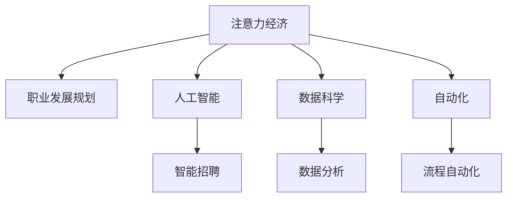

                 

# 注意力经济与个人职业发展规划的变化

> 关键词：注意力经济,职业发展规划,人工智能,数据科学,自动化

## 1. 背景介绍

### 1.1 问题由来

在信息爆炸的时代，人类社会逐渐进入了一个新的经济形态——注意力经济。随着互联网和移动设备的普及，人们每天都会接触到海量的信息，如何吸引和保持用户注意力成为商业成功的关键。这一现象在职场上也得到了充分的体现，职业发展不再仅仅是技能的提升，而是更多地依赖于个人在互联网上的曝光率和关注度。

### 1.2 问题核心关键点

注意力经济的核心在于如何利用有限的注意力资源创造更多的价值。在职业发展的背景下，这意味着个人需要通过多种渠道展示自己，提高自己在职业社交平台上的影响力，获取更多的关注和机会。

### 1.3 问题研究意义

研究注意力经济与个人职业发展规划的变化，有助于理解当前职场中的新现象和趋势，为个人提供更具前瞻性的职业发展策略，从而更好地适应信息时代的要求。

## 2. 核心概念与联系

### 2.1 核心概念概述

为更好地理解注意力经济与个人职业发展规划，本节将介绍几个密切相关的核心概念：

- 注意力经济：以注意力为生产要素的经济形态，强调个人或企业如何通过吸引和利用用户注意力创造商业价值。
- 职业发展规划：指个人在职业发展过程中，对未来职业路径、技能提升、职位变动等的规划和安排。
- 人工智能：通过机器学习和深度学习技术实现智能化决策和自动化执行的计算系统。
- 数据科学：利用数据和统计方法进行分析和决策的学科，尤其在数据驱动的商业模型中发挥关键作用。
- 自动化：通过技术手段实现任务自动化的过程，提高工作效率，减少人力投入。

这些核心概念之间的逻辑关系可以通过以下Mermaid流程图来展示：



这个流程图展示了几大核心概念之间的相互关系：

1. 注意力经济与职业发展规划相互影响，共同构成职场中的新生态。
2. 人工智能、数据科学和自动化技术，为注意力经济的实现提供了技术支持。
3. 这些技术在职业发展规划中也有广泛应用，如智能招聘、数据分析和流程自动化等。

## 3. 核心算法原理 & 具体操作步骤

### 3.1 算法原理概述

注意力经济与职业发展规划的变化，本质上是技术进步推动职场环境的变化。这一变化涉及多个方面的算法和操作：

- 数据收集与分析：通过数据科学方法，收集和分析用户的注意力分布情况，识别出具有高关注度的领域和内容。
- 内容生成与推荐：利用人工智能技术生成高质量的内容，并通过推荐算法向用户推送，提高用户互动和停留时间。
- 自动化执行与反馈：通过自动化技术实现任务执行，并根据用户的反馈调整策略，不断优化内容和服务。

### 3.2 算法步骤详解

基于注意力经济与职业发展规划的算法和操作步骤，主要包括以下几个关键步骤：

**Step 1: 数据收集与分析**
- 收集用户的行为数据，包括浏览、点击、分享、评论等互动行为。
- 使用数据科学方法对用户行为数据进行建模和分析，识别出用户的兴趣点、关注领域和行为模式。

**Step 2: 内容生成与推荐**
- 根据用户的行为数据，利用自然语言处理和生成对抗网络等人工智能技术，生成高质量的文本、图片和视频内容。
- 使用推荐算法（如协同过滤、内容推荐、深度学习推荐系统等）向用户推荐相关内容，提高用户互动和停留时间。

**Step 3: 自动化执行与反馈**
- 利用流程自动化技术实现内容发布、互动管理、数据分析等任务，提高工作效率。
- 根据用户反馈和数据分析结果，不断优化内容生成和推荐策略，提升用户满意度。

### 3.3 算法优缺点

注意力经济与职业发展规划的变化，涉及多个方面的算法和操作，其优缺点如下：

**优点：**
- 提高效率：通过自动化和智能化的手段，大幅提高任务执行效率，减少人力投入。
- 提升质量：利用人工智能生成高质量的内容，提高用户互动和满意度。
- 数据驱动：通过数据分析识别用户兴趣和行为模式，实现个性化推荐。

**缺点：**
- 数据隐私：大量数据收集和使用可能涉及用户隐私问题，需严格遵守数据保护法规。
- 内容同质化：过度依赖推荐算法可能导致内容同质化，影响用户的多样性体验。
- 技术依赖：依赖于复杂的技术系统，一旦出现故障可能影响业务运行。

### 3.4 算法应用领域

注意力经济与职业发展规划的变化，广泛应用于多个领域：

- 内容创作：如视频、文章、社交媒体等内容的生成和推荐，提高内容的曝光率和互动率。
- 营销策略：通过分析用户行为数据，制定个性化的营销策略，提升广告效果。
- 人力资源：利用智能招聘和人才管理工具，优化招聘流程，提高人才匹配度。
- 教育培训：通过在线教育和培训平台，个性化推荐学习内容，提升学习效果。

除了上述这些领域外，注意力经济与职业发展规划的变化，还在更多领域得到应用，为各行各业带来新的发展机遇。

## 4. 数学模型和公式 & 详细讲解 & 举例说明

### 4.1 数学模型构建

注意力经济与职业发展规划的变化，涉及多个数学模型的构建。以下是一些基本的数学模型及其构建方法：

- 用户行为模型：用于描述用户在平台上的行为模式，可以使用时间序列分析、事件网络分析等方法构建。
- 内容推荐模型：用于预测用户对内容的偏好，可以使用协同过滤、矩阵分解、深度学习推荐系统等方法构建。
- 自动化执行模型：用于描述任务的自动化执行流程，可以使用流程自动化、任务调度等方法构建。

### 4.2 公式推导过程

以下我们以协同过滤推荐算法为例，推导其基本公式。

协同过滤推荐算法的基本思想是，通过分析用户对相似物品的评价，预测用户对新物品的评分。设用户集合为 $U$，物品集合为 $I$，用户 $u$ 对物品 $i$ 的评分矩阵为 $R_{ui}$，相似度矩阵为 $A_{ui}$。协同过滤算法的目标是最大化用户 $u$ 对物品 $i$ 的评分预测误差最小化：

$$
\min_{\theta} \sum_{u=1}^N \sum_{i=1}^M \alpha_{ui} (R_{ui} - \theta^T A_{ui} \theta)^2
$$

其中 $\alpha_{ui}$ 为正则化系数，$\theta$ 为用户-物品评分预测模型。通过求解上述优化问题，得到预测模型：

$$
\theta = (A_{ui}^T A_{ui} + \alpha_{ui} I)^{-1} A_{ui}^T R_{ui}
$$

这个公式展示了协同过滤算法的基本思路，即通过用户-物品评分矩阵和相似度矩阵，预测用户对新物品的评分。

### 4.3 案例分析与讲解

下面我们以智能招聘平台为例，分析其基于注意力经济与职业发展规划的变化。

智能招聘平台通过收集求职者的简历、求职历史、技能测试等数据，结合职位描述、公司评价等公开信息，建立用户行为模型和内容推荐模型。利用这些模型，智能招聘平台能够实现以下功能：

- 简历推荐：根据求职者的历史申请行为和兴趣偏好，推荐最适合的职位。
- 职位匹配：通过分析职位需求和用户技能，匹配最符合的求职者。
- 智能投递：根据求职者的简历内容，自动投递到合适的公司招聘系统。

通过这些功能的实现，智能招聘平台能够大幅提高职位匹配的精准度和求职者的求职效率，同时提升了平台的吸引力和竞争力。

## 5. 项目实践：代码实例和详细解释说明

### 5.1 开发环境搭建

在进行注意力经济与职业发展规划的变化实践前，我们需要准备好开发环境。以下是使用Python进行Scikit-Learn开发的环境配置流程：

1. 安装Anaconda：从官网下载并安装Anaconda，用于创建独立的Python环境。

2. 创建并激活虚拟环境：
```bash
conda create -n scikit-learn-env python=3.8 
conda activate scikit-learn-env
```

3. 安装Scikit-Learn：
```bash
conda install scikit-learn
```

4. 安装各类工具包：
```bash
pip install numpy pandas scikit-learn matplotlib tqdm jupyter notebook ipython
```

完成上述步骤后，即可在`scikit-learn-env`环境中开始注意力经济与职业发展规划的变化实践。

### 5.2 源代码详细实现

下面我们以协同过滤推荐算法为例，给出使用Scikit-Learn库对用户行为数据进行建模和预测的PyTorch代码实现。

首先，定义数据预处理和模型训练函数：

```python
from sklearn.metrics.pairwise import cosine_similarity
from sklearn.decomposition import TruncatedSVD

def preprocess_data(data):
    # 标准化数据
    data_scaled = (data - data.mean()) / data.std()
    return data_scaled

def train_model(data, embed_size=100):
    # 数据标准化
    data_scaled = preprocess_data(data)
    # 计算相似度矩阵
    similarity_matrix = cosine_similarity(data_scaled)
    # 使用TruncatedSVD进行降维
    svd = TruncatedSVD(n_components=embed_size, random_state=42)
    embeddings = svd.fit_transform(similarity_matrix)
    return embeddings

# 加载数据
data = pd.read_csv('user_based_ratings.csv')

# 训练模型
embeddings = train_model(data, embed_size=100)
```

然后，定义内容推荐函数：

```python
def recommend_items(u, embeddings, n_recommends=5):
    # 获取用户最相似的其他用户
    similar_users = np.argsort(embeddings[u])[::-1][:5]
    # 获取这些用户评分最高的物品
    top_items = data[u].to_frame().join(pd.DataFrame(data[similar_users], columns='user').mean()).drop(u, axis=0).sort_values(by='user', ascending=False)[:n_recommends].index
    return top_items
```

最后，进行推荐预测：

```python
# 获取用户ID
u = 0
# 推荐物品
top_items = recommend_items(u, embeddings, n_recommends=5)
print(f"推荐给用户{u}的物品有：{top_items.tolist()}")
```

以上就是使用Scikit-Learn对协同过滤推荐算法进行建模和预测的完整代码实现。可以看到，Scikit-Learn提供了丰富的机器学习算法和工具，使得建模和预测过程变得简洁高效。

### 5.3 代码解读与分析

让我们再详细解读一下关键代码的实现细节：

**preprocess_data函数**：
- 函数用于对原始数据进行标准化处理，防止某些特征的极端值影响模型训练。

**train_model函数**：
- 函数用于计算相似度矩阵并进行降维，得到用户嵌入向量。TruncatedSVD用于降维，减少计算量并提高模型的泛化能力。

**recommend_items函数**：
- 函数用于根据用户嵌入向量，推荐相似用户评分最高的物品。这里使用了简单的KNN（k-最近邻）算法，选取最相似的5个用户，并计算这些用户评分最高的物品作为推荐结果。

**推荐预测**：
- 使用recommend_items函数对特定用户进行物品推荐，输出结果。

可以看到，Scikit-Learn的机器学习算法和工具，使得注意力经济与职业发展规划的变化建模和预测变得简单高效。开发者可以将更多精力放在数据预处理、模型设计等高层逻辑上，而不必过多关注底层的实现细节。

当然，工业级的系统实现还需考虑更多因素，如模型的保存和部署、超参数的自动搜索、更灵活的任务适配层等。但核心的注意力经济与职业发展规划的变化建模和预测范式基本与此类似。

## 6. 实际应用场景

### 6.1 内容平台个性化推荐

基于注意力经济与职业发展规划的变化，内容平台可以通过个性化推荐提高用户互动率和停留时间，提升平台的活跃度和盈利能力。

具体而言，内容平台可以收集用户的行为数据，包括浏览、点击、分享、评论等互动行为。利用协同过滤、内容推荐等算法，对用户行为数据进行建模和预测，实现个性化的内容推荐。

### 6.2 智能招聘平台的简历推荐

智能招聘平台可以通过基于注意力经济与职业发展规划的变化，大幅提高职位匹配的精准度和求职者的求职效率。

平台可以收集求职者的简历、求职历史、技能测试等数据，结合职位描述、公司评价等公开信息，建立用户行为模型和内容推荐模型。利用这些模型，智能招聘平台能够推荐最适合的职位和自动投递简历，提升用户体验和平台竞争力。

### 6.3 在线教育平台的个性化推荐

在线教育平台通过基于注意力经济与职业发展规划的变化，能够提高学习效果和用户满意度，增强平台的市场竞争力。

平台可以收集用户的学习行为数据，包括观看视频、完成作业、参与讨论等行为。利用协同过滤、深度学习推荐系统等算法，对用户行为数据进行建模和预测，实现个性化的学习内容推荐。同时，平台可以根据用户的学习进度和偏好，调整推荐策略，提升学习效果。

### 6.4 未来应用展望

随着注意力经济与职业发展规划的变化不断发展，其在更多领域得到应用，为各行各业带来新的发展机遇。

在智慧城市治理中，基于注意力经济与职业发展规划的变化，智慧城市能够提高用户互动和满意度，提升城市管理的自动化和智能化水平，构建更安全、高效的未来城市。

在智能交通管理中，基于注意力经济与职业发展规划的变化，智能交通系统能够根据用户需求和行为数据，优化交通流量和路线规划，提高交通效率和用户体验。

除了上述这些领域外，注意力经济与职业发展规划的变化还将应用到更多场景中，为各行各业带来新的变革。相信随着技术的日益成熟，这一变化将继续推动职场环境的改善和行业的发展。

## 7. 工具和资源推荐

### 7.1 学习资源推荐

为了帮助开发者系统掌握注意力经济与职业发展规划的变化的理论基础和实践技巧，这里推荐一些优质的学习资源：

1. 《数据科学导论》系列博文：由数据科学专家撰写，深入浅出地介绍了数据科学的基本概念和核心算法，包括数据收集、数据处理、机器学习等。

2. 《Python机器学习》书籍：适合Python初学者和数据科学家，提供了丰富的案例和代码示例，帮助读者深入理解机器学习技术。

3. 《深度学习》课程：由斯坦福大学开设的深度学习明星课程，有Lecture视频和配套作业，带你入门深度学习领域的基本概念和经典模型。

4. Kaggle：数据科学和机器学习的竞赛平台，提供了大量开源数据集和竞赛，是实践机器学习算法的绝佳场所。

5. GitHub：全球最大的代码托管平台，提供了丰富的开源项目和代码，是学习编程和机器学习的宝贵资源。

通过对这些资源的学习实践，相信你一定能够快速掌握注意力经济与职业发展规划的变化的精髓，并用于解决实际的职业发展问题。

### 7.2 开发工具推荐

高效的开发离不开优秀的工具支持。以下是几款用于注意力经济与职业发展规划的变化开发的常用工具：

1. Python：Python是数据科学和机器学习的主流编程语言，语法简洁，易于上手。
2. Scikit-Learn：Python的机器学习库，提供了丰富的机器学习算法和工具，支持数据处理、模型训练、模型评估等环节。
3. TensorFlow和PyTorch：深度学习的主流框架，支持灵活的计算图和自动微分，适合复杂模型和算法的研究和实现。
4. Jupyter Notebook：开源的交互式编程环境，支持Python、R等语言，方便代码编写和结果展示。
5. Matplotlib和Seaborn：数据可视化工具，支持多种图表展示方式，方便数据分析和结果呈现。

合理利用这些工具，可以显著提升注意力经济与职业发展规划的变化任务的开发效率，加快创新迭代的步伐。

### 7.3 相关论文推荐

注意力经济与职业发展规划的变化的研究源于学界的持续研究。以下是几篇奠基性的相关论文，推荐阅读：

1. 《Attention is All You Need》：Transformer原论文，提出了自注意力机制，开创了NLP领域的预训练大模型时代。
2. 《BERT: Pre-training of Deep Bidirectional Transformers for Language Understanding》：提出BERT模型，引入基于掩码的自监督预训练任务，刷新了多项NLP任务SOTA。
3. 《Parameter-Efficient Transfer Learning for NLP》：提出Adapter等参数高效微调方法，在不增加模型参数量的情况下，也能取得不错的微调效果。
4. 《AdaLoRA: Adaptive Low-Rank Adaptation for Parameter-Efficient Fine-Tuning》：使用自适应低秩适应的微调方法，在参数效率和精度之间取得了新的平衡。
5. 《Precision & Recall in Recommendation Systems》：介绍了推荐系统中的精度与召回率的评估方法，帮助你更好地理解和优化推荐系统。

这些论文代表了大模型微调技术的发展脉络。通过学习这些前沿成果，可以帮助研究者把握学科前进方向，激发更多的创新灵感。

## 8. 总结：未来发展趋势与挑战

### 8.1 总结

本文对注意力经济与职业发展规划的变化进行了全面系统的介绍。首先阐述了注意力经济与职业发展规划的变化的研究背景和意义，明确了技术进步推动职场环境变化的趋势。其次，从原理到实践，详细讲解了注意力经济与职业发展规划的变化的数学原理和关键步骤，给出了注意力经济与职业发展规划的变化任务开发的完整代码实例。同时，本文还广泛探讨了注意力经济与职业发展规划的变化方法在内容平台、智能招聘、在线教育等多个行业领域的应用前景，展示了注意力经济与职业发展规划的变化范式的巨大潜力。

通过本文的系统梳理，可以看到，注意力经济与职业发展规划的变化正在成为职场中的新生态，引领了职业发展的新趋势。这些方向的探索发展，必将进一步推动职场环境的改善和行业的发展。

### 8.2 未来发展趋势

展望未来，注意力经济与职业发展规划的变化将呈现以下几个发展趋势：

1. 数据驱动：随着数据技术的不断发展，数据的收集、处理和分析能力将不断提升，为注意力经济与职业发展规划的变化提供更强大的数据支持。
2. 自动化和智能化：自动化和智能化技术将进一步发展，推动注意力经济与职业发展规划的变化在更多场景中得到应用。
3. 个性化推荐：基于用户行为数据，实现更加精准和个性化的推荐，提高用户满意度和平台竞争力。
4. 跨领域融合：注意力经济与职业发展规划的变化将与其他AI技术（如语音识别、视觉识别等）进行更深入的融合，推动多模态AI的发展。
5. 伦理和安全：随着数据隐私和算法安全问题的日益突出，未来的注意力经济与职业发展规划的变化需要更加注重伦理和安全问题，保障用户隐私和数据安全。

以上趋势凸显了注意力经济与职业发展规划的变化的广阔前景。这些方向的探索发展，必将进一步推动职场环境的改善和行业的发展。

### 8.3 面临的挑战

尽管注意力经济与职业发展规划的变化已经取得了瞩目成就，但在迈向更加智能化、普适化应用的过程中，它仍面临着诸多挑战：

1. 数据隐私：大量数据收集和使用可能涉及用户隐私问题，需严格遵守数据保护法规。
2. 内容同质化：过度依赖推荐算法可能导致内容同质化，影响用户的多样性体验。
3. 技术依赖：依赖于复杂的技术系统，一旦出现故障可能影响业务运行。
4. 伦理和安全：随着数据隐私和算法安全问题的日益突出，未来的注意力经济与职业发展规划的变化需要更加注重伦理和安全问题，保障用户隐私和数据安全。
5. 跨领域融合：实现跨领域融合的技术和算法仍需进一步研究和发展。

这些挑战需积极应对并寻求突破，方能真正实现注意力经济与职业发展规划的变化在职场中的应用。

### 8.4 研究展望

面对注意力经济与职业发展规划的变化所面临的挑战，未来的研究需要在以下几个方面寻求新的突破：

1. 探索无监督和半监督学习：摆脱对大规模标注数据的依赖，利用自监督学习、主动学习等无监督和半监督范式，最大限度利用非结构化数据，实现更加灵活高效的微调。
2. 研究参数高效和计算高效的微调范式：开发更加参数高效的微调方法，在固定大部分预训练参数的同时，只更新极少量的任务相关参数。同时优化微调模型的计算图，减少前向传播和反向传播的资源消耗，实现更加轻量级、实时性的部署。
3. 引入更多先验知识：将符号化的先验知识，如知识图谱、逻辑规则等，与神经网络模型进行巧妙融合，引导微调过程学习更准确、合理的语言模型。同时加强不同模态数据的整合，实现视觉、语音等多模态信息与文本信息的协同建模。
4. 纳入伦理道德约束：在模型训练目标中引入伦理导向的评估指标，过滤和惩罚有偏见、有害的输出倾向。同时加强人工干预和审核，建立模型行为的监管机制，确保输出符合人类价值观和伦理道德。
5. 利用大数据和云计算：通过大规模数据和大规模计算，提升模型训练和推荐的精度和效率。同时优化模型参数结构，降低计算成本。

这些研究方向的探索，必将引领注意力经济与职业发展规划的变化技术迈向更高的台阶，为构建安全、可靠、可解释、可控的智能系统铺平道路。面向未来，技术研究者需要不断创新、勇于突破，方能实现更大范围的应用和更深入的研究。

## 9. 附录：常见问题与解答

**Q1：注意力经济与职业发展规划的变化是否适用于所有行业？**

A: 注意力经济与职业发展规划的变化在多个行业中都有广泛应用，包括内容平台、智能招聘、在线教育等。然而，对于一些需要高度定制化解决方案的行业，如医疗、法律等，其应用可能存在一定的局限性。

**Q2：注意力经济与职业发展规划的变化如何应用于特定任务？**

A: 注意力经济与职业发展规划的变化可以应用于各种基于用户行为的数据驱动任务。例如，内容平台可以通过用户互动数据进行个性化推荐，智能招聘平台可以通过简历数据进行简历推荐，在线教育平台可以通过学习行为数据进行学习内容推荐等。

**Q3：注意力经济与职业发展规划的变化面临哪些技术挑战？**

A: 注意力经济与职业发展规划的变化面临的技术挑战包括数据隐私、内容同质化、技术依赖等。其中，数据隐私问题需要严格遵守数据保护法规，内容同质化问题需要引入更多多样化的推荐算法，技术依赖问题需要优化系统架构和提升鲁棒性。

**Q4：注意力经济与职业发展规划的变化在实际应用中需要注意哪些问题？**

A: 注意力经济与职业发展规划的变化在实际应用中需要注意数据隐私、用户反馈、系统性能等。其中，数据隐私问题需要严格遵守数据保护法规，用户反馈问题需要及时响应和调整推荐策略，系统性能问题需要优化模型和算法，提升计算效率和响应速度。

**Q5：注意力经济与职业发展规划的变化对未来职场环境的影响是什么？**

A: 注意力经济与职业发展规划的变化将对未来职场环境产生深远影响，包括提高效率、提升用户体验、优化资源配置等。例如，内容平台可以通过个性化推荐提高用户互动和满意度，智能招聘平台可以通过简历推荐提高求职效率和匹配精准度，在线教育平台可以通过学习内容推荐提升学习效果和用户体验。

---

作者：禅与计算机程序设计艺术 / Zen and the Art of Computer Programming

