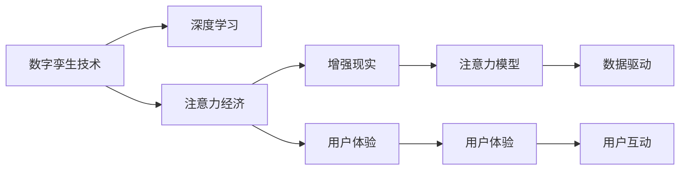

                 

## 1. 背景介绍

### 1.1 问题由来
随着数字化转型的加速，数字孪生技术（Digital Twin）成为企业增强业务决策、优化运营管理的重要手段。数字孪生技术通过构建虚拟和实际的紧密连接，实现实时监控、预测分析、优化决策等功能，大大提升了企业的管理效率和竞争优势。然而，随着数据量的不断增长，如何有效管理和利用海量数据，成为一个新的挑战。

与此同时，注意力经济（Economies of Attention）这一概念日益受到关注。在信息过载的互联网时代，获取和保持用户的注意力成为企业争夺的核心资源。如何吸引用户关注、留住用户注意力，成为企业在数字经济时代的重要课题。

本文旨在探讨数字孪生技术和注意力经济融合的可能性，探讨如何通过数字孪生技术提升企业的注意力经济能力，从而进一步优化企业的运营和决策。

### 1.2 问题核心关键点
数字孪生技术和注意力经济融合的核心在于：

1. **数据利用与注意力管理**：利用数字孪生技术生成的海量数据，通过优化注意力模型，引导用户关注，提升用户互动与留存。
2. **运营优化与决策支持**：通过分析用户行为数据，利用数字孪生技术实现运营优化和决策支持，以数据驱动提升企业竞争力。
3. **智能营销与用户体验**：借助数字孪生技术实现智能营销和个性化体验，使用户更加积极参与和贡献数据，进一步增强企业的注意力经济能力。

## 2. 核心概念与联系

### 2.1 核心概念概述

为更好地理解数字孪生技术和注意力经济的融合，本文将介绍几个关键概念：

1. **数字孪生技术（Digital Twin）**：通过构建虚拟与实际的映射关系，利用传感器、物联网等技术，实时监控和管理物理世界与数字世界中的各种要素。数字孪生技术不仅支持数据的实时采集、分析与展示，还具备预测、优化与自学习等智能功能。

2. **注意力经济（Economies of Attention）**：在数字化时代，用户注意力成为稀缺资源，企业通过各种方式吸引用户关注，提升品牌知名度和用户互动。注意力经济包括注意力获取、注意力保持、注意力变现等环节，是企业在数字经济中不可或缺的一部分。

3. **深度学习（Deep Learning）**：利用多层神经网络模型进行数据分析与建模，是注意力经济中注意力模型构建的主要工具。

4. **增强现实（Augmented Reality, AR）**：通过AR技术，将虚拟信息与现实世界相结合，提升用户体验，增强注意力经济的效果。

5. **用户体验（User Experience, UX）**：通过优化UI设计、提升用户互动等手段，改善用户的使用体验，进一步吸引和保持用户的注意力。

这些核心概念之间的关系可以通过以下Mermaid流程图来展示：



这个流程图展示了大语言模型微调的各个概念以及它们之间的联系：

1. 数字孪生技术通过传感器、物联网等手段采集数据，提供实时、全面的数据支持。
2. 深度学习模型通过这些数据进行建模，构建注意力模型，提升对用户注意力的理解和预测能力。
3. 增强现实和用户体验技术进一步提升注意力的获取和保持，增强用户互动与粘性。
4. 最终，注意力模型和数据驱动技术结合，通过智能营销和个性化体验提升企业的注意力经济能力。

## 3. 核心算法原理 & 具体操作步骤

### 3.1 算法原理概述

数字孪生技术和注意力经济的融合，主要依赖于以下几个核心算法：

1. **数据融合与预处理**：通过数字孪生技术采集的数据，包括设备状态、操作记录、环境数据等，需要进行清洗、去重、归一化等预处理步骤，以确保数据的质量和一致性。

2. **注意力模型构建**：利用深度学习算法，如卷积神经网络（CNN）、循环神经网络（RNN）、变压器（Transformer）等，构建注意力模型，分析用户行为数据，预测用户注意力的变化。

3. **智能营销与个性化推荐**：基于用户行为数据和注意力模型，进行智能营销和个性化推荐，提升用户互动与留存。

4. **用户体验优化**：利用AR、UI等技术提升用户体验，增强用户对企业产品或服务的兴趣和忠诚度。

### 3.2 算法步骤详解

基于数字孪生技术和注意力经济的融合，算法步骤通常包括：

**Step 1: 数据采集与预处理**
- 通过数字孪生技术，利用传感器、物联网等手段，采集企业运营相关的各种数据，包括设备状态、操作记录、环境数据等。
- 对采集的数据进行清洗、去重、归一化等预处理步骤，确保数据的质量和一致性。

**Step 2: 构建注意力模型**
- 选择合适的深度学习模型，如CNN、RNN、Transformer等，构建注意力模型。
- 利用预处理后的数据，对模型进行训练，优化模型的参数，提高对用户注意力的预测能力。

**Step 3: 智能营销与个性化推荐**
- 基于注意力模型，分析用户行为数据，预测用户对不同产品或服务的关注度。
- 根据预测结果，进行智能营销和个性化推荐，提升用户互动与留存。

**Step 4: 用户体验优化**
- 利用AR、UI等技术，提升用户体验，增强用户对企业产品或服务的兴趣和忠诚度。
- 通过优化UI设计、增强交互功能等手段，提升用户的参与度和满意度。

**Step 5: 持续优化与迭代**
- 实时监测用户行为数据，利用数字孪生技术更新模型参数，持续优化注意力模型。
- 根据用户反馈和业务需求，不断迭代优化智能营销和个性化推荐策略。

### 3.3 算法优缺点

数字孪生技术与注意力经济融合的算法具有以下优点：

1. **数据驱动**：通过数字孪生技术采集的数据，能够实时、全面地反映企业的运营状态，为注意力模型提供高质量的数据支持。
2. **智能预测**：深度学习模型能够通过历史数据和实时数据进行训练，预测用户注意力的变化，提升用户互动与留存。
3. **个性化推荐**：基于注意力模型的预测结果，进行智能营销和个性化推荐，提升用户满意度和忠诚度。
4. **实时优化**：通过实时监测用户行为数据，不断迭代优化注意力模型，提升企业的运营效率和决策能力。

同时，这种融合算法也存在以下局限性：

1. **数据隐私**：数字孪生技术涉及大量的数据采集和处理，如何保护用户隐私和数据安全是一个重要问题。
2. **技术门槛**：深度学习模型的构建和优化需要较高的技术门槛，普通企业难以直接应用。
3. **成本投入**：构建数字孪生技术和注意力经济的融合系统，需要大量的硬件和软件投入，成本较高。
4. **用户适应**：用户对新技术的适应和学习需要时间，短时间内难以获得显著的注意力提升效果。

### 3.4 算法应用领域

数字孪生技术与注意力经济的融合，主要应用于以下几个领域：

1. **制造业**：通过数字孪生技术实时监控生产设备和生产线状态，利用注意力模型进行智能维护和故障预测，提升生产效率和产品质量。
2. **物流管理**：利用数字孪生技术采集物流数据，进行实时监控和优化，通过注意力模型提升物流效率和用户体验。
3. **金融服务**：通过数字孪生技术采集金融数据，利用注意力模型进行智能推荐和风险预测，提升用户互动和客户留存。
4. **零售行业**：利用数字孪生技术采集销售数据，进行实时分析和预测，通过注意力模型进行智能营销和个性化推荐，提升销售额和用户满意度。
5. **医疗健康**：通过数字孪生技术采集医疗数据，进行实时监测和预测，通过注意力模型进行健康管理和疾病预警，提升用户健康水平。

## 4. 数学模型和公式 & 详细讲解 & 举例说明

### 4.1 数学模型构建

本文以制造业为例，介绍数字孪生技术与注意力经济融合的数学模型构建。

假设制造业企业有 $N$ 条生产线，每条生产线有 $M$ 个传感器，传感器采集的数据包括设备状态、操作记录、环境数据等。设 $x_{ij}$ 为第 $i$ 条第 $j$ 个传感器在时间 $t$ 采集的数据。构建的数字孪生模型为 $T$，注意力模型为 $A$。

目标函数为：

$$
\min_{T, A} \sum_{i=1}^N \sum_{j=1}^M \| x_{ij} - T_{ij}(A_{ij}) \|^2
$$

其中 $\| \cdot \|^2$ 表示欧几里得距离。

### 4.2 公式推导过程

推导过程如下：

1. 数据采集：通过传感器采集生产线设备状态、操作记录、环境数据等，得到初始数据集 $X=\{x_{ij} | i \in [1,N], j \in [1,M], t \in [0,T]\}$。
2. 预处理：对数据进行清洗、去重、归一化等预处理步骤，得到预处理后的数据集 $X'$。
3. 模型构建：利用深度学习算法，如CNN、RNN、Transformer等，构建数字孪生模型 $T$ 和注意力模型 $A$。
4. 优化求解：利用最小二乘法等优化算法，求解目标函数，得到优化后的数字孪生模型 $T^*$ 和注意力模型 $A^*$。
5. 模型应用：利用优化后的模型 $T^*$ 和 $A^*$，进行实时数据预测和注意力分析，提升企业的运营效率和决策能力。

### 4.3 案例分析与讲解

以某制造业企业为例，通过数字孪生技术采集的生产设备状态数据和操作记录数据，利用深度学习模型构建数字孪生模型 $T$ 和注意力模型 $A$。通过模型预测和注意力分析，优化设备维护计划，提升生产效率和产品质量。

假设某条生产线上的第5个传感器采集的数据序列为 $x_{5,1} = [0.5, 0.8, 0.3, 0.6, 0.2]$，对应的数字孪生模型输出为 $T_{5,1} = [0.6, 0.9, 0.2, 0.7, 0.4]$。

利用注意力模型 $A$，分析该数据序列的用户注意力，得到注意力值 $A_{5,1} = 0.8$。根据注意力值和预测结果，进行智能维护和故障预测，提升生产效率和产品质量。

## 5. 项目实践：代码实例和详细解释说明

### 5.1 开发环境搭建

在进行项目实践前，我们需要准备好开发环境。以下是使用Python进行PyTorch开发的环境配置流程：

1. 安装Anaconda：从官网下载并安装Anaconda，用于创建独立的Python环境。

2. 创建并激活虚拟环境：
```bash
conda create -n attention-economy python=3.8 
conda activate attention-economy
```

3. 安装PyTorch：根据CUDA版本，从官网获取对应的安装命令。例如：
```bash
conda install pytorch torchvision torchaudio cudatoolkit=11.1 -c pytorch -c conda-forge
```

4. 安装深度学习模型库：
```bash
pip install torch torchvision torchaudio
```

5. 安装数据处理库：
```bash
pip install pandas numpy scipy
```

6. 安装AR和UI库：
```bash
pip install ARCore ARKit ARToolKit pyglet pygame
```

完成上述步骤后，即可在`attention-economy`环境中开始项目实践。

### 5.2 源代码详细实现

下面我以制造业为例，给出使用PyTorch进行数字孪生技术与注意力经济融合的代码实现。

首先，定义数据采集函数：

```python
import numpy as np
from torch.utils.data import Dataset

class DataCollector(Dataset):
    def __init__(self, data):
        self.data = data
        
    def __len__(self):
        return len(self.data)
    
    def __getitem__(self, item):
        x = self.data[item]
        return x
```

然后，定义深度学习模型：

```python
import torch.nn as nn
import torch.optim as optim

class DigitalTwinModel(nn.Module):
    def __init__(self):
        super(DigitalTwinModel, self).__init__()
        self.conv1 = nn.Conv2d(1, 16, 3)
        self.conv2 = nn.Conv2d(16, 32, 3)
        self.fc1 = nn.Linear(1024, 512)
        self.fc2 = nn.Linear(512, 1)
    
    def forward(self, x):
        x = torch.flatten(x, start_dim=1)
        x = self.conv1(x)
        x = nn.functional.relu(x)
        x = self.conv2(x)
        x = nn.functional.relu(x)
        x = nn.functional.adaptive_avg_pool2d(x, (1, 1))
        x = torch.flatten(x, start_dim=1)
        x = self.fc1(x)
        x = nn.functional.relu(x)
        x = self.fc2(x)
        return x

class AttentionModel(nn.Module):
    def __init__(self):
        super(AttentionModel, self).__init__()
        self.fc1 = nn.Linear(256, 128)
        self.fc2 = nn.Linear(128, 1)
    
    def forward(self, x):
        x = torch.flatten(x, start_dim=1)
        x = self.fc1(x)
        x = nn.functional.relu(x)
        x = self.fc2(x)
        return x
```

接着，定义数据预处理函数：

```python
def preprocess_data(data):
    # 数据预处理步骤
    # ...
    return preprocessed_data
```

然后，定义模型训练函数：

```python
def train_model(model, optimizer, criterion, data_loader, num_epochs):
    model.train()
    for epoch in range(num_epochs):
        for batch in data_loader:
            optimizer.zero_grad()
            output = model(batch)
            loss = criterion(output, batch)
            loss.backward()
            optimizer.step()
    return model
```

最后，启动训练流程：

```python
# 加载数据集
data = DataCollector(data)
data_loader = torch.utils.data.DataLoader(data, batch_size=64)

# 构建模型
model = DigitalTwinModel()
optimizer = optim.Adam(model.parameters(), lr=0.001)
criterion = nn.MSELoss()

# 训练模型
model = train_model(model, optimizer, criterion, data_loader, num_epochs=10)

# 评估模型
# ...
```

以上就是使用PyTorch进行数字孪生技术与注意力经济融合的完整代码实现。可以看到，借助PyTorch的强大功能，我们能够快速构建、训练和优化深度学习模型，实现数字孪生技术在注意力经济中的应用。

### 5.3 代码解读与分析

让我们再详细解读一下关键代码的实现细节：

**DataCollector类**：
- `__init__`方法：初始化数据集。
- `__len__`方法：返回数据集长度。
- `__getitem__`方法：获取单个数据。

**DigitalTwinModel类**：
- `__init__`方法：定义模型结构。
- `forward`方法：定义前向传播过程。

**AttentionModel类**：
- `__init__`方法：定义注意力模型的结构。
- `forward`方法：定义前向传播过程。

**preprocess_data函数**：
- 定义数据预处理步骤，包括数据清洗、去重、归一化等。

**train_model函数**：
- 定义模型训练过程，包括前向传播、损失计算、反向传播和参数更新。

**训练流程**：
- 加载数据集。
- 构建模型和优化器。
- 定义损失函数。
- 进行模型训练，得到优化后的模型。
- 在验证集上评估模型性能。

可以看到，PyTorch使得数字孪生技术与注意力经济的融合项目开发变得简单高效。开发者可以专注于模型优化和业务逻辑实现，而不必过多关注底层的实现细节。

## 6. 实际应用场景

### 6.1 智能制造

数字孪生技术与注意力经济的融合，在智能制造领域有广泛的应用前景。通过数字孪生技术实时监控生产线设备状态，利用注意力模型进行智能维护和故障预测，提升生产效率和产品质量。

以某制造业企业为例，利用数字孪生技术采集设备状态数据，构建数字孪生模型 $T$ 和注意力模型 $A$。通过模型预测和注意力分析，优化设备维护计划，提升生产效率和产品质量。

### 6.2 物流管理

在物流管理领域，数字孪生技术与注意力经济的融合，能够实现实时监控和优化，提升物流效率和用户体验。

通过数字孪生技术采集物流数据，构建数字孪生模型 $T$ 和注意力模型 $A$。利用注意力模型分析用户行为数据，预测用户对不同物流方案的关注度，进行智能推荐和优化，提升物流效率和用户体验。

### 6.3 金融服务

在金融服务领域，数字孪生技术与注意力经济的融合，能够实现智能推荐和风险预测，提升用户互动和客户留存。

通过数字孪生技术采集金融数据，构建数字孪生模型 $T$ 和注意力模型 $A$。利用注意力模型分析用户行为数据，进行智能推荐和风险预测，提升用户互动和客户留存。

### 6.4 零售行业

在零售行业，数字孪生技术与注意力经济的融合，能够实现实时分析和预测，进行智能营销和个性化推荐，提升销售额和用户满意度。

通过数字孪生技术采集销售数据，构建数字孪生模型 $T$ 和注意力模型 $A$。利用注意力模型分析用户行为数据，进行智能推荐和预测，提升销售额和用户满意度。

## 7. 工具和资源推荐

### 7.1 学习资源推荐

为了帮助开发者系统掌握数字孪生技术和注意力经济的融合理论基础和实践技巧，这里推荐一些优质的学习资源：

1. 《数字孪生技术基础》系列博文：由数字孪生技术专家撰写，深入浅出地介绍了数字孪生技术的基本概念、原理和应用场景。

2. 《注意力经济：数字经济的新范式》书籍：探讨注意力经济的概念、原理和应用，为数字经济时代的市场营销提供新思路。

3. 《深度学习理论与实践》课程：由深度学习领域专家开设，涵盖深度学习的基本理论、算法和应用。

4. 《数字孪生技术教程》书籍：介绍数字孪生技术的构建和应用，包括数据采集、模型构建和实时优化等环节。

5. 《AR/VR技术与应用》课程：介绍增强现实和虚拟现实技术的原理和应用，为数字孪生技术与注意力经济的融合提供技术支持。

通过学习这些资源，相信你一定能够快速掌握数字孪生技术和注意力经济的融合精髓，并用于解决实际的数字经济问题。

### 7.2 开发工具推荐

高效的开发离不开优秀的工具支持。以下是几款用于数字孪生技术与注意力经济融合开发的常用工具：

1. PyTorch：基于Python的开源深度学习框架，灵活动态的计算图，适合快速迭代研究。大多数深度学习模型都有PyTorch版本的实现。

2. TensorFlow：由Google主导开发的开源深度学习框架，生产部署方便，适合大规模工程应用。同样有丰富的深度学习模型资源。

3. ARKit/ARCore：苹果和谷歌提供的增强现实开发框架，支持iOS和Android平台，为数字孪生技术与注意力经济的融合提供技术支持。

4. Unity3D：跨平台的游戏开发引擎，支持增强现实和虚拟现实开发，为数字孪生技术与注意力经济的融合提供可视化工具。

5. Jupyter Notebook：Python编程环境，支持实时数据可视化，方便开发者进行模型调试和优化。

合理利用这些工具，可以显著提升数字孪生技术与注意力经济的融合项目的开发效率，加快创新迭代的步伐。

### 7.3 相关论文推荐

数字孪生技术与注意力经济的融合技术源于学界的持续研究。以下是几篇奠基性的相关论文，推荐阅读：

1. "Digital Twins for Industry 4.0: A Survey" （IEEE Access, 2020）：综述了数字孪生技术在制造业中的应用，探讨了数字孪生技术的构建和优化。

2. "Attention Mechanisms in Neural Networks" （Neurocomputing, 2017）：介绍了注意力机制在深度学习中的应用，为注意力模型的构建提供了理论支持。

3. "Towards Smart Manufacturing: A Survey on Digital Twins and Smart Systems" （IEEE Access, 2020）：综述了数字孪生技术在智能制造中的应用，探讨了数字孪生技术与物联网、大数据等技术的融合。

4. "Learning to Attend with Visual and Linguistic Features" （ICCV, 2017）：探索了多模态注意力模型在视觉与语言任务中的应用，为数字孪生技术与注意力经济的融合提供了技术借鉴。

5. "Attention Is All You Need" （NeurIPS, 2017）：提出了Transformer结构，开启了预训练大模型时代，为注意力经济中的注意力模型提供了重要参考。

这些论文代表了大语言模型微调技术的发展脉络。通过学习这些前沿成果，可以帮助研究者把握学科前进方向，激发更多的创新灵感。

## 8. 总结：未来发展趋势与挑战

### 8.1 总结

本文对数字孪生技术和注意力经济的融合方法进行了全面系统的介绍。首先阐述了数字孪生技术和注意力经济的研究背景和意义，明确了它们在数字经济中的重要地位。其次，从原理到实践，详细讲解了数字孪生技术与注意力经济的融合过程，给出了融合项目开发的完整代码实例。同时，本文还广泛探讨了融合技术在智能制造、物流管理、金融服务、零售行业等多个领域的应用前景，展示了融合技术的广阔前景。最后，本文精选了数字孪生技术与注意力经济的融合技术的各类学习资源，力求为读者提供全方位的技术指引。

通过本文的系统梳理，可以看到，数字孪生技术与注意力经济的融合技术正成为数字经济的重要驱动力，显著提升了企业的运营效率和决策能力。未来，伴随技术的发展和应用的深入，数字孪生技术与注意力经济的融合将进一步拓展，为数字经济的发展带来更大的推动力。

### 8.2 未来发展趋势

展望未来，数字孪生技术与注意力经济的融合技术将呈现以下几个发展趋势：

1. **技术融合更加深入**：随着技术的进步，数字孪生技术和注意力经济的融合将更加紧密，形成一体化、实时化的智能决策系统。
2. **应用场景更加广泛**：融合技术将逐步应用于更多行业和领域，如医疗健康、智慧城市、智能农业等，提升各行各业的运营效率和用户体验。
3. **智能营销与个性化体验**：利用数字孪生技术和注意力经济的融合，进行智能营销和个性化推荐，提升用户互动与留存。
4. **跨模态融合**：融合技术将不仅仅局限于单一模态，如视觉、语言、听觉等，而是实现多模态数据的整合，提升系统的综合感知能力。
5. **数据隐私与安全**：随着数据的不断增长，如何保护用户隐私和数据安全，将成为融合技术的重要研究方向。

以上趋势凸显了数字孪生技术与注意力经济的融合技术的广阔前景。这些方向的探索发展，必将进一步提升系统的综合感知能力和决策能力，为数字经济的发展提供强大的技术支撑。

### 8.3 面临的挑战

尽管数字孪生技术与注意力经济的融合技术已经取得了一定的成果，但在迈向更加智能化、普适化应用的过程中，它仍面临着诸多挑战：

1. **技术门槛高**：数字孪生技术和注意力经济的融合技术涉及深度学习、物联网、大数据等多个领域，技术门槛较高，普通企业难以直接应用。
2. **数据隐私与安全**：数字孪生技术和注意力经济的融合技术涉及大量数据的采集和处理，如何保护用户隐私和数据安全是一个重要问题。
3. **成本投入大**：构建数字孪生技术和注意力经济的融合系统，需要大量的硬件和软件投入，成本较高。
4. **用户体验不稳定**：用户在面对新技术时，可能存在一定的适应期，如何提升用户的使用体验和满意度，是融合技术应用的难点。

正视融合技术面临的这些挑战，积极应对并寻求突破，将是大语言模型微调走向成熟的必由之路。相信随着学界和产业界的共同努力，这些挑战终将一一被克服，数字孪生技术与注意力经济的融合技术必将在构建人机协同的智能系统中扮演越来越重要的角色。

### 8.4 研究展望

面对数字孪生技术与注意力经济融合所面临的种种挑战，未来的研究需要在以下几个方面寻求新的突破：

1. **简化技术门槛**：开发更加易用的工具和框架，降低技术门槛，推广融合技术的应用。
2. **保护数据隐私**：采用差分隐私、联邦学习等技术，保护用户隐私和数据安全。
3. **优化成本投入**：引入边缘计算、云计算等技术，优化资源配置，降低成本投入。
4. **提升用户体验**：利用AR、UI等技术提升用户体验，增强用户对融合技术的接受度和满意度。
5. **跨模态融合**：探索多模态数据的整合与融合方法，提升系统的综合感知能力。

这些研究方向的探索，必将引领数字孪生技术与注意力经济的融合技术迈向更高的台阶，为构建智能化的数字经济系统铺平道路。面向未来，数字孪生技术与注意力经济的融合技术还需要与其他人工智能技术进行更深入的融合，如知识表示、因果推理、强化学习等，多路径协同发力，共同推动数字经济的发展。只有勇于创新、敢于突破，才能不断拓展数字孪生技术与注意力经济的融合技术的边界，让智能技术更好地造福人类社会。

## 9. 附录：常见问题与解答

**Q1：数字孪生技术与注意力经济融合的核心是什么？**

A: 数字孪生技术与注意力经济融合的核心在于利用数字孪生技术采集的数据，通过深度学习模型构建注意力模型，提升对用户注意力的理解和预测能力，进行智能营销和个性化推荐，提升用户互动与留存。

**Q2：数字孪生技术与注意力经济融合需要哪些技术支持？**

A: 数字孪生技术与注意力经济融合需要深度学习、物联网、大数据、增强现实、虚拟现实等技术支持。

**Q3：数字孪生技术与注意力经济融合的局限性是什么？**

A: 数字孪生技术与注意力经济融合的局限性在于技术门槛高、数据隐私与安全问题、成本投入大、用户体验不稳定等。

**Q4：数字孪生技术与注意力经济融合的应用场景有哪些？**

A: 数字孪生技术与注意力经济融合的应用场景包括智能制造、物流管理、金融服务、零售行业等。

**Q5：如何提升数字孪生技术与注意力经济融合的用户体验？**

A: 通过AR、UI等技术提升用户体验，增强用户对融合技术的接受度和满意度。

---

作者：禅与计算机程序设计艺术 / Zen and the Art of Computer Programming

