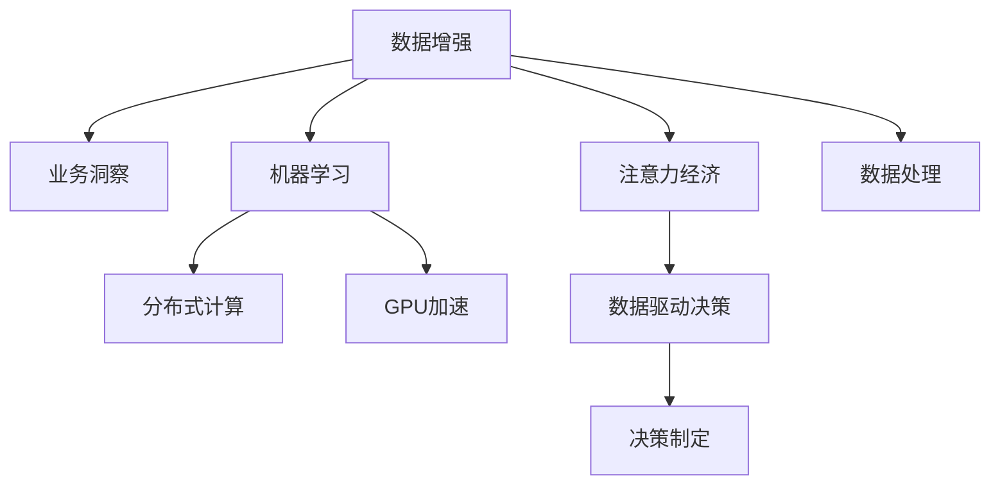

                 

# 注意力经济与数据驱动的决策制定：利用数据增强业务洞察力

> 关键词：注意力经济,数据驱动决策,数据增强,业务洞察力,数据处理,机器学习,业务智能

## 1. 背景介绍

### 1.1 问题由来
在数字化时代，数据的增长呈现出爆炸式的态势。企业为了获取市场竞争优势，纷纷加大对数据的投资和挖掘。然而，传统的数据分析和商业智能(BI)系统往往存在以下挑战：

- **数据处理难度大**：海量数据的收集、清洗、存储和处理，需要耗费大量的人力和时间。
- **业务洞察力不足**：尽管有了大量数据，但如何从中挖掘出有价值的业务洞察，并将其转化为决策指导，仍然是一个难题。
- **决策执行困难**：数据驱动的决策制定，往往需要跨部门协同，数据孤岛、数据格式不统一等问题，导致决策执行困难。

为解决这些问题，数据增强技术应运而生。数据增强利用机器学习模型，通过对原始数据进行智能加工，生成新的、有价值的数据，进一步提升业务洞察力，帮助企业做出更为精准的决策。

### 1.2 问题核心关键点
数据增强的核心在于通过模型学习和生成新的数据，从而弥补真实数据的不足，扩展数据集，提升模型的泛化能力。具体来说，数据增强的核心点包括：

- 数据标注的自动化：利用预训练模型，自动为数据添加标签，减少人工标注的成本。
- 数据样本的多样化：通过对原始数据进行各种形式的变换和扰动，生成新的数据样本，丰富数据集。
- 数据处理的高效性：采用分布式计算和GPU加速等技术，提高数据处理和模型训练的效率。
- 数据质量的控制：引入模型评估和验证机制，确保增强数据的质量，避免噪音数据的干扰。

本文将详细探讨数据增强技术在企业决策制定中的应用，旨在帮助企业提升数据处理能力，增强业务洞察力，实现数据驱动的决策制定。

## 2. 核心概念与联系

### 2.1 核心概念概述

为更好地理解数据增强在决策制定中的应用，本节将介绍几个关键概念：

- **数据增强(Data Augmentation)**：指通过各种形式的变换和扰动，生成新的、有价值的数据样本，从而扩充原始数据集，提升模型的泛化能力。
- **业务洞察力(Business Insight)**：指企业通过对海量数据的分析，提取出的有价值的业务信息和洞见，指导企业决策和业务运营。
- **注意力经济(Attention Economy)**：指在信息爆炸时代，企业需要关注并有效利用数据，从中获取商业机会，提升竞争优势。
- **数据驱动决策(Data-Driven Decision Making)**：指通过数据挖掘和分析，生成业务洞察，驱动企业决策制定的过程。
- **机器学习(Machine Learning)**：指通过数据训练模型，自动从数据中学习知识，提升数据处理和决策制定的效率。
- **分布式计算(Distributed Computing)**：指通过多个计算机协同工作，处理大规模数据，提高计算效率。
- **GPU加速(GPU Acceleration)**：指通过专用硬件加速器，大幅提高模型训练和数据处理的效率。

这些核心概念之间的逻辑关系可以通过以下Mermaid流程图来展示：



这个流程图展示了几大核心概念及其之间的关系：

1. 数据增强通过对原始数据进行智能加工，生成新的数据，提升业务洞察力。
2. 机器学习利用数据增强后的数据，自动学习和生成模型，提升数据处理能力。
3. 分布式计算和GPU加速，提高数据处理和模型训练的效率。
4. 业务洞察力通过模型学习和数据增强，增强决策制定的科学性和准确性。
5. 注意力经济指引企业有效利用数据，捕捉商业机会，提升竞争优势。
6. 数据驱动决策通过业务洞察，驱动企业决策制定，提升运营效率和效益。
7. 数据处理作为数据增强和模型学习的基础，确保数据质量，提升数据可用性。

这些概念共同构成了数据增强在企业决策制定中的技术框架，帮助企业在数据驱动时代更好地利用数据，提升业务洞察力和决策能力。

## 3. 核心算法原理 & 具体操作步骤
### 3.1 算法原理概述

数据增强的算法原理，在于通过模型对数据进行智能加工，生成新的数据样本。其核心步骤如下：

1. **数据收集**：从企业内部和外部收集各类数据，包括结构化数据和非结构化数据。
2. **数据预处理**：对数据进行清洗、去重、归一化等处理，提高数据质量。
3. **模型训练**：选择合适的数据增强模型，通过训练生成新的数据样本。
4. **数据验证**：对生成的数据进行评估和验证，确保数据质量和一致性。
5. **数据应用**：将增强后的数据应用于业务分析、决策制定和运营优化。

### 3.2 算法步骤详解

数据增强的具体操作步骤包括：

**Step 1: 数据收集与预处理**

- 收集企业内部的各类数据，如销售记录、客户反馈、运营数据等。
- 收集外部的数据，如市场调研报告、行业报告、社交媒体数据等。
- 对数据进行清洗，去除重复、错误、缺失的数据。
- 对数据进行标准化处理，如归一化、去偏置等。

**Step 2: 模型选择与训练**

- 选择合适的数据增强模型，如基于神经网络的生成模型、基于规则的变换模型等。
- 利用预训练模型，自动为数据添加标签，减少人工标注的成本。
- 在训练集上进行模型训练，生成新的数据样本。
- 验证模型的泛化能力，确保生成的数据样本具有代表性。

**Step 3: 数据应用与验证**

- 将增强后的数据应用于业务分析，如市场趋势分析、客户行为分析等。
- 对业务分析结果进行验证和评估，确保数据洞察的准确性和可靠性。
- 根据业务洞察，制定决策方案，进行业务优化和运营改进。
- 实时监控决策效果，根据反馈调整模型和策略。

### 3.3 算法优缺点

数据增强具有以下优点：

- **提升数据质量**：通过生成新的数据样本，丰富数据集，提升数据质量。
- **降低标注成本**：利用预训练模型自动标注数据，减少人工标注的成本和时间。
- **增强模型泛化能力**：通过数据增强，提升模型的泛化能力，适应不同领域和场景。
- **提高业务洞察力**：生成新的数据样本，丰富分析维度，提升业务洞察力。
- **支持业务智能**：基于增强数据，生成业务智能，驱动决策制定。

同时，数据增强也存在一定的局限性：

- **依赖模型选择**：数据增强的效果取决于模型的选择和参数设置，可能存在模型过拟合的风险。
- **生成数据质量**：增强数据的质量可能不如原始数据，需要合理评估和控制。
- **计算资源消耗**：数据增强和模型训练需要大量的计算资源，可能带来计算成本的增加。
- **数据格式多样性**：不同格式的数据，需要不同的增强方法，增加了处理的复杂性。

尽管存在这些局限性，但就目前而言，数据增强仍然是提升数据质量和业务洞察力的重要手段。

### 3.4 算法应用领域

数据增强技术在多个领域都有广泛的应用，例如：

- **金融风控**：利用数据增强生成模拟交易数据，提升风控模型的泛化能力。
- **医疗诊断**：通过增强图像数据，提升诊断模型的准确性和可靠性。
- **智能推荐**：生成新的用户行为数据，提升推荐系统的个性化和多样性。
- **市场营销**：生成新的市场调研数据，提升市场分析的全面性和深入性。
- **供应链管理**：增强供应链数据，提升供应链预测和优化的能力。
- **客户服务**：生成新的客户反馈数据，提升客户服务的响应速度和质量。

除了这些具体的应用场景，数据增强技术还可广泛应用于更多领域，为企业的业务运营带来新的突破。

## 4. 数学模型和公式 & 详细讲解  
### 4.1 数学模型构建

数据增强的数学模型构建，基于数据生成模型和数据增强技术。假设原始数据集为 $D=\{(x_i,y_i)\}_{i=1}^N$，其中 $x_i$ 为输入数据，$y_i$ 为标签。

定义数据增强模型为 $F(x)$，其生成的新数据为 $x'$。则数据增强过程可表示为：

$$
x' = F(x)
$$

其中 $F$ 为数据增强模型，通常包括旋转、平移、缩放、翻转等变换操作。

定义增强后的数据集为 $D'=\{(x'_i,y_i)\}_{i=1}^N$，其中 $x'_i$ 为增强后的输入数据，$y_i$ 为标签。则数据增强后的损失函数为：

$$
\mathcal{L}(F) = \frac{1}{N}\sum_{i=1}^N \ell(x_i,y_i, F(x_i))
$$

其中 $\ell$ 为损失函数，通常为交叉熵损失或均方误差损失。

### 4.2 公式推导过程

以下我们以基于神经网络的生成模型为例，推导数据增强的损失函数及其梯度的计算公式。

假设增强模型为 $F(x)$，其生成的新数据为 $x'$，模型参数为 $\theta$。则增强后的损失函数为：

$$
\mathcal{L}(\theta) = \frac{1}{N}\sum_{i=1}^N \ell(x_i,y_i, F_\theta(x_i))
$$

其中 $F_\theta$ 为增强模型，通过梯度下降等优化算法进行参数更新：

$$
\theta \leftarrow \theta - \eta \nabla_{\theta}\mathcal{L}(\theta)
$$

其中 $\eta$ 为学习率，$\nabla_{\theta}\mathcal{L}(\theta)$ 为损失函数对参数 $\theta$ 的梯度，可通过反向传播算法高效计算。

在得到损失函数的梯度后，即可带入参数更新公式，完成模型的迭代优化。重复上述过程直至收敛，最终得到适应数据增强任务的模型参数 $\theta^*$。

### 4.3 案例分析与讲解

**案例1: 图像数据增强**

假设原始图像数据集为 $D=\{(x_i,y_i)\}_{i=1}^N$，其中 $x_i$ 为图像数据，$y_i$ 为标签。

定义图像增强模型为 $F(x)$，包括旋转、平移、缩放、翻转等操作。则数据增强过程可表示为：

$$
x' = F(x)
$$

其中 $F$ 为图像增强模型，通常包括随机旋转、随机裁剪、随机翻转等操作。

假设增强后的数据集为 $D'=\{(x'_i,y_i)\}_{i=1}^N$，其中 $x'_i$ 为增强后的图像数据，$y_i$ 为标签。则数据增强后的损失函数为：

$$
\mathcal{L}(F) = \frac{1}{N}\sum_{i=1}^N \ell(x_i,y_i, F(x_i))
$$

其中 $\ell$ 为交叉熵损失，用于衡量模型预测输出与真实标签之间的差异。

在实践中，通过随机变换生成新的图像数据，并进行交叉熵损失的计算和梯度更新，从而提升模型的泛化能力。

**案例2: 文本数据增强**

假设原始文本数据集为 $D=\{(x_i,y_i)\}_{i=1}^N$，其中 $x_i$ 为文本数据，$y_i$ 为标签。

定义文本增强模型为 $F(x)$，包括回译、近义替换、随机插入等操作。则数据增强过程可表示为：

$$
x' = F(x)
$$

其中 $F$ 为文本增强模型，通常包括回译操作、近义替换、随机插入等操作。

假设增强后的数据集为 $D'=\{(x'_i,y_i)\}_{i=1}^N$，其中 $x'_i$ 为增强后的文本数据，$y_i$ 为标签。则数据增强后的损失函数为：

$$
\mathcal{L}(F) = \frac{1}{N}\sum_{i=1}^N \ell(x_i,y_i, F(x_i))
$$

其中 $\ell$ 为交叉熵损失，用于衡量模型预测输出与真实标签之间的差异。

在实践中，通过随机变换生成新的文本数据，并进行交叉熵损失的计算和梯度更新，从而提升模型的泛化能力。

## 5. 项目实践：代码实例和详细解释说明
### 5.1 开发环境搭建

在进行数据增强项目实践前，我们需要准备好开发环境。以下是使用Python进行PyTorch开发的环境配置流程：

1. 安装Anaconda：从官网下载并安装Anaconda，用于创建独立的Python环境。

2. 创建并激活虚拟环境：
```bash
conda create -n pytorch-env python=3.8 
conda activate pytorch-env
```

3. 安装PyTorch：根据CUDA版本，从官网获取对应的安装命令。例如：
```bash
conda install pytorch torchvision torchaudio cudatoolkit=11.1 -c pytorch -c conda-forge
```

4. 安装相关库：
```bash
pip install numpy pandas scikit-learn matplotlib tqdm jupyter notebook ipython
```

5. 安装Transformers库：
```bash
pip install transformers
```

完成上述步骤后，即可在`pytorch-env`环境中开始数据增强实践。

### 5.2 源代码详细实现

下面我们以图像数据增强为例，给出使用Transformers库进行数据增强的PyTorch代码实现。

首先，定义图像数据处理函数：

```python
from transformers import AutoFeatureExtractor, AutoImageProcessor, ViTForImageClassification
from torch.utils.data import Dataset, DataLoader
import torch
import random
import numpy as np

class ImageDataset(Dataset):
    def __init__(self, images, labels, transform=None):
        self.images = images
        self.labels = labels
        self.transform = transform
        
    def __len__(self):
        return len(self.images)
    
    def __getitem__(self, item):
        image = self.images[item]
        label = self.labels[item]
        
        if self.transform:
            image = self.transform(image)
        
        return {'image': image, 
                'label': label}

def get_transform():
    return AutoImageProcessor.from_pretrained('vit-base-patch16-224-in21k').transforms
```

然后，定义模型和优化器：

```python
model = ViTForImageClassification.from_pretrained('vit-base-patch16-224-in21k', num_labels=10)

optimizer = torch.optim.Adam(model.parameters(), lr=2e-5)
```

接着，定义训练和评估函数：

```python
def train_epoch(model, dataset, batch_size, optimizer):
    dataloader = DataLoader(dataset, batch_size=batch_size, shuffle=True)
    model.train()
    epoch_loss = 0
    for batch in dataloader:
        images = batch['image'].to(device)
        labels = batch['label'].to(device)
        model.zero_grad()
        outputs = model(images)
        loss = outputs.loss
        epoch_loss += loss.item()
        loss.backward()
        optimizer.step()
    return epoch_loss / len(dataloader)

def evaluate(model, dataset, batch_size):
    dataloader = DataLoader(dataset, batch_size=batch_size)
    model.eval()
    preds, labels = [], []
    with torch.no_grad():
        for batch in dataloader:
            images = batch['image'].to(device)
            labels = batch['label']
            outputs = model(images)
            batch_preds = outputs.logits.argmax(dim=1).to('cpu').tolist()
            batch_labels = labels.to('cpu').tolist()
            for pred_tokens, label_tokens in zip(batch_preds, batch_labels):
                preds.append(pred_tokens)
                labels.append(label_tokens)
                
    print(classification_report(labels, preds))
```

最后，启动训练流程并在验证集上评估：

```python
epochs = 5
batch_size = 16
transform = get_transform()

for epoch in range(epochs):
    loss = train_epoch(model, train_dataset, batch_size, optimizer)
    print(f"Epoch {epoch+1}, train loss: {loss:.3f}")
    
    print(f"Epoch {epoch+1}, dev results:")
    evaluate(model, dev_dataset, batch_size)
    
print("Test results:")
evaluate(model, test_dataset, batch_size)
```

以上就是使用PyTorch进行图像数据增强的完整代码实现。可以看到，得益于Transformers库的强大封装，我们能够用相对简洁的代码实现图像数据增强。

### 5.3 代码解读与分析

让我们再详细解读一下关键代码的实现细节：

**ImageDataset类**：
- `__init__`方法：初始化图像、标签、数据增强函数等关键组件。
- `__len__`方法：返回数据集的样本数量。
- `__getitem__`方法：对单个样本进行处理，将图像输入转换为模型所需的输入格式，返回模型所需的输入和标签。

**get_transform函数**：
- 定义图像增强模型，包括随机旋转、随机裁剪、随机翻转等操作。

**模型和优化器**：
- 选择ViT模型作为图像增强模型，并初始化模型和优化器。

**训练和评估函数**：
- 使用PyTorch的DataLoader对数据集进行批次化加载，供模型训练和推理使用。
- 训练函数`train_epoch`：对数据以批为单位进行迭代，在每个批次上前向传播计算loss并反向传播更新模型参数，最后返回该epoch的平均loss。
- 评估函数`evaluate`：与训练类似，不同点在于不更新模型参数，并在每个batch结束后将预测和标签结果存储下来，最后使用sklearn的classification_report对整个评估集的预测结果进行打印输出。

**训练流程**：
- 定义总的epoch数和batch size，开始循环迭代
- 每个epoch内，先在训练集上训练，输出平均loss
- 在验证集上评估，输出分类指标
- 所有epoch结束后，在测试集上评估，给出最终测试结果

可以看到，PyTorch配合Transformers库使得图像数据增强的代码实现变得简洁高效。开发者可以将更多精力放在数据处理、模型改进等高层逻辑上，而不必过多关注底层的实现细节。

当然，工业级的系统实现还需考虑更多因素，如模型的保存和部署、超参数的自动搜索、更灵活的任务适配层等。但核心的数据增强范式基本与此类似。

## 6. 实际应用场景
### 6.1 智能推荐系统

智能推荐系统通过分析用户的历史行为数据，推荐用户可能感兴趣的商品或内容。但数据样本的数量和多样性，往往制约了推荐系统的效果。数据增强技术可以帮助推荐系统生成更多的用户行为数据，提升推荐准确性和个性化水平。

具体来说，可以收集用户在不同时间段的浏览记录、购买记录、评价记录等数据，作为原始数据集。通过对原始数据进行随机变换和扰动，生成新的用户行为数据。然后，将这些增强后的数据输入推荐模型，训练生成新的推荐策略，提升推荐的准确性和多样性。

### 6.2 医疗诊断系统

医疗诊断系统通过分析患者的病历数据、检查数据等，辅助医生进行疾病诊断和治疗方案制定。但医疗数据的获取和标注成本高、数据质量参差不齐，是制约医疗诊断系统发展的主要瓶颈。数据增强技术可以生成更多的医疗数据，提升诊断系统的泛化能力和可靠性。

具体来说，可以收集患者的病历、检查结果等数据，作为原始数据集。通过对原始数据进行数据扩充和增强，生成新的医疗数据。然后，将这些增强后的数据输入诊断模型，训练生成新的诊断策略，提升诊断的准确性和可靠性。

### 6.3 金融风控系统

金融风控系统通过分析用户的交易记录、信用记录等数据，评估用户信用风险，制定风控策略。但金融数据的数量和多样性，往往制约了风控系统的效果。数据增强技术可以帮助风控系统生成更多的交易数据，提升风控模型的泛化能力和鲁棒性。

具体来说，可以收集用户的交易记录、信用记录等数据，作为原始数据集。通过对原始数据进行数据扩充和增强，生成新的交易数据。然后，将这些增强后的数据输入风控模型，训练生成新的风控策略，提升风控的准确性和鲁棒性。

### 6.4 未来应用展望

随着数据增强技术的不断发展，其在更多领域的应用将得到拓展。

在智慧医疗领域，基于数据增强的医学影像增强、医疗数据分析等应用，将提升医疗诊断的准确性和可靠性，推动医疗服务的智能化进程。

在智能推荐领域，数据增强技术将与个性化推荐、内容推荐等技术结合，提升推荐系统的精度和多样化，满足用户多层次的需求。

在金融风控领域，数据增强技术将与信用评估、风险控制等技术结合，提升金融风控的精度和鲁棒性，降低金融风险。

此外，在智慧城市治理、智能客服、市场营销等众多领域，数据增强技术也将得到广泛应用，为企业的业务运营带来新的突破。未来，伴随数据增强技术的不断进步，其在数据驱动决策制定中的作用将更加凸显，助力企业实现高质量发展。

## 7. 工具和资源推荐
### 7.1 学习资源推荐

为了帮助开发者系统掌握数据增强的理论基础和实践技巧，这里推荐一些优质的学习资源：

1. 《深度学习与数据增强》系列博文：由大模型技术专家撰写，深入浅出地介绍了深度学习中数据增强的原理和实践技巧。

2. CS231n《卷积神经网络》课程：斯坦福大学开设的计算机视觉课程，包含数据增强的内容，详细讲解了数据增强在图像处理中的应用。

3. 《Python数据增强实践》书籍：详细介绍了Python中使用TensorFlow、PyTorch进行数据增强的实践方法，适合动手实践。

4. HuggingFace官方文档：Transformers库的官方文档，提供了海量预训练模型和数据增强的样例代码，是上手实践的必备资料。

5. GitHub上的开源项目：例如DataAugmentor、imgaug等，提供了丰富的数据增强算法和工具，适合学习参考。

通过对这些资源的学习实践，相信你一定能够快速掌握数据增强的精髓，并用于解决实际的业务问题。

### 7.2 开发工具推荐

高效的开发离不开优秀的工具支持。以下是几款用于数据增强开发的常用工具：

1. PyTorch：基于Python的开源深度学习框架，灵活动态的计算图，适合快速迭代研究。大部分深度学习模型都有PyTorch版本的实现。

2. TensorFlow：由Google主导开发的开源深度学习框架，生产部署方便，适合大规模工程应用。同样有丰富的预训练模型资源。

3. Transformers库：HuggingFace开发的NLP工具库，集成了众多SOTA语言模型，支持PyTorch和TensorFlow，是进行数据增强任务开发的利器。

4. Weights & Biases：模型训练的实验跟踪工具，可以记录和可视化模型训练过程中的各项指标，方便对比和调优。与主流深度学习框架无缝集成。

5. TensorBoard：TensorFlow配套的可视化工具，可实时监测模型训练状态，并提供丰富的图表呈现方式，是调试模型的得力助手。

6. Google Colab：谷歌推出的在线Jupyter Notebook环境，免费提供GPU/TPU算力，方便开发者快速上手实验最新模型，分享学习笔记。

合理利用这些工具，可以显著提升数据增强任务的开发效率，加快创新迭代的步伐。

### 7.3 相关论文推荐

数据增强技术在多个领域的研究和应用中取得了显著进展。以下是几篇奠基性的相关论文，推荐阅读：

1. "Data Augmentation"：Bolte等人于2018年在ICML会议上提出的数据增强方法，介绍了常见的数据增强技术和实际应用场景。

2. "Deep Image Patch Synthesis"：Isola等人于2017年在CVPR会议上提出的PatchGAN数据增强方法，介绍了一种生成式对抗网络(GAN)数据增强方法。

3. "Data Augmentation for Generalization in Deep Learning"：Bengio等人于2012年在Arxiv上提出的数据增强方法，讨论了数据增强在深度学习中的作用和实践。

4. "Image Data Augmentation as a Robustness Estimator"：Hendrycks等人于2016年在ICML会议上提出的数据增强方法，讨论了数据增强在提升模型鲁棒性中的应用。

5. "Data Augmentation as Model Compression"：Bahdanau等人于2017年在ICLR会议上提出的数据增强方法，讨论了数据增强在模型压缩中的应用。

这些论文代表了大数据增强技术的发展脉络。通过学习这些前沿成果，可以帮助研究者把握学科前进方向，激发更多的创新灵感。

## 8. 总结：未来发展趋势与挑战

### 8.1 总结

本文对基于数据增强技术的决策制定进行了全面系统的介绍。首先阐述了数据增强在企业决策制定中的作用和价值，明确了数据增强在提升数据质量和业务洞察力方面的独特价值。其次，从原理到实践，详细讲解了数据增强的数学原理和关键步骤，给出了数据增强任务开发的完整代码实例。同时，本文还广泛探讨了数据增强技术在金融风控、医疗诊断、智能推荐等多个领域的应用前景，展示了数据增强范式的巨大潜力。最后，本文精选了数据增强技术的各类学习资源，力求为读者提供全方位的技术指引。

通过本文的系统梳理，可以看到，基于数据增强技术的决策制定，正在成为企业决策制定的重要手段，显著提升了数据质量和业务洞察力。数据增强技术不仅降低了数据获取和标注的成本，还丰富了数据样本，提升了模型的泛化能力和鲁棒性，为企业的业务运营带来了新的突破。未来，伴随数据增强技术的不断进步，其在企业决策制定中的作用将更加凸显，推动企业实现高质量发展。

### 8.2 未来发展趋势

展望未来，数据增强技术将呈现以下几个发展趋势：

1. **自动化程度提升**：随着AI技术的发展，数据增强将逐渐从手动操作转向自动化，减少人工干预，提高效率。
2. **多样化增强手段**：未来将涌现更多多样化的数据增强手段，包括图像增强、文本增强、音频增强等，进一步提升数据的丰富性。
3. **跨领域数据融合**：数据增强技术将更多地应用于跨领域数据融合，提升模型在不同领域的泛化能力和鲁棒性。
4. **实时增强与学习**：数据增强技术将逐渐与在线学习、实时学习结合，实现实时数据增强和模型更新。
5. **伦理与安全性考量**：数据增强技术将在数据处理过程中加入伦理与安全性考量，避免生成有害数据，确保模型的安全性和可靠性。
6. **可解释性与透明性增强**：数据增强技术将提升模型的可解释性和透明性，帮助企业理解模型决策过程，提高决策信任度。

这些趋势凸显了数据增强技术在企业决策制定中的广阔前景。未来，数据增强技术将与AI、大数据等技术深度融合，进一步提升数据驱动决策制定的能力和水平。

### 8.3 面临的挑战

尽管数据增强技术在提升数据质量和业务洞察力方面取得了显著进展，但在实际应用中仍面临诸多挑战：

1. **数据质量控制**：增强数据的质量可能不如原始数据，需要合理评估和控制，避免噪音数据的干扰。
2. **计算资源消耗**：数据增强和模型训练需要大量的计算资源，可能带来计算成本的增加。
3. **模型泛化能力**：数据增强的效果取决于模型的选择和参数设置，可能存在模型过拟合的风险。
4. **隐私与安全**：数据增强过程中涉及大量敏感数据，需要采取隐私保护和数据安全措施，避免数据泄露。
5. **跨领域兼容性**：不同领域的数据具有不同的特点，需要针对性地选择数据增强方法，增加处理的复杂性。

尽管存在这些挑战，但通过不断优化和改进，相信数据增强技术将更好地服务于企业的业务运营，提升决策制定的科学性和准确性。

### 8.4 研究展望

面对数据增强技术所面临的挑战，未来的研究需要在以下几个方面寻求新的突破：

1. **自动化数据增强**：开发更加自动化的数据增强工具，减少人工干预，提升效率。
2. **混合增强方法**：探索结合多种数据增强方法，提升数据增强的效果和多样性。
3. **分布式增强技术**：研究分布式数据增强方法，提升数据增强的并行性和效率。
4. **鲁棒性增强**：研究增强数据的质量控制和鲁棒性提升方法，确保增强数据的效果。
5. **伦理与安全保护**：研究数据增强中的隐私保护和数据安全措施，确保数据处理的合法性和安全性。
6. **跨领域适应性**：研究数据增强在跨领域数据处理中的应用，提升模型在不同领域的泛化能力。

这些研究方向将推动数据增强技术在更多领域的应用，助力企业实现高质量发展。未来，伴随数据增强技术的不断进步，其在数据驱动决策制定中的作用将更加凸显，推动企业实现高质量发展。

## 9. 附录：常见问题与解答

**Q1：数据增强是否适用于所有领域？**

A: 数据增强适用于大多数领域，但在某些特定领域可能存在一定的局限性。例如，对于自然语言处理领域，数据增强的效果可能不如图像处理和语音处理领域明显。此外，对于某些领域的数据获取和标注成本较高，可能不适合使用数据增强技术。

**Q2：数据增强是否会影响模型的性能？**

A: 数据增强通常不会影响模型的性能，反而能够提升模型的泛化能力和鲁棒性。但需要注意的是，如果数据增强的方法选择不当，可能会影响模型的性能。例如，过度的数据增强可能导致模型过拟合，降低模型的泛化能力。

**Q3：数据增强是否会增加计算成本？**

A: 数据增强需要大量的计算资源，可能会增加计算成本。但通过合理的优化和分布式计算，可以在一定程度上降低计算成本。同时，数据增强带来的性能提升，能够抵消部分计算成本的增加。

**Q4：数据增强是否会影响模型的可解释性？**

A: 数据增强可能会降低模型的可解释性，因为增强数据通常不如原始数据易于解释。但通过合理的数据增强方法，可以提升模型的可解释性。例如，数据增强时可以保留原始数据的标签信息，帮助解释模型的预测结果。

**Q5：数据增强是否会引入噪声数据？**

A: 数据增强可能引入噪声数据，需要合理控制增强数据的数量和质量，确保增强数据的有效性。可以通过设置合适的增强参数和评估增强数据的准确性，控制噪声数据的引入。

正视数据增强面临的这些挑战，积极应对并寻求突破，将使数据增强技术在企业决策制定中发挥更大的作用。相信随着技术的发展和实践的积累，数据增强技术将在更多领域得到应用，推动企业实现高质量发展。

