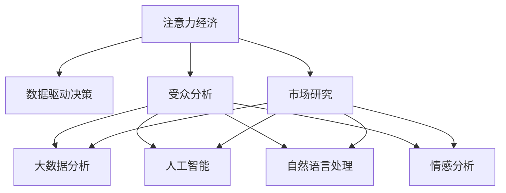

                 

# 注意力经济与数据驱动的决策：如何利用数据理解受众和市场

> 关键词：注意力经济,数据驱动决策,受众分析,市场研究,大数据分析,人工智能,机器学习,自然语言处理,情感分析,行为分析

## 1. 背景介绍

### 1.1 问题由来
在互联网时代，信息过载成为普遍现象。面对海量的信息，企业和消费者都面临信息选择和决策的难题。如何从海量的数据中获取有价值的洞察，成为众多企业和研究者的共同关注点。

注意力经济（Economy of Attention）是一个以用户注意力为稀缺资源的经济模型，强调了在信息爆炸的环境下，如何通过有效的内容吸引用户注意，提升品牌和商业价值。数据驱动的决策（Data-Driven Decision Making）则是利用数据分析工具和算法，从大量数据中提取有价值的规律和趋势，以支持更科学的决策过程。

本文将探讨如何利用数据理解和分析受众和市场，帮助企业和品牌做出更加精准和有效的决策，从而在竞争激烈的市场中脱颖而出。

## 2. 核心概念与联系

### 2.1 核心概念概述

本节将介绍几个与注意力经济和数据驱动决策密切相关的核心概念：

- **注意力经济**：一种以用户注意力为稀缺资源的经济模型。通过设计优质内容、优化用户体验等方式，吸引和保持用户的注意力，从而提升品牌价值和商业收益。
- **数据驱动决策**：利用数据分析工具和算法，从大量数据中提取有价值的规律和趋势，以支持更科学的决策过程。数据驱动决策是现代企业决策的重要手段。
- **受众分析**：通过收集和分析用户的行为数据、偏好数据等，理解目标受众的特征和需求，以指导内容生产和营销策略的制定。
- **市场研究**：通过分析市场趋势、竞争态势、消费者行为等，评估市场潜力和机会，制定市场策略和产品定位。
- **大数据分析**：指利用先进的数据处理和分析技术，从海量数据中提取有价值的信息和知识。大数据分析是数据驱动决策的基础。
- **人工智能**：包括机器学习、深度学习等技术，用于分析和挖掘数据中的规律，提升决策的科学性和准确性。
- **自然语言处理**：利用计算机技术处理和分析自然语言，包括文本分类、情感分析、实体识别等任务。
- **情感分析**：通过分析文本中的情感倾向，了解用户对产品或服务的情感反应。

这些核心概念之间的逻辑关系可以通过以下Mermaid流程图来展示：



这个流程图展示了一些核心概念及其之间的关系：

1. 注意力经济通过设计优质内容、优化用户体验等方式，吸引和保持用户的注意力，提升品牌价值和商业收益。
2. 数据驱动决策是利用数据分析工具和算法，从大量数据中提取有价值的规律和趋势，以支持更科学的决策过程。
3. 受众分析和市场研究都是数据驱动决策的重要环节，通过收集和分析用户行为数据和市场数据，理解受众需求和市场趋势。
4. 大数据分析和人工智能技术为受众分析和市场研究提供技术支持，提升分析效率和精度。
5. 自然语言处理和情感分析是数据分析中常用的技术手段，用于文本数据的处理和分析。

这些概念共同构成了注意力经济和数据驱动决策的理论基础，为理解和分析受众和市场提供了方法论支撑。

## 3. 核心算法原理 & 具体操作步骤

### 3.1 算法原理概述

数据驱动的决策过程通常包括以下几个关键步骤：

1. **数据收集**：从各种渠道收集用户行为数据、市场数据、社交媒体数据等。
2. **数据清洗和预处理**：清洗无效数据、处理缺失值、进行特征提取等。
3. **数据分析**：利用统计学方法、机器学习算法等，对数据进行分析和建模。
4. **模型评估**：使用交叉验证、A/B测试等方法，评估模型的效果和性能。
5. **决策支持**：将分析结果应用到实际决策中，如产品优化、营销策略制定、客户服务改进等。

注意力经济则强调在数据驱动决策的过程中，如何吸引和保持用户的注意力，提升决策的效果和用户的参与度。

### 3.2 算法步骤详解

以下是数据驱动的决策过程详细步骤：

**Step 1: 数据收集**

收集数据是数据驱动决策的第一步，数据来源包括：

- **用户行为数据**：如点击率、停留时间、购买记录等。
- **市场数据**：如行业趋势、竞争对手动态、市场份额等。
- **社交媒体数据**：如评论、点赞、分享等。
- **其他数据**：如问卷调查、客户反馈、传感器数据等。

**Step 2: 数据清洗和预处理**

数据清洗和预处理是确保数据质量的关键步骤，主要包括：

- **数据去重**：去除重复数据，确保数据的一致性。
- **数据补全**：处理缺失值，填补数据空缺。
- **数据转换**：将数据转换为适合分析的格式，如时间戳、文本向量化等。
- **特征提取**：从原始数据中提取有用的特征，如用户画像、行为轨迹等。

**Step 3: 数据分析**

数据分析是数据驱动决策的核心环节，主要包括以下步骤：

- **描述性分析**：对数据进行基本的统计描述，如均值、方差、分布等。
- **探索性分析**：使用可视化工具和技术，探索数据中的规律和趋势，如散点图、热力图、时间序列分析等。
- **预测性分析**：利用机器学习算法，建立预测模型，对未来趋势进行预测，如回归分析、时间序列预测等。
- **分类和聚类分析**：使用分类和聚类算法，对数据进行分类和分组，识别不同的用户群体和市场细分。

**Step 4: 模型评估**

模型评估是确保分析结果准确性的重要步骤，主要包括以下方法：

- **交叉验证**：将数据集分为训练集和验证集，使用训练集训练模型，在验证集上评估模型的效果。
- **A/B测试**：将用户随机分成两组，分别使用不同的策略或模型进行实验，比较两组的效果。
- **ROC曲线和AUC**：评估分类模型的性能，ROC曲线下的面积（AUC）越大，模型性能越好。

**Step 5: 决策支持**

决策支持是将分析结果应用到实际决策中的过程，主要包括：

- **产品优化**：根据用户行为和市场趋势，优化产品设计、功能和服务。
- **营销策略制定**：利用用户画像和市场分析结果，制定精准的营销策略，如内容推荐、广告投放等。
- **客户服务改进**：通过情感分析和行为分析，提升客户服务质量，改进客户体验。

### 3.3 算法优缺点

数据驱动的决策方法具有以下优点：

1. **基于实证数据**：决策过程基于数据而非直觉或经验，更具科学性和客观性。
2. **提高决策效率**：自动化数据分析和模型评估，大大提高决策效率。
3. **降低决策风险**：利用数据建模和预测，降低决策的不确定性和风险。
4. **支持动态调整**：数据驱动的决策可以实时调整和优化，适应变化的市场环境。

但该方法也存在以下局限性：

1. **数据质量和获取难度**：高质量、相关性强的数据获取难度较大，数据质量和完整性影响分析结果。
2. **模型复杂性和可解释性**：复杂模型可能过于复杂，难以解释其决策过程。
3. **算法选择和调参困难**：选择合适算法和优化参数是关键，但可能面临调参困难。
4. **依赖技术工具**：数据分析和建模需要依赖先进的技术工具和算法，对技术和资源要求较高。

### 3.4 算法应用领域

数据驱动的决策方法在多个领域得到了广泛应用，以下是几个典型案例：

**电子商务**：利用用户行为数据和市场趋势，优化商品推荐、价格策略和库存管理，提升销售和用户满意度。

**金融服务**：通过分析用户交易数据、市场动态和信用记录，制定精准的贷款策略、投资组合和风险管理方案。

**医疗健康**：利用患者医疗记录、基因数据和健康行为数据，提供个性化的医疗建议和治疗方案，提升医疗服务质量。

**媒体内容**：通过分析用户观看历史和行为数据，优化内容推荐、广告投放和内容创作，提升用户参与度和媒体价值。

**智能制造**：利用生产数据、设备运行数据和市场需求数据，优化生产计划、供应链管理和质量控制，提升生产效率和产品质量。

此外，数据驱动的决策方法还在智慧城市、智能交通、能源管理等多个领域发挥重要作用，推动各行各业的智能化和高效化发展。

## 4. 数学模型和公式 & 详细讲解 & 举例说明

### 4.1 数学模型构建

数据驱动的决策过程中，常用的数学模型包括回归模型、分类模型、聚类模型等。这里以回归模型为例，介绍其构建和应用。

设有一个时间序列数据集 $\{(t_i,y_i)\}_{i=1}^N$，其中 $t_i$ 为时间，$y_i$ 为对应的时间序列值。线性回归模型假设数据满足线性关系，可以表示为：

$$
y_i = \beta_0 + \beta_1 t_i + \epsilon_i
$$

其中 $\beta_0$ 为截距，$\beta_1$ 为斜率，$\epsilon_i$ 为误差项。

目标是最小化残差平方和，即：

$$
\min_{\beta_0,\beta_1} \sum_{i=1}^N (y_i - (\beta_0 + \beta_1 t_i))^2
$$

通过求解上述优化问题，可以得到最优的 $\beta_0$ 和 $\beta_1$。

### 4.2 公式推导过程

以下是线性回归模型的公式推导过程：

设数据集 $\{(t_i,y_i)\}_{i=1}^N$，假设数据满足线性关系，线性回归模型可以表示为：

$$
y_i = \beta_0 + \beta_1 t_i + \epsilon_i
$$

目标是最小化残差平方和，即：

$$
\min_{\beta_0,\beta_1} \sum_{i=1}^N (y_i - (\beta_0 + \beta_1 t_i))^2
$$

对 $\beta_0$ 和 $\beta_1$ 求偏导，得到：

$$
\frac{\partial}{\partial \beta_0} \sum_{i=1}^N (y_i - (\beta_0 + \beta_1 t_i))^2 = -2\sum_{i=1}^N (y_i - (\beta_0 + \beta_1 t_i))
$$

$$
\frac{\partial}{\partial \beta_1} \sum_{i=1}^N (y_i - (\beta_0 + \beta_1 t_i))^2 = -2\sum_{i=1}^N t_i(y_i - (\beta_0 + \beta_1 t_i))
$$

令上述两个偏导数等于零，得到：

$$
\beta_0 = \bar{y} - \beta_1 \bar{t}
$$

$$
\beta_1 = \frac{\sum_{i=1}^N t_i(y_i - \bar{y})}{\sum_{i=1}^N t_i^2}
$$

其中 $\bar{y} = \frac{1}{N}\sum_{i=1}^N y_i$，$\bar{t} = \frac{1}{N}\sum_{i=1}^N t_i$。

将 $\beta_0$ 和 $\beta_1$ 代入模型中，得到最终模型：

$$
y_i = \beta_0 + \beta_1 t_i + \epsilon_i
$$

通过上述推导，我们可以看到线性回归模型的构建和求解过程，以及参数估计的数学原理。

### 4.3 案例分析与讲解

以下以电子商务中的商品推荐系统为例，介绍如何使用线性回归模型进行数据分析和决策支持。

**数据来源**：用户行为数据，包括浏览记录、购买记录、评分数据等。

**数据预处理**：对数据进行清洗、去重、补全等预处理操作。

**数据分析**：利用线性回归模型，建立用户评分与浏览记录之间的关系模型，预测用户评分。

**模型评估**：使用交叉验证、A/B测试等方法，评估模型的效果和性能。

**决策支持**：根据模型预测结果，优化商品推荐策略，提升用户满意度和转化率。

## 5. 项目实践：代码实例和详细解释说明

### 5.1 开发环境搭建

在进行数据分析和决策支持项目开发前，需要准备好开发环境。以下是使用Python进行数据驱动决策开发的环境配置流程：

1. 安装Anaconda：从官网下载并安装Anaconda，用于创建独立的Python环境。

2. 创建并激活虚拟环境：
```bash
conda create -n data-decision python=3.8 
conda activate data-decision
```

3. 安装必要的Python包：
```bash
conda install pandas numpy scikit-learn matplotlib seaborn jupyter notebook ipython
```

4. 安装Python机器学习库：
```bash
conda install scikit-learn
```

5. 安装Python可视化库：
```bash
conda install matplotlib seaborn
```

6. 安装Python数据可视化库：
```bash
conda install plotly
```

完成上述步骤后，即可在`data-decision`环境中开始数据分析和决策支持项目开发。

### 5.2 源代码详细实现

以下是使用Python进行数据驱动决策项目的详细实现过程。

**数据读取与预处理**：
```python
import pandas as pd
import numpy as np

# 读取数据
data = pd.read_csv('data.csv')

# 数据清洗和预处理
data = data.drop_duplicates()
data = data.dropna()

# 特征提取
features = ['feature1', 'feature2', 'feature3']
data = data[features]
```

**数据可视化**：
```python
import matplotlib.pyplot as plt
import seaborn as sns

# 绘制散点图
sns.scatterplot(data=data, x='feature1', y='feature2')
plt.show()
```

**模型训练与评估**：
```python
from sklearn.linear_model import LinearRegression
from sklearn.model_selection import train_test_split
from sklearn.metrics import mean_squared_error, r2_score

# 划分数据集
X_train, X_test, y_train, y_test = train_test_split(data, target_variable, test_size=0.2, random_state=42)

# 训练模型
model = LinearRegression()
model.fit(X_train, y_train)

# 评估模型
y_pred = model.predict(X_test)
mse = mean_squared_error(y_test, y_pred)
r2 = r2_score(y_test, y_pred)
print('Mean Squared Error:', mse)
print('R-squared:', r2)
```

**决策支持**：
```python
# 使用模型进行预测
new_data = pd.DataFrame({'feature1': [1, 2, 3], 'feature2': [4, 5, 6]})
y_pred = model.predict(new_data)
print(y_pred)
```

以上是使用Python进行数据驱动决策项目的完整代码实现。可以看到，通过使用Pandas、Scikit-learn等库，可以快速完成数据读取、预处理、建模、评估和决策支持等任务。

### 5.3 代码解读与分析

让我们再详细解读一下关键代码的实现细节：

**数据读取与预处理**：
- 使用Pandas库读取数据，并进行数据清洗、去重、补全等预处理操作。
- 特征提取是从原始数据中提取有用的特征，以便后续分析和建模。

**数据可视化**：
- 使用Matplotlib和Seaborn库绘制散点图，可视化数据特征之间的关系。

**模型训练与评估**：
- 使用Scikit-learn库中的LinearRegression模型进行线性回归建模。
- 使用train_test_split函数将数据集划分为训练集和测试集。
- 使用mean_squared_error和r2_score函数评估模型的性能。

**决策支持**：
- 使用模型对新数据进行预测，生成决策支持结果。

通过上述代码，我们可以快速实现一个简单的数据驱动决策项目，掌握数据驱动决策的关键步骤和实现方法。

## 6. 实际应用场景

### 6.1 电子商务

在电子商务领域，数据驱动的决策方法广泛应用于商品推荐、营销策略、库存管理等环节。通过分析用户行为数据和市场趋势，可以优化推荐算法，提升用户满意度和转化率。例如，亚马逊利用推荐系统，根据用户的历史购买记录和浏览行为，推荐可能感兴趣的商品，显著提升了销售额。

### 6.2 金融服务

在金融服务领域，数据驱动的决策方法用于风险管理、投资组合优化、客户信用评估等环节。通过分析用户交易数据和市场动态，可以制定精准的贷款策略和投资方案，降低风险，提升收益。例如，花旗银行利用数据分析，预测客户信用风险，优化贷款审批流程，提高了贷款审批效率。

### 6.3 医疗健康

在医疗健康领域，数据驱动的决策方法用于疾病预测、治疗方案推荐、患者管理等环节。通过分析患者医疗记录和健康行为数据，可以提供个性化的医疗建议和治疗方案，提升医疗服务质量。例如，IBM Watson Health利用机器学习算法，分析患者数据，推荐个性化的治疗方案，显著提高了治疗效果。

### 6.4 媒体内容

在媒体内容领域，数据驱动的决策方法用于内容推荐、广告投放、内容创作等环节。通过分析用户观看历史和行为数据，可以优化内容推荐算法，提升用户参与度和媒体价值。例如，Netflix利用推荐系统，分析用户观看历史，推荐用户可能感兴趣的电影和电视剧，显著提升了用户留存率和满意度。

## 7. 工具和资源推荐

### 7.1 学习资源推荐

为了帮助开发者系统掌握数据驱动决策的理论基础和实践技巧，这里推荐一些优质的学习资源：

1. 《Python数据科学手册》：深入浅出地介绍了Python数据科学的基础知识，包括数据处理、统计分析、机器学习等。

2. 《机器学习实战》：以实际案例为导向，介绍了机器学习算法的实现和应用。

3. 《深度学习入门》：介绍了深度学习的基本原理和实现方法，适用于数据驱动决策领域的研究和应用。

4. 《Python数据可视化手册》：介绍了Python数据可视化的技术和工具，适用于数据驱动决策中的数据展示和分析。

5. Kaggle竞赛平台：提供大量数据集和算法竞赛，是数据驱动决策实践和学习的优秀平台。

通过对这些资源的学习实践，相信你一定能够快速掌握数据驱动决策的精髓，并用于解决实际的决策问题。

### 7.2 开发工具推荐

高效的开发离不开优秀的工具支持。以下是几款用于数据驱动决策开发的常用工具：

1. Python：Python语言以其简洁易用、功能强大而著称，是数据驱动决策领域的首选语言。

2. Jupyter Notebook：Jupyter Notebook是一种交互式的开发环境，支持代码、数据和文档的集成，适用于数据分析和模型训练。

3. Tableau：Tableau是一种流行的数据可视化工具，支持多种数据源和图表类型，适用于数据展示和分析。

4. SQL：SQL语言是数据库管理系统的标准语言，适用于数据存储和查询。

5. R语言：R语言是统计分析和数据科学的首选语言，适用于数据分析和模型评估。

6. Matplotlib：Matplotlib是Python的绘图库，适用于绘制各种类型的图表，包括散点图、线图、柱状图等。

7. Pandas：Pandas是Python的数据处理库，适用于数据清洗、转换和分析。

通过合理利用这些工具，可以显著提升数据驱动决策的开发效率，加快创新迭代的步伐。

### 7.3 相关论文推荐

数据驱动的决策方法已经成为一个快速发展的研究领域，以下是几篇奠基性的相关论文，推荐阅读：

1. "Predictive Analytics: The Next Revolution in Business Intelligence"（《预测分析：业务智能的下一场革命》）：提出数据驱动的预测分析方法，介绍了多种预测模型和应用案例。

2. "Big Data: Principles and Best Practices of Scalable Realtime Data Systems"（《大数据：可伸缩实时数据系统原理与最佳实践》）：介绍了大数据技术的基础和应用，适用于数据驱动决策领域的研究和实践。

3. "Data Mining: Concepts and Techniques"（《数据挖掘：概念与技术》）：系统介绍了数据挖掘的基本原理和算法，适用于数据驱动决策领域的研究和应用。

4. "Machine Learning: A Probabilistic Perspective"（《机器学习：概率视角》）：介绍了机器学习的基本原理和实现方法，适用于数据驱动决策领域的研究和应用。

5. "Deep Learning"（《深度学习》）：介绍了深度学习的基本原理和实现方法，适用于数据驱动决策领域的研究和应用。

这些论文代表了大数据和机器学习技术的发展脉络，通过学习这些前沿成果，可以帮助研究者把握学科前进方向，激发更多的创新灵感。

## 8. 总结：未来发展趋势与挑战

### 8.1 总结

本文对数据驱动的决策过程进行了全面系统的介绍。首先阐述了数据驱动决策的重要性和实际应用场景，明确了数据驱动决策在优化决策过程、提升决策科学性方面的独特价值。其次，从原理到实践，详细讲解了数据驱动决策的关键步骤和实现方法，给出了数据驱动决策项目开发的完整代码实例。同时，本文还广泛探讨了数据驱动决策在多个行业领域的应用前景，展示了数据驱动决策的广阔前景。

通过本文的系统梳理，可以看到，数据驱动的决策方法正在成为企业决策的重要手段，极大地提升了决策的科学性和准确性。数据驱动的决策方法不仅能够优化现有流程，还能够在数据量不断增长的背景下，为企业提供更加精准和及时的决策支持，推动各行各业的智能化和高效化发展。

### 8.2 未来发展趋势

展望未来，数据驱动的决策方法将呈现以下几个发展趋势：

1. **大数据与云计算的结合**：随着大数据和云计算技术的不断发展，数据驱动的决策方法将更加高效和可靠。利用云计算资源，可以实时处理海量数据，实现决策的实时化和智能化。

2. **人工智能与机器学习的深入应用**：随着人工智能和机器学习技术的不断进步，数据驱动的决策方法将更加智能和精准。通过深度学习算法，可以挖掘数据中的复杂关系和模式，提升决策的科学性和有效性。

3. **多源数据融合**：数据驱动的决策方法将更加注重多源数据的融合和协同。通过整合不同类型的数据，如结构化数据、非结构化数据、传感器数据等，可以提升决策的全面性和准确性。

4. **实时决策支持**：数据驱动的决策方法将更加注重实时性。通过实时数据采集和处理，可以实现实时决策支持，及时响应变化的市场环境和用户需求。

5. **自然语言处理和情感分析**：数据驱动的决策方法将更加注重自然语言处理和情感分析。通过分析文本数据和情感信息，可以深入了解用户需求和市场动态，提升决策的针对性和有效性。

6. **区块链与隐私保护**：数据驱动的决策方法将更加注重数据隐私和安全性。通过区块链技术，可以实现数据的去中心化和透明化，保护用户隐私，提升决策的公正性和可信度。

以上趋势凸显了数据驱动决策的广阔前景，这些方向的探索发展，必将进一步提升决策的科学性和有效性，推动各行各业的智能化和高效化发展。

### 8.3 面临的挑战

尽管数据驱动的决策方法已经取得了显著成效，但在迈向更加智能化、普适化应用的过程中，它仍面临着诸多挑战：

1. **数据质量与数据获取**：高质量、相关性强的数据获取难度较大，数据质量和完整性影响决策效果。如何高效获取和清洗数据，是数据驱动决策的重要挑战。

2. **模型复杂性与可解释性**：复杂模型可能过于复杂，难以解释其决策过程。如何在保证模型性能的同时，提升模型的可解释性和可理解性，是数据驱动决策的重要方向。

3. **算法选择与调参困难**：选择合适算法和优化参数是关键，但可能面临调参困难。如何自动化调参，提高算法选择的科学性，是数据驱动决策的重要研究方向。

4. **数据隐私与安全**：数据驱动决策需要大量数据的支持，如何保护用户隐私，确保数据安全，是数据驱动决策的重要挑战。

5. **计算资源限制**：数据驱动决策需要大量计算资源，如何优化计算效率，降低计算成本，是数据驱动决策的重要研究方向。

6. **跨领域融合**：数据驱动决策需要跨领域知识的整合和应用，如何有效整合不同领域的数据和知识，是数据驱动决策的重要方向。

7. **数据偏见与公平性**：数据驱动决策需要避免数据偏见，确保决策的公平性和公正性。如何识别和消除数据偏见，是数据驱动决策的重要研究方向。

正视数据驱动决策面临的这些挑战，积极应对并寻求突破，将是大数据驱动决策走向成熟的必由之路。相信随着学界和产业界的共同努力，这些挑战终将一一被克服，数据驱动的决策方法必将为各行各业带来更多的创新和发展机遇。

### 8.4 研究展望

面对数据驱动决策所面临的种种挑战，未来的研究需要在以下几个方面寻求新的突破：

1. **自动化数据处理与清洗**：开发自动化数据处理与清洗工具，提高数据处理的效率和质量。

2. **模型可解释性与可视化**：开发可解释性和可视化的决策模型，提高模型的透明度和可信度。

3. **自适应学习算法**：开发自适应学习算法，在数据量不断变化的环境中，自动调整模型参数，提高决策的动态性和鲁棒性。

4. **跨领域知识融合**：开发跨领域知识融合工具，整合不同领域的数据和知识，提高决策的全面性和准确性。

5. **分布式计算与实时处理**：开发分布式计算与实时处理工具，实现大规模数据的高效处理和实时决策支持。

6. **数据隐私与安全保护**：开发数据隐私与安全保护技术，保护用户隐私，确保数据安全。

这些研究方向的探索，必将引领数据驱动决策技术迈向更高的台阶，为各行各业提供更加精准、高效的决策支持。面向未来，数据驱动决策技术还需要与其他人工智能技术进行更深入的融合，如知识表示、因果推理、强化学习等，多路径协同发力，共同推动人工智能技术的发展。只有勇于创新、敢于突破，才能不断拓展数据驱动决策的边界，让数据驱动的决策方法更好地造福人类社会。

## 9. 附录：常见问题与解答

**Q1：数据驱动的决策方法是否适用于所有领域？**

A: 数据驱动的决策方法在大多数领域都能取得不错的效果，特别是对于数据量较大、数据结构明确的领域。但对于一些特定领域的决策，如医学、法律等，数据质量和数据量可能存在不足，需要结合领域知识和专家经验，进行数据补全和领域特定的建模。

**Q2：如何选择合适的数据驱动决策算法？**

A: 选择合适的数据驱动决策算法需要考虑多个因素，如数据类型、数据量、决策目标等。常见的算法包括回归分析、分类算法、聚类算法、关联规则挖掘等。可以根据具体问题选择合适的算法，并进行参数调优和模型评估，选择最优模型。

**Q3：如何评估数据驱动决策模型的效果？**

A: 评估数据驱动决策模型的效果需要考虑多个指标，如准确率、召回率、F1分数、AUC值等。可以使用交叉验证、A/B测试、ROC曲线等方法进行评估，选择最优模型。同时，需要注意评估指标的选择和应用场景，避免过度依赖单一指标。

**Q4：如何避免数据驱动决策中的偏见和公平性问题？**

A: 避免数据驱动决策中的偏见和公平性问题需要从多个方面入手，如数据采集和处理、模型设计和训练等。可以采用多种方法，如数据去偏、模型公平性约束、算法透明化等，提升决策的公平性和公正性。

**Q5：如何提高数据驱动决策模型的解释性和可理解性？**

A: 提高数据驱动决策模型的解释性和可理解性需要考虑模型复杂度和透明性。可以采用可解释性模型（如线性模型、决策树等），或者使用可视化工具（如LIME、SHAP等），解释模型的决策过程。同时，需要对模型进行解释性分析，识别模型的关键特征和决策路径，提升模型的透明度和可信度。

这些问题的解答为数据驱动决策方法的应用提供了指导和建议，帮助开发者和研究者更好地理解和应用数据驱动决策技术。

