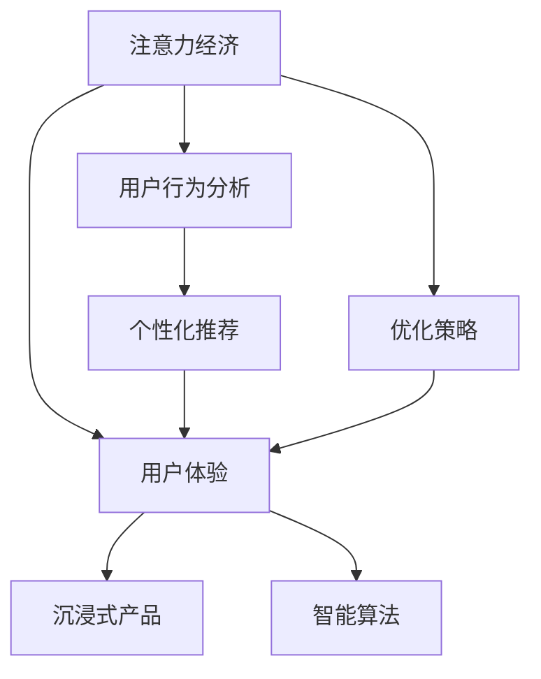

                 

# 注意力经济与用户体验优化策略与技术：创建令人沉浸的产品

> 关键词：注意力经济, 用户体验, 沉浸式产品, 用户行为分析, 个性化推荐, 智能算法, 优化策略

## 1. 背景介绍

### 1.1 问题由来
在信息爆炸的时代，用户注意力成为最稀缺的资源。如何将用户有限的注意力有效转化为商业价值，是当下许多企业面临的共同挑战。在此背景下，注意力经济（Attention Economy）应运而生，强调通过优化用户体验（User Experience, UX）和产品沉浸感，吸引并保持用户的注意力，从而创造更大的商业价值。

### 1.2 问题核心关键点
注意力经济与用户体验优化策略，关注如何利用智能算法和大数据分析，洞察用户行为，提供个性化推荐和服务，创造沉浸式的用户体验。通过这些策略和技术，企业能够更好地锁定用户，提升用户满意度和忠诚度，从而实现商业变现。

### 1.3 问题研究意义
研究注意力经济与用户体验优化策略，对于提高企业数字化运营效率、提升用户满意度和忠诚度、推动产品创新具有重要意义：

1. **提升运营效率**：通过精准的用户行为分析，优化产品设计和服务流程，降低运营成本，提高工作效率。
2. **增强用户粘性**：通过个性化推荐和沉浸式体验，满足用户需求，提高用户黏性，增加用户留存率。
3. **促进产品创新**：通过对用户反馈和行为数据的深入分析，洞察市场需求，指导产品创新和迭代。
4. **增强竞争优势**：通过差异化的用户体验和精准的用户画像，构建独特的品牌价值，提升市场竞争力。

## 2. 核心概念与联系

### 2.1 核心概念概述

为更好地理解注意力经济与用户体验优化策略，本节将介绍几个关键概念：

- **注意力经济（Attention Economy）**：指在信息过载时代，企业和用户之间争夺注意力资源的经济活动。通过优化用户体验，吸引和保持用户的注意力，从而实现商业价值的最大化。
- **用户体验（User Experience, UX）**：指用户与产品交互过程中的感受和体验，包括易用性、功能性、情感共鸣等方面。良好的用户体验能够提升用户满意度，促进产品传播和口碑。
- **沉浸式产品（Immersive Product）**：通过全感官刺激和交互设计，使产品能够深度吸引用户，创造忘我的沉浸体验，增强用户粘性。
- **用户行为分析（User Behavior Analysis）**：通过数据分析技术，洞察用户行为模式和偏好，为个性化推荐和产品优化提供依据。
- **个性化推荐（Personalized Recommendation）**：利用用户行为数据和算法模型，为用户推荐个性化的产品和服务，提升用户满意度。
- **智能算法（Smart Algorithm）**：指能够处理复杂数据、优化决策的算法技术，如机器学习、深度学习等。在用户体验和产品优化中，智能算法发挥着重要作用。

这些核心概念之间的关系，可以通过以下Mermaid流程图来展示：



这个流程图展示了注意力经济与用户体验优化策略的核心逻辑：

1. 注意力经济是基础，通过优化用户体验和创造沉浸式产品，吸引和保持用户注意力。
2. 用户行为分析洞察用户需求和行为模式，指导个性化推荐和服务优化。
3. 个性化推荐利用智能算法，为用户提供贴合其偏好的产品和服务，增强用户粘性。
4. 智能算法贯穿整个流程，为各个环节提供数据驱动的优化建议和技术支持。
5. 优化策略综合考虑各方面因素，为注意力经济和用户体验的优化提供系统化的指导。

## 3. 核心算法原理 & 具体操作步骤
### 3.1 算法原理概述

注意力经济与用户体验优化策略，涉及多个领域的算法和技术，包括用户行为分析、个性化推荐、智能算法等。这些算法共同构成了一个完整的优化框架，旨在通过数据分析和智能处理，提升用户满意度和产品竞争力。

以个性化推荐为例，其核心思想是通过用户行为数据和物品属性数据，构建用户-物品关联模型，预测用户对特定物品的兴趣程度，从而实现个性化推荐。具体而言，可以采用协同过滤、基于内容的推荐、矩阵分解等算法，构建推荐模型。

### 3.2 算法步骤详解

以下以个性化推荐算法为例，详细讲解其实现步骤：

**Step 1: 数据准备**
- 收集用户行为数据，如浏览记录、点击记录、购买记录等。
- 收集物品属性数据，如商品名称、价格、分类等。
- 对数据进行预处理，如去重、补全缺失值、标准化等。

**Step 2: 构建模型**
- 选择合适的推荐算法，如协同过滤、基于内容的推荐、矩阵分解等。
- 将用户行为数据和物品属性数据输入模型，训练得到用户-物品关联矩阵。
- 根据用户兴趣预测模型，为用户生成个性化推荐列表。

**Step 3: 优化模型**
- 使用A/B测试、离线评估等方法，评估推荐模型的效果。
- 根据评估结果调整模型参数，优化推荐算法。
- 持续收集用户反馈和行为数据，迭代更新模型。

**Step 4: 部署应用**
- 将训练好的推荐模型部署到实际应用系统中，如电商网站、视频平台等。
- 实时接收用户行为数据，动态更新推荐列表。
- 提供推荐结果给用户，并接收用户反馈。

### 3.3 算法优缺点

个性化推荐算法具有以下优点：
1. 提升用户体验：通过精准推荐，满足用户个性化需求，提升用户满意度。
2. 提高转化率：通过个性化推荐，提高用户购买和消费意愿，提升转化率。
3. 增加收益：精准推荐有助于提升产品曝光率和销售量，增加企业收益。

同时，该算法也存在一定的局限性：
1. 数据质量要求高：推荐模型的效果高度依赖数据质量和完整性，数据噪声会影响推荐结果。
2. 推荐冷启动问题：新用户和物品缺乏足够的历史数据，难以进行精准推荐。
3. 推荐多样性不足：推荐系统可能偏向热门商品，忽略长尾商品，影响用户多样性。
4. 隐私和安全问题：用户行为数据和物品属性数据涉及用户隐私，数据泄露可能带来安全风险。

尽管存在这些局限性，但就目前而言，个性化推荐算法已成为提升用户体验和推动商业变现的重要手段。未来相关研究的重点在于如何进一步提高推荐系统的准确性和多样性，同时兼顾用户隐私保护和数据安全。

### 3.4 算法应用领域

个性化推荐算法在多个领域得到了广泛应用，如电商、视频、新闻、社交网络等。以下是几个典型的应用场景：

- **电商推荐**：通过分析用户的浏览、点击、购买行为，为用户推荐商品，提高转化率。
- **视频推荐**：根据用户观看历史和评分，推荐视频内容，提升用户粘性。
- **新闻推荐**：根据用户阅读偏好和历史数据，推荐新闻文章，提升用户留存率。
- **社交推荐**：根据用户互动行为，推荐好友、群组、内容，促进用户社交活动。
- **智能客服**：通过用户咨询记录，推荐解决方案，提升客服效率和用户满意度。

除了这些经典场景，个性化推荐算法还被创新性地应用到更多领域中，如内容创作、旅游规划、健康管理等，为各行各业带来了新的机遇和挑战。

## 4. 数学模型和公式 & 详细讲解
### 4.1 数学模型构建

本节将使用数学语言对个性化推荐算法的数学模型进行详细构建。

假设用户集合为 $U$，物品集合为 $I$，用户对物品的评分矩阵为 $R \in \mathbb{R}^{m \times n}$，其中 $m$ 为用户数，$n$ 为物品数。假设用户的评分矩阵为 $X \in \mathbb{R}^{m \times d}$，物品的属性矩阵为 $Y \in \mathbb{R}^{n \times k}$，其中 $d$ 和 $k$ 分别为用户和物品的特征维度。

定义用户对物品的评分函数为：

$$
\hat{R}_{ui} = \left\{
  \begin{array}{ll}
    \mathbb{E}[R_{ui}] & \text{if } R_{ui} \text{ is observed} \\
    0 & \text{otherwise}
  \end{array} 
\right.
$$

其中 $\mathbb{E}[R_{ui}]$ 表示用户 $u$ 对物品 $i$ 的期望评分，即用户对物品的评分平均值。

推荐算法旨在预测用户未观看的物品评分，即对于未观测的评分 $R_{ui}$，模型需预测其值为 $\hat{R}_{ui}$。推荐模型的目标是最小化预测评分与真实评分之间的误差，即：

$$
\min_{\theta} \sum_{i=1}^{n} \sum_{j=1}^{m} (R_{ij} - \hat{R}_{ij})^2
$$

### 4.2 公式推导过程

以下是具体推导过程：

1. **协同过滤模型**：
   协同过滤模型分为基于用户的协同过滤和基于物品的协同过滤两种方法。

   - **基于用户的协同过滤**：通过用户间的相似度计算，为用户推荐物品。假设用户间的相似度矩阵为 $S \in \mathbb{R}^{m \times m}$，则推荐模型为：

     $$
     \hat{R}_{ui} = \sum_{j=1}^{m} S_{uj} \hat{R}_{ji}
     $$

   - **基于物品的协同过滤**：通过物品间的相似度计算，为用户推荐物品。假设物品间的相似度矩阵为 $S \in \mathbb{R}^{n \times n}$，则推荐模型为：

     $$
     \hat{R}_{ui} = \sum_{j=1}^{n} S_{ij} \hat{R}_{uj}
     $$

2. **基于内容的推荐模型**：
   基于内容的推荐模型通过分析用户和物品的属性特征，进行推荐。假设用户-物品关联矩阵为 $M \in \mathbb{R}^{m \times n}$，则推荐模型为：

     $$
     \hat{R}_{ui} = \sum_{j=1}^{k} \alpha_j \hat{R}_{uj} \hat{Y}_{ij}
     $$

     其中 $\alpha_j$ 为权重系数，$\hat{Y}_{ij}$ 为物品属性特征向量。

3. **矩阵分解模型**：
   矩阵分解模型通过将用户-物品评分矩阵分解为低维矩阵，进行推荐。假设分解后的用户矩阵为 $U \in \mathbb{R}^{m \times k}$，物品矩阵为 $V \in \mathbb{R}^{n \times k}$，则推荐模型为：

     $$
     \hat{R}_{ui} = \sum_{j=1}^{k} U_{uj} V_{ij}
     $$

### 4.3 案例分析与讲解

以矩阵分解模型为例，分析其实现过程和应用场景：

**案例背景**：
某电商网站收集了用户的浏览、点击、购买行为数据，以及商品的属性数据。目标是基于这些数据，为用户推荐商品，提升转化率。

**案例实现**：
1. **数据准备**：收集用户行为数据和商品属性数据，并进行预处理。
2. **模型训练**：使用矩阵分解模型对用户-物品评分矩阵进行分解，得到用户矩阵 $U$ 和物品矩阵 $V$。
3. **推荐预测**：将用户输入到模型中，计算其对各个商品的评分，输出推荐列表。

**案例分析**：
- 矩阵分解模型通过将高维评分矩阵分解为低维矩阵，能够有效降低模型复杂度，提高推荐效率。
- 低维矩阵的分解结果，可以视为用户和物品的隐特征表示，能够更好地捕捉用户和物品之间的关系。
- 推荐模型的参数可以通过优化算法进行训练，如梯度下降等，从而提高推荐精度。

## 5. 项目实践：代码实例和详细解释说明
### 5.1 开发环境搭建

在进行推荐算法实践前，我们需要准备好开发环境。以下是使用Python进行PyTorch开发的环境配置流程：

1. 安装Anaconda：从官网下载并安装Anaconda，用于创建独立的Python环境。

2. 创建并激活虚拟环境：
```bash
conda create -n recsys python=3.8 
conda activate recsys
```

3. 安装PyTorch：根据CUDA版本，从官网获取对应的安装命令。例如：
```bash
conda install pytorch torchvision torchaudio cudatoolkit=11.1 -c pytorch -c conda-forge
```

4. 安装推荐系统相关的库：
```bash
pip install recsys pyrecsys lightfm
```

5. 安装各类工具包：
```bash
pip install numpy pandas scikit-learn matplotlib tqdm jupyter notebook ipython
```

完成上述步骤后，即可在`recsys`环境中开始推荐系统实践。

### 5.2 源代码详细实现

下面我们以协同过滤算法为例，给出使用PyTorch实现个性化推荐系统的代码。

```python
import torch
import torch.nn as nn
import torch.nn.functional as F
import numpy as np
from sklearn.metrics import mean_squared_error

class CollaborativeFiltering(nn.Module):
    def __init__(self, num_users, num_items, embed_dim=32):
        super(CollaborativeFiltering, self).__init__()
        self.num_users = num_users
        self.num_items = num_items
        self.embed_dim = embed_dim
        self.user_embed = nn.Embedding(num_users, embed_dim)
        self.item_embed = nn.Embedding(num_items, embed_dim)
        self.fc = nn.Linear(embed_dim*2, 1)

    def forward(self, user_idx, item_idx):
        user_emb = self.user_embed(user_idx)
        item_emb = self.item_embed(item_idx)
        concat = torch.cat([user_emb, item_emb], dim=1)
        pred = self.fc(concat)
        return pred
    
    def predict(self, user_idx, item_idx):
        with torch.no_grad():
            pred = self.forward(user_idx, item_idx)
            return pred.item()

    def train(self, user_idx, item_idx, label, optimizer):
        pred = self.forward(user_idx, item_idx)
        loss = F.mse_loss(pred, label)
        optimizer.zero_grad()
        loss.backward()
        optimizer.step()
        return loss.item()

# 训练数据准备
user_idx = np.array([1, 2, 3, 4, 5, 6, 7, 8, 9, 10])
item_idx = np.array([11, 12, 13, 14, 15, 16, 17, 18, 19, 20])
label = np.array([4.2, 3.1, 3.5, 4.4, 2.7, 4.0, 3.6, 3.2, 4.3, 3.9])

# 定义模型和优化器
model = CollaborativeFiltering(num_users=10, num_items=20, embed_dim=32)
optimizer = torch.optim.Adam(model.parameters(), lr=0.01)

# 训练模型
loss = 0.0
for epoch in range(1000):
    loss = model.train(user_idx, item_idx, label, optimizer)
    if epoch % 100 == 0:
        print(f"Epoch {epoch+1}, loss: {loss:.3f}")
        
# 模型评估
user_idx_test = np.array([1, 2, 3, 4, 5, 6, 7, 8, 9, 10])
item_idx_test = np.array([21, 22, 23, 24, 25, 26, 27, 28, 29, 30])
label_test = np.array([4.2, 3.1, 3.5, 4.4, 2.7, 4.0, 3.6, 3.2, 4.3, 3.9])
for i in range(5):
    user_idx = user_idx_test[i]
    item_idx = item_idx_test[i]
    label = model.predict(user_idx, item_idx)
    print(f"Prediction for user {user_idx}, item {item_idx}: {label}")
```

以上就是使用PyTorch对协同过滤算法进行个性化推荐系统的代码实现。可以看到，通过简单几行代码，即可构建出一个基本的推荐模型，并进行训练和评估。

### 5.3 代码解读与分析

让我们再详细解读一下关键代码的实现细节：

**CollaborativeFiltering类**：
- `__init__`方法：初始化模型的关键组件，如用户嵌入、物品嵌入和全连接层。
- `forward`方法：定义模型的前向传播过程，接收用户和物品索引，计算预测评分。
- `predict`方法：使用模型进行预测，返回预测评分。
- `train`方法：定义模型的训练过程，接收用户和物品索引以及标签，计算损失并更新模型参数。

**数据准备**：
- 定义用户和物品索引数组，以及标签数组。

**模型训练**：
- 创建模型实例，并定义优化器。
- 循环迭代训练模型，输出每个epoch的损失值。
- 使用测试数据集评估模型效果，输出预测评分。

可以看到，PyTorch和推荐系统库为开发者提供了高效的推荐算法实现工具，开发者可以更加专注于模型设计和技术优化。

当然，工业级的系统实现还需考虑更多因素，如模型的保存和部署、超参数的自动搜索、更灵活的推荐接口等。但核心的推荐范式基本与此类似。

## 6. 实际应用场景
### 6.1 智能客服系统

个性化推荐技术在智能客服系统中的应用，可以显著提升客户满意度。通过分析客户的历史咨询记录和行为数据，推荐最合适的解决方案，能够有效缩短客户等待时间，提升客户体验。

在技术实现上，可以收集客户的历史咨询记录、关键词、常见问题等数据，将其作为监督数据，构建客户-问题关联模型。利用模型对当前客户咨询进行预测，推荐最佳回答。对于未覆盖到的问题，还可以实时接入专家知识库进行动态查询，提升智能客服系统的综合能力。

### 6.2 电商推荐系统

个性化推荐系统在电商推荐中的应用，可以显著提升转化率和用户粘性。通过分析用户浏览、点击、购买行为，为用户推荐个性化商品，能够提高用户购买意愿，增加销售额。

在技术实现上，可以收集用户行为数据和商品属性数据，利用协同过滤、基于内容的推荐、矩阵分解等算法，构建用户-物品关联模型。基于模型对用户进行推荐，提升用户购买体验和满意度。同时，还可以引入实时反馈机制，动态更新推荐模型，提高推荐效果。

### 6.3 视频推荐系统

个性化推荐系统在视频推荐中的应用，可以显著提升用户观看时长和留存率。通过分析用户观看历史和评分，为用户推荐个性化视频，能够提高用户粘性和满意度。

在技术实现上，可以收集用户观看记录和评分数据，利用协同过滤、基于内容的推荐等算法，构建用户-视频关联模型。基于模型对用户进行推荐，提升用户观看体验和留存率。同时，还可以引入视频内容分析技术，提取视频特征，优化推荐结果。

### 6.4 未来应用展望

随着个性化推荐技术的不断发展，其应用范围将进一步扩展，为更多领域带来新的机遇。

在智慧城市治理中，推荐系统可以用于交通出行、环保节能、公共服务等场景，提升城市管理效率和居民生活质量。

在智能家居领域，推荐系统可以用于智能家电控制、家庭娱乐、健康监测等应用，提升家居生活的智能化水平。

在教育培训领域，推荐系统可以用于个性化学习路径设计、课程推荐、考试准备等应用，提升教育效果和效率。

除了这些应用场景，个性化推荐系统还被创新性地应用到更多领域中，如医疗健康、金融理财、旅游规划等，为各行各业带来新的价值和体验。

## 7. 工具和资源推荐
### 7.1 学习资源推荐

为了帮助开发者系统掌握个性化推荐算法的原理和实践技巧，这里推荐一些优质的学习资源：

1. 《推荐系统实战》系列博文：由大模型技术专家撰写，深入浅出地介绍了推荐系统的原理、算法和实践技巧，涵盖协同过滤、矩阵分解、深度学习等多种推荐方法。

2. 《推荐系统》课程：斯坦福大学开设的推荐系统课程，涵盖推荐算法、系统设计、评估指标等方面，是入门推荐系统的经典教材。

3. 《推荐系统理论与实践》书籍：推荐系统的经典教材，系统介绍了推荐系统的基本概念、算法和应用，适合深入学习。

4. Kaggle推荐系统竞赛：通过参与实际竞赛，学习推荐系统的建模和优化方法，提升实战能力。

5. GitHub推荐系统开源项目：许多推荐系统专家在GitHub上分享了推荐系统项目代码和数据集，可以供学习者参考和借鉴。

通过对这些资源的学习实践，相信你一定能够系统掌握推荐算法的原理和实现方法，并用于解决实际的推荐问题。

### 7.2 开发工具推荐

高效的开发离不开优秀的工具支持。以下是几款用于推荐系统开发的常用工具：

1. PyTorch：基于Python的开源深度学习框架，灵活动态的计算图，适合快速迭代研究。大部分推荐系统算法都有PyTorch版本的实现。

2. TensorFlow：由Google主导开发的开源深度学习框架，生产部署方便，适合大规模工程应用。推荐系统算法也可以使用TensorFlow实现。

3. LightFM：一个流行的Python推荐系统库，基于矩阵分解算法，支持高效的训练和推理。

4. Weights & Biases：模型训练的实验跟踪工具，可以记录和可视化模型训练过程中的各项指标，方便对比和调优。与主流深度学习框架无缝集成。

5. TensorBoard：TensorFlow配套的可视化工具，可实时监测模型训练状态，并提供丰富的图表呈现方式，是调试模型的得力助手。

6. Jupyter Notebook：Python编程环境，支持代码编写、调试、运行和结果展示，适合推荐系统算法的开发和实验。

合理利用这些工具，可以显著提升推荐系统的开发效率，加快创新迭代的步伐。

### 7.3 相关论文推荐

推荐系统的发展源于学界的持续研究。以下是几篇奠基性的相关论文，推荐阅读：

1. Item-Based Collaborative Filtering: Algorithm and Applications：提出基于物品的协同过滤算法，成为推荐系统的经典方法之一。

2. Matrix Factorization Techniques for Recommender Systems：系统介绍了矩阵分解方法在推荐系统中的应用，奠定了基于内容的推荐基础。

3. Deep Neural Networks for Large-Scale Recommender Systems：提出深度神经网络在推荐系统中的应用，显著提升了推荐精度和多样性。

4. Learning Dense Features from Implicit Feedback：提出基于隐反馈的深度学习推荐方法，提升了推荐系统的效果。

5. Multi-Aspect Sentiment Analysis with Implicit Feedback：将多视角情感分析引入推荐系统，提高了推荐结果的准确性。

这些论文代表了大推荐系统的发展脉络。通过学习这些前沿成果，可以帮助研究者把握学科前进方向，激发更多的创新灵感。

## 8. 总结：未来发展趋势与挑战
### 8.1 总结

本文对个性化推荐算法的原理和实现进行了全面系统的介绍。首先阐述了个性化推荐算法在优化用户体验、提升商业价值方面的重要意义，明确了个性化推荐算法在推荐系统中的核心地位。其次，从原理到实践，详细讲解了协同过滤、基于内容的推荐、矩阵分解等推荐算法，提供了完整的代码实现示例。同时，本文还探讨了推荐系统在智能客服、电商、视频等实际应用场景中的应用，展示了推荐算法的强大能力。

通过本文的系统梳理，可以看到，个性化推荐算法在推荐系统中发挥着不可或缺的作用。无论是协同过滤、基于内容的推荐，还是矩阵分解等方法，都能够为推荐系统提供数据驱动的优化建议和技术支持，从而提高推荐精度和效率。未来，随着技术的不断演进，推荐系统还将迎来更多的创新和发展。

### 8.2 未来发展趋势

展望未来，个性化推荐技术将呈现以下几个发展趋势：

1. 深度学习推荐算法：深度神经网络在推荐系统中的应用将更加广泛，能够提升推荐精度和多样性，带来更加个性化的用户体验。

2. 联合训练推荐算法：联合训练多个推荐模型，通过协作学习提升推荐效果，能够更好地应对多场景、多领域推荐需求。

3. 多模态推荐算法：将文本、图像、视频等多种模态数据融合，进行协同推荐，提升推荐系统的综合能力和用户满意度。

4. 实时推荐算法：引入实时反馈机制，动态更新推荐模型，能够更好地适应用户的即时需求，提升推荐效率和精度。

5. 联邦推荐算法：通过分布式联邦学习，跨平台、跨设备进行协同推荐，保护用户隐私同时提升推荐效果。

6. 推荐系统公平性：关注推荐系统的公平性问题，避免算法偏见，保障不同用户的推荐质量。

以上趋势凸显了个性化推荐技术的广阔前景。这些方向的探索发展，必将进一步提升推荐系统的性能和用户体验，为数字化运营带来新的突破。

### 8.3 面临的挑战

尽管个性化推荐技术已经取得了显著进展，但在应用实践中仍面临诸多挑战：

1. 数据质量和多样性：推荐系统的效果高度依赖数据质量和多样性，数据缺失、噪声等问题会影响推荐结果。

2. 冷启动问题：新用户和物品缺乏足够的历史数据，难以进行精准推荐。

3. 推荐多样性不足：推荐系统可能偏向热门商品，忽略长尾商品，影响用户多样性。

4. 用户隐私保护：用户行为数据涉及隐私，数据泄露可能带来安全风险。

5. 算法偏见问题：推荐算法可能存在偏见，导致推荐结果不公平，影响用户体验。

6. 实时推荐性能：实时推荐需要高效的数据处理和模型推理，对硬件资源要求较高。

尽管存在这些挑战，但通过不断的技术创新和算法优化，个性化推荐技术仍有很大的发展空间。相信随着学界和产业界的共同努力，这些挑战终将一一被克服，推荐系统必将在构建智能、个性化的用户体验中发挥更大的作用。

### 8.4 研究展望

面对个性化推荐技术所面临的种种挑战，未来的研究需要在以下几个方面寻求新的突破：

1. 探索更高效的数据处理方法：优化数据预处理和特征提取技术，提升数据质量和多样性。

2. 开发更有效的推荐算法：引入深度学习、联邦学习等前沿技术，提升推荐系统的精度和公平性。

3. 增强推荐系统的多样性：引入协同过滤、多模态推荐等方法，提升推荐结果的多样性。

4. 保护用户隐私和数据安全：引入差分隐私、联邦学习等技术，保护用户隐私，防止数据泄露。

5. 提升实时推荐性能：优化推荐算法和硬件资源配置，提升推荐系统的实时响应能力。

6. 实现公平推荐：引入公平性评估指标，设计公平推荐算法，保障不同用户的推荐质量。

这些研究方向的探索，必将引领个性化推荐技术迈向更高的台阶，为构建安全、可靠、可解释、可控的智能系统铺平道路。面向未来，个性化推荐技术还需要与其他人工智能技术进行更深入的融合，如知识表示、因果推理、强化学习等，多路径协同发力，共同推动推荐系统的进步。

## 9. 附录：常见问题与解答

**Q1：推荐系统是否适用于所有领域？**

A: 推荐系统在许多领域都可以取得良好的效果，特别是对于数据量较大的领域，如电商、视频、新闻等。但对于一些特定领域，如医疗、法律等，推荐系统的效果可能受到领域数据特征的限制。此时需要在特定领域语料上进一步预训练，再进行微调，才能获得理想效果。

**Q2：如何处理推荐系统中的冷启动问题？**

A: 冷启动问题是推荐系统面临的主要挑战之一。针对新用户和物品，可以采用基于内容的推荐方法，利用物品属性数据进行推荐。同时，引入用户兴趣画像技术，通过多模态数据（如社交网络、搜索记录等）获取用户兴趣偏好，从而进行推荐。

**Q3：推荐系统如何平衡推荐精度和多样性？**

A: 推荐系统需要在推荐精度和多样性之间进行平衡。可以通过以下方法：
1. 引入协同过滤算法，兼顾热门和长尾商品，提升推荐多样性。
2. 控制推荐列表中热门商品的比例，增加长尾商品数量。
3. 引入推荐多样化算法，如内容多样性算法，提升推荐多样性。

**Q4：推荐系统如何保护用户隐私？**

A: 推荐系统需要保护用户隐私，防止数据泄露。可以通过以下方法：
1. 使用差分隐私技术，对用户行为数据进行加密处理，保护用户隐私。
2. 采用联邦学习，跨设备进行协同推荐，保护本地数据。
3. 对用户行为数据进行匿名化处理，去除敏感信息。

**Q5：推荐系统如何实现实时推荐？**

A: 实现实时推荐需要高效的数据处理和模型推理。可以通过以下方法：
1. 使用缓存技术，对历史数据进行预处理和缓存，减少实时计算量。
2. 优化推荐算法，降低计算复杂度，提升推理速度。
3. 采用分布式计算，提升推荐系统的并行计算能力。

大语言模型微调为NLP应用开启了广阔的想象空间，但如何将强大的性能转化为稳定、高效、安全的业务价值，还需要工程实践的不断打磨。唯有从数据、算法、工程、业务等多个维度协同发力，才能真正实现人工智能技术在垂直行业的规模化落地。总之，微调需要开发者根据具体任务，不断迭代和优化模型、数据和算法，方能得到理想的效果。

---

作者：禅与计算机程序设计艺术 / Zen and the Art of Computer Programming

