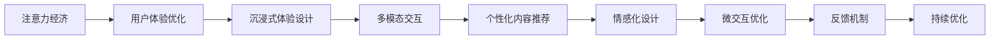

                 

# 注意力经济与用户体验优化策略与技术：创建令人沉浸的产品

## 1. 背景介绍

在数字化时代，信息爆炸和注意力稀缺成为了用户面临的重大挑战。如何吸引用户的注意力、提升用户体验，成为了产品设计和运营的核心问题。本文将从注意力经济的角度出发，探讨如何通过优化用户体验，构建令人沉浸的产品，创造更多价值。

### 1.1 问题由来

随着互联网技术的发展，用户面对的信息量呈指数级增长。从社交媒体、新闻资讯、视频内容，到电商商品、在线服务，几乎无处不在的信息流充斥着用户的感官。这种信息泛滥导致用户注意力分散，难以集中精力于某一特定内容或服务。同时，用户的注意力质量也因碎片化和浅层化而大打折扣，导致用户体验下降。

针对这一现象，注意力经济（Attention Economy）的概念被提出。注意力经济强调通过获取和集中用户的注意力来创造经济价值，成为数字时代的核心商业模式。而用户体验（User Experience, UX）优化则是实现这一目标的重要手段，通过设计沉浸式的用户界面和交互流程，提升用户参与度和满意度，从而增强产品的市场竞争力。

## 2. 核心概念与联系

### 2.1 核心概念概述

- **注意力经济（Attention Economy）**：基于注意力稀缺的经济模型，认为在信息过载的时代，吸引和集中用户注意力是创造经济价值的关键。

- **用户体验（User Experience, UX）**：用户体验是指用户与产品交互过程中的感受和体验，包括界面设计、交互流程、内容呈现等方面。良好的用户体验能提升用户满意度和忠诚度，增加产品价值。

- **沉浸式体验（Immersive Experience）**：沉浸式体验通过高度集中用户的注意力，使其完全投入于产品内容和服务中，达到忘我状态，从而实现更高的用户参与度和满意度。

### 2.2 核心概念原理和架构的 Mermaid 流程图



这个流程图展示了注意力经济、用户体验优化和沉浸式体验设计之间的关系：

1. **注意力经济**：通过获取用户注意力创造价值。
2. **用户体验优化**：通过优化用户体验吸引并保持用户注意力。
3. **沉浸式体验设计**：通过沉浸式设计提升用户体验，增强用户注意力。
4. **多模态交互**：结合多种交互方式，提高用户参与度。
5. **个性化内容推荐**：根据用户偏好推荐内容，增加用户粘性。
6. **情感化设计**：通过情感共鸣增强用户体验。
7. **微交互优化**：优化小细节提升用户满意度。
8. **反馈机制**：通过用户反馈持续优化产品。

## 3. 核心算法原理 & 具体操作步骤

### 3.1 算法原理概述

用户体验优化涉及多个方面，包括界面设计、交互流程、内容呈现等。本文将重点探讨如何通过注意力和情感的双重作用，构建沉浸式体验。

- **注意力模型**：通过分析用户行为数据，理解用户注意力集中和分散的规律。
- **情感模型**：通过情感计算技术，分析用户情感状态和变化，指导产品设计。

### 3.2 算法步骤详解

1. **数据采集与分析**：
   - 收集用户在产品中的行为数据，如点击、滑动、停留时间等。
   - 使用统计和机器学习技术，分析用户注意力集中和分散的时间点、频率和模式。

2. **沉浸式界面设计**：
   - 根据注意力模型，设计高吸引力的界面元素，如明亮的颜色、动态的图形等。
   - 通过视觉和听觉的感官刺激，引导用户注意力集中。

3. **个性化内容推荐**：
   - 基于用户的兴趣和行为数据，推荐相关内容。
   - 使用协同过滤、深度学习等算法，提升推荐准确性。

4. **情感化设计**：
   - 通过文本分析、情感计算等技术，识别用户情感状态。
   - 根据用户情感状态，调整界面和内容，增强情感共鸣。

5. **微交互优化**：
   - 优化小细节的交互流程，如按钮点击、滑动手势等。
   - 通过动画效果和声效反馈，增强用户的操作满足感。

6. **持续优化**：
   - 根据用户反馈，不断调整和优化产品。
   - 使用A/B测试等方法，验证优化效果。

### 3.3 算法优缺点

- **优点**：
  - 提升用户参与度和满意度，增加产品粘性。
  - 通过个性化和情感化设计，提升用户体验，增强用户忠诚度。
  - 使用数据驱动的方式，优化产品设计，提高效率和效果。

- **缺点**：
  - 需要大量用户数据，数据隐私和安全问题需注意。
  - 情感化设计难以量化，存在主观性和不确定性。
  - 微交互设计复杂，需精细打磨。

### 3.4 算法应用领域

- **社交媒体平台**：通过个性化推荐和情感化设计，提升用户互动和粘性。
- **在线教育**：通过沉浸式教学内容和微交互优化，提高学习效果和用户满意度。
- **电商平台**：通过个性化推荐和沉浸式购物体验，增加用户购物乐趣和购买转化率。
- **健康管理**：通过情感分析和个性化建议，提升用户健康管理和心理支持。

## 4. 数学模型和公式 & 详细讲解 & 举例说明

### 4.1 数学模型构建

我们假设用户对产品内容的参与度可以用注意力和情感状态来描述。设注意力状态为 $A_t$，情感状态为 $E_t$，则在时刻 $t$ 用户的参与度 $P_t$ 可以表示为：

$$ P_t = f(A_t, E_t) $$

其中，$f$ 为非线性函数，用于将注意力和情感状态映射为用户参与度。

### 4.2 公式推导过程

对于注意力状态 $A_t$，可以采用以下形式进行建模：

$$ A_t = \alpha_t + \beta \times A_{t-1} + \delta \times W_t $$

其中，$\alpha_t$ 为当前注意力水平，$\beta$ 为注意力衰减系数，$W_t$ 为当前外界刺激因素，$\delta$ 为外界刺激的影响系数。

对于情感状态 $E_t$，可以采用以下形式进行建模：

$$ E_t = \gamma_t + \varepsilon \times E_{t-1} + \eta \times S_t $$

其中，$\gamma_t$ 为当前情感状态，$\varepsilon$ 为情感衰减系数，$S_t$ 为当前外界情感刺激因素，$\eta$ 为外界情感刺激的影响系数。

### 4.3 案例分析与讲解

考虑一个电商平台的个性化推荐系统，用户每次浏览商品时，系统都会根据用户的浏览记录和行为数据，计算其注意力和情感状态，并推荐相关商品。

假设用户在某次浏览中，商品A、B、C分别获得了3、2、4个注意力点。同时，用户对商品A、B、C的情感评分分别为3、4、2。则系统可以通过以下公式计算用户的注意力和情感状态：

- 注意力状态 $A_t = 3 \times \alpha + 2 \times \beta \times A_{t-1} + 4 \times \delta \times W_t$
- 情感状态 $E_t = 3 \times \gamma + 4 \times \varepsilon \times E_{t-1} + 2 \times \eta \times S_t$

其中，$\alpha$、$\beta$、$\delta$、$\gamma$、$\varepsilon$、$\eta$ 为模型参数，需要通过训练得到。

最终，系统根据计算得到的注意力和情感状态，推荐最符合用户当前状态的商品，从而提升用户体验和转化率。

## 5. 项目实践：代码实例和详细解释说明

### 5.1 开发环境搭建

1. **安装Python和相关库**：
   ```bash
   conda create -n attention-economy python=3.8
   conda activate attention-economy
   pip install numpy pandas scikit-learn torch transformers matplotlib
   ```

2. **数据集准备**：
   - 收集用户行为数据，如点击、停留时间、滚动等。
   - 使用机器学习库对数据进行预处理和特征工程。

### 5.2 源代码详细实现

假设我们有一个用户行为数据集，包含用户的点击序列和情感评分。我们可以使用TensorFlow来构建用户参与度预测模型。

```python
import tensorflow as tf
from tensorflow.keras import layers

# 定义模型
model = tf.keras.Sequential([
    layers.Dense(128, activation='relu', input_shape=(n_timesteps, n_features)),
    layers.Dropout(0.2),
    layers.Dense(1, activation='sigmoid')
])

# 编译模型
model.compile(optimizer=tf.keras.optimizers.Adam(0.001),
              loss='binary_crossentropy',
              metrics=['accuracy'])

# 训练模型
model.fit(X_train, y_train, epochs=10, validation_data=(X_val, y_val))

# 预测用户参与度
y_pred = model.predict(X_test)
```

在模型训练过程中，我们使用sigmoid激活函数将用户参与度输出映射到0-1之间。模型的训练过程需要大量的数据和计算资源，建议使用GPU加速。

### 5.3 代码解读与分析

- **模型结构**：我们使用了2个全连接层，一个Dropout层用于防止过拟合，输出层为sigmoid函数，用于预测用户参与度。
- **训练数据**：X_train为训练数据，y_train为对应的标签。
- **验证数据**：X_val为验证数据，y_val为对应的标签。
- **训练过程**：我们使用Adam优化器和交叉熵损失函数进行训练，训练10个epochs，并在验证集上评估模型性能。
- **预测过程**：使用训练好的模型对测试集进行预测，得到用户参与度预测值。

### 5.4 运行结果展示

可以通过可视化工具，如TensorBoard，对模型训练和验证过程进行监控。

```python
from tensorflow.keras.callbacks import TensorBoard

# 初始化TensorBoard
log_dir = "logs/fit/" + datetime.now().strftime("%Y%m%d-%H%M%S")
tensorboard_callback = TensorBoard(log_dir)

# 训练模型
model.fit(X_train, y_train, epochs=10, validation_data=(X_val, y_val), callbacks=[tensorboard_callback])
```

通过TensorBoard，可以查看训练过程中的损失函数和准确率变化情况，并进行可视化展示。

## 6. 实际应用场景

### 6.1 社交媒体平台

社交媒体平台如微信、微博等，通过个性化推荐和情感化设计，提升用户互动和粘性。例如，微信朋友圈推荐朋友状态时，会分析用户的兴趣和情感状态，推荐用户可能感兴趣的内容。

### 6.2 在线教育

在线教育平台如Coursera、Udacity等，通过沉浸式教学内容和微交互优化，提高学习效果和用户满意度。例如，Coursera在课程推荐中，会根据学生的学习进度和情感反馈，调整课程难度和推荐内容。

### 6.3 电商平台

电商平台如淘宝、京东等，通过个性化推荐和沉浸式购物体验，增加用户购物乐趣和购买转化率。例如，京东在商品推荐中，会分析用户的浏览记录和情感评分，推荐最符合用户偏好的商品。

### 6.4 健康管理

健康管理应用如Apple Health、Fitbit等，通过情感分析和个性化建议，提升用户健康管理和心理支持。例如，Apple Health会根据用户的健康数据和情感状态，提供个性化的运动建议和心理支持。

## 7. 工具和资源推荐

### 7.1 学习资源推荐

1. **《人类行为和界面设计》**：这本书介绍了用户体验设计的基础理论和实践方法，适合对用户体验感兴趣的读者。
2. **《深度学习与神经网络》**：这本书详细介绍了深度学习模型的构建和优化方法，适合对深度学习感兴趣的读者。
3. **Coursera上的“用户界面设计与用户体验设计”课程**：由斯坦福大学开设，涵盖用户体验设计的基本理论和实践技能。
4. **Kaggle上的用户体验设计竞赛**：通过实际比赛，提升用户体验设计的实践能力。

### 7.2 开发工具推荐

1. **TensorFlow**：深度学习框架，适合构建复杂的数据模型和预测算法。
2. **PyTorch**：深度学习框架，具有灵活的动态计算图和易用性，适合快速迭代研究。
3. **Sketch**：用户体验设计工具，适合界面设计和交互流程优化。
4. **Adobe XD**：用户体验设计工具，支持原型设计和用户测试。

### 7.3 相关论文推荐

1. **《注意力机制在深度学习中的研究进展》**：介绍了注意力机制的基本原理和应用，适合对深度学习感兴趣的读者。
2. **《情感计算在用户体验设计中的应用》**：介绍了情感计算技术在用户体验设计中的应用，适合对用户体验感兴趣的读者。

## 8. 总结：未来发展趋势与挑战

### 8.1 研究成果总结

本文系统介绍了注意力经济和用户体验优化的核心概念和实际应用，通过数据分析和模型构建，展示了如何通过注意力和情感的双重作用，提升用户体验和产品价值。通过代码实例，详细介绍了构建沉浸式产品的技术和步骤。

### 8.2 未来发展趋势

1. **多模态数据融合**：未来的用户体验优化将更多地利用多模态数据，如语音、图像、文本等，构建更加全面、丰富的用户体验。
2. **个性化推荐算法**：未来的推荐系统将采用更加复杂的个性化算法，如深度神经网络、协同过滤等，提升推荐准确性和多样性。
3. **情感计算技术**：未来的情感计算技术将更加精准，能够实时监测用户的情感状态，提供更加个性化的服务。
4. **智能交互设计**：未来的交互设计将更多地利用人工智能技术，如自然语言处理、语音识别等，构建更加智能化和自然化的用户体验。

### 8.3 面临的挑战

1. **数据隐私和安全**：随着用户数据的收集和使用，数据隐私和安全问题变得越来越重要，需要设计更严格的数据保护机制。
2. **情感计算的不确定性**：情感计算技术还存在主观性和不确定性，如何准确理解和表达用户的情感状态，仍需深入研究。
3. **技术复杂度**：用户体验优化涉及多个领域，如心理学、计算机科学、设计学等，技术复杂度较高，需要跨学科协作。

### 8.4 研究展望

未来的用户体验优化研究需要更加注重跨学科协作和技术整合，提升用户体验设计的系统性和全面性。同时，需要更多地利用人工智能技术，如深度学习、自然语言处理等，提升用户体验的智能化水平。

## 9. 附录：常见问题与解答

**Q1：用户体验优化是否适合所有产品？**

A: 用户体验优化对大部分产品都适用，但效果因产品类型和用户群体而异。对于用户需求明确、界面简单、功能单一的产品，用户体验优化效果可能较为有限。而对于复杂多变、交互频繁的产品，如电商、社交媒体等，用户体验优化可以显著提升用户满意度和粘性。

**Q2：如何评估用户体验优化效果？**

A: 用户体验优化的效果可以通过用户满意度调查、用户留存率、用户转化率等指标进行评估。同时，可以使用A/B测试等方法，对比优化前后的用户行为数据，验证优化效果。

**Q3：微交互设计需要注意哪些方面？**

A: 微交互设计需要注意以下方面：
1. 设计简洁明了的界面元素，避免过多复杂操作。
2. 使用动画和声效反馈，增强用户的操作满足感。
3. 优化用户反馈机制，及时响应用户操作。
4. 进行用户测试，收集用户反馈，不断改进设计。

**Q4：情感计算技术如何应用于用户体验优化？**

A: 情感计算技术可以应用于用户体验优化的多个方面，如界面设计、内容推荐等。通过情感分析，识别用户的情感状态，指导产品设计。例如，在视频平台，根据用户的情感评分，调整视频推荐算法，提升用户的观看体验。

**Q5：如何处理多模态数据的融合？**

A: 多模态数据的融合需要设计统一的数据格式和交互方式。可以通过API接口或中间件，实现不同模态数据的无缝对接和数据融合。同时，需要设计合理的数据流和交互流程，避免数据冗余和冲突。

---

作者：禅与计算机程序设计艺术 / Zen and the Art of Computer Programming

