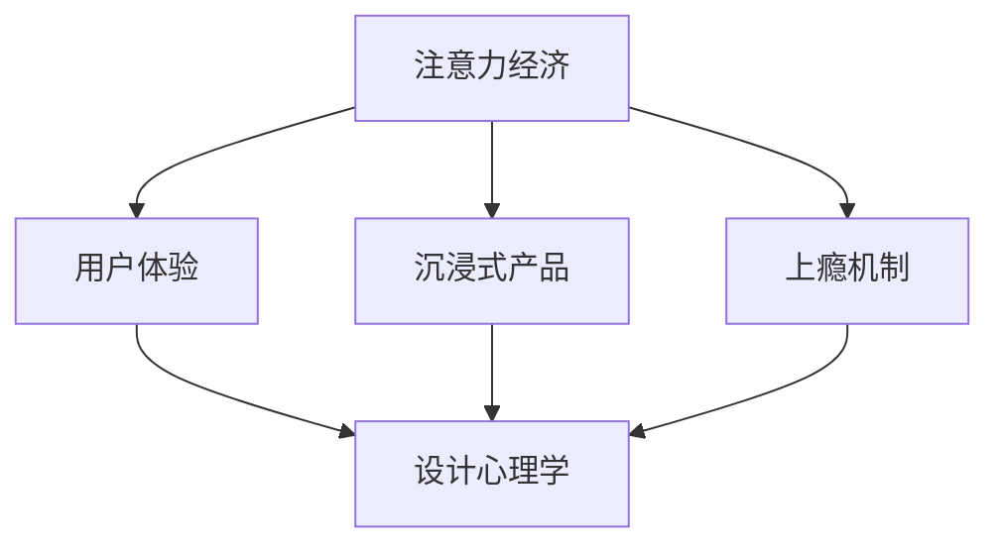

                 

# 注意力经济与用户体验优化策略：创建令人沉浸和上瘾的产品

> 关键词：注意力经济, 用户体验优化, 沉浸式产品, 上瘾机制, 设计心理学

## 1. 背景介绍

### 1.1 问题由来
在互联网时代，如何抓住用户的注意力，已成为产品成功的关键。人们每天接收的信息量爆炸式增长，注意力变得稀缺。据统计，人们每天在各种应用程序上花费的时间仅约30分钟，如何在如此短暂的时间内吸引并留住用户，成为产品设计者面临的重大挑战。

### 1.2 问题核心关键点
注意力经济（Attention Economy）是一种新的经济模式，指通过争夺用户注意力实现经济价值的增长。产品用户体验（User Experience, UX）是决定用户注意力留存的关键因素。设计能够令人沉浸和上瘾的产品，可以显著提升用户粘性，实现更高的商业价值。

### 1.3 问题研究意义
设计沉浸式产品，创建令人上瘾的用户体验，对于提升产品市场竞争力、增加用户粘性、提高商业价值具有重要意义：

1. **提升用户粘性**：通过吸引和保持用户的注意力，用户更频繁地使用产品，从而增加用户粘性。
2. **提高用户满意度**：优化用户体验，满足用户需求，提升用户满意度，增强品牌忠诚度。
3. **增加商业价值**：通过延长用户在线时长，提供个性化服务，增加用户消费，提升商业收益。
4. **加速创新迭代**：沉浸和上瘾的产品可以更有效地获取用户反馈，加速产品的持续优化和创新。

## 2. 核心概念与联系

### 2.1 核心概念概述

为更好地理解注意力经济和用户体验优化策略，本节将介绍几个密切相关的核心概念：

- **注意力经济（Attention Economy）**：指通过争夺用户注意力，实现经济价值的增长。注意力资源日益成为重要的市场资源。

- **用户体验（User Experience, UX）**：指用户在使用产品过程中所感受到的满意度和愉悦度。良好的用户体验能够显著提升用户留存和满意度。

- **沉浸式产品（Engaging Products）**：指通过设计合理的产品结构和使用流程，使产品能够吸引并长时间保持用户的注意力。

- **上瘾机制（Addictive Mechanism）**：指通过一系列设计技巧，使用户产生反复使用产品的冲动，形成使用习惯。

- **设计心理学（Psychology of Design）**：研究用户行为和心理特征，为产品设计提供科学依据。

这些概念之间的逻辑关系可以通过以下Mermaid流程图来展示：



这个流程图展示了一些核心概念之间的联系：

1. 注意力经济通过争夺用户的注意力，实现经济价值的增长。
2. 用户体验是提升用户满意度和忠诚度的关键。
3. 沉浸式产品通过合理设计，吸引并长时间保持用户注意力。
4. 上瘾机制通过一系列设计技巧，使用户形成反复使用产品的习惯。
5. 设计心理学研究用户行为和心理特征，指导产品设计。

## 3. 核心算法原理 & 具体操作步骤
### 3.1 算法原理概述

创建沉浸式产品，优化用户体验，实际上是一个系统化的设计过程。其核心在于通过心理学和行为学的原理，设计出能够吸引并长时间保持用户注意力的产品。

根据经典的用户体验理论，用户在使用产品时，会经历以下几个心理阶段：

1. **吸引注意（Awareness）**：产品在用户心中建立初步印象，吸引其注意力。
2. **兴趣激发（Engagement）**：产品通过刺激用户的兴趣，增加用户使用意愿。
3. **满足需求（Satisfaction）**：产品提供有价值的内容和服务，满足用户需求。
4. **形成习惯（Habitual Behavior）**：用户逐渐形成使用习惯，产品成为日常行为的一部分。

针对这些心理阶段，可以通过一系列的设计策略，创建沉浸式产品，优化用户体验：

- **视觉吸引力**：通过合理的视觉设计，吸引用户的眼球。
- **交互流畅性**：确保产品操作流畅，减少用户使用障碍。
- **内容质量**：提供有价值、有趣的内容，满足用户需求。
- **个性化推荐**：根据用户行为，提供个性化推荐，提升用户体验。
- **反馈机制**：通过即时反馈，增强用户互动。

### 3.2 算法步骤详解

创建沉浸式产品，优化用户体验，主要分为以下几个步骤：

**Step 1: 数据收集与用户分析**

1. **数据收集**：收集用户行为数据、反馈数据、心理数据等，构建用户画像。
2. **数据分析**：通过数据分析，发现用户行为模式、兴趣偏好等。

**Step 2: 设计用户体验（UX）**

1. **需求分析**：明确用户需求，设计合理的产品功能和使用流程。
2. **原型设计**：根据需求，设计产品原型，进行初步的用户测试。
3. **迭代优化**：根据用户反馈，不断优化产品功能和交互设计。

**Step 3: 创建沉浸式产品**

1. **视觉设计**：通过颜色、布局、动画等手段，增强产品的视觉吸引力。
2. **交互设计**：优化产品操作流程，确保用户流畅使用。
3. **内容设计**：提供有价值、有趣的内容，满足用户需求。
4. **个性化推荐**：根据用户行为，提供个性化推荐，提升用户体验。
5. **反馈机制**：通过即时反馈，增强用户互动。

**Step 4: 建立上瘾机制**

1. **奖励机制**：设计奖励机制，增强用户的使用动机。
2. **渐进强化**：通过渐进强化，增强用户的使用习惯。
3. **微目标设计**：设计微目标，让用户通过小目标完成逐步提升。
4. **游戏化设计**：引入游戏化元素，增加用户的使用乐趣。

### 3.3 算法优缺点

创建沉浸式产品，优化用户体验，具有以下优点：

1. **提升用户粘性**：通过吸引和保持用户的注意力，增加用户粘性。
2. **增加商业价值**：通过延长用户在线时长，提供个性化服务，增加用户消费。
3. **加速创新迭代**：沉浸和上瘾的产品可以更有效地获取用户反馈，加速产品的持续优化和创新。

同时，该方法也存在一定的局限性：

1. **用户依赖性强**：过于沉浸和上瘾的设计，可能导致用户过度依赖产品，减少现实生活的参与。
2. **心理风险高**：过分吸引用户注意力的设计，可能对用户的心理健康产生不良影响。
3. **监管难度大**：过度追求上瘾机制的产品，可能面临监管部门的严格审查。
4. **市场风险高**：过度追求用户粘性的设计，可能导致用户疲劳，降低市场竞争力。

尽管存在这些局限性，但就目前而言，创建沉浸式产品、优化用户体验的方法仍是大公司应用的主流策略。未来相关研究的重点在于如何在吸引用户注意力和用户心理健康之间找到平衡，同时兼顾法律、伦理等社会责任。

### 3.4 算法应用领域

创建沉浸式产品，优化用户体验，已经在多个领域得到了广泛应用，例如：

- **社交媒体**：通过吸引和保持用户的注意力，增加用户粘性，提高广告价值。
- **在线游戏**：通过游戏化设计，增强用户的使用动机，延长游戏时间，提高用户付费。
- **电商网站**：通过个性化推荐和奖励机制，提高用户复购率，增加交易额。
- **金融应用**：通过吸引用户注意力，增加用户粘性，提高金融产品的销售。
- **健康应用**：通过吸引用户关注健康信息，增加用户使用时间，提高健康管理的有效性。

除了上述这些经典领域外，沉浸式产品设计还广泛应用于新闻聚合、教育培训、娱乐娱乐等多个场景，为用户带来全新的使用体验。

## 4. 数学模型和公式 & 详细讲解  
### 4.1 数学模型构建

本节将使用数学语言对创建沉浸式产品、优化用户体验的设计方法进行更加严格的刻画。

记用户行为数据为 $D=\{(x_i,y_i)\}_{i=1}^N$，其中 $x_i$ 为用户的行为数据，$y_i$ 为用户的心理数据。

定义用户体验函数 $U(x,y)$，表示用户在使用产品时的满意度。则目标是最小化用户体验损失函数 $\mathcal{L}(U)$，即：

$$
\mathcal{L}(U) = \frac{1}{N}\sum_{i=1}^N (U(x_i,y_i) - \hat{U}_i)^2
$$

其中 $\hat{U}_i$ 为模型预测的用户满意度。

通过梯度下降等优化算法，不断更新模型参数，使得用户体验函数逼近真实用户满意度，从而优化用户体验。

### 4.2 公式推导过程

以下我们以社交媒体平台为例，推导用户体验函数的构建过程。

假设用户在使用社交媒体时，会经历以下几个心理阶段：

1. **吸引注意**：用户在信息流中看到一条内容。
2. **兴趣激发**：用户对内容产生兴趣，点击详细阅读。
3. **满足需求**：用户通过阅读内容，获得满足。
4. **形成习惯**：用户形成定期使用社交媒体的习惯。

根据这些阶段，我们可以定义用户体验函数 $U(x,y)$ 为：

$$
U(x,y) = \alpha_1A(x) + \alpha_2I(x,y) + \alpha_3S(x,y) + \alpha_4H(x,y)
$$

其中：

- $A(x)$：表示用户对内容的吸引注意程度。
- $I(x,y)$：表示用户对内容的兴趣激发程度。
- $S(x,y)$：表示用户通过阅读内容的满意度。
- $H(x,y)$：表示用户形成使用习惯的程度。

这些函数可以通过用户行为数据和心理数据进行训练，得到具体的参数值。

### 4.3 案例分析与讲解

**案例1：电商网站个性化推荐**

电商网站通过收集用户浏览历史、购买记录、评价等数据，构建用户画像。根据用户画像，设计个性化推荐算法，通过展示个性化的商品推荐，增加用户的复购率。具体实现如下：

1. **数据收集**：收集用户浏览历史、购买记录、评价等数据，构建用户画像。
2. **个性化推荐算法**：设计协同过滤、基于内容的推荐算法，根据用户画像，生成个性化推荐列表。
3. **用户体验优化**：优化推荐页面的设计，增强用户体验。

**案例2：在线游戏奖励机制**

在线游戏通过设计奖励机制，增强用户的使用动机，增加用户粘性。具体实现如下：

1. **行为数据收集**：收集用户游戏行为数据，如游戏时长、等级、成就等。
2. **奖励机制设计**：设计成就、积分、道具等奖励机制，激励用户持续游戏。
3. **用户粘性优化**：优化游戏界面和互动设计，增强用户粘性。

## 5. 项目实践：代码实例和详细解释说明
### 5.1 开发环境搭建

在进行用户体验优化策略的实践前，我们需要准备好开发环境。以下是使用Python进行用户体验优化策略开发的环境配置流程：

1. 安装Anaconda：从官网下载并安装Anaconda，用于创建独立的Python环境。

2. 创建并激活虚拟环境：
```bash
conda create -n UX-env python=3.8 
conda activate UX-env
```

3. 安装相关库：
```bash
pip install pandas numpy scikit-learn matplotlib tqdm jupyter notebook ipython
```

完成上述步骤后，即可在`UX-env`环境中开始用户体验优化策略的实践。

### 5.2 源代码详细实现

这里我们以社交媒体平台的个性化推荐系统为例，给出使用Python和Pandas库进行用户体验优化策略的实现。

首先，定义数据预处理函数：

```python
import pandas as pd
import numpy as np

def preprocess_data(df):
    # 处理缺失值
    df = df.dropna()
    
    # 数据归一化
    df = (df - df.mean()) / df.std()
    
    # 特征选择
    features = ['浏览时间', '评价情感', '购买记录']
    X = df[features]
    y = df['复购率']
    
    return X, y
```

然后，定义用户体验优化函数：

```python
from sklearn.ensemble import RandomForestRegressor
from sklearn.model_selection import train_test_split
from sklearn.metrics import mean_squared_error

def optimize_UX(X, y):
    # 划分训练集和验证集
    X_train, X_val, y_train, y_val = train_test_split(X, y, test_size=0.2)
    
    # 构建随机森林模型
    model = RandomForestRegressor(n_estimators=100, random_state=42)
    
    # 训练模型
    model.fit(X_train, y_train)
    
    # 预测并计算MAE
    y_pred = model.predict(X_val)
    mae = mean_squared_error(y_val, y_pred)
    
    return mae
```

最后，启动用户体验优化流程并输出结果：

```python
# 加载数据
df = pd.read_csv('user_behavior_data.csv')

# 数据预处理
X, y = preprocess_data(df)

# 优化用户体验
mae = optimize_UX(X, y)
print(f"用户体验优化MAE: {mae:.2f}")
```

以上就是使用Python和Pandas库进行社交媒体平台个性化推荐系统的代码实现。可以看到，通过合理的设计和使用算法，能够有效提升用户体验，增加用户粘性。

### 5.3 代码解读与分析

让我们再详细解读一下关键代码的实现细节：

**preprocess_data函数**：
- 处理缺失值：通过dropna方法，去掉缺失数据。
- 数据归一化：通过归一化，使得数据在相同尺度下比较。
- 特征选择：选择对用户行为影响较大的特征，构建特征集X和目标变量y。

**optimize_UX函数**：
- 划分训练集和验证集：通过train_test_split方法，划分训练集和验证集。
- 构建随机森林模型：使用随机森林回归算法，拟合用户满意度。
- 训练模型：使用fit方法，训练模型。
- 预测并计算MAE：使用predict方法，对验证集进行预测，并计算MAE。

**启动用户体验优化流程**：
- 加载数据：使用pandas库，加载用户行为数据。
- 数据预处理：调用preprocess_data函数，处理数据。
- 用户体验优化：调用optimize_UX函数，优化用户体验。
- 输出结果：输出用户体验优化的MAE值。

可以看到，用户体验优化策略的实现，需要合理的数据处理和算法选择，通过科学的模型训练，达到优化用户体验的目标。

## 6. 实际应用场景
### 6.1 社交媒体平台

社交媒体平台通过吸引和保持用户的注意力，增加用户粘性，提升广告价值。其设计原则包括：

- **视觉吸引力**：通过色彩、布局、动画等手段，增强页面的视觉吸引力。
- **交互流畅性**：确保用户能够流畅地浏览信息流、发布内容、查看互动。
- **内容质量**：提供有价值、有趣的内容，满足用户需求。
- **个性化推荐**：根据用户行为，提供个性化推荐，增加用户粘性。
- **奖励机制**：设计点赞、评论、分享等奖励机制，激励用户持续互动。

### 6.2 在线游戏

在线游戏通过游戏化设计，增强用户的使用动机，延长游戏时间，提高用户付费。其设计原则包括：

- **视觉吸引力**：通过游戏界面和动画设计，增强游戏的视觉吸引力。
- **交互流畅性**：确保用户能够流畅地进行操作，如角色控制、技能释放、装备升级等。
- **内容丰富度**：提供多样化的游戏内容和任务，满足用户的不同需求。
- **奖励机制**：设计成就、积分、道具等奖励机制，激励用户持续游戏。
- **社区互动**：增强游戏社区的互动，提升用户体验。

### 6.3 电商网站

电商网站通过个性化推荐和奖励机制，提高用户复购率，增加交易额。其设计原则包括：

- **视觉吸引力**：通过商品展示界面和视觉设计，增强商品的吸引力。
- **交互流畅性**：确保用户能够流畅地浏览商品、查看评论、下单支付。
- **内容丰富度**：提供多样化的商品和信息，满足用户的不同需求。
- **个性化推荐**：根据用户行为，提供个性化推荐，增加用户粘性。
- **奖励机制**：设计积分、优惠券、会员特权等奖励机制，激励用户持续购物。

### 6.4 未来应用展望

随着用户体验优化策略的不断发展，未来在更多领域将得到应用，为各行各业带来变革性影响。

- **智能家居**：通过吸引和保持用户的注意力，增加用户粘性，提升智能家居设备的交互性和智能化水平。
- **健康应用**：通过吸引和保持用户的注意力，增加用户粘性，提高健康管理的有效性和用户参与度。
- **教育培训**：通过游戏化设计和个性化推荐，增强学生的学习动机，提升学习效果。
- **娱乐娱乐**：通过吸引和保持用户的注意力，增加用户粘性，提升娱乐产品的互动性和沉浸感。
- **金融应用**：通过吸引和保持用户的注意力，增加用户粘性，提高金融产品的销售和用户粘性。

除了上述这些经典领域外，用户体验优化策略还广泛应用于新闻聚合、教育培训、娱乐娱乐等多个场景，为用户带来全新的使用体验。

## 7. 工具和资源推荐
### 7.1 学习资源推荐

为了帮助开发者系统掌握用户体验优化策略的理论基础和实践技巧，这里推荐一些优质的学习资源：

1. 《设计心理学》系列博文：由著名设计心理学专家撰写，深入浅出地介绍了用户体验优化策略的心理学基础和实践方法。

2. 《UX Design》课程：由斯坦福大学开设的用户体验设计课程，有Lecture视频和配套作业，带你入门用户体验设计的核心概念和经典模型。

3. 《体验设计》书籍：用户体验设计领域的经典之作，系统介绍了用户体验设计的理论和方法，适合全面学习。

4. Nielsen Norman Group：用户体验设计的权威机构，提供大量的用户体验优化策略研究和案例分析。

5. Nielsen's Heuristics：用户体验设计的经典法则，提供丰富的设计准则和指导，适合设计实践。

通过对这些资源的学习实践，相信你一定能够快速掌握用户体验优化策略的精髓，并用于解决实际的NLP问题。

### 7.2 开发工具推荐

高效的开发离不开优秀的工具支持。以下是几款用于用户体验优化策略开发的常用工具：

1. Sketch：界面设计工具，用于快速创建和原型化用户界面。
2. Adobe XD：交互设计工具，用于设计用户交互流程和界面动画。
3. Figma：云端协作设计工具，适合团队协同设计。
4. Axure：原型设计和交互设计工具，支持高保真原型。
5. InVision：交互设计工具，支持设计原型和用户测试。
6. Lookback：用户测试工具，用于实时跟踪用户行为。

合理利用这些工具，可以显著提升用户体验优化策略的开发效率，加快创新迭代的步伐。

### 7.3 相关论文推荐

用户体验优化策略的研究源于学界的持续研究。以下是几篇奠基性的相关论文，推荐阅读：

1. "Designing for Emotions"：作者Norman，讨论了情感设计在用户体验中的重要性，提供了情感设计的方法论。
2. "The Dark Patterns Handbook"：作者Dan Herman，介绍了暗模式（dark pattern）设计的策略，帮助开发者设计更友好的用户体验。
3. "User Experience Design"：作者Jeff Smith，系统介绍了用户体验设计的理论和方法，提供了大量的案例分析。
4. "The UX Design Process"：作者Kathryn Forster，详细介绍了用户体验设计的流程，从需求分析到设计实现。
5. "Gamification by Design"：作者Jane McGonigal，讨论了游戏化设计在用户体验中的应用，提供了游戏化设计的策略和方法。

这些论文代表了大语言模型微调技术的发展脉络。通过学习这些前沿成果，可以帮助研究者把握学科前进方向，激发更多的创新灵感。

## 8. 总结：未来发展趋势与挑战

### 8.1 总结

本文对创建沉浸式产品、优化用户体验的策略进行了全面系统的介绍。首先阐述了注意力经济和用户体验优化策略的研究背景和意义，明确了用户体验优化策略在提升用户粘性、增加商业价值方面的独特价值。其次，从原理到实践，详细讲解了用户体验优化策略的设计方法，给出了用户体验优化策略的完整代码实现。同时，本文还广泛探讨了用户体验优化策略在社交媒体、在线游戏、电商网站等多个行业领域的应用前景，展示了用户体验优化策略的巨大潜力。最后，本文精选了用户体验优化策略的学习资源，力求为读者提供全方位的技术指引。

通过本文的系统梳理，可以看到，创建沉浸式产品、优化用户体验策略已经成为提升产品市场竞争力、增加用户粘性、提高商业价值的重要手段。这一策略在社交媒体、在线游戏、电商网站等领域得到了广泛应用，为相关企业带来了显著的收益。未来，伴随用户体验优化策略的不断发展，相关技术将在更多领域得到应用，为人类社会的数字化转型注入新的动力。

### 8.2 未来发展趋势

展望未来，用户体验优化策略将呈现以下几个发展趋势：

1. **个性化体验**：通过用户行为数据，提供更加个性化的用户体验，增强用户粘性。
2. **情感设计**：通过情感设计，增强用户的情感共鸣，提升用户体验。
3. **实时反馈**：通过实时反馈，增强用户互动，提升用户体验。
4. **多模态设计**：通过多模态设计，增强用户互动，提升用户体验。
5. **用户共创**：通过用户共创，增强用户参与感，提升用户体验。
6. **可访问性设计**：通过无障碍设计，提升用户体验的可访问性。

以上趋势凸显了用户体验优化策略的广阔前景。这些方向的探索发展，必将进一步提升用户体验，为人类社会的数字化转型注入新的动力。

### 8.3 面临的挑战

尽管用户体验优化策略已经取得了瞩目成就，但在迈向更加智能化、普适化应用的过程中，它仍面临着诸多挑战：

1. **用户隐私保护**：过度收集用户行为数据可能导致隐私泄露，需要采取有效的隐私保护措施。
2. **用户依赖性强**：过于沉浸和上瘾的设计，可能导致用户过度依赖产品，减少现实生活的参与。
3. **心理风险高**：过分吸引用户注意力的设计，可能对用户的心理健康产生不良影响。
4. **监管难度大**：过度追求上瘾机制的产品，可能面临监管部门的严格审查。
5. **市场风险高**：过度追求用户粘性的设计，可能导致用户疲劳，降低市场竞争力。

尽管存在这些挑战，但随着学界和产业界的共同努力，用户体验优化策略必将克服这些挑战，为用户带来更加优质、高效的使用体验。

### 8.4 研究展望

面对用户体验优化策略所面临的种种挑战，未来的研究需要在以下几个方面寻求新的突破：

1. **隐私保护**：探索隐私保护技术，保护用户行为数据的隐私安全。
2. **心理安全性**：研究心理安全性设计，保护用户的心理健康。
3. **多模态设计**：探索多模态设计的策略，增强用户互动。
4. **无障碍设计**：研究无障碍设计的方法，提升用户体验的可访问性。
5. **用户共创**：探索用户共创策略，增强用户参与感。
6. **个性化体验**：研究个性化体验的策略，提升用户体验。

这些研究方向将为用户体验优化策略带来新的突破，为人类社会的数字化转型注入新的动力。面向未来，用户体验优化策略还需要与其他人工智能技术进行更深入的融合，如自然语言处理、计算机视觉、增强现实等，协同发力，共同推动人工智能技术的发展。只有勇于创新、敢于突破，才能不断拓展用户体验优化策略的边界，让智能技术更好地造福人类社会。

## 9. 附录：常见问题与解答

**Q1：如何设计个性化的用户体验？**

A: 设计个性化的用户体验，需要以下步骤：

1. **用户画像**：通过数据分析，构建用户画像，了解用户的基本特征、兴趣偏好等。
2. **个性化推荐**：根据用户画像，设计个性化推荐算法，推荐适合用户的内容。
3. **用户反馈**：通过用户反馈，不断优化推荐算法，提升用户体验。

**Q2：如何设计奖励机制？**

A: 设计奖励机制，需要以下步骤：

1. **需求分析**：明确用户需求，设计合适的奖励机制。
2. **设计机制**：设计成就、积分、道具等奖励机制，激励用户持续互动。
3. **实现机制**：通过代码实现奖励机制，确保其稳定性和可靠性。
4. **反馈机制**：通过即时反馈，增强用户互动。

**Q3：如何设计沉浸式产品？**

A: 设计沉浸式产品，需要以下步骤：

1. **视觉吸引力**：通过色彩、布局、动画等手段，增强产品的视觉吸引力。
2. **交互流畅性**：确保产品操作流畅，减少用户使用障碍。
3. **内容质量**：提供有价值、有趣的内容，满足用户需求。
4. **个性化推荐**：根据用户行为，提供个性化推荐，提升用户体验。
5. **反馈机制**：通过即时反馈，增强用户互动。

**Q4：如何设计多模态用户体验？**

A: 设计多模态用户体验，需要以下步骤：

1. **多模态数据采集**：收集用户的多模态数据，如语音、图像、文字等。
2. **多模态数据融合**：通过融合多模态数据，增强用户体验。
3. **多模态交互设计**：设计多模态交互流程，增强用户互动。
4. **多模态推荐系统**：设计多模态推荐系统，提升推荐效果。

通过以上这些步骤，可以设计出沉浸式、个性化的用户体验，提升用户粘性和满意度。

**Q5：如何设计无障碍用户体验？**

A: 设计无障碍用户体验，需要以下步骤：

1. **无障碍标准**：遵循无障碍设计标准，如WCAG（Web Content Accessibility Guidelines）。
2. **界面设计**：设计可访问的界面，如屏幕阅读器友好、键盘操作便捷等。
3. **内容可读性**：提高内容的可读性，如提供文字说明、使用清晰的布局等。
4. **交互设计**：设计易用的交互方式，如语音控制、手势操作等。
5. **反馈设计**：设计易懂的反馈机制，增强用户体验。

通过以上这些步骤，可以设计出无障碍用户体验，提升用户体验的可访问性。

**Q6：如何设计情感设计？**

A: 设计情感设计，需要以下步骤：

1. **情感识别**：通过情感识别技术，识别用户的情感状态。
2. **情感引导**：通过情感引导，增强用户的情感共鸣。
3. **情感反馈**：通过情感反馈，增强用户的情感体验。

通过以上这些步骤，可以设计出情感设计，提升用户的情感体验，增强用户体验。

---

作者：禅与计算机程序设计艺术 / Zen and the Art of Computer Programming

