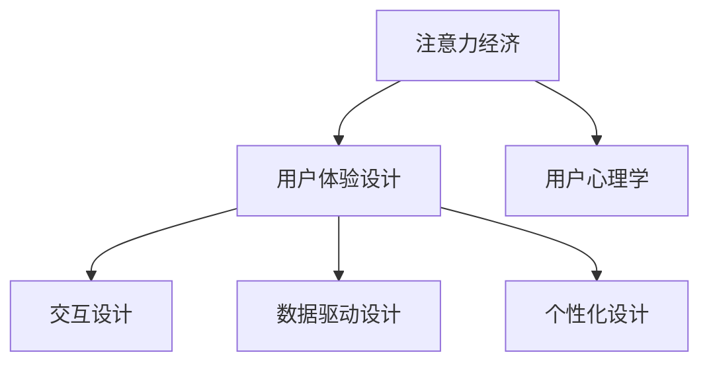

                 

# 注意力经济与用户体验设计：创建引人入胜、增强专注力的产品

## 1. 背景介绍

### 1.1 问题由来

在数字化时代，信息过载和注意力分散成为了互联网产品设计的重大挑战。如何吸引用户注意力，并保持其长期专注，是决定产品成败的关键。在移动终端、网页、应用等各类平台上，注意力资源稀缺且难以预测，如何高效分配并利用这些资源，成为了产品经理和设计师的重要课题。

本文将深入探讨注意力经济与用户体验设计的关系，阐述如何通过数据驱动、用户研究、心理学原理等方法，构建引人入胜、增强专注力的产品，提升用户使用体验。

### 1.2 问题核心关键点

注意力经济的核心在于如何吸引、保持和转换用户注意力。用户注意力被占用时，就会从其他竞争产品中转移过来，从而为产品带来流量和收益。因此，设计者需通过以下方式来优化用户注意力：

1. **吸引注意**：通过标题、首屏、视觉设计等手段吸引用户目光。
2. **维持兴趣**：通过信息布局、互动机制、内容更新等方法保持用户好奇心。
3. **诱导行为**：通过导航、按钮、提示框等方式引导用户进行下一步操作。
4. **提升满意度**：通过响应速度、界面友好、功能完备等提升用户使用体验。

本文将重点介绍如何通过注意力经济理论，结合用户心理学和交互设计原理，优化用户体验，构建高效、引人入胜的产品。

## 2. 核心概念与联系

### 2.1 核心概念概述

为更好地理解注意力经济和用户体验设计，本节将介绍几个密切相关的核心概念：

- **注意力经济(Attention Economy)**：在信息过载的互联网时代，吸引和保持用户注意力变得尤为重要。注意力资源稀缺，谁吸引了用户注意力，谁就获得了经济利益。

- **用户体验设计(User Experience Design, UX)**：通过研究用户行为、心理、需求等，优化产品交互、视觉、功能等各个方面，提升用户的使用体验和满意度。

- **用户心理学(Psychology of User)**：研究用户在使用产品时的心理特征和行为规律，通过心理学原理指导产品设计，提高用户黏性和转化率。

- **交互设计(Interaction Design)**：专注于用户和产品的互动方式，通过设计合理的界面和交互逻辑，提升用户操作效率和体验满意度。

- **数据驱动设计(Data-Driven Design)**：基于用户数据，进行产品设计和迭代优化，通过数据和实验评估设计效果，指导产品决策。

- **个性化设计(Personalization)**：根据用户兴趣、行为、特征等，定制个性化的内容和服务，提升用户体验的精准性和满足度。

这些概念之间的逻辑关系可以通过以下Mermaid流程图来展示：



这个流程图展示了一些核心概念及其之间的关系：

1. 注意力经济是基础，决定了产品获取用户注意的能力。
2. 用户体验设计是手段，通过优化界面和交互来满足用户需求。
3. 用户心理学是指导，通过研究用户行为规律来设计更符合心理需求的产品。
4. 交互设计是核心，通过设计合理的交互逻辑提升用户操作效率。
5. 数据驱动设计是验证，通过数据分析指导产品决策和迭代优化。
6. 个性化设计是拓展，通过定制化服务提升用户体验的精准性和满足度。

## 3. 核心算法原理 & 具体操作步骤
### 3.1 算法原理概述

注意力经济与用户体验设计的核心在于如何有效吸引和保持用户注意力，并在此基础上设计出引人入胜、高效互动的产品。这涉及到多个层面的算法和策略，包括信息呈现、内容推荐、交互设计等。

其算法原理主要包括以下几个步骤：

1. **数据采集与分析**：通过用户行为数据、交互日志等，分析用户对产品的关注点和行为习惯。
2. **用户建模与预测**：利用机器学习算法，对用户行为进行建模，预测其下一步动作和需求。
3. **内容生成与推荐**：根据用户兴趣和行为特征，动态生成并推荐个性化内容。
4. **界面设计优化**：通过A/B测试等方法，优化界面和交互设计，提升用户体验。

### 3.2 算法步骤详解

#### 步骤1：数据采集与分析

数据采集是注意力经济与用户体验设计的第一步。通过日志分析、用户行为跟踪等手段，收集用户与产品的互动数据。常用的数据源包括：

- **行为数据**：用户在页面上的停留时间、点击次数、滑动路径等。
- **交互数据**：用户与应用的交互日志，如点击、滑动、输入等。
- **属性数据**：用户的基本信息，如年龄、性别、地域、兴趣等。

常用的分析工具包括Google Analytics、Mixpanel、Amplitude等，通过数据仪表盘实时查看用户行为指标，识别用户注意力变化。

#### 步骤2：用户建模与预测

用户建模是预测用户行为的基础。通过机器学习算法，建立用户行为模型，预测其下一步动作和需求。常用方法包括：

- **协同过滤(Collaborative Filtering)**：通过用户历史行为数据，预测其未看过的内容。
- **关联规则挖掘(Association Rule Mining)**：分析用户行为中的关联规则，发现其兴趣点和行为模式。
- **深度学习(DL)**：利用深度神经网络，建立复杂的用户行为模型，预测用户未来行为。

用户模型可细分为兴趣模型、行为模型、情感模型等。建模后，通过在线预测，实时调整内容推送和页面设计，提升用户满意度。

#### 步骤3：内容生成与推荐

内容生成与推荐是吸引用户注意的重要手段。通过个性化推荐系统，根据用户兴趣和行为特征，动态生成并推荐个性化内容。常用方法包括：

- **协同过滤推荐**：通过用户行为和物品特征，推荐相似物品或用户。
- **基于内容的推荐**：分析物品特征，推荐与用户兴趣相关的内容。
- **混合推荐算法**：结合多种推荐策略，提升推荐精度和多样性。

推荐系统不仅要推荐相关内容，还要根据用户注意力变化，调整推荐频率和顺序，避免过度推荐和信息干扰。

#### 步骤4：界面设计优化

界面设计优化是提升用户体验的核心手段。通过A/B测试、用户调研等方法，不断优化界面和交互设计，提升用户操作效率和满意度。常用方法包括：

- **原型设计(Prototype Design)**：快速构建产品原型，进行用户测试和优化。
- **可用性测试(Usability Testing)**：通过用户测试，评估界面和交互设计的可用性和用户体验。
- **A/B测试(A/B Testing)**：通过对比实验，评估不同设计方案的效果，优化产品界面。

界面设计需要兼顾美观、易用、高效等方面，通过视觉设计、交互设计等手段，提升用户的使用体验。

### 3.3 算法优缺点

注意力经济与用户体验设计的算法具有以下优点：

1. **数据驱动**：通过大数据分析，指导产品设计和决策，减少主观偏见，提高决策的科学性。
2. **个性化定制**：根据用户个性化需求，生成个性化内容和服务，提升用户体验的满足度。
3. **实时优化**：通过实时数据反馈，快速调整产品设计，提高产品的竞争力和用户满意度。

同时，该算法也存在一定的局限性：

1. **隐私问题**：大量数据采集和分析可能引发用户隐私问题，需注意数据保护和合规性。
2. **过度推荐**：过度推荐可能造成用户注意力分散，需平衡推荐频率和频率。
3. **误判风险**：机器学习模型的误判可能导致推荐不准确，需进行持续监控和优化。
4. **成本高昂**：数据采集、模型训练、界面优化等环节需要大量人力和物力投入，需控制成本。

尽管存在这些局限性，但就目前而言，注意力经济与用户体验设计的算法仍是大数据时代下，产品设计的重要手段。未来相关研究的重点在于如何进一步降低算法对数据和计算的依赖，提高推荐精度和用户体验，同时兼顾隐私保护和成本控制等因素。

### 3.4 算法应用领域

注意力经济与用户体验设计的算法在多个领域得到了广泛应用，例如：

- **电商推荐系统**：通过个性化推荐，提升商品曝光率和销售转化率。
- **社交媒体平台**：通过动态内容推荐，提高用户活跃度和平台黏性。
- **移动应用设计**：通过界面优化和交互设计，提升应用的用户体验和留存率。
- **在线教育平台**：通过个性化内容和推荐，提高用户学习效率和平台满意度。
- **智能家居控制**：通过语音交互和内容推荐，提升家居设备的互动性和使用体验。

除了这些常见应用外，注意力经济与用户体验设计的算法还在更多场景中得到创新性应用，如智能导航、个性化广告、智能客服等，为产品设计带来了新的突破。

## 4. 数学模型和公式 & 详细讲解 & 举例说明

### 4.1 数学模型构建

本节将使用数学语言对注意力经济与用户体验设计的算法进行更加严格的刻画。

假设用户对产品的注意力可以用向量 $A$ 表示，其各个维度的值表示用户对不同内容项的关注度。产品推荐系统可以通过算法计算推荐项 $C$ 对用户注意力的影响，建立注意力模型 $M(A, C)$。

通过机器学习算法，模型 $M$ 可以学习到用户的兴趣特征，根据当前注意状态 $A$ 和推荐内容 $C$，预测用户下一步动作 $B$。

其中，注意力模型 $M$ 可以表示为：

$$
M(A, C) = \alpha f_{content}(C) + \beta f_{context}(A, C) + \gamma f_{interaction}(A, C)
$$

其中，$\alpha, \beta, \gamma$ 为模型权重，$f_{content}, f_{context}, f_{interaction}$ 分别为内容、上下文、交互特征的加权函数。

### 4.2 公式推导过程

假设用户的当前注意状态为 $A$，推荐项 $C$ 对用户注意力的影响为 $\Delta A$，则注意力模型可以表示为：

$$
A' = A + \Delta A
$$

其中，$A'$ 为用户注意状态更新后的结果。

推荐系统通过模型 $M$ 计算推荐项 $C$ 对用户注意力的影响 $\Delta A$，可以表示为：

$$
\Delta A = M(A, C) = \alpha f_{content}(C) + \beta f_{context}(A, C) + \gamma f_{interaction}(A, C)
$$

通过实际应用，用户点击推荐内容后，可以进一步更新注意状态 $A$，并继续计算下一次推荐。

### 4.3 案例分析与讲解

#### 案例分析

假设有一个在线音乐应用，通过协同过滤推荐系统为用户推荐歌曲。用户当前注意状态 $A$ 表示其对不同类型歌曲的关注度，推荐系统可以根据用户历史听歌行为 $C$，计算推荐歌曲 $C'$ 对用户注意力的影响 $\Delta A$，并更新注意状态 $A'$。

**步骤1：数据采集与分析**

1. **行为数据**：记录用户每次听歌时长、跳过次数等行为数据。
2. **交互数据**：记录用户对歌曲的播放、暂停、跳过等操作。
3. **属性数据**：记录用户的基本信息，如年龄、地域、性别等。

**步骤2：用户建模与预测**

1. **协同过滤**：根据用户历史听歌行为，推荐相似歌曲。
2. **关联规则挖掘**：分析用户行为中的关联规则，发现其兴趣点和行为模式。
3. **深度学习**：利用深度神经网络，建立复杂的用户行为模型，预测用户未来行为。

**步骤3：内容生成与推荐**

1. **协同过滤推荐**：通过用户行为和歌曲特征，推荐相似歌曲。
2. **基于内容的推荐**：分析歌曲特征，推荐与用户兴趣相关的内容。
3. **混合推荐算法**：结合多种推荐策略，提升推荐精度和多样性。

**步骤4：界面设计优化**

1. **原型设计**：快速构建应用原型，进行用户测试和优化。
2. **可用性测试**：通过用户测试，评估界面和交互设计的可用性和用户体验。
3. **A/B测试**：通过对比实验，评估不同设计方案的效果，优化产品界面。

通过以上步骤，推荐系统可以不断优化用户听歌体验，提升用户满意度。

## 5. 项目实践：代码实例和详细解释说明

### 5.1 开发环境搭建

在进行注意力经济与用户体验设计的项目实践前，我们需要准备好开发环境。以下是使用Python进行开发的环境配置流程：

1. 安装Anaconda：从官网下载并安装Anaconda，用于创建独立的Python环境。

2. 创建并激活虚拟环境：
```bash
conda create -n attention-env python=3.8 
conda activate attention-env
```

3. 安装相关依赖包：
```bash
pip install numpy pandas scikit-learn matplotlib seaborn joblib
```

4. 安装相关库：
```bash
pip install tensorflow pytorch torchvision scikit-image
```

完成上述步骤后，即可在`attention-env`环境中开始项目实践。

### 5.2 源代码详细实现

这里我们以推荐系统为例，给出使用TensorFlow实现个性化推荐系统的PyTorch代码实现。

首先，定义推荐系统的数据处理函数：

```python
import pandas as pd
import numpy as np
from sklearn.preprocessing import StandardScaler
from sklearn.model_selection import train_test_split

# 读取数据
data = pd.read_csv('user_behavior.csv')

# 处理数据
data = data.dropna()
X = data[['item_id', 'user_id', 'time', 'date']]
y = data['click'].map({'1': 1, '0': 0})

# 数据标准化
scaler = StandardScaler()
X_scaled = scaler.fit_transform(X)

# 分割数据集
X_train, X_test, y_train, y_test = train_test_split(X_scaled, y, test_size=0.2, random_state=42)
```

然后，定义推荐模型的超参数和模型结构：

```python
from tensorflow import keras

# 定义超参数
learning_rate = 0.001
batch_size = 64
epochs = 10
hidden_dim = 64

# 定义模型结构
model = keras.Sequential([
    keras.layers.Dense(hidden_dim, activation='relu', input_shape=(X_train.shape[1],)),
    keras.layers.Dense(1, activation='sigmoid')
])
```

接着，定义模型训练函数：

```python
from tensorflow.keras.optimizers import Adam

# 定义优化器
optimizer = Adam(learning_rate=learning_rate)

# 编译模型
model.compile(optimizer=optimizer, loss='binary_crossentropy', metrics=['accuracy'])

# 训练模型
model.fit(X_train, y_train, batch_size=batch_size, epochs=epochs, validation_data=(X_test, y_test))
```

最后，评估模型并进行推荐：

```python
# 评估模型
test_loss, test_acc = model.evaluate(X_test, y_test)
print('Test loss:', test_loss)
print('Test accuracy:', test_acc)

# 使用模型进行推荐
user = [user_id, 'time', 'date']
item = ['item_id']
user_scaled = scaler.transform(user)
item_scaled = scaler.transform(item)

prediction = model.predict(user_scaled)
if prediction > 0.5:
    print('推荐歌曲：', item[0])
```

以上就是使用TensorFlow实现个性化推荐系统的完整代码实现。可以看到，得益于TensorFlow的强大封装，我们可以用相对简洁的代码完成推荐模型的搭建和训练。

### 5.3 代码解读与分析

让我们再详细解读一下关键代码的实现细节：

**数据处理函数**：
- 读取用户行为数据，并处理缺失值。
- 将数据按时间戳和日期分组，特征工程出用户ID、物品ID、时间戳、日期等。
- 将标签编码为二分类标签，并标准化特征。
- 对数据集进行分割，划分训练集和测试集。

**模型结构**：
- 定义一个简单的两层的神经网络模型，包含一个隐藏层和一个输出层。
- 隐藏层使用ReLU激活函数，输出层使用sigmoid激活函数，用于二分类预测。

**模型训练函数**：
- 定义优化器，选择Adam优化器。
- 编译模型，设置损失函数和评估指标。
- 训练模型，设置训练轮数、批次大小等超参数。

**模型评估与推荐**：
- 在测试集上评估模型，输出损失和准确率。
- 使用模型进行推荐，将用户和物品特征进行标准化，并计算预测结果。

可以看到，TensorFlow提供了丰富的API和工具，使得模型训练和推荐过程变得简便高效。开发者可以将更多精力放在模型设计、特征工程等方面，而不必过多关注底层实现。

## 6. 实际应用场景

### 6.1 智能客服系统

智能客服系统是注意力经济与用户体验设计的典型应用。传统客服往往需要配备大量人力，高峰期响应缓慢，且一致性和专业性难以保证。而使用个性化推荐系统，可以提升客服响应速度和准确性，满足用户的多样化需求。

在技术实现上，可以收集用户的历史咨询记录和行为数据，建立用户兴趣模型，实时推送相关问答和解决方案。对于用户提出的新问题，还可以接入检索系统实时搜索相关内容，动态组织生成回答。如此构建的智能客服系统，能大幅提升客户咨询体验和问题解决效率。

### 6.2 金融理财平台

金融理财平台需要吸引用户关注，并提供个性化的理财建议。通过分析用户的财务状况、投资偏好等，推荐适合的理财方案，提升用户满意度和平台粘性。

在技术实现上，可以收集用户的历史理财记录和行为数据，建立用户兴趣模型，根据用户的理财需求和风险偏好，推荐合适的理财产品。通过动态更新推荐内容，实时调整理财策略，为用户提供更好的理财建议。

### 6.3 在线教育平台

在线教育平台需要吸引用户关注，并提升学习效率。通过个性化推荐系统，为用户推荐合适的学习内容和资源，提升学习体验和效果。

在技术实现上，可以收集用户的历史学习记录和行为数据，建立用户兴趣模型，根据用户的知识水平和兴趣偏好，推荐合适的课程和练习题。通过动态更新推荐内容，实时调整学习策略，为用户提供更好的学习体验。

### 6.4 未来应用展望

随着注意力经济与用户体验设计理论的不断成熟，基于数据驱动的产品设计方法将在更多领域得到应用，为产品设计带来新的突破。

在智慧医疗领域，通过分析患者的健康数据，推荐合适的医疗方案和健康建议，提升诊疗效果和患者满意度。在智能交通领域，通过分析用户的出行行为，推荐合适的交通方式和路线，提升出行效率和安全性。在智能家居领域，通过分析用户的家居习惯，推荐合适的家居设备和装修方案，提升家居体验和舒适性。

未来，伴随用户数据采集和处理技术的不断进步，基于注意力经济与用户体验设计的产品设计方法将更加精准和高效，为各行各业带来新的机遇和挑战。

## 7. 工具和资源推荐

### 7.1 学习资源推荐

为了帮助开发者系统掌握注意力经济与用户体验设计的理论基础和实践技巧，这里推荐一些优质的学习资源：

1. **《用户体验设计原则》**：这是一本经典的用户体验设计书籍，全面介绍了用户体验设计的原则和方法。
2. **《注意力经济学》**：这本书深入探讨了注意力经济学的理论和实践，提供了大量案例和工具。
3. **《数据科学实战》**：这是一本数据科学实战书籍，详细介绍了数据采集、分析、建模和应用的全流程。
4. **《深度学习》**：这是一本深度学习入门书籍，系统介绍了深度学习的基本原理和实践方法。
5. **《A/B测试实战》**：这本书介绍了A/B测试的原理和实践，提供了大量案例和工具。

通过对这些资源的学习实践，相信你一定能够快速掌握注意力经济与用户体验设计的精髓，并用于解决实际的NLP问题。

### 7.2 开发工具推荐

高效的开发离不开优秀的工具支持。以下是几款用于注意力经济与用户体验设计开发的常用工具：

1. **Jupyter Notebook**：一个轻量级的交互式开发环境，支持Python、R、SQL等多种编程语言，非常适合数据分析和实验开发。
2. **Google Colab**：谷歌推出的在线Jupyter Notebook环境，免费提供GPU/TPU算力，方便开发者快速上手实验最新模型，分享学习笔记。
3. **PyTorch**：基于Python的开源深度学习框架，灵活动态的计算图，适合快速迭代研究。
4. **TensorFlow**：由谷歌主导开发的开源深度学习框架，生产部署方便，适合大规模工程应用。
5. **Mixpanel**：一款用户行为分析工具，实时监控用户行为，提供详尽的用户数据和分析报告。
6. **Amplitude**：一款用户行为分析平台，支持复杂的事件跟踪和用户生命周期分析，帮助优化产品设计。

合理利用这些工具，可以显著提升注意力经济与用户体验设计任务的开发效率，加快创新迭代的步伐。

### 7.3 相关论文推荐

注意力经济与用户体验设计的研究源于学界的持续研究。以下是几篇奠基性的相关论文，推荐阅读：

1. **《User Experience Design: The Study of Interactions》**：详细介绍了用户体验设计的理论基础和方法。
2. **《Attention Is All You Need》**：提出了Transformer结构，开启了NLP领域的预训练大模型时代。
3. **《Data-Driven User Experience Design》**：探讨了数据驱动设计的方法和应用，提供了大量案例和工具。
4. **《Personalized Recommendation Systems》**：系统介绍了推荐系统的方法和应用，提供了大量算法和实验。
5. **《Machine Learning in User Experience Design》**：探讨了机器学习在用户体验设计中的应用，提供了大量案例和算法。

这些论文代表了大语言模型微调技术的发展脉络。通过学习这些前沿成果，可以帮助研究者把握学科前进方向，激发更多的创新灵感。

## 8. 总结：未来发展趋势与挑战

### 8.1 总结

本文对注意力经济与用户体验设计的关系进行了全面系统的介绍。首先阐述了注意力经济和用户体验设计的研究背景和意义，明确了数据驱动设计的重要性和必要性。其次，从原理到实践，详细讲解了注意力经济与用户体验设计的算法和策略，给出了实际应用的代码实现。同时，本文还广泛探讨了注意力经济与用户体验设计在多个领域的应用前景，展示了其巨大的潜力。

通过本文的系统梳理，可以看到，注意力经济与用户体验设计是互联网产品设计的核心范式，通过数据驱动、用户研究、心理学原理等方法，优化产品界面和交互逻辑，提升用户体验。未来的研究需要在模型优化、数据隐私、用户行为等方面持续努力，不断提升产品设计的科学性和精准性。

### 8.2 未来发展趋势

展望未来，注意力经济与用户体验设计技术将呈现以下几个发展趋势：

1. **数据驱动设计**：通过大规模用户数据，指导产品设计和迭代优化，提升决策的科学性和精准性。
2. **个性化定制**：根据用户个性化需求，生成个性化内容和服务，提升用户体验的满足度。
3. **实时优化**：通过实时数据反馈，快速调整产品设计，提高产品的竞争力和用户满意度。
4. **多模态融合**：结合视觉、语音、文本等多种模态数据，构建更全面、精准的用户模型。
5. **自动化设计**：利用AI和自动化工具，自动化生成设计方案和优化迭代，提升设计效率和效果。
6. **增强现实交互**：利用AR技术，增强用户交互体验，提升产品的互动性和沉浸感。

以上趋势凸显了注意力经济与用户体验设计技术的广阔前景。这些方向的探索发展，必将进一步提升互联网产品的用户体验，为数字经济的繁荣注入新的动力。

### 8.3 面临的挑战

尽管注意力经济与用户体验设计技术已经取得了瞩目成就，但在迈向更加智能化、普适化应用的过程中，它仍面临着诸多挑战：

1. **隐私问题**：大量数据采集和分析可能引发用户隐私问题，需注意数据保护和合规性。
2. **模型泛化性**：机器学习模型的泛化能力不足，难以适应复杂多变的用户需求。
3. **用户黏性**：如何提升用户黏性，避免用户流失，是产品设计的重大挑战。
4. **资源消耗**：数据采集、模型训练、界面优化等环节需要大量人力和物力投入，需控制成本。
5. **用户反馈**：如何有效获取用户反馈，并根据反馈优化产品设计，是设计优化的关键环节。

尽管存在这些挑战，但就目前而言，注意力经济与用户体验设计的技术仍是大数据时代下，产品设计的重要手段。未来相关研究的重点在于如何进一步降低技术对数据和计算的依赖，提高推荐精度和用户体验，同时兼顾隐私保护和成本控制等因素。

### 8.4 研究展望

面对注意力经济与用户体验设计所面临的种种挑战，未来的研究需要在以下几个方面寻求新的突破：

1. **数据隐私保护**：研究隐私保护技术，确保用户数据的安全性和合规性。
2. **模型优化算法**：开发更加高效、泛化能力更强的推荐算法，提升用户体验的准确性和满意度。
3. **用户行为分析**：利用心理学、社会学等理论，深入分析用户行为规律，指导产品设计。
4. **自动化设计工具**：开发自动化设计工具，提高设计效率和效果。
5. **增强现实交互**：利用AR技术，提升用户交互体验和沉浸感。
6. **多模态融合**：结合视觉、语音、文本等多种模态数据，构建更全面、精准的用户模型。

这些研究方向的探索，必将引领注意力经济与用户体验设计技术迈向更高的台阶，为构建安全、可靠、可解释、可控的智能系统铺平道路。面向未来，需要从数据、算法、工程、业务等多个维度协同发力，才能不断拓展产品设计的边界，提升用户体验的满意度。

## 9. 附录：常见问题与解答

**Q1：如何设计用户界面，提升用户体验？**

A: 用户界面设计是提升用户体验的核心环节。以下是一些常用的设计原则：

1. **简洁直观**：界面简洁，信息布局直观，避免过多的视觉干扰。
2. **一致性**：界面元素风格一致，使用户易于理解。
3. **易用性**：界面操作简便，用户容易上手。
4. **美观性**：界面设计美观，提升用户视觉享受。
5. **响应性**：界面响应速度快，避免卡顿和加载延迟。

**Q2：如何进行A/B测试，评估设计效果？**

A: A/B测试是评估设计效果的重要手段。以下是一些常用的步骤：

1. **确定测试目标**：明确测试的目的和指标，如点击率、转化率等。
2. **设计测试方案**：设计两组或多组设计方案，分别应用于不同的用户群体。
3. **样本选择**：选择具有代表性的用户样本，保证测试结果的代表性和准确性。
4. **实施测试**：将测试样本随机分配到不同组别，进行实验。
5. **数据分析**：收集测试数据，进行统计分析，评估不同设计方案的效果。
6. **决策优化**：根据测试结果，选择最佳设计方案，进行产品优化。

**Q3：如何平衡用户注意力和个性化推荐？**

A: 个性化推荐是提升用户体验的重要手段，但过度推荐可能导致用户注意力分散。以下是一些平衡方法：

1. **推荐频率控制**：限制推荐次数，避免过度干扰用户。
2. **推荐内容多样性**：推荐多样化内容，避免单一推荐。
3. **用户主动交互**：鼓励用户主动互动，增加个性化推荐的相关性。
4. **动态调整策略**：根据用户反馈和行为，动态调整推荐策略。

**Q4：如何处理数据隐私问题？**

A: 数据隐私问题是注意力经济与用户体验设计的重大挑战。以下是一些常用的处理方法：

1. **数据匿名化**：对数据进行匿名化处理，保护用户隐私。
2. **数据最小化**：只收集必要的数据，减少隐私风险。
3. **用户授权**：获取用户授权，明确数据使用范围。
4. **数据加密**：对数据进行加密处理，防止数据泄露。
5. **合规审查**：确保数据处理符合相关法律法规，如GDPR等。

**Q5：如何提升用户黏性，避免用户流失？**

A: 提升用户黏性是产品设计的关键目标。以下是一些常用的方法：

1. **内容丰富性**：提供多样化的内容和功能，满足用户多样化需求。
2. **用户参与度**：设计互动性强的功能，增加用户参与度。
3. **用户忠诚度计划**：设计忠诚度计划，激励用户长期使用。
4. **用户反馈机制**：建立用户反馈机制，及时响应用户需求和建议。

通过以上方法，可以提升用户黏性，避免用户流失，增加用户满意度和忠诚度。

---

作者：禅与计算机程序设计艺术 / Zen and the Art of Computer Programming

