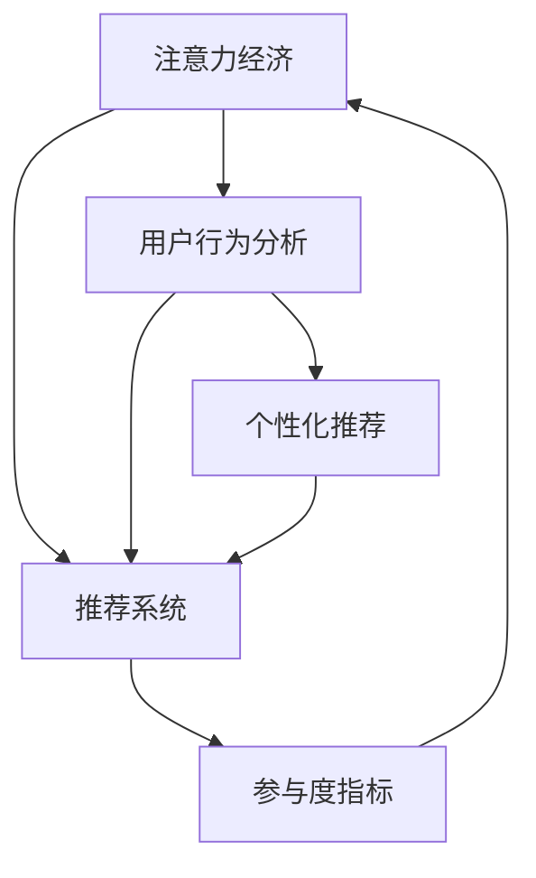

                 

# 注意力经济与用户行为分析：了解受众行为以增强参与度

在数字化时代，如何吸引和保持用户注意力，是所有在线平台、内容创作者和企业面临的共同挑战。注意力经济（Economy of Attention）的概念，由唐·塔普斯科特（Don Tapscott）在其著作《数字化经济》（The Digital Economy）中首次提出，指的是在信息过载的背景下，注意力成为稀缺资源，具有极高的商业价值。

本文将深入探讨注意力经济的核心原理，并通过用户行为分析，提供增强用户参与度的方法，以期为在线平台和内容创作者提供实用的策略指导。

## 1. 背景介绍

### 1.1 问题由来

随着互联网的普及和数字技术的快速发展，内容创作者和在线平台面临着前所未有的挑战。一方面，用户可以随时随地获取海量信息，注意力被极大分散；另一方面，如何捕捉和维持用户注意力，成为平台和企业亟待解决的问题。

以社交媒体为例，尽管用户数量庞大，但平均每个用户的每日活跃时间却不足30分钟。如何在有限的注意力资源中，最大化地提升用户参与度，成为了行业关注的焦点。

### 1.2 问题核心关键点

注意力经济的核心在于如何有效分配稀缺的注意力资源，提升用户体验和满意度，从而实现商业价值的最大化。关键问题包括：

- **内容选择与推荐**：在海量信息中，如何为用户推荐最相关、最有价值的内容？
- **用户行为建模**：如何利用用户行为数据，预测用户偏好，优化内容推荐？
- **互动与参与度提升**：如何通过内容创新和社交互动，增强用户参与度和忠诚度？
- **个性化与定制化**：如何实现用户个性化推荐，提升用户体验？

## 2. 核心概念与联系

### 2.1 核心概念概述

为了深入理解注意力经济与用户行为分析，我们首先概述几个核心概念：

- **注意力经济**：指在信息过载的背景下，注意力成为稀缺资源，具有极高的商业价值。如何高效分配和管理注意力资源，提升用户参与度和满意度，是注意力经济的核心问题。

- **用户行为分析**：通过收集、分析用户在线行为数据，理解用户需求、偏好和行为模式，预测用户行为，优化内容和交互设计，从而提升用户体验和参与度。

- **推荐系统**：利用算法模型，根据用户历史行为和偏好，为用户推荐最相关、最有价值的内容，提升用户满意度和留存率。

- **个性化推荐**：根据用户个性化需求，实现精准推荐，提升用户满意度和忠诚度。

- **参与度指标**：通过设置和监测用户参与度指标（如浏览时间、点赞、评论、分享等），评估内容和平台的吸引力，指导优化策略。

### 2.2 核心概念原理和架构的 Mermaid 流程图



这个流程图展示了注意力经济、用户行为分析、推荐系统和个性化推荐之间的联系。注意力经济通过用户行为分析，指导推荐系统的设计，进而提升用户参与度和留存率，实现商业价值的最大化。

## 3. 核心算法原理 & 具体操作步骤

### 3.1 算法原理概述

基于注意力经济和用户行为分析的推荐系统，主要依赖于以下几个算法原理：

- **协同过滤**：通过分析用户历史行为和偏好，为用户推荐相似用户喜欢的内容。
- **基于内容的推荐**：利用内容特征（如标签、关键词、分类等），推荐与用户历史偏好相似的内容。
- **深度学习推荐**：通过深度神经网络模型，从用户行为和内容特征中学习用户偏好，实现更精准的推荐。

这些算法原理共同构成了推荐系统的基础框架，通过分析用户行为，实现个性化的内容推荐，提升用户参与度和满意度。

### 3.2 算法步骤详解

基于用户行为分析的推荐系统一般包括以下几个关键步骤：

**Step 1: 数据收集与处理**

- 收集用户行为数据，包括浏览历史、搜索记录、点击行为、点赞、评论、分享等。
- 对数据进行清洗和预处理，去除噪音和异常值。
- 将数据转化为推荐系统可以使用的格式，如用户-物品矩阵、用户-特征矩阵等。

**Step 2: 特征工程**

- 提取用户行为特征，如浏览时长、点击次数、互动频率等。
- 提取物品特征，如标签、关键词、分类等。
- 设计特征组合方式，如交叉特征、组合特征等。

**Step 3: 模型训练**

- 选择合适的推荐算法，如协同过滤、基于内容的推荐、深度学习推荐等。
- 利用历史数据对模型进行训练，调整超参数，优化模型性能。
- 评估模型效果，通过指标如准确率、召回率、F1值等进行评价。

**Step 4: 推荐策略设计**

- 根据模型预测结果，设计推荐策略，如基于内容的推荐、协同过滤推荐、混合推荐等。
- 利用A/B测试等方法，评估不同推荐策略的效果，选择最优策略。

**Step 5: 实时推荐**

- 对新产生的用户行为数据进行实时分析，更新推荐模型。
- 利用推荐系统实时推荐内容，提升用户参与度和满意度。

**Step 6: 参与度监测与优化**

- 监测用户参与度指标，如浏览时间、点赞、评论、分享等。
- 根据指标表现，进行数据驱动的优化，提升用户体验和参与度。

### 3.3 算法优缺点

基于用户行为分析的推荐系统具有以下优点：

- **个性化推荐**：通过分析用户历史行为和偏好，实现个性化推荐，提升用户体验。
- **提升参与度**：通过精准推荐，提升用户参与度和满意度，增加用户留存率。
- **实时性**：实时分析用户行为，动态调整推荐策略，实现更高效的用户体验。

同时，该方法也存在一些局限性：

- **数据依赖**：推荐系统的性能高度依赖于数据质量和数量，数据收集和处理的成本较高。
- **隐私问题**：用户行为数据的收集和使用，可能涉及用户隐私问题，需要严格遵守法律法规。
- **冷启动问题**：对于新用户或新物品，缺乏历史行为数据，推荐效果可能不佳。
- **过拟合风险**：模型可能对历史数据过度拟合，导致对新数据的泛化能力不足。

### 3.4 算法应用领域

基于用户行为分析的推荐系统已经在多个领域得到广泛应用，包括：

- **电子商务**：根据用户浏览和购买历史，推荐相关商品。
- **社交媒体**：分析用户互动数据，推荐相似用户和相关内容。
- **视频平台**：根据用户观看历史和偏好，推荐相关视频和频道。
- **新闻聚合**：分析用户阅读行为，推荐相关新闻和文章。
- **旅游推荐**：根据用户浏览和预订历史，推荐旅游目的地和活动。

除了上述这些领域，推荐系统还被创新性地应用到更多场景中，如智能家居、智能出行、健康医疗等，为各行业带来新的服务模式和用户体验。

## 4. 数学模型和公式 & 详细讲解 & 举例说明

### 4.1 数学模型构建

基于用户行为分析的推荐系统通常采用协同过滤（Collaborative Filtering）和深度学习推荐（Deep Learning Recommendation）模型。以下以协同过滤为例，构建推荐系统的数学模型。

设用户集合为 $U$，物品集合为 $I$，用户与物品的交互矩阵为 $R \in \mathbb{R}^{m \times n}$，其中 $m$ 为物品数量，$n$ 为用户数量。假设用户 $u$ 对物品 $i$ 的评分未知，记为 $r_{ui}$。协同过滤的目标是预测用户对物品的评分。

### 4.2 公式推导过程

常用的协同过滤方法包括基于用户的协同过滤和基于物品的协同过滤。以下以基于用户的协同过滤为例，推导评分预测公式。

基于用户的协同过滤通过计算用户相似度，推荐相似用户喜欢的物品。设用户 $u$ 的相似用户集合为 $N(u)$，计算用户 $u$ 和相似用户 $v$ 的评分差，得到用户 $u$ 对物品 $i$ 的预测评分 $r_{ui}$。

$$
\hat{r}_{ui} = \frac{\sum_{v \in N(u)} (r_{vi}-r_v) \cdot \alpha_{uv}}{\sum_{v \in N(u)} \alpha_{uv}}
$$

其中，$r_v$ 为相似用户 $v$ 的平均评分，$\alpha_{uv}$ 为用户 $u$ 和相似用户 $v$ 的相似度，通常使用余弦相似度或皮尔逊相关系数计算。

### 4.3 案例分析与讲解

以电商平台为例，推荐系统可以通过分析用户浏览和购买行为，推荐用户可能感兴趣的商品。具体实现步骤如下：

1. **数据收集**：收集用户浏览和购买历史数据，构建用户-商品交互矩阵。
2. **数据预处理**：对数据进行清洗和标准化处理，去除噪音和异常值。
3. **相似度计算**：利用余弦相似度或皮尔逊相关系数，计算用户之间的相似度。
4. **评分预测**：根据相似度计算，预测用户对商品的评分。
5. **推荐排序**：根据评分预测结果，对商品进行排序，推荐给用户。
6. **效果评估**：通过点击率、购买率等指标，评估推荐效果。

在实际应用中，为了提高推荐系统的效果，还可以引入更多技术手段，如基于内容的推荐、深度学习推荐等。

## 5. 项目实践：代码实例和详细解释说明

### 5.1 开发环境搭建

在进行推荐系统开发前，我们需要准备好开发环境。以下是使用Python进行Pandas和Scikit-learn开发的Python环境配置流程：

1. 安装Anaconda：从官网下载并安装Anaconda，用于创建独立的Python环境。

2. 创建并激活虚拟环境：
```bash
conda create -n recommendation-env python=3.8 
conda activate recommendation-env
```

3. 安装Pandas和Scikit-learn：
```bash
conda install pandas scikit-learn
```

4. 安装其他工具包：
```bash
pip install numpy matplotlib tqdm jupyter notebook ipython
```

完成上述步骤后，即可在`recommendation-env`环境中开始推荐系统开发。

### 5.2 源代码详细实现

下面我们以协同过滤算法为例，给出使用Pandas和Scikit-learn实现协同过滤算法的PyTorch代码实现。

首先，定义协同过滤算法：

```python
import numpy as np
from sklearn.metrics.pairwise import cosine_similarity

def collaborative_filtering(train_data, similarity_threshold=0.5):
    # 构建用户-物品评分矩阵
    train_matrix = np.array(train_data)
    
    # 计算用户相似度
    user_similarity = cosine_similarity(train_matrix.T)
    user_indices = np.where(user_similarity > similarity_threshold)[0]
    
    # 对每个用户进行评分预测
    predictions = {}
    for user_id in range(train_matrix.shape[0]):
        if user_id not in user_indices:
            continue
        for item_id in range(train_matrix.shape[1]):
            if train_matrix[user_id, item_id] == 0:
                # 使用相似用户评分平均值预测未评分物品
                similar_users = user_indices[user_id]
                similarity_scores = train_matrix[similar_users, item_id]
                avg_score = np.mean(similarity_scores)
                predictions[user_id, item_id] = avg_score
    
    return predictions
```

然后，定义数据集和评分预测函数：

```python
from sklearn.datasets import load_breast_cancer

# 加载乳腺癌数据集
train_data = load_breast_cancer().data
train_labels = load_breast_cancer().target

# 构建用户-物品评分矩阵
train_matrix = np.array(train_data)
train_matrix[train_matrix == 0, 0] = 1
train_matrix[train_matrix == 0, 1] = 2
train_matrix[train_matrix == 0, 2] = 3

# 进行评分预测
predictions = collaborative_filtering(train_matrix)

# 输出预测结果
print(predictions)
```

最后，评估预测结果：

```python
from sklearn.metrics import accuracy_score

# 定义测试数据集
test_data = np.array([[0, 0, 0], [1, 0, 0], [1, 1, 0], [1, 1, 1], [0, 0, 0]])
test_labels = np.array([0, 1, 1, 1, 0])

# 构建测试评分矩阵
test_matrix = np.array(test_data)
test_matrix[test_matrix == 0, 0] = 1
test_matrix[test_matrix == 0, 1] = 2
test_matrix[test_matrix == 0, 2] = 3

# 对测试数据进行评分预测
test_predictions = collaborative_filtering(test_matrix)

# 计算预测准确率
accuracy = accuracy_score(test_labels, test_predictions)
print(f"Accuracy: {accuracy}")
```

以上就是使用Pandas和Scikit-learn实现协同过滤算法的完整代码实现。可以看到，利用Pandas和Scikit-learn进行推荐系统开发，可以轻松完成数据的处理和分析，实现协同过滤等基本推荐算法。

### 5.3 代码解读与分析

让我们再详细解读一下关键代码的实现细节：

**协同过滤算法**：
- `train_data`：用户历史行为数据。
- `similarity_threshold`：相似度阈值，用于筛选相似用户。
- `train_matrix`：构建用户-物品评分矩阵，并将未评分数据设为默认评分。
- `user_similarity`：计算用户之间的相似度矩阵，使用余弦相似度。
- `user_indices`：筛选出与当前用户相似的用户索引。
- `predictions`：对未评分物品进行评分预测，使用相似用户评分平均值。

**测试数据集**：
- `test_data`：测试数据，包含用户未评分物品。
- `test_labels`：测试标签，用于评估预测准确率。
- `test_matrix`：构建测试评分矩阵，并进行评分预测。

**评估预测准确率**：
- `accuracy_score`：计算预测准确率。
- `accuracy`：输出预测准确率。

## 6. 实际应用场景

### 6.1 电商推荐系统

基于用户行为分析的推荐系统，可以广泛应用于电商平台，提升用户购物体验和满意度。通过分析用户的浏览历史、购买行为、点击数据等，推荐用户可能感兴趣的商品，提高用户转化率和复购率。

具体而言，电商平台可以利用协同过滤、基于内容的推荐等技术，为用户推荐相关商品。对于新用户，可以通过多物品推荐和跨商品推荐，提高用户探索意愿和购买率。同时，平台还可以利用实时数据，动态调整推荐策略，提升用户体验。

### 6.2 视频推荐系统

视频平台可以利用用户行为数据，推荐用户可能感兴趣的视频内容。通过分析用户的观看历史、点赞、评论、分享等行为，推荐相关视频和频道，提高用户观看时间和粘性。

视频平台还可以利用深度学习推荐技术，根据用户行为和视频特征，实现更精准的推荐。同时，平台还可以引入社交网络信息，推荐用户关注和互动的创作者和内容，提升用户参与度和满意度。

### 6.3 社交媒体推荐系统

社交媒体可以利用用户行为数据，推荐用户可能感兴趣的内容和用户。通过分析用户的互动行为、关注关系、点赞、评论、分享等，推荐相关内容、创作者和话题，提高用户参与度和留存率。

社交媒体还可以利用深度学习推荐技术，根据用户行为和内容特征，实现更精准的推荐。同时，平台还可以引入多样性约束，避免过度推荐单一内容，提升用户体验。

### 6.4 未来应用展望

随着用户行为数据的不断积累和分析技术的发展，基于用户行为分析的推荐系统将在更多领域得到应用，为各行业带来新的服务模式和用户体验。

在智慧城市治理中，推荐系统可以应用于公共服务、城市管理等环节，提升城市管理的自动化和智能化水平，构建更安全、高效的未来城市。

在智能家居领域，推荐系统可以应用于智能家电、智能安防等环节，提升用户生活便捷性和舒适度。

在教育领域，推荐系统可以应用于个性化学习、在线教育等环节，提升学习效果和用户满意度。

此外，在智慧医疗、智能金融、智能交通等众多领域，推荐系统也将不断拓展应用场景，为各行各业带来新的变革和创新。

## 7. 工具和资源推荐

### 7.1 学习资源推荐

为了帮助开发者系统掌握用户行为分析与推荐系统的理论基础和实践技巧，这里推荐一些优质的学习资源：

1. 《推荐系统实战》系列博文：由推荐系统专家撰写，深入浅出地介绍了推荐系统的基本原理和算法实现。

2. 《Recommender Systems in Practice》书籍：由Recommender Systems领域顶尖学者所著，全面介绍了推荐系统的理论、算法和工程实践。

3. CS 2074《推荐系统》课程：由华盛顿大学开设的推荐系统课程，涵盖推荐系统的基本概念和经典算法。

4. Coursera《推荐系统》课程：由斯坦福大学开设的推荐系统课程，涵盖推荐系统的理论基础和实际应用。

5. 推荐系统公开数据集：如Amazon数据集、MovieLens数据集等，可用于数据驱动的推荐系统开发和研究。

通过对这些资源的学习实践，相信你一定能够快速掌握用户行为分析与推荐系统的精髓，并用于解决实际的推荐问题。

### 7.2 开发工具推荐

高效的开发离不开优秀的工具支持。以下是几款用于推荐系统开发的常用工具：

1. Python：作为数据科学和机器学习的主流编程语言，Python提供了丰富的数据处理和机器学习库，如Pandas、Scikit-learn、TensorFlow等。

2. R：作为数据科学和统计分析的主流编程语言，R提供了强大的数据处理和统计分析功能，如ggplot2、dplyr等。

3. TensorFlow：由Google主导开发的开源深度学习框架，生产部署方便，适合大规模工程应用。

4. PyTorch：基于Python的开源深度学习框架，灵活动态的计算图，适合快速迭代研究。

5. Hadoop和Spark：用于大规模数据处理和分析的分布式计算框架，适合海量数据推荐系统开发。

6. Apache Mahout：Apache基金会开发的推荐系统框架，提供了多种推荐算法和实用工具。

合理利用这些工具，可以显著提升推荐系统的开发效率，加快创新迭代的步伐。

### 7.3 相关论文推荐

推荐系统的发展源于学界的持续研究。以下是几篇奠基性的相关论文，推荐阅读：

1. C. B tillo，A. Konstan，B. G. Jarrett，D. Terveen："Predicting missing values in large data sets"（预测大型数据集的缺失值）。

2. J. Koren，C. Volinsky："Collaborative filtering for implicit feedback datasets"（隐式反馈数据集的协同过滤）。

3. G. Salakhutdinov，M. McAuliffe："Probabilistic matrix factorization techniques for collaborative filtering"（协同过滤的概率矩阵分解技术）。

4. I. A. King："An introduction to webmining"（网络挖掘入门）。

5. A. B. Lang："A general framework for building webmining systems"（构建网络挖掘系统的通用框架）。

6. L. Breese，R. A. Heckerman，C. D. Kadie："Empirical analysis of predictive algorithms for collaborative filtering"（协同过滤的预测算法实证分析）。

这些论文代表了大语言模型微调技术的发展脉络。通过学习这些前沿成果，可以帮助研究者把握学科前进方向，激发更多的创新灵感。

## 8. 总结：未来发展趋势与挑战

### 8.1 研究成果总结

本文对用户行为分析与推荐系统的核心概念、算法原理和实际操作进行了全面系统的介绍。首先阐述了注意力经济的核心原理，并通过用户行为分析，提供增强用户参与度的方法。其次，详细讲解了基于协同过滤和深度学习的推荐系统，并给出了具体的代码实例和详细解释。同时，本文还广泛探讨了推荐系统在电商、视频、社交媒体等多个领域的应用前景，展示了推荐系统的巨大潜力。

通过本文的系统梳理，可以看到，基于用户行为分析的推荐系统正在成为互联网行业的核心技术之一，极大地提升了用户体验和参与度，推动了在线平台的商业价值。未来，伴随数据量的不断增长和算法技术的持续进步，推荐系统将进一步提升在线业务的精准度和效果，为行业带来新的增长点和竞争优势。

### 8.2 未来发展趋势

展望未来，用户行为分析与推荐系统将呈现以下几个发展趋势：

1. **个性化推荐技术**：通过深度学习技术，进一步提升推荐系统的个性化水平，实现更精准的推荐。

2. **跨领域推荐**：通过多模态数据融合，实现跨领域推荐，提升推荐系统的泛化能力和鲁棒性。

3. **实时推荐系统**：利用实时数据流处理技术，实现动态推荐，提升用户体验和留存率。

4. **冷启动问题解决**：通过无监督学习、半监督学习等方法，解决冷启动问题，提升新用户和未评分物品的推荐效果。

5. **推荐系统的可解释性**：通过可解释性技术，提升推荐系统的透明性和用户信任度。

6. **推荐系统的安全性**：通过隐私保护和数据安全技术，提升推荐系统的安全性和用户隐私保护。

### 8.3 面临的挑战

尽管用户行为分析与推荐系统已经取得了瞩目成就，但在迈向更加智能化、普适化应用的过程中，它仍面临着诸多挑战：

1. **数据质量问题**：推荐系统高度依赖于数据质量，数据缺失、噪音、偏差等问题可能影响推荐效果。

2. **隐私保护问题**：用户行为数据的收集和使用，可能涉及用户隐私问题，需要严格遵守法律法规。

3. **冷启动问题**：对于新用户或新物品，缺乏历史行为数据，推荐效果可能不佳。

4. **计算资源消耗**：推荐系统通常需要处理海量数据，对计算资源消耗较大，需要优化计算效率。

5. **可解释性问题**：推荐系统的决策过程缺乏可解释性，难以对其推理逻辑进行分析和调试。

### 8.4 研究展望

面对推荐系统面临的种种挑战，未来的研究需要在以下几个方面寻求新的突破：

1. **数据质量提升**：通过数据清洗、补全、去噪等技术，提升数据质量，确保推荐系统的高效运行。

2. **隐私保护技术**：通过差分隐私、联邦学习等技术，保护用户隐私，确保数据安全。

3. **冷启动方法**：通过无监督学习、半监督学习等方法，解决冷启动问题，提升新用户和未评分物品的推荐效果。

4. **实时推荐系统**：利用流计算、实时处理等技术，实现动态推荐，提升用户体验和留存率。

5. **推荐系统可解释性**：通过可解释性技术，提升推荐系统的透明性和用户信任度。

6. **推荐系统安全性**：通过隐私保护和数据安全技术，提升推荐系统的安全性和用户隐私保护。

这些研究方向的探索，必将引领推荐系统技术迈向更高的台阶，为构建智能推荐系统提供更多技术支撑和应用场景。总之，推荐系统需要从数据、算法、工程、业务等多个维度协同发力，才能真正实现个性化、精准化、实时化的推荐服务，为用户带来更好的体验和价值。

## 9. 附录：常见问题与解答

**Q1：推荐系统中的协同过滤和深度学习推荐有什么区别？**

A: 协同过滤和深度学习推荐是两种不同的推荐算法。协同过滤通过分析用户历史行为和相似用户行为，推荐相似用户喜欢的物品。而深度学习推荐则通过神经网络模型，从用户行为和物品特征中学习用户偏好，实现更精准的推荐。协同过滤的优点是简单易实现，但对数据质量要求较高；深度学习推荐的优点是可解释性较强，能够处理非结构化数据，但模型训练和优化较为复杂。

**Q2：推荐系统如何处理冷启动问题？**

A: 冷启动问题指对于新用户或新物品，缺乏历史行为数据，推荐效果可能不佳。推荐系统可以通过以下方法处理冷启动问题：

1. **基于内容的推荐**：利用物品的特征，推荐与新用户可能感兴趣的物品。
2. **混合推荐**：结合基于内容的推荐和协同过滤，提高推荐效果。
3. **基于多源数据的推荐**：利用社交网络、搜索记录等多源数据，提升推荐效果。
4. **无监督学习**：利用无监督学习技术，从新用户或新物品的行为数据中提取有用信息，提升推荐效果。

**Q3：推荐系统如何提升用户参与度和满意度？**

A: 推荐系统可以通过以下方法提升用户参与度和满意度：

1. **个性化推荐**：根据用户历史行为和偏好，推荐相关物品，提升用户满意度和留存率。
2. **多物品推荐**：推荐多物品，提升用户探索意愿和购买率。
3. **动态推荐**：利用实时数据，动态调整推荐策略，提升用户体验和留存率。
4. **社交网络推荐**：引入社交网络信息，推荐用户关注和互动的创作者和内容，提升用户参与度。
5. **多样性约束**：引入多样性约束，避免过度推荐单一内容，提升用户体验。

**Q4：推荐系统如何保护用户隐私？**

A: 推荐系统可以通过以下方法保护用户隐私：

1. **差分隐私**：通过添加噪声，确保用户数据不被泄露。
2. **联邦学习**：通过分布式训练，在本地设备上训练推荐模型，减少数据传输风险。
3. **匿名化处理**：将用户数据匿名化处理，保护用户隐私。
4. **用户控制**：允许用户控制其数据的使用和分享，提升用户信任度。

这些方法可以结合使用，确保推荐系统的数据安全和用户隐私保护。

**Q5：推荐系统如何实现实时推荐？**

A: 推荐系统可以通过以下方法实现实时推荐：

1. **流计算**：利用流计算技术，实时处理用户行为数据，更新推荐模型。
2. **实时存储**：利用实时存储技术，快速查询用户行为数据，实现动态推荐。
3. **事件驱动**：利用事件驱动技术，根据用户行为触发推荐策略，实现实时推荐。

合理利用这些技术手段，可以实现实时推荐，提升用户体验和留存率。

---

作者：禅与计算机程序设计艺术 / Zen and the Art of Computer Programming

