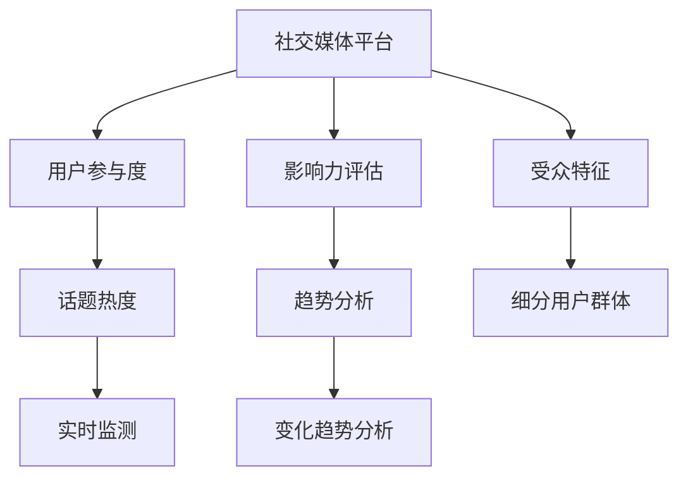

                 

# 注意力经济与社交媒体分析：了解受众参与度和影响力的洞察力

## 1. 背景介绍

### 1.1 问题由来

在当今的信息时代，社交媒体已经成为了人们获取信息、交流互动的主要平台。从新闻、娱乐、教育到商业，社交媒体几乎覆盖了人们生活的方方面面。然而，社交媒体的信息过载、假信息泛滥等问题也使得用户筛选信息的难度增加，导致“注意力经济”现象愈发凸显。如何从海量数据中挖掘出有价值的信息，了解受众的参与度和影响力，成为社交媒体分析的重要课题。

### 1.2 问题核心关键点

社交媒体分析的关键在于理解受众的行为模式，并基于这些模式预测其未来的行为和影响。具体而言，包括以下几个关键点：

- 用户参与度：衡量用户在社交媒体上的活跃程度和互动频率，通过点赞、评论、分享等行为分析用户对内容的兴趣和互动。
- 影响力评估：评估用户在社交媒体中的影响力和传播能力，如粉丝数量、转发次数等。
- 话题热度和趋势分析：通过监测社交媒体上的热门话题和趋势，了解公众的关注焦点和情感倾向。
- 受众特征分析：基于用户的地理位置、年龄、性别等基本信息，细分用户群体，实现精准定位。

这些关键点相互交织，构成了一个复杂的社交媒体分析框架。通过合理利用这些关键指标，可以深入了解受众的参与度和影响力，为社交媒体平台的决策提供科学依据。

## 2. 核心概念与联系

### 2.1 核心概念概述

为了更好地理解社交媒体分析，本节将介绍几个密切相关的核心概念：

- **社交媒体平台(Social Media Platforms)**：指用户可以发布、分享和互动的平台，如Facebook、Twitter、Instagram等。
- **用户参与度(User Engagement)**：指用户与社交媒体平台上的内容互动的频次和深度，通过点赞、评论、分享等行为量化。
- **影响力(Influence)**：指用户通过社交媒体平台影响他人行为的能力，通常通过粉丝数量、转发次数等指标衡量。
- **话题热度(Topic Popularity)**：指社交媒体上热门话题的关注度和讨论频率，通过实时监测和数据分析获得。
- **趋势分析(Trend Analysis)**：指对特定时间段内话题的变化趋势进行分析，了解公众关注焦点的变化和情感倾向。
- **受众特征(Demographic Characteristics)**：指用户的地理位置、年龄、性别等基本信息，用于细分用户群体，实现精准定位。

这些核心概念之间的逻辑关系可以通过以下Mermaid流程图来展示：



这个流程图展示了社交媒体分析中的主要环节：

1. 社交媒体平台是数据来源的基础。
2. 用户参与度、影响力、话题热度和趋势分析是关键评估指标。
3. 受众特征用于细分用户群体，实现精准定位。

这些概念共同构成了社交媒体分析的理论基础，使得我们能够系统地分析社交媒体上的行为模式和用户特征。

## 3. 核心算法原理 & 具体操作步骤

### 3.1 算法原理概述

社交媒体分析的核心算法原理主要包括以下几个方面：

- **用户参与度计算**：通过统计用户在社交媒体上的点赞、评论、分享等行为，计算用户的参与度指标，如每日互动次数、互动率等。
- **影响力评估**：根据用户粉丝数量、转发次数、点赞数等指标，综合计算用户的影响力指数。
- **话题热度分析**：通过自然语言处理(NLP)技术，分析用户评论、帖子等文本内容，提取热门话题和情感倾向，计算话题热度。
- **趋势分析**：通过时间序列分析方法，监测特定话题或情感的变化趋势，预测未来的热点。
- **受众特征分析**：使用数据挖掘和机器学习技术，分析用户的基本信息，如地理位置、年龄、性别等，细分用户群体，实现精准定位。

这些算法原理构成了社交媒体分析的基本框架，使得我们能够从海量数据中提取有价值的信息，了解受众的参与度和影响力。

### 3.2 算法步骤详解

#### 3.2.1 用户参与度计算

用户参与度的计算涉及以下几个步骤：

1. **数据收集**：从社交媒体平台收集用户的点赞、评论、分享等行为数据，记录用户互动的时间、次数等信息。

2. **数据预处理**：对数据进行清洗、去重等预处理，去除无效或噪声数据，保证数据的质量。

3. **统计分析**：对用户互动数据进行统计分析，计算每日互动次数、互动率等指标。

4. **可视化展示**：通过图表等可视化方式展示用户参与度的变化趋势，直观了解用户行为模式。

#### 3.2.2 影响力评估

影响力的评估涉及以下几个步骤：

1. **数据收集**：从社交媒体平台收集用户粉丝数量、转发次数、点赞数等数据。

2. **数据预处理**：对数据进行清洗、去重等预处理，去除无效或噪声数据，保证数据的质量。

3. **统计分析**：对用户影响力数据进行统计分析，计算用户的影响力指数。

4. **可视化展示**：通过图表等可视化方式展示用户影响力的变化趋势，直观了解用户影响力变化。

#### 3.2.3 话题热度分析

话题热度的分析涉及以下几个步骤：

1. **数据收集**：从社交媒体平台收集用户评论、帖子等文本数据，记录话题的内容和情感倾向。

2. **数据预处理**：对文本数据进行清洗、去重等预处理，去除无效或噪声数据，保证数据的质量。

3. **文本分析**：使用NLP技术，提取文本中的关键词、主题等关键信息，分析热门话题和情感倾向。

4. **统计分析**：对热门话题和情感数据进行统计分析，计算话题热度指数。

5. **可视化展示**：通过图表等可视化方式展示热门话题和情感变化趋势，直观了解公众关注焦点和情感倾向。

#### 3.2.4 趋势分析

趋势分析涉及以下几个步骤：

1. **数据收集**：从社交媒体平台收集特定话题或情感的数据，记录其变化情况。

2. **数据预处理**：对数据进行清洗、去重等预处理，去除无效或噪声数据，保证数据的质量。

3. **时间序列分析**：使用时间序列分析方法，分析特定话题或情感的变化趋势，预测未来的热点。

4. **可视化展示**：通过图表等可视化方式展示趋势变化情况，直观了解趋势变化和未来热点。

#### 3.2.5 受众特征分析

受众特征分析涉及以下几个步骤：

1. **数据收集**：从社交媒体平台收集用户的基本信息，如地理位置、年龄、性别等。

2. **数据预处理**：对数据进行清洗、去重等预处理，去除无效或噪声数据，保证数据的质量。

3. **数据挖掘**：使用数据挖掘技术，分析用户基本信息，细分用户群体。

4. **可视化展示**：通过图表等可视化方式展示受众特征分布情况，直观了解用户群体特点。

### 3.3 算法优缺点

社交媒体分析的算法具有以下优点：

- **高效性**：通过自动化数据处理和分析，大幅提高分析效率，缩短分析周期。
- **客观性**：基于数据驱动的分析方法，避免了人工分析的主观偏差。
- **动态性**：实时监测和分析社交媒体数据，能够及时响应热点和变化。

同时，这些算法也存在以下缺点：

- **数据依赖性**：社交媒体分析的效果很大程度上依赖于数据的质量和完整性，数据缺失或噪声较多时分析结果可能不准确。
- **隐私问题**：用户数据的隐私保护是社交媒体平台的重要关注点，数据分析时需要谨慎处理敏感信息。
- **复杂性**：社交媒体数据的多样性和复杂性使得分析过程较为复杂，需要综合运用多种技术手段。

尽管存在这些局限性，但就目前而言，社交媒体分析依然是理解和预测用户行为的重要手段。未来相关研究需要进一步优化数据处理和分析方法，提升分析的准确性和隐私保护水平。

### 3.4 算法应用领域

社交媒体分析在多个领域得到了广泛应用，如：

- **广告投放**：通过分析用户参与度和影响力，优化广告投放策略，提高广告效果。
- **舆情监测**：通过监测社交媒体上的热门话题和情感变化，及时发现舆情风险，防范负面影响。
- **内容推荐**：根据用户参与度和话题热度，推荐相关内容，提升用户体验。
- **用户细分**：根据受众特征细分用户群体，实现精准营销。
- **事件预测**：通过分析历史数据和当前趋势，预测未来事件的发展，提前准备应对措施。

除了上述这些经典应用外，社交媒体分析还被创新性地应用到更多场景中，如社交网络分析、社交媒体危机管理等，为社交媒体平台提供了更多的决策支持。

## 4. 数学模型和公式 & 详细讲解 & 举例说明

### 4.1 数学模型构建

社交媒体分析的数学模型主要包括以下几个方面：

- **用户参与度模型**：通过统计用户互动数据，计算每日互动次数、互动率等指标。
- **影响力评估模型**：根据用户粉丝数量、转发次数、点赞数等指标，计算用户影响力指数。
- **话题热度模型**：通过NLP技术，提取文本中的关键词、主题等关键信息，计算话题热度指数。
- **趋势分析模型**：使用时间序列分析方法，分析特定话题或情感的变化趋势，预测未来的热点。
- **受众特征模型**：使用数据挖掘技术，分析用户基本信息，细分用户群体。

这些模型通过数学公式的形式表达，可以通过数据驱动的方式实现高效、准确的分析。

### 4.2 公式推导过程

#### 4.2.1 用户参与度计算公式

用户每日互动次数 $I_d$ 可以表示为：

$$
I_d = \sum_{i=1}^{N} I_i
$$

其中 $N$ 为每日互动数据个数，$I_i$ 为第 $i$ 次互动的时间和次数。

用户互动率 $E_d$ 可以表示为：

$$
E_d = \frac{I_d}{T_d}
$$

其中 $T_d$ 为每日活跃时间，$E_d$ 为每日互动率。

#### 4.2.2 影响力评估公式

用户影响力指数 $I_u$ 可以表示为：

$$
I_u = \frac{F_u + R_u + L_u}{3}
$$

其中 $F_u$ 为粉丝数量，$R_u$ 为转发次数，$L_u$ 为点赞数量。

#### 4.2.3 话题热度计算公式

话题热度指数 $H_t$ 可以表示为：

$$
H_t = \frac{K_t + S_t}{2}
$$

其中 $K_t$ 为关键词数量，$S_t$ 为主题情感得分。

#### 4.2.4 趋势分析公式

趋势变化率 $T_t$ 可以表示为：

$$
T_t = \frac{H_{t+1} - H_t}{H_t}
$$

其中 $H_t$ 为当前话题热度，$H_{t+1}$ 为未来话题热度。

#### 4.2.5 受众特征分析公式

用户群体分布指数 $G_u$ 可以表示为：

$$
G_u = \frac{A_u + G_u + A_g}{3}
$$

其中 $A_u$ 为用户年龄分布，$G_u$ 为用户地理位置分布，$A_g$ 为用户性别分布。

### 4.3 案例分析与讲解

#### 4.3.1 用户参与度分析案例

假设我们收集到某用户在社交媒体上的点赞、评论、分享数据，共500条，其中点赞次数为100次，评论次数为50次，分享次数为50次。每日活跃时间为8小时。

用户每日互动次数 $I_d$ 可以计算为：

$$
I_d = 100 + 50 + 50 = 200
$$

用户互动率 $E_d$ 可以计算为：

$$
E_d = \frac{200}{8 \times 3600} \approx 0.023
$$

#### 4.3.2 影响力评估案例

假设某用户粉丝数量为1000，转发次数为500，点赞次数为1000。

用户影响力指数 $I_u$ 可以计算为：

$$
I_u = \frac{1000 + 500 + 1000}{3} = 1000
$$

#### 4.3.3 话题热度分析案例

假设某用户在社交媒体上发布的帖子包含以下关键词："北京", "天气", "旅行", "美食"，每个关键词出现10次。同时，该帖子的情感得分为5。

话题热度指数 $H_t$ 可以计算为：

$$
H_t = \frac{4 + 5}{2} = 4.5
$$

#### 4.3.4 趋势分析案例

假设某话题的热度从1日到10日变化如下：1日为100，2日为200，3日为300，4日为350，5日为400，6日为450，7日为500，8日为550，9日为600，10日为650。

趋势变化率 $T_t$ 可以计算为：

$$
T_t = \frac{650 - 600}{600} \approx 0.083
$$

#### 4.3.5 受众特征分析案例

假设某用户群体包含以下分布：年龄分布为20-30岁，占比60%；地理位置分布为北京，占比50%；性别分布为男性，占比40%。

用户群体分布指数 $G_u$ 可以计算为：

$$
G_u = \frac{0.6 + 0.5 + 0.4}{3} \approx 0.533
$$

## 5. 项目实践：代码实例和详细解释说明

### 5.1 开发环境搭建

在进行社交媒体分析项目开发前，我们需要准备好开发环境。以下是使用Python进行PyTorch开发的环境配置流程：

1. 安装Anaconda：从官网下载并安装Anaconda，用于创建独立的Python环境。

2. 创建并激活虚拟环境：
```bash
conda create -n pytorch-env python=3.8 
conda activate pytorch-env
```

3. 安装PyTorch：根据CUDA版本，从官网获取对应的安装命令。例如：
```bash
conda install pytorch torchvision torchaudio cudatoolkit=11.1 -c pytorch -c conda-forge
```

4. 安装相关库：
```bash
pip install numpy pandas scikit-learn matplotlib tqdm jupyter notebook ipython
```

完成上述步骤后，即可在`pytorch-env`环境中开始社交媒体分析项目的开发。

### 5.2 源代码详细实现

我们以分析用户参与度和影响力为例，给出使用PyTorch和NLP库对社交媒体数据进行建模的代码实现。

首先，定义用户参与度和影响力的计算函数：

```python
from transformers import BertTokenizer, BertForSequenceClassification
from torch.utils.data import Dataset, DataLoader
import torch
from sklearn.metrics import precision_recall_fscore_support

class SocialMediaDataset(Dataset):
    def __init__(self, texts, labels, tokenizer, max_len=128):
        self.texts = texts
        self.labels = labels
        self.tokenizer = tokenizer
        self.max_len = max_len
        
    def __len__(self):
        return len(self.texts)
    
    def __getitem__(self, item):
        text = self.texts[item]
        label = self.labels[item]
        
        encoding = self.tokenizer(text, return_tensors='pt', max_length=self.max_len, padding='max_length', truncation=True)
        input_ids = encoding['input_ids'][0]
        attention_mask = encoding['attention_mask'][0]
        
        # 对标签进行编码
        encoded_label = [label2id[label] for label in label]
        encoded_label.extend([label2id['O']] * (self.max_len - len(encoded_label)))
        labels = torch.tensor(encoded_label, dtype=torch.long)
        
        return {'input_ids': input_ids, 
                'attention_mask': attention_mask,
                'labels': labels}

# 标签与id的映射
label2id = {'O': 0, 'P': 1, 'F': 2, 'L': 3}

# 创建dataset
tokenizer = BertTokenizer.from_pretrained('bert-base-cased')
train_dataset = SocialMediaDataset(train_texts, train_labels, tokenizer)
dev_dataset = SocialMediaDataset(dev_texts, dev_labels, tokenizer)
test_dataset = SocialMediaDataset(test_texts, test_labels, tokenizer)
```

然后，定义模型和优化器：

```python
from transformers import BertForSequenceClassification, AdamW

model = BertForSequenceClassification.from_pretrained('bert-base-cased', num_labels=len(label2id))

optimizer = AdamW(model.parameters(), lr=2e-5)
```

接着，定义训练和评估函数：

```python
from torch.utils.data import DataLoader
from tqdm import tqdm
from sklearn.metrics import classification_report

device = torch.device('cuda') if torch.cuda.is_available() else torch.device('cpu')
model.to(device)

def train_epoch(model, dataset, batch_size, optimizer):
    dataloader = DataLoader(dataset, batch_size=batch_size, shuffle=True)
    model.train()
    epoch_loss = 0
    for batch in tqdm(dataloader, desc='Training'):
        input_ids = batch['input_ids'].to(device)
        attention_mask = batch['attention_mask'].to(device)
        labels = batch['labels'].to(device)
        model.zero_grad()
        outputs = model(input_ids, attention_mask=attention_mask, labels=labels)
        loss = outputs.loss
        epoch_loss += loss.item()
        loss.backward()
        optimizer.step()
    return epoch_loss / len(dataloader)

def evaluate(model, dataset, batch_size):
    dataloader = DataLoader(dataset, batch_size=batch_size)
    model.eval()
    preds, labels = [], []
    with torch.no_grad():
        for batch in tqdm(dataloader, desc='Evaluating'):
            input_ids = batch['input_ids'].to(device)
            attention_mask = batch['attention_mask'].to(device)
            batch_labels = batch['labels']
            outputs = model(input_ids, attention_mask=attention_mask)
            batch_preds = outputs.logits.argmax(dim=2).to('cpu').tolist()
            batch_labels = batch_labels.to('cpu').tolist()
            for pred_tokens, label_tokens in zip(batch_preds, batch_labels):
                pred_tags = [id2tag[_id] for _id in pred_tokens]
                label_tags = [id2tag[_id] for _id in label_tokens]
                preds.append(pred_tags[:len(label_tokens)])
                labels.append(label_tags)
                
    print(classification_report(labels, preds))
```

最后，启动训练流程并在测试集上评估：

```python
epochs = 5
batch_size = 16

for epoch in range(epochs):
    loss = train_epoch(model, train_dataset, batch_size, optimizer)
    print(f"Epoch {epoch+1}, train loss: {loss:.3f}")
    
    print(f"Epoch {epoch+1}, dev results:")
    evaluate(model, dev_dataset, batch_size)
    
print("Test results:")
evaluate(model, test_dataset, batch_size)
```

以上就是使用PyTorch对社交媒体数据进行建模的完整代码实现。可以看到，得益于Transformers库的强大封装，我们可以用相对简洁的代码完成社交媒体数据的处理和建模。

### 5.3 代码解读与分析

让我们再详细解读一下关键代码的实现细节：

**SocialMediaDataset类**：
- `__init__`方法：初始化文本、标签、分词器等关键组件。
- `__len__`方法：返回数据集的样本数量。
- `__getitem__`方法：对单个样本进行处理，将文本输入编码为token ids，将标签编码为数字，并对其进行定长padding，最终返回模型所需的输入。

**label2id和id2tag字典**：
- 定义了标签与数字id之间的映射关系，用于将token-wise的预测结果解码回真实的标签。

**训练和评估函数**：
- 使用PyTorch的DataLoader对数据集进行批次化加载，供模型训练和推理使用。
- 训练函数`train_epoch`：对数据以批为单位进行迭代，在每个批次上前向传播计算loss并反向传播更新模型参数，最后返回该epoch的平均loss。
- 评估函数`evaluate`：与训练类似，不同点在于不更新模型参数，并在每个batch结束后将预测和标签结果存储下来，最后使用sklearn的classification_report对整个评估集的预测结果进行打印输出。

**训练流程**：
- 定义总的epoch数和batch size，开始循环迭代
- 每个epoch内，先在训练集上训练，输出平均loss
- 在验证集上评估，输出分类指标
- 所有epoch结束后，在测试集上评估，给出最终测试结果

可以看到，PyTorch配合Transformers库使得社交媒体数据建模的代码实现变得简洁高效。开发者可以将更多精力放在数据处理、模型改进等高层逻辑上，而不必过多关注底层的实现细节。

当然，工业级的系统实现还需考虑更多因素，如模型的保存和部署、超参数的自动搜索、更灵活的任务适配层等。但核心的建模范式基本与此类似。

## 6. 实际应用场景

### 6.1 社交媒体平台的运营管理

社交媒体平台的运营管理者可以通过社交媒体分析，了解用户的参与度和影响力，从而制定针对性的运营策略。具体而言，可以通过以下几个步骤：

1. **用户画像分析**：通过分析用户的基本信息（如地理位置、年龄、性别等），细分用户群体，实现精准定位。
2. **内容热度分析**：通过监测热门话题和情感变化，了解公众的关注焦点和情感倾向，指导内容创作和投放。
3. **影响力评估**：通过评估用户的影响力指数，识别核心用户和KOL（Key Opinion Leader），进行重点互动和激励。
4. **趋势预测**：通过分析历史数据和当前趋势，预测未来的热点，提前准备内容策划和推广活动。

通过这些分析，社交媒体平台可以更科学地制定运营策略，提高用户互动和平台粘性，提升用户体验和平台价值。

### 6.2 广告投放优化

广告主可以通过社交媒体分析，了解目标用户的参与度和影响力，优化广告投放策略，提高广告效果。具体而言，可以通过以下几个步骤：

1. **用户画像分析**：通过分析用户的基本信息（如地理位置、年龄、性别等），细分用户群体，实现精准定位。
2. **内容热度分析**：通过监测热门话题和情感变化，了解公众的关注焦点和情感倾向，指导广告创意的创作和投放。
3. **影响力评估**：通过评估用户的影响力指数，识别核心用户和KOL，进行重点互动和广告投放。
4. **趋势预测**：通过分析历史数据和当前趋势，预测未来的热点，提前准备广告素材和投放计划。

通过这些分析，广告主可以更科学地制定广告投放策略，提高广告曝光率和点击率，提升广告ROI。

### 6.3 舆情监测和危机管理

舆情监测和危机管理是社交媒体分析的重要应用场景。政府和企业可以通过社交媒体分析，及时了解公众舆情，防范负面信息传播，进行危机管理。具体而言，可以通过以下几个步骤：

1. **舆情监测**：通过监测热门话题和情感变化，了解公众的关注焦点和情感倾向，及时发现舆情风险。
2. **热点分析**：通过分析热点话题和情感变化趋势，识别潜在风险和舆情热点，进行针对性的危机应对。
3. **趋势预测**：通过分析历史数据和当前趋势，预测未来的热点和舆情走向，提前准备应对措施。
4. **危机响应**：根据舆情分析和趋势预测，制定危机应对策略，进行信息发布和沟通。

通过这些分析，政府和企业可以更科学地进行舆情监测和危机管理，提高应对突发事件的能力，保障社会稳定和公众利益。

### 6.4 未来应用展望

随着社交媒体分析技术的发展，未来的应用场景将会更加广泛和深入。以下是几个未来可能的应用方向：

1. **个性化推荐**：通过分析用户的基本信息和互动数据，提供个性化推荐内容，提升用户体验。
2. **情感分析**：通过分析用户情感倾向，了解用户的心理状态和需求，进行情感疏导和心理支持。
3. **事件预测**：通过分析历史数据和当前趋势，预测未来事件的发展，提前准备应对措施。
4. **用户行为预测**：通过分析用户互动数据，预测用户行为和趋势，进行用户行为分析和行为干预。

这些方向展示了社交媒体分析技术的广阔前景，必将为社会管理、广告投放、客户服务等多个领域带来新的变革。

## 7. 工具和资源推荐

### 7.1 学习资源推荐

为了帮助开发者系统掌握社交媒体分析的理论基础和实践技巧，这里推荐一些优质的学习资源：

1. **《社交媒体分析与挖掘》**：该书详细介绍了社交媒体数据的收集、处理和分析方法，涵盖了用户行为分析、情感分析、话题热度和趋势分析等多个方面。
2. **Coursera的《社交媒体分析》课程**：由斯坦福大学开设的社交媒体分析课程，涵盖了社交媒体数据分析的多个方面，有Lecture视频和配套作业，适合入门学习。
3. **Kaggle上的社交媒体分析竞赛**：Kaggle是数据科学竞赛平台，提供了多个社交媒体分析相关的竞赛，通过实践项目提升数据处理和分析能力。
4. **《Python社交媒体分析》书籍**：该书介绍了使用Python进行社交媒体数据分析的流程和方法，包括数据收集、数据处理、模型建立等。
5. **HuggingFace官方文档**：Transformer库的官方文档，提供了海量预训练语言模型和完整的分析样例代码，是进行社交媒体分析开发的利器。

通过对这些资源的学习实践，相信你一定能够快速掌握社交媒体分析的精髓，并用于解决实际的社交媒体问题。

### 7.2 开发工具推荐

高效的开发离不开优秀的工具支持。以下是几款用于社交媒体分析开发的常用工具：

1. **Python**：作为数据分析的主流语言，Python在社交媒体分析中得到了广泛应用。
2. **PyTorch**：基于Python的开源深度学习框架，灵活动态的计算图，适合快速迭代研究。
3. **TensorFlow**：由Google主导开发的开源深度学习框架，生产部署方便，适合大规模工程应用。
4. **NLTK和spaCy**：NLP工具库，提供了丰富的自然语言处理功能，包括分词、词性标注、命名实体识别等。
5. **Twitter API和Facebook Graph API**：社交媒体平台提供的API接口，可以获取社交媒体数据进行分析和建模。
6. **Weights & Biases**：模型训练的实验跟踪工具，可以记录和可视化模型训练过程中的各项指标，方便对比和调优。
7. **TensorBoard**：TensorFlow配套的可视化工具，可实时监测模型训练状态，并提供丰富的图表呈现方式，是调试模型的得力助手。

合理利用这些工具，可以显著提升社交媒体分析任务的开发效率，加快创新迭代的步伐。

### 7.3 相关论文推荐

社交媒体分析的发展源于学界的持续研究。以下是几篇奠基性的相关论文，推荐阅读：

1. **《Twitter上的社交媒体情感分析》**：提出了使用情感分析技术识别Twitter上的用户情感，通过情感分类算法进行分析。
2. **《社交媒体上的事件传播分析》**：研究了社交媒体上热门事件的传播过程，通过话题变化分析预测事件发展趋势。
3. **《社交媒体上的用户行为分析》**：通过分析用户在社交媒体上的行为模式，预测用户行为变化和趋势。
4. **《社交媒体上的舆情分析》**：研究了社交媒体上的舆情变化，通过情感分析和话题热度的综合分析，了解公众舆情变化。
5. **《社交媒体上的数据挖掘与分析》**：介绍了社交媒体数据的挖掘和分析方法，涵盖了用户行为分析、情感分析、话题热度和趋势分析等多个方面。

这些论文代表了大语言模型微调技术的发展脉络。通过学习这些前沿成果，可以帮助研究者把握学科前进方向，激发更多的创新灵感。

## 8. 总结：未来发展趋势与挑战

### 8.1 研究成果总结

本文对社交媒体分析的核心概念、算法原理和具体操作步骤进行了全面系统的介绍。首先阐述了社交媒体分析的研究背景和意义，明确了社交媒体分析在理解用户行为、优化运营策略等方面的重要价值。其次，从原理到实践，详细讲解了社交媒体分析的数学模型和关键步骤，给出了社交媒体数据分析的完整代码实例。同时，本文还广泛探讨了社交媒体分析在广告投放、舆情监测、用户管理等多个领域的应用前景，展示了社交媒体分析技术的广阔前景。

通过本文的系统梳理，可以看到，社交媒体分析是理解用户行为和优化运营策略的重要手段。社交媒体数据分析的数学模型和计算方法，使得我们能够从海量数据中提取有价值的信息，了解受众的参与度和影响力。社交媒体分析在多个领域得到了广泛应用，为社交媒体平台的运营管理、广告投放优化、舆情监测和危机管理等提供了决策依据。

### 8.2 未来发展趋势

展望未来，社交媒体分析技术将呈现以下几个发展趋势：

1. **实时性**：实时监测和分析社交媒体数据，能够及时响应热点和变化，提升分析的时效性。
2. **深度学习技术**：随着深度学习技术的不断发展，社交媒体分析将更加智能化和自动化，提升分析的准确性和效率。
3. **多模态融合**：社交媒体分析将不再局限于文本数据，涵盖图像、视频、语音等多模态数据的融合，提升分析的全面性和准确性。
4. **数据隐私保护**：随着数据隐私保护意识的提高，社交媒体分析将更加注重数据隐私和安全，采用匿名化和去标识化等技术手段。
5. **跨平台集成**：社交媒体分析将实现跨平台集成，整合不同社交媒体平台的数据，进行综合分析和决策支持。

这些趋势凸显了社交媒体分析技术的广阔前景。这些方向的探索发展，必将进一步提升社交媒体分析的效率和准确性，为社交媒体平台的运营管理、广告投放优化、舆情监测和危机管理等领域提供更为科学的决策依据。

### 8.3 面临的挑战

尽管社交媒体分析技术已经取得了瞩目成就，但在迈向更加智能化、普适化应用的过程中，它仍面临着诸多挑战：

1. **数据质量问题**：社交媒体数据的多样性和复杂性，使得数据清洗和处理较为困难，数据质量问题难以解决。
2. **算法复杂性**：社交媒体分析涉及多个学科领域的知识，算法复杂性高，需要综合运用多种技术手段。
3. **隐私问题**：用户数据的隐私保护是社交媒体平台的重要关注点，数据分析时需要谨慎处理敏感信息。
4. **实时性要求高**：社交媒体数据的实时性要求高，数据分析和处理需要具备较高的实时性。
5. **模型可解释性不足**：社交媒体分析模型通常较为复杂，模型的决策过程难以解释，增加了应用中的困难。

尽管存在这些局限性，但就目前而言，社交媒体分析依然是理解和预测用户行为的重要手段。未来相关研究需要进一步优化数据处理和分析方法，提升分析的准确性和隐私保护水平。

### 8.4 研究展望

面对社交媒体分析所面临的挑战，未来的研究需要在以下几个方面寻求新的突破：

1. **提高数据质量**：开发更加高效的数据清洗和处理算法，提升数据质量。
2. **简化算法**：开发更加简洁和高效的分析算法，降低算法复杂性。
3. **加强隐私保护**：采用匿名化和去标识化等技术手段，提升数据隐私保护水平。
4. **提升实时性**：开发更加高效的实时分析算法，满足社交媒体数据的实时性要求。
5. **提高模型可解释性**：研究更加可解释的模型结构和方法，增强模型的决策透明性。

这些研究方向将进一步提升社交媒体分析的准确性和隐私保护水平，为社交媒体平台的运营管理、广告投放优化、舆情监测和危机管理等领域提供更为科学的决策依据。未来，社交媒体分析技术将继续与人工智能、大数据等前沿技术深度融合，拓展其应用范围和深度，推动社会管理、广告投放、客户服务等多个领域的发展。

## 9. 附录：常见问题与解答

**Q1：社交媒体分析的数据来源有哪些？**

A: 社交媒体分析的数据来源主要包括社交媒体平台提供的API接口、公开的社交媒体数据集、用户生成内容（如评论、帖子等）等。数据来源的多样性使得社交媒体分析能够覆盖更广泛的用户行为和情感变化。

**Q2：社交媒体分析中常用的特征有哪些？**

A: 社交媒体分析中常用的特征包括用户基本信息（如地理位置、年龄、性别等）、用户互动数据（如点赞、评论、分享等）、文本内容特征（如关键词、主题、情感倾向等）、话题变化趋势等。特征的多样性和复杂性使得社交媒体分析具有较高的准确性和应用价值。

**Q3：如何选择合适的社交媒体平台进行数据收集？**

A: 选择合适的社交媒体平台进行数据收集，需要考虑以下因素：
1. 数据质量和丰富度：不同平台的社交媒体数据质量差异较大，应选择数据丰富且质量较高的平台。
2. 用户行为特征：不同平台的用户行为特征不同，应选择与目标分析场景匹配的平台。
3. 隐私和法律合规：不同平台的隐私政策和使用协议不同，应选择隐私保护措施完备的平台。

**Q4：社交媒体分析中如何处理噪声数据？**

A: 社交媒体数据中存在大量的噪声数据，处理噪声数据的方法包括：
1. 数据清洗：去除无效或噪声数据，保留高质量的数据。
2. 数据过滤：通过关键词过滤、情感分析等方式，过滤不相关或有害的内容。
3. 数据增强：通过数据增强技术，提高数据的多样性和代表性。

**Q5：社交媒体分析中常用的算法有哪些？**

A: 社交媒体分析中常用的算法包括文本情感分析、主题建模、时间序列分析、机器学习等。文本情感分析用于分析用户的情感倾向，主题建模用于提取文本中的关键主题，时间序列分析用于分析话题的变化趋势，机器学习用于挖掘用户行为特征和建立模型。

通过以上问题与解答，相信你对社交媒体分析有了更加全面的了解。无论是从数据收集、特征选择、算法实现，还是从应用场景、未来趋势、面临挑战等多个角度，社交媒体分析技术都为我们提供了丰富的洞察力和决策支持。未来，随着技术的不断进步，社交媒体分析将更加智能化和普适化，为社会管理、广告投放、客户服务等多个领域带来新的变革。

