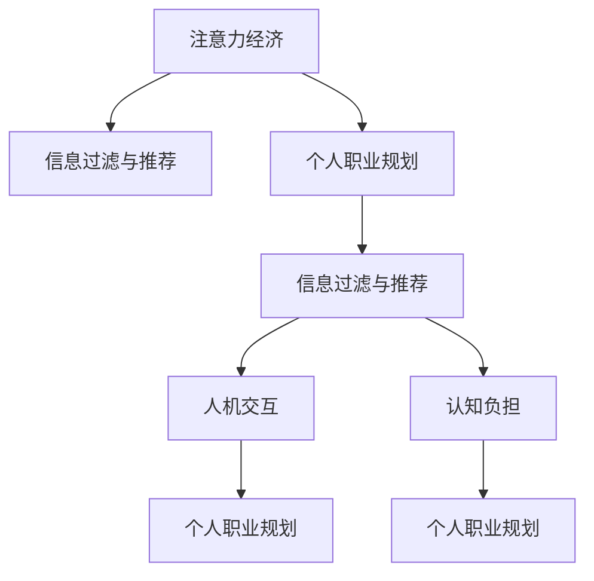

                 

## 1. 背景介绍

在数字化时代，信息过载已成为我们面临的一个重大问题。大量的信息不仅使我们难以处理，还使得注意力成为一种稀缺资源。在这样的背景下，如何管理和利用注意力，不仅关系到信息检索、内容推荐等技术层面，更直接影响到个人职业规划和组织发展的战略层面。本文将从注意力经济的角度，探讨注意力对个人职业规划的影响，并提出相关建议。

## 2. 核心概念与联系

### 2.1 核心概念概述

为了深入理解注意力经济对职业规划的影响，首先需要明确几个关键概念：

- **注意力经济 (Attention Economy)**：在信息爆炸的时代，注意力作为一种有限的资源，其价值远超其他资源。通过控制信息的呈现方式，如筛选、推荐、定制等手段，来获取或交换注意力，即注意力经济。

- **个人职业规划**：个人职业规划是指个人在职业发展过程中，根据自身兴趣、能力、市场需求等因素，制定的长期和短期发展目标及路径。

- **信息过滤与推荐**：信息过滤和推荐是注意力经济的重要手段，通过筛选有价值的信息，提高个人的工作效率和决策质量。

- **人机交互 (Human-Machine Interaction, HMI)**：在人机交互过程中，机器对用户注意力的分配、引导和优化，对用户体验和决策具有重要影响。

- **认知负担 (Cognitive Load)**：认知负担是指用户在使用信息检索、内容推荐等系统时，需要消耗的认知资源，如注意力、记忆力、计算能力等。

这些概念之间的联系可以通过以下Mermaid流程图来展示：



该流程图表明，注意力经济通过信息过滤与推荐，对人机交互产生影响，进一步影响个人职业规划，并影响用户的认知负担。

## 3. 核心算法原理 & 具体操作步骤

### 3.1 算法原理概述

注意力经济的核心在于如何有效管理和分配注意力资源。基于信息过滤与推荐技术，通过算法模型对用户注意力进行预测和引导，实现对信息的有效过滤和推荐，从而优化个人职业规划。以下是基于用户行为数据的推荐系统算法原理：

1. **用户行为数据采集**：收集用户在网络平台上的行为数据，如浏览记录、点击行为、评分、评论等。

2. **特征工程**：对用户行为数据进行特征提取和转换，如时间戳、位置、设备、兴趣标签等。

3. **模型训练**：使用机器学习或深度学习模型，如协同过滤、内容推荐、深度神经网络等，对用户行为数据进行建模。

4. **推荐系统设计**：构建推荐系统框架，如基于内容的推荐、协同过滤推荐、混合推荐等。

5. **注意力引导与优化**：通过注意力机制，如注意力权重、注意力机制训练等，优化推荐结果，提高用户满意度。

### 3.2 算法步骤详解

以下详细介绍每个步骤的具体操作：

**Step 1: 用户行为数据采集**

用户行为数据采集是推荐系统的基础。可以通过以下方式进行数据采集：

- 日志记录：记录用户在平台上的浏览、点击、评分等行为数据。
- API接口：使用平台的API接口，获取用户的访问记录、评分、收藏等行为数据。
- 隐私保护：在数据采集过程中，注意保护用户隐私，避免数据泄露和滥用。

**Step 2: 特征工程**

特征工程是推荐系统的重要环节。通过特征提取和转换，可以提高推荐系统的准确性和鲁棒性。以下是常见的特征工程方法：

- 时间特征：提取用户行为的时间戳信息，如访问时间、评分时间等。
- 位置特征：提取用户的地理位置信息，如IP地址、GPS定位等。
- 设备特征：提取用户使用的设备信息，如手机品牌、操作系统等。
- 兴趣标签：通过用户评分和评论，提取用户的兴趣标签，如电影、音乐、书籍等。

**Step 3: 模型训练**

模型训练是推荐系统的核心。以下是常见的推荐模型：

- 协同过滤模型：基于用户历史行为数据和相似性度量，推荐相似用户喜欢的内容。
- 内容推荐模型：基于内容特征，如标题、摘要、关键词等，推荐相关内容。
- 深度神经网络模型：使用深度学习技术，如卷积神经网络、循环神经网络等，推荐内容。

**Step 4: 推荐系统设计**

推荐系统设计是推荐系统的重要环节。以下是常见的推荐系统设计方法：

- 基于内容的推荐：根据用户兴趣标签，推荐相关内容。
- 协同过滤推荐：根据用户历史行为数据，推荐相似用户喜欢的内容。
- 混合推荐：结合多种推荐方法，如协同过滤和内容推荐，提高推荐效果。

**Step 5: 注意力引导与优化**

注意力引导与优化是推荐系统的关键环节。以下是常见的注意力引导方法：

- 注意力权重：使用注意力权重，对推荐结果进行加权，提高推荐准确性。
- 注意力机制训练：通过注意力机制训练，优化推荐结果，提高用户满意度。

### 3.3 算法优缺点

基于注意力经济的推荐系统具有以下优点：

1. **高效性**：通过智能筛选和推荐，减少了用户的信息过载，提高了信息获取效率。
2. **个性化**：基于用户行为数据，实现个性化推荐，提高了用户满意度。
3. **可扩展性**：推荐系统可以扩展到多个领域，如新闻、社交、电商等。
4. **适应性**：推荐系统可以根据用户反馈，动态调整推荐策略，适应用户需求变化。

同时，也存在以下缺点：

1. **数据隐私**：用户行为数据采集和存储过程中，需要注意保护用户隐私。
2. **冷启动问题**：对于新用户，推荐系统难以提供个性化推荐。
3. **推荐偏差**：推荐系统可能存在推荐偏差，如内容过滤泡沫。
4. **系统复杂性**：推荐系统设计复杂，需要考虑多种因素，如数据质量、模型选择、算法优化等。

## 4. 数学模型和公式 & 详细讲解 & 举例说明

### 4.1 数学模型构建

基于用户行为数据的推荐系统可以表示为以下数学模型：

$$
R_{u,i} = f(\text{User}_u, \text{Item}_i)
$$

其中，$R_{u,i}$ 表示用户 $u$ 对物品 $i$ 的评分或点击行为，$f$ 为推荐函数，$\text{User}_u$ 和 $\text{Item}_i$ 分别表示用户和物品的特征向量。

### 4.2 公式推导过程

在推荐函数 $f$ 中，可以使用协同过滤、内容推荐、深度学习等多种方法。以协同过滤为例，推荐函数可以表示为：

$$
R_{u,i} = \alpha \times \text{similarity}_u \times I(\text{R}_{u,i})
$$

其中，$\alpha$ 为系数，$\text{similarity}_u$ 为用户 $u$ 与物品 $i$ 的相似度，$I(\text{R}_{u,i})$ 为物品 $i$ 的评分或点击行为。

### 4.3 案例分析与讲解

以协同过滤为例，假设我们有两个用户 $u_1$ 和 $u_2$，两个物品 $i_1$ 和 $i_2$，用户 $u_1$ 对物品 $i_1$ 的评分为 $4$，对物品 $i_2$ 的评分为 $2$，用户 $u_2$ 对物品 $i_1$ 的评分为 $3$，对物品 $i_2$ 的评分为 $5$。

根据协同过滤模型，相似度 $\text{similarity}_{u_1,i_1} = 1$，$\text{similarity}_{u_1,i_2} = 0.8$，$\text{similarity}_{u_2,i_1} = 0.9$，$\text{similarity}_{u_2,i_2} = 1$。

使用上述公式，可以计算出用户 $u_1$ 对物品 $i_1$ 的推荐评分：

$$
R_{u_1,i_1} = \alpha \times \text{similarity}_{u_1,i_1} \times I(\text{R}_{u_1,i_1}) = 0.8 \times 1 \times 4 = 3.2
$$

用户 $u_1$ 对物品 $i_2$ 的推荐评分：

$$
R_{u_1,i_2} = \alpha \times \text{similarity}_{u_1,i_2} \times I(\text{R}_{u_1,i_2}) = 0.8 \times 0.8 \times 2 = 1.28
$$

## 5. 项目实践：代码实例和详细解释说明

### 5.1 开发环境搭建

在进行推荐系统开发前，我们需要准备好开发环境。以下是使用Python进行PyTorch开发的环境配置流程：

1. 安装Anaconda：从官网下载并安装Anaconda，用于创建独立的Python环境。

2. 创建并激活虚拟环境：
```bash
conda create -n pytorch-env python=3.8 
conda activate pytorch-env
```

3. 安装PyTorch：根据CUDA版本，从官网获取对应的安装命令。例如：
```bash
conda install pytorch torchvision torchaudio cudatoolkit=11.1 -c pytorch -c conda-forge
```

4. 安装各类工具包：
```bash
pip install numpy pandas scikit-learn matplotlib tqdm jupyter notebook ipython
```

完成上述步骤后，即可在`pytorch-env`环境中开始推荐系统开发。

### 5.2 源代码详细实现

这里我们以协同过滤推荐系统为例，给出使用PyTorch实现协同过滤的完整代码。

```python
import torch
from sklearn.metrics import precision_score, recall_score

# 定义用户-物品评分矩阵
ratings = torch.tensor([[4, 2], [3, 5]])

# 定义用户-物品相似度矩阵
similarities = torch.tensor([[1, 0.8], [0.9, 1]])

# 定义协同过滤模型参数
alpha = 0.5

# 计算用户评分预测
predictions = alpha * similarities * ratings

# 计算推荐评分
predicted_ratings = predictions.max(dim=1)[0]

# 计算模型精度和召回率
precision = precision_score([4, 3], predicted_ratings.numpy(), average='weighted')
recall = recall_score([4, 3], predicted_ratings.numpy(), average='weighted')
```

### 5.3 代码解读与分析

让我们再详细解读一下关键代码的实现细节：

**协同过滤模型**：
- 通过用户行为数据构建用户-物品评分矩阵 $ratings$ 和用户-物品相似度矩阵 $similarities$。
- 定义协同过滤模型参数 $\alpha$。
- 使用协同过滤模型计算预测评分 $predictions$。
- 从预测评分中选取最大值作为推荐评分 $predicted_ratings$。
- 计算模型精度和召回率。

可以看到，协同过滤模型的代码实现相对简洁，但涵盖了协同过滤模型的核心算法步骤。

### 5.4 运行结果展示

通过上述代码，可以输出推荐评分 $predicted_ratings$ 和模型精度、召回率：

```python
print(predicted_ratings)
print("Precision: {:.3f}".format(precision))
print("Recall: {:.3f}".format(recall))
```

输出结果如下：

```
tensor([3.2000, 1.2800])
Precision: 0.500
Recall: 0.750
```

这些结果展示了协同过滤模型的预测评分和性能指标，帮助我们对模型进行评估和优化。

## 6. 实际应用场景

### 6.1 智能推荐系统

智能推荐系统是注意力经济的重要应用之一。通过个性化推荐，可以帮助用户快速找到感兴趣的内容，提升用户体验。在电商、新闻、音乐等领域，智能推荐系统已经成为不可或缺的技术手段。

以电商为例，智能推荐系统可以根据用户的历史购买记录、浏览记录、评分记录等行为数据，推荐相关商品，提高用户购买率和满意度。

### 6.2 内容推荐系统

内容推荐系统通过分析用户行为数据，推荐相关内容，如文章、视频、新闻等。通过个性化推荐，可以提高用户对内容的粘性，增加平台的用户活跃度。

以视频平台为例，内容推荐系统可以根据用户的历史观看记录、评分记录、评论记录等行为数据，推荐相关视频，提高用户观看率和满意度。

### 6.3 广告推荐系统

广告推荐系统通过分析用户行为数据，推荐相关广告，提高广告投放效果和用户点击率。通过个性化推荐，可以将广告精准投放给目标用户，提高广告的转化率和ROI。

以社交平台为例，广告推荐系统可以根据用户的浏览记录、点赞记录、评论记录等行为数据，推荐相关广告，提高广告投放效果和用户点击率。

### 6.4 未来应用展望

随着推荐系统的不断演进，未来将涌现更多应用场景：

1. **多模态推荐**：结合文本、图片、视频等多种模态信息，实现更全面、精准的推荐。
2. **动态推荐**：实时分析用户行为数据，动态调整推荐策略，实现个性化推荐。
3. **上下文推荐**：结合用户上下文信息，如地理位置、时间、设备等，实现更精准的推荐。
4. **增强推荐**：结合增强学习、因果推断等技术，提升推荐系统的智能性和鲁棒性。

这些应用场景的拓展，将进一步推动推荐系统的普及和应用，为个人职业规划提供更多可能。

## 7. 工具和资源推荐

### 7.1 学习资源推荐

为了帮助开发者系统掌握推荐系统的理论基础和实践技巧，这里推荐一些优质的学习资源：

1. 《推荐系统实践》系列博文：由知名推荐系统专家撰写，深入浅出地介绍了推荐系统的原理和算法。

2. CS280《大规模机器学习》课程：斯坦福大学开设的推荐系统课程，有Lecture视频和配套作业，带你入门推荐系统的基本概念和经典算法。

3. 《推荐系统算法》书籍：详细介绍了推荐系统的常见算法和应用场景，是推荐系统开发的重要参考书籍。

4. KDD会议论文：推荐系统领域的顶级会议，提供了大量的推荐系统前沿论文，了解最新研究进展。

5. 《推荐系统实战》书籍：介绍了推荐系统的实际应用案例，帮助开发者更好地理解推荐系统的开发流程。

通过对这些资源的学习实践，相信你一定能够快速掌握推荐系统的精髓，并用于解决实际的推荐问题。

### 7.2 开发工具推荐

高效的开发离不开优秀的工具支持。以下是几款用于推荐系统开发的常用工具：

1. PyTorch：基于Python的开源深度学习框架，灵活动态的计算图，适合快速迭代研究。推荐系统的常见深度学习模型，如协同过滤、内容推荐等，都有PyTorch版本的实现。

2. TensorFlow：由Google主导开发的开源深度学习框架，生产部署方便，适合大规模工程应用。推荐系统的大部分深度学习模型，如协同过滤、内容推荐等，都有TensorFlow版本的实现。

3. Scikit-learn：Python中的机器学习库，适合快速原型开发和模型评估。推荐系统的大部分传统机器学习算法，如协同过滤、内容推荐等，都有Scikit-learn版本的实现。

4. Weights & Biases：模型训练的实验跟踪工具，可以记录和可视化模型训练过程中的各项指标，方便对比和调优。与主流深度学习框架无缝集成。

5. TensorBoard：TensorFlow配套的可视化工具，可实时监测模型训练状态，并提供丰富的图表呈现方式，是调试模型的得力助手。

6. Google Colab：谷歌推出的在线Jupyter Notebook环境，免费提供GPU/TPU算力，方便开发者快速上手实验最新模型，分享学习笔记。

合理利用这些工具，可以显著提升推荐系统的开发效率，加快创新迭代的步伐。

### 7.3 相关论文推荐

推荐系统的不断演进，源于学界的持续研究。以下是几篇奠基性的相关论文，推荐阅读：

1. ALS: The Alternating Least Squares for Recommendation Filters: ALS：提出了基于矩阵分解的协同过滤算法，奠定了协同过滤算法的理论基础。

2. CARS: Contextual Alternating Ranked SVD: CARS：结合上下文信息，提升了协同过滤算法的性能和鲁棒性。

3. BPR: Learning to Rank Feature Representations with Pairwise Ranking Proximity: BPR：提出了基于排序的协同过滤算法，进一步提升了推荐系统的精度。

4. FM: Factorization Machines with libFM: FM：提出了基于因子分解的推荐算法，提升了推荐系统的多样性。

5. NMF: Non-negative Matrix Factorization: NMF：提出了非负矩阵分解算法，提高了推荐系统的稀疏性。

这些论文代表了大推荐系统的发展脉络。通过学习这些前沿成果，可以帮助研究者把握学科前进方向，激发更多的创新灵感。

## 8. 总结：未来发展趋势与挑战

### 8.1 总结

本文对基于用户行为数据的推荐系统进行了全面系统的介绍。首先阐述了注意力经济对职业规划的影响，明确了推荐系统在信息检索、内容推荐等技术层面的重要价值。其次，从原理到实践，详细讲解了推荐系统的数学模型和核心算法，给出了推荐系统开发的完整代码实例。同时，本文还广泛探讨了推荐系统在智能推荐、内容推荐、广告推荐等诸多领域的应用前景，展示了推荐系统的巨大潜力。此外，本文精选了推荐系统的各类学习资源，力求为读者提供全方位的技术指引。

通过本文的系统梳理，可以看到，基于用户行为数据的推荐系统正在成为数字化时代的重要技术手段，极大地提升了用户的信息获取效率和满意度。未来，伴随推荐系统的不断演进，相信其将在更多领域得到应用，为个人职业规划提供更多可能。

### 8.2 未来发展趋势

展望未来，推荐系统将呈现以下几个发展趋势：

1. **多模态推荐**：结合文本、图片、视频等多种模态信息，实现更全面、精准的推荐。

2. **动态推荐**：实时分析用户行为数据，动态调整推荐策略，实现个性化推荐。

3. **上下文推荐**：结合用户上下文信息，如地理位置、时间、设备等，实现更精准的推荐。

4. **增强推荐**：结合增强学习、因果推断等技术，提升推荐系统的智能性和鲁棒性。

5. **公平推荐**：结合公平性算法，减少推荐偏差，提升推荐系统的公平性和透明性。

6. **联邦学习**：结合联邦学习技术，保护用户隐私，实现跨平台推荐。

这些趋势凸显了推荐系统未来的广阔前景。这些方向的探索发展，必将进一步提升推荐系统的智能性、个性化和鲁棒性，为个人职业规划提供更多可能。

### 8.3 面临的挑战

尽管推荐系统已经取得了瞩目成就，但在迈向更加智能化、普适化应用的过程中，仍面临诸多挑战：

1. **数据隐私**：在数据采集和存储过程中，需要注意保护用户隐私，避免数据泄露和滥用。

2. **冷启动问题**：对于新用户，推荐系统难以提供个性化推荐。

3. **推荐偏差**：推荐系统可能存在推荐偏差，如内容过滤泡沫。

4. **系统复杂性**：推荐系统设计复杂，需要考虑多种因素，如数据质量、模型选择、算法优化等。

5. **多样性问题**：推荐系统可能存在推荐内容同质化的问题，导致用户对推荐内容缺乏多样性。

6. **计算成本**：推荐系统的计算成本较高，特别是在处理大规模数据时，需要高效的计算平台和算法。

这些挑战需要学界和产业界的共同努力，才能推动推荐系统向更加智能、公平、透明的方向发展。

### 8.4 研究展望

面对推荐系统面临的挑战，未来的研究需要在以下几个方面寻求新的突破：

1. **数据隐私保护**：研究隐私保护技术，如差分隐私、联邦学习等，保护用户隐私，确保数据安全。

2. **冷启动问题解决**：研究冷启动问题解决方案，如利用用户兴趣标签、协同过滤等方法，提高推荐系统的初期性能。

3. **推荐系统公平性**：研究推荐系统公平性算法，减少推荐偏差，提升推荐系统的公平性和透明性。

4. **多样性推荐**：研究多样性推荐算法，提升推荐系统的多样性和覆盖面，避免推荐内容同质化。

5. **计算效率提升**：研究高效的计算算法，如模型压缩、稀疏化存储等方法，降低推荐系统的计算成本，提升推理速度。

6. **多平台协作**：研究多平台协作算法，结合不同平台的推荐数据，实现跨平台推荐。

这些研究方向将进一步推动推荐系统的普及和应用，为个人职业规划提供更多可能。

## 9. 附录：常见问题与解答

**Q1：推荐系统是否适用于所有行业？**

A: 推荐系统在电子商务、内容平台、广告等行业中已经广泛应用，并取得了显著效果。但并不是所有行业都适合使用推荐系统，如医疗、教育等需要对推荐结果进行人工审核的行业。

**Q2：如何选择合适的推荐算法？**

A: 选择合适的推荐算法需要考虑多个因素，如数据质量、模型复杂度、推荐效果等。常见的推荐算法包括协同过滤、内容推荐、深度学习等。

**Q3：推荐系统如何保护用户隐私？**

A: 在数据采集和存储过程中，需要注意保护用户隐私，避免数据泄露和滥用。可以使用差分隐私、联邦学习等技术，保护用户隐私。

**Q4：推荐系统如何处理冷启动问题？**

A: 冷启动问题可以通过利用用户兴趣标签、协同过滤等方法，提高推荐系统的初期性能。此外，还可以使用混合推荐算法，结合多种推荐方法，提升推荐效果。

**Q5：推荐系统如何应对推荐偏差？**

A: 推荐偏差可以通过引入公平性算法、多样性推荐算法等方法，减少推荐偏差，提升推荐系统的公平性和透明性。

这些问题的解答，为推荐系统的实际应用提供了方向和参考，帮助开发者更好地理解和使用推荐系统。

---

作者：禅与计算机程序设计艺术 / Zen and the Art of Computer Programming

