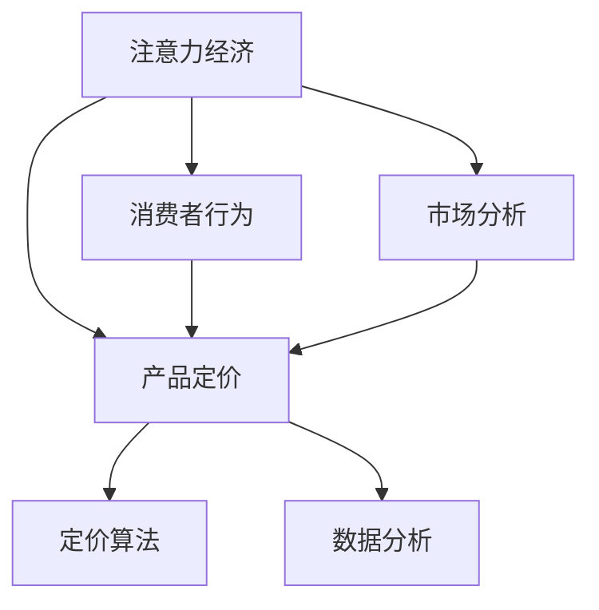

                 

# 注意力经济对企业产品定价的影响

> 关键词：注意力经济,产品定价,消费者行为,市场分析,算法优化,数据驱动

## 1. 背景介绍

### 1.1 问题由来

在互联网快速发展的时代，注意力成为了一种稀缺资源。企业和品牌需要竞争消费者的注意力，以实现更好的销售和品牌传播效果。这种以吸引和维持消费者注意力为核心目标的经济模式，被称为注意力经济（Economies of Attention）。企业产品定价作为吸引和维持消费者注意力的重要手段之一，其策略和模型制定显得尤为重要。

### 1.2 问题核心关键点

在注意力经济背景下，企业产品定价的核心关键点在于理解消费者行为，洞察市场需求，并应用科学的方法优化定价策略，以实现企业收益最大化。其中，消费者行为分析、市场分析、定价算法和数据分析是主要的关注点。

1. **消费者行为分析**：了解消费者对价格的敏感度和需求弹性，分析消费者在不同价格水平下的购买意愿。
2. **市场分析**：研究市场竞争环境，分析竞争者定价策略，评估市场份额和竞争优势。
3. **定价算法**：开发和应用科学定价模型，优化产品定价以适应市场需求和消费者行为变化。
4. **数据分析**：收集和分析消费者反馈、市场数据和交易记录，为定价策略提供数据支持。

### 1.3 问题研究意义

在注意力经济时代，科学定价对于企业提升竞争力、增加利润具有重要意义。通过科学定价，企业不仅能更好地满足消费者需求，提升用户体验，还能在激烈的市场竞争中占据有利位置。研究注意力经济对企业产品定价的影响，有助于企业制定更合理、更有效的定价策略，实现持续发展和增长。

## 2. 核心概念与联系

### 2.1 核心概念概述

为更好地理解注意力经济对企业产品定价的影响，本节将介绍几个密切相关的核心概念：

- **注意力经济**：以吸引和维持消费者注意力为核心的经济模式，核心在于提升品牌曝光和用户参与度。
- **产品定价**：企业在销售产品或服务时，对价格进行设定和调整的过程，是市场竞争的重要策略之一。
- **消费者行为**：消费者在购买决策过程中表现出的心理和行为模式，包括价格敏感度、需求弹性、购买意愿等。
- **市场分析**：研究市场环境、竞争者和消费者行为，以指导企业策略制定和优化。
- **定价算法**：基于消费者行为和市场分析，使用数学和统计模型优化定价策略的方法。

这些核心概念之间的逻辑关系可以通过以下Mermaid流程图来展示：



这个流程图展示了大语言模型的核心概念及其之间的关系：

1. 注意力经济通过提升品牌曝光和用户参与度，直接影响产品定价。
2. 消费者行为分析有助于理解消费者对价格的敏感度和需求弹性，为定价策略提供依据。
3. 市场分析研究竞争环境和消费者需求，指导产品定价策略。
4. 定价算法基于消费者行为和市场分析，优化产品定价以适应市场需求。
5. 数据分析收集市场数据和消费者反馈，为定价策略提供数据支持。

## 3. 核心算法原理 & 具体操作步骤

### 3.1 算法原理概述

注意力经济下的产品定价算法，旨在通过科学的方法优化产品价格，以吸引和维持消费者注意力，从而提升企业收益。其主要原理包括以下几点：

1. **需求函数建模**：基于消费者行为分析，建立需求函数，描述消费者对价格的反应。
2. **竞争分析**：研究竞争对手的定价策略，理解市场竞争环境。
3. **动态定价**：根据市场需求和竞争情况，动态调整产品价格。
4. **预测与优化**：使用预测模型和优化算法，调整价格以最大化企业收益。

### 3.2 算法步骤详解

基于注意力经济的产品定价算法主要包括以下关键步骤：

**Step 1: 消费者行为分析**

- **收集数据**：收集消费者购买历史、价格反应、社交媒体互动等数据。
- **建立模型**：使用统计模型（如回归分析、时间序列分析等）建立需求函数，描述消费者对价格的反应。
- **分析结果**：分析消费者对不同价格的敏感度和需求弹性，为定价策略提供依据。

**Step 2: 市场分析**

- **竞争者分析**：收集竞争对手的定价策略和市场份额数据，进行竞争分析。
- **市场趋势**：分析市场需求变化趋势，预测未来的价格走势。
- **策略制定**：根据市场需求和竞争分析结果，制定定价策略。

**Step 3: 定价模型构建**

- **价格优化模型**：基于需求函数和市场分析，建立价格优化模型，优化产品价格。
- **参数调整**：调整模型参数，适应不同的市场环境和消费者需求。
- **模拟测试**：使用模拟数据测试定价模型效果，验证模型准确性。

**Step 4: 动态定价实施**

- **实时监控**：实时监控市场变化和消费者行为，收集数据。
- **动态调整**：根据市场情况和消费者反馈，动态调整产品价格。
- **效果评估**：评估价格调整效果，优化定价策略。

### 3.3 算法优缺点

基于注意力经济的产品定价算法具有以下优点：

1. **科学性**：通过数据分析和建模，制定更科学、合理的定价策略。
2. **灵活性**：能够根据市场变化和消费者行为实时调整定价，保持竞争力。
3. **精准性**：通过精确建模和数据分析，提高定价的精准度和有效性。
4. **可操作性**：模型和策略具有良好的可操作性，便于实际应用。

同时，该算法也存在以下局限性：

1. **数据依赖性**：依赖高质量的消费者行为和市场数据，数据获取成本较高。
2. **模型复杂性**：建模过程较为复杂，需要丰富的数据科学和数学知识。
3. **市场风险**：市场环境变化复杂，模型预测可能存在偏差。
4. **消费者偏好变化**：消费者偏好随时间变化，模型需要不断调整。

尽管存在这些局限性，但就目前而言，基于注意力经济的产品定价算法仍是最主流的方法之一。未来相关研究的重点在于如何进一步降低数据获取成本，提高模型预测准确性，以及增强算法的鲁棒性和可解释性。

### 3.4 算法应用领域

基于注意力经济的产品定价算法，已经在多个领域得到了应用，包括但不限于以下方面：

- **电子商务**：针对电商平台上的产品定价，提升销量和用户参与度。
- **旅游业**：根据市场需求和竞争环境，优化酒店、机票等旅游产品的定价策略。
- **媒体广告**：通过科学定价提升广告点击率和转化率，增加广告收入。
- **娱乐产业**：调整影视剧、游戏等产品的定价，吸引更多用户参与。
- **金融服务**：优化金融产品的定价，提高客户满意度和市场竞争力。

除了上述这些经典应用外，基于注意力经济的产品定价算法还被创新性地应用到更多场景中，如智能推荐系统、营销策略优化等，为企业提供了更多的价值创造机会。

## 4. 数学模型和公式 & 详细讲解  
### 4.1 数学模型构建

本节将使用数学语言对基于注意力经济的产品定价算法进行更加严格的刻画。

记消费者对商品的需求函数为 $Q(P)$，其中 $P$ 为商品价格。假设需求函数为线性函数：

$$
Q(P) = a - bP
$$

其中 $a$ 为需求函数截距，$b$ 为需求函数斜率，反映消费者对价格的敏感度和需求弹性。

定义市场份额函数 $S(P)$，描述企业产品在不同价格水平下的市场份额。假设市场份额函数为：

$$
S(P) = \frac{Q(P)}{\max(Q)}
$$

其中 $\max(Q)$ 为市场最大需求量。

定义利润函数 $\Pi(P)$，描述企业在不同价格水平下的利润。假设利润函数为：

$$
\Pi(P) = P \cdot Q(P) - C(P)
$$

其中 $C(P)$ 为企业的成本函数。

### 4.2 公式推导过程

将需求函数和利润函数代入市场份额函数，得到：

$$
S(P) = \frac{a - bP}{\max(Q)}
$$

在已知市场需求和成本函数的情况下，可以构建优化模型，寻找最优价格 $P^*$：

$$
P^* = \mathop{\arg\min}_{P} - \Pi(P)
$$

求解上述优化问题，即得最优价格。

在实际应用中，通常使用拉格朗日乘子法或梯度下降等数值方法求解最优价格。

## 5. 项目实践：代码实例和详细解释说明

### 5.1 开发环境搭建

在进行定价算法实践前，我们需要准备好开发环境。以下是使用Python进行项目开发的配置流程：

1. 安装Python：下载并安装最新版本的Python。
2. 安装Pandas：使用以下命令安装Pandas库：
```bash
pip install pandas
```

3. 安装Matplotlib：使用以下命令安装Matplotlib库：
```bash
pip install matplotlib
```

4. 安装Scikit-learn：使用以下命令安装Scikit-learn库：
```bash
pip install scikit-learn
```

完成上述步骤后，即可在开发环境中进行定价算法的实现和测试。

### 5.2 源代码详细实现

这里我们以一个简单的电商产品定价模型为例，展示如何使用Python和Pandas库实现基于注意力经济的产品定价算法。

首先，定义需求函数和成本函数：

```python
import pandas as pd
import numpy as np
from scipy.optimize import minimize

# 需求函数
def demand_function(P):
    a = 50
    b = 0.1
    return a - b * P

# 成本函数
def cost_function(P):
    c = 20
    return c * demand_function(P)
```

然后，计算市场份额和利润函数：

```python
# 市场份额函数
def market_share(P):
    return demand_function(P) / max(demand_function)

# 利润函数
def profit_function(P):
    return P * demand_function(P) - cost_function(P)
```

接下来，定义目标函数和约束条件，求解最优价格：

```python
# 目标函数
def objective(P):
    return -profit_function(P)

# 约束条件
def constraint(P):
    return 0  # 这里可以添加其他约束条件

# 求解最优价格
result = minimize(objective, 10, method='BFGS', constraints=[constraint])
optimal_price = result.x[0]
```

最后，输出最优价格：

```python
print(f"最优价格为: {optimal_price}")
```

### 5.3 代码解读与分析

让我们再详细解读一下关键代码的实现细节：

**需求函数和成本函数**：
- `demand_function` 函数：使用线性函数描述消费者对价格的反应。
- `cost_function` 函数：假设成本与需求量成线性关系。

**市场份额函数和利润函数**：
- `market_share` 函数：根据需求函数计算市场份额。
- `profit_function` 函数：根据需求函数和成本函数计算利润。

**目标函数和约束条件**：
- `objective` 函数：定义目标函数，求利润最大化。
- `constraint` 函数：这里只定义了一个约束条件，即价格 $P$ 的取值范围。

**求解最优价格**：
- 使用 `minimize` 函数求解优化问题，指定目标函数和约束条件。
- 输出最优价格。

可以看到，通过这段代码，我们实现了一个简单的基于线性需求函数和成本函数的产品定价模型。在实际应用中，可以根据具体需求调整模型复杂度和约束条件，实现更加精细的定价策略。

## 6. 实际应用场景

### 6.1 电商平台定价

电商平台常常需要根据消费者行为和市场需求动态调整产品价格，以吸引更多的用户购买。通过基于注意力经济的产品定价算法，电商平台可以更科学地设定产品价格，提升销售量。

具体而言，电商平台可以收集历史交易数据、用户行为数据、价格反应数据等，构建需求函数和成本函数。根据市场变化和用户反馈，动态调整产品价格，实现最优定价。此外，电商平台还可以利用推荐系统，根据用户偏好和历史购买行为，推荐价格最优的产品。

### 6.2 旅游业定价

旅游业中的酒店、机票等产品定价，受市场需求和竞争环境影响较大。通过基于注意力经济的产品定价算法，旅游企业可以更科学地设定产品价格，提升市场份额和利润。

具体而言，旅游企业可以收集历史价格数据、市场需求数据、竞争者价格数据等，构建需求函数和成本函数。根据市场变化和用户反馈，动态调整产品价格，实现最优定价。此外，旅游企业还可以利用市场分析和消费者行为分析，优化定价策略，提升用户满意度和市场竞争力。

### 6.3 媒体广告定价

媒体广告的定价通常需要根据广告点击率和转化率进行优化。通过基于注意力经济的产品定价算法，媒体平台可以更科学地设定广告价格，提升广告收入。

具体而言，媒体平台可以收集历史广告数据、用户点击数据、广告点击率等，构建需求函数和成本函数。根据市场需求和用户反馈，动态调整广告价格，实现最优定价。此外，媒体平台还可以利用推荐系统，根据用户兴趣和行为，推荐价格最优的广告。

### 6.4 未来应用展望

随着注意力经济的发展，基于产品定价算法的应用将更加广泛。未来，企业可以利用更多的数据和更先进的算法，实现更加精准的定价策略。

在电商、旅游、媒体等传统行业，基于产品定价算法的应用将继续深化，提升企业竞争力。

在金融、健康、教育等新兴行业，基于产品定价算法的应用也将逐步拓展，推动行业创新和升级。

此外，在智能推荐系统、营销策略优化等更多场景中，基于产品定价算法将发挥更大的作用，为企业创造更多价值。

## 7. 工具和资源推荐

### 7.1 学习资源推荐

为了帮助开发者系统掌握基于注意力经济的产品定价理论基础和实践技巧，这里推荐一些优质的学习资源：

1. 《消费者行为经济学》：阐述消费者行为分析的基本理论和应用方法。
2. 《定价策略与竞争分析》：详细介绍了市场分析和竞争分析的方法和技巧。
3. 《数据科学导论》：涵盖数据分析和建模的基本知识，适合初学者入门。
4. 《Python数据分析实战》：使用Python实现数据分析和建模的实战教程，适合中高级开发者。
5. 《统计学习方法》：介绍了常用的统计模型和方法，适合机器学习爱好者。

通过对这些资源的学习实践，相信你一定能够快速掌握基于注意力经济的产品定价精髓，并用于解决实际的定价问题。

### 7.2 开发工具推荐

高效的开发离不开优秀的工具支持。以下是几款用于基于注意力经济的产品定价开发的常用工具：

1. Jupyter Notebook：交互式的开发环境，方便进行数据处理和算法测试。
2. Pandas：强大的数据处理库，支持数据清洗、转换和分析。
3. Matplotlib：绘图库，方便进行数据可视化。
4. Scikit-learn：机器学习库，提供多种模型和算法。
5. TensorFlow：深度学习库，支持复杂模型的构建和训练。

合理利用这些工具，可以显著提升基于注意力经济的产品定价任务的开发效率，加快创新迭代的步伐。

### 7.3 相关论文推荐

基于注意力经济的产品定价技术的发展源于学界的持续研究。以下是几篇奠基性的相关论文，推荐阅读：

1. 《Economic Value of Attention》：提出了注意力经济的概念，分析了注意力在经济中的作用。
2. 《Price Optimization in E-Commerce》：介绍了电商平台定价的数学模型和优化方法。
3. 《Dynamic Pricing Strategies in Tourism》：研究了旅游业中动态定价的算法和应用。
4. 《Adaptive Price Optimization in Media Advertising》：介绍了媒体广告定价的优化方法。
5. 《Econometric Models of Consumer Behavior》：介绍了消费者行为分析的经济模型和方法。

这些论文代表了大语言模型微调技术的发展脉络。通过学习这些前沿成果，可以帮助研究者把握学科前进方向，激发更多的创新灵感。

## 8. 总结：未来发展趋势与挑战

### 8.1 总结

本文对基于注意力经济的产品定价算法进行了全面系统的介绍。首先阐述了注意力经济对企业产品定价的重要影响，明确了产品定价在提升企业竞争力和收益方面的关键作用。其次，从原理到实践，详细讲解了基于注意力经济的产品定价算法，包括需求函数建模、市场分析、定价模型构建和动态定价实施。同时，本文还广泛探讨了基于注意力经济的产品定价在电商、旅游、媒体等多个行业领域的应用前景，展示了其广阔的应用空间。此外，本文精选了产品定价算法的各类学习资源，力求为读者提供全方位的技术指引。

通过本文的系统梳理，可以看到，基于注意力经济的产品定价算法正在成为企业定价策略的重要工具。该算法不仅能帮助企业更好地满足消费者需求，提升用户体验，还能在激烈的市场竞争中占据有利位置。未来，伴随注意力经济的发展和数据的不断积累，基于产品定价算法将发挥更大的作用，助力企业实现持续发展和增长。

### 8.2 未来发展趋势

展望未来，基于注意力经济的产品定价算法将呈现以下几个发展趋势：

1. **数据驱动**：随着大数据和人工智能技术的发展，更多高质量的数据将被采集和利用，定价模型将更加精准和科学。
2. **实时化**：实时数据分析和动态定价将越来越普遍，企业能够根据实时市场变化和消费者反馈，快速调整价格。
3. **个性化**：利用消费者行为数据和推荐系统，实现更加个性化的定价策略，提升用户体验和市场竞争力。
4. **多维度分析**：综合考虑消费者行为、市场竞争、宏观经济等多维因素，优化定价策略。
5. **自动化**：使用机器学习和自动化工具，简化定价过程，提高效率和精度。

以上趋势凸显了基于注意力经济的产品定价算法的广泛应用前景。这些方向的探索发展，必将进一步提升企业定价策略的科学性和有效性，推动企业实现更高的收益。

### 8.3 面临的挑战

尽管基于注意力经济的产品定价算法已经取得了瞩目成就，但在迈向更加智能化、普适化应用的过程中，它仍面临着诸多挑战：

1. **数据质量**：高质量的数据获取和处理成本较高，数据缺失或不准确会影响定价模型的效果。
2. **算法复杂性**：复杂的定价模型需要高水平的数学和统计知识，模型的可解释性较弱。
3. **市场波动**：市场环境和消费者偏好变化复杂，模型预测可能存在偏差。
4. **消费者隐私**：收集和处理消费者数据需要考虑隐私保护和合规性问题。
5. **技术集成**：如何将基于注意力经济的产品定价算法与其他企业系统集成，实现全面自动化，也是一大挑战。

尽管存在这些挑战，但通过技术进步和实践经验的积累，相信这些难题都将逐步解决，基于注意力经济的产品定价算法将发挥更大的作用。

### 8.4 研究展望

面对基于注意力经济的产品定价算法所面临的种种挑战，未来的研究需要在以下几个方面寻求新的突破：

1. **多源数据融合**：整合多种数据来源，提高定价模型的综合性和准确性。
2. **模型解释性**：增强模型的可解释性，提升用户信任和市场接受度。
3. **自适应算法**：开发自适应定价算法，自动调整定价策略，适应市场变化。
4. **隐私保护**：引入隐私保护技术，确保消费者数据的安全和合规。
5. **实时处理**：提升数据处理和定价算法的实时性，实现动态定价。

这些研究方向的探索，必将引领基于注意力经济的产品定价算法迈向更高的台阶，为构建安全、可靠、可解释、可控的智能系统铺平道路。面向未来，基于注意力经济的产品定价算法还需要与其他人工智能技术进行更深入的融合，如知识表示、因果推理、强化学习等，多路径协同发力，共同推动企业定价策略的进步。只有勇于创新、敢于突破，才能不断拓展定价算法的边界，让智能技术更好地服务于企业发展。

## 9. 附录：常见问题与解答

**Q1：基于注意力经济的产品定价算法是否适用于所有行业？**

A: 基于注意力经济的产品定价算法在电商、旅游、媒体等多个行业中都得到了应用，但并非所有行业都适用。例如，对于某些高度定制化的产品或服务，基于注意力经济的产品定价算法可能无法完全适应。此外，对于某些价格透明度较低的行业，如金融、医疗等，基于注意力经济的产品定价算法也需要根据具体情况进行调整。

**Q2：如何选择合适的定价算法？**

A: 选择合适的定价算法需要考虑多个因素，如行业特性、数据质量、市场环境等。一般而言，可以先收集和分析相关数据，构建需求函数和成本函数。然后根据市场竞争环境和消费者行为，选择合适的定价算法，如线性定价、分段定价、动态定价等。

**Q3：基于注意力经济的产品定价算法是否需要考虑消费者行为变化？**

A: 是的。消费者行为随着时间和市场变化而变化，定价算法需要根据消费者行为的变化进行动态调整。可以通过定期收集和分析消费者行为数据，更新需求函数和成本函数，优化定价策略。

**Q4：基于注意力经济的产品定价算法是否需要考虑市场竞争？**

A: 是的。市场竞争环境对定价策略有重要影响。可以通过研究竞争对手的定价策略，评估市场份额和竞争优势，制定更合理的定价策略。同时，在定价过程中，需要考虑市场竞争的变化，及时调整定价策略。

**Q5：基于注意力经济的产品定价算法是否需要考虑宏观经济因素？**

A: 是的。宏观经济环境对市场需求和消费者行为有重要影响，定价算法需要考虑宏观经济因素，如通货膨胀、经济周期等，优化定价策略。

这些问题的解答，展示了基于注意力经济的产品定价算法的复杂性和多样性。在实际应用中，需要根据具体情况选择适当的定价算法，并不断优化定价策略，以实现企业收益最大化。

