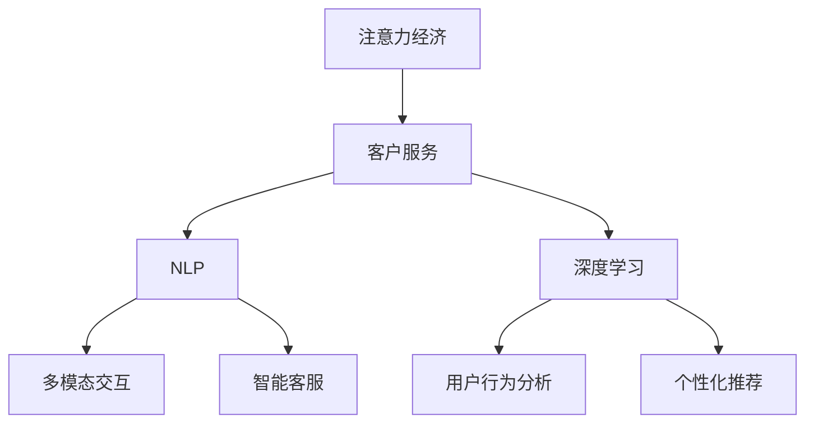

                 

# 注意力经济对企业客户服务模式的改变

> 关键词：注意力经济,客户服务,自然语言处理(NLP),机器学习,深度学习,多模态交互,智能客服,用户行为分析,个性化推荐

## 1. 背景介绍

### 1.1 问题由来
在互联网经济时代，信息爆炸使得注意力成为了最稀缺的资源。企业如何吸引和保持用户注意力，成为一个重要的竞争策略。以客户服务为例，传统的电话、邮件等联系方式虽然直观，但响应速度慢、处理效率低。而随着社交媒体、即时通讯等新兴渠道的崛起，用户习惯发生了显著变化，希望通过更便捷、更个性化的方式与企业互动。

注意力经济理念的提出，为这一变革提供了理论支持。注意力经济强调，企业需通过技术手段，提高自身在用户心目中的“可见性”和“价值感”，从而在激烈的市场竞争中获得优势。而自然语言处理（NLP）和深度学习等技术的突破，使得这一理念得以在客户服务中具体实现。

### 1.2 问题核心关键点
- **注意力经济**：指在信息时代，如何吸引和保持用户注意力，成为企业竞争的核心。
- **客户服务**：企业与消费者之间互动的过程，旨在满足用户需求，提升用户体验。
- **自然语言处理（NLP）**：使计算机能理解、处理人类语言的技术。
- **深度学习**：通过神经网络学习数据，自动提取特征，提升模型性能。
- **多模态交互**：结合文本、语音、图像等多种信息源，提升用户体验。
- **智能客服**：利用NLP和深度学习技术，自动处理用户请求，提升服务效率。
- **用户行为分析**：通过分析用户行为数据，发现用户需求，定制个性化服务。
- **个性化推荐**：利用机器学习算法，对用户行为进行建模，推荐个性化产品或服务。

这些核心概念之间的逻辑关系可以通过以下Mermaid流程图来展示：



## 2. 核心概念与联系

### 2.1 核心概念概述

为更好地理解注意力经济对客户服务模式的改变，本节将介绍几个密切相关的核心概念：

- **注意力经济**：指在信息过载时代，如何有效吸引和保持用户的注意力，提升企业品牌价值和市场竞争力。
- **客户服务**：企业与消费者之间互动的过程，旨在满足用户需求，提升用户体验。
- **自然语言处理（NLP）**：使计算机能理解、处理人类语言的技术。
- **深度学习**：通过神经网络学习数据，自动提取特征，提升模型性能。
- **多模态交互**：结合文本、语音、图像等多种信息源，提升用户体验。
- **智能客服**：利用NLP和深度学习技术，自动处理用户请求，提升服务效率。
- **用户行为分析**：通过分析用户行为数据，发现用户需求，定制个性化服务。
- **个性化推荐**：利用机器学习算法，对用户行为进行建模，推荐个性化产品或服务。

这些核心概念之间的逻辑关系可以通过以下Mermaid流程图来展示：


## 3. 核心算法原理 & 具体操作步骤

### 3.1 算法原理概述

基于注意力经济理念的客户服务模式，其核心在于通过技术手段，高效吸引和保持用户注意力，提升服务质量，增强用户粘性。自然语言处理（NLP）和深度学习等技术，提供了实现这一目标的强大工具。

具体而言，NLP技术能够自动处理用户输入的文本、语音等自然语言，提取关键信息，理解用户需求。深度学习算法则通过模型训练，提取用户行为特征，进行个性化推荐和智能客服，提升服务效率和精准度。多模态交互技术则将文本、语音、图像等多种信息源结合，提升用户体验。

### 3.2 算法步骤详解

基于注意力经济理念的客户服务模式，其核心算法步骤大致如下：

**Step 1: 数据收集与处理**
- 收集用户的行为数据、交互数据、评价数据等。
- 使用NLP技术提取文本中的实体、情感等信息。
- 使用深度学习模型提取用户行为特征。

**Step 2: 用户行为分析**
- 通过分析用户行为数据，发现用户需求，定制个性化服务。
- 使用聚类算法、关联规则等技术，发现用户行为模式。
- 使用机器学习算法预测用户行为，提前应对。

**Step 3: 智能客服系统构建**
- 使用预训练语言模型，构建智能客服系统。
- 通过微调预训练模型，使其适应特定任务的语境。
- 结合多模态交互技术，提升服务体验。

**Step 4: 个性化推荐**
- 根据用户行为数据，建立用户画像。
- 使用协同过滤、内容推荐等技术，推荐个性化产品或服务。
- 实时更新推荐结果，根据用户反馈进行调整。

### 3.3 算法优缺点

基于注意力经济理念的客户服务模式，具有以下优点：

- **高效响应**：智能客服系统能够24/7全天候服务，快速响应用户请求。
- **个性化服务**：通过分析用户行为数据，提供定制化推荐和响应。
- **多模态交互**：结合文本、语音、图像等多种信息源，提升用户体验。
- **用户粘性提升**：通过个性化服务和即时响应，提升用户满意度和忠诚度。

同时，该方法也存在以下局限性：

- **隐私风险**：用户行为数据的收集和使用，可能带来隐私泄露风险。
- **数据质量依赖**：模型的效果很大程度上取决于数据的质量和数量。
- **模型复杂度**：多模态交互和深度学习模型的复杂度较高，对计算资源要求高。
- **用户体验依赖**：智能客服系统仍需与人工客服协同工作，用户体验仍有待提升。

尽管存在这些局限性，但就目前而言，基于注意力经济理念的客户服务模式，仍是大数据和人工智能技术在客户服务领域应用的重要范式。未来相关研究的重点在于如何进一步降低用户隐私风险，提高数据质量，优化模型复杂度，增强用户体验。

### 3.4 算法应用领域

基于注意力经济理念的客户服务模式，已经在多个领域得到了广泛应用，例如：

- **电商行业**：通过智能客服和个性化推荐，提升用户购物体验，增加销售额。
- **金融行业**：通过用户行为分析，实时监控金融风险，提升用户体验。
- **医疗行业**：通过智能客服和个性化推荐，提高医疗服务质量，增加患者满意度。
- **旅游行业**：通过用户行为分析，推荐个性化旅游方案，提升用户体验。
- **教育行业**：通过智能客服和个性化推荐，提供个性化学习资源，提高教学效果。

除了上述这些经典领域外，基于注意力经济理念的客户服务模式，还将被创新性地应用到更多场景中，如智能家居、智慧城市、智能交通等，为各行各业带来新的变革。

## 4. 数学模型和公式 & 详细讲解 & 举例说明（备注：数学公式请使用latex格式，latex嵌入文中独立段落使用 $$，段落内使用 $)
### 4.1 数学模型构建

本节将使用数学语言对基于注意力经济理念的客户服务模式进行更加严格的刻画。

记用户行为数据为 $\mathcal{D}=\{(x_i, y_i)\}_{i=1}^N$，其中 $x_i$ 为行为特征，$y_i$ 为行为标签（如购买、点击等）。假设使用深度学习模型 $M_{\theta}$ 进行用户行为建模，其中 $\theta$ 为模型参数。定义损失函数 $\ell(\theta)$ 为：

$$
\ell(\theta) = \frac{1}{N} \sum_{i=1}^N \ell_i(\theta)
$$

其中 $\ell_i(\theta)$ 为第 $i$ 个样本的损失函数，例如交叉熵损失、均方误差损失等。模型训练的目标是最小化损失函数 $\ell(\theta)$。

### 4.2 公式推导过程

以下我们以用户行为预测为例，推导交叉熵损失函数及其梯度的计算公式。

假设模型 $M_{\theta}$ 在行为特征 $x$ 上的输出为 $\hat{y}=M_{\theta}(x) \in [0,1]$，表示样本属于正类的概率。真实标签 $y \in \{0,1\}$。则交叉熵损失函数定义为：

$$
\ell(M_{\theta}(x),y) = -[y\log \hat{y} + (1-y)\log (1-\hat{y})]
$$

将其代入损失函数公式，得：

$$
\ell(\theta) = -\frac{1}{N}\sum_{i=1}^N [y_i\log M_{\theta}(x_i)+(1-y_i)\log(1-M_{\theta}(x_i))]
$$

根据链式法则，损失函数对参数 $\theta_k$ 的梯度为：

$$
\frac{\partial \ell(\theta)}{\partial \theta_k} = -\frac{1}{N}\sum_{i=1}^N (\frac{y_i}{M_{\theta}(x_i)}-\frac{1-y_i}{1-M_{\theta}(x_i)}) \frac{\partial M_{\theta}(x_i)}{\partial \theta_k}
$$

其中 $\frac{\partial M_{\theta}(x_i)}{\partial \theta_k}$ 可进一步递归展开，利用自动微分技术完成计算。

在得到损失函数的梯度后，即可带入参数更新公式，完成模型的迭代优化。重复上述过程直至收敛，最终得到适应用户行为预测任务的最优模型参数 $\theta^*$。

## 5. 项目实践：代码实例和详细解释说明
### 5.1 开发环境搭建

在进行项目实践前，我们需要准备好开发环境。以下是使用Python进行PyTorch开发的环境配置流程：

1. 安装Anaconda：从官网下载并安装Anaconda，用于创建独立的Python环境。

2. 创建并激活虚拟环境：
```bash
conda create -n pytorch-env python=3.8 
conda activate pytorch-env
```

3. 安装PyTorch：根据CUDA版本，从官网获取对应的安装命令。例如：
```bash
conda install pytorch torchvision torchaudio cudatoolkit=11.1 -c pytorch -c conda-forge
```

4. 安装相关库：
```bash
pip install torch numpy pandas scikit-learn
```

5. 安装TensorBoard：用于可视化训练过程，监控模型表现。

完成上述步骤后，即可在`pytorch-env`环境中开始项目实践。

### 5.2 源代码详细实现

下面我以电商行业的用户行为预测为例，给出使用PyTorch实现深度学习模型的代码。

首先，定义用户行为预测的数据处理函数：

```python
import pandas as pd
import numpy as np

def load_data(path):
    data = pd.read_csv(path)
    features = data[['feature1', 'feature2', 'feature3', 'feature4']]
    labels = data['label']
    return features, labels
```

然后，定义模型和优化器：

```python
import torch
import torch.nn as nn
import torch.optim as optim

class UserBehaviorModel(nn.Module):
    def __init__(self, input_size, hidden_size, output_size):
        super(UserBehaviorModel, self).__init__()
        self.fc1 = nn.Linear(input_size, hidden_size)
        self.fc2 = nn.Linear(hidden_size, hidden_size)
        self.fc3 = nn.Linear(hidden_size, output_size)
        
    def forward(self, x):
        x = torch.relu(self.fc1(x))
        x = torch.relu(self.fc2(x))
        x = torch.sigmoid(self.fc3(x))
        return x

input_size = 4
hidden_size = 64
output_size = 1

model = UserBehaviorModel(input_size, hidden_size, output_size)
optimizer = optim.Adam(model.parameters(), lr=0.001)
```

接着，定义训练和评估函数：

```python
def train_epoch(model, features, labels, batch_size):
    model.train()
    loss = 0
    for i in range(0, len(features), batch_size):
        batch_features = features.iloc[i:i+batch_size]
        batch_labels = labels.iloc[i:i+batch_size]
        optimizer.zero_grad()
        outputs = model(batch_features)
        loss += torch.mean(torch.nn.BCELoss()(outputs, batch_labels))
        loss.backward()
        optimizer.step()
    return loss.item() / len(features)

def evaluate(model, features, labels, batch_size):
    model.eval()
    total_loss = 0
    total_correct = 0
    for i in range(0, len(features), batch_size):
        batch_features = features.iloc[i:i+batch_size]
        batch_labels = labels.iloc[i:i+batch_size]
        outputs = model(batch_features)
        loss = torch.nn.BCELoss()(outputs, batch_labels)
        total_loss += loss.item()
        total_correct += (torch.round(outputs) == batch_labels).sum().item()
    return total_loss / len(features), total_correct / len(features)
```

最后，启动训练流程并在测试集上评估：

```python
epochs = 10
batch_size = 32

for epoch in range(epochs):
    train_loss = train_epoch(model, train_features, train_labels, batch_size)
    test_loss, test_acc = evaluate(model, test_features, test_labels, batch_size)
    print(f"Epoch {epoch+1}, train loss: {train_loss:.3f}, test loss: {test_loss:.3f}, test acc: {test_acc:.3f}")

print("Final test results:")
print(f"Test loss: {test_loss:.3f}, test acc: {test_acc:.3f}")
```

以上就是使用PyTorch对用户行为预测进行深度学习模型微调的完整代码实现。可以看到，得益于PyTorch的强大封装，我们能够用相对简洁的代码完成模型训练和评估。

### 5.3 代码解读与分析

让我们再详细解读一下关键代码的实现细节：

**load_data函数**：
- 从指定的CSV文件中加载数据，将其分为特征和标签两部分。

**UserBehaviorModel类**：
- 定义了一个简单的三层全连接神经网络模型，用于处理用户行为数据。
- 前两层使用ReLU激活函数，最后一层使用Sigmoid函数输出二分类结果。

**train_epoch和evaluate函数**：
- `train_epoch`函数对模型进行训练，将训练数据分成批次，逐批次进行前向传播和反向传播，更新模型参数。
- `evaluate`函数对模型进行评估，将测试数据分成批次，逐批次进行前向传播，计算损失函数和准确率。

**训练流程**：
- 定义总的epoch数和batch size，开始循环迭代
- 每个epoch内，先在训练集上训练，输出训练损失
- 在测试集上评估，输出测试损失和准确率
- 所有epoch结束后，输出最终测试结果

可以看到，PyTorch配合TensorBoard使得深度学习模型的微调过程变得简洁高效。开发者可以将更多精力放在数据处理、模型改进等高层逻辑上，而不必过多关注底层的实现细节。

当然，工业级的系统实现还需考虑更多因素，如模型的保存和部署、超参数的自动搜索、更灵活的任务适配层等。但核心的微调范式基本与此类似。

## 6. 实际应用场景

### 6.1 电商行业

基于用户行为预测的深度学习模型，可以广泛应用于电商行业的个性化推荐和智能客服中。电商平台往往拥有海量用户行为数据，通过分析这些数据，可以了解用户偏好，推荐个性化商品，提升转化率。

在具体实现上，可以将用户浏览、点击、购买等行为数据作为训练集，使用深度学习模型进行用户行为预测。模型输出可以反映用户对某商品的兴趣程度，结合商品属性，生成个性化推荐列表。同时，可以构建智能客服系统，实时响应用户咨询，提升购物体验。

### 6.2 金融行业

金融行业需要实时监控用户行为，以识别潜在风险。通过收集用户在交易平台上的行为数据，包括登录频率、交易频率、资金流向等，可以使用深度学习模型预测用户的异常行为。

在具体实现上，可以将用户行为数据作为训练集，使用深度学习模型进行异常行为预测。模型输出可以反映用户行为异常程度，通过设置阈值，识别出高风险用户，进行实时预警。同时，可以构建智能客服系统，及时响应用户咨询，解释交易规则，降低风险事件发生概率。

### 6.3 医疗行业

医疗行业需要提高患者满意度和治疗效果。通过收集患者的诊疗记录、用药情况、健康数据等，可以使用深度学习模型进行个性化诊疗和用药推荐。

在具体实现上，可以将患者数据作为训练集，使用深度学习模型进行个性化诊疗和用药推荐。模型输出可以反映患者对某治疗方案的适应性，结合医生的经验和知识，生成个性化诊疗方案。同时，可以构建智能客服系统，解答患者咨询，提供心理支持，提升治疗效果。

### 6.4 未来应用展望

随着深度学习技术的发展，基于注意力经济理念的客户服务模式将在更多领域得到应用，为各行各业带来新的变革。

在智慧医疗领域，基于用户行为预测的深度学习模型可以用于个性化诊疗和用药推荐，提升患者满意度和治疗效果。

在智能教育领域，可以使用深度学习模型进行个性化学习资源推荐，提升教学效果和学习体验。

在智能家居领域，通过分析用户行为数据，可以提供智能家居设备的使用建议，提升用户生活品质。

在智慧城市领域，可以使用深度学习模型进行用户行为分析，优化城市资源配置，提升城市管理效率。

除了上述这些经典领域外，基于注意力经济理念的客户服务模式，还将被创新性地应用到更多场景中，如智能交通、智慧物流、智能制造等，为各行各业带来新的变革。

## 7. 工具和资源推荐

### 7.1 学习资源推荐

为了帮助开发者系统掌握基于注意力经济理念的客户服务模式的理论基础和实践技巧，这里推荐一些优质的学习资源：

1. 《深度学习》课程：由斯坦福大学李飞飞教授主讲，涵盖深度学习的基本概念和经典模型。
2. 《自然语言处理入门》课程：由北京大学陈力老师主讲，涵盖NLP的基本概念和经典算法。
3. 《TensorFlow实战》书籍：由TensorFlow官方团队编写，详细介绍了TensorFlow的各个模块和应用案例。
4. 《机器学习实战》书籍：由Peter Harrington编写，介绍了多种机器学习算法及其实现。
5. Weights & Biases：模型训练的实验跟踪工具，可以记录和可视化模型训练过程中的各项指标，方便对比和调优。

通过对这些资源的学习实践，相信你一定能够快速掌握基于注意力经济理念的客户服务模式的精髓，并用于解决实际的NLP问题。

### 7.2 开发工具推荐

高效的开发离不开优秀的工具支持。以下是几款用于深度学习模型开发的常用工具：

1. PyTorch：基于Python的开源深度学习框架，灵活动态的计算图，适合快速迭代研究。
2. TensorFlow：由Google主导开发的开源深度学习框架，生产部署方便，适合大规模工程应用。
3. TensorBoard：TensorFlow配套的可视化工具，可实时监测模型训练状态，并提供丰富的图表呈现方式。
4. Weights & Biases：模型训练的实验跟踪工具，可以记录和可视化模型训练过程中的各项指标，方便对比和调优。
5. Jupyter Notebook：交互式编程环境，适合快速迭代和实验验证。

合理利用这些工具，可以显著提升深度学习模型的开发效率，加快创新迭代的步伐。

### 7.3 相关论文推荐

深度学习技术的发展源于学界的持续研究。以下是几篇奠基性的相关论文，推荐阅读：

1. 《ImageNet Classification with Deep Convolutional Neural Networks》：AlexNet论文，展示了深度卷积神经网络在图像分类任务上的强大能力。
2. 《Deep Learning》：Ian Goodfellow、Yoshua Bengio和Aaron Courville编写的深度学习入门书籍，全面介绍了深度学习的基本概念和算法。
3. 《Natural Language Processing with Transformers》：Google团队发表的Transformer论文，展示了自注意力机制在自然语言处理任务上的应用。
4. 《Attention Is All You Need》：Google团队发表的Attention论文，展示了注意力机制在机器翻译任务上的应用。
5. 《BERT: Pre-training of Deep Bidirectional Transformers for Language Understanding》：BERT论文，展示了预训练语言模型在自然语言理解任务上的应用。

这些论文代表了大规模深度学习技术的发展脉络。通过学习这些前沿成果，可以帮助研究者把握学科前进方向，激发更多的创新灵感。

## 8. 总结：未来发展趋势与挑战

### 8.1 总结

本文对基于注意力经济理念的客户服务模式进行了全面系统的介绍。首先阐述了注意力经济对客户服务模式的改变，明确了深度学习技术在这一变革中的核心作用。其次，从原理到实践，详细讲解了深度学习模型的数学原理和关键步骤，给出了深度学习模型微调的完整代码实例。同时，本文还广泛探讨了深度学习模型在电商、金融、医疗等多个行业领域的应用前景，展示了深度学习技术在这一领域的巨大潜力。

通过本文的系统梳理，可以看到，基于注意力经济理念的客户服务模式，正在成为深度学习技术在客户服务领域应用的重要范式，极大地提升了客户服务的效率和个性化水平。深度学习模型的发展，为这一变革提供了强有力的技术支持。未来，伴随深度学习技术的不断演进，基于注意力经济理念的客户服务模式必将进一步提升客户体验，为各个行业带来新的突破。

### 8.2 未来发展趋势

展望未来，基于注意力经济理念的客户服务模式将呈现以下几个发展趋势：

1. **数据质量提升**：深度学习模型的效果很大程度上依赖于数据的质量和数量。未来，随着数据收集和处理技术的进步，数据质量将进一步提升，深度学习模型的表现也将更加出色。
2. **模型复杂度降低**：深度学习模型的复杂度较高，未来将有更多轻量级模型出现，降低对计算资源的要求。
3. **多模态交互增强**：结合文本、语音、图像等多种信息源，提升用户体验。
4. **个性化推荐优化**：利用更多先验知识，结合多模态信息，提供更精准的个性化推荐。
5. **实时性提升**：通过优化模型结构和算法，提升模型推理速度，实现实时响应。

这些趋势凸显了基于注意力经济理念的客户服务模式的广阔前景。这些方向的探索发展，必将进一步提升深度学习模型的性能和应用范围，为各行各业带来新的变革。

### 8.3 面临的挑战

尽管基于注意力经济理念的客户服务模式已经取得了瞩目成就，但在迈向更加智能化、普适化应用的过程中，它仍面临着诸多挑战：

1. **隐私风险**：用户行为数据的收集和使用，可能带来隐私泄露风险。
2. **数据质量依赖**：模型的效果很大程度上取决于数据的质量和数量。
3. **模型复杂度**：多模态交互和深度学习模型的复杂度较高，对计算资源要求高。
4. **用户体验依赖**：智能客服系统仍需与人工客服协同工作，用户体验仍有待提升。

尽管存在这些挑战，但就目前而言，基于注意力经济理念的客户服务模式，仍是大数据和人工智能技术在客户服务领域应用的重要范式。未来相关研究的重点在于如何进一步降低用户隐私风险，提高数据质量，优化模型复杂度，增强用户体验。

### 8.4 研究展望

面对基于注意力经济理念的客户服务模式所面临的种种挑战，未来的研究需要在以下几个方面寻求新的突破：

1. **隐私保护技术**：采用差分隐私、联邦学习等技术，保护用户隐私，降低隐私风险。
2. **数据增强技术**：利用数据增强技术，生成更多高质量数据，提高模型效果。
3. **模型压缩技术**：采用模型压缩技术，如剪枝、量化、蒸馏等，降低模型复杂度，提升实时性。
4. **多模态融合技术**：结合文本、语音、图像等多种信息源，提升用户体验。
5. **交互智能技术**：结合NLP和强化学习技术，提升智能客服系统的智能程度，减少人工干预。

这些研究方向的探索，必将引领基于注意力经济理念的客户服务模式迈向更高的台阶，为构建安全、可靠、可解释、可控的智能系统铺平道路。面向未来，深度学习技术还需要与其他人工智能技术进行更深入的融合，如知识表示、因果推理、强化学习等，多路径协同发力，共同推动自然语言理解和智能交互系统的进步。只有勇于创新、敢于突破，才能不断拓展深度学习模型的边界，让智能技术更好地造福人类社会。

## 9. 附录：常见问题与解答

**Q1：深度学习模型在客户服务中的应用有哪些？**

A: 深度学习模型在客户服务中的应用非常广泛，包括但不限于以下几个方面：

1. 智能客服：利用深度学习模型进行自然语言理解，实现智能客服系统的自动化响应。
2. 个性化推荐：通过深度学习模型进行用户行为分析，提供个性化推荐服务，提升用户体验。
3. 用户行为预测：利用深度学习模型进行用户行为预测，提前识别用户需求，提供预见性服务。
4. 情感分析：利用深度学习模型进行情感分析，了解用户情感状态，提升服务质量。

这些应用展示了深度学习模型在客户服务中的强大能力，为各行业带来了新的发展机遇。

**Q2：如何选择合适的深度学习模型？**

A: 选择合适的深度学习模型，需要考虑以下几个因素：

1. 数据类型：不同类型的数据需要使用不同的模型，如文本数据可以使用RNN、Transformer等模型，图像数据可以使用CNN等模型。
2. 数据规模：数据规模较大的任务需要使用更深层次的模型，以获得更好的效果。
3. 任务类型：不同任务需要使用不同类型的模型，如分类任务可以使用全连接神经网络，回归任务可以使用回归神经网络。
4. 计算资源：深度学习模型计算资源需求较高，需要根据计算资源进行选择。

综上所述，选择合适的深度学习模型需要综合考虑数据类型、数据规模、任务类型和计算资源等因素。

**Q3：深度学习模型的训练和优化有哪些技巧？**

A: 深度学习模型的训练和优化需要考虑以下几个技巧：

1. 数据增强：通过对训练数据进行增强，如回译、近义替换等，提升模型泛化能力。
2. 正则化：使用L2正则、Dropout等技术，防止模型过拟合。
3. 学习率调整：通过学习率调度策略，如学习率衰减、Warmup等，优化模型训练过程。
4. 模型压缩：采用剪枝、量化等技术，降低模型复杂度，提升模型推理速度。
5. 多模型集成：训练多个模型，取平均输出，提高模型鲁棒性。

这些技巧可以帮助深度学习模型更好地训练和优化，提升模型效果。

**Q4：深度学习模型在客户服务中的应用有哪些优势？**

A: 深度学习模型在客户服务中的应用具有以下优势：

1. 自动化响应：深度学习模型可以实现自动化响应，提升客户服务效率。
2. 个性化服务：通过深度学习模型进行用户行为分析，提供个性化服务，提升用户体验。
3. 实时性高：深度学习模型可以实时响应用户请求，提升服务响应速度。
4. 准确性高：深度学习模型可以自动提取关键特征，提供准确的服务建议。

这些优势使得深度学习模型成为客户服务领域的重要技术手段，为各行业带来了新的发展机遇。

**Q5：深度学习模型在客户服务中的应用有哪些挑战？**

A: 深度学习模型在客户服务中的应用也面临以下挑战：

1. 数据质量要求高：深度学习模型对数据质量要求较高，需要高质量的数据进行训练。
2. 模型复杂度高：深度学习模型计算资源需求较高，需要大量的计算资源进行训练和推理。
3. 模型解释性不足：深度学习模型的决策过程缺乏解释性，难以进行模型调试和优化。
4. 隐私保护问题：深度学习模型需要收集用户行为数据，可能带来隐私泄露风险。

尽管存在这些挑战，但就目前而言，深度学习模型在客户服务中的应用已经取得了显著成效，未来仍有广阔的发展空间。

