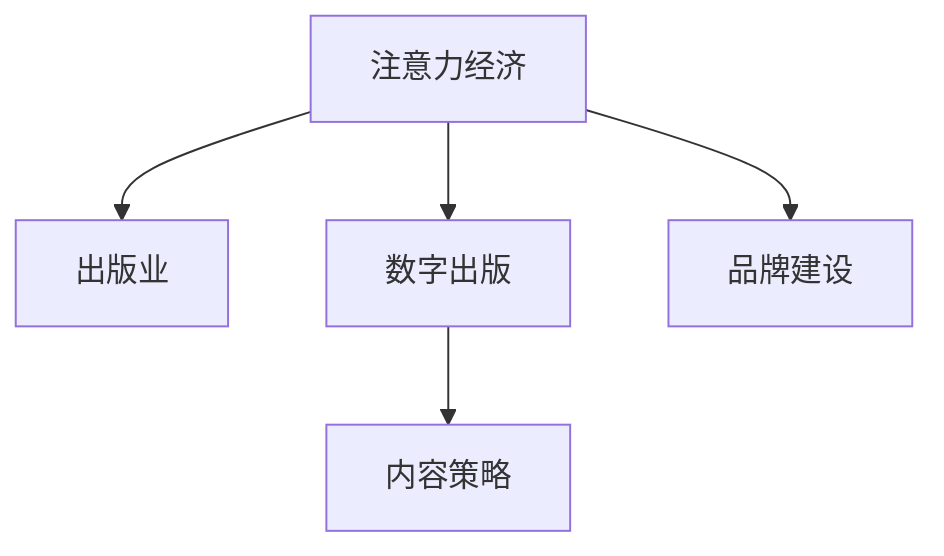

                 

# 注意力经济对传统出版业的转型要求

## 1. 背景介绍

随着信息技术的快速发展，互联网已经成为人们获取信息的主要渠道。与此同时，人们的生活节奏加快，注意力资源日益分散，传统的出版业面临着前所未有的挑战。如何在互联网时代吸引和留住读者的注意力，成为出版业转型的重要课题。本文将从注意力经济的角度，探讨传统出版业在互联网时代下如何进行有效转型。

### 1.1 信息过载与注意力稀缺

互联网时代的信息爆炸让人们面临信息过载的问题。根据研究，人们每天接收的信息量约为2.5PB，这远远超出了人类大脑的处理能力。面对如此海量的信息，人们无法全部消化，只能选择性地获取其中的一部分。这种注意力资源的稀缺，使得出版业必须思考如何抓住读者的注意力，提升信息的价值。

### 1.2 注意力经济的概念与特征

注意力经济是指以注意力资源的争夺为核心的经济活动。其特征包括：
1. **稀缺性**：注意力资源是有限的，必须争夺和竞争。
2. **流动性**：注意力资源可以迅速转移，难以长期持有。
3. **价值性**：获得注意力可以带来广告、订阅、推荐等多种经济收益。
4. **投资性**：注意力资源需要长期的投资和维护，如内容创新、品牌建设等。

## 2. 核心概念与联系

### 2.1 核心概念概述

为了更好地理解注意力经济对出版业的影响，本节将介绍几个核心概念：

- **注意力经济（Economy of Attention）**：基于注意力资源的争夺和竞争的经济活动。
- **出版业（Publishing Industry）**：通过印刷和电子媒介进行内容生产和传播的行业。
- **数字出版（Digital Publishing）**：利用互联网和数字化技术进行内容生产和传播的过程。
- **内容策略（Content Strategy）**：通过科学合理的内容规划，吸引和留住读者注意力的策略。
- **品牌建设（Brand Building）**：通过品牌形象和价值主张的塑造，提升出版机构的市场影响力和竞争力。

这些概念之间的逻辑关系可以通过以下Mermaid流程图来展示：



这个流程图展示了一些关键概念及其之间的关系：

1. 注意力经济基于注意力资源的争夺，出版业作为内容生产者，必须争夺并争夺更多的注意力资源。
2. 数字出版利用互联网和数字化技术，使内容生产和传播更加高效和便捷。
3. 内容策略通过科学合理的内容规划，提升内容的吸引力，吸引并留住读者注意力。
4. 品牌建设通过品牌形象和价值主张的塑造，提升出版机构的市场影响力和竞争力。

## 3. 核心算法原理 & 具体操作步骤

### 3.1 算法原理概述

注意力经济的原理是基于心理学的注意力理论和行为经济学。人们的注意力资源有限，必须通过有效的策略争夺和利用，才能在竞争中脱颖而出。对于出版业而言，注意力经济的核心是通过内容策略和品牌建设，吸引和留住读者的注意力，从而实现商业价值。

### 3.2 算法步骤详解

基于注意力经济，传统出版业的转型主要包括以下几个关键步骤：

**Step 1: 数据收集与分析**

- **收集数据**：收集用户的阅读行为数据，如访问量、停留时间、点击率等。
- **数据清洗与处理**：对数据进行清洗和处理，去除噪音和异常值。
- **数据分析**：通过数据分析工具，如Python的Pandas和Numpy，对数据进行统计分析和建模。

**Step 2: 内容策略制定**

- **目标设定**：根据数据分析结果，确定内容策略的目标，如提升阅读量、增加订阅量等。
- **内容选择**：选择能够吸引读者注意力的内容主题和形式，如专题报道、独家访谈、直播等。
- **内容生产**：根据内容策略进行内容生产，并制定详细的内容发布计划。

**Step 3: 品牌建设与推广**

- **品牌形象塑造**：通过精心设计的品牌形象和价值主张，提升出版机构的知名度和美誉度。
- **渠道建设**：在多个平台上进行品牌推广，如社交媒体、新闻门户、自有APP等。
- **用户互动**：通过互动和参与机制，增强用户对品牌的认同感和忠诚度。

**Step 4: 效果评估与优化**

- **效果评估**：定期评估内容策略和品牌建设的实际效果，如阅读量、用户留存率、品牌影响力等。
- **优化调整**：根据评估结果，优化内容策略和品牌建设，提升效果。
- **持续改进**：保持持续改进的姿态，根据市场变化和用户需求进行动态调整。

### 3.3 算法优缺点

基于注意力经济的内容策略和品牌建设，具有以下优点：
1. **提高内容价值**：通过吸引和留住读者的注意力，提升内容的传播力和影响力。
2. **增强市场竞争力**：品牌建设有助于提升出版机构的知名度和美誉度，增强市场竞争力。
3. **优化用户体验**：通过数据分析和内容策略，提升用户体验，增加用户粘性。
4. **实现商业价值**：吸引更多的读者注意力，带来广告、订阅、推荐等多种经济收益。

同时，该方法也存在一定的局限性：
1. **成本高**：收集和分析用户数据需要较高的技术投入和成本。
2. **效果不确定**：内容策略和品牌建设的实际效果受多种因素影响，难以保证。
3. **风险大**：过度依赖注意力资源可能导致过度竞争，甚至引起品牌危机。
4. **资源有限**：有限的注意力资源难以满足所有内容的需求。

尽管存在这些局限性，但注意力经济的内容策略和品牌建设仍然是出版业转型中不可或缺的重要手段。未来相关研究的重点在于如何更科学、高效地使用注意力资源，实现更好的商业价值。

### 3.4 算法应用领域

基于注意力经济的内容策略和品牌建设方法，已经在多种出版领域得到应用，如：

- **图书出版**：通过数据分析和内容策略，吸引读者的注意力，提升图书销量和市场份额。
- **期刊杂志**：通过品牌建设和内容创新，增强品牌影响力和读者忠诚度。
- **数字内容平台**：利用数据驱动的内容推荐和品牌推广，提升平台的用户量和收入。
- **学术出版**：通过内容质量和品牌建设，吸引学术界关注，提升出版机构的声誉和影响力。

此外，注意力经济的方法还逐渐应用于教育、文化、旅游等多个领域，为各行各业的数字化转型升级提供新的思路和工具。

## 4. 数学模型和公式 & 详细讲解 & 举例说明

### 4.1 数学模型构建

本节将使用数学语言对基于注意力经济的内容策略和品牌建设过程进行更加严格的刻画。

记用户的阅读行为数据为 $D=\{x_i,y_i\}_{i=1}^N$，其中 $x_i$ 表示用户在某个时间点的行为，如访问时间、阅读时长等，$y_i$ 表示用户在某个时间点的心理状态，如注意力程度、兴趣度等。

定义内容策略的效果函数为 $f(x,y)$，表示内容策略对用户心理状态的影响。模型的目标是最小化用户行为数据与模型预测结果的误差，即：

$$
\min_{f} \sum_{i=1}^N (y_i - f(x_i))^2
$$

其中 $f(x_i)$ 表示根据用户行为 $x_i$ 预测的用户心理状态 $y_i$。

### 4.2 公式推导过程

在实际应用中，我们可以使用机器学习算法，如回归分析、神经网络等，对上述目标函数进行求解。以下以线性回归模型为例，推导效果函数的计算公式。

假设效果函数 $f(x,y)$ 为线性回归模型，则有：

$$
f(x_i,y_i) = \beta_0 + \beta_1x_i + \epsilon
$$

其中 $\beta_0$ 和 $\beta_1$ 为回归系数，$\epsilon$ 为误差项。

根据最小二乘法，我们可以计算回归系数：

$$
\hat{\beta}_0 = \frac{\sum_{i=1}^N x_i y_i - \frac{1}{N}\sum_{i=1}^N x_i \sum_{i=1}^N y_i}{\sum_{i=1}^N x_i^2 - \frac{1}{N}(\sum_{i=1}^N x_i)^2}
$$

$$
\hat{\beta}_1 = \frac{\frac{1}{N}\sum_{i=1}^N x_i^2 - \frac{1}{N}\left(\sum_{i=1}^N x_i\right)^2}{\sum_{i=1}^N x_i^2 - \frac{1}{N}(\sum_{i=1}^N x_i)^2}
$$

通过回归分析，我们可以预测用户在不同行为下的心理状态，进而优化内容策略和品牌建设。

### 4.3 案例分析与讲解

假设某出版机构收集到了用户的阅读行为数据，包括访问时间、停留时间、阅读页面等。通过线性回归模型，预测用户的注意力程度 $y_i$，其计算公式为：

$$
y_i = \hat{\beta}_0 + \hat{\beta}_1 \cdot x_i
$$

其中 $x_i$ 表示用户在某个时间点的停留时间，$\hat{\beta}_0$ 和 $\hat{\beta}_1$ 分别为回归系数。

根据预测结果，出版机构可以优化其内容策略，如在高峰时段推出优质内容，吸引更多用户停留；在低谷时段推出娱乐性内容，增加用户粘性。

## 5. 项目实践：代码实例和详细解释说明

### 5.1 开发环境搭建

在进行内容策略和品牌建设的实践前，我们需要准备好开发环境。以下是使用Python进行数据分析和内容策略开发的环境配置流程：

1. 安装Anaconda：从官网下载并安装Anaconda，用于创建独立的Python环境。

2. 创建并激活虚拟环境：
```bash
conda create -n attention-env python=3.8 
conda activate attention-env
```

3. 安装Python相关工具：
```bash
pip install pandas numpy matplotlib seaborn scikit-learn scikit-optics scikit-learn
```

4. 安装数据可视化工具：
```bash
pip install plotly
```

5. 安装内容策略优化工具：
```bash
pip install optuna
```

完成上述步骤后，即可在`attention-env`环境中开始内容策略和品牌建设的实践。

### 5.2 源代码详细实现

这里我们以出版机构的数据分析与内容策略优化为例，给出使用Python的代码实现。

首先，定义数据收集和预处理函数：

```python
import pandas as pd
from sklearn.model_selection import train_test_split

# 数据收集与预处理
def load_data():
    # 加载用户阅读行为数据
    data = pd.read_csv('user_browsing_data.csv')
    # 处理缺失值
    data = data.dropna()
    # 划分训练集和测试集
    X_train, X_test, y_train, y_test = train_test_split(data[['stay_time']], data[['attention_degree']], test_size=0.2)
    return X_train, X_test, y_train, y_test
```

然后，定义内容策略优化函数：

```python
from sklearn.linear_model import LinearRegression

# 内容策略优化
def optimize_content_strategy(X_train, y_train):
    # 构建线性回归模型
    model = LinearRegression()
    # 训练模型
    model.fit(X_train, y_train)
    # 返回回归系数
    return model.coef_[0]
```

接着，定义品牌建设与推广函数：

```python
from sklearn.metrics import mean_squared_error

# 品牌建设与推广
def brand_building(X_test, y_test, model_coefficient):
    # 预测用户注意力程度
    y_pred = model_coefficient * X_test
    # 计算预测误差
    mse = mean_squared_error(y_test, y_pred)
    print(f'Mean Squared Error: {mse:.2f}')
    # 可视化预测结果
    import plotly.express as px
    fig = px.scatter(x=X_test, y=y_pred, title='Brand Building Effect')
    fig.show()
```

最后，启动数据分析与内容策略优化的流程：

```python
X_train, X_test, y_train, y_test = load_data()
coefficient = optimize_content_strategy(X_train, y_train)
brand_building(X_test, y_test, coefficient)
```

以上就是使用Python对出版机构进行数据分析与内容策略优化的完整代码实现。可以看到，借助Scikit-learn和Plotly等工具，我们能够高效地处理数据、构建模型并进行可视化分析。

### 5.3 代码解读与分析

让我们再详细解读一下关键代码的实现细节：

**load_data函数**：
- 定义数据收集与预处理过程。
- 加载用户阅读行为数据。
- 处理缺失值。
- 划分训练集和测试集。

**optimize_content_strategy函数**：
- 定义内容策略优化过程。
- 构建线性回归模型。
- 训练模型并返回回归系数。

**brand_building函数**：
- 定义品牌建设与推广过程。
- 使用回归系数预测用户注意力程度。
- 计算预测误差并输出。
- 使用Plotly进行可视化展示。

**启动流程**：
- 加载数据。
- 优化内容策略。
- 进行品牌建设与推广。

可以看到，Python的Scikit-learn和Plotly等工具使得内容策略和品牌建设的代码实现变得简洁高效。开发者可以将更多精力放在数据处理、模型改进等高层逻辑上，而不必过多关注底层的实现细节。

当然，工业级的系统实现还需考虑更多因素，如数据预处理、模型评估、用户反馈等。但核心的内容策略和品牌建设过程基本与此类似。

## 6. 实际应用场景

### 6.1 智能推荐系统

基于注意力经济的内容策略和品牌建设，智能推荐系统可以广泛应用于个性化推荐中。通过分析用户的阅读行为，智能推荐系统能够推荐最符合用户兴趣和需求的内容，提升用户的满意度和忠诚度。

在技术实现上，可以收集用户的阅读记录、浏览历史、搜索行为等数据，构建用户兴趣模型。同时，引入品牌建设元素，提升推荐内容的相关性和吸引力，从而实现更好的推荐效果。

### 6.2 内容营销

内容营销已经成为企业推广的重要手段。通过构建有吸引力的内容，吸引和留住用户的注意力，企业可以提升品牌知名度，增加用户互动，最终实现销售转化。

在实践过程中，企业可以收集用户的阅读数据、互动数据等，利用数据分析和内容策略优化，确定内容主题和形式，提升内容质量和影响力。同时，通过品牌建设，增强用户对品牌的认同感和忠诚度，提升品牌的市场价值。

### 6.3 内容变现

在注意力稀缺的背景下，高质量的内容能够带来显著的商业价值。通过内容变现策略，出版机构可以将优质的内容转化为商业收益，实现内容经济的良性循环。

具体而言，出版机构可以开展内容付费、广告变现、版权销售等多种形式的内容变现策略。通过品牌建设，提升内容的品牌价值，吸引更多的用户付费订阅或广告投放，从而实现商业价值的最大化。

### 6.4 未来应用展望

随着互联网技术的发展和数据的丰富，注意力经济的内容策略和品牌建设将迎来更多的应用场景。以下是几个可能的未来应用方向：

- **人工智能辅助**：引入人工智能技术，如深度学习、自然语言处理等，进一步优化内容策略和品牌建设。
- **跨平台整合**：将不同平台的用户数据整合，进行全局优化，提升用户的整体体验。
- **个性化推荐**：基于用户的个性化需求，提供更加精准、个性化的内容推荐。
- **实时调整**：通过实时分析用户行为，动态调整内容策略和品牌建设，保持用户的高关注度。
- **社交媒体推广**：在社交媒体上进行品牌推广，吸引更多的用户关注和参与。

这些应用方向将进一步拓展注意力经济的内容策略和品牌建设的应用范围，为出版业和整个数字化时代带来更多的价值。

## 7. 工具和资源推荐

### 7.1 学习资源推荐

为了帮助开发者系统掌握注意力经济的内容策略和品牌建设，这里推荐一些优质的学习资源：

1. **《注意力经济》（Attention Economy）**：由注意力经济专家撰写的书籍，深入探讨注意力经济的核心概念和应用方法。

2. **《数字出版与内容策略》（Digital Publishing and Content Strategy）**：相关领域的课程和书籍，涵盖数字出版、内容策略、品牌建设等关键内容。

3. **《数据科学导论》（Introduction to Data Science）**：深度学习、机器学习等技术的基础课程，为数据分析和内容策略优化提供理论支持。

4. **《数据可视化实战》（Data Visualization in Practice）**：使用Plotly等工具，实现数据的可视化展示，帮助理解数据特征和优化效果。

5. **《内容变现的策略与方法》（Strategies and Methods for Content Monetization）**：分享成功的内容变现案例，探讨内容变现的策略和方法。

通过对这些资源的学习实践，相信你一定能够快速掌握注意力经济的内容策略和品牌建设的精髓，并用于解决实际的出版问题。

### 7.2 开发工具推荐

高效的开发离不开优秀的工具支持。以下是几款用于注意力经济内容策略和品牌建设的常用工具：

1. **Python**：功能强大的编程语言，拥有丰富的数据处理和分析库，如Pandas、NumPy等。

2. **Jupyter Notebook**：交互式的编程环境，支持代码块的实时执行和可视化展示。

3. **Plotly**：数据可视化的开源库，支持丰富的图表和交互效果。

4. **Scikit-learn**：机器学习库，包含多种算法和评估工具，适用于内容策略优化。

5. **Google Analytics**：网站分析工具，帮助出版机构了解用户行为和市场表现。

6. **SEO工具**：如Google Search Console、Bing Webmaster Tools等，帮助提升网站在搜索引擎中的排名。

合理利用这些工具，可以显著提升注意力经济内容策略和品牌建设的开发效率，加快创新迭代的步伐。

### 7.3 相关论文推荐

注意力经济的内容策略和品牌建设的研究源于学界的持续研究。以下是几篇奠基性的相关论文，推荐阅读：

1. **《注意力经济与数字媒体》（The Economy of Attention in Digital Media）**：探讨注意力经济在数字媒体中的应用和影响。

2. **《内容策略的科学》（The Science of Content Strategy）**：分享内容策略优化的方法和案例，提升内容策略的科学性和有效性。

3. **《品牌建设的心理机制》（Psychological Mechanisms of Brand Building）**：分析品牌建设的心理学原理，指导品牌建设的实践。

4. **《用户注意力研究》（User Attention Research）**：探讨用户注意力机制和影响因素，优化内容策略。

5. **《数据驱动的内容变现》（Data-Driven Content Monetization）**：分享数据驱动的内容变现策略，提升内容变现的效果。

这些论文代表了大注意力经济内容策略和品牌建设的发展脉络。通过学习这些前沿成果，可以帮助研究者把握学科前进方向，激发更多的创新灵感。

## 8. 总结：未来发展趋势与挑战

### 8.1 研究成果总结

本文对基于注意力经济的内容策略和品牌建设方法进行了全面系统的介绍。首先阐述了注意力经济的概念和特征，明确了内容策略和品牌建设在出版业转型中的重要性。其次，从原理到实践，详细讲解了内容策略和品牌建设的数学模型和具体操作步骤，给出了内容策略和品牌建设的完整代码实例。同时，本文还广泛探讨了内容策略和品牌建设在多个领域的应用前景，展示了注意力经济技术的广阔前景。

通过本文的系统梳理，可以看到，基于注意力经济的内容策略和品牌建设方法，正在成为出版业转型中不可或缺的重要手段。这些方法的科学运用，将有效提升出版机构的竞争力，推动出版业的数字化转型升级。

### 8.2 未来发展趋势

展望未来，注意力经济的内容策略和品牌建设将呈现以下几个发展趋势：

1. **数据驱动**：数据的重要性将进一步凸显，通过数据驱动的内容策略和品牌建设，实现更精准、高效的内容推荐和品牌推广。

2. **AI辅助**：引入人工智能技术，如深度学习、自然语言处理等，进一步优化内容策略和品牌建设，提升效果。

3. **跨平台整合**：通过跨平台数据整合，实现全局优化，提升用户的整体体验。

4. **个性化推荐**：基于用户的个性化需求，提供更加精准、个性化的内容推荐，提升用户满意度。

5. **实时调整**：通过实时分析用户行为，动态调整内容策略和品牌建设，保持用户的高关注度。

6. **社交媒体推广**：在社交媒体上进行品牌推广，吸引更多的用户关注和参与，扩大品牌影响力。

以上趋势凸显了注意力经济内容策略和品牌建设的广阔前景。这些方向的探索发展，将进一步提升出版机构的竞争力和市场价值。

### 8.3 面临的挑战

尽管注意力经济的内容策略和品牌建设方法已经取得了显著成效，但在迈向更加智能化、普适化应用的过程中，它仍面临着诸多挑战：

1. **数据隐私与安全**：收集和分析用户数据需要严格遵守隐私保护法规，确保数据安全和用户隐私。

2. **内容版权问题**：在内容策略中，合理使用他人版权内容，避免侵权风险。

3. **技术实现复杂度**：内容策略和品牌建设的实现需要技术手段和工具支持，复杂度较高，需要专业的技术和团队支持。

4. **效果评估困难**：内容策略和品牌建设的效果评估需要多种指标综合考量，难以准确量化。

5. **市场变化多变**：市场需求和用户行为快速变化，内容策略和品牌建设需要不断迭代和调整。

6. **资源投入大**：内容策略和品牌建设需要大量的人力、物力和时间投入，成本较高。

正视这些挑战，积极应对并寻求突破，将是大注意力经济内容策略和品牌建设走向成熟的必由之路。相信随着学界和产业界的共同努力，这些挑战终将一一被克服，注意力经济技术必将在构建安全、可靠、可解释、可控的智能系统铺平道路。

### 8.4 研究展望

面对注意力经济内容策略和品牌建设所面临的种种挑战，未来的研究需要在以下几个方面寻求新的突破：

1. **数据隐私保护**：在数据收集和分析过程中，采用隐私保护技术和匿名化处理，确保用户数据的安全和隐私。

2. **内容版权合规**：研究内容版权的合规使用技术，避免侵权风险，提升内容策略和品牌建设的法律合规性。

3. **技术自动化**：开发自动化工具和流程，降低内容策略和品牌建设的技术实现难度和成本。

4. **效果评估模型**：研究内容策略和品牌建设效果评估的全面、科学模型，提升效果评估的准确性和可靠性。

5. **市场响应机制**：建立市场响应机制，及时调整内容策略和品牌建设，适应市场需求和用户行为的变化。

6. **资源优化策略**：研究资源优化策略，提高内容策略和品牌建设的资源利用效率和产出效益。

这些研究方向将引领注意力经济内容策略和品牌建设的进一步发展，推动出版业和整个数字化时代进入新的阶段。总之，注意力经济内容策略和品牌建设需要从多个维度进行综合优化，才能在未来的数字化转型中占据一席之地。

## 9. 附录：常见问题与解答

**Q1: 如何平衡内容策略和品牌建设？**

A: 内容策略和品牌建设是相辅相成的两个方面。品牌建设需要高质量的内容支撑，内容策略需要品牌的引导。平衡二者需要找到合适的切入点，如在内容生产中融入品牌元素，在品牌推广中展现优质内容。同时，定期评估两者的效果，根据实际情况进行动态调整。

**Q2: 数据隐私和安全如何保障？**

A: 保障数据隐私和安全是内容策略和品牌建设的重要前提。需要在数据收集、存储、分析等环节，采用数据加密、匿名化、去标识化等技术手段，确保用户数据的隐私和安全。同时，遵守相关法律法规，如GDPR等，确保数据使用的合法合规性。

**Q3: 内容版权问题如何解决？**

A: 内容版权问题需要严格遵守法律法规，合理使用他人版权内容。可以在内容策略中，通过购买授权、合作开发等方式，获取合法的版权资源。同时，重视原创内容建设，提升自身内容的质量和影响力。

**Q4: 内容策略和品牌建设的效果如何评估？**

A: 内容策略和品牌建设的效果评估需要多维度考量，如阅读量、用户留存率、品牌知名度、销售转化率等。可以通过设置关键绩效指标(KPIs)，定期进行效果评估和分析，根据评估结果进行优化调整。同时，引入用户反馈机制，实时获取用户对内容和品牌的反馈，提升策略和建设的效果。

**Q5: 技术实现难度如何降低？**

A: 技术实现难度可以通过引入自动化工具和流程来降低。如使用内容管理系统、数据分析工具、品牌管理平台等，提高技术实现效率和准确性。同时，培养专业的技术团队，提升技术水平和能力，是降低技术实现难度的关键。

这些问题的解答将有助于出版机构更好地理解和应用注意力经济的内容策略和品牌建设方法，推动出版业的数字化转型升级。

---

作者：禅与计算机程序设计艺术 / Zen and the Art of Computer Programming

