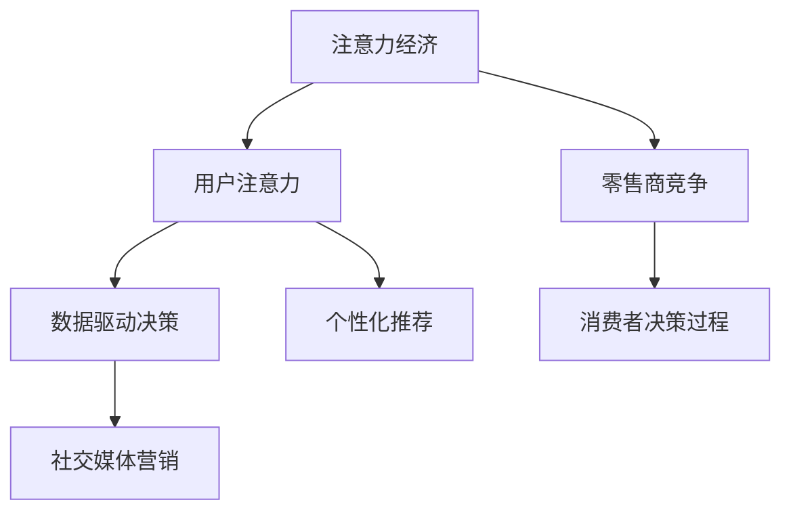

                 

# 注意力经济对传统零售业态的颠覆

## 1. 背景介绍

### 1.1 问题由来

进入21世纪以来，随着互联网技术的迅猛发展，传统零售业态面临着前所未有的变革。电子商务的兴起，线上购物的普及，以及社交媒体的崛起，深刻改变了消费者的购物习惯和零售商的经营模式。在这些变革中，注意力经济（Attention Economy）成为了最具代表性的趋势。

### 1.2 问题核心关键点

注意力经济是指在信息爆炸的时代，如何吸引、保持和利用用户的注意力，以创造经济价值。在零售领域，注意力经济主要体现在以下几个方面：

1. **消费者注意力争夺**：电商和社交媒体通过各种手段吸引消费者，如个性化推荐、社交广告、直播互动等，形成用户高度集中的流量池。
2. **零售商竞争**：商家需要不断创新，提升产品质量和用户体验，吸引用户选择自身品牌。
3. **消费者决策过程**：用户对品牌、商品、服务的选择越来越依赖于网络评价和社交推荐。
4. **数据驱动决策**：零售商通过大数据和AI技术，分析用户行为，优化产品推荐和广告投放，实现精准营销。

这些变化使得传统零售业态面临着巨大的挑战，同时也提供了新的发展机遇。

## 2. 核心概念与联系

### 2.1 核心概念概述

为了更好地理解注意力经济对零售业态的颠覆，本节将介绍几个密切相关的核心概念：

- **注意力经济**：基于用户注意力的经济模式，通过吸引和保持用户注意力，实现商品销售和品牌推广。
- **用户注意力**：指用户在信息消费过程中，对特定信息资源的关注和参与程度。
- **数据驱动决策**：利用数据分析和机器学习技术，基于用户行为数据进行业务决策。
- **个性化推荐**：根据用户历史行为和偏好，推荐可能感兴趣的商品或内容。
- **社交媒体营销**：通过社交平台分享和互动，提升品牌曝光率和用户参与度。

这些概念之间的逻辑关系可以通过以下Mermaid流程图来展示：



这个流程图展示了一些关键概念及其之间的关系：

1. 注意力经济通过吸引和保持用户注意力，实现商品销售和品牌推广。
2. 数据驱动决策和个性化推荐是注意力经济的核心工具，帮助商家精准把握用户需求。
3. 社交媒体营销通过社交平台增强用户参与度，提升品牌影响力。
4. 消费者决策过程受网络评价和社交推荐的影响，形成新的消费者行为模式。
5. 零售商竞争需要通过不断创新，提升产品质量和用户体验，吸引用户选择自身品牌。

这些概念共同构成了注意力经济在零售业态中的实践框架，推动了传统零售的转型升级。

## 3. 核心算法原理 & 具体操作步骤

### 3.1 算法原理概述

基于注意力经济的零售业态颠覆，主要依赖于以下几个核心算法：

1. **个性化推荐算法**：通过分析用户历史行为和偏好，预测用户可能感兴趣的商品或内容，实现精准营销。
2. **社交媒体影响力分析算法**：利用机器学习技术，评估用户在社交媒体上的影响力，指导广告投放和品牌推广。
3. **用户注意力模型**：通过建模用户对信息的关注程度，优化内容展示和广告投放策略，提高用户参与度。
4. **动态定价算法**：根据市场需求和竞争情况，实时调整商品价格，最大化销售收益。

这些算法的核心思想是通过数据和算法技术，精准把握用户需求，优化营销策略，提升用户满意度和品牌忠诚度。

### 3.2 算法步骤详解

以个性化推荐算法为例，以下是具体的操作步骤：

1. **数据收集**：收集用户历史行为数据，包括浏览、点击、购买、评价等信息。
2. **数据预处理**：清洗数据，处理缺失值和异常值，构建用户-商品评分矩阵。
3. **模型训练**：选择合适算法（如协同过滤、深度学习等），训练推荐模型，优化用户评分预测能力。
4. **模型评估**：在验证集上评估模型性能，调整模型参数，确保预测准确性。
5. **推荐生成**：将新用户输入，基于训练好的模型生成推荐结果。
6. **效果反馈**：收集用户反馈，持续优化推荐模型，提高推荐效果。

这些步骤确保了个性化推荐算法的有效性，能够及时、准确地为用户提供感兴趣的商品或内容，提升用户购物体验和满意度。

### 3.3 算法优缺点

基于注意力经济的个性化推荐算法具有以下优点：

1. **提升用户体验**：精准推荐用户感兴趣的商品，提升用户满意度和忠诚度。
2. **优化库存管理**：通过分析用户需求，优化商品库存和补货策略。
3. **增加销售额**：提高转化率和客单价，最大化销售收益。
4. **个性化营销**：利用用户行为数据，实现定制化广告投放和品牌推广。

同时，这些算法也存在一些局限性：

1. **数据隐私问题**：用户行为数据的收集和使用，可能侵犯用户隐私权，引发法律风险。
2. **推荐偏差**：个性化推荐算法可能存在偏差，导致用户陷入信息茧房，减少多元化的选择。
3. **算法复杂度**：个性化推荐算法的实现复杂度较高，需要大量数据和计算资源。
4. **用户反感**：频繁的推荐信息可能引起用户反感，降低用户参与度。

在实际应用中，商家需要平衡这些优缺点，确保推荐算法的合规性和有效性。

### 3.4 算法应用领域

基于注意力经济的个性化推荐算法，在零售领域得到了广泛应用，具体包括：

1. **电商平台**：如亚马逊、京东、淘宝等，通过个性化推荐提升用户购物体验，增加销售额。
2. **零售商**：如沃尔玛、家乐福、宜家等，利用推荐算法优化库存管理，提升运营效率。
3. **餐饮业**：如大众点评、美团等，推荐餐厅和菜品，提升用户消费体验。
4. **旅游业**：如携程、去哪儿等，推荐旅游目的地和行程，提高用户旅游体验。

此外，基于注意力经济的算法还被广泛应用于智能家居、医疗健康、金融保险等众多领域，推动了这些行业的发展和创新。

## 4. 数学模型和公式 & 详细讲解 & 举例说明

### 4.1 数学模型构建

为了更深入地理解个性化推荐算法的数学原理，本节将详细介绍推荐模型的一般形式和常见评估指标。

假设用户集合为 $U$，商品集合为 $I$，用户对商品的评分矩阵为 $R \in \mathbb{R}^{N \times M}$，其中 $N$ 表示用户数，$M$ 表示商品数。个性化推荐模型的目标是通过输入用户特征 $x_u$ 和商品特征 $x_i$，预测用户对商品的评分 $y_{ui}$。

### 4.2 公式推导过程

以协同过滤（Collaborative Filtering）为例，推荐模型的目标是最小化预测评分和真实评分之间的均方误差，公式如下：

$$
\min_{\theta} \frac{1}{N} \sum_{i=1}^{M} \sum_{u=1}^{N} (y_{ui} - \hat{y}_{ui})^2
$$

其中 $\hat{y}_{ui}$ 为推荐模型的预测评分，$\theta$ 为模型参数。

常见的协同过滤算法包括矩阵分解和基于用户-商品相似性的推荐方法。以矩阵分解为例，假设 $R = P \times Q$，其中 $P \in \mathbb{R}^{N \times K}$，$Q \in \mathbb{R}^{M \times K}$，$K$ 为分解因子。

对于用户 $u$ 和商品 $i$，推荐模型可以表示为：

$$
\hat{y}_{ui} = p_u^T q_i
$$

其中 $p_u$ 和 $q_i$ 为分解后的用户和商品向量，可以通过矩阵分解算法（如奇异值分解）求解。

### 4.3 案例分析与讲解

以 Netflix Prize 竞赛为例，Netflix 希望通过推荐算法，预测用户对未观看电影的评分。竞赛吸引了全球众多算法团队参与，最终 PrizeWinningMatrix 团队提出的矩阵分解算法获得了最佳成绩。

该团队在数据预处理、特征工程、模型训练等方面进行了深入研究，采用了基于低秩矩阵分解的用户-商品评分模型。通过对评分矩阵进行奇异值分解，得到了低秩逼近 $P$ 和 $Q$，再通过计算用户-商品向量的内积，预测用户评分。最终，该算法获得了显著的评分预测精度，提升了用户满意度。

## 5. 项目实践：代码实例和详细解释说明

### 5.1 开发环境搭建

在进行推荐系统开发前，需要搭建好开发环境。以下是使用Python进行TensorFlow和PyTorch开发的流程：

1. 安装Anaconda：从官网下载并安装Anaconda，用于创建独立的Python环境。

2. 创建并激活虚拟环境：
```bash
conda create -n tf-env python=3.8 
conda activate tf-env
```

3. 安装TensorFlow和PyTorch：根据CUDA版本，从官网获取对应的安装命令。例如：
```bash
conda install tensorflow=2.6 tf-nightly cudatoolkit=11.1 -c conda-forge
conda install pytorch torchvision torchaudio cudatoolkit=11.1 -c pytorch -c conda-forge
```

4. 安装推荐系统常用工具包：
```bash
pip install numpy pandas scikit-learn
```

完成上述步骤后，即可在`tf-env`环境中开始推荐系统开发。

### 5.2 源代码详细实现

以下是使用TensorFlow实现协同过滤算法的Python代码示例：

```python
import tensorflow as tf
import numpy as np

# 定义用户-商品评分矩阵
R = np.array([
    [0.5, 0.1, 0.0],
    [0.2, 0.3, 0.6],
    [0.3, 0.4, 0.5],
    [0.1, 0.4, 0.6],
    [0.4, 0.4, 0.3]
])

# 定义用户特征和商品特征
U = np.array([
    [1, 2],
    [3, 4],
    [5, 6],
    [7, 8],
    [9, 10]
])

I = np.array([
    [1, 2],
    [1, 3],
    [2, 3],
    [2, 4],
    [3, 4]
])

# 构建推荐模型
model = tf.keras.models.Sequential([
    tf.keras.layers.Dense(10, activation='relu', input_shape=(U.shape[1],)),
    tf.keras.layers.Dense(1)
])

# 编译模型
model.compile(optimizer='adam', loss='mse')

# 训练模型
model.fit(np.concatenate((U, I), axis=1), R, epochs=10, batch_size=8)

# 预测推荐评分
R_pred = model.predict(np.concatenate((np.ones((5, 1)), I), axis=1)).reshape(-1)
```

这段代码实现了协同过滤算法的训练和预测，展示了TensorFlow在推荐系统开发中的应用。

### 5.3 代码解读与分析

这段代码的核心步骤如下：

1. **数据准备**：定义用户-商品评分矩阵 $R$，以及用户特征 $U$ 和商品特征 $I$。
2. **模型构建**：定义推荐模型，采用全连接神经网络，包含一个隐藏层和一个输出层。
3. **模型编译**：使用Adam优化器，均方误差损失函数。
4. **模型训练**：通过`fit`方法，使用用户特征和商品特征的组合作为输入，训练模型。
5. **模型预测**：使用训练好的模型对商品 $i$ 进行推荐评分预测，输出结果为 $R_pred$。

这段代码展示了TensorFlow在推荐系统开发中的应用，具有高度的模块化和灵活性。

### 5.4 运行结果展示

运行上述代码，可以得到推荐评分预测结果。例如，对于商品 $i=3$，预测评分结果为 $R_pred[3]=0.4896$，表示用户对商品 $i=3$ 的预测评分为 $0.4896$。

## 6. 实际应用场景

### 6.1 智能电商

智能电商平台的推荐系统，是注意力经济在零售业态中最典型的应用之一。亚马逊、淘宝等电商平台通过推荐算法，为用户推荐商品，提升购物体验和转化率。

在实际操作中，电商平台通常会收集用户的浏览、点击、购买、评价等行为数据，构建用户-商品评分矩阵。然后，使用协同过滤、深度学习等算法，训练推荐模型，预测用户可能感兴趣的商品，并在前端展示推荐结果。

### 6.2 社交媒体广告

社交媒体广告是注意力经济的重要组成部分，通过精准投放广告，提升品牌曝光率和用户参与度。

以Facebook为例，Facebook通过分析用户行为和社交关系，构建用户-广告评分矩阵。然后，使用推荐算法，预测用户对不同广告的兴趣，实现个性化广告投放。同时，Facebook还利用用户互动数据，优化广告投放策略，提升广告效果。

### 6.3 内容推荐平台

内容推荐平台如Netflix、YouTube等，通过推荐算法，为用户推荐电影、视频等娱乐内容，提升用户体验。

Netflix使用基于协同过滤和矩阵分解的推荐算法，预测用户对电影的评分。同时，Netflix还引入了基于用户行为的大数据分析技术，优化推荐结果，提升用户满意度和留存率。

### 6.4 未来应用展望

随着技术的发展，基于注意力经济的推荐系统将进一步拓展应用场景，推动更多领域的数字化转型。

1. **智能家居**：通过推荐系统，推荐智能设备、家居用品等，提升用户生活品质。
2. **健康医疗**：推荐健康管理方案、药品、医疗服务，提升用户健康水平。
3. **金融保险**：推荐理财产品、保险产品，优化用户财务决策。
4. **教育培训**：推荐学习资源、培训课程，提升用户学习效果。

## 7. 工具和资源推荐

### 7.1 学习资源推荐

为了帮助开发者系统掌握基于注意力经济的推荐系统，这里推荐一些优质的学习资源：

1. **《推荐系统实践》**：由吴恩达教授主讲，系统介绍了推荐系统的工作原理和应用场景，适合初学者入门。
2. **《TensorFlow推荐系统》**：提供了TensorFlow在推荐系统开发中的详细教程，涵盖协同过滤、深度学习等常见算法。
3. **Kaggle竞赛**：Kaggle平台上有大量推荐系统竞赛，通过实际项目练习，提升开发能力。
4. **Python推荐系统库**：如Surprise、lightfm等，提供了丰富的推荐系统算法和模型评估工具。
5. **深度学习框架**：如TensorFlow、PyTorch等，提供强大的计算图和深度学习框架，支持推荐系统开发。

通过对这些资源的学习实践，相信你一定能够快速掌握基于注意力经济的推荐系统理论基础和实践技巧，并用于解决实际的推荐问题。

### 7.2 开发工具推荐

高效的开发离不开优秀的工具支持。以下是几款用于推荐系统开发的常用工具：

1. **TensorFlow和PyTorch**：强大的深度学习框架，支持多种算法和模型构建。
2. **Python推荐系统库**：如Surprise、lightfm等，提供丰富的推荐系统算法和模型评估工具。
3. **Jupyter Notebook**：交互式开发环境，支持代码调试和实验记录。
4. **TensorBoard和Weights & Biases**：可视化工具，实时监测模型训练状态和性能指标。
5. **Google Colab和Kaggle**：在线Jupyter Notebook环境，免费提供GPU/TPU算力，方便开发者快速上手实验最新模型。

合理利用这些工具，可以显著提升推荐系统开发的效率和效果，加快创新迭代的步伐。

### 7.3 相关论文推荐

基于注意力经济的推荐系统，是当前研究的热点方向。以下是几篇奠基性的相关论文，推荐阅读：

1. **Collaborative Filtering for Implicit Feedback Datasets**：提出了基于矩阵分解的协同过滤算法，解决了用户行为数据缺失的问题。
2. **Deep Collaborative Filtering**：使用深度学习模型，提升推荐系统的预测精度和泛化能力。
3. **Adaptive Collaborative Filtering**：提出自适应协同过滤算法，优化推荐模型训练过程，提升推荐效果。
4. **Attention-Based Recommender Systems**：引入注意力机制，增强推荐模型的特征表示能力和用户兴趣理解。
5. **Neural Recommendation Models**：利用神经网络模型，实现端到端的推荐系统构建，提升推荐效果和用户体验。

这些论文代表了大数据推荐系统的研究脉络。通过学习这些前沿成果，可以帮助研究者把握学科前进方向，激发更多的创新灵感。

## 8. 总结：未来发展趋势与挑战

### 8.1 总结

本文对基于注意力经济的推荐系统进行了全面系统的介绍。首先阐述了注意力经济对零售业态的颠覆，明确了推荐系统在吸引和保持用户注意力方面的独特价值。其次，从原理到实践，详细讲解了推荐系统的数学原理和关键操作步骤，给出了推荐系统开发的完整代码实例。同时，本文还探讨了推荐系统在智能电商、社交媒体广告、内容推荐平台等多个行业领域的应用前景，展示了注意力经济在零售业态中的广阔应用。

通过本文的系统梳理，可以看到，基于注意力经济的推荐系统已经成为零售业态中不可或缺的一部分，极大地提升了用户体验和品牌曝光度。未来，伴随技术的不断进步，基于注意力经济的推荐系统将更加智能化、普适化，为零售业态带来更深刻的变革。

### 8.2 未来发展趋势

展望未来，基于注意力经济的推荐系统将呈现以下几个发展趋势：

1. **数据质量提升**：通过大数据技术，收集和分析更多用户行为数据，提升推荐模型训练质量。
2. **模型精度优化**：引入深度学习、神经网络等先进算法，提升推荐模型预测精度和泛化能力。
3. **跨领域融合**：将推荐系统与物联网、区块链等技术结合，推动跨领域的数字化转型。
4. **用户隐私保护**：采用差分隐私、联邦学习等技术，保护用户隐私权，降低法律风险。
5. **个性化定制**：利用用户兴趣和行为数据，实现更加定制化的推荐服务。
6. **动态定价**：引入动态定价算法，优化价格策略，提升销售收益。

这些趋势将推动推荐系统在更多场景中的应用，推动零售业态的数字化、智能化和个性化发展。

### 8.3 面临的挑战

尽管基于注意力经济的推荐系统已经取得了显著成效，但在迈向更加智能化、普适化应用的过程中，它仍面临着诸多挑战：

1. **数据隐私问题**：用户行为数据的收集和使用，可能侵犯用户隐私权，引发法律风险。
2. **推荐偏差**：推荐算法可能存在偏差，导致用户陷入信息茧房，减少多元化的选择。
3. **算法复杂度**：推荐算法的实现复杂度较高，需要大量数据和计算资源。
4. **用户反感**：频繁的推荐信息可能引起用户反感，降低用户参与度。
5. **冷启动问题**：新用户缺乏历史数据，难以进行推荐。
6. **跨平台兼容性**：不同平台之间的数据和算法不一致，可能导致推荐结果差异。

在实际应用中，商家需要平衡这些优缺点，确保推荐算法的合规性和有效性。

### 8.4 研究展望

面对推荐系统面临的这些挑战，未来的研究需要在以下几个方面寻求新的突破：

1. **隐私保护技术**：采用差分隐私、联邦学习等技术，保护用户隐私权，降低法律风险。
2. **跨平台数据融合**：实现不同平台之间的数据和算法协同，提升推荐效果。
3. **推荐算法优化**：引入更加先进的算法，如深度学习、神经网络等，提升推荐模型性能。
4. **用户行为分析**：利用用户行为数据，深入分析用户需求，优化推荐策略。
5. **个性化定制**：实现更加定制化的推荐服务，提升用户体验。
6. **推荐系统评价**：构建更加全面的推荐系统评价指标，评估推荐效果和用户满意度。

这些研究方向的探索，将引领推荐系统技术的发展，为零售业态带来更多的创新和突破。

## 9. 附录：常见问题与解答

**Q1：推荐系统是否适用于所有NLP任务？**

A: 推荐系统主要适用于以用户为中心的商品推荐任务，如电商平台、社交媒体等。对于语言生成、机器翻译等NLP任务，推荐系统的效果可能不如专门的NLP模型。

**Q2：如何选择合适的推荐算法？**

A: 选择合适的推荐算法需要考虑数据特点和业务需求。常见的推荐算法包括协同过滤、矩阵分解、深度学习等。对于电商推荐，协同过滤和深度学习算法效果较好；对于社交媒体广告，矩阵分解和深度学习算法较为适合。

**Q3：推荐系统如何处理冷启动问题？**

A: 冷启动问题可以通过引入领域知识、利用社交关系、使用半监督学习等方式解决。例如，在电商推荐中，可以利用用户的历史行为数据，结合商品基本信息，推荐相关商品。

**Q4：推荐系统如何平衡推荐效果和个性化？**

A: 推荐系统需要在个性化和多样性之间找到平衡点。可以通过设置多样性约束、引入新颖性排名、使用多臂老虎机策略等方式，提升推荐系统的多样性，减少用户的信息茧房现象。

**Q5：推荐系统在落地部署时需要注意哪些问题？**

A: 推荐系统在落地部署时需要注意数据存储和传输、推荐模型训练和优化、推荐结果展示和反馈等问题。需要确保数据的及时性、准确性和安全性，同时优化推荐模型，提升用户体验和满意度。

通过本文的系统梳理，可以看到，基于注意力经济的推荐系统已经成为零售业态中不可或缺的一部分，极大地提升了用户体验和品牌曝光度。未来，伴随技术的不断进步，基于注意力经济的推荐系统将更加智能化、普适化，为零售业态带来更深刻的变革。

