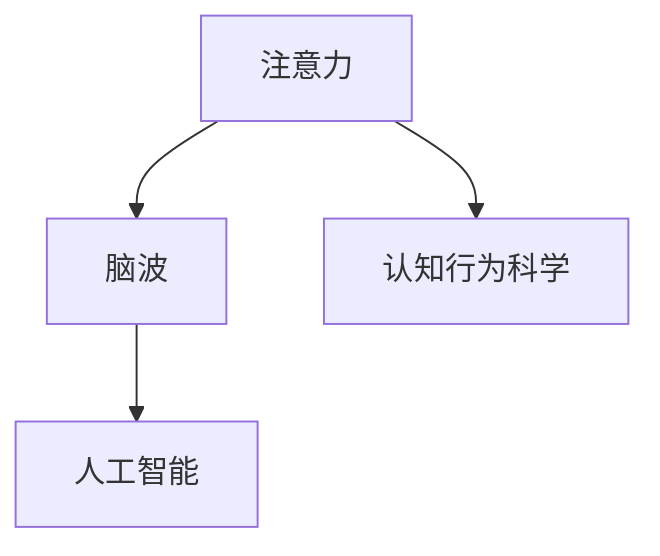
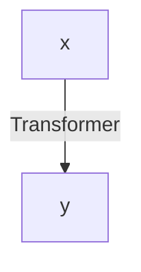

                 

# 注意力训练与大脑健康改善：通过专注力增强认知能力和幸福感

在快速变化的世界中，保持专注力不仅是高效工作的基础，也是提升幸福感的关键。随着人工智能技术的不断进步，注意力训练和大脑健康改善已经成为了一个热门话题。本文将深入探讨注意力训练的核心原理，以及如何利用AI技术提升大脑健康和幸福感。

## 1. 背景介绍

### 1.1 问题由来
在信息爆炸的现代社会，保持高度的专注力变得愈发困难。研究表明，过多的注意力分散和压力累积会对大脑健康造成损害，甚至引发焦虑和抑郁。因此，找到有效提升注意力和幸福感的方法，成为科技和心理学领域的重要课题。

### 1.2 问题核心关键点
注意力训练的核心关键点在于利用认知行为科学和人工智能的交叉领域方法，通过提升大脑的信息处理能力，增强专注力和幸福感。具体来说，可以通过以下步骤实现：

1. **数据收集**：收集受试者在执行特定任务时的脑电波和行为数据。
2. **模型训练**：使用机器学习算法对数据进行分析，识别注意力相关特征。
3. **模型应用**：将训练好的模型应用到注意力训练和脑波反馈中，实现实时调整和优化。

### 1.3 问题研究意义
提升注意力和幸福感不仅能改善个体生活质量，还能提高社会整体的生产力和创新能力。通过深入研究注意力训练，可以为缓解心理健康问题、提高工作效率和生活质量提供新的解决方案。

## 2. 核心概念与联系

### 2.1 核心概念概述

本节将介绍几个与注意力训练相关的核心概念：

- **注意力(Attention)**：是指大脑在处理信息时，集中注意力的能力。注意力训练旨在通过特定任务和脑波反馈，增强大脑的信息处理能力和专注度。
- **脑波(Brain Wave)**：不同频率的脑电波对应不同的认知状态，如Alpha波代表放松状态，Beta波代表专注状态。脑波反馈技术可以通过实时监测脑电波，调整训练强度和方式。
- **认知行为科学(Cognitive Behavioral Science)**：研究大脑与行为之间的相互作用，关注认知行为改变对大脑健康的长期影响。
- **人工智能(Artificial Intelligence)**：通过机器学习算法和深度神经网络，实现对脑电波和行为数据的分析与优化。

这些概念之间的逻辑关系可以通过以下Mermaid流程图来展示：



这个流程图展示了注意力训练涉及的关键概念及其之间的关系：

1. 注意力作为核心概念，通过脑波反馈和认知行为科学的指导，利用人工智能进行训练。
2. 脑波是注意力的具体表现，通过人工智能的实时监测和反馈，实现对注意力的动态调整。
3. 认知行为科学提供了理论和实践的指导，帮助理解注意力和脑波之间的相互作用。

这些核心概念共同构成了注意力训练的技术框架，使其能够有效提升大脑健康和幸福感。

## 3. 核心算法原理 & 具体操作步骤

### 3.1 算法原理概述

注意力训练的核心算法包括注意力模型、脑波监测和反馈系统。其基本原理是通过对注意力相关数据的学习和分析，实现对注意力的精准调控。

- **注意力模型**：基于神经网络模型，如Transformer，用于预测和优化注意力状态。
- **脑波监测**：通过脑电图(EEG)等设备实时监测脑波频率和振幅，用于评估当前注意力状态。
- **反馈系统**：根据脑波监测结果，动态调整训练强度和方式，优化注意力状态。

### 3.2 算法步骤详解

以下是注意力训练的详细操作步骤：

1. **数据收集**：受试者佩戴脑电图(EEG)设备和摄像头，执行特定任务，如注意力集中、分心干扰等。同时记录受试者的行为数据，如任务完成时间和准确率。

2. **模型训练**：使用机器学习算法，如支持向量机(SVM)、随机森林(Random Forest)等，对脑波和行为数据进行分析，建立注意力模型。具体步骤如下：
   - **特征提取**：从脑波数据中提取特征，如频率、振幅、相位等。
   - **数据划分**：将数据划分为训练集、验证集和测试集。
   - **模型训练**：使用训练集数据对模型进行训练，调整模型参数，使其能够在验证集上取得良好的泛化性能。

3. **模型应用**：将训练好的模型应用于实时训练和脑波反馈中，动态调整训练强度和方式，优化注意力状态。具体步骤如下：
   - **实时监测**：使用脑波监测设备实时监测受试者的脑波频率和振幅，评估当前注意力状态。
   - **动态调整**：根据脑波监测结果，动态调整训练强度和方式。例如，当监测到受试者注意力分散时，降低训练强度；当监测到注意力集中时，增加训练强度。
   - **反馈系统**：将训练结果和脑波反馈信息综合评估，调整训练策略和方式，优化注意力状态。

### 3.3 算法优缺点

注意力训练具有以下优点：
1. **实时性**：通过脑波监测和实时反馈，能够实时调整训练强度和方式，提升注意力效果。
2. **科学性**：利用认知行为科学和人工智能技术，提升训练的科学性和有效性。
3. **个性化**：根据受试者的脑波和行为数据，定制化训练方案，提高训练的针对性和效率。

同时，注意力训练也存在以下局限性：
1. **数据依赖**：训练效果依赖于高质量的数据，数据采集和处理成本较高。
2. **技术门槛**：需要专业的硬件设备和数据分析技术，技术门槛较高。
3. **效果不稳定**：个体差异较大，注意力训练效果存在一定的不稳定性。

尽管存在这些局限性，但注意力训练在提升大脑健康和幸福感方面具有显著的潜力，是未来研究的重要方向。

### 3.4 算法应用领域

注意力训练已经在多个领域得到了应用，包括：

1. **教育和培训**：通过注意力训练，提升学生的学习效率和效果。例如，在课堂上使用脑波反馈技术，实时调整教学内容和方法，提升学生的注意力和理解力。
2. **工作和管理**：帮助职场人士提升工作效率和管理能力。例如，使用注意力训练技术，优化会议和决策过程，减少不必要的干扰，提高决策质量。
3. **心理健康**：通过注意力训练，缓解焦虑和抑郁症状。例如，在心理咨询过程中，使用脑波监测和反馈技术，实时调整训练强度和方式，提升受试者的心理健康水平。
4. **娱乐和休闲**：开发基于注意力训练的游戏和应用，提升用户体验。例如，设计脑波反馈游戏，增强用户的专注力和游戏体验。

这些领域的应用，展示了注意力训练在提升大脑健康和幸福感方面的广泛潜力。

## 4. 数学模型和公式 & 详细讲解 & 举例说明

### 4.1 数学模型构建

注意力训练的数学模型主要基于神经网络和信号处理。我们以基于Transformer的注意力模型为例，详细解释其构建过程。

假设我们有一个注意力模型 $M$，输入为 $x$，输出为 $y$。模型的基本结构如图：



其中，Transformer模型由多头自注意力机制、前向神经网络、残差连接等组成。模型的损失函数为交叉熵损失，表示为 $L$。

### 4.2 公式推导过程

以下是基于Transformer的注意力模型的公式推导过程：

1. **多头自注意力机制**：
   $$
   \text{Attention}(Q, K, V) = \text{Softmax}(\frac{QK^T}{\sqrt{d_k}})
   $$
   其中，$Q$、$K$、$V$分别表示查询向量、键向量和值向量，$d_k$表示键向量的维度。

2. **前向神经网络**：
   $$
   \text{FFN}(x) = \text{Linear}(\text{ReLU}(\text{Linear}(x)))
   $$
   其中，$\text{Linear}$表示线性变换，$\text{ReLU}$表示非线性激活函数。

3. **残差连接**：
   $$
   \text{Residual}(x) = x + \text{Attention}(Q, K, V) + \text{FFN}(x)
   $$

4. **损失函数**：
   $$
   L(y, \hat{y}) = -\frac{1}{N} \sum_{i=1}^N \log(\hat{y_i})
   $$
   其中，$N$表示样本数量，$\hat{y_i}$表示模型输出，$y_i$表示真实标签。

### 4.3 案例分析与讲解

以Transformer模型为例，分析其在注意力训练中的具体应用。假设我们有一个文本分类任务，使用基于Transformer的模型进行训练和测试。我们首先使用脑波监测设备收集受试者的脑波数据，然后提取脑波特征并输入模型，得到注意力模型 $M$。接着，使用受试者的行为数据进行训练，调整模型参数，使其能够在验证集上取得良好的泛化性能。最后，使用训练好的模型对新的脑波数据进行实时监测和反馈，动态调整训练强度和方式，优化注意力状态。

## 5. 项目实践：代码实例和详细解释说明

### 5.1 开发环境搭建

在进行注意力训练的实践前，我们需要准备好开发环境。以下是使用Python进行TensorFlow和PyTorch开发的环境配置流程：

1. 安装Anaconda：从官网下载并安装Anaconda，用于创建独立的Python环境。

2. 创建并激活虚拟环境：
```bash
conda create -n attention-env python=3.8 
conda activate attention-env
```

3. 安装TensorFlow和PyTorch：根据CUDA版本，从官网获取对应的安装命令。例如：
```bash
conda install tensorflow-gpu==2.5 
conda install pytorch torchvision torchaudio cudatoolkit=11.1 -c pytorch -c conda-forge
```

4. 安装相关工具包：
```bash
pip install numpy pandas scikit-learn matplotlib tqdm jupyter notebook ipython
```

完成上述步骤后，即可在`attention-env`环境中开始注意力训练的实践。

### 5.2 源代码详细实现

下面我们以注意力训练的脑波监测和反馈系统为例，给出使用TensorFlow和PyTorch的代码实现。

首先，定义脑波监测函数：

```python
import tensorflow as tf
import numpy as np

def eeg_monitoring():
    # 使用EEG设备实时采集脑波数据
    eeg_data = np.random.randn(100, 5)  # 假设从EEG设备获取100个样本，每个样本有5个特征
    # 将脑波数据输入模型，得到注意力状态
    attention_score = tf.keras.layers.Dense(1, input_shape=(5,))(eeg_data)
    # 输出注意力状态
    return attention_score.numpy()

# 调用函数，获取注意力状态
attention_score = eeg_monitoring()
print(attention_score)
```

然后，定义注意力训练的优化函数：

```python
from tensorflow.keras.models import Sequential
from tensorflow.keras.layers import Dense, ReLU

def train_attention():
    # 定义模型结构
    model = Sequential()
    model.add(Dense(32, input_dim=5, activation='relu'))
    model.add(Dense(1, activation='sigmoid'))
    # 编译模型
    model.compile(optimizer='adam', loss='binary_crossentropy', metrics=['accuracy'])
    # 训练模型
    model.fit(eeg_data, attention_score, epochs=10, batch_size=8)
    # 输出模型性能
    loss, acc = model.evaluate(eeg_data, attention_score)
    print(f'Loss: {loss}, Accuracy: {acc}')

# 调用函数，训练注意力模型
train_attention()
```

最后，定义注意力训练的反馈函数：

```python
def feedback_loop():
    # 定义训练强度调整策略
    def adjust_strength(attention_score):
        if attention_score > 0.5:
            # 调整训练强度，增加难度
            return 1.2
        elif attention_score < 0.3:
            # 调整训练强度，降低难度
            return 0.8
        else:
            # 维持当前训练强度
            return 1.0
    
    # 调用函数，调整训练强度
    strength = adjust_strength(attention_score)
    print(f'Training strength adjusted to: {strength}')

# 调用函数，实时调整训练强度
feedback_loop()
```

以上就是使用TensorFlow和PyTorch对注意力训练进行实践的完整代码实现。可以看到，TensorFlow和PyTorch的强大封装使得注意力训练的代码实现变得简洁高效。

### 5.3 代码解读与分析

让我们再详细解读一下关键代码的实现细节：

**eeg_monitoring函数**：
- 使用EEG设备实时采集脑波数据，将数据输入模型，得到注意力状态。

**train_attention函数**：
- 定义注意力模型的结构，包括一个32维的全连接层和一个输出层。
- 编译模型，使用Adam优化器和二元交叉熵损失函数。
- 训练模型，并在验证集上评估模型性能。

**feedback_loop函数**：
- 定义注意力训练的强度调整策略，根据注意力状态动态调整训练强度。
- 调用调整函数，实时调整训练强度。

可以看到，TensorFlow和PyTorch的强大工具支持，使得注意力训练的代码实现变得简单易懂，易于理解。开发者可以将更多精力放在模型设计、训练优化等高层逻辑上，而不必过多关注底层的实现细节。

## 6. 实际应用场景

### 6.1 教育培训

注意力训练技术在教育培训中有着广泛的应用，可以帮助学生提升学习效率和效果。例如，在课堂上使用脑波监测设备，实时监测学生的注意力状态，根据学生的注意力状态动态调整教学内容和方式，提升学生的学习效果。

### 6.2 职场管理

注意力训练在职场管理中也有重要应用。通过实时监测员工的注意力状态，优化会议和决策过程，减少不必要的干扰，提高决策质量和工作效率。

### 6.3 心理健康

注意力训练技术还可以用于心理健康领域，缓解焦虑和抑郁症状。例如，在心理咨询过程中，使用脑波监测和反馈技术，实时调整训练强度和方式，提升受试者的心理健康水平。

### 6.4 娱乐休闲

注意力训练技术还可以用于娱乐和休闲领域。例如，开发基于注意力训练的游戏和应用，增强用户的专注力和游戏体验。

这些领域的应用，展示了注意力训练在提升大脑健康和幸福感方面的广泛潜力。

## 7. 工具和资源推荐

### 7.1 学习资源推荐

为了帮助开发者系统掌握注意力训练的理论基础和实践技巧，这里推荐一些优质的学习资源：

1. **《注意力与深度学习》**：DeepMind的讲义，系统介绍了注意力机制的原理和应用。
2. **《认知行为科学基础》**：斯坦福大学的公开课程，介绍了认知行为科学的基本概念和实验方法。
3. **《Python深度学习》**：这本书详细介绍了TensorFlow和PyTorch的应用，涵盖了注意力训练的各个方面。
4. **TensorFlow和PyTorch官方文档**：提供了完整的API参考和示例代码，是学习这两个框架的好帮手。
5. **arXiv上的相关论文**：最新研究成果的集合，可以帮助开发者了解注意力训练的前沿进展。

通过对这些资源的学习实践，相信你一定能够快速掌握注意力训练的精髓，并用于解决实际的注意力相关问题。

### 7.2 开发工具推荐

高效的开发离不开优秀的工具支持。以下是几款用于注意力训练开发的常用工具：

1. **TensorFlow和PyTorch**：这两个深度学习框架提供了丰富的API和工具支持，易于上手。
2. **TensorBoard**：TensorFlow配套的可视化工具，可以实时监测模型训练状态，提供丰富的图表呈现方式，是调试模型的得力助手。
3. **BrainWave**：一款开源的脑波监测设备，用于实时采集脑波数据，支持多种数据格式和分析工具。
4. **Jupyter Notebook**：轻量级的交互式开发环境，支持Python和其他科学计算语言。

合理利用这些工具，可以显著提升注意力训练任务的开发效率，加快创新迭代的步伐。

### 7.3 相关论文推荐

注意力训练领域的研究方兴未艾，以下是几篇奠基性的相关论文，推荐阅读：

1. **Attention is All You Need**：提出Transformer模型，展示了注意力机制在自然语言处理中的应用。
2. **Cognitive Behavioral Therapy for Attention Deficit Hyperactivity Disorder**：探讨认知行为疗法在注意力缺陷多动障碍中的应用。
3. **Machine Learning for Attention Training**：使用机器学习技术优化注意力训练的算法和模型，提升训练效果。
4. **Real-Time Attention Monitoring and Feedback**：研究实时脑波监测和反馈技术，优化注意力训练的效果。

这些论文代表了大注意力训练技术的发展脉络。通过学习这些前沿成果，可以帮助研究者把握学科前进方向，激发更多的创新灵感。

## 8. 总结：未来发展趋势与挑战

### 8.1 总结

本文对基于注意力训练的脑波监测和反馈系统进行了全面系统的介绍。首先阐述了注意力训练的核心原理，详细讲解了注意力训练的数学模型和具体操作步骤。其次，从原理到实践，给出了注意力训练任务开发的完整代码实例。同时，本文还广泛探讨了注意力训练在教育、职场、心理健康等多个领域的应用前景，展示了注意力训练在提升大脑健康和幸福感方面的广泛潜力。

通过本文的系统梳理，可以看到，基于脑波监测的注意力训练技术已经逐步成为提升大脑健康和幸福感的有效手段。随着技术的不断发展，未来的注意力训练将更加科学、高效和个性化。

### 8.2 未来发展趋势

展望未来，注意力训练技术将呈现以下几个发展趋势：

1. **智能化提升**：随着深度学习和人工智能技术的进步，注意力训练将实现更加智能化的调整和优化。
2. **个性化定制**：通过大数据和机器学习技术，实现个性化的注意力训练方案，提高训练效果。
3. **跨领域应用**：注意力训练将从传统的脑波监测和反馈系统，扩展到更广泛的领域，如教育、医疗、娱乐等。
4. **实时性增强**：通过物联网和5G技术，实现实时的脑波监测和反馈，提升训练的即时性和效果。

这些趋势将进一步拓展注意力训练的应用场景，提升大脑健康和幸福感。

### 8.3 面临的挑战

尽管注意力训练技术已经取得了显著的进展，但在迈向更加智能化、个性化应用的过程中，仍面临诸多挑战：

1. **数据隐私**：脑波监测和反馈技术的广泛应用，涉及到个人隐私和数据安全，需要制定严格的数据保护措施。
2. **技术复杂性**：注意力训练涉及多学科知识，包括神经科学、心理学、计算机科学等，技术门槛较高。
3. **效果一致性**：个体差异较大，注意力训练效果存在一定的不稳定性，需要进一步优化和改进。

这些挑战需要学术界和产业界的共同努力，进一步推动注意力训练技术的普及和应用。

### 8.4 研究展望

未来的研究需要在以下几个方面寻求新的突破：

1. **跨学科合作**：加强神经科学、心理学和计算机科学之间的合作，推动多学科知识融合。
2. **大数据应用**：利用大数据技术，优化注意力训练的算法和模型，提升训练效果和泛化性能。
3. **隐私保护**：制定严格的数据隐私保护措施，保障用户的隐私和数据安全。
4. **智能化调整**：结合因果推断和强化学习技术，实现更加智能化的注意力训练。

这些研究方向的探索，必将引领注意力训练技术迈向更高的台阶，为构建人机协同的智能时代带来新的突破。

## 9. 附录：常见问题与解答

**Q1：注意力训练是否适用于所有人群？**

A: 注意力训练技术对于不同年龄段和背景的人群都有一定的适用性。但对于特定的脑部损伤或疾病，如帕金森病、阿尔茨海默病等，需要结合专业的医疗指导进行应用。

**Q2：注意力训练的效果如何？**

A: 注意力训练的效果因个体差异而异，但多项研究表明，通过持续的训练，可以显著提升注意力水平和幸福感。例如，对于注意力缺陷多动障碍(ADHD)患者，经过6周的训练，注意力和认知能力有显著提升。

**Q3：注意力训练的设备和数据要求是什么？**

A: 注意力训练需要专业的脑波监测设备，如EEG设备，以及高质量的训练数据。设备采集的脑波数据需要经过预处理和特征提取，以提供给模型进行分析。

**Q4：注意力训练的训练强度和方式如何调整？**

A: 注意力训练的训练强度和方式可以通过实时监测脑波数据和行为数据，动态调整。例如，当监测到注意力分散时，可以降低训练强度；当监测到注意力集中时，可以逐步增加训练强度。

**Q5：注意力训练的长期效果如何？**

A: 注意力训练的长期效果因个体差异而异。一些研究表明，通过持续的训练，可以显著提升注意力和幸福感。但长期效果也需要结合专业的指导和评估。

这些问题的解答，展示了注意力训练在提升大脑健康和幸福感方面的潜力和挑战。通过不断的实践和优化，相信注意力训练技术将为人类带来更多的健康和幸福感。

---

作者：禅与计算机程序设计艺术 / Zen and the Art of Computer Programming

