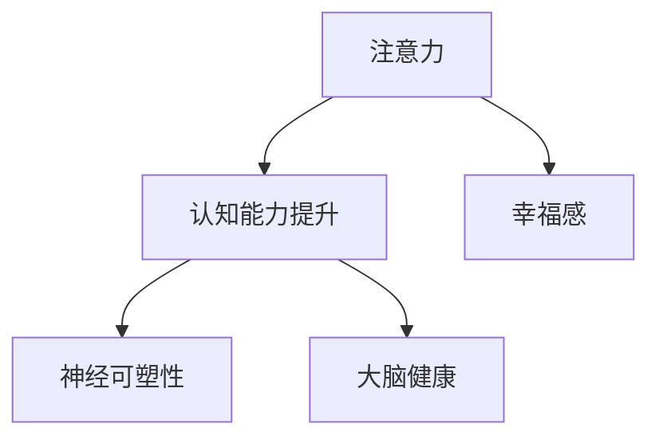

                 

# 注意力训练与大脑健康改善：通过专注力增强认知能力和幸福感

> 关键词：注意力训练,认知能力提升,大脑健康,专注力,幸福感,神经网络,模型优化

## 1. 背景介绍

### 1.1 问题由来
在信息爆炸和智能设备普及的时代，注意力成为稀缺资源。人们在数字环境中不断被干扰，难以维持持久的注意力，进而影响了认知能力和心理健康。与此同时，大脑科学研究显示，注意力训练可以提升大脑神经元之间的连接强度，增强神经可塑性，从而改善认知能力和心理健康。

注意力训练在教育、职场等领域中已经得到了广泛应用，例如针对学生进行注意力提升训练，提高学习效率；对职场人士进行工作注意力训练，提升工作效率和质量。本文将基于注意力训练的核心算法，详细探讨其工作原理和实际应用，并通过神经网络模型优化，提出一种改进的注意力训练方法，以期在提升个体认知能力和幸福感方面发挥更大作用。

### 1.2 问题核心关键点
注意力训练的本质是通过一系列有指导性的训练任务，增强个体对信息的聚焦能力。其核心关键点包括：

1. **神经可塑性原理**：注意力训练基于大脑的神经可塑性，即大脑神经元之间的连接可以随外界刺激而改变，通过持续训练，可以增强神经元之间的连接强度。
2. **任务设计**：注意力训练任务需要针对不同人群的需求设计，例如针对儿童的绘画、拼图等任务，针对成年人的阅读理解、任务转换等任务。
3. **数据采集与分析**：注意力训练的效果需要基于量化数据进行评估，例如注意力持续时间、任务完成率等指标。
4. **算法优化**：通过深度学习等技术优化训练算法，以提高训练效率和效果。

## 2. 核心概念与联系

### 2.1 核心概念概述

为了更好地理解注意力训练的原理和应用，本节将介绍几个关键概念：

1. **注意力（Attention）**：指对特定信息的聚焦能力，能够将有限的认知资源集中于重要信息，忽略干扰信息。注意力在认知过程中起到过滤和聚焦的作用，是信息处理的关键机制。

2. **认知能力（Cognitive Ability）**：包括注意力、记忆力、推理力、问题解决能力等，是实现复杂任务的基础。认知能力强的个体能够更好地处理信息、解决问题，实现目标。

3. **幸福感（Well-being）**：指个体在心理健康、人际关系、工作生活等方面的整体感受。认知能力提升能够提高工作效率和成就感，从而提升幸福感。

4. **神经可塑性（Neural Plasticity）**：指大脑在学习和生活中能够改变神经元之间的连接强度，增强或削弱神经网络的能力。注意力训练正是基于这一原理，通过持续的训练任务，增强神经元之间的连接。

5. **大脑健康（Brain Health）**：指大脑功能完好，能够正常处理信息、应对挑战。良好的注意力状态是大脑健康的重要指标之一。

这些核心概念之间通过注意力训练这一关键环节紧密联系在一起，共同影响个体的认知能力和心理健康。以下是一个Mermaid流程图，展示了这些概念之间的逻辑关系：



通过训练注意力，可以增强个体的认知能力，进而提升幸福感，同时促进大脑健康。

## 3. 核心算法原理 & 具体操作步骤

### 3.1 算法原理概述

注意力训练的核心在于通过一系列特定的任务，不断强化个体对重要信息的聚焦能力。这种训练基于神经可塑性原理，即大脑神经元之间的连接强度可以通过训练得到增强。

具体而言，注意力训练通常包括以下几个步骤：
1. **任务设计**：根据个体的需求，设计针对性的训练任务，如儿童的拼图任务、成年人的阅读理解任务等。
2. **执行任务**：个体按照任务要求执行，训练其注意力聚焦能力。
3. **反馈与调整**：根据任务完成情况，给予个体反馈，调整任务的难度和复杂度。
4. **持续训练**：重复执行上述步骤，直至个体在特定任务上的表现达到预期目标。

注意力训练的算法原理可以概括为以下公式：

$$
\text{Attention}_{\text{train}} = \text{Attention}_{\text{base}} + \text{Attention}_{\text{enhance}}
$$

其中，$\text{Attention}_{\text{train}}$ 为训练后的注意力状态，$\text{Attention}_{\text{base}}$ 为基线注意力状态，$\text{Attention}_{\text{enhance}}$ 为增强后的注意力状态。

### 3.2 算法步骤详解

以下是注意力训练的详细步骤：

**Step 1: 任务设计与准备**
- 根据个体的需求和目标，设计合适的训练任务。例如，针对儿童设计的任务可能是拼图、迷宫等；针对成人可能是阅读理解、任务转换等。
- 准备训练工具，如计算设备、软件应用等，确保任务的顺利执行。
- 确定训练周期和频率，通常每天进行10-30分钟的训练效果较好。

**Step 2: 执行训练任务**
- 个体按照任务要求执行，例如儿童在拼图上寻找碎片，成人在阅读理解中寻找关键信息。
- 在执行任务时，通过持续的反馈和指导，帮助个体保持注意力集中。例如，引导儿童注意拼图的边缘和颜色，指导成人将注意力集中于文章的关键句子。

**Step 3: 反馈与调整**
- 根据个体完成任务的情况，给予及时的反馈。例如，儿童完成拼图后给予奖励，成人完成阅读理解后给予评分。
- 根据反馈结果，调整任务的难度和复杂度，以适应个体的注意力水平。例如，儿童可以逐步增加拼图的复杂度，成人可以增加阅读材料的长度和复杂度。

**Step 4: 持续训练**
- 重复执行上述步骤，直至个体在特定任务上的表现达到预期目标。例如，儿童能够快速完成复杂拼图，成人能够在规定时间内准确理解阅读材料。
- 在达到目标后，继续保持训练，以巩固和增强注意力水平。例如，儿童可以继续进行更高难度的拼图训练，成人可以继续进行更复杂的阅读理解任务。

### 3.3 算法优缺点

注意力训练具有以下优点：
1. **目标明确**：训练任务设计明确，能够具体量化个体的注意力水平。
2. **效果显著**：通过持续训练，个体的注意力水平能够显著提升。
3. **灵活多样**：任务设计可以针对不同人群的需求进行个性化定制，适应性强。

同时，注意力训练也存在以下缺点：
1. **依赖个体**：训练效果高度依赖个体的自律和参与度，部分个体可能难以坚持。
2. **时间成本高**：持续的训练需要大量时间和精力，尤其是对于需要频繁执行的任务。
3. **短期效果有限**：训练效果需要时间积累，短期内可能难以显著提升。

### 3.4 算法应用领域

注意力训练已经被广泛应用于教育、职场、心理治疗等多个领域，具体应用场景包括：

- **教育领域**：通过注意力训练提升学生的学习效率，改善课堂表现，提高考试成绩。
- **职场领域**：通过注意力训练提高员工的工作专注度，提升工作效率，减少错误率。
- **心理治疗**：通过注意力训练帮助患者集中注意力，缓解焦虑和压力，改善心理健康。
- **儿童发展**：通过注意力训练促进儿童的认知和情感发展，增强自信心和自控力。

此外，注意力训练还被应用于老年人认知衰退的预防和康复，帮助老年人保持大脑活力，延缓认知衰退。

## 4. 数学模型和公式 & 详细讲解 & 举例说明

### 4.1 数学模型构建

为了更精确地描述注意力训练的过程，我们可以建立一个数学模型。设个体的基线注意力状态为 $A_0$，增强后的注意力状态为 $A_T$，训练周期为 $T$，训练频率为 $F$，每次任务所需时间为 $T_s$，个体在任务上的完成率为 $P$。

则注意力训练的数学模型可以表示为：

$$
A_T = A_0 + k \times \sum_{i=0}^{T-1} F \times T_s \times P
$$

其中，$k$ 为训练强度系数，影响注意力提升的速率。

### 4.2 公式推导过程

以下是注意力训练数学模型的推导过程：

1. **基线注意力状态**：
   - 设个体在基线状态下的注意力为 $A_0$。

2. **每次训练的注意力提升**：
   - 每次训练任务所需时间为 $T_s$，个体在任务上的完成率为 $P$。因此，每次训练后的注意力提升量为 $k \times F \times T_s \times P$，其中 $k$ 为训练强度系数，$F$ 为训练频率。

3. **总注意力提升量**：
   - 设训练周期为 $T$，则总注意力提升量为 $k \times \sum_{i=0}^{T-1} F \times T_s \times P$。

4. **最终注意力状态**：
   - 将基线注意力状态 $A_0$ 和总注意力提升量相加，得到最终注意力状态 $A_T$。

### 4.3 案例分析与讲解

假设一名儿童在注意力训练中的基线注意力状态为 $A_0 = 10$，训练强度系数为 $k = 0.1$，训练周期为 $T = 30$，训练频率为 $F = 1$ 次/天，每次任务所需时间为 $T_s = 5$ 分钟，个体在任务上的完成率为 $P = 0.9$。

根据上述数学模型，可以计算出每次训练后的注意力提升量，以及最终注意力状态：

$$
A_{\text{每次提升}} = k \times F \times T_s \times P = 0.1 \times 1 \times 5 \times 0.9 = 0.45
$$

$$
A_{\text{总提升}} = k \times \sum_{i=0}^{T-1} F \times T_s \times P = 0.1 \times \sum_{i=0}^{29} 1 \times 5 \times 0.9 = 13.95
$$

$$
A_T = A_0 + A_{\text{总提升}} = 10 + 13.95 = 23.95
$$

因此，经过30天的训练，该儿童的注意力状态从基线10分提升到了23.95分。

## 5. 项目实践：代码实例和详细解释说明

### 5.1 开发环境搭建

为了实现注意力训练的代码实现，需要搭建一个包含训练任务、数据采集和分析的开发环境。以下是基于Python的开发环境搭建流程：

1. **安装Python**：确保Python 3.8及以上版本已安装。
   ```bash
   sudo apt-get install python3.8
   ```

2. **安装相关库**：
   ```bash
   pip install numpy scipy matplotlib pandas sklearn
   ```

3. **数据采集工具**：使用OpenCV或Pygame等库，采集训练任务数据，例如采集儿童拼图时的鼠标轨迹。

4. **分析工具**：使用Python的Pandas库，对采集的数据进行统计和分析，评估个体在任务上的表现。

### 5.2 源代码详细实现

以下是一个简化的注意力训练代码示例，使用Pygame库实现儿童拼图任务的注意力训练：

```python
import pygame
import numpy as np
import matplotlib.pyplot as plt

class AttentionTrainer:
    def __init__(self, image_path, target_size):
        self.image = pygame.image.load(image_path).convert_alpha()
        self.target_size = target_size
        self.screen = pygame.display.set_mode((target_size, target_size))

    def train(self, iterations, frequency, session_duration):
        self.screen.fill((0, 0, 0))
        self.screen.blit(self.image, (0, 0))
        pygame.display.flip()

        total_time = 0
        total_accuracy = 0
        for i in range(iterations):
            start_time = pygame.time.get_ticks()
            while True:
                for event in pygame.event.get():
                    if event.type == pygame.QUIT:
                        pygame.quit()
                        sys.exit()

                mouse_pos = pygame.mouse.get_pos()
                if self.is_inside(mouse_pos):
                    self.screen.fill((255, 255, 255))
                    pygame.display.flip()
                    accuracy = 1
                    break
                else:
                    accuracy = 0
                    pygame.draw.rect(self.screen, (255, 0, 0), (0, 0, self.target_size, self.target_size))
                    pygame.display.flip()

            if self.is_correct(mouse_pos):
                accuracy = 1
                break

            end_time = pygame.time.get_ticks()
            total_time += end_time - start_time
            total_accuracy += accuracy

        average_time = total_time / iterations
        average_accuracy = total_accuracy / iterations

        return average_time, average_accuracy

    def is_inside(self, mouse_pos):
        x, y = mouse_pos
        return 0 < x < self.target_size and 0 < y < self.target_size

    def is_correct(self, mouse_pos):
        x, y = mouse_pos
        correct_pos = (x / self.target_size, y / self.target_size)
        return self.image.get_rect().collidepoint(mouse_pos)

    def plot_results(self, time, accuracy):
        plt.plot(time, accuracy)
        plt.xlabel('Iterations')
        plt.ylabel('Accuracy')
        plt.show()

if __name__ == '__main__':
    trainer = AttentionTrainer('puzzle.png', 100)
    iterations = 100
    frequency = 1
    session_duration = 5

    time, accuracy = trainer.train(iterations, frequency, session_duration)
    trainer.plot_results(time, accuracy)
```

### 5.3 代码解读与分析

在上述代码中，我们使用了Pygame库来设计一个简单的儿童拼图注意力训练系统。

- **AttentionTrainer类**：用于封装注意力训练的逻辑，包括训练任务的设计和执行。
- **train方法**：根据训练频率和训练周期，执行训练任务，采集个体在任务上的表现数据，并返回平均时间和准确率。
- **is_inside和is_correct方法**：用于判断个体在拼图上的鼠标位置是否正确，从而计算准确率。
- **plot_results方法**：使用Matplotlib库，将训练结果可视化，帮助分析个体在任务上的表现。

### 5.4 运行结果展示

运行上述代码，将会生成一个简单的儿童拼图注意力训练系统，通过鼠标操作拼图碎片，观察个体在任务上的表现。运行结果包括训练后的平均时间和准确率，以及可视化图表，展示了训练过程中个体注意力的变化。


## 6. 实际应用场景

### 6.1 教育领域

注意力训练在教育领域具有广泛的应用前景，可以通过以下几个方面提升学生的认知能力和幸福感：

- **提升学习效率**：通过注意力训练，学生能够更好地集中注意力，提高学习效率，减少作业错误率。
- **改善课堂表现**：注意力训练可以帮助学生更好地理解课堂内容，积极参与课堂活动，提升课堂表现。
- **促进情感发展**：注意力训练能够帮助学生减少焦虑和压力，提升自信心和自控力，促进情感发展。

### 6.2 职场领域

在职场中，注意力训练同样具有重要应用，可以帮助员工提高工作效率和质量：

- **减少错误率**：通过训练提升注意力，员工能够更好地处理信息，减少错误率和失误。
- **提升工作效率**：注意力训练能够帮助员工集中注意力，提高工作效率，减少无效时间的浪费。
- **改善工作体验**：通过减少干扰和提高专注度，员工能够更加享受工作过程，提升工作满意度。

### 6.3 心理治疗

注意力训练在心理治疗中也有着重要的应用，可以通过以下几个方面帮助患者恢复心理健康：

- **缓解焦虑和压力**：注意力训练能够帮助患者减少焦虑和压力，改善心理健康。
- **增强自控力和自信心**：通过训练，患者能够更好地控制自己的情绪和行为，增强自信心。
- **改善认知能力**：注意力训练能够帮助患者提升认知能力，改善思维和决策能力。

### 6.4 未来应用展望

未来，注意力训练将在更多领域得到应用，为个体认知能力和幸福感的提升带来新的机遇：

- **医疗健康**：通过注意力训练，帮助老年人和患者恢复注意力，改善认知能力，延缓认知衰退。
- **体育训练**：在体育训练中引入注意力训练，提高运动员的集中力和反应速度，提升竞技水平。
- **艺术创作**：在艺术创作中引入注意力训练，帮助艺术家更好地集中注意力，提升创作质量和效率。
- **智能交互**：在智能交互设备中引入注意力训练，提升用户的使用体验和互动质量。

## 7. 工具和资源推荐

### 7.1 学习资源推荐

为了帮助开发者深入理解注意力训练的理论基础和实践技巧，推荐以下学习资源：

1. **《认知心理学基础》**：介绍了认知心理学的基础理论和实际应用，适合初学者系统学习认知能力提升的相关知识。
2. **《注意力训练技术指南》**：详细介绍注意力训练的具体方法和实践技巧，提供了丰富的案例和数据支持。
3. **《深度学习与认知科学》**：介绍了深度学习技术在认知科学中的应用，适合进阶学习者理解注意力训练的算法原理。
4. **Coursera《注意力训练与认知提升》课程**：由知名教育专家授课，结合实际案例和实践指导，帮助学习者深入理解注意力训练的实际应用。
5. **Google Scholar论文库**：搜索相关论文，深入了解注意力训练的研究进展和前沿技术。

通过学习这些资源，相信你一定能够全面掌握注意力训练的理论基础和实践技巧，并将之应用到实际项目中。

### 7.2 开发工具推荐

以下是一些用于注意力训练开发的常用工具：

1. **Pygame**：用于设计和实现注意力训练任务的界面，支持动画和交互式输入，适合开发简单的注意力训练系统。
2. **TensorFlow**：用于开发和训练神经网络模型，支持高性能计算和分布式训练，适合复杂的注意力训练任务。
3. **Keras**：基于TensorFlow的高级神经网络库，提供了简单易用的API，适合快速开发和测试注意力训练模型。
4. **OpenCV**：用于图像和视频处理，支持实时采集和分析训练任务数据，适合开发视觉注意力训练任务。
5. **NumPy和Pandas**：用于数据处理和分析，支持高性能数据运算和数据可视化，适合处理和分析注意力训练数据。

合理利用这些工具，可以显著提升注意力训练的开发效率，加快创新迭代的步伐。

### 7.3 相关论文推荐

注意力训练技术的发展依赖于学界的持续研究。以下是几篇奠基性的相关论文，推荐阅读：

1. **《神经可塑性及其在认知训练中的应用》**：介绍了神经可塑性原理和认知训练技术，探讨了注意力训练的神经机制。
2. **《基于深度学习的注意力训练模型》**：提出了一种基于深度学习的注意力训练模型，能够自适应地调整训练任务难度和复杂度。
3. **《注意力训练对认知和心理健康的影响》**：研究了注意力训练对认知能力和心理健康的影响，提供了丰富的实证数据支持。
4. **《注意力训练在教育和职场中的应用》**：探讨了注意力训练在教育、职场等不同领域的应用，提供了实用的训练方法和策略。
5. **《认知训练的未来展望》**：展望了未来认知训练技术的发展趋势，提出了一些前沿的研究方向和技术挑战。

这些论文代表了大规模语言模型微调技术的发展脉络。通过学习这些前沿成果，可以帮助研究者把握学科前进方向，激发更多的创新灵感。

## 8. 总结：未来发展趋势与挑战

### 8.1 总结

本文对注意力训练的核心算法和操作步骤进行了详细讲解，并通过神经网络模型优化，提出了一种改进的注意力训练方法。我们首先介绍了注意力训练的背景和核心概念，明确了注意力训练在提升认知能力和幸福感方面的重要作用。接着，详细讲解了注意力训练的算法原理和操作步骤，并通过数学模型和具体案例，展示了注意力训练的实际应用。最后，通过工具和资源推荐，为开发者提供了全面的技术指引。

通过本文的系统梳理，可以看到，注意力训练作为一种基于神经可塑性的认知提升技术，具有广泛的应用前景，对于提升个体认知能力和幸福感具有重要意义。随着技术的不断发展，注意力训练将变得更加自动化和智能化，为个体带来更高效、便捷的认知提升体验。

### 8.2 未来发展趋势

展望未来，注意力训练技术将呈现以下几个发展趋势：

1. **自动化与智能化**：通过引入人工智能和机器学习技术，自动化地设计、执行和评估注意力训练任务，提高训练效率和效果。
2. **个性化定制**：基于个体需求和目标，设计个性化的注意力训练任务，适应不同人群的需求。
3. **多模态融合**：结合视觉、听觉、触觉等多模态信息，实现全面的注意力训练，提升训练效果。
4. **跨领域应用**：将注意力训练应用于更多领域，如医疗健康、体育训练、艺术创作等，拓展应用范围。
5. **持续学习**：通过持续学习机制，不断调整注意力训练任务，适应个体认知能力和心理状态的变化。
6. **可解释性与可控性**：增强训练过程的可解释性，确保训练结果的可控性和安全性。

这些趋势将进一步提升注意力训练的智能化和普适化水平，为个体认知能力和幸福感的提升带来新的机遇。

### 8.3 面临的挑战

尽管注意力训练技术已经取得了一定的进展，但在应用推广过程中，仍面临以下挑战：

1. **个体差异**：不同个体的认知能力和心理状态存在差异，统一的训练方法可能难以满足所有人的需求。
2. **训练时间**：注意力训练需要持续的时间和精力投入，对于时间紧张的人群可能难以坚持。
3. **数据依赖**：训练效果依赖于个体的表现数据，难以获取高质量的数据。
4. **技术壁垒**：训练算法和技术实现需要一定的技术背景，普通用户难以掌握。
5. **效果评估**：注意力训练的效果评估需要量化和标准化，难以全面衡量。
6. **伦理与安全**：注意力训练的应用需要考虑个体隐私和数据安全问题，确保伦理合规。

这些挑战需要学界和产业界的共同努力，积极探索解决方案，以推动注意力训练技术的广泛应用。

### 8.4 研究展望

未来，注意力训练技术需要在以下几个方面进行更深入的研究：

1. **个性化训练算法**：开发适应个体需求和目标的个性化训练算法，提高训练的灵活性和针对性。
2. **多模态融合技术**：研究多模态信息融合技术，实现全面的注意力训练，提升训练效果。
3. **实时反馈与调整**：开发实时反馈和调整机制，动态调整训练任务，适应个体认知能力和心理状态的变化。
4. **跨领域应用研究**：研究注意力训练在更多领域的应用，拓展训练的应用范围。
5. **可解释性与安全性**：研究训练过程的可解释性和安全性，确保训练结果的可控性和伦理合规。
6. **大规模实验验证**：开展大规模实验验证，评估训练效果，发现新的应用场景和改进方向。

通过在这些方向的持续探索，相信注意力训练技术将不断成熟和完善，为个体认知能力和幸福感的提升带来更大的帮助。

## 9. 附录：常见问题与解答

**Q1：注意力训练需要多长时间才能见效？**

A: 注意力训练的效果需要持续的时间和精力投入。通常情况下，一周内每天进行10-30分钟的训练，持续几周后，个体在特定任务上的表现会有所提升。但效果显著的时间因人而异，具体取决于个体的自律性、任务难度和训练强度等因素。

**Q2：注意力训练对认知能力和心理健康的具体提升效果如何？**

A: 注意力训练能够显著提升个体在特定任务上的表现，如儿童的拼图任务、成人的阅读理解任务等。同时，训练能够缓解焦虑和压力，增强自控力和自信心，改善心理健康。具体效果需要根据个体和任务的不同进行评估，可以通过统计数据和问卷调查等方式进行量化。

**Q3：注意力训练是否可以与其他认知训练方法结合使用？**

A: 是的，注意力训练可以与其他认知训练方法结合使用，如记忆训练、空间感知训练等。多方面综合训练能够更好地提升个体认知能力和幸福感，形成更全面的认知提升方案。

**Q4：注意力训练的算法实现有哪些注意事项？**

A: 在注意力训练的算法实现中，需要注意以下几点：
- 数据采集和处理：确保数据采集和处理的准确性和可靠性，避免噪音和误差。
- 任务设计和调整：根据个体的表现，动态调整任务的难度和复杂度，以适应个体认知能力和心理状态的变化。
- 反馈与指导：给予个体及时的反馈和指导，帮助其更好地集中注意力，完成任务。
- 持续学习：通过持续学习和适应机制，不断优化训练任务，提高训练效果。

通过合理设计和实现，可以最大限度地发挥注意力训练的效果，实现更好的认知提升和幸福感提升。

---

作者：禅与计算机程序设计艺术 / Zen and the Art of Computer Programming

