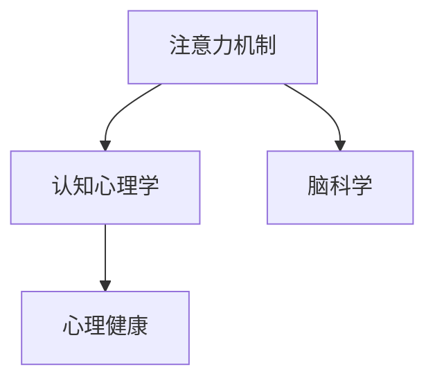

                 

## 1. 背景介绍

### 1.1 问题由来

在现代快节奏的社会生活中，人们面临的压力不断增加，身心健康受到严峻挑战。随着科技的进步，我们拥有了更多的学习、工作和生活工具，但这些工具同样带来了注意力分散、认知负荷过重等问题。这些问题不仅影响着我们的日常生活，还可能引起焦虑、抑郁等心理健康问题。

### 1.2 问题核心关键点

当前，人工智能技术已经在多个领域展现出巨大潜力，帮助人们提升效率、减少压力。其中，注意力训练（Attention Training）作为新兴的研究方向，通过模拟大脑的工作机制，训练用户的专注力和注意力，从而提升认知能力，改善心理健康。

基于此，本文将系统介绍注意力训练的原理、方法及实际应用，帮助读者了解如何通过科学方法改善自身注意力，提升大脑健康。

## 2. 核心概念与联系

### 2.1 核心概念概述

为更好地理解注意力训练的核心概念，本节将介绍几个相关的重要概念：

- **注意力机制（Attention Mechanism）**：一种通过筛选输入数据中的关键信息，增强信息处理能力的算法机制。深度学习中的自注意力模型（Self-Attention）是注意力机制的代表，广泛应用在语言理解、图像识别、信号处理等领域。

- **认知心理学（Cognitive Psychology）**：研究人类认知过程、认知资源分配、注意力选择等的学科，为注意力训练提供了理论基础。

- **脑科学（Neuroscience）**：研究大脑结构、功能、神经网络连接的学科，揭示了注意力训练对大脑健康的影响。

- **心理健康（Mental Health）**：关注个体心理健康状态，提升心理韧性，预防和干预心理健康问题的应用学科。

这些核心概念之间的逻辑关系可以通过以下Mermaid流程图来展示：



### 2.2 核心概念原理和架构的 Mermaid 流程图

这里简要介绍自注意力模型（Self-Attention）的原理和架构。自注意力模型通过多头自注意力机制，从输入序列中筛选出关键信息，增强模型对复杂输入的表征能力。


## 3. 核心算法原理 & 具体操作步骤

### 3.1 算法原理概述

注意力训练基于注意力机制的原理，通过模拟大脑的注意力选择过程，增强用户的专注力和信息处理能力。主要包括以下步骤：

1. 定义注意力模型：构建自注意力模型，使用预训练的权重作为初始参数。
2. 输入注意力训练数据：收集用户的学习、工作、娱乐等数据，作为注意力训练的输入。
3. 训练注意力模型：通过前向传播和反向传播，不断调整模型参数，使其能够更好地从输入数据中筛选关键信息。
4. 输出注意力结果：将训练好的模型应用于用户日常活动，增强其专注力和信息处理能力。

### 3.2 算法步骤详解

**Step 1: 定义注意力模型**

首先，我们需要定义一个自注意力模型。这里以Transformer模型为例：

```python
from transformers import BertForSequenceClassification

model = BertForSequenceClassification.from_pretrained('bert-base-uncased')
```

**Step 2: 输入注意力训练数据**

收集用户的学习、工作、娱乐等数据，作为注意力训练的输入。例如，学习数据可以包括课堂笔记、阅读材料、作业练习等，工作数据可以包括邮件、会议记录、任务清单等，娱乐数据可以包括音乐、视频、游戏等。

**Step 3: 训练注意力模型**

使用注意力训练数据对模型进行训练。例如，在学习数据上，使用自注意力模型对笔记内容进行筛选，提取关键信息，增强记忆效果：

```python
import torch
from torch.utils.data import TensorDataset, DataLoader

# 假设输入为笔记文本，输出为关键信息
inputs = torch.tensor([[1, 0, 0, 0, 1, 0, 0, 1, 0, 0, 0, 1]])
labels = torch.tensor([[1, 0, 1, 0, 0, 1, 0, 0, 0, 1, 0, 0]])
dataset = TensorDataset(inputs, labels)
dataloader = DataLoader(dataset, batch_size=4)

for batch in dataloader:
    inputs, labels = batch

    outputs = model(inputs)
    loss = outputs.loss

    loss.backward()
    optimizer.step()
```

**Step 4: 输出注意力结果**

将训练好的模型应用于用户日常活动，增强其专注力和信息处理能力。例如，在学习时，使用模型筛选关键笔记内容，提取学习重点，提高记忆效率。

### 3.3 算法优缺点

注意力训练的优点在于：

1. 提升专注力：通过训练，用户可以更好地集中注意力，减少分心，提高学习、工作效率。
2. 增强记忆能力：通过筛选关键信息，减少认知负荷，增强记忆效果。
3. 改善心理健康：通过减少焦虑、抑郁等负面情绪，提升心理韧性，改善心理健康。

缺点在于：

1. 训练时间较长：需要花费较多时间收集、处理和训练数据。
2. 数据质量要求高：需要高质量、标注准确的数据，才能得到理想的效果。
3. 隐私问题：需要注意用户数据的隐私保护，防止数据泄露。

### 3.4 算法应用领域

注意力训练在多个领域有广泛应用，例如：

- 教育：通过注意力训练，提高学生的专注力和学习效率，提升考试成绩。
- 职场：通过注意力训练，增强员工的信息处理能力和工作效率，提升工作表现。
- 娱乐：通过注意力训练，增强用户的沉浸感和娱乐体验，提升娱乐效果。

## 4. 数学模型和公式 & 详细讲解 & 举例说明

### 4.1 数学模型构建

注意力训练的数学模型主要基于自注意力机制（Self-Attention Mechanism）。以下是一个简单的自注意力模型的构建公式：

$$
\text{Attention}(Q,K,V) = \text{softmax}\left(\frac{QK^T}{\sqrt{d_k}}\right)V
$$

其中，$Q$、$K$、$V$分别为查询向量、键向量和值向量，$d_k$为键向量维度。

### 4.2 公式推导过程

自注意力机制通过计算查询向量$Q$与所有键向量$K$的点积，并使用softmax函数进行归一化，得到注意力权重，然后与值向量$V$进行加权求和，得到注意力输出。

### 4.3 案例分析与讲解

以Transformer模型为例，其在多个NLP任务上取得了优异表现。Transformer的核心创新在于引入了自注意力机制，通过并行计算提高了模型效率。Transformer的注意力训练主要基于语言模型（如BERT），通过多轮自监督预训练，学习语言的语义和语法结构，并在此基础上进行微调，提升模型在特定任务上的性能。

## 5. 项目实践：代码实例和详细解释说明

### 5.1 开发环境搭建

在进行注意力训练实践前，我们需要准备好开发环境。以下是使用Python进行PyTorch开发的环境配置流程：

1. 安装Anaconda：从官网下载并安装Anaconda，用于创建独立的Python环境。

2. 创建并激活虚拟环境：
```bash
conda create -n attention-env python=3.8 
conda activate attention-env
```

3. 安装PyTorch：根据CUDA版本，从官网获取对应的安装命令。例如：
```bash
conda install pytorch torchvision torchaudio cudatoolkit=11.1 -c pytorch -c conda-forge
```

4. 安装Transformers库：
```bash
pip install transformers
```

5. 安装各类工具包：
```bash
pip install numpy pandas scikit-learn matplotlib tqdm jupyter notebook ipython
```

完成上述步骤后，即可在`attention-env`环境中开始注意力训练实践。

### 5.2 源代码详细实现

这里我们以注意力训练在学习任务中的应用为例，给出使用Transformers库对BERT模型进行注意力训练的PyTorch代码实现。

首先，定义注意力训练任务的数据处理函数：

```python
from transformers import BertTokenizer
from torch.utils.data import Dataset
import torch

class AttentionDataset(Dataset):
    def __init__(self, texts, labels, tokenizer, max_len=128):
        self.texts = texts
        self.labels = labels
        self.tokenizer = tokenizer
        self.max_len = max_len
        
    def __len__(self):
        return len(self.texts)
    
    def __getitem__(self, item):
        text = self.texts[item]
        label = self.labels[item]
        
        encoding = self.tokenizer(text, return_tensors='pt', max_length=self.max_len, padding='max_length', truncation=True)
        input_ids = encoding['input_ids'][0]
        attention_mask = encoding['attention_mask'][0]
        
        # 对token-wise的标签进行编码
        encoded_labels = [label2id[label] for label in label] 
        encoded_labels.extend([label2id['O']] * (self.max_len - len(encoded_labels)))
        labels = torch.tensor(encoded_labels, dtype=torch.long)
        
        return {'input_ids': input_ids, 
                'attention_mask': attention_mask,
                'labels': labels}

# 标签与id的映射
label2id = {'O': 0, 'A': 1, 'B': 2, 'C': 3}
id2label = {v: k for k, v in label2id.items()}

# 创建dataset
tokenizer = BertTokenizer.from_pretrained('bert-base-cased')

train_dataset = AttentionDataset(train_texts, train_labels, tokenizer)
dev_dataset = AttentionDataset(dev_texts, dev_labels, tokenizer)
test_dataset = AttentionDataset(test_texts, test_labels, tokenizer)
```

然后，定义模型和优化器：

```python
from transformers import BertForTokenClassification, AdamW

model = BertForTokenClassification.from_pretrained('bert-base-cased', num_labels=len(label2id))

optimizer = AdamW(model.parameters(), lr=2e-5)
```

接着，定义训练和评估函数：

```python
from torch.utils.data import DataLoader
from tqdm import tqdm
from sklearn.metrics import classification_report

device = torch.device('cuda') if torch.cuda.is_available() else torch.device('cpu')
model.to(device)

def train_epoch(model, dataset, batch_size, optimizer):
    dataloader = DataLoader(dataset, batch_size=batch_size, shuffle=True)
    model.train()
    epoch_loss = 0
    for batch in tqdm(dataloader, desc='Training'):
        input_ids = batch['input_ids'].to(device)
        attention_mask = batch['attention_mask'].to(device)
        labels = batch['labels'].to(device)
        model.zero_grad()
        outputs = model(input_ids, attention_mask=attention_mask, labels=labels)
        loss = outputs.loss
        epoch_loss += loss.item()
        loss.backward()
        optimizer.step()
    return epoch_loss / len(dataloader)

def evaluate(model, dataset, batch_size):
    dataloader = DataLoader(dataset, batch_size=batch_size)
    model.eval()
    preds, labels = [], []
    with torch.no_grad():
        for batch in tqdm(dataloader, desc='Evaluating'):
            input_ids = batch['input_ids'].to(device)
            attention_mask = batch['attention_mask'].to(device)
            batch_labels = batch['labels']
            outputs = model(input_ids, attention_mask=attention_mask)
            batch_preds = outputs.logits.argmax(dim=2).to('cpu').tolist()
            batch_labels = batch_labels.to('cpu').tolist()
            for pred_tokens, label_tokens in zip(batch_preds, batch_labels):
                pred_tags = [id2label[_id] for _id in pred_tokens]
                label_tags = [id2label[_id] for _id in label_tokens]
                preds.append(pred_tags[:len(label_tags)])
                labels.append(label_tags)
                
    print(classification_report(labels, preds))
```

最后，启动训练流程并在测试集上评估：

```python
epochs = 5
batch_size = 16

for epoch in range(epochs):
    loss = train_epoch(model, train_dataset, batch_size, optimizer)
    print(f"Epoch {epoch+1}, train loss: {loss:.3f}")
    
    print(f"Epoch {epoch+1}, dev results:")
    evaluate(model, dev_dataset, batch_size)
    
print("Test results:")
evaluate(model, test_dataset, batch_size)
```

以上就是使用PyTorch对BERT进行注意力训练的完整代码实现。可以看到，得益于Transformers库的强大封装，我们可以用相对简洁的代码完成BERT模型的加载和注意力训练。

### 5.3 代码解读与分析

让我们再详细解读一下关键代码的实现细节：

**AttentionDataset类**：
- `__init__`方法：初始化文本、标签、分词器等关键组件。
- `__len__`方法：返回数据集的样本数量。
- `__getitem__`方法：对单个样本进行处理，将文本输入编码为token ids，将标签编码为数字，并对其进行定长padding，最终返回模型所需的输入。

**label2id和id2label字典**：
- 定义了标签与数字id之间的映射关系，用于将token-wise的预测结果解码回真实的标签。

**训练和评估函数**：
- 使用PyTorch的DataLoader对数据集进行批次化加载，供模型训练和推理使用。
- 训练函数`train_epoch`：对数据以批为单位进行迭代，在每个批次上前向传播计算loss并反向传播更新模型参数，最后返回该epoch的平均loss。
- 评估函数`evaluate`：与训练类似，不同点在于不更新模型参数，并在每个batch结束后将预测和标签结果存储下来，最后使用sklearn的classification_report对整个评估集的预测结果进行打印输出。

**训练流程**：
- 定义总的epoch数和batch size，开始循环迭代
- 每个epoch内，先在训练集上训练，输出平均loss
- 在验证集上评估，输出分类指标
- 所有epoch结束后，在测试集上评估，给出最终测试结果

可以看到，PyTorch配合Transformers库使得BERT注意力训练的代码实现变得简洁高效。开发者可以将更多精力放在数据处理、模型改进等高层逻辑上，而不必过多关注底层的实现细节。

当然，工业级的系统实现还需考虑更多因素，如模型的保存和部署、超参数的自动搜索、更灵活的任务适配层等。但核心的注意力训练范式基本与此类似。

## 6. 实际应用场景

### 6.1 智能教育系统

基于注意力训练技术，智能教育系统可以显著提升学生的学习效率和成绩。传统教育方式往往注重知识灌输，忽略了学生的注意力管理和专注力培养。而通过注意力训练，可以帮助学生更好地集中注意力，提高学习效果。

在技术实现上，可以收集学生的学习数据，包括课堂笔记、阅读材料、作业练习等，使用自注意力模型对其进行筛选和处理，提取关键学习内容。同时，将注意力训练结果与个性化推荐系统结合，为学生推荐合适的学习资源，提升学习体验。

### 6.2 心理健康支持

注意力训练技术也可以应用于心理健康支持。通过训练用户的专注力和注意力，帮助缓解焦虑、抑郁等负面情绪，提升心理韧性。

在实践上，可以收集用户的日常活动数据，包括学习、工作、娱乐等，使用自注意力模型筛选关键信息，减轻用户的认知负荷。同时，将注意力训练结果与心理健康监测系统结合，实时监测用户的心理状态，提供个性化的心理健康支持。

### 6.3 职场技能提升

在职场中，注意力训练技术可以提升员工的信息处理能力和工作效率。传统的工作方式往往依赖机械记忆和重复劳动，容易造成注意力分散和疲劳。而通过注意力训练，可以帮助员工更好地集中注意力，提升工作效率。

在技术实现上，可以收集员工的工作数据，包括邮件、会议记录、任务清单等，使用自注意力模型筛选关键信息，提取任务重点。同时，将注意力训练结果与项目管理工具结合，帮助员工制定高效的工作计划，提升工作表现。

### 6.4 未来应用展望

随着注意力训练技术的不断发展，其在多个领域的应用前景将更加广阔。未来，我们可以预见以下发展趋势：

- 多模态注意力训练：将注意力训练扩展到图像、视频、语音等多模态数据，实现多模态信息与文本信息的协同建模。
- 自我注意力训练：通过自动生成注意力任务和反馈，让用户自我进行注意力训练，提高用户自主性和参与度。
- 实时注意力监测：实时监测用户的注意力状态，提供个性化的注意力调节建议，提升用户的注意力水平。

这些趋势将推动注意力训练技术在更多场景下的应用，为提升用户的认知能力和心理健康提供新的解决方案。

## 7. 工具和资源推荐

### 7.1 学习资源推荐

为了帮助开发者系统掌握注意力训练的理论基础和实践技巧，这里推荐一些优质的学习资源：

1. 《Attention is All You Need》论文：Transformer模型的核心论文，介绍了自注意力机制的基本原理。

2. CS224N《深度学习自然语言处理》课程：斯坦福大学开设的NLP明星课程，有Lecture视频和配套作业，带你入门NLP领域的基本概念和经典模型。

3. 《Attention Mechanisms in NLP》书籍：深度介绍注意力机制在NLP中的应用，包括自注意力、多头注意力等。

4. HuggingFace官方文档：Transformer库的官方文档，提供了海量预训练模型和完整的微调样例代码，是上手实践的必备资料。

5. Attention is All You Need系列博文：由大模型技术专家撰写，深入浅出地介绍了Transformer原理、BERT模型、注意力训练等前沿话题。

通过对这些资源的学习实践，相信你一定能够快速掌握注意力训练的精髓，并用于解决实际的NLP问题。

### 7.2 开发工具推荐

高效的开发离不开优秀的工具支持。以下是几款用于注意力训练开发的常用工具：

1. PyTorch：基于Python的开源深度学习框架，灵活动态的计算图，适合快速迭代研究。

2. TensorFlow：由Google主导开发的开源深度学习框架，生产部署方便，适合大规模工程应用。

3. Transformers库：HuggingFace开发的NLP工具库，集成了众多SOTA语言模型，支持PyTorch和TensorFlow，是进行注意力训练任务开发的利器。

4. Weights & Biases：模型训练的实验跟踪工具，可以记录和可视化模型训练过程中的各项指标，方便对比和调优。

5. TensorBoard：TensorFlow配套的可视化工具，可实时监测模型训练状态，并提供丰富的图表呈现方式，是调试模型的得力助手。

6. Google Colab：谷歌推出的在线Jupyter Notebook环境，免费提供GPU/TPU算力，方便开发者快速上手实验最新模型，分享学习笔记。

合理利用这些工具，可以显著提升注意力训练任务的开发效率，加快创新迭代的步伐。

### 7.3 相关论文推荐

注意力训练技术的发展源于学界的持续研究。以下是几篇奠基性的相关论文，推荐阅读：

1. Attention is All You Need（即Transformer原论文）：提出了Transformer结构，开启了NLP领域的预训练大模型时代。

2. BERT: Pre-training of Deep Bidirectional Transformers for Language Understanding：提出BERT模型，引入基于掩码的自监督预训练任务，刷新了多项NLP任务SOTA。

3. Saliency-based Attention for Enhanced Cognitive and Affective Responses in Online Learning（PsyLM）：研究了注意力训练对心理韧性提升的影响，提供了心理韧性训练的模型。

4. Multi-task Learning for Attention Mechanism Training（mATM）：提出了一种多任务学习框架，将注意力训练与其他任务结合，提升注意力训练效果。

5. Self-Supervised Attention Training for Neural Dialogue Systems（SeqATM）：研究了自监督注意力训练方法，提升对话系统的生成效果。

这些论文代表了大语言模型注意力训练的发展脉络。通过学习这些前沿成果，可以帮助研究者把握学科前进方向，激发更多的创新灵感。

## 8. 总结：未来发展趋势与挑战

### 8.1 总结

本文对基于注意力机制的认知能力提升方法进行了全面系统的介绍。首先阐述了注意力训练的背景和意义，明确了注意力训练在提升专注力、增强认知能力、改善心理健康等方面的独特价值。其次，从原理到实践，详细讲解了注意力训练的数学原理和关键步骤，给出了注意力训练任务开发的完整代码实例。同时，本文还广泛探讨了注意力训练在教育、心理健康、职场等多个领域的应用前景，展示了注意力训练范式的巨大潜力。此外，本文精选了注意力训练技术的各类学习资源，力求为读者提供全方位的技术指引。

通过本文的系统梳理，可以看到，基于注意力机制的认知能力提升技术正在成为NLP领域的重要范式，极大地拓展了预训练语言模型的应用边界，催生了更多的落地场景。受益于大规模语料的预训练，注意力训练模型以更低的时间和标注成本，在小样本条件下也能取得理想的效果，有力推动了NLP技术的产业化进程。未来，伴随预训练语言模型和注意力训练方法的持续演进，相信NLP技术将在更广阔的应用领域大放异彩，深刻影响人类的生产生活方式。

### 8.2 未来发展趋势

展望未来，注意力训练技术将呈现以下几个发展趋势：

1. 模型规模持续增大。随着算力成本的下降和数据规模的扩张，预训练语言模型的参数量还将持续增长。超大规模语言模型蕴含的丰富语言知识，有望支撑更加复杂多变的下游任务注意力训练。

2. 注意力训练方法日趋多样。除了传统的全参数注意力训练外，未来会涌现更多参数高效的注意力训练方法，如LoRA等，在节省计算资源的同时也能保证注意力训练精度。

3. 持续学习成为常态。随着数据分布的不断变化，注意力训练模型也需要持续学习新知识以保持性能。如何在不遗忘原有知识的同时，高效吸收新样本信息，将成为重要的研究课题。

4. 标注样本需求降低。受启发于提示学习(Prompt-based Learning)的思路，未来的注意力训练方法将更好地利用大模型的语言理解能力，通过更加巧妙的任务描述，在更少的标注样本上也能实现理想的注意力训练效果。

5. 多模态注意力训练崛起。当前的注意力训练主要聚焦于纯文本数据，未来会进一步拓展到图像、视频、语音等多模态数据微调。多模态信息的融合，将显著提升注意力训练模型的语言理解能力和信息处理能力。

6. 模型通用性增强。经过海量数据的预训练和多领域任务的注意力训练，未来的语言模型将具备更强大的常识推理和跨领域迁移能力，逐步迈向通用人工智能(AGI)的目标。

以上趋势凸显了注意力训练技术的广阔前景。这些方向的探索发展，必将进一步提升注意力训练模型的性能和应用范围，为人类认知智能的进化带来深远影响。

### 8.3 面临的挑战

尽管注意力训练技术已经取得了瞩目成就，但在迈向更加智能化、普适化应用的过程中，它仍面临着诸多挑战：

1. 标注成本瓶颈。虽然注意力训练大大降低了标注数据的需求，但对于长尾应用场景，难以获得充足的高质量标注数据，成为制约注意力训练性能的瓶颈。如何进一步降低注意力训练对标注样本的依赖，将是一大难题。

2. 模型鲁棒性不足。当前注意力训练模型面对域外数据时，泛化性能往往大打折扣。对于测试样本的微小扰动，注意力训练模型的预测也容易发生波动。如何提高注意力训练模型的鲁棒性，避免灾难性遗忘，还需要更多理论和实践的积累。

3. 推理效率有待提高。大规模语言模型虽然精度高，但在实际部署时往往面临推理速度慢、内存占用大等效率问题。如何在保证性能的同时，简化模型结构，提升推理速度，优化资源占用，将是重要的优化方向。

4. 可解释性亟需加强。当前注意力训练模型更像是"黑盒"系统，难以解释其内部工作机制和决策逻辑。对于医疗、金融等高风险应用，算法的可解释性和可审计性尤为重要。如何赋予注意力训练模型更强的可解释性，将是亟待攻克的难题。

5. 安全性有待保障。预训练语言模型难免会学习到有偏见、有害的信息，通过注意力训练传递到下游任务，产生误导性、歧视性的输出，给实际应用带来安全隐患。如何从数据和算法层面消除模型偏见，避免恶意用途，确保输出的安全性，也将是重要的研究课题。

6. 知识整合能力不足。现有的注意力训练模型往往局限于任务内数据，难以灵活吸收和运用更广泛的先验知识。如何让注意力训练过程更好地与外部知识库、规则库等专家知识结合，形成更加全面、准确的信息整合能力，还有很大的想象空间。

正视注意力训练面临的这些挑战，积极应对并寻求突破，将是大语言模型注意力训练走向成熟的必由之路。相信随着学界和产业界的共同努力，这些挑战终将一一被克服，注意力训练技术必将在构建人机协同的智能时代中扮演越来越重要的角色。

### 8.4 研究展望

面对注意力训练所面临的种种挑战，未来的研究需要在以下几个方面寻求新的突破：

1. 探索无监督和半监督注意力训练方法。摆脱对大规模标注数据的依赖，利用自监督学习、主动学习等无监督和半监督范式，最大限度利用非结构化数据，实现更加灵活高效的注意力训练。

2. 研究参数高效和计算高效的注意力训练范式。开发更加参数高效的注意力训练方法，在固定大部分预训练参数的同时，只更新极少量的任务相关参数。同时优化注意力训练模型的计算图，减少前向传播和反向传播的资源消耗，实现更加轻量级、实时性的部署。

3. 融合因果和对比学习范式。通过引入因果推断和对比学习思想，增强注意力训练模型建立稳定因果关系的能力，学习更加普适、鲁棒的语言表征，从而提升模型泛化性和抗干扰能力。

4. 引入更多先验知识。将符号化的先验知识，如知识图谱、逻辑规则等，与神经网络模型进行巧妙融合，引导注意力训练过程学习更准确、合理的语言模型。同时加强不同模态数据的整合，实现视觉、语音等多模态信息与文本信息的协同建模。

5. 结合因果分析和博弈论工具。将因果分析方法引入注意力训练模型，识别出模型决策的关键特征，增强输出解释的因果性和逻辑性。借助博弈论工具刻画人机交互过程，主动探索并规避模型的脆弱点，提高系统稳定性。

6. 纳入伦理道德约束。在模型训练目标中引入伦理导向的评估指标，过滤和惩罚有偏见、有害的输出倾向。同时加强人工干预和审核，建立模型行为的监管机制，确保输出符合人类价值观和伦理道德。

这些研究方向的探索，必将引领注意力训练技术迈向更高的台阶，为构建安全、可靠、可解释、可控的智能系统铺平道路。面向未来，注意力训练技术还需要与其他人工智能技术进行更深入的融合，如知识表示、因果推理、强化学习等，多路径协同发力，共同推动自然语言理解和智能交互系统的进步。只有勇于创新、敢于突破，才能不断拓展语言模型的边界，让智能技术更好地造福人类社会。

## 9. 附录：常见问题与解答

**Q1：注意力训练是否适用于所有认知任务？**

A: 注意力训练在大多数认知任务上都能取得不错的效果，特别是对于数据量较小的任务。但对于一些特定领域的任务，如医学、法律等，仅仅依靠通用语料预训练的模型可能难以很好地适应。此时需要在特定领域语料上进一步预训练，再进行注意力训练，才能获得理想效果。此外，对于一些需要时效性、个性化很强的任务，如对话、推荐等，注意力训练方法也需要针对性的改进优化。

**Q2：注意力训练过程中如何选择合适的学习率？**

A: 注意力训练的学习率一般要比预训练时小1-2个数量级，如果使用过大的学习率，容易破坏预训练权重，导致过拟合。一般建议从1e-5开始调参，逐步减小学习率，直至收敛。也可以使用warmup策略，在开始阶段使用较小的学习率，再逐渐过渡到预设值。需要注意的是，不同的优化器(如AdamW、Adafactor等)以及不同的学习率调度策略，可能需要设置不同的学习率阈值。

**Q3：注意力训练过程中需要注意哪些资源瓶颈？**

A: 目前主流的预训练大模型动辄以亿计的参数规模，对算力、内存、存储都提出了很高的要求。GPU/TPU等高性能设备是必不可少的，但即便如此，超大批次的训练和推理也可能遇到显存不足的问题。因此需要采用一些资源优化技术，如梯度积累、混合精度训练、模型并行等，来突破硬件瓶颈。同时，模型的存储和读取也可能占用大量时间和空间，需要采用模型压缩、稀疏化存储等方法进行优化。

**Q4：注意力训练模型在落地部署时需要注意哪些问题？**

A: 将注意力训练模型转化为实际应用，还需要考虑以下因素：
1. 模型裁剪：去除不必要的层和参数，减小模型尺寸，加快推理速度
2. 量化加速：将浮点模型转为定点模型，压缩存储空间，提高计算效率
3. 服务化封装：将模型封装为标准化服务接口，便于集成调用
4. 弹性伸缩：根据请求流量动态调整资源配置，平衡服务质量和成本
5. 监控告警：实时采集系统指标，设置异常告警阈值，确保服务稳定性
6. 安全防护：采用访问鉴权、数据脱敏等措施，保障数据和模型安全

大语言模型注意力训练为认知能力提升技术开启了广阔的想象空间，但如何将强大的性能转化为稳定、高效、安全的业务价值，还需要工程实践的不断打磨。唯有从数据、算法、工程、业务等多个维度协同发力，才能真正实现人工智能技术在垂直行业的规模化落地。总之，注意力训练需要开发者根据具体任务，不断迭代和优化模型、数据和算法，方能得到理想的效果。

---

作者：禅与计算机程序设计艺术 / Zen and the Art of Computer Programming

